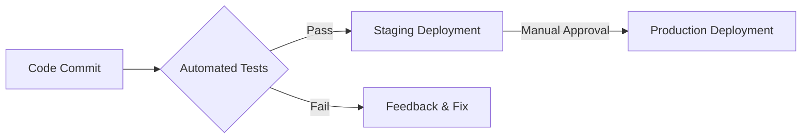
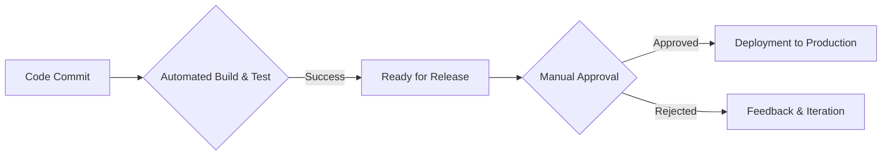
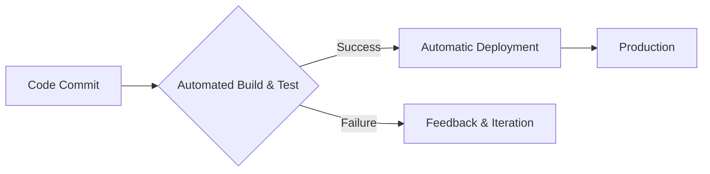
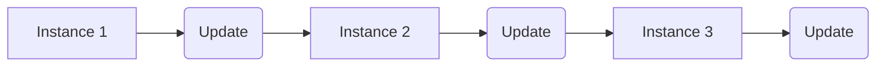
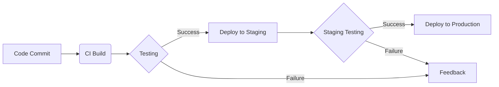
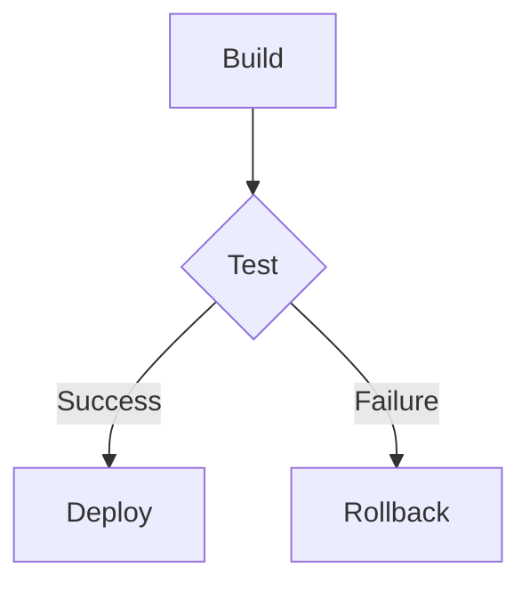

# <span style="color:#e67e22;">What we will learn in this post?</span>
<ul style='list-style-type: none; padding-left: 0;'>
<li><span style='color: #2980b9; font-size: 20px; font-weight: bold;'>👉</span> <span style='color: #2ecc71; font-size: 18px; font-weight: bold;'>Concepts of Continuous Delivery and Deployment</span></li>
<li><span style='color: #2980b9; font-size: 20px; font-weight: bold;'>👉</span> <span style='color: #2ecc71; font-size: 18px; font-weight: bold;'>Difference Between Continuous Delivery and Deployment</span></li>
<li><span style='color: #2980b9; font-size: 20px; font-weight: bold;'>👉</span> <span style='color: #2ecc71; font-size: 18px; font-weight: bold;'>Deployment Strategies: Blue-Green, Canary, and Rolling Updates</span></li>
<li><span style='color: #2980b9; font-size: 20px; font-weight: bold;'>👉</span> <span style='color: #2ecc71; font-size: 18px; font-weight: bold;'>Introduction to CD Tools (ArgoCD, Spinnaker, GitLab CI/CD)</span></li>
<li><span style='color: #2980b9; font-size: 20px; font-weight: bold;'>👉</span> <span style='color: #2ecc71; font-size: 18px; font-weight: bold;'>Hands-On with Deployment Pipelines</span></li>
<li><span style='color: #2980b9; font-size: 20px; font-weight: bold;'>👉</span> <span style='color: #2ecc71; font-size: 18px; font-weight: bold;'>Conclusion!</span></li>
</ul>

# <span style="color:#e67e22">Continuous Delivery (CD) vs. Continuous Deployment</span> 📦🚀

Let's explore two powerful software development practices: Continuous Delivery (CD) and Continuous Deployment.  Both aim to get your software into users' hands faster and more reliably, but they differ in *how* they achieve this.

## <span style="color:#2980b9">Continuous Delivery (CD): Automating the Release Process</span> ⚙️

Continuous Delivery focuses on automating *everything* involved in releasing software, *except* for the final deployment to production.  Think of it as preparing your software for launch – rigorously testing, building, and packaging it – but waiting for the "go" signal before actually pushing it live.

### <span style="color:#8e44ad">Key Features of CD:</span>

*   Automated builds and testing: Every code change triggers automated tests.
*   Automated deployments to staging environments: A near-identical copy of production, used for final testing.
*   Manual approval before production deployment:  A human reviews and approves before going live.


**Example:** Imagine an e-commerce website. With CD, every code update goes through automated tests.  Once passed, it's deployed to a staging environment for final checks (visual inspection, performance testing).  After manual approval, it's deployed to production.

## <span style="color:#2980b9">Continuous Deployment: Automating Everything!</span> 🤖

Continuous Deployment takes CD a step further by automating the *entire* release pipeline, including the final deployment to production.  Once the automated tests pass, the software is automatically deployed.

### <span style="color:#8e44ad">Key Features of Continuous Deployment:</span>

*   Everything automated: From code commit to production deployment.
*   Requires robust automated testing: Crucial for preventing bugs from reaching production.
*   High frequency releases:  New features and bug fixes are constantly deployed.

**Example:** A mobile app using continuous deployment might automatically deploy a new version to app stores after successful automated testing. Users get the latest improvements instantly.


## <span style="color:#2980b9">Key Differences Summarized:</span> 📊

| Feature          | Continuous Delivery                     | Continuous Deployment                    |
|-----------------|------------------------------------------|-----------------------------------------|
| Deployment       | Manual approval required                 | Automatic deployment                     |
| Risk            | Lower risk due to manual gate             | Higher risk, requires strong testing      |
| Release Frequency | Less frequent                           | Very frequent (even multiple times/day) |


**Diagram:**



**Resources:**

* [Learn more about Continuous Integration/Continuous Delivery](https://www.atlassian.com/continuous-delivery)
* [Understanding Continuous Deployment](https://www.redhat.com/en/topics/devops/what-is-continuous-deployment)

Remember that choosing between CD and Continuous Deployment depends on your project's specific needs and risk tolerance.  A robust testing suite is paramount for both.


# <span style="color:#e67e22">Continuous Delivery vs. Continuous Deployment: What's the Difference? 🚀</span>

Both Continuous Delivery (CD) and Continuous Deployment are about getting software to users faster, but they differ in *how* they do it.  Think of it like this: CD is getting your car ready for a road trip, while Continuous Deployment is actually hitting the road!


## <span style="color:#2980b9">Continuous Delivery (CD): Ready to Go! 🚦</span>

### <span style="color:#8e44ad">The Process</span>

*   Automated builds, testing, and release preparation.
*   Code is always in a *deployable* state.
*   **Manual approval** is required before releasing to production.  This is the key difference!




## <span style="color:#2980b9">Continuous Deployment: Hitting the Road! 🚗💨</span>

### <span style="color:#8e44ad">The Process</span>

*   Automated builds, testing, and *automatic* deployment to production.
*   No manual intervention is needed after code is committed.
*   *Faster release cycles*, but requires a robust automated testing strategy.




## <span style="color:#2980b9">Which One Should You Choose? 🤔</span>

*   **Continuous Delivery:**  Best for industries with strict regulatory compliance or where high-risk features need careful review before release (e.g., finance, healthcare).
*   **Continuous Deployment:** Ideal for companies with a strong testing culture, frequent small releases, and a fast-moving market (e.g., SaaS, web applications).

**Impact on Release Cycle:** Continuous Deployment significantly shortens the release cycle, leading to faster feedback loops and quicker user adoption.  Continuous Delivery prioritizes stability and control, making it a more suitable choice for risk-averse environments.


[Learn more about Continuous Delivery](https://www.atlassian.com/continuous-delivery)

[Learn more about Continuous Deployment](https://www.atlassian.com/continuous-delivery/continuous-deployment)


Remember, choosing the right approach depends on your specific context and priorities.  Both methods aim to improve software delivery speed and quality – just in different ways!


# <span style="color:#e67e22">Deployment Strategies: Minimizing Downtime & Risk 🚀</span>

Deploying new software versions can be tricky!  Here are some common strategies to make it smoother:


## <span style="color:#2980b9">Blue-Green Deployments 🔄</span>

Imagine two identical environments: Blue (live) and Green (staging).  
### <span style="color:#8e44ad">How it works:</span>
*   Deploy the new version to the Green environment.
*   Thoroughly test it.
*   Switch all traffic from Blue to Green.
*   If problems arise, quickly switch back to Blue.


```mermaid
graph LR
    A[Blue (Live)] --> B{Test Green};
    B -- Pass --> C[Switch Traffic];
    B -- Fail --> A;
    C --> D[Green (Live)];
```

*   **Example:** A major website update.  Switching minimizes downtime.


## <span style="color:#2980b9">Canary Deployments 🐦</span>

Release your update gradually to a small subset of users first.
### <span style="color:#8e44ad">How it works:</span>
*   Deploy to a small group (e.g., 5% of users).
*   Monitor closely for bugs or performance issues.
*   Gradually increase the rollout if all is well.

*   **Example:** A new feature in a mobile app.  Identifying issues early avoids widespread problems.


## <span style="color:#2980b9">Rolling Updates 🔄</span>

Gradually update your application across all users without complete downtime.
### <span style="color:#8e44ad">How it works:</span>
* Update instances one by one.
* Monitor each update's health.
* Rollback if necessary.




*   **Example:** A backend service update.  Minimizes service disruption during the upgrade.

**Key Differences Summarized:**

| Strategy       | Description                                          | Risk Mitigation                                    | Example                                      |
|-----------------|------------------------------------------------------|---------------------------------------------------|-------------------------------------------------|
| Blue-Green     | Switch traffic between identical environments        | Quick rollback if issues arise                     | Website updates                               |
| Canary         | Rollout to a small subset of users                   | Early detection of bugs and performance issues     | New app features                               |
| Rolling Updates | Gradual update across all users                       | Minimized downtime and service disruption         | Backend service updates                         |


Choosing the right strategy depends on your application's complexity, the risk tolerance, and the impact of downtime.  Remember to always thoroughly test before deploying to production!


[More info on Deployment Strategies](https://www.google.com/search?q=software+deployment+strategies)


# <span style="color:#e67e22">Popular Continuous Delivery (CD) Tools</span> 🚢🚀

Automating deployments is key to modern software development. Let's explore three popular Continuous Delivery (CD) tools: Argo CD, Spinnaker, and GitLab CI/CD.


## <span style="color:#2980b9">Argo CD: The GitOps Master 🧙‍♂️</span>

Argo CD champions the *GitOps* philosophy – treating your Git repository as the single source of truth for your application's infrastructure.  It continuously monitors your Git repository and automatically deploys changes to your Kubernetes cluster.

### <span style="color:#8e44ad">Strengths:</span>
*   **GitOps focused:**  Simple, declarative, and auditable deployments.
*   Excellent Kubernetes integration.
*   Easy rollback and version control.

### <span style="color:#8e44ad">Use Case:</span> Managing configuration and deployments across multiple microservices in a large-scale Kubernetes environment.


## <span style="color:#2980b9">Spinnaker: Multi-Cloud Superhero 🦸‍♂️</span>

Spinnaker is a powerful, flexible platform designed for multi-cloud deployments. It supports various cloud providers (AWS, Google Cloud, Azure) and orchestrators (Kubernetes, etc.).

### <span style="color:#8e44ad">Strengths:</span>
*   Multi-cloud support: Deploy to various environments seamlessly.
*   Advanced deployment strategies (canary, blue/green).
*   Extensive integrations and extensibility.

### <span style="color:#8e44ad">Use Case:</span> Deploying and managing a globally distributed application across multiple cloud providers and regions.


## <span style="color:#2980b9">GitLab CI/CD: The All-in-One Solution 🧰</span>

GitLab CI/CD is tightly integrated with the GitLab platform, offering a complete DevOps lifecycle solution. It simplifies the entire pipeline, from code commit to deployment.

### <span style="color:#8e44ad">Strengths:</span>
*   Ease of use: Simple setup and configuration.
*   Tight GitLab integration: Streamlined workflow.
*   Scalable: Handles large projects and teams.

### <span style="color:#8e44ad">Use Case:</span>  Managing a project's entire CI/CD pipeline within a single platform, ideal for smaller to medium-sized teams.


**Choosing the right tool depends on your specific needs and infrastructure.**  Consider factors like team size, cloud strategy, existing tools, and desired level of automation.


---

**Further Resources:**

*   Argo CD: [https://argoproj.io/projects/argo-cd/](https://argoproj.io/projects/argo-cd/)
*   Spinnaker: [https://www.spinnaker.io/](https://www.spinnaker.io/)
*   GitLab CI/CD: [https://about.gitlab.com/solutions/ci-cd/](https://about.gitlab.com/solutions/ci-cd/)


---

**Example Workflow (Simplified):**




# <span style="color:#e67e22">Setting up a Simple Deployment Pipeline with GitLab CI/CD 🎉</span>

Let's build a basic deployment pipeline using GitLab CI/CD.  This guide focuses on simplicity and clarity.

## <span style="color:#2980b9">Defining the Pipeline Stages ⚙️</span>

Our pipeline will have three main stages: *build*, *test*, and *deploy*.  We'll use a `.gitlab-ci.yml` file to define these.

### <span style="color:#8e44ad">Build Stage 🧱</span>

This stage compiles your code.  Example `.gitlab-ci.yml` snippet:

```yaml
build:
  stage: build
  script:
    - npm install
    - npm run build
  artifacts:
    paths:
      - dist/
```

### <span style="color:#8e44ad">Test Stage 🧪</span>

This stage runs tests to ensure code quality.

```yaml
test:
  stage: test
  script:
    - npm test
  needs:
    - build
```

### <span style="color:#8e44ad">Deploy Stage 🚀</span>

This stage deploys your built application.  *(Replace placeholders with your actual deployment commands)*

```yaml
deploy:
  stage: deploy
  script:
    - aws s3 sync dist/ s3://your-bucket/
  environment:
    name: production
  only:
    - main
```

## <span style="color:#2980b9">Versioning & Rollbacks 🔄</span>

*   **Versioning:** Use Git tags (e.g., `v1.0.0`) to track releases.  This allows easy rollback.
*   **Rollbacks:** GitLab CI/CD allows you to re-deploy previous versions from the tags.  You might also consider using environment variables to manage different deployments.

## <span style="color:#2980b9">Monitoring 👀</span>

*   Integrate with monitoring tools like Prometheus or Datadog for real-time insights into your application's health.
*   Set up alerts for critical issues.

## <span style="color:#2980b9">Visual Representation 📊</span>



**Remember**: This is a simplified example.  Adjust the commands and configurations to match your specific project and deployment environment.

[GitLab CI/CD Documentation](https://docs.gitlab.com/ee/ci/)


This guide provides a basic framework. More complex pipelines might include stages for database migrations, canary deployments, and more advanced rollback strategies.  Explore the linked documentation for advanced features.


<h1><span style='color:#e67e22'>Conclusion</span></h1>

So there you have it!  We've covered a lot of ground today, and hopefully, you found this information helpful and insightful. 😊  We're always striving to improve, and your feedback is incredibly valuable to us.  What did you think?  Did we miss anything?  Let us know your thoughts, comments, and suggestions in the comments section below! 👇 We'd love to hear from you!  Let's keep the conversation going! 🤗


