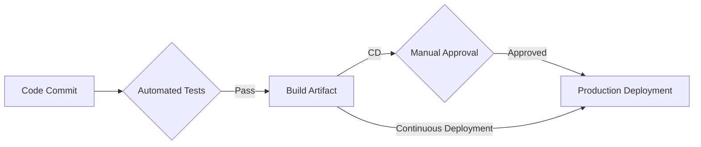
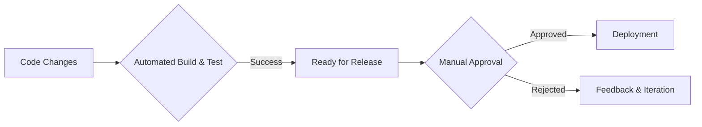
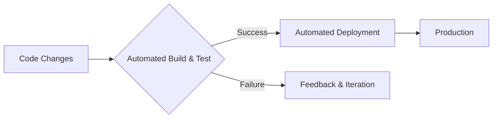
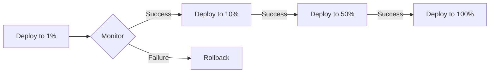
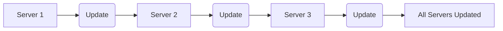
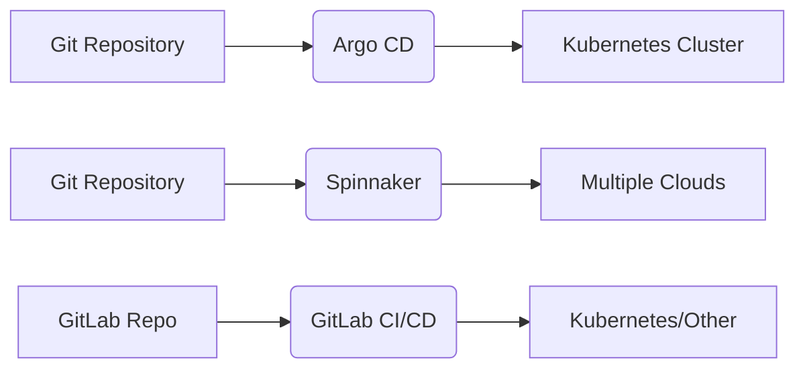
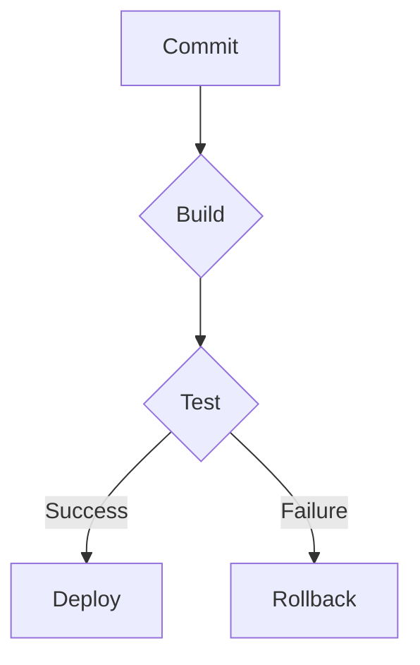

# <span style="color:#e67e22;">What we will learn in this post?</span>
<ul style='list-style-type: none; padding-left: 0;'>
<li><span style='color: #2980b9; font-size: 20px; font-weight: bold;'>👉</span> <span style='color: #2ecc71; font-size: 18px; font-weight: bold;'>Concepts of Continuous Delivery and Deployment</span></li>
<li><span style='color: #2980b9; font-size: 20px; font-weight: bold;'>👉</span> <span style='color: #2ecc71; font-size: 18px; font-weight: bold;'>Difference Between Continuous Delivery and Deployment</span></li>
<li><span style='color: #2980b9; font-size: 20px; font-weight: bold;'>👉</span> <span style='color: #2ecc71; font-size: 18px; font-weight: bold;'>Deployment Strategies: Blue-Green, Canary, and Rolling Updates</span></li>
<li><span style='color: #2980b9; font-size: 20px; font-weight: bold;'>👉</span> <span style='color: #2ecc71; font-size: 18px; font-weight: bold;'>Introduction to CD Tools (ArgoCD, Spinnaker, GitLab CI/CD)</span></li>
<li><span style='color: #2980b9; font-size: 20px; font-weight: bold;'>👉</span> <span style='color: #2ecc71; font-size: 18px; font-weight: bold;'>Hands-On with Deployment Pipelines</span></li>
<li><span style='color: #2980b9; font-size: 20px; font-weight: bold;'>👉</span> <span style='color: #2ecc71; font-size: 18px; font-weight: bold;'>Conclusion!</span></li>
</ul>

# <span style="color:#e67e22">Continuous Delivery (CD) vs. Continuous Deployment</span> 📦🚀

Let's explore two powerful concepts that help software teams release better software faster: Continuous Delivery (CD) and Continuous Deployment.


## <span style="color:#2980b9">Continuous Delivery (CD):  Automating the Release Process</span> ⚙️

Continuous Delivery focuses on *automating* the entire software release process.  Think of it as getting your software ready for release, but *not automatically deploying it*.  This means:

*   Code is constantly integrated, tested, and built.
*   A deployable artifact is created at any point.
*   Deployment to production is possible at any moment, but usually requires manual approval.

This ensures that software is always in a releasable state.  If something needs to go live quickly, it's ready.

### <span style="color:#8e44ad">CD Example:</span>
Imagine a team working on an e-commerce website.  They use CD.  Every code change passes automated tests and builds a deployable package.  When a new feature is ready, they manually approve its deployment to production after a final review.


## <span style="color:#2980b9">Continuous Deployment: Automating Everything!</span> 🤖

Continuous Deployment goes a step further. It *automates the entire process*, including deployment to production.  Once code passes all tests, it's automatically released.

*   Everything is automated from code commit to production.
*   Faster feedback loops and quicker releases to users.
*   Requires robust automated testing to ensure stability.


### <span style="color:#8e44ad">Continuous Deployment Example:</span>
A small SaaS company using Continuous Deployment releases new features to its users multiple times a day automatically. Every commit that passes all tests, including automated UI tests, is deployed.


## <span style="color:#2980b9">Key Differences Summarized:</span> 📝

| Feature          | Continuous Delivery                               | Continuous Deployment                             |
|-----------------|----------------------------------------------------|-------------------------------------------------|
| Deployment       | Manual approval required                          | Automatic deployment                            |
| Risk             | Lower risk, manual gate for production release | Higher risk, requires extremely robust testing |
| Speed            | Faster releases than traditional methods        | Fastest releases possible                        |
| Complexity      | Moderately complex to implement                   | More complex to implement, requires advanced CI/CD |


## <span style="color:#2980b9">Visual Representation (Simplified Workflow):</span>




**Resources:**

*   [Learn more about Continuous Delivery](https://www.atlassian.com/continuous-delivery)
*   [Learn more about Continuous Deployment](https://www.redhat.com/en/topics/devops/what-is-continuous-deployment)


Remember, choosing between CD and Continuous Deployment depends on your team's size, project requirements, and risk tolerance.  Both are valuable for accelerating software delivery!


# <span style="color:#e67e22">Continuous Delivery vs. Continuous Deployment: What's the Difference?</span> 🚢🚀

Both Continuous Delivery (CD) and Continuous Deployment are ways to get your software to users faster, but they differ in *how* they do it. Think of it like this:  CD is getting your car ready for a road trip, while Continuous Deployment is actually taking that road trip.

## <span style="color:#2980b9">Continuous Delivery (CD): Ready to Go!</span> 🚦

CD automates the process of building, testing, and releasing your software.  This ensures your code is *always* ready for production.  However, before it goes live, a human needs to give the final "thumbs up."  This manual approval step is crucial for added control and risk mitigation.

### <span style="color:#8e44ad">CD Process Flow</span>



*   **Pros:**  Increased control, reduced risk, better quality assurance.
*   **Cons:** Slower release cycles compared to Continuous Deployment.


## <span style="color:#2980b9">Continuous Deployment:  Hitting the Road!</span> 🚗💨

Continuous Deployment takes CD a step further. Once the automated testing is complete, the code is *automatically* deployed to production *without* human intervention. This drastically speeds up the release cycle.

### <span style="color:#8e44ad">Continuous Deployment Process Flow</span>



*   **Pros:** Fastest release cycles, increased agility.
*   **Cons:** Higher risk of deploying buggy code if testing isn't thorough enough.


## <span style="color:#2980b9">Which One Should You Choose?</span> 🤔

The best choice depends on your project's needs and risk tolerance.

*   **Choose CD if:** You need more control, work with sensitive data, or have a complex release process.
*   **Choose Continuous Deployment if:** You have a robust testing pipeline, prioritize speed, and your application can handle minor issues gracefully.


**In short:** CD is about *being ready*, while Continuous Deployment is about *going live*. Both are valuable practices for efficient software delivery, but they serve different priorities.


[Learn more about Continuous Delivery](https://www.atlassian.com/continuous-delivery)

[Learn more about Continuous Deployment](https://www.atlassian.com/continuous-delivery/continuous-deployment)


# <span style="color:#e67e22">Deployment Strategies: Minimizing Downtime & Risk 🚀</span>

Software deployment can be tricky!  These strategies help make it smoother and safer:

## <span style="color:#2980b9">Blue-Green Deployment 🔵🟢</span>

Imagine two identical environments: "Blue" (live) and "Green" (staging).  With Blue-Green, you deploy your new version to the *Green* environment. Once testing is complete, you *switch the traffic* from Blue to Green.  If something goes wrong, you simply switch back!

### <span style="color:#8e44ad">Example:</span>
A banking app updates its payment gateway.  They deploy the update to Green, test thoroughly, and then redirect all user traffic to Green.  If issues arise, traffic is quickly switched back to Blue.

[Learn more about Blue-Green Deployments](https://www.nginx.com/blog/blue-green-deployments/)


```mermaid
graph LR
    A[Live (Blue)] --> B{Testing Complete?};
    B -- Yes --> C[Switch Traffic];
    C --> D[Live (Green)];
    B -- No --> E[Rollback to Blue];
```


## <span style="color:#2980b9">Canary Deployment  Canary 🐤</span>

This is like a gradual release. You deploy the new version to a *small subset of users* (your "canary"). You monitor their experience closely. If all's well, you gradually roll it out to more users.  If problems occur, you can quickly halt the rollout.

### <span style="color:#8e44ad">Example:</span>
A social media platform releases a new UI. They deploy it to 1% of users. After monitoring for bugs, they increase it to 10%, then 50%, and finally 100% if all is good.

[Learn more about Canary Deployments](https://martinfowler.com/bliki/CanaryRelease.html)





## <span style="color:#2980b9">Rolling Update 🔄</span>

Here, you update your application *incrementally*, one server or a small group of servers at a time.  New versions are gradually deployed to all users with minimal disruption.  Traffic is shifted gradually as each update is verified.

### <span style="color:#8e44ad">Example:</span>
An e-commerce site updates its product catalog.  It updates a few servers, monitors performance, then updates more, continuing until all servers are running the new version.

[Learn more about Rolling Updates](https://kubernetes.io/docs/concepts/workloads/controllers/rolling-update/)




These strategies, when used correctly, drastically reduce downtime and the risks associated with software releases. Choosing the right strategy depends on your application's complexity, user base, and risk tolerance.  Remember to always test thoroughly!


# <span style="color:#e67e22">Popular Continuous Delivery (CD) Tools: A Quick Look 🚀</span>

Continuous Delivery (CD) automates the release process, making deployments faster and less error-prone.  Let's explore some popular tools:

## <span style="color:#2980b9">Argo CD 🚢</span>

Argo CD is a *GitOps* tool.  This means it uses Git as the single source of truth for your application's desired state.  Argo CD constantly monitors your Git repository and automatically updates your Kubernetes cluster to match.

### <span style="color:#8e44ad">Strengths:</span>
*   **GitOps:**  Simple, declarative, and auditable deployments.
*   **Kubernetes focused:** Excellent integration with Kubernetes.

### <span style="color:#8e44ad">Use Case:</span> Managing a complex microservices architecture on Kubernetes, ensuring consistent configurations across environments.


## <span style="color:#2980b9">Spinnaker ⛵</span>

Spinnaker is a powerful, multi-cloud CD platform. It supports deployments across various cloud providers (AWS, Azure, GCP, etc.) and integrates well with Kubernetes.

### <span style="color:#8e44ad">Strengths:</span>
*   **Multi-cloud support:** Deploy to multiple clouds from a single interface.
*   **Mature platform:** Robust and feature-rich.

### <span style="color:#8e44ad">Use Case:</span>  Managing deployments across a hybrid cloud infrastructure, ensuring consistency and minimizing downtime.


## <span style="color:#2980b9">GitLab CI/CD ⚙️</span>

GitLab CI/CD is a fully integrated CD solution within the GitLab platform.  It's easy to set up and use, especially for projects already using GitLab.

### <span style="color:#8e44ad">Strengths:</span>
*   **Ease of use:** Simple configuration and integration with GitLab.
*   **All-in-one platform:**  Manage your entire DevOps lifecycle within GitLab.

### <span style="color:#8e44ad">Use Case:</span>  Small to medium-sized projects needing a streamlined CD pipeline without the complexity of separate tools.


## <span style="color:#2980b9">Choosing the Right Tool 🤔</span>

The best tool depends on your specific needs:

*   **Argo CD:** Ideal for Kubernetes-centric GitOps workflows.
*   **Spinnaker:** Best for multi-cloud deployments and complex scenarios.
*   **GitLab CI/CD:**  A great choice for simpler projects within the GitLab ecosystem.


[Learn more about Argo CD](https://argoproj.io/docs/argo-cd/)
[Learn more about Spinnaker](https://www.spinnaker.io/)
[Learn more about GitLab CI/CD](https://docs.gitlab.com/ee/ci/)





# <span style="color:#e67e22">Setting up a Simple Deployment Pipeline ⚙️</span>

Let's build a basic deployment pipeline using GitLab CI/CD.  It's easy! We'll focus on three key stages: building, testing, and deploying.


## <span style="color:#2980b9">Defining the Stages 🧱</span>

We'll use a `.gitlab-ci.yml` file to define our pipeline. This file tells GitLab CI what to do.


### <span style="color:#8e44ad">Building 🏗️</span>

This stage compiles your code.  Here's a simple example:

```yaml
build:
  stage: build
  script:
    - npm install
    - npm run build
  artifacts:
    paths:
      - dist/
```

This uses `npm`, but adjust for your project's needs.  The `artifacts` section saves the built files.


### <span style="color:#8e44ad">Testing 🧪</span>

This stage runs your tests to ensure code quality.

```yaml
test:
  stage: test
  script:
    - npm test
  needs:
    - build
```

The `needs` section ensures tests run *after* the build.


### <span style="color:#8e44ad">Deploying 🚀</span>

This stage deploys to your server (replace placeholders below!):

```yaml
deploy:
  stage: deploy
  script:
    - scp dist/* user@server:/path/to/deploy/
  environment:
    name: production
  only:
    - main
```

This uses `scp` – you might use other tools. `only: main` means it only deploys from the `main` branch.


## <span style="color:#2980b9">Versioning, Rollbacks & Monitoring 🔄️</span>

*   **Versioning:** Use semantic versioning (e.g., `1.0.0`, `1.0.1`) for your releases.  Git tags help manage versions.
*   **Rollbacks:** Store previous deployments (e.g., using a separate directory).  In case of issues, you can revert to a prior version.
*   **Monitoring:** Tools like Prometheus and Grafana can help track your application's health and performance after deployment.


## <span style="color:#2980b9">Diagram 📊</span>



This shows a simple pipeline flow. For more detailed information on GitLab CI/CD, refer to [their documentation](https://docs.gitlab.com/ee/ci/).  Remember to adapt these examples to your specific technology stack and deployment environment.


<h1><span style='color:#e67e22'>Conclusion</span></h1>

So there you have it!  We've covered a lot of ground today, and hopefully, you found this information helpful and interesting. 😊  We're always looking to improve, so we'd love to hear your thoughts!  What did you think of this post?  Any questions, comments, or suggestions?  Let us know in the comments section below – we're all ears (and eyes!) 👇  Your feedback helps us create even better content for you in the future.  Thanks for reading! 🎉


