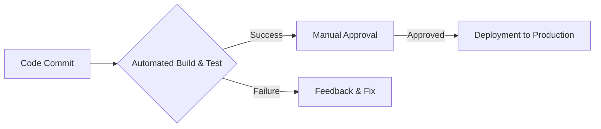
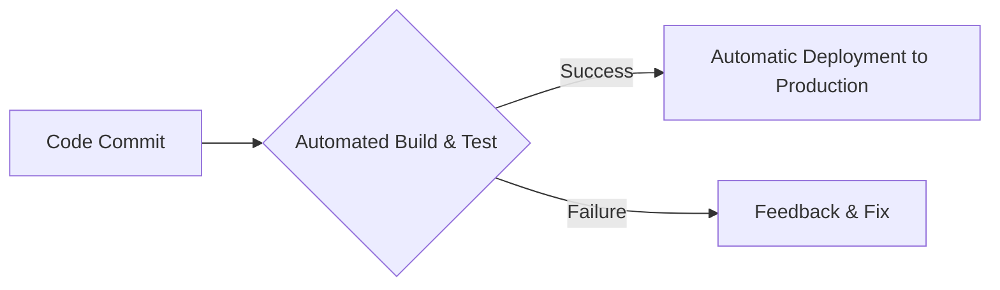
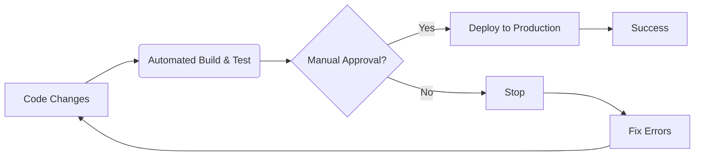
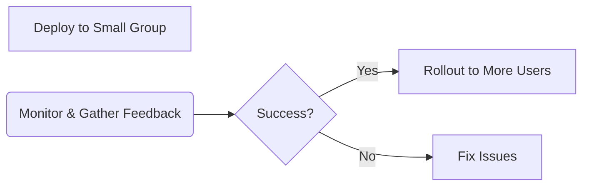
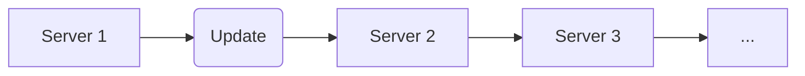
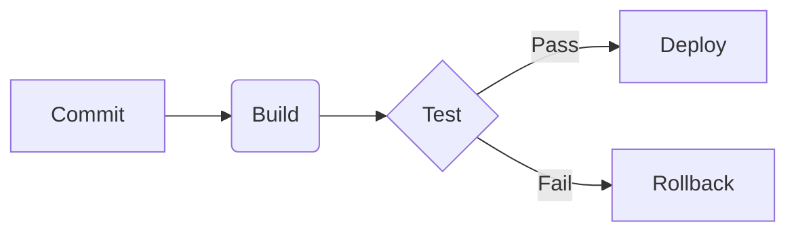

# <span style="color:#e67e22;">What we will learn in this post?</span>
<ul style='list-style-type: none; padding-left: 0;'>
<li><span style='color: #2980b9; font-size: 20px; font-weight: bold;'>👉</span> <span style='color: #2ecc71; font-size: 18px; font-weight: bold;'>Concepts of Continuous Delivery and Deployment</span></li>
<li><span style='color: #2980b9; font-size: 20px; font-weight: bold;'>👉</span> <span style='color: #2ecc71; font-size: 18px; font-weight: bold;'>Difference Between Continuous Delivery and Deployment</span></li>
<li><span style='color: #2980b9; font-size: 20px; font-weight: bold;'>👉</span> <span style='color: #2ecc71; font-size: 18px; font-weight: bold;'>Deployment Strategies: Blue-Green, Canary, and Rolling Updates</span></li>
<li><span style='color: #2980b9; font-size: 20px; font-weight: bold;'>👉</span> <span style='color: #2ecc71; font-size: 18px; font-weight: bold;'>Introduction to CD Tools (ArgoCD, Spinnaker, GitLab CI/CD)</span></li>
<li><span style='color: #2980b9; font-size: 20px; font-weight: bold;'>👉</span> <span style='color: #2ecc71; font-size: 18px; font-weight: bold;'>Hands-On with Deployment Pipelines</span></li>
<li><span style='color: #2980b9; font-size: 20px; font-weight: bold;'>👉</span> <span style='color: #2ecc71; font-size: 18px; font-weight: bold;'>Conclusion!</span></li>
</ul>

# <span style="color:#e67e22">Continuous Delivery (CD) vs. Continuous Deployment 🚀</span>

Let's explore two powerful software development practices: Continuous Delivery (CD) and Continuous Deployment.  They both aim to get your software into users' hands faster and more reliably, but they differ in *how* they achieve this.

## <span style="color:#2980b9">Continuous Delivery (CD) ⚙️</span>

Continuous Delivery focuses on automating the *release process*.  Think of it as building a super-efficient highway for your software to travel from development to production.  It ensures that your software is *always* ready to be deployed, but it doesn't automatically deploy it.  A manual approval step is required before the software goes live.

### <span style="color:#8e44ad">CD in Action</span>

Imagine an e-commerce company using CD. They frequently push code updates to a staging environment, thoroughly testing every change. Once testing is complete and the team approves, they manually trigger the deployment to production.  This ensures high quality and minimizes risk.

**Key features:**

*   Automated build, test, and release processes.
*   Manual approval before production deployment.
*   Frequent releases, but not necessarily automatic.


## <span style="color:#2980b9">Continuous Deployment 🤖</span>

Continuous Deployment takes automation a step further.  It automates *everything*—from code commits to production deployment. Once code passes all automated tests, it's automatically deployed to production without human intervention.

### <span style="color:#8e44ad">Continuous Deployment Example</span>

A SaaS company offering a simple web app might utilize Continuous Deployment. Every code push that passes automated tests automatically deploys the latest version to their live servers. Users immediately experience new features and bug fixes.


**Key features:**

*   Automated deployment to production.
*   Requires robust automated testing.
*   High frequency of releases.


## <span style="color:#2980b9">Key Differences: CD vs. Deployment</span>

| Feature          | Continuous Delivery (CD) | Continuous Deployment      |
|-----------------|---------------------------|-----------------------------|
| Deployment       | Manual                   | Automatic                    |
| Risk             | Lower                      | Higher (requires robust testing)|
| Release Frequency | Frequent                  | Very Frequent                |
| Human Intervention | Required                 | Minimal                      |


## <span style="color:#2980b9">Workflow Diagrams</span>

**Continuous Delivery:**



**Continuous Deployment:**




For more information:

*   [Continuous Delivery](https://www.atlassian.com/continuous-delivery)
*   [Continuous Deployment](https://www.atlassian.com/continuous-deployment)


Remember, the best approach depends on your specific context, risk tolerance, and application complexity.  Choose the strategy that best suits your needs!


# <span style="color:#e67e22">Continuous Delivery vs. Continuous Deployment: What's the Difference? 🤔</span>

Both Continuous Delivery (CD) and Continuous Deployment are about automating the software release process, but they differ in one crucial aspect: *human intervention*.

## <span style="color:#2980b9">Continuous Delivery:  Always Ready 🚀</span>

Continuous Delivery automates the build, testing, and release process, ensuring your code is *always* ready for production.  However, *it requires a manual approval* before the code is actually deployed. Think of it as having your car fully fueled and ready for a road trip, but you still decide when to hit the gas.

### <span style="color:#8e44ad">How it works:</span>
*   Code changes are automatically built, tested (unit, integration, etc.), and packaged.
*   The deployment process is automated, creating a deployable artifact.
*   **A human approves** the deployment to production.


## <span style="color:#2980b9">Continuous Deployment: Automatic Releases 🤖</span>

Continuous Deployment takes Continuous Delivery a step further.  Once the code passes all automated tests, it's *automatically deployed* to production *without any human intervention*.  It's like setting your cruise control and letting the car drive itself.

### <span style="color:#8e44ad">How it works:</span>
*   Same as CD: automated build, testing, and packaging.
*   **Automatic deployment** to production after successful testing.
*   No manual approval needed.


## <span style="color:#2980b9">Which one should you choose? 🤔</span>

The best approach depends on your specific context:

*   **Continuous Delivery:**  Ideal for situations requiring more control and oversight, such as regulated industries (finance, healthcare) or projects with complex deployments.  It allows for a safety net before releasing to the public.
*   **Continuous Deployment:** Best suited for projects with high confidence in automated tests and a low risk of bugs impacting users. It enables faster releases and quicker feedback loops.


## <span style="color:#2980b9">Impact on Release Cycle ⏱️</span>

*   **CD:**  Faster releases than traditional methods, but still slightly slower than CD because of manual approvals.
*   **CD:** Enables frequent releases with reduced risk.
*   **CD:**  Faster feedback cycles than traditional approaches.

**Note:**  Both approaches significantly reduce the time and effort required for releases compared to traditional methods.




*(This diagram represents Continuous Delivery. For Continuous Deployment, remove the "Manual Approval?" decision point.)*


For more information:

* [Continuous Delivery](https://www.atlassian.com/continuous-delivery)
* [Continuous Deployment](https://www.atlassian.com/continuous-deployment)


Remember, the right choice depends on your team's capabilities, risk tolerance, and project requirements.  Start with Continuous Delivery and gradually move towards Continuous Deployment as your confidence and automation grow.


# <span style="color:#e67e22">Deployment Strategies: Minimizing Downtime & Risk 🚀</span>

Deploying new software updates can be tricky!  Luckily, there are several strategies to make it smoother and safer. Let's explore three popular methods:

## <span style="color:#2980b9">Blue-Green Deployments 🔄</span>

Imagine you have two identical environments: Blue (live) and Green (staging).  

### <span style="color:#8e44ad">How it Works</span>

*   You deploy the new version to the Green environment.
*   Once testing is complete, you switch all traffic from Blue to Green.
*   If problems arise, you can quickly switch back to Blue.

**Advantages:** *Minimal downtime*, *easy rollback*.

**Example:** A banking app updating its user interface.


```mermaid
graph LR
    A[Blue (Live)] --> B(Traffic);
    C[Green (Staging)] --> D(New Version Deployed);
    E[Switch Traffic] --> F[Green (Live)];
```

## <span style="color:#2980b9">Canary Deployments  Canary 🐦</span>

This strategy releases your update to a small group of users first – your "canaries".

### <span style="color:#8e44ad">How it Works</span>

*   Deploy the new version to a small percentage of users.
*   Monitor performance and gather feedback.
*   Gradually roll out to more users if everything looks good.

**Advantages:** *Reduced risk*, *early feedback*.

**Example:** A social media platform introducing a new feature to a small subset of its users before a full launch.





## <span style="color:#2980b9">Rolling Updates 🔄</span>

This is a gradual deployment across all users.

### <span style="color:#8e44ad">How it Works</span>

*   Update servers one at a time or in small batches.
*   Monitor each update before moving to the next.
*   Allows for a smooth transition with minimal disruption.

**Advantages:** *Low downtime*, *easy rollback for individual servers*.

**Example:** A game server updating its backend with minimal interruption.




**Choosing the Right Strategy:** The best approach depends on your specific application, risk tolerance, and technical capabilities.  Each strategy offers different levels of risk and control.


[More info on Deployment Strategies](https://www.google.com/search?q=software+deployment+strategies)


# <span style="color:#e67e22">Popular Continuous Delivery (CD) Tools</span> 🚢

Continuous Delivery (CD) automates the release process, getting your software from code to production smoothly.  Let's explore some popular tools:

## <span style="color:#2980b9">Argo CD 🐙</span>

Argo CD champions the *GitOps* approach. This means your deployment configuration lives in Git, and Argo CD ensures your Kubernetes cluster reflects that configuration.  Changes in Git trigger automatic updates.

### <span style="color:#8e44ad">Strengths:</span>
* **Declarative:** Define your desired state, and Argo CD makes it happen.
* **GitOps focused:** Version control and auditability are baked in.
* **Excellent Kubernetes integration:**  Seamlessly manages deployments, rollbacks, and more.


## <span style="color:#2980b9">Spinnaker ⛵</span>

Spinnaker is a powerful, multi-cloud CD platform.  It handles deployments across various cloud providers (AWS, GCP, Azure, etc.) and orchestrators (Kubernetes, etc.).

### <span style="color:#8e44ad">Strengths:</span>
* **Multi-cloud support:** Deploy to multiple environments without vendor lock-in.
* **Advanced features:** Canary deployments, blue/green deployments, and more sophisticated release strategies.
* **Extensible:**  Customizable pipelines for complex workflows.


## <span style="color:#2980b9">GitLab CI/CD ⚙️</span>

GitLab CI/CD is integrated directly into GitLab, simplifying the workflow from code commit to deployment.  It's user-friendly and easily integrates with Kubernetes using Helm.

### <span style="color:#8e44ad">Strengths:</span>
* **Ease of use:** Simple setup and configuration.
* **Complete DevOps lifecycle:**  Supports the entire DevOps process within a single platform.
* **Cost-effective:** Often included with GitLab's core features.


## <span style="color:#2980b9">Use Cases & Large-Scale Deployments</span>

These tools excel in managing large-scale deployments by:

* **Automating rollouts:**  Ensuring consistent and reliable deployments across many nodes.
* **Managing complex deployments:** Handling intricate dependencies and release strategies.
* **Improving release velocity:**  Faster, more frequent releases with reduced risk.

**Example:**  Imagine deploying a microservice architecture.  Argo CD could manage the individual services' deployments based on their Git repos, Spinnaker could orchestrate cross-cloud deployments if needed, and GitLab CI/CD could handle testing and deployment for simpler services.

**Resources:**

* [Argo CD](https://argoproj.io/docs/argo-cd/)
* [Spinnaker](https://www.spinnaker.io/)
* [GitLab CI/CD](https://docs.gitlab.com/ee/ci/)


Remember to choose the tool best suited to your needs and infrastructure.  Each offers unique strengths to help you achieve efficient and reliable continuous delivery.


# <span style="color:#e67e22">Building a Simple Deployment Pipeline 🚢</span>

Let's build a basic deployment pipeline using GitLab CI/CD.  It's super straightforward! We'll cover building, testing, and deploying your app.

## <span style="color:#2980b9">Defining the Pipeline with YAML ✨</span>

GitLab CI/CD uses a `.gitlab-ci.yml` file to define the pipeline.  Here's a simplified example:

```yaml
stages:
  - build
  - test
  - deploy

build_job:
  stage: build
  script:
    - echo "Building..."
    - # Your build commands here

test_job:
  stage: test
  script:
    - echo "Testing..."
    - # Your test commands here

deploy_job:
  stage: deploy
  script:
    - echo "Deploying..."
    - # Your deploy commands here
```

### <span style="color:#8e44ad">Breaking it Down</span>

*   **`stages`**: Defines the pipeline phases.
*   **Jobs**:  `build_job`, `test_job`, `deploy_job` are individual tasks.  `script` contains commands.  Replace the placeholders with your actual build, test, and deploy commands (e.g., using `docker build`, `pytest`, `kubectl`).

## <span style="color:#2980b9">Versioning and Rollbacks Rollback ⏪</span>

Use Git tags for versioning.  For rollbacks, keep previous deployments readily available (e.g., using different Kubernetes deployments).  GitLab provides tools to manage this.


## <span style="color:#2980b9">Monitoring 👀</span>

Integrate monitoring tools (like Prometheus or Grafana) for real-time insights into your application's health.  This helps in detecting and addressing issues promptly.


## <span style="color:#2980b9">Diagrammatic Representation 📊</span>



This illustrates the basic flow: commit triggers build, successful test leads to deployment, otherwise, rollback occurs.


**Remember**: Replace placeholder comments with your specific commands.  For more advanced features (like parallel jobs, environment variables, etc.), check the [GitLab CI/CD documentation](https://docs.gitlab.com/ee/ci/quick_start/).  ArgoCD uses a similar concept but with Kubernetes manifests; check the [ArgoCD documentation](https://argo-cd.readthedocs.io/en/stable/) for specifics.


<h1><span style='color:#e67e22'>Conclusion</span></h1>

And there you have it!  We've covered a lot of ground today, and hopefully, you found this information helpful and insightful. 😊  But the conversation doesn't end here!  We'd love to hear your thoughts, feedback, and any suggestions you might have.  What did you think of [mention a specific point or topic from the blog]?  What other topics would you like us to explore?  Let us know in the comments below! 👇 We can't wait to hear from you! 🎉


