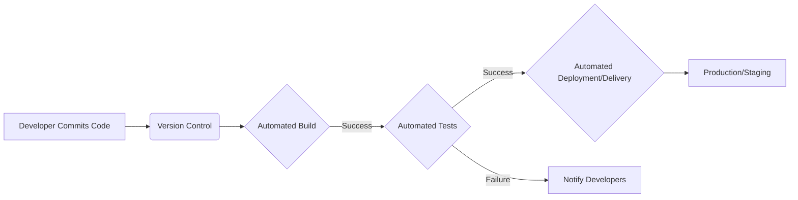
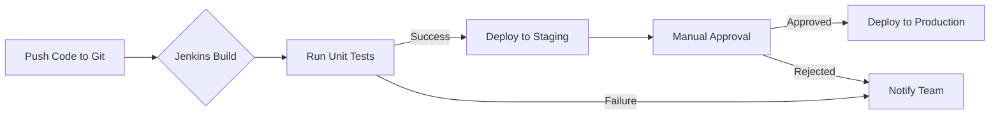
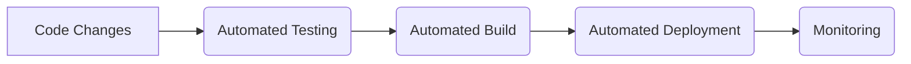

# <span style="color:#e67e22;">What we will learn in this post?</span>
<ul style='list-style-type: none; padding-left: 0;'>
<li><span style='color: #2980b9; font-size: 20px; font-weight: bold;'>👉</span> <span style='color: #2ecc71; font-size: 18px; font-weight: bold;'>Definition and Benefits of CI/CD</span></li>
<li><span style='color: #2980b9; font-size: 20px; font-weight: bold;'>👉</span> <span style='color: #2ecc71; font-size: 18px; font-weight: bold;'>Overview of CI/CD Tools: Jenkins, GitHub Actions, CircleCI</span></li>
<li><span style='color: #2980b9; font-size: 20px; font-weight: bold;'>👉</span> <span style='color: #2ecc71; font-size: 18px; font-weight: bold;'>Continuous Testing: Automated Testing Frameworks</span></li>
<li><span style='color: #2980b9; font-size: 20px; font-weight: bold;'>👉</span> <span style='color: #2ecc71; font-size: 18px; font-weight: bold;'>Continuous Deployment: Rollbacks and Blue-Green Deployments</span></li>
</ul>

# <span style="color:#e67e22">CI/CD: Streamlining Your Software Development 🚀</span>

Imagine building a really tall LEGO tower.  You wouldn't just pile bricks on top of each other hoping for the best, right? You'd build in stages, checking for stability after each section. That's the idea behind Continuous Integration/Continuous Deployment (CI/CD).  It's a set of practices that automates the process of building, testing, and deploying software, making the whole process much smoother and faster.


## <span style="color:#2980b9">What is Continuous Integration (CI)? ⚙️</span>

CI is all about frequently integrating code changes into a central repository.  Think of it as regularly adding your LEGO bricks to the main tower. Each time a developer finishes a piece of code, they merge it with the main codebase. This happens *frequently*, ideally multiple times a day.

### <span style="color:#8e44ad">Key benefits of CI:</span>

* **Early bug detection:**  Problems are identified much sooner, saving time and effort later on.
* **Reduced integration issues:** Merging code frequently minimizes the risk of major conflicts during the final stages.
* **Improved code quality:** Regular testing ensures higher quality and more stable code.
* **Faster feedback loops:** Developers get immediate feedback on their changes, allowing for quicker fixes.


## <span style="color:#2980b9">What is Continuous Deployment/Delivery (CD)? 🚄</span>

CD takes the automation a step further.  Continuous *Deployment* automatically releases every change to production after it passes all tests.  Continuous *Delivery* automates the release process, but requires manual approval before deploying to production.  This gives you more control over when your changes go live.


### <span style="color:#8e44ad">Key differences between Deployment and Delivery:</span>

* **Continuous Deployment:** Automated release to production after successful testing.  Think of it as automatically placing the completed LEGO tower on display.
* **Continuous Delivery:** Automated release *process*, but requires manual approval before going live. This is like having the completed LEGO tower ready for display but needing someone to give the final "OK".

### <span style="color:#8e44ad">Benefits of CD:</span>

* **Faster releases:** Get new features and bug fixes to users quickly.
* **Reduced risk:** Smaller, more frequent releases minimize the impact of potential problems.
* **Increased efficiency:** Automating the release process frees up developers to focus on building new features.


## <span style="color:#2980b9">How CI/CD Works Together 🤝</span>

CI and CD work hand-in-hand to create a powerful, efficient software development pipeline.



This diagram shows a typical CI/CD workflow.  After a developer commits code, it triggers an automated build and test process.  If everything passes, the code is automatically deployed or prepared for manual deployment.


## <span style="color:#2980b9">Real-World Examples ✨</span>

* **Netflix:** Uses CI/CD to deploy thousands of code changes daily, ensuring a smooth and reliable streaming experience for millions of users.
* **Amazon:**  Relies heavily on CI/CD for its vast e-commerce platform, enabling rapid innovation and feature updates.
* **Many SaaS companies:**  CI/CD is essential for quickly releasing new features and bug fixes, staying competitive in a dynamic market.


## <span style="color:#2980b9">Improved Collaboration & Efficiency  teamwork</span>

CI/CD fosters a culture of collaboration and improves efficiency in several ways:

* **Shared responsibility:** Everyone is involved in the testing and deployment process, leading to a greater sense of ownership.
* **Faster feedback:** Early detection of issues reduces the time spent on debugging and fixing problems.
* **Increased transparency:** Everyone can see the status of the build and deployment process, making it easier to track progress and identify bottlenecks.


## <span style="color:#2980b9">Getting Started with CI/CD 🌱</span>

Many tools and services are available to implement CI/CD, including:

* **GitHub Actions:**  [https://github.com/features/actions](https://github.com/features/actions)
* **Jenkins:** [https://www.jenkins.io/](https://www.jenkins.io/)
* **CircleCI:** [https://circleci.com/](https://circleci.com/)
* **GitLab CI/CD:** [https://about.gitlab.com/solutions/devops/ci-cd/](https://about.gitlab.com/solutions/devops/ci-cd/)


Implementing CI/CD can be a game-changer for your software development process, leading to faster releases, improved quality, and a more collaborative team environment.  Start small, focus on automating one step at a time, and gradually expand your CI/CD pipeline as your team gains experience. Remember, it's a journey, not a destination!


# <span style="color:#e67e22">Popular CI/CD Tools: Jenkins, GitHub Actions, and CircleCI</span> 🚀


This guide introduces three popular Continuous Integration/Continuous Delivery (CI/CD) tools: Jenkins, GitHub Actions, and CircleCI. We'll explore their features, strengths, and weaknesses, comparing them in a friendly and easy-to-understand way.


## <span style="color:#2980b9">Jenkins: The Veteran 👴</span>


Jenkins is a long-standing, open-source automation server.  It's incredibly versatile and highly customizable.

### <span style="color:#8e44ad">Features & Strengths:</span>
* **Extensive plugin ecosystem:**  Integrates with almost any tool imaginable.  Need to connect to a specific database or testing framework?  There's probably a plugin for that!
* **Highly customizable:** You have *complete* control over your CI/CD pipeline.  This is both a strength and a weakness (see below).
* **Self-hosted:** You install and manage Jenkins on your own servers, giving you ultimate control.

### <span style="color:#8e44ad">Weaknesses:</span>
* **Steeper learning curve:** Setting up and configuring Jenkins can be complex, requiring more technical expertise.
* **Maintenance overhead:** Managing updates and plugins can be time-consuming.


### <span style="color:#8e44ad">Typical Use Cases:</span>
* Complex CI/CD pipelines requiring custom configurations.
* Enterprises with existing infrastructure and specialized needs.
* Situations requiring deep integration with legacy systems.


### <span style="color:#8e44ad">Example Workflow (Mermaid):</span>



[Learn more about Jenkins](https://www.jenkins.io/)


## <span style="color:#2980b9">GitHub Actions: The Git Native 🐙</span>


GitHub Actions is a CI/CD platform built directly into GitHub. This tight integration simplifies workflows for projects hosted on GitHub.

### <span style="color:#8e44ad">Features & Strengths:</span>
* **Easy setup and configuration:**  Defined directly in your repository using YAML files.
* **Seamless GitHub integration:**  Access to repositories, issues, and pull requests directly within the workflow.
* **Scalable and reliable:** GitHub handles the infrastructure, ensuring availability and scalability.


### <span style="color:#8e44ad">Weaknesses:</span>
* **Less flexible than Jenkins:** Limited extensibility compared to Jenkins' vast plugin ecosystem.  You're more constrained by what GitHub provides.
* **Cost:** While offering free tiers, scaling can lead to higher costs than self-hosted options like Jenkins.


### <span style="color:#8e44ad">Typical Use Cases:</span>
* Projects already hosted on GitHub.
* Simple to medium-complexity CI/CD pipelines.
* Teams preferring a streamlined, integrated solution.


### <span style="color:#8e44ad">Example Workflow:</span>

On push to `main` branch:
1.  Build the application.
2.  Run tests.
3.  Deploy to a staging environment.


[Learn more about GitHub Actions](https://github.com/features/actions)


## <span style="color:#2980b9">CircleCI: The Cloud-Native ☁️</span>


CircleCI is a cloud-based CI/CD platform known for its speed and ease of use.

### <span style="color:#8e44ad">Features & Strengths:</span>
* **Fast and reliable:** Built for speed and efficiency.  Their infrastructure is optimized for CI/CD workloads.
* **User-friendly interface:**  Easy to set up and manage pipelines.
* **Strong support for various languages and frameworks:**  Handles a wide range of technologies.


### <span style="color:#8e44ad">Weaknesses:</span>
* **Cost:** Can be more expensive than self-hosted solutions, especially for large-scale projects.
* **Less customization:** While offering flexibility, it's not as customizable as Jenkins.


### <span style="color:#8e44ad">Typical Use Cases:</span>
* Teams prioritizing speed and ease of use.
* Projects requiring robust cloud-based CI/CD capabilities.
* Startups and organizations looking for a managed solution.


### <span style="color:#8e44ad">Example Workflow:</span>

On pull request:
1. Run linters.
2. Run unit tests.
3. Run integration tests.


[Learn more about CircleCI](https://circleci.com/)


## <span style="color:#2980b9">Comparison Table</span> 📊


| Feature          | Jenkins                  | GitHub Actions            | CircleCI                 |
|-----------------|--------------------------|---------------------------|--------------------------|
| **Ease of Use**   | 较低 (lower)             | 较高 (higher)            | 较高 (higher)            |
| **Flexibility**   | Very High                 | Medium                    | High                      |
| **Cost**          | Low (self-hosted)       | Varies (cloud-based)     | Varies (cloud-based)     |
| **Integration**   | Extensive Plugin Ecosystem | Tight GitHub Integration   | Good Cloud-Based  Integration |


## <span style="color:#2980b9">Conclusion 🎉</span>


The best CI/CD tool depends on your project's specific needs and your team's expertise.  Consider your team's skill level, project complexity, budget, and existing infrastructure when making your choice.  Each tool offers unique strengths, allowing you to select the one that best suits your workflow.


# <span style="color:#e67e22">Automating Tests in Your CI/CD Pipeline 🚀</span>

Imagine building a house.  You wouldn't just throw up walls and hope for the best, right? You'd check the foundations, inspect the framing, and test the plumbing before moving on.  Software development is similar!  That's where automated testing in a CI/CD (Continuous Integration/Continuous Delivery) pipeline comes in.  It's like having a team of tireless inspectors ensuring your software is solid at every stage.

## <span style="color:#2980b9">Why Automate Your Tests? 🤔</span>

Automated testing is crucial for several reasons:

* **Early Bug Detection:**  Catching bugs early is *much* cheaper and easier than fixing them later.  Imagine finding a foundation crack early on versus after the entire house is built!
* **Faster Feedback Loops:** Automated tests provide instant feedback, letting developers know immediately if their changes broke something.
* **Increased Efficiency:**  Automated tests run much faster than manual tests, freeing up developers to focus on building new features.
* **Improved Code Quality:**  A comprehensive test suite ensures higher quality, more reliable software.
* **Reduced Risk:** Automated tests minimize the risk of deploying buggy software to production.


## <span style="color:#2980b9">Types of Automated Tests 🧪</span>

We use different types of tests to catch different kinds of bugs:

### <span style="color:#8e44ad">Unit Tests 🧱</span>

* Test individual components (units) of your code in isolation.  Think of testing each brick individually before building the wall.
* Example: Testing a function that calculates the area of a circle.
* Popular Framework: `pytest` (Python), `Jest` (JavaScript)


### <span style="color:#8e44ad">Integration Tests 🤝</span>

* Test how different units interact with each other.  Like checking if the bricks fit together correctly to form a wall.
* Example: Testing the interaction between a user authentication module and a database.


### <span style="color:#8e44ad">End-to-End (E2E) Tests 🌐</span>

* Test the entire application flow from start to finish, simulating a real user's experience.  Like testing if the entire house functions correctly.
* Example:  Testing a user's ability to log in, add items to a shopping cart, and complete a purchase.
* Popular Framework: `Selenium` (Web UI testing), `Cypress` (JavaScript)


## <span style="color:#2980b9">Popular Testing Frameworks ✨</span>

* **`pytest` (Python):** A powerful and flexible testing framework for Python. It's easy to learn and use, with excellent features for writing and running tests.  [Learn more about pytest](https://docs.pytest.org/en/7.4.x/)

* **`Selenium` (Web UI testing):**  A browser automation tool that allows you to write scripts that interact with web applications as a real user would.  This is great for testing your website's user interface. [Learn more about Selenium](https://www.selenium.dev/)


## <span style="color:#2980b9">Example: Setting up Automated Tests in a CI Pipeline ⚙️</span>

Let's illustrate a simple example using GitHub Actions and `pytest`:

**1. Project Setup:**

* Create a Python project with a simple function and a corresponding test:

```python
# my_function.py
def add(x, y):
  return x + y

# test_my_function.py
import pytest
from my_function import add

def test_add():
  assert add(2, 3) == 5
```

**2. GitHub Actions Workflow (.github/workflows/test.yml):**

```yaml
name: Test My Project

on: push

jobs:
  test:
    runs-on: ubuntu-latest
    steps:
      - uses: actions/checkout@v3
      - name: Set up Python
        uses: actions/setup-python@v3
        with:
          python-version: '3.x'
      - name: Install dependencies
        run: pip install pytest
      - name: Run tests
        run: pytest
```

**3. Push to GitHub:**

Push your code to a GitHub repository.  GitHub Actions will automatically trigger the workflow upon each push.

**4. View Results:**

The workflow results (pass or fail) will be displayed in the GitHub Actions tab.


**Here's a visual representation using a Mermaid flowchart:**


```mermaid
graph TD
    A[Push Code to GitHub] --> B{GitHub Actions Triggered};
    B -- Success --> C[Checkout Code];
    C --> D[Setup Python Environment];
    D --> E[Install Dependencies (pytest)];
    E --> F[Run pytest Tests];
    F -- Tests Pass --> G[Workflow Success 🎉];
    F -- Tests Fail --> H[Workflow Failure 🚨];
```


## <span style="color:#2980b9">Conclusion 🎉</span>

Integrating automated testing into your CI/CD pipeline is a game-changer. By catching bugs early and automating the testing process, you can significantly improve your software quality, reduce development time, and boost your team's productivity.  Start small, focus on the most critical parts of your application, and gradually expand your test coverage. Remember that even small steps towards automated testing can make a huge difference!


# <span style="color:#e67e22">Continuous Deployment:  Seamless Software Delivery 🚀</span>

Continuous Deployment (CD) is like having a super-efficient assembly line for your software.  Instead of releasing big updates infrequently,  you release small, tested changes *constantly*. This makes updates faster, more frequent, and less risky. Think of it as giving your users a steady stream of improvements instead of a sudden, potentially disruptive flood.


## <span style="color:#2980b9">The CD Process: A Smooth Ride 🚗💨</span>

The CD process typically looks like this:

1. **Code Changes:** Developers make small, incremental changes to the code.
2. **Automated Testing:**  These changes are automatically tested to catch bugs early. (Unit tests, integration tests, etc.)
3. **Automated Build:** The code is automatically built into a deployable package (like an app file or container).
4. **Automated Deployment:** The built package is automatically deployed to the production environment (where users access it).
5. **Monitoring:** The deployed application is constantly monitored for performance and stability issues.





### <span style="color:#8e44ad">Benefits of Continuous Deployment</span>

* **Faster Feedback Loops:** Get immediate user feedback on new features.
* **Reduced Risk:** Smaller changes mean smaller potential problems.
* **Increased Efficiency:** Automation saves time and resources.
* **Happier Users:**  They get frequent updates and improvements.
* **Improved Quality:** Frequent testing and small changes lead to a higher quality product.


## <span style="color:#2980b9">Advanced Deployment Strategies:  Minimizing Downtime and Risk 🛡️</span>

While basic CD is amazing, advanced strategies take it to the next level:


### <span style="color:#8e44ad">Rollbacks: Undoing Mistakes ⏪</span>

Imagine releasing an update that introduces a bug.  A rollback strategy allows you to quickly revert to the *previous* stable version. This minimizes disruption to users and allows you to fix the problem without extensive downtime.

* **Implementation:**  This often involves keeping a previous version readily available for quick deployment.  Tools like Docker and Kubernetes make this easy by managing different versions of your application.


### <span style="color:#8e44ad">Blue-Green Deployments:  Switching with Ease 🔄</span>

This involves having two identical environments: "blue" (live) and "green" (staging).  You deploy the new version to the "green" environment. Once testing is complete, you switch traffic from "blue" to "green", making the new version live. If something goes wrong, you simply switch back to "blue".

* **Implementation:** Requires infrastructure that can handle routing traffic between environments.  Load balancers and cloud platforms like AWS and Azure play crucial roles.


```mermaid
graph LR
    A[Blue (Live)] --> B(Load Balancer);
    C[Green (Staging)] --> B;
    B --> D[Users];
    subgraph "Deployment"
        C --> E[Deploy new version];
        E --> F[Testing];
        F --> G[Switch Traffic];
        G --> H[Blue (Old) / Green (Live)];
    end
```


**Example:** Netflix uses blue-green deployments to release thousands of updates daily with minimal user impact.  They have a robust infrastructure that supports this approach, ensuring seamless transitions between versions.  [Learn more about Netflix's approach](https://netflix.github.io/chaosmonkey/) (Note: This link provides an overview of Netflix's approach to resilience, which includes elements related to deployment strategies).


## <span style="color:#2980b9">Real-World Applications and Examples ✨</span>

Many companies use continuous deployment, from small startups to large corporations. For example:

* **Etsy:** Uses CD to deploy code multiple times a day, ensuring a fast and reliable platform.
* **Amazon:**  Deploys many updates daily across its vast infrastructure.
* **Spotify:** Relies on CD for rapid iteration and improvements to its music streaming service.


Continuous deployment is not a one-size-fits-all solution. The best approach depends on your specific needs and context.  However, with careful planning and the right tools, you can significantly improve your software delivery process and create a more reliable and user-friendly product.  Remember to start small, automate where possible, and always have a rollback plan!


