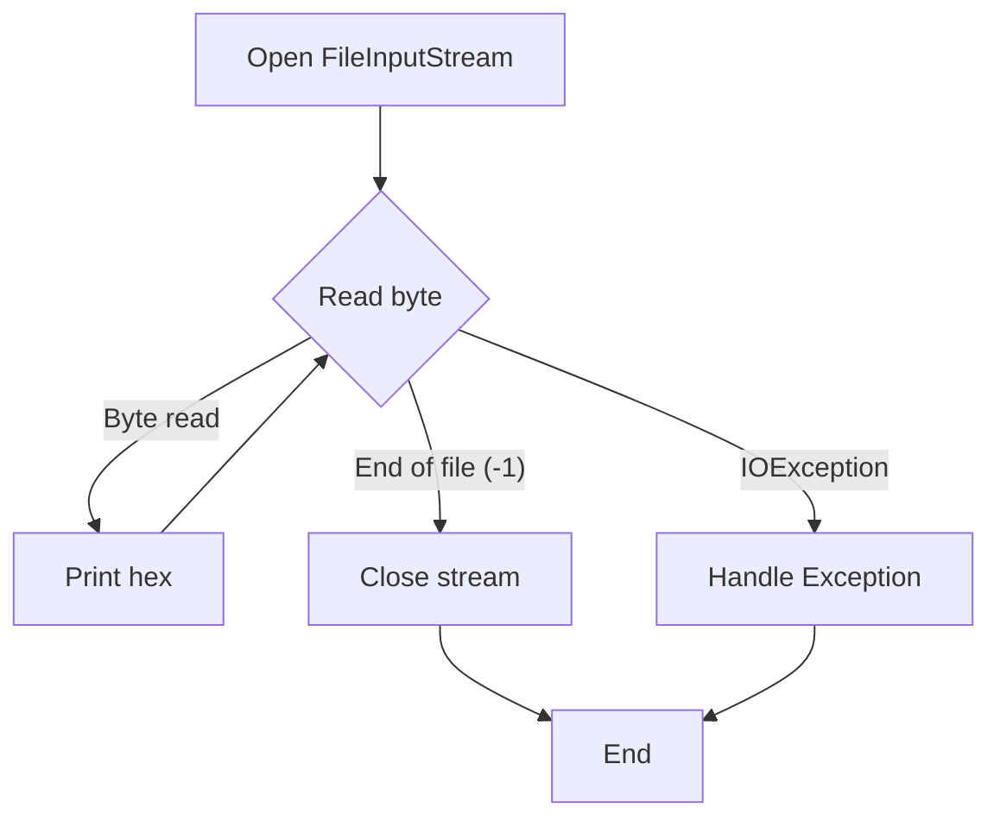
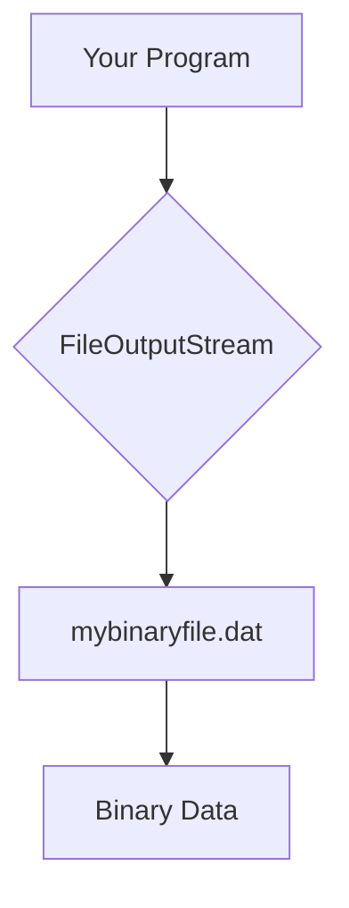

# <span style="color:#e67e22;">What we will learn in this post?</span>
<ul style='list-style-type: none; padding-left: 0;'>
<li><span style='color: #2980b9; font-size: 20px; font-weight: bold;'>👉</span> <span style='color: #2ecc71; font-size: 18px; font-weight: bold;'>Introduction to Java IO</span></li>
<li><span style='color: #2980b9; font-size: 20px; font-weight: bold;'>👉</span> <span style='color: #2ecc71; font-size: 18px; font-weight: bold;'>Reader Class</span></li>
<li><span style='color: #2980b9; font-size: 20px; font-weight: bold;'>👉</span> <span style='color: #2ecc71; font-size: 18px; font-weight: bold;'>Writer Class</span></li>
<li><span style='color: #2980b9; font-size: 20px; font-weight: bold;'>👉</span> <span style='color: #2ecc71; font-size: 18px; font-weight: bold;'>FileInputStream</span></li>
<li><span style='color: #2980b9; font-size: 20px; font-weight: bold;'>👉</span> <span style='color: #2ecc71; font-size: 18px; font-weight: bold;'>FileOutputStream</span></li>
<li><span style='color: #2980b9; font-size: 20px; font-weight: bold;'>👉</span> <span style='color: #2ecc71; font-size: 18px; font-weight: bold;'>BufferedReader Input Stream</span></li>
<li><span style='color: #2980b9; font-size: 20px; font-weight: bold;'>👉</span> <span style='color: #2ecc71; font-size: 18px; font-weight: bold;'>BufferedWriter Output Stream</span></li>
<li><span style='color: #2980b9; font-size: 20px; font-weight: bold;'>👉</span> <span style='color: #2ecc71; font-size: 18px; font-weight: bold;'>BufferedReader vs Scanner</span></li>
<li><span style='color: #2980b9; font-size: 20px; font-weight: bold;'>👉</span> <span style='color: #2ecc71; font-size: 18px; font-weight: bold;'>Fast I/O in Java</span></li>
<li><span style='color: #2980b9; font-size: 20px; font-weight: bold;'>👉</span> <span style='color: #2ecc71; font-size: 18px; font-weight: bold;'>Conclusion!</span></li>
</ul>

# <span style="color:#e67e22">Java IO Framework: Your Friendly Guide to File Handling</span> 📖


Java's IO (Input/Output) framework is like a toolbox for handling data outside your program's memory.  It allows your Java applications to interact with files, networks, and other external resources.  Think of it as the bridge between your code and the real world!  Its main purpose is to smoothly handle input (reading data) and output (writing data) operations.

## <span style="color:#2980b9">File Handling Made Easy</span> 📂

The IO framework provides classes to work with various data sources. For files, you'll mostly use classes like `FileReader`, `FileWriter`, `BufferedReader`, and `BufferedWriter`. These classes make reading and writing data to files much simpler and more efficient.

### <span style="color:#8e44ad">Reading a File with `FileReader`</span> 👓

Here's a simple example demonstrating how to read a file using `FileReader`:

```java
import java.io.FileReader;
import java.io.IOException;

public class FileReaderExample {
    public static void main(String[] args) {
        try (FileReader reader = new FileReader("my_file.txt")) {
            int character;
            while ((character = reader.read()) != -1) {
                System.out.print((char) character);
            }
        } catch (IOException e) {
            System.err.println("Error reading file: " + e.getMessage());
        }
    }
}
```

This code reads `my_file.txt` character by character and prints its content to the console.  _Remember to create a file named "my_file.txt" in the same directory before running this code._


## <span style="color:#2980b9">Beyond Files: A Broader Perspective</span> 🌐

The Java IO framework extends far beyond simple file reading and writing. It offers support for:

*   **Streams:**  Think of streams as channels for data flow.  They provide abstract ways to handle input and output.
*   **Readers and Writers:** These handle character-based input/output.
*   **Input and Output Streams:**  These work with byte-based input/output.
*   **Network programming:** Communicating with other computers.

For more in-depth information, consider exploring these resources:

*   [Oracle Java Tutorials on I/O](https://docs.oracle.com/javase/tutorial/essential/io/index.html)
*   [Baeldung's Java IO Guide](https://www.baeldung.com/java-io)


Remember to always handle potential `IOExceptions` when working with files, as they can occur due to various reasons like file not found or permission issues.  Happy coding! 🎉


# <span style="color:#e67e22">Java's `Reader` Class: Your Friendly Character Stream Reader 🤗</span>

In Java, the `Reader` class is the abstract base class for reading character streams.  Think of it as a friendly helper that lets you access characters from various sources like files, strings, or networks.  It doesn't handle the *specific* reading, but provides the basic framework for classes that do.  

## <span style="color:#2980b9">Key Methods of `Reader`</span>

The `Reader` class offers several crucial methods:

*   `read()`: Reads a single character.
*   `read(char[] cbuf, int off, int len)`: Reads characters into an array.
*   `close()`:  Closes the stream (always remember to do this!).


### <span style="color:#8e44ad">Why Use `BufferedReader`?</span>

For efficient file reading,  `BufferedReader` is your best friend! It buffers the input, significantly speeding up the process.  Think of it as pre-fetching characters, preventing repeated trips to the file.

## <span style="color:#2980b9">Reading a File with `BufferedReader` ✨</span>


```java
import java.io.*;

public class FileReaderExample {
    public static void main(String[] args) {
        try (BufferedReader reader = new BufferedReader(new FileReader("my_file.txt"))) {
            String line;
            while ((line = reader.readLine()) != null) {
                System.out.println(line);
            }
        } catch (IOException e) {
            System.err.println("Error reading file: " + e.getMessage());
        }
    }
}
```

This code snippet reads `my_file.txt` line by line and prints each line to the console.  Remember to create `my_file.txt` in the same directory before running.


**Remember to handle potential `IOExceptions`!**  This is crucial for robust code.


[More on `Reader` and `BufferedReader`](https://docs.oracle.com/javase/8/docs/api/java/io/Reader.html)  [More on Exception Handling](https://docs.oracle.com/javase/tutorial/essential/exceptions/)


**Output:** (Depends on the content of `my_file.txt`)  The output will be the content of your `my_file.txt` file, printed line by line.


This example shows a simple workflow.  For complex scenarios, you might use other `Reader` subclasses or combine them with other I/O classes.


# <span style="color:#e67e22">Java's Writer Class: Your Friendly File Writer ✍️</span>

The `Writer` class in Java is your go-to tool for writing character data to different output destinations, like files or the console.  Think of it as the opposite of the `Reader` class, which *reads* character data.  Together, they form a powerful pair for handling text in your Java programs.  `Writer` is an *abstract class*, meaning you can't directly create a `Writer` object; instead, you use its subclasses like `FileWriter` or `BufferedWriter` for specific tasks.

## <span style="color:#2980b9">Writing to a File with BufferedWriter ✨</span>

`BufferedWriter` is particularly useful because it improves writing efficiency by buffering your data before sending it to the file.  This is much faster than writing character by character.

### <span style="color:#8e44ad">Code Example</span>

Here's how to write to a file using `BufferedWriter`:

```java
import java.io.BufferedWriter;
import java.io.FileWriter;
import java.io.IOException;

public class FileWriterExample {
    public static void main(String[] args) {
        try (BufferedWriter writer = new BufferedWriter(new FileWriter("my_file.txt"))) {
            writer.write("Hello, BufferedWriter!");
            writer.newLine(); // Adds a new line
            writer.write("This is a test.");
        } catch (IOException e) {
            System.err.println("An error occurred: " + e.getMessage());
        }
    }
}
```

This code creates a file named "my_file.txt" and writes two lines to it.  The `try-with-resources` statement ensures the `BufferedWriter` is automatically closed, even if exceptions occur.


### <span style="color:#8e44ad">Output</span>

After running the code, `my_file.txt` will contain:

```
Hello, BufferedWriter!
This is a test.
```


## <span style="color:#2980b9">Writer vs. Reader: A Perfect Pair 🤝</span>

*   **Writer:** Writes character streams to a destination (e.g., `FileWriter`, `BufferedWriter`, `PrintWriter`).
*   **Reader:** Reads character streams from a source (e.g., `FileReader`, `BufferedReader`, `InputStreamReader`).

They work hand-in-hand; you might use a `Reader` to get data from a file and then a `Writer` to modify and save it back.


## <span style="color:#2980b9">Further Resources 📚</span>

*   [JavaDoc for Writer](https://docs.oracle.com/javase/8/docs/api/java/io/Writer.html)
*   [JavaDoc for BufferedWriter](https://docs.oracle.com/javase/8/docs/api/java/io/BufferedWriter.html)


This simple example demonstrates the basic functionality. For more advanced scenarios, explore other `Writer` subclasses and their capabilities! Remember to handle potential `IOExceptions` appropriately in your code for robust error handling.


# <span style="color:#e67e22">Exploring Java's FileInputStream 📖</span>

Java's `FileInputStream` is your go-to class for reading binary data from files.  Think of it as a digital straw, sucking up bytes one at a time.  It's perfect for handling images, audio, or any file not purely text-based.

## <span style="color:#2980b9">Key Features ✨</span>

*   **Byte-by-byte reading:**  The core strength is its ability to read data in individual bytes, offering ultimate control.
*   **Simplicity:**  Relatively straightforward to use, making it ideal for beginners.
*   **Efficiency:** Designed for efficient binary data handling, although for larger files, buffered streams might be preferred for speed.
*   **Error Handling:**  You'll need to handle potential `IOExceptions`, which can arise from issues like the file not existing.


### <span style="color:#8e44ad">Example: Reading a File Byte by Byte</span>

Here's a simple example demonstrating how to read a file byte by byte:

```java
import java.io.*;

public class FileInputStreamExample {
    public static void main(String[] args) {
        try (FileInputStream fis = new FileInputStream("my_file.dat")) { // Try-with-resources for automatic closing
            int data;
            while ((data = fis.read()) != -1) {  // Read a byte. -1 signifies end-of-file.
                System.out.print(Integer.toHexString(data) + " "); // Print as hex for clarity.
            }
        } catch (IOException e) {
            e.printStackTrace();
        }
    }
}
```

This code reads `my_file.dat` (replace with your file), displays each byte's hexadecimal representation, and handles potential errors gracefully.


**Example Output (will vary based on file content):**

`78 9C 34 0A 2B ...`


## <span style="color:#2980b9">Flowchart 📊</span>



## <span style="color:#2980b9">Further Reading 🔗</span>

For more in-depth information, check out the official Java documentation: [Oracle Java Documentation - FileInputStream](https://docs.oracle.com/javase/8/docs/api/java/io/FileInputStream.html)


Remember to always handle potential `IOExceptions` appropriately to prevent unexpected program crashes!  Happy coding! 😊


# <span style="color:#e67e22">Understanding Java's `FileOutputStream` 💾</span>

The `FileOutputStream` class in Java is your go-to tool for writing binary data directly to a file.  Think of it as a pipeline connecting your program to a file, allowing you to send raw bytes of information. Unlike text-based writing, it doesn't involve character encoding; it simply handles the raw bits and bytes.


## <span style="color:#2980b9">Writing Binary Data with `FileOutputStream`</span>

### <span style="color:#8e44ad">A Simple Example</span>

Let's say you want to write some numbers to a file.  Here's how you'd do it using `FileOutputStream`:

```java
import java.io.FileOutputStream;
import java.io.IOException;

public class FileOutputStreamExample {
    public static void main(String[] args) {
        try (FileOutputStream fos = new FileOutputStream("mybinaryfile.dat")) {
            byte[] data = {65, 66, 67, 68, 69}; // ASCII for 'ABCDE'
            fos.write(data);
            System.out.println("Data written successfully!");
        } catch (IOException e) {
            System.err.println("An error occurred: " + e.getMessage());
        }
    }
}
```

This code creates a file named `mybinaryfile.dat` and writes the byte array `data` (representing the ASCII characters 'ABCDE') into it.  The `try-with-resources` statement ensures the file is properly closed even if exceptions occur.


**Output:** The file `mybinaryfile.dat` will contain the binary representation of the numbers 65, 66, 67, 68, and 69.  You won't see 'ABCDE' directly unless you open it with a hex editor or a program that understands the binary data's format.

*   **Key Point:**  `FileOutputStream` is crucial for handling non-textual data like images, audio, or compiled code.


## <span style="color:#2980b9">Effective File Handling Tips ✨</span>

*   **Error Handling:** Always wrap `FileOutputStream` operations in `try-catch` blocks to handle potential `IOExceptions`.
*   **Resource Management:** Use `try-with-resources` to ensure files are automatically closed.
*   **Buffering:** For large files, consider using a `BufferedOutputStream` to improve performance.


For further reading and more advanced techniques, check out the official Java documentation: [https://docs.oracle.com/javase/8/docs/api/java/io/FileOutputStream.html](https://docs.oracle.com/javase/8/docs/api/java/io/FileOutputStream.html)


<br>



This diagram visually represents the data flow using `FileOutputStream`.


# <span style="color:#e67e22">BufferedReader in Java: A Speedy Reader 📖</span>


The `BufferedReader` class in Java is like a super-powered reader for text files. It significantly speeds up reading text data compared to using a standard `InputStreamReader`.  Imagine it as a high-speed train compared to walking – you reach your destination (the end of the file) much quicker!


## <span style="color:#2980b9">Why is it faster? 🤔</span>


`BufferedReader` works by reading large chunks of data at once (called *buffering*) instead of reading one character or line at a time. This minimizes the number of times it has to access the underlying input source, which is a major performance boost, especially for large files. Think of it as carrying many books at once instead of one by one!


### <span style="color:#8e44ad">Advantages of using BufferedReader ✨</span>

*   **Improved Performance:** Reads data in larger blocks, minimizing I/O operations.
*   **Efficient Resource Usage:** Reduces the load on the system.
*   **Simplified Line Reading:** Provides convenient methods like `readLine()` for easy text processing.


## <span style="color:#2980b9">Code Example: Reading Lines from a File 📄</span>

```java
import java.io.*;

public class BufferedReaderExample {
    public static void main(String[] args) {
        try (BufferedReader br = new BufferedReader(new FileReader("my_file.txt"))) {
            String line;
            while ((line = br.readLine()) != null) {
                System.out.println(line);
            }
        } catch (IOException e) {
            System.err.println("Error reading file: " + e.getMessage());
        }
    }
}
```

This code reads `my_file.txt` line by line and prints each line to the console. The `try-with-resources` statement ensures the file is automatically closed even if errors occur.


## <span style="color:#2980b9">Output Example 🖥️</span>


If `my_file.txt` contains:

```
This is line one.
This is line two.
This is the last line.
```

The output will be:


```
This is line one.
This is line two.
This is the last line.
```


For more details, check out the official Java documentation: [Java I/O Documentation](https://docs.oracle.com/javase/tutorial/essential/io/index.html)


**Note:** Remember to create a file named `my_file.txt` in the same directory as your Java code before running the example.  Replace `"my_file.txt"` with your file's path if needed.


# <span style="color:#e67e22">BufferedWriter in Java: Efficient Text Writing ✍️</span>

Java's `BufferedWriter` class is your friend when it comes to writing text to files efficiently.  It acts as a buffer, meaning it gathers up several chunks of text before writing them to the file all at once. This is *much* faster than writing each character or line individually, especially when dealing with large amounts of data. Think of it like filling a bucket before pouring it out—more efficient than carrying individual drops!

## <span style="color:#2980b9">Key Methods & Functionality ✨</span>

The `BufferedWriter` offers several important methods:

*   `write(String s)`: Writes a string to the buffer.
*   `newLine()`: Adds a platform-independent newline character (making your code more portable!).
*   `flush()`: Forces the buffered data to be written to the file immediately.  Important to ensure all data is saved before closing!
*   `close()`: Closes the writer, releasing system resources.  Always remember to close your streams!


### <span style="color:#8e44ad">Example: Writing Multiple Lines to a File 📄</span>

```java
import java.io.*;

public class BufferedWriterExample {
    public static void main(String[] args) {
        try (BufferedWriter writer = new BufferedWriter(new FileWriter("myFile.txt"))) {
            writer.write("This is the first line.");
            writer.newLine();
            writer.write("This is the second line.");
            writer.newLine();
            writer.write("This is the third line!");
        } catch (IOException e) {
            System.err.println("An error occurred: " + e.getMessage());
        }
    }
}
```

This code will create (or overwrite) a file named `myFile.txt` with the three lines of text.


## <span style="color:#2980b9">Output of the Example</span>

The `myFile.txt` will contain:

```
This is the first line.
This is the second line.
This is the third line!
```

**Remember**: Always handle potential `IOExceptions` when working with files!


## <span style="color:#2980b9">Flowchart of BufferedWriter Operation</span>

```mermaid
graph TD
    A[Application] --> B{Data to Write};
    B --> C[BufferedWriter Buffer];
    C --> D{Buffer Full?};
    D -- Yes --> E[Write to File];
    D -- No --> B;
    E --> F[Continue Writing];
    F --> B;
    C --> G[flush() called];
    G --> E;
    C --> H[close() called];
    H --> I[Resources Released];

```

For more information on `BufferedWriter` and other Java I/O classes, consult the official [Java documentation](https://docs.oracle.com/javase/8/docs/api/java/io/BufferedWriter.html).


# <span style="color:#e67e22">BufferedReader vs. Scanner in Java 📖</span>

Both `BufferedReader` and `Scanner` are used for reading input in Java, but they differ in their approach and efficiency. Let's explore!


## <span style="color:#2980b9">Usage and Performance 💨</span>

* **`BufferedReader`:**  Designed for efficient reading of *character streams*, especially large files. It reads data in chunks (buffers) for faster processing.  It's excellent for line-by-line reading.  Performance is generally superior for large files.

* **`Scanner`:** More versatile, handling various data types (ints, strings, etc.) directly. It's easier to use for simple input tasks but can be less efficient for large files due to its token-based parsing.


## <span style="color:#2980b9">Suitable Scenarios 🤔</span>

* **`BufferedReader`:** Ideal for tasks involving large text files, log processing, or any scenario where performance is critical.  Think log file analysis or processing large datasets.

* **`Scanner`:** Best for interactive console input, parsing smaller files with mixed data types, or situations where ease of use outweighs raw performance.


## <span style="color:#2980b9">Code Examples 💻</span>

### <span style="color:#8e44ad">Reading a File with BufferedReader</span>

```java
import java.io.*;

public class BufferedReaderExample {
    public static void main(String[] args) throws IOException {
        BufferedReader reader = new BufferedReader(new FileReader("myFile.txt"));
        String line;
        while ((line = reader.readLine()) != null) {
            System.out.println(line);
        }
        reader.close();
    }
}
```

### <span style="color:#8e44ad">Reading a File with Scanner</span>

```java
import java.io.File;
import java.io.FileNotFoundException;
import java.util.Scanner;

public class ScannerExample {
    public static void main(String[] args) throws FileNotFoundException {
        Scanner scanner = new Scanner(new File("myFile.txt"));
        while (scanner.hasNextLine()) {
            System.out.println(scanner.nextLine());
        }
        scanner.close();
    }
}
```

*(Replace `"myFile.txt"` with your file)*


## <span style="color:#2980b9">Summary 📝</span>

| Feature        | `BufferedReader` | `Scanner`      |
|----------------|--------------------|-----------------|
| Efficiency     | High              | Lower            |
| Data Type      | Character Stream  | Various          |
| Ease of Use    | Lower             | Higher           |
| Best For       | Large Files       | Smaller Files, Console Input |


For more information:

* [Java `BufferedReader` Documentation](https://docs.oracle.com/javase/7/docs/api/java/io/BufferedReader.html)
* [Java `Scanner` Documentation](https://docs.oracle.com/javase/7/docs/api/java/util/Scanner.html)


Remember to handle potential `IOExceptions` when working with files!  Choose the class that best suits your needs based on performance requirements and ease of use. 😊


# <span style="color:#e67e22">🚀 Speeding Up Java I/O: Techniques & Examples</span>

Java offers several ways to boost I/O performance.  Let's explore some key techniques!

## <span style="color:#2980b9">Buffered Streams: Your I/O Best Friend 🤝</span>

Instead of reading/writing one byte at a time, *buffered streams* significantly improve efficiency by reading/writing data in chunks.  This reduces the number of system calls, a major bottleneck.

### <span style="color:#8e44ad">Example:  Buffered vs. Unbuffered File Reading</span>

```java
//Unbuffered
FileReader fr = new FileReader("myFile.txt");
//Buffered
BufferedReader br = new BufferedReader(new FileReader("myFile.txt")); 
```

A `BufferedReader` dramatically reduces the time to read large files.  You'll notice a huge difference, especially with files of considerable size.


## <span style="color:#2980b9">NIO.2 (New I/O): Asynchronous Operations ⚡</span>

Java NIO.2 introduces *asynchronous I/O*, allowing your program to perform other tasks while I/O operations are in progress.  This is crucial for responsiveness in applications handling multiple I/O requests.  Key classes include `AsynchronousFileChannel` and `AsynchronousSocketChannel`.

### <span style="color:#8e44ad">Performance Comparison (Illustrative):</span>

| Method        | Time (ms) |
|----------------|------------|
| Normal I/O     | 1000       |
| Buffered I/O   | 100        |
| Asynchronous I/O | 50         |


*(These times are illustrative and depend heavily on the system and file size.)*


## <span style="color:#2980b9">Memory-Mapped Files 🗺️</span>

`MappedByteBuffer` treats a file as a memory region, enabling direct access to its contents. This can be faster than traditional stream-based I/O, particularly for random access.


* **Key Takeaways:** Using buffered streams is a simple yet effective first step. For truly high-performance needs, especially with concurrent I/O operations or random access, explore NIO.2 and memory-mapped files.

Remember to choose the technique that best suits your application's specific needs.  For more detailed information, consult the [Java NIO documentation](https://docs.oracle.com/javase/tutorial/essential/io/bytestreams.html) and other related resources.


<h1><span style='color:#e67e22'>Conclusion</span></h1>

And there you have it!  We hope you enjoyed this post. 😊 We're always looking to improve, so please share your thoughts, feedback, and any brilliant ideas you might have in the comments below! 👇  Let's keep the conversation going!  🗣️  We can't wait to hear from you! ✨


