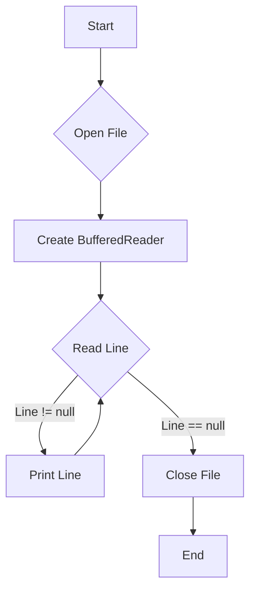

# <span style="color:#e67e22;">What we will learn in this post?</span>
<ul style='list-style-type: none; padding-left: 0;'>
<li><span style='color: #2980b9; font-size: 20px; font-weight: bold;'>👉</span> <span style='color: #2ecc71; font-size: 18px; font-weight: bold;'>Introduction to Java IO</span></li>
<li><span style='color: #2980b9; font-size: 20px; font-weight: bold;'>👉</span> <span style='color: #2ecc71; font-size: 18px; font-weight: bold;'>Reader Class</span></li>
<li><span style='color: #2980b9; font-size: 20px; font-weight: bold;'>👉</span> <span style='color: #2ecc71; font-size: 18px; font-weight: bold;'>Writer Class</span></li>
<li><span style='color: #2980b9; font-size: 20px; font-weight: bold;'>👉</span> <span style='color: #2ecc71; font-size: 18px; font-weight: bold;'>FileInputStream</span></li>
<li><span style='color: #2980b9; font-size: 20px; font-weight: bold;'>👉</span> <span style='color: #2ecc71; font-size: 18px; font-weight: bold;'>FileOutputStream</span></li>
<li><span style='color: #2980b9; font-size: 20px; font-weight: bold;'>👉</span> <span style='color: #2ecc71; font-size: 18px; font-weight: bold;'>BufferedReader Input Stream</span></li>
<li><span style='color: #2980b9; font-size: 20px; font-weight: bold;'>👉</span> <span style='color: #2ecc71; font-size: 18px; font-weight: bold;'>BufferedWriter Output Stream</span></li>
<li><span style='color: #2980b9; font-size: 20px; font-weight: bold;'>👉</span> <span style='color: #2ecc71; font-size: 18px; font-weight: bold;'>BufferedReader vs Scanner</span></li>
<li><span style='color: #2980b9; font-size: 20px; font-weight: bold;'>👉</span> <span style='color: #2ecc71; font-size: 18px; font-weight: bold;'>Fast I/O in Java</span></li>
<li><span style='color: #2980b9; font-size: 20px; font-weight: bold;'>👉</span> <span style='color: #2ecc71; font-size: 18px; font-weight: bold;'>Conclusion!</span></li>
</ul>

# <span style="color:#e67e22">Java IO Framework: Your Friendly Guide to File Handling</span> 📖

The Java IO (Input/Output) framework is your toolkit for handling data movement in and out of your Java programs.  It lets you read from files, write to files, interact with networks, and much more!  Think of it as a bridge connecting your program to the outside world. 🌎

## <span style="color:#2980b9">Purpose of Java IO</span>

Its main purpose is to manage input and output operations efficiently. This means:

*   **Reading data:**  Fetching information from various sources like files, keyboards, or networks.
*   **Writing data:**  Sending information to destinations like files, screens, or databases.


## <span style="color:#2980b9">File Handling with Java IO</span>

Java IO simplifies file handling with classes like `FileReader`, `FileWriter`, etc.  Let's look at reading a file:

### <span style="color:#8e44ad">Reading a File with `FileReader`</span>

```java
import java.io.FileReader;
import java.io.IOException;

public class FileReadingExample {
    public static void main(String[] args) {
        try (FileReader reader = new FileReader("my_file.txt")) {
            int character;
            while ((character = reader.read()) != -1) {
                System.out.print((char) character);
            }
        } catch (IOException e) {
            System.err.println("Error reading file: " + e.getMessage());
        }
    }
}
```

This code reads `my_file.txt` character by character and prints its contents to the console.  Remember to create a file named "my_file.txt" in the same directory before running this code!

**Note:**  The `try-with-resources` statement ensures the file is automatically closed, preventing resource leaks.  This is best practice! 👍

## <span style="color:#2980b9">Further Exploration</span> 🗺️

For more detailed information and advanced techniques within the Java IO framework, explore these resources:

*   [Oracle Java Tutorials on I/O](https://docs.oracle.com/javase/tutorial/essential/io/index.html)
*   [Baeldung Java IO Tutorial](https://www.baeldung.com/java-io)


This simple introduction gives you a taste of the power and flexibility of the Java IO framework.  Happy coding! 😊


# <span style="color:#e67e22">Java's Reader Class: Your Friendly Character Stream Reader 😄</span>

In Java, the `Reader` class is the *base class* for reading character streams.  Think of it as a friendly helper that lets your program pull in text data, character by character, from various sources like files or network connections.  It's abstract, meaning you can't directly use it; instead, you use its subclasses like `BufferedReader`.

## <span style="color:#2980b9">Key Methods for Character Handling 🔎</span>

The `Reader` class offers several crucial methods:

*   `read()`: Reads a single character. Returns an integer representing the character or -1 if the end of the stream is reached.
*   `read(char[] cbuf, int off, int len)`: Reads characters into a character array.  Very efficient for large amounts of data.
*   `close()`:  Crucial for releasing system resources! Always remember to close your reader when finished.


### <span style="color:#8e44ad">Using BufferedReader for File Reading 📖</span>

`BufferedReader` is a powerful subclass that improves reading efficiency by buffering characters. This means it reads chunks of data at once, making file reading faster.

Here's how to read characters from a file using `BufferedReader`:

```java
import java.io.BufferedReader;
import java.io.FileReader;
import java.io.IOException;

public class FileReading {
    public static void main(String[] args) {
        try (BufferedReader br = new BufferedReader(new FileReader("my_file.txt"))) {
            String line;
            while ((line = br.readLine()) != null) {
                System.out.println(line);
            }
        } catch (IOException e) {
            System.err.println("Error reading file: " + e.getMessage());
        }
    }
}
```

This code reads `my_file.txt` line by line, printing each line to the console.  Remember to create a file named `my_file.txt` in the same directory as your Java file before running.


## <span style="color:#2980b9">Example Output 🖥️</span>

If `my_file.txt` contains:

```
Hello, world!
This is a test.
```

The output will be:

```
Hello, world!
This is a test.
```

For more detailed information on Java I/O, check out the official [Oracle Java documentation](https://docs.oracle.com/javase/tutorial/essential/io/index.html).  Happy coding! 🎉


# <span style="color:#e67e22">Introducing Java's `Writer` Class ✍️</span>

The `Writer` class in Java is your friend when it comes to writing characters to different destinations, like files or network streams.  Think of it as the opposite of the `Reader` class, which is used for reading.  Together, they form a powerful pair for handling character-based input and output.  `Writer` is an *abstract class*, meaning you can't directly create instances of it, but you use its subclasses to perform actual writing operations.

## <span style="color:#2980b9">Understanding the `Writer` Family 👪</span>

*   **Purpose:**  `Writer` provides a general framework for writing character streams.  It handles the complexities of encoding and buffering, making your code cleaner and more efficient.
*   **Key Subclasses:**  Popular subclasses include `FileWriter`, `StringWriter`, and `BufferedWriter`.  `BufferedWriter` is particularly useful for improving performance by buffering data before writing to the underlying stream.

### <span style="color:#8e44ad">Writing to a File with `BufferedWriter`</span>

Here's how you can use `BufferedWriter` to write to a file:

```java
import java.io.*;

public class FileWriterExample {
    public static void main(String[] args) {
        try (BufferedWriter writer = new BufferedWriter(new FileWriter("my_file.txt"))) {
            writer.write("Hello, BufferedWriter!");
            writer.newLine(); //add a new line
            writer.write("This is a test.");
        } catch (IOException e) {
            System.err.println("An error occurred: " + e.getMessage());
        }
    }
}
```

This code creates a file named "my_file.txt" and writes two lines to it. The `try-with-resources` statement ensures the writer is automatically closed, preventing resource leaks.  The output of this code will be the content "Hello, BufferedWriter!\nThis is a test." in the `my_file.txt`.

## <span style="color:#2980b9">`Writer` vs. `Reader`  🔄</span>

| Feature          | `Writer`                               | `Reader`                                 |
|-----------------|----------------------------------------|------------------------------------------|
| **Purpose**     | Writes characters to a stream          | Reads characters from a stream           |
| **Abstraction** | Abstract class                          | Abstract class                           |
| **Subclasses**   | `FileWriter`, `StringWriter`, etc.      | `FileReader`, `StringReader`, etc.       |
| **Data Flow**   | From program to external destination    | From external source to program          |


[More info on Writers](https://docs.oracle.com/javase/7/docs/api/java/io/Writer.html)
[More info on Readers](https://docs.oracle.com/javase/7/docs/api/java/io/Reader.html)


This simple example showcases the basic functionality of `BufferedWriter`.  Remember to handle potential `IOExceptions` when working with file I/O.  Using the `try-with-resources` statement is a best practice for resource management.


# <span style="color:#e67e22">FileInputStream in Java: Reading Binary Files 📖</span>

The `FileInputStream` class in Java is your go-to tool for reading binary data from files.  Think of it as a straw for your computer to suck up raw file contents byte by byte.  It's perfect for images, audio, or any file where you need to deal with the underlying bytes directly.


## <span style="color:#2980b9">Key Features ✨</span>

* **Byte-by-byte reading:**  It reads data one byte at a time, giving you ultimate control.
* **Low-level access:**  You're working directly with the file's binary representation.
* **Efficiency:**  Generally efficient for reading raw data.
* **Error handling:** You need to handle potential `IOExceptions` (like the file not being found).


### <span style="color:#8e44ad">Example: Reading a File Byte by Byte</span>

```java
import java.io.FileInputStream;
import java.io.IOException;

public class FileByteReader {
    public static void main(String[] args) {
        try (FileInputStream fis = new FileInputStream("my_file.txt")) { //Try-with-resources for automatic closing
            int byteValue;
            while ((byteValue = fis.read()) != -1) {  // Read until end of file (-1)
                System.out.print(Integer.toHexString(byteValue) + " "); //Prints the byte as a hex value
            }
        } catch (IOException e) {
            System.err.println("Error reading file: " + e.getMessage());
        }
    }
}
```

This code reads `my_file.txt` (replace with your file) and prints the hexadecimal representation of each byte.  For example, if `my_file.txt` contained "Hello", the output would be a sequence of hexadecimal numbers representing the ASCII codes for each character.


## <span style="color:#2980b9">Flowchart 📊</span>

```mermaid
graph TD
    A[Open File with FileInputStream] --> B{Read byte using fis.read()};
    B -- byte != -1 --> C[Print byte];
    C --> B;
    B -- byte == -1 --> D[Close FileInputStream];
    D --> E[End];
    B -- IOException --> F[Handle Exception];
    F --> E;
```

This shows the basic flow of reading a file byte by byte using `FileInputStream`.


**Important Note:** Always handle potential `IOExceptions` using `try-catch` blocks to prevent your program from crashing if the file isn't found or if any other issues arise during file access.  Remember to close the `FileInputStream` using `try-with-resources` or `fis.close()` to release system resources.


[Learn more about `FileInputStream`](https://docs.oracle.com/javase/8/docs/api/java/io/FileInputStream.html)  (Oracle's official Java documentation) 


Remember to replace `"my_file.txt"` with the actual path to your file.  Enjoy reading those bytes! 🎉


# <span style="color:#e67e22">Understanding Java's `FileOutputStream` 💾</span>

## <span style="color:#2980b9">Writing Binary Data to Files</span>

The `FileOutputStream` class in Java is your trusty sidekick for writing raw binary data directly to a file.  Think of it as a digital pen that lets you write any type of data—images, audio, or even compiled code—without any text-based interpretation.  It's crucial for handling non-textual files efficiently.

### <span style="color:#8e44ad">How it Works</span>

*   **Creates or Overwrites:** When you create a `FileOutputStream` object, you specify the file.  If the file exists, its contents are *overwritten*. If it doesn't exist, a new file is created.
*   **Byte-by-Byte Writing:**  Data is written to the file as a stream of bytes.  You use the `write()` method to send individual bytes or arrays of bytes.
*   **Error Handling:**  Always wrap your `FileOutputStream` in a `try-catch` block to handle potential `IOExceptions` (e.g., file not found).

## <span style="color:#2980b9">Code Example: Writing Binary Data ✨</span>


```java
import java.io.FileOutputStream;
import java.io.IOException;

public class FileOutputStreamExample {
    public static void main(String[] args) {
        byte[] data = {72, 101, 108, 108, 111, 32, 87, 111, 114, 108, 100}; // "Hello World" in ASCII
        try (FileOutputStream fos = new FileOutputStream("my_binary_file.dat")) {
            fos.write(data);
            System.out.println("Binary data written successfully!");
        } catch (IOException e) {
            System.err.println("An error occurred: " + e.getMessage());
        }
    }
}
```

This code creates a file named `my_binary_file.dat` containing the ASCII representation of "Hello World" as raw binary data.  You can open this file with a hex editor to view its contents.

## <span style="color:#2980b9">Important Considerations ⚠️</span>

*   **Closing the Stream:**  Always close the `FileOutputStream` using `try-with-resources` (as shown above) to ensure data is flushed to the file and resources are released.
*   **Buffering:** For large files, consider using a `BufferedOutputStream` to improve performance.


[Learn More about FileOutputStream](https://docs.oracle.com/javase/8/docs/api/java/io/FileOutputStream.html)  
[Learn More about Exception Handling](https://docs.oracle.com/javase/tutorial/essential/exceptions/)


# <span style="color:#e67e22">BufferedReader in Java: A Speedy Reader 📖</span>


## <span style="color:#2980b9">What is BufferedReader? 🤔</span>

The `BufferedReader` class in Java is like a super-powered reader for text data.  It reads text from a character-input stream, one line at a time, but much faster than a regular `Reader`.  Think of it as a high-speed train compared to a bicycle for transporting data!  It achieves this speed by buffering (storing temporarily) the data read from the input stream into a memory area called a buffer, reading large chunks at a time instead of one character at a time. This reduces the number of I/O operations, making your code significantly faster, especially when dealing with large files.

### <span style="color:#8e44ad">Advantages of Using BufferedReader ✨</span>

* **Improved Performance:**  Reads data in larger chunks, minimizing system calls and increasing speed.
* **Efficient Resource Management:** Reduces the number of interactions with the underlying input stream.
* **Simplified Line Reading:** Provides convenient methods for reading lines of text.


## <span style="color:#2980b9">Code Example: Reading Lines from a File 📄</span>

Here's how to use `BufferedReader` to read lines from a file:

```java
import java.io.*;

public class BufferedReaderExample {
    public static void main(String[] args) {
        try (BufferedReader reader = new BufferedReader(new FileReader("my_file.txt"))) {
            String line;
            while ((line = reader.readLine()) != null) {
                System.out.println(line);
            }
        } catch (IOException e) {
            System.err.println("Error reading file: " + e.getMessage());
        }
    }
}
```

This code opens `my_file.txt`, reads each line using `reader.readLine()`, and prints it to the console. The `try-with-resources` statement ensures the reader is automatically closed, even if exceptions occur.

### <span style="color:#8e44ad">Output Example</span>

If `my_file.txt` contains:

```
This is line one.
This is line two.
```

The output will be:

```
This is line one.
This is line two.
```


## <span style="color:#2980b9">Flowchart</span>



[More information on BufferedReader](https://docs.oracle.com/javase/7/docs/api/java/io/BufferedReader.html)


Remember to always handle potential `IOExceptions` when working with files!  Using `BufferedReader` makes your file I/O operations smoother and more efficient.  Enjoy coding! 😄


# <span style="color:#e67e22">BufferedWriter in Java: Writing Text Efficiently ✍️</span>

Java's `BufferedWriter` class is your friend when it comes to writing text to files efficiently.  It acts as a buffer, collecting data before writing it to the underlying output stream (like a file). This significantly reduces the number of disk access operations, speeding up your writing process. Think of it like filling a bucket before dumping it—much more efficient than carrying individual drops!

## <span style="color:#2980b9">Key Methods ✨</span>

*   `write(String s)`: Writes a string to the buffer.
*   `newLine()`: Adds a platform-independent newline character.
*   `flush()`: Forces any buffered data to be written to the file immediately.  This is important to ensure all data is saved before closing.
*   `close()`:  Closes the `BufferedWriter`, releasing system resources and ensuring data is written.  *Always* close your streams!


### <span style="color:#8e44ad">Example: Writing Multiple Lines</span>

```java
import java.io.*;

public class BufferedWriterExample {
    public static void main(String[] args) {
        try (BufferedWriter writer = new BufferedWriter(new FileWriter("my_file.txt"))) {
            writer.write("Hello, ");
            writer.newLine(); // Adds a newline
            writer.write("this is line two!");
            writer.newLine();
            writer.write("This is the third line");
        } catch (IOException e) {
            System.err.println("Error writing to file: " + e.getMessage());
        }
    }
}
```

This code creates a file named `my_file.txt` with three lines of text. The `try-with-resources` statement ensures the `BufferedWriter` is automatically closed, even if errors occur.


**Output (my_file.txt):**

```
Hello, 
this is line two!
This is the third line
```

## <span style="color:#2980b9">Why Use BufferedWriter? 🚀</span>

*   **Improved Performance:** Reduces disk I/O operations.
*   **Efficiency:**  Buffers data before writing, leading to faster execution.
*   **Ease of Use:** Simple API for writing text.


For more information: [JavaDoc for BufferedWriter](https://docs.oracle.com/javase/8/docs/api/java/io/BufferedWriter.html)


This enhanced explanation aims to provide a clear and friendly introduction to the `BufferedWriter` class with visual aids and relevant resources. Remember to always handle potential `IOExceptions` when working with file I/O operations!


# <span style="color:#e67e22">BufferedReader vs. Scanner in Java 📖</span>

Both `BufferedReader` and `Scanner` are used for reading input in Java, but they differ in their approach and efficiency. Let's explore!

## <span style="color:#2980b9">Usage and Performance ⏱️</span>

* **BufferedReader:**  Designed for efficient reading of character streams, especially from files. It reads data in chunks (buffers), making it significantly faster than `Scanner` for large files.  It's best for situations where you need to process the entire file content.

* **Scanner:** More versatile; it can parse various data types (integers, strings, etc.) directly from the input. It's easier to use for simple input parsing but less efficient for large files because it reads line by line.


### <span style="color:#8e44ad">Reading a File Example</span>

**BufferedReader:**

```java
import java.io.*;

public class BufferedReaderExample {
    public static void main(String[] args) throws IOException {
        BufferedReader reader = new BufferedReader(new FileReader("myFile.txt"));
        String line;
        while ((line = reader.readLine()) != null) {
            System.out.println(line);
        }
        reader.close();
    }
}
```

**Scanner:**

```java
import java.io.*;
import java.util.Scanner;

public class ScannerExample {
    public static void main(String[] args) throws FileNotFoundException {
        Scanner scanner = new Scanner(new File("myFile.txt"));
        while (scanner.hasNextLine()) {
            System.out.println(scanner.nextLine());
        }
        scanner.close();
    }
}
```


## <span style="color:#2980b9">Suitable Scenarios 🤔</span>

* **BufferedReader:** Ideal for:
    * Reading large files efficiently.
    * Processing text line by line when performance is critical.
    * Situations where direct character-level manipulation is needed.

* **Scanner:** Best for:
    * Simple input processing from various sources (console, files).
    * Parsing different data types directly from input.
    * Smaller files or situations where ease of use is prioritized over extreme performance.


## <span style="color:#2980b9">Performance Comparison 📊</span>

For large files, `BufferedReader` significantly outperforms `Scanner`.  `Scanner`'s overhead from its parsing capabilities becomes noticeable with increased file size.  For small files, the difference might be negligible.


[More info on BufferedReader](https://docs.oracle.com/javase/7/docs/api/java/io/BufferedReader.html)
[More info on Scanner](https://docs.oracle.com/javase/7/docs/api/java/util/Scanner.html)

This simple comparison helps you choose the right tool for your input processing needs! Remember to always close your readers and scanners after use to release resources.  🎉


# <span style="color:#e67e22">Speeding Up Java I/O 🚀</span>

Java offers several ways to boost I/O performance.  Let's explore some key techniques!

## <span style="color:#2980b9">Buffered Streams 缓冲流 🌊</span>

Using buffered streams significantly improves I/O speed.  Instead of writing/reading one byte at a time, they operate on chunks of data, reducing system calls.

### <span style="color:#8e44ad">Example: `BufferedReader` and `BufferedWriter`</span>

```java
//Slow I/O
FileReader reader = new FileReader("myfile.txt");
FileWriter writer = new FileWriter("output.txt");

//Fast I/O
BufferedReader bufferedReader = new BufferedReader(new FileReader("myfile.txt"));
BufferedWriter bufferedWriter = new BufferedWriter(new FileWriter("output.txt")); 
```

Buffered streams reduce the number of disk operations.


## <span style="color:#2980b9">NIO (New I/O)  非阻塞式I/O ⚡️</span>

NIO introduces channels and buffers for non-blocking I/O, enabling asynchronous operations and better concurrency.  It's ideal for high-performance applications.

### <span style="color:#8e44ad">Key Classes</span>

*   `FileChannel`: For file I/O.
*   `SocketChannel`: For network I/O.
*   `ByteBuffer`: For managing data buffers.

**Example (Simplified):**  NIO allows you to read data into a buffer asynchronously, freeing up the main thread.


## <span style="color:#2980b9">Memory-Mapped Files 内存映射文件 🗺️</span>

`MappedByteBuffer` maps a file directly to memory. This provides *extremely* fast access, especially for random access.  Changes are written back to the file automatically.

**Caution:**  Excessive use can increase memory consumption.

### <span style="color:#8e44ad">Comparison</span>


| Method         | Speed     | Memory Use |
|-----------------|-----------|------------|
| Normal I/O      | Slow      | Low        |
| Buffered I/O    | Faster    | Moderate   |
| Memory-Mapped   | Fastest   | High       |


**Resources:**

*   [Oracle Java Documentation on NIO](https://docs.oracle.com/javase/tutorial/nio/index.html)


Remember to choose the optimal technique based on your specific needs and application requirements.  Happy coding! 😊


<h1><span style='color:#e67e22'>Conclusion</span></h1>

And there you have it!  We hope you enjoyed this post. 😊 We're always looking to improve, so please share your thoughts, feedback, and suggestions in the comments below! 👇  Let's keep the conversation going!  What did you think?  What would you like to see more of?  We can't wait to hear from you!  ✨


