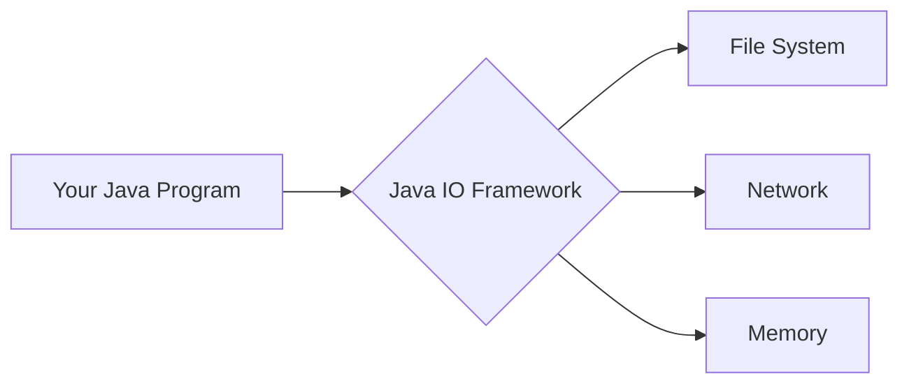
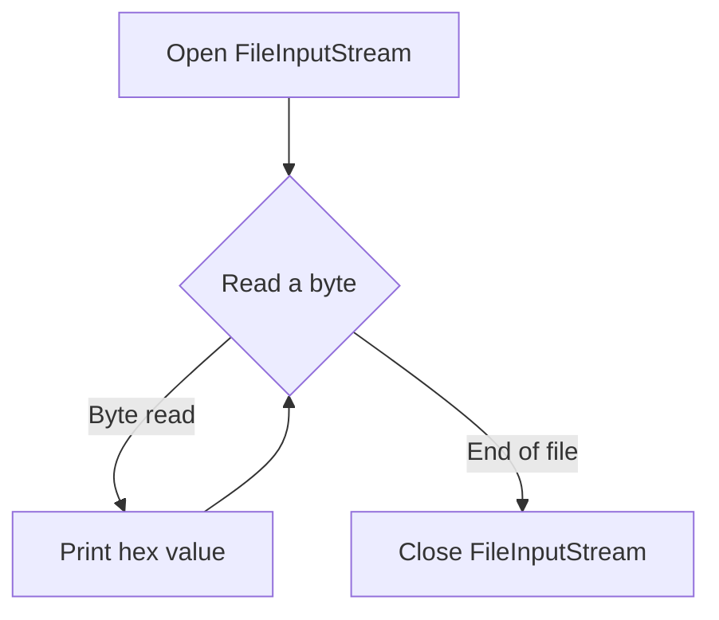
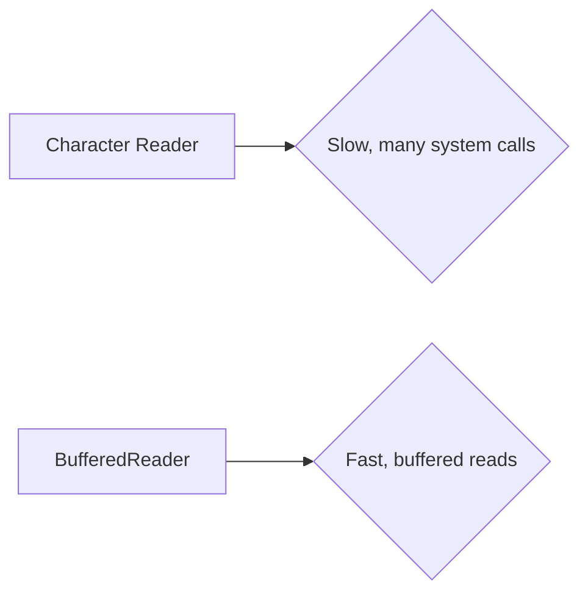

# <span style="color:#e67e22;">What we will learn in this post?</span>
<ul style='list-style-type: none; padding-left: 0;'>
<li><span style='color: #2980b9; font-size: 20px; font-weight: bold;'>👉</span> <span style='color: #2ecc71; font-size: 18px; font-weight: bold;'>Introduction to Java IO</span></li>
<li><span style='color: #2980b9; font-size: 20px; font-weight: bold;'>👉</span> <span style='color: #2ecc71; font-size: 18px; font-weight: bold;'>Reader Class</span></li>
<li><span style='color: #2980b9; font-size: 20px; font-weight: bold;'>👉</span> <span style='color: #2ecc71; font-size: 18px; font-weight: bold;'>Writer Class</span></li>
<li><span style='color: #2980b9; font-size: 20px; font-weight: bold;'>👉</span> <span style='color: #2ecc71; font-size: 18px; font-weight: bold;'>FileInputStream</span></li>
<li><span style='color: #2980b9; font-size: 20px; font-weight: bold;'>👉</span> <span style='color: #2ecc71; font-size: 18px; font-weight: bold;'>FileOutputStream</span></li>
<li><span style='color: #2980b9; font-size: 20px; font-weight: bold;'>👉</span> <span style='color: #2ecc71; font-size: 18px; font-weight: bold;'>BufferedReader Input Stream</span></li>
<li><span style='color: #2980b9; font-size: 20px; font-weight: bold;'>👉</span> <span style='color: #2ecc71; font-size: 18px; font-weight: bold;'>BufferedWriter Output Stream</span></li>
<li><span style='color: #2980b9; font-size: 20px; font-weight: bold;'>👉</span> <span style='color: #2ecc71; font-size: 18px; font-weight: bold;'>BufferedReader vs Scanner</span></li>
<li><span style='color: #2980b9; font-size: 20px; font-weight: bold;'>👉</span> <span style='color: #2ecc71; font-size: 18px; font-weight: bold;'>Fast I/O in Java</span></li>
<li><span style='color: #2980b9; font-size: 20px; font-weight: bold;'>👉</span> <span style='color: #2ecc71; font-size: 18px; font-weight: bold;'>Conclusion!</span></li>
</ul>

# <span style="color:#e67e22">Java IO Framework: Your Friendly Guide to File Handling 📚</span>

The Java IO framework is like a toolbox filled with tools for handling input and output operations.  Its purpose is simple: to let your Java programs read data from and write data to various sources, such as files, networks, and memory.  Think of it as the bridge between your program and the outside world! 🌎

## <span style="color:#2980b9">File Handling Made Easy</span>

The framework offers a rich set of classes to manage files and streams.  You can read files character by character, line by line, or in larger chunks.  Similarly, you can write data to files, creating new ones or appending to existing ones.  This flexibility makes it perfect for a wide range of tasks, from simple text processing to complex data manipulation.

### <span style="color:#8e44ad">Reading a File with `FileReader`</span>

Here's a simple example demonstrating how to read a file using `FileReader`:

```java
import java.io.FileReader;
import java.io.IOException;

public class FileReaderExample {
    public static void main(String[] args) {
        try (FileReader reader = new FileReader("my_file.txt")) {
            int character;
            while ((character = reader.read()) != -1) {
                System.out.print((char) character);
            }
        } catch (IOException e) {
            System.err.println("An error occurred: " + e.getMessage());
        }
    }
}
```

This code reads `my_file.txt` character by character and prints it to the console.  Remember to create a file named `my_file.txt` in the same directory before running the code.  The output will be the content of your file.


## <span style="color:#2980b9">Beyond `FileReader`</span>

*  `FileWriter`:  For writing to files.
*  `BufferedReader`:  For efficient line-by-line reading.
*  `BufferedWriter`:  For efficient writing, buffering data before writing to the file.
*  And many more!


**Remember to handle potential exceptions (like `IOException`) using `try-catch` blocks to prevent your program from crashing.**

For more detailed information and advanced techniques, check out the official [Java documentation on IO](https://docs.oracle.com/javase/tutorial/essential/io/index.html).


---

**Diagram (Conceptual Flow):**



This simple diagram illustrates how the Java IO framework acts as an intermediary between your program and different data sources.


# <span style="color:#e67e22">Meet the Java `Reader` Class 📖</span>

The `Reader` class in Java is your friendly neighborhood character stream reader.  It's the abstract base class for all character input streams, meaning it provides the basic blueprint for reading text data.  Think of it as a general-purpose tool for getting characters from various sources, like files or networks.  You don't directly use `Reader`, but instead use its subclasses, like `BufferedReader`, for actual input operations.


## <span style="color:#2980b9">Key Methods of the `Reader` Family ✨</span>

These are some of the most helpful methods you'll frequently encounter:

* **`read()`**: Reads a single character.  Returns an integer representing the character or -1 if the end of the stream is reached.
* **`read(char[] cbuf, int off, int len)`**: Reads a block of characters into a character array.  Very efficient for large inputs!
* **`close()`**: Closes the stream, releasing system resources.  *Always remember to close your streams!*


### <span style="color:#8e44ad">Using `BufferedReader` for File Reading 📄</span>

`BufferedReader` is a powerful subclass that improves performance by buffering input. Here's how to read characters from a file:


```java
import java.io.*;

public class FileReadingExample {
    public static void main(String[] args) {
        try (BufferedReader reader = new BufferedReader(new FileReader("my_file.txt"))) {
            String line;
            while ((line = reader.readLine()) != null) {
                System.out.println(line);
            }
        } catch (IOException e) {
            System.err.println("Error reading file: " + e.getMessage());
        }
    }
}
```

This code snippet reads each line of `my_file.txt` and prints it to the console.  Remember to create a file named `my_file.txt` in the same directory before running this code.


## <span style="color:#2980b9">Example Output 🚀</span>

If `my_file.txt` contains:

```
Hello, world!
This is a test.
```

The output will be:

```
Hello, world!
This is a test.
```


For more detailed information and advanced techniques, check out the official Java documentation: [https://docs.oracle.com/javase/8/docs/api/java/io/Reader.html](https://docs.oracle.com/javase/8/docs/api/java/io/Reader.html)


---
**Note:**  Error handling (using `try-catch` blocks) is crucial when working with I/O operations.  Always handle potential exceptions like `IOException`.


# <span style="color:#e67e22">Understanding Java's Writer Class ✍️</span>

The `Writer` class in Java is your trusty sidekick for writing character streams.  Think of it as the opposite of the `Reader` class, which handles *reading* character data.  While `Reader` brings information *in*, `Writer` sends it *out*, typically to a file, a network connection, or the console.  It's the fundamental base class for all character-output streams, providing a common interface for various writing operations.


## <span style="color:#2980b9">Writing to Files with BufferedWriter ✨</span>

The `BufferedWriter` class is a very useful subclass of `Writer`. It improves efficiency by buffering your data before writing it to the actual destination (like a file). This makes writing faster because it reduces the number of disk accesses.

### <span style="color:#8e44ad">Code Example: Writing to a File</span>

Here's how you'd use `BufferedWriter` to write text to a file:

```java
import java.io.BufferedWriter;
import java.io.FileWriter;
import java.io.IOException;

public class FileWriterExample {
    public static void main(String[] args) {
        try (BufferedWriter writer = new BufferedWriter(new FileWriter("my_file.txt"))) {
            writer.write("Hello, ");
            writer.newLine(); // Adds a new line
            writer.write("this is a test!");
        } catch (IOException e) {
            System.err.println("An error occurred: " + e.getMessage());
        }
    }
}
```

This code will create a file named "my_file.txt" and write "Hello, \n this is a test!" into it. The `try-with-resources` statement ensures the file is properly closed even if errors occur.

**Output:** The `my_file.txt` will contain:

```
Hello, 
this is a test!
```

## <span style="color:#2980b9">Writer vs. Reader: A Perfect Pair 🤝</span>

* **Reader:** Reads characters from a source (file, network, etc.).
* **Writer:** Writes characters to a destination (file, network, etc.).

They work together to manage input and output of text data.  `Reader` gets the data, and `Writer` puts it where it needs to go.


## <span style="color:#2980b9">Further Learning 🚀</span>

For a deeper dive into Java I/O, check out the official [Oracle Java Tutorials](https://docs.oracle.com/javase/tutorial/essential/io/index.html).  They offer comprehensive explanations and many examples.


---
This example showcases how `BufferedWriter` extends `Writer` to provide a buffered writing mechanism.  Remember to handle potential `IOExceptions` when working with files!


# <span style="color:#e67e22">FileInputStream in Java: Reading Binary Files 📖</span>


The `FileInputStream` class in Java is your go-to tool for reading binary data from files.  Think of it as a digital straw, sucking up the raw bytes one by one. It's perfect for handling images, audio, videos, or any file where you need to access the exact binary content.


## <span style="color:#2980b9">Key Features ✨</span>

* **Byte-by-byte Reading:**  It allows you to read data one byte at a time, giving you complete control.
* **Simplicity:**  It's straightforward to use, requiring minimal code.
* **Efficiency:**  Generally efficient for reading binary files directly.
* **Error Handling:**  You can use `try-catch` blocks to handle potential exceptions like `FileNotFoundException`.


### <span style="color:#8e44ad">Example: Reading a File Byte by Byte</span>

```java
import java.io.FileInputStream;
import java.io.IOException;

public class ReadBinaryFile {
    public static void main(String[] args) {
        try (FileInputStream fis = new FileInputStream("my_binary_file.bin")) { //Note the use of try-with-resources for automatic closure
            int data;
            while ((data = fis.read()) != -1) {
                System.out.print(Integer.toHexString(data) + " "); //Displays bytes as hexadecimal values.
            }
        } catch (IOException e) {
            e.printStackTrace();
        }
    }
}
```

This code reads `my_binary_file.bin` byte by byte and prints each byte's hexadecimal representation.  For example, if the file contains a few bytes representing "Hello", you'd get an output like `...68 65 6c 6c 6f ...` (the hexadecimal representation of the ASCII characters).


## <span style="color:#2980b9">Flowchart 📊</span>




This flowchart visualizes the process: opening the file, reading byte by byte, processing each byte (here, printing its hex value), and closing the file when finished.


Remember to handle potential exceptions (like the file not existing) using `try-catch` blocks for robust code.  For more detailed information and advanced features, refer to the official Java documentation: [Oracle Java Documentation on FileInputStream](https://docs.oracle.com/javase/8/docs/api/java/io/FileInputStream.html).  Always handle files responsibly and clean up after yourself, closing your `FileInputStream` when you're done. 👍


# <span style="color:#e67e22">Understanding Java's `FileOutputStream` 💾</span>

The `FileOutputStream` class in Java is your trusty tool for writing raw binary data directly to a file.  Think of it as a pipeline connecting your program to a file, allowing you to send bytes of information for permanent storage. Unlike text-based streams, it doesn't handle character encoding; it deals with the pure, unadulterated bytes.

## <span style="color:#2980b9">Writing Binary Data 🚀</span>

Here's how you'd use it:

### <span style="color:#8e44ad">A Simple Example</span>

```java
import java.io.FileOutputStream;
import java.io.IOException;

public class BinaryWriter {
    public static void main(String[] args) {
        try (FileOutputStream fos = new FileOutputStream("mydata.bin")) {
            byte[] data = {72, 101, 108, 108, 111, 32, 87, 111, 114, 108, 100}; // "Hello World" in ASCII
            fos.write(data);
            System.out.println("Binary data written successfully!");
        } catch (IOException e) {
            System.err.println("An error occurred: " + e.getMessage());
        }
    }
}
```

This code creates a file named `mydata.bin` and writes the ASCII representation of "Hello World" into it as bytes.  You can open `mydata.bin` with a hex editor to see the raw byte data.


## <span style="color:#2980b9">Key Considerations 🤔</span>

*   **Error Handling:**  Always wrap `FileOutputStream` operations in a `try-catch` block to handle potential `IOExceptions`.
*   **Resource Management:** Use try-with-resources (as shown above) to ensure the file is automatically closed, preventing resource leaks.
*   **Binary Nature:** Remember that `FileOutputStream` writes raw bytes.  If you need to write text, consider using `FileWriter` instead.


## <span style="color:#2980b9">Visual Representation 📊</span>


For more detailed information and advanced usage, refer to the official Java documentation: [Java FileOutputStream](https://docs.oracle.com/javase/8/docs/api/java/io/FileOutputStream.html)


This simple guide helps you grasp the fundamental usage of `FileOutputStream` for your binary file handling needs! Remember to always practice safe coding habits. 😊


# <span style="color:#e67e22">Java's `BufferedReader`: Your Text Data's Best Friend 📖</span>

## <span style="color:#2980b9">Understanding `BufferedReader` ✨</span>

The `BufferedReader` class in Java is like a super-powered text reader.  It's designed to efficiently read text data from various sources, including files and network streams.  Instead of reading one character at a time (which is slow!), it reads large chunks of data at once, storing them in an internal buffer. This drastically improves reading speed, especially when dealing with large files. Think of it as pre-loading a book's pages instead of reading one letter at a time!

### <span style="color:#8e44ad">Advantages of using `BufferedReader` 🚀</span>

* **Speed & Efficiency:** Reads data in blocks, leading to significant performance gains.
* **Improved I/O Operations:** Minimizes the number of system calls (interactions with the operating system), which are resource-intensive.
* **Flexibility:** Works with various input streams.


## <span style="color:#2980b9">Code Example: Reading Lines from a File 📄</span>

```java
import java.io.*;

public class BufferedReaderExample {
    public static void main(String[] args) {
        try (BufferedReader br = new BufferedReader(new FileReader("my_file.txt"))) {
            String line;
            while ((line = br.readLine()) != null) {
                System.out.println(line);
            }
        } catch (IOException e) {
            System.err.println("Error reading file: " + e.getMessage());
        }
    }
}
```

This code reads each line from `"my_file.txt"` and prints it to the console.  The `try-with-resources` statement ensures the file is closed automatically, even if errors occur.


## <span style="color:#2980b9">Output Example 🖥️</span>

If `my_file.txt` contains:

```
This is line one.
This is line two.
This is the third line.
```

The output will be:

```
This is line one.
This is line two.
This is the third line.
```

Remember to replace `"my_file.txt"` with the actual path to your file.


## <span style="color:#2980b9">Performance Improvement Diagram 📊</span>



This simple diagram shows how `BufferedReader` significantly improves the reading process.


For more in-depth information on `BufferedReader` and Java I/O, check out the official [Oracle Java Documentation](https://docs.oracle.com/javase/7/docs/api/java/io/BufferedReader.html).  Happy coding! 😊


# <span style="color:#e67e22">BufferedWriter in Java: Efficient Text Writing ✍️</span>

Java's `BufferedWriter` class is your friend when it comes to writing text data efficiently to files or other output streams.  It significantly improves performance compared to writing directly with `FileWriter`, because it *buffers* the data. This means it gathers multiple characters or lines before writing them to the actual output, reducing the number of disk access operations. Think of it like filling a bucket before dumping it – much faster than carrying each drop individually!

## <span style="color:#2980b9">Key Methods & Functionality 🛠️</span>

*   `write(String s)`: Writes a string to the buffer.
*   `newLine()`: Adds a platform-independent newline character.  This ensures your code works across different operating systems.
*   `flush()`: Forces the buffered data to be written to the output immediately.  Important to ensure all data is saved before closing.
*   `close()`:  Closes the `BufferedWriter`, flushing any remaining data.  Crucial to prevent data loss!


### <span style="color:#8e44ad">Example: Writing Multiple Lines</span>

```java
import java.io.*;

public class BufferedWriterExample {
    public static void main(String[] args) {
        try (BufferedWriter writer = new BufferedWriter(new FileWriter("my_file.txt"))) {
            writer.write("Hello, BufferedWriter!");
            writer.newLine();
            writer.write("This is line 2.");
            writer.newLine();
            writer.write("Writing multiple lines is easy!");
        } catch (IOException e) {
            e.printStackTrace();
        }
    }
}
```

This code creates a file named "my_file.txt" and writes three lines to it.  The `try-with-resources` statement ensures the `BufferedWriter` is automatically closed, even if exceptions occur.


## <span style="color:#2980b9">Output</span>

The `my_file.txt` file will contain:

```
Hello, BufferedWriter!
This is line 2.
Writing multiple lines is easy!
```

## <span style="color:#2980b9">Why Use BufferedWriter? 🚀</span>

*   **Improved Performance:** Significantly faster than writing directly to a file.
*   **Reduced Disk I/O:** Fewer writes to the disk mean less overhead.
*   **Simplified Code:** Easier to write and manage large amounts of text.

For more information, check out the official Java documentation:  [https://docs.oracle.com/javase/7/docs/api/java/io/BufferedWriter.html](https://docs.oracle.com/javase/7/docs/api/java/io/BufferedWriter.html)


[Mermaid flowchart showing the data flow from String to BufferedWriter to File would be beneficial here, but unfortunately, I can't directly generate images.]


# <span style="color:#e67e22">BufferedReader vs. Scanner in Java 📖</span>


Both `BufferedReader` and `Scanner` are used for reading input in Java, but they differ in their approach and efficiency. Let's explore!


## <span style="color:#2980b9">Usage and Performance 🚀</span>

* **BufferedReader:**  Designed for *efficient* reading of character streams, especially from files. It reads data in *chunks*, improving performance compared to reading character by character.  It's great for large files.

* **Scanner:** More *flexible* for various input types (strings, integers, etc.).  It parses the input based on delimiters (usually whitespace). While convenient, it can be less efficient than `BufferedReader` for large files due to its line-by-line processing.


### <span style="color:#8e44ad">Reading a File 📁</span>

**BufferedReader Example:**

```java
import java.io.*;

public class BufferedReaderExample {
    public static void main(String[] args) throws IOException {
        BufferedReader reader = new BufferedReader(new FileReader("my_file.txt"));
        String line;
        while ((line = reader.readLine()) != null) {
            System.out.println(line);
        }
        reader.close();
    }
}
```

**Scanner Example:**

```java
import java.io.*;
import java.util.*;

public class ScannerExample {
    public static void main(String[] args) throws FileNotFoundException {
        Scanner scanner = new Scanner(new File("my_file.txt"));
        while (scanner.hasNextLine()) {
            System.out.println(scanner.nextLine());
        }
        scanner.close();
    }
}
```

*(Note:  Replace `"my_file.txt"` with your actual file path.)*


## <span style="color:#2980b9">Suitable Scenarios 🎯</span>

* **BufferedReader:** Ideal for reading large text files, log files, or any scenario where performance is critical.  Think processing *massive* datasets.

* **Scanner:**  Best for interactive console input, parsing smaller files with varied data types, or situations where simpler parsing is needed.  Perfect for quick *interactive* programs.


## <span style="color:#2980b9">Performance Summary 📊</span>

| Feature        | BufferedReader | Scanner      |
|----------------|-----------------|---------------|
| Speed          | Faster          | Slower        |
| Efficiency     | Higher          | Lower         |
| Flexibility    | Lower           | Higher        |
| Best for       | Large files     | Interactive input, smaller files |


**More Info:**

* [Oracle Java Documentation on BufferedReader](https://docs.oracle.com/javase/7/docs/api/java/io/BufferedReader.html)
* [Oracle Java Documentation on Scanner](https://docs.oracle.com/javase/7/docs/api/java/util/Scanner.html)


Remember to always close your readers to release system resources!  Good coding! 😊


# <span style="color:#e67e22">🚀 Speeding Up Java I/O: Techniques & Examples</span>

Java offers several ways to boost I/O performance.  Let's explore some key techniques!

## <span style="color:#2980b9">Buffered Streams Buffered Streams</span> 

Using buffered streams like `BufferedReader` and `BufferedWriter` significantly improves speed. They reduce the number of disk accesses by reading/writing data in chunks.


### <span style="color:#8e44ad">Example: Comparing Normal vs. Buffered I/O</span>

```java
// Normal I/O (slow)
FileReader fr = new FileReader("myFile.txt");
FileWriter fw = new FileWriter("newFile.txt");

// Buffered I/O (fast)
BufferedReader br = new BufferedReader(new FileReader("myFile.txt"));
BufferedWriter bw = new BufferedWriter(new FileWriter("newFile.txt")); 
```

Running a benchmark will show buffered I/O is *much* faster.  The difference can be dramatic, especially with large files.


## <span style="color:#2980b9">NIO.2 (New I/O)</span>

Java NIO.2 provides asynchronous I/O operations using channels and buffers.  This allows your application to perform other tasks while I/O is in progress, leading to better concurrency and responsiveness.  Key classes include `AsynchronousFileChannel` and `FileChannel`.

*   **Advantages:** Non-blocking I/O, improved concurrency.
*   **Disadvantages:** Higher complexity.


## <span style="color:#2980b9">Memory-Mapped Files</span> 

`MappedByteBuffer` from `java.nio` maps a file directly to memory.  This allows for extremely fast random access, ideal for modifying large files without constantly reading and writing to disk.

*  **Note:** This technique is memory intensive.


## <span style="color:#2980b9">Choosing the Right Technique</span>

The best approach depends on your application's specific needs.  For simple file reading/writing, buffered streams are often sufficient. For large files or high-concurrency scenarios, NIO.2 or memory-mapped files might be more appropriate.  Careful benchmarking is crucial for optimal performance.


**Further Resources:**

*   [Oracle Java Tutorial on NIO](https://docs.oracle.com/javase/tutorial/essential/io/bytestreams.html)
*   [Baeldung article on Java NIO.2](https://www.baeldung.com/java-nio2)


Remember to always choose the method best suited for your specific needs and don't forget to profile your code to measure the actual performance improvements! 😄


<h1><span style='color:#e67e22'>Conclusion</span></h1>

And there you have it!  We hope you enjoyed this post. 😊  We're always looking to improve, so we'd love to hear your thoughts!  What did you think?  What else would you like to see?  Share your comments, feedback, and suggestions below! 👇 Let's keep the conversation going! ✨


