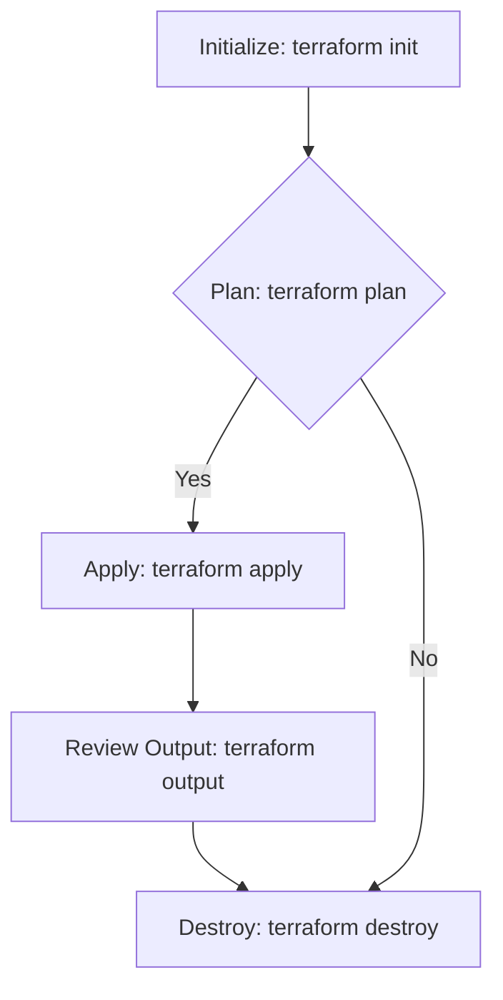
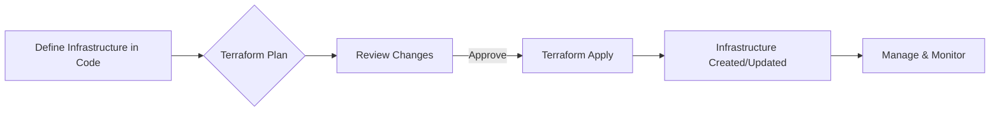

# <span style="color:#e67e22;">What we will learn in this post?</span>
<ul style='list-style-type: none; padding-left: 0;'>
<li><span style='color: #2980b9; font-size: 20px; font-weight: bold;'>👉</span> <span style='color: #2ecc71; font-size: 18px; font-weight: bold;'>Concept and Benefits of IaC</span></li>
<li><span style='color: #2980b9; font-size: 20px; font-weight: bold;'>👉</span> <span style='color: #2ecc71; font-size: 18px; font-weight: bold;'>Tools Overview: Terraform, AWS CloudFormation, Pulumi</span></li>
<li><span style='color: #2980b9; font-size: 20px; font-weight: bold;'>👉</span> <span style='color: #2ecc71; font-size: 18px; font-weight: bold;'>Writing Your First IaC Script with Terraform</span></li>
<li><span style='color: #2980b9; font-size: 20px; font-weight: bold;'>👉</span> <span style='color: #2ecc71; font-size: 18px; font-weight: bold;'>Managing Cloud Resources with IaC</span></li>
<li><span style='color: #2980b9; font-size: 20px; font-weight: bold;'>👉</span> <span style='color: #2ecc71; font-size: 18px; font-weight: bold;'>Ensuring Idempotence and Scalability in IaC</span></li>
<li><span style='color: #2980b9; font-size: 20px; font-weight: bold;'>👉</span> <span style='color: #2ecc71; font-size: 18px; font-weight: bold;'>Conclusion!</span></li>
</ul>

# <span style="color:#e67e22">Infrastructure as Code (IaC) Explained 🏠💻</span>

Imagine building a house with LEGOs instead of bricks and mortar.  That's essentially what Infrastructure as Code (IaC) is!  Instead of manually configuring servers, networks, and other infrastructure, you use code to define and manage it all.  This allows for automation, repeatability, and much more.

## <span style="color:#2980b9">What is IaC? 🤔</span>

IaC is the process of managing and provisioning computer data centers through machine-readable definition files, rather than physical hardware configuration or interactive configuration tools.  Think of it as writing a recipe for your infrastructure.  You define all the ingredients (servers, networks, databases) and steps (configurations, deployments) in a file, and then "execute" the recipe to build your infrastructure.

### <span style="color:#8e44ad">Key Benefits ✨</span>

* **Automation:**  Say goodbye to manual tasks! IaC automates the creation, modification, and deletion of infrastructure.
* **Version Control:**  Just like software, you can track changes to your infrastructure code using tools like Git, making collaboration easier and rollbacks a breeze.
* **Repeatability:** Build identical environments consistently, across different clouds or on-premise.
* **Scalability:** Easily scale your infrastructure up or down based on demand, without manual intervention.
* **Reduced Errors:**  Minimizes human error by automating processes and ensuring consistency.


## <span style="color:#2980b9">How IaC Works ⚙️</span>

```mermaid
graph LR
A[Define Infrastructure in Code] --> B{IaC Tool (e.g., Terraform)};
B --> C[Provisioning/Management];
C --> D[Cloud/On-Premise Infrastructure];
D --> E[Monitoring & Management];
E --> F[Feedback Loop];
F --> A;
```

This diagram shows the basic workflow.  You write code defining your infrastructure, an IaC tool interprets this and provisions the infrastructure, and finally, you monitor and manage it.  Any changes are fed back into the code for continuous improvement.

## <span style="color:#2980b9">Example: Terraform and Cloud Resources ☁️</span>

Companies use tools like *Terraform* to define and manage cloud resources on platforms like AWS, Azure, and GCP.  For example, you can write a Terraform configuration file to create:

* **EC2 instances (AWS):**  Define the instance type, operating system, and security settings.
* **Virtual Machines (Azure):** Specify the VM size, OS, and network configuration.
* **Compute Engine instances (GCP):** Similar to AWS and Azure, defining instance type, OS, and configurations.


By using IaC, companies can quickly deploy and manage their infrastructure, reducing costs and improving efficiency.  It's a powerful technique for anyone working with cloud or on-premise environments.

**Learn More:**

* [Terraform Documentation](https://www.terraform.io/docs/index.html)
* [Hashicorp Learn](https://learn.hashicorp.com/) (For Terraform and other HashiCorp tools)


This approach promotes a more efficient and reliable infrastructure management system.  The shift from manual to automated processes allows for better scalability and reduced human error.


# <span style="color:#e67e22">Popular Infrastructure as Code (IaC) Tools</span> ☁️

Infrastructure as Code (IaC) lets you manage and provision infrastructure through code, instead of manual clicks.  This makes things faster, more reliable, and easier to repeat. Let's look at some popular tools:


## <span style="color:#2980b9">Terraform 🌎</span>

* **Features:**  Cloud-agnostic (works with AWS, Azure, GCP, etc.), uses declarative configuration language (HCL), excellent community support.
* **Use Cases:** Managing multi-cloud environments, consistent infrastructure across different providers.
* **Advantages:** *Flexibility*, *portability*, *wide adoption*.

### <span style="color:#8e44ad">Example:</span>
A simple Terraform configuration might look like this: `resource "aws_instance" "example" { ami = "ami-0c55b31ad2299a701" }`


## <span style="color:#2980b9">AWS CloudFormation ☁️ AWS</span>

* **Features:** AWS-specific, uses JSON or YAML, integrates tightly with other AWS services.
* **Use Cases:** Managing AWS resources efficiently, leveraging AWS-specific features.
* **Advantages:** *Deep AWS integration*, *easy to use within the AWS ecosystem*.


## <span style="color:#2980b9">Pulumi 🚀</span>

* **Features:** Uses real programming languages (Python, TypeScript, Go, etc.),  supports various cloud providers.
* **Use Cases:** Complex infrastructure, leveraging programming language features for automation.
* **Advantages:** *Familiar programming languages*, *powerful automation capabilities*.


### <span style="color:#8e44ad">Choosing the Right Tool</span>

Consider these factors:

* **Cloud Provider Preference:** If you're solely using AWS, CloudFormation might be a natural fit.  For multi-cloud or hybrid cloud scenarios, Terraform shines.
* **Team Expertise:** Pulumi’s use of familiar programming languages could be advantageous for developers comfortable with them.
* **Project Complexity:** For simpler projects, CloudFormation's ease of use may be sufficient. For complex, dynamic infrastructure, Terraform or Pulumi’s power might be necessary.


**Simple Decision Flowchart:**

```mermaid
graph TD
    A[Project Needs?] --> B{Single Cloud (e.g., AWS)?};
    B -- Yes --> C[CloudFormation];
    B -- No --> D{Complex Logic Needed?};
    D -- Yes --> E[Pulumi];
    D -- No --> F[Terraform];
    C --> G[Done];
    E --> G;
    F --> G;
```


**Resources:**

* [Terraform](https://www.terraform.io/)
* [AWS CloudFormation](https://aws.amazon.com/cloudformation/)
* [Pulumi](https://www.pulumi.com/)


Remember to choose the tool that best fits your specific needs and team capabilities!  Happy coding! 🎉


# <span style="color:#e67e22">Your First Terraform Script: A Simple Guide 🎉</span>

Let's build your first Infrastructure as Code (IaC) script using Terraform!  Terraform uses a declarative language – you describe *what* you want, and it figures out *how* to create it.

## <span style="color:#2980b9">Understanding Terraform Basics</span>

Terraform uses a simple structure:

*   **Providers:**  These define where your infrastructure lives (e.g., AWS, Azure, Google Cloud). Think of them as connecting to your cloud provider.
*   **Resources:** These are the specific infrastructure components you'll create (e.g., virtual machines, storage buckets).  You define their properties here.
*   **Outputs:** These show you the results of your Terraform run (e.g., the public IP address of your VM).


### <span style="color:#8e44ad">Simple Example: Creating an AWS S3 Bucket</span>

```terraform
# Configure the AWS provider
terraform {
  required_providers {
    aws = {
      source  = "hashicorp/aws"
      version = "~> 4.0"
    }
  }
}

provider "aws" {
  region = "us-west-2" # Replace with your region
}

# Create an S3 bucket
resource "aws_s3_bucket" "my_bucket" {
  bucket = "my-terraform-bucket-unique-name" #Must be globally unique
  acl    = "private"
}

# Output the bucket name
output "bucket_name" {
  value = aws_s3_bucket.my_bucket.id
}
```

[Learn more about AWS S3 Buckets](https://aws.amazon.com/s3/)


## <span style="color:#2980b9">Working with your Script</span>

1.  **Initialization:**  Open your terminal, navigate to the directory containing your `main.tf` file (the file containing the code above), and run `terraform init`. This downloads the necessary AWS provider.

2.  **Planning:** Run `terraform plan`.  This shows you what Terraform will do *before* making any changes.

3.  **Applying:** Run `terraform apply`.  This creates the infrastructure defined in your script.  Type `yes` to confirm.

4.  **Reviewing:**  The `terraform output` command shows you the results (in this case, your bucket name).

5. **Destroying:** When finished, use `terraform destroy` to remove the created resources.  This is crucial for cleanup and cost management.




Remember to replace `"my-terraform-bucket-unique-name"` and `"us-west-2"` with a globally unique bucket name and your desired AWS region.  *Always* review the `terraform plan` output before applying!  Happy coding! 🚀


# <span style="color:#e67e22">Infrastructure as Code (IaC) for Cloud Management ☁️</span>

Infrastructure as Code (IaC) is like a recipe for your cloud infrastructure. Instead of manually clicking through web interfaces, you write code that describes exactly what you need – virtual machines, networks, databases, etc.  This code is then used to automatically create and manage these resources. Think of it as a blueprint for your cloud!


## <span style="color:#2980b9">Introducing Terraform: Your Cloud Chef 🧑‍🍳</span>

Terraform is a popular IaC tool that uses a declarative approach.  You *describe* the desired state of your infrastructure in a configuration file (typically using the HashiCorp Configuration Language or HCL), and Terraform figures out how to get there.  It's like giving your chef a menu – they handle all the cooking (provisioning) and cleaning (managing updates).


### <span style="color:#8e44ad">Managing AWS Resources with Terraform</span>

Let's see some examples:

* **Creating an AWS EC2 instance:**
```terraform
resource "aws_instance" "example" {
  ami           = "ami-0c55b31ad2299a701" # Replace with your AMI ID
  instance_type = "t2.micro"
}
```
This simple code snippet tells Terraform to create a t2.micro EC2 instance using a specified Amazon Machine Image (AMI).


* **Setting up an AWS VPC:**
```terraform
resource "aws_vpc" "main" {
  cidr_block = "10.0.0.0/16"
}
```
This creates a Virtual Private Cloud (VPC) with the specified CIDR block.


## <span style="color:#2980b9">Benefits of IaC</span>

* **Automation:**  No more manual clicks!  Automate creation, updates, and even deletion of resources.
* **Version Control:** Track changes to your infrastructure like you would with code. Use Git for example!  This allows for easy rollbacks and collaboration.
* **Consistency:** Ensures your infrastructure is consistent across different environments (development, testing, production).
* **Repeatability:** Easily recreate your entire infrastructure from scratch.


## <span style="color:#2980b9">Simplified Workflow</span>



[Learn more about Terraform](https://www.terraform.io/)

[Learn more about AWS](https://aws.amazon.com/)


IaC significantly simplifies cloud resource management, making it more efficient, reliable, and less error-prone. By treating infrastructure as code, you gain all the advantages of software development best practices, leading to a more robust and manageable cloud environment.


# <span style="color:#e67e22">IaC: Idempotence & Scalability ✨</span>

Infrastructure as Code (IaC) lets you manage and provision infrastructure through code, like creating servers or networks. Two crucial concepts are idempotence and scalability.

## <span style="color:#2980b9">Idempotence:  The "Do-Over" Power 💪</span>

Idempotence means you can run the same IaC script multiple times, and it will *always* produce the same result.  No extra resources are created, and no existing resources are unintentionally modified.  Think of it as a perfect "do-over" button!  Tools like Terraform achieve this by comparing the desired state (defined in your code) with the current state of your infrastructure. Only necessary changes are made.

### <span style="color:#8e44ad">Example:</span>

Imagine a script to create a single virtual machine. Running it once creates the VM. Running it again does *nothing* because the VM already exists – that's idempotence in action!


## <span style="color:#2980b9">Scalability: Growing with Your Needs 🌱</span>

Scalability means your IaC scripts can easily handle changes in your infrastructure's size and complexity.  As your needs grow, your code should adapt gracefully without major rewrites.  This often involves:

*   **Modularization:** Break down your code into reusable modules for easier management and scaling.
*   **Variables and Parameters:** Use variables to make your scripts flexible and adaptable to different environments.
*   **Loops and Iterators:** Automate the creation of multiple similar resources.


## <span style="color:#2980b9">Terraform's Role in Achieving Idempotence and Scalability</span>

Terraform, a popular IaC tool, ensures idempotence through its state management.  It tracks the current state of your infrastructure and applies only the changes needed to match your desired state.  Furthermore, Terraform's modular design and support for variables and loops promote scalability.

### <span style="color:#8e44ad">Best Practices for Scalable IaC:</span>

*   Use descriptive names for resources.
*   Employ version control (like Git) for your IaC code.
*   Implement proper testing and validation.
*   Automate deployments using CI/CD pipelines.


## <span style="color:#2980b9">Diagram Illustrating Terraform's Idempotence</span>

```mermaid
graph LR
A[Desired State (Code)] --> B{Compare with Current State};
B -- Match --> C[No Changes];
B -- Difference --> D[Apply Changes];
D --> E[Current State Updated];
E --> F[Desired State Achieved];
```


[Learn more about Terraform](https://www.terraform.io/)

[Learn more about IaC best practices](https://cloud.google.com/solutions/best-practices-infrastructure-as-code)


By following these principles and using tools like Terraform effectively, you can build robust, scalable, and easily maintainable infrastructure.  Remember,  well-structured IaC is key to efficient cloud management!


<h1><span style='color:#e67e22'>Conclusion</span></h1>

So there you have it!  We've covered a lot of ground today, and hopefully, you found it helpful and interesting. 😊  But the conversation doesn't end here!  We'd love to hear your thoughts, feedback, and any brilliant suggestions you might have.  What did you think of [mention a specific point or aspect of the blog post]?  What else would you like to see us cover?  Let us know in the comments below! 👇  We can't wait to hear from you! 🎉


