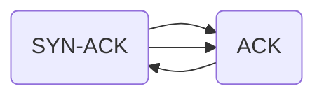
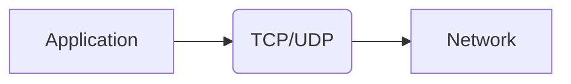
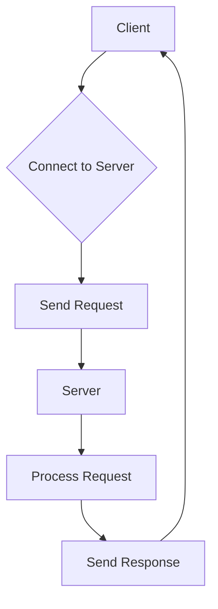

# <span style="color:#e67e22;">What we will learn in this post?</span>
<ul style='list-style-type: none; padding-left: 0;'>
<li><span style='color: #2980b9; font-size: 20px; font-weight: bold;'>👉</span> <span style='color: #2ecc71; font-size: 18px; font-weight: bold;'>Introduction to Java Networking</span></li>
<li><span style='color: #2980b9; font-size: 20px; font-weight: bold;'>👉</span> <span style='color: #2ecc71; font-size: 18px; font-weight: bold;'>TCP Architecture</span></li>
<li><span style='color: #2980b9; font-size: 20px; font-weight: bold;'>👉</span> <span style='color: #2ecc71; font-size: 18px; font-weight: bold;'>UDP Architecture</span></li>
<li><span style='color: #2980b9; font-size: 20px; font-weight: bold;'>👉</span> <span style='color: #2ecc71; font-size: 18px; font-weight: bold;'>IPV4 vs IPV6</span></li>
<li><span style='color: #2980b9; font-size: 20px; font-weight: bold;'>👉</span> <span style='color: #2ecc71; font-size: 18px; font-weight: bold;'>Connection-oriented vs Connectionless Protocols</span></li>
<li><span style='color: #2980b9; font-size: 20px; font-weight: bold;'>👉</span> <span style='color: #2ecc71; font-size: 18px; font-weight: bold;'>Socket Programming in Java</span></li>
<li><span style='color: #2980b9; font-size: 20px; font-weight: bold;'>👉</span> <span style='color: #2ecc71; font-size: 18px; font-weight: bold;'>Server Socket Class</span></li>
<li><span style='color: #2980b9; font-size: 20px; font-weight: bold;'>👉</span> <span style='color: #2ecc71; font-size: 18px; font-weight: bold;'>URL Class and Methods</span></li>
<li><span style='color: #2980b9; font-size: 20px; font-weight: bold;'>👉</span> <span style='color: #2ecc71; font-size: 18px; font-weight: bold;'>Conclusion!</span></li>
</ul>

# <span style="color:#e67e22">Java Networking Basics 🤝</span>

Java's robust networking capabilities make it a top choice for building applications that communicate over networks.  It provides a rich set of APIs within the `java.net` package, simplifying the process of creating clients and servers.  This allows developers to easily build applications like online games, chat programs, and distributed systems.


## <span style="color:#2980b9">Why Java for Networking?</span>

* **Platform Independence:** Java's "write once, run anywhere" philosophy means your network applications can run on various operating systems without modification.
* **Large Community & Resources:**  A vast community supports Java, providing ample resources, libraries, and support for tackling networking challenges.
* **Security:**  Java offers built-in security features to protect network applications from various threats.

## <span style="color:#2980b9">Simple Server Example ✨</span>

This example demonstrates a basic server using `ServerSocket` and `Socket`:


```java
import java.io.*;
import java.net.*;

public class SimpleServer {
    public static void main(String[] args) {
        try {
            ServerSocket serverSocket = new ServerSocket(8080); //Creates a server socket on port 8080
            System.out.println("Server started on port 8080");

            Socket clientSocket = serverSocket.accept(); // Accepts a client connection
            System.out.println("Client connected");

            BufferedReader in = new BufferedReader(new InputStreamReader(clientSocket.getInputStream()));
            String clientMessage = in.readLine(); //Read client message

            System.out.println("Client says: " + clientMessage);

            PrintWriter out = new PrintWriter(clientSocket.getOutputStream(), true);
            out.println("Hello from server!"); // Send response

            clientSocket.close();
            serverSocket.close();

        } catch (IOException e) {
            e.printStackTrace();
        }
    }
}
```

This code will print "Server started on port 8080" to the console. When a client connects and sends a message, the server will print the message and send back "Hello from server!".  You'll need a separate client to connect to this server (example not shown here).

### <span style="color:#8e44ad">Output Example:</span>

```
Server started on port 8080
Client connected
Client says: Hello server!
```

## <span style="color:#2980b9">Further Learning 🚀</span>

For more in-depth information, explore these resources:

* [Oracle Java Tutorials on Networking](https://docs.oracle.com/javase/tutorial/networking/index.html)
* [Baeldung Java Networking articles](https://www.baeldung.com/java-networking)


Remember to handle exceptions properly in real-world applications!  This simple example provides a foundation for building more complex networked applications in Java.


# <span style="color:#e67e22">TCP in Java Networking: A Friendly Guide 🤝</span>

TCP (Transmission Control Protocol) is the reliable workhorse of the internet. Unlike UDP, it guarantees _ordered_ and _error-free_ data delivery.  This is achieved through mechanisms like:

## <span style="color:#2980b9">Connection Establishment 🤝</span>

TCP uses a three-way handshake for connection setup:

* **SYN:** Client initiates connection.
* **SYN-ACK:** Server acknowledges and requests connection.
* **ACK:** Client confirms.

### <span style="color:#8e44ad">Simplified Diagram</span>



## <span style="color:#2980b9">Data Transfer & Reliability 💪</span>

* **Sequencing:**  Data packets are numbered for proper ordering.
* **Acknowledgement:**  The receiver acknowledges received packets.
* **Retransmission:**  Lost or corrupted packets are re-sent.
* **Flow Control:**  Prevents the sender from overwhelming the receiver.


## <span style="color:#2980b9">Simple Java TCP Example 💻</span>

This example shows a basic client-server exchange:

**Server:**

```java
import java.net.*;
import java.io.*;

public class TCPServer {
    public static void main(String[] args) throws IOException {
        ServerSocket serverSocket = new ServerSocket(8080);
        Socket clientSocket = serverSocket.accept();
        BufferedReader in = new BufferedReader(new InputStreamReader(clientSocket.getInputStream()));
        PrintWriter out = new PrintWriter(clientSocket.getOutputStream(), true);
        String line;
        while ((line = in.readLine()) != null) {
            System.out.println("Client: " + line);
            out.println("Server: Hello back!");
        }
        clientSocket.close();
        serverSocket.close();
    }
}
```

**Client:**

```java
import java.net.*;
import java.io.*;

public class TCPClient {
    public static void main(String[] args) throws IOException {
        Socket socket = new Socket("localhost", 8080);
        PrintWriter out = new PrintWriter(socket.getOutputStream(), true);
        BufferedReader in = new BufferedReader(new InputStreamReader(socket.getInputStream()));
        out.println("Hello Server!");
        String response = in.readLine();
        System.out.println("Server: " + response);
        socket.close();
    }
}
```


**Output (Server Console):**

```
Client: Hello Server!
```

**Output (Client Console):**

```
Server: Hello back!
```

For more in-depth information, check out [Oracle's Java Networking Tutorial](https://docs.oracle.com/javase/tutorial/networking/sockets/index.html).  Remember to compile and run both the server and client separately!  The server should be started first.


# <span style="color:#e67e22">UDP: The Speedy Messenger 💨</span>

UDP (User Datagram Protocol) is a connectionless protocol, meaning it doesn't establish a dedicated connection before sending data.  Think of it like sending a postcard – you just toss it in the mail and hope it arrives.  This makes it *fast* but *less reliable*.

## <span style="color:#2980b9">Key Characteristics ✨</span>

*   **Connectionless:** No handshake needed; faster but less reliable.
*   **Unreliable:**  Packets can be lost or arrive out of order.  No guarantees of delivery.
*   **Lightweight:**  Less overhead than TCP, making it faster.
*   **Fast:** Ideal for applications where speed is prioritized over reliability.


## <span style="color:#2980b9">UDP vs. TCP ⚖️</span>

| Feature        | UDP                               | TCP                                  |
|----------------|------------------------------------|--------------------------------------|
| Connection     | Connectionless                     | Connection-oriented                   |
| Reliability    | Unreliable                          | Reliable                              |
| Speed          | Faster                             | Slower                               |
| Overhead       | Low                                | High                                 |
| Error Handling | No error checking or retransmission | Error checking and retransmission     |


## <span style="color:#2980b9">Use Cases 🚀</span>

*   **Streaming:** Live video and audio (e.g., online gaming, video conferencing).  A few lost packets won't ruin the experience.
*   **DNS:**  Resolving domain names to IP addresses.
*   **Online Games:** Low latency is critical; some packet loss is acceptable.


## <span style="color:#2980b9">Simple Code Example (Python) 🐍</span>

```python
import socket

# Create a UDP socket
sock = socket.socket(socket.AF_INET, socket.SOCK_DGRAM)

# Send data
message = b'Hello, UDP!'
sock.sendto(message, ('127.0.0.1', 12345))  # Send to localhost port 12345

# Receive data (needs a separate receiver program running on port 12345)
data, addr = sock.recvfrom(1024)
print(f"Received: {data.decode()}")

sock.close()
```

**(Note: You'll need a separate program listening on port 12345 to receive the message.  This example just shows the sending side.)**


## <span style="color:#2980b9">Output (Example):</span>

```
Received: Hello, UDP!
```

[More info on UDP](https://en.wikipedia.org/wiki/User_Datagram_Protocol)

[More info on TCP](https://en.wikipedia.org/wiki/Transmission_Control_Protocol)


Remember, choosing between UDP and TCP depends entirely on your application's needs.  If speed is paramount and some data loss is acceptable, UDP is the way to go. Otherwise, TCP's reliability is essential.


# <span style="color:#e67e22">IPv4 vs. IPv6: A Friendly Comparison 🌎</span>

## <span style="color:#2980b9">Addressing Schemes 🏠</span>

IPv4 uses 32-bit addresses (e.g., `192.168.1.1`), resulting in a limited number of addresses.  IPv6 employs 128-bit addresses (e.g., `2001:0db8:85a3:0000:0000:8a2e:0370:7334`), offering a vastly larger address space. This solves IPv4's address exhaustion problem.


## <span style="color:#2980b9">Packet Structure 📦</span>

While both have similar basic structures (header, payload), IPv6 has a simplified header, removing options fields found in IPv4, leading to faster processing.


### <span style="color:#8e44ad">Key Differences Summarized</span>

* **IPv4:** 32-bit addresses, complex header.
* **IPv6:** 128-bit addresses, simplified header.


## <span style="color:#2980b9">IPv4 to IPv6 Transition in Java Networking 💻</span>

Transitioning involves using techniques like *dual-stacking* (supporting both IPv4 and IPv6 simultaneously) and *tunneling* (encapsulating IPv6 packets within IPv4).  Java's networking libraries (like `java.net`) offer built-in support for both protocols. You'll need to ensure your code is adaptable to both address types. For example, using methods that handle both `InetAddress` types gracefully is crucial.

### <span style="color:#8e44ad">Example (Conceptual):</span>

```java
InetAddress address = InetAddress.getByName("2001:db8::1"); // IPv6
// ... or ...
InetAddress address = InetAddress.getByName("192.168.1.1"); // IPv4
//Further processing that works with both types of InetAddress
```


**Note:**  Proper error handling for address resolution failures is vital in production environments.

[More on Java Networking](https://docs.oracle.com/javase/tutorial/networking/)


---
This comparison provides a high-level overview. Deeper dives into the intricacies of each protocol and the transition strategies are available through online resources.  Remember to consult official documentation for the most up-to-date information.


# <span style="color:#e67e22">Connection-Oriented vs. Connectionless Protocols in Java Networking 🤝</span>


## <span style="color:#2980b9">Connection-Oriented Protocols 🗄️</span>

Connection-oriented protocols, like a phone call, establish a dedicated connection before data transmission.  This ensures reliable, ordered delivery.  Think of it as a dedicated line.

### <span style="color:#8e44ad">Characteristics</span>
*   **Reliable:** Data arrives in order, with error detection and correction.
*   **Ordered:** Data packets arrive in the same sequence they were sent.
*   **Connection setup:** Requires a handshake before data transfer (like TCP's three-way handshake).
*   **Slower:** Overhead from connection establishment.

### <span style="color:#8e44ad">Example: TCP (Transmission Control Protocol)</span>
In Java, you'd use `java.net.Socket` and `java.net.ServerSocket` to work with TCP.


## <span style="color:#2980b9">Connectionless Protocols ✈️</span>

Connectionless protocols, like sending a postcard, don't establish a connection. Data is sent as individual packets, independently.  Reliability isn't guaranteed.

### <span style="color:#8e44ad">Characteristics</span>
*   **Unreliable:** Data may arrive out of order, be lost, or duplicated.
*   **Faster:** No connection setup overhead.
*   **Simple:** Easier to implement.
*   **Suitable for:** Applications where occasional data loss is acceptable (e.g., streaming).

### <span style="color:#8e44ad">Example: UDP (User Datagram Protocol)</span>
In Java, you use `java.net.DatagramSocket` and `java.net.DatagramPacket`.


## <span style="color:#2980b9">Summary Table</span>

| Feature          | Connection-Oriented (TCP) | Connectionless (UDP) |
|-----------------|--------------------------|-----------------------|
| Reliability      | High                      | Low                    |
| Ordering         | Guaranteed                | Not Guaranteed         |
| Speed            | Slower                    | Faster                  |
| Connection Setup | Yes                       | No                     |
| Java Classes     | `Socket`, `ServerSocket` | `DatagramSocket`, `DatagramPacket` |


For more information:

*   [Oracle Java Networking Documentation](https://docs.oracle.com/javase/tutorial/networking/index.html)




This simple diagram shows how applications use TCP/UDP to communicate over a network.  Remember to choose the protocol that best suits your application's needs!


# <span style="color:#e67e22">Socket Programming in Java 🤝</span>


Socket programming is like having a phone line for your computer.  It lets different computers (or programs) talk to each other over a network.  In Java, it's crucial for building anything from simple chat apps to complex, distributed systems.

## <span style="color:#2980b9">Client-Server Interaction 💻</span>

Imagine a *client* (like your web browser) wanting information from a *server* (like a website).  They use sockets to establish a connection. The client sends a request, the server processes it, and sends back a response. This happens through input and output streams, just like talking on the phone.

### <span style="color:#8e44ad">Example: Simple Chat</span>

A simple client might send a message like `"Hello, server!"`, while the server responds with `"Hi there, client!"`.

```java
//Simplified example - requires error handling in real applications.
Socket socket = new Socket("localhost", 12345); //Connect to server on port 12345
// ... Send and receive data using streams ...
socket.close();
```

Here's a basic flowchart:




## <span style="color:#2980b9">Importance of Sockets ✨</span>

*   **Network Communication:** The foundation for all network applications.
*   **Flexibility:** Supports various communication protocols (TCP, UDP).
*   **Scalability:** Enables building large-scale distributed systems.


For more in-depth information and tutorials, check out: [Oracle's Java Socket Documentation](https://docs.oracle.com/javase/tutorial/networking/sockets/)  and [Baeldung's Java Socket Programming Tutorial](https://www.baeldung.com/java-sockets). Remember to always handle exceptions appropriately in real-world applications! 


# <span style="color:#e67e22">ServerSocket: Your Java Server's Gateway 🤝</span>

The `ServerSocket` class in Java is your essential tool for building network servers.  Think of it as the *doorway* to your application, waiting for clients to connect.  It listens on a specific port for incoming connection requests. Once a client connects, the `ServerSocket` hands off the communication to a `Socket` object for individual client handling.

## <span style="color:#2980b9">Key Methods & Functionality ✨</span>

*   `ServerSocket(int port)`: Creates a `ServerSocket` listening on the specified port.
*   `accept()`: This is the magic! It *blocks* until a client connects, then returns a `Socket` object for that connection.
*   `close()`:  Closes the `ServerSocket`, stopping it from listening.


## <span style="color:#2980b9">Multi-threaded Server Example 🧵</span>

This example demonstrates a simple multi-threaded server that echoes back client messages:

```java
import java.io.*;
import java.net.*;

public class MultiThreadedServer {
    public static void main(String[] args) throws IOException {
        ServerSocket serverSocket = new ServerSocket(8080);
        System.out.println("Server started on port 8080");

        while (true) {
            Socket clientSocket = serverSocket.accept();
            System.out.println("Client connected: " + clientSocket.getInetAddress());
            new Thread(new ClientHandler(clientSocket)).start();
        }
    }

    static class ClientHandler implements Runnable {
        Socket clientSocket;
        ClientHandler(Socket socket){
            this.clientSocket = socket;
        }
        @Override
        public void run() {
            try {
                BufferedReader in = new BufferedReader(new InputStreamReader(clientSocket.getInputStream()));
                PrintWriter out = new PrintWriter(clientSocket.getOutputStream(), true);

                String inputLine;
                while ((inputLine = in.readLine()) != null) {
                    out.println("Echo: " + inputLine);
                    if (inputLine.equals("bye")) break;
                }
                clientSocket.close();
            } catch (IOException e) {
                e.printStackTrace();
            }
        }
    }
}
```

### <span style="color:#8e44ad">Output (Server Console):</span>

```
Server started on port 8080
Client connected: /127.0.0.1
Echo: Hello Server!
Echo: bye
```


## <span style="color:#2980b9">Further Learning 🚀</span>

*   [Oracle Java Documentation on ServerSocket](https://docs.oracle.com/javase/8/docs/api/java/net/ServerSocket.html)


This example showcases the power of `ServerSocket` in building robust, concurrent servers. Remember to handle exceptions appropriately in a production environment! 


```mermaid
graph TD
    A[Client] --> B{ServerSocket.accept()};
    B -- Connection --> C[Socket];
    C --> D[ClientHandler Thread];
    D --> E[Process Client Request];
    E --> F[Send Response];
    F --> C;
```


# <span style="color:#e67e22">Java's URL Class: Your Web Address Manager 🌐</span>

Java's `URL` class is your trusty sidekick for handling web addresses (Uniform Resource Locators, or URLs).  Think of it as a smart parser and handler for all those `http://` and `https://` links you see everywhere.  It helps you break down a URL into its parts (protocol, domain, path, etc.) and interact with the resource it points to.


## <span style="color:#2980b9">Key Methods & Functionality ✨</span>

The `URL` class offers several useful methods:

*   `getProtocol()`:  Gets the protocol (e.g., "http").
*   `getHost()`: Gets the hostname (e.g., "www.example.com").
*   `getPath()`: Gets the path part of the URL.
*   `openStream()`: Opens a connection to the URL and returns an input stream, allowing you to read the content.

### <span style="color:#8e44ad">Example: Reading Content from a URL 📄</span>

```java
import java.io.BufferedReader;
import java.io.InputStreamReader;
import java.net.URL;

public class URLExample {
    public static void main(String[] args) throws Exception {
        URL url = new URL("https://www.example.com"); //Replace with your URL
        BufferedReader reader = new BufferedReader(new InputStreamReader(url.openStream()));
        String line;
        while ((line = reader.readLine()) != null) {
            System.out.println(line);
        }
        reader.close();
    }
}
```

This code snippet fetches the content from `https://www.example.com` and prints it line by line to the console.  *Remember to replace `https://www.example.com` with a URL you want to access.*  The output will vary depending on the website's content.


## <span style="color:#2980b9">Use Cases 💡</span>

*   **Web Scraping:** Extract data from websites.
*   **Downloading Files:** Retrieve files from remote servers.
*   **Building Network Applications:** Create applications that interact with web services.


**Note:** Always handle potential exceptions (like `IOException`) when working with network resources.  Consider adding error handling for a robust application.


[More on Java's URL Class](https://docs.oracle.com/javase/7/docs/api/java/net/URL.html)  This link provides comprehensive documentation.

Remember to always be respectful of website terms of service and robots.txt when accessing and processing website content.


<h1><span style='color:#e67e22'>Conclusion</span></h1>

And there you have it!  We hope you enjoyed this post. 😊 We're always looking to improve, so we'd love to hear your thoughts!  What did you think?  Any feedback, suggestions, or questions?  Let us know in the comments below! 👇  We can't wait to chat with you!  💬


