# <span style="color:#e67e22;">What we will learn in this post?</span>

<ul style='list-style-type: none; padding-left: 0;'>
<li><span style='color: #2980b9; font-size: 20px; font-weight: bold;'>👉</span> <span style='color: #2ecc71; font-size: 18px; font-weight: bold;'>Unit Testing Components</span></li>
<li><span style='color: #2980b9; font-size: 20px; font-weight: bold;'>👉</span> <span style='color: #2ecc71; font-size: 18px; font-weight: bold;'>Testing Services</span></li>
<li><span style='color: #2980b9; font-size: 20px; font-weight: bold;'>👉</span> <span style='color: #2ecc71; font-size: 18px; font-weight: bold;'>Mocking Dependencies</span></li>
<li><span style='color: #2980b9; font-size: 20px; font-weight: bold;'>👉</span> <span style='color: #2ecc71; font-size: 18px; font-weight: bold;'>End-to-End Testing</span></li>
<li><span style='color: #2980b9; font-size: 20px; font-weight: bold;'>👉</span> <span style='color: #2ecc71; font-size: 18px; font-weight: bold;'>Conclusion!</span></li>
</ul>

# <span style="color:#e67e22">Testing Angular Components with Jasmine & Karma 🎉</span>

This guide shows you how to write unit tests for your Angular components using Jasmine and Karma. We'll focus on testing component methods and template bindings.

## <span style="color:#2980b9">Setting up your Test Environment ⚙️</span>

Before you start, make sure you have Karma and Jasmine set up in your Angular project. You'll typically find test files alongside your component files (e.g., `my-component.component.ts` and `my-component.component.spec.ts`).

## <span style="color:#2980b9">Testing Component Methods 💪</span>

Let's say you have a component with a method to increment a counter:

```typescript
// my-component.component.ts
import { Component } from "@angular/core"

@Component({
  selector: "app-my-component",
  template: `...`,
})
export class MyComponent {
  counter = 0

  incrementCounter() {
    this.counter++
  }
}
```

Here's how you'd test the `incrementCounter` method:

```typescript
// my-component.component.spec.ts
import { ComponentFixture, TestBed } from "@angular/core/testing"
import { MyComponent } from "./my-component.component"

describe("MyComponent", () => {
  let component: MyComponent
  let fixture: ComponentFixture<MyComponent>

  beforeEach(() => {
    TestBed.configureTestingModule({
      declarations: [MyComponent],
    })
    fixture = TestBed.createComponent(MyComponent)
    component = fixture.componentInstance
  })

  it("should increment the counter", () => {
    expect(component.counter).toBe(0)
    component.incrementCounter()
    expect(component.counter).toBe(1)
  })
})
```

### <span style="color:#8e44ad">Key Points</span>

- We use `TestBed` to create a testing module.
- `componentInstance` gives access to the component's properties and methods.
- `expect` and `toBe` are Jasmine matchers for assertions.

## <span style="color:#2980b9">Testing Template Bindings & User Interactions 🖱️</span>

Let's test if a property is correctly displayed in the template:

```typescript
// my-component.component.ts
// ... (same component as above)
template: `<h1>Counter: {{counter}}</h1>`
```

```typescript
// my-component.component.spec.ts
it("should display the counter in the template", () => {
  component.counter = 5 // Set the counter value
  fixture.detectChanges() // Update the template
  const compiled = fixture.nativeElement // Get the rendered HTML
  expect(compiled.querySelector("h1").textContent).toContain("Counter: 5")
})
```

## <span style="color:#2980b9">Simulating User Interactions 🎭</span>

To simulate user clicks, use `triggerEventHandler`:

```typescript
it("should call a method on button click", () => {
  spyOn(component, "incrementCounter") // Spy on the method
  const button = fixture.debugElement.query(By.css("button")).nativeElement
  button.click() // Simulate click
  expect(component.incrementCounter).toHaveBeenCalled()
})
```

For more in-depth information, check out the official Angular documentation: [https://angular.io/guide/testing](https://angular.io/guide/testing)

Remember, writing good unit tests is crucial for building robust and maintainable Angular applications! Happy testing! 🚀

# <span style="color:#e67e22">Testing Angular Services 🎉</span>

Let's learn how to write tests for your Angular services, especially those interacting with APIs. We'll use `HttpClientTestingModule` to make testing easier and more reliable.

## <span style="color:#2980b9">Setting up the Test Environment ⚙️</span>

Before we start writing tests, ensure you have the necessary modules imported:

```typescript
import { TestBed } from "@angular/core/testing"
import {
  HttpClientTestingModule,
  HttpTestingController,
} from "@angular/common/http/testing"
// ... your service import ...
```

In your `beforeEach` block, set up the testing module:

```typescript
beforeEach(() => {
  TestBed.configureTestingModule({
    imports: [HttpClientTestingModule],
    providers: [YourApiService], //Replace YourApiService with your service name
  })
  service = TestBed.inject(YourApiService)
  httpController = TestBed.inject(HttpTestingController)
})
```

## <span style="color:#2980b9">Testing HTTP Calls 🌐</span>

Let's say you have a service `YourApiService` that fetches data from an API endpoint:

```typescript
//YourApiService.ts
import { Injectable } from "@angular/core"
import { HttpClient } from "@angular/common/http"
import { Observable } from "rxjs"

@Injectable({
  providedIn: "root",
})
export class YourApiService {
  constructor(private http: HttpClient) {}

  getData(): Observable<any> {
    return this.http.get("/api/data")
  }
}
```

### <span style="color:#8e44ad">Mocking the HTTP Request</span>

In your test, you'll mock the HTTP request using `httpController.expectOne`:

```typescript
it("should fetch data successfully", () => {
  const mockData = { name: "Test Data" }
  service.getData().subscribe((data) => expect(data).toEqual(mockData))

  const req = httpController.expectOne("/api/data")
  req.flush(mockData) // Return mock data
  httpController.verify() // Ensure no outstanding requests
})
```

This test simulates a successful API call. You can similarly test error scenarios by using `req.error(new Error('API Error'))`.

```mermaid
graph TD
    A["🛠️ Test Setup"] --> B{"🌐 Make API call"};
    B -- "✅ Success" --> C["🔍 Verify response"];
    B -- "❌ Error" --> D["🚨 Verify error handling"];
    C --> E["🏁 Test Passed"];
    D --> E;

    class A setupStyle;
    class B apiCallStyle;
    class C verifyResponseStyle;
    class D verifyErrorStyle;
    class E testPassedStyle;

    classDef setupStyle fill:#90CAF9,stroke:#1E88E5,color:#000000,font-size:14px,stroke-width:2px,rx:10,shadow:3px;
    classDef apiCallStyle fill:#FFCC80,stroke:#FB8C00,color:#000000,font-size:14px,stroke-width:2px,rx:10,shadow:3px;
    classDef verifyResponseStyle fill:#A5D6A7,stroke:#388E3C,color:#000000,font-size:14px,stroke-width:2px,rx:10,shadow:3px;
    classDef verifyErrorStyle fill:#FFAB91,stroke:#E64A19,color:#000000,font-size:14px,stroke-width:2px,rx:10,shadow:3px;
    classDef testPassedStyle fill:#B39DDB,stroke:#673AB7,color:#000000,font-size:14px,stroke-width:2px,rx:10,shadow:3px;

```

## <span style="color:#2980b9">Example Flowchart</span>



Remember to always verify your requests using `httpController.verify()` to avoid unexpected behavior!

**Resources:**

- [Angular Testing Guide](https://angular.io/guide/testing)
- [HttpClientTestingModule Docs](https://angular.io/api/common/http/HttpClientTestingModule)

This approach ensures your tests are fast, reliable, and independent of your actual backend API. Remember to replace placeholders like `YourApiService` and `/api/data` with your actual service and endpoint. Happy testing! 🧪

# <span style="color:#e67e22">Mocking Dependencies in Angular Tests 🎉</span>

Testing Angular components and services often involves dealing with dependencies. Mocking helps isolate your code and focus on the unit under test. Let's see how spies and stubs help!

## <span style="color:#2980b9">Spies and Stubs: Your Testing Sidekicks 🕵️‍♂️</span>

- **Spies:** These track interactions with a dependency. You use them to verify if a method was called, how many times, and with what arguments. Think of them as secret agents reporting back on the actions of your dependencies.

- **Stubs:** These replace a dependency with a simplified version that returns predefined values. They're like actors playing the role of your dependencies in your test, providing consistent, controlled behavior.

### <span style="color:#8e44ad">Example: Mocking an API Call 💻</span>

Let's say you have a `UserService` that fetches user data from an API:

```typescript
// UserService
import { HttpClient } from "@angular/common/http"

@Injectable({ providedIn: "root" })
export class UserService {
  constructor(private http: HttpClient) {}

  getUser(id: number) {
    return this.http.get(`/api/users/${id}`)
  }
}
```

In your test, you'd mock the `HttpClient`:

```typescript
import { TestBed } from "@angular/core/testing"
import { UserService } from "./user.service"
import { HttpClient, HttpClientModule } from "@angular/common/http"
import { of } from "rxjs"

describe("UserService", () => {
  let service: UserService
  let httpSpy: jasmine.SpyObj<HttpClient>

  beforeEach(() => {
    const spy = jasmine.createSpyObj("HttpClient", ["get"])
    TestBed.configureTestingModule({
      imports: [HttpClientModule],
      providers: [{ provide: HttpClient, useValue: spy }],
    })
    service = TestBed.inject(UserService)
    httpSpy = TestBed.inject(HttpClient) as jasmine.SpyObj<HttpClient>
  })

  it("should get user", () => {
    const mockUser = { id: 1, name: "John Doe" }
    httpSpy.get.and.returnValue(of(mockUser)) // Stubbing the response
    service.getUser(1).subscribe((user) => expect(user).toEqual(mockUser))
  })
})
```

Here, `httpSpy.get` is a spy that records the calls to `get`. We use `and.returnValue` to stub its response.

## <span style="color:#2980b9">Resources 📚</span>

- [Angular Testing Guide](https://angular.io/guide/testing)
- [Jasmine Documentation](https://jasmine.github.io/api/edge/index.html)

Remember, mocking is crucial for writing effective unit tests in Angular. It lets you isolate your code's logic, leading to more reliable and maintainable tests. Happy testing! 😊

# <span style="color:#e67e22">End-to-End Testing for Angular Apps: Protractor & Cypress</span> 🧪

End-to-End (E2E) testing is like taking your Angular app for a test drive. It checks if everything works together smoothly, from the user's perspective. We'll explore two popular tools: Protractor and Cypress.

## <span style="color:#2980b9">Protractor: A Selenium-based Approach</span> 🤖

Protractor uses Selenium to automate browser actions. It's specifically designed for Angular apps, understanding their architecture.

### <span style="color:#8e44ad">Example: Logging In</span>

```javascript
describe("Login", () => {
  it("should log in successfully", () => {
    browser.get("/login") // Navigate to login page
    element(by.id("username")).sendKeys("testuser") //Enter username
    element(by.id("password")).sendKeys("password") //Enter password
    element(by.buttonText("Login")).click() //Click login button

    expect(element(by.css(".welcome-message")).getText()).toEqual(
      "Welcome, testuser!",
    ) //Assert success
  })
})
```

[Protractor Documentation](https://www.protractortest.org/)

## <span style="color:#2980b9">Cypress: A Modern Approach</span> ✨

Cypress is a more modern E2E testing framework known for its ease of use and debugging capabilities.

### <span style="color:#8e44ad">Example: Submitting a Form</span>

```javascript
describe("Form Submission", () => {
  it("should submit the form successfully", () => {
    cy.visit("/form")
    cy.get("#name").type("Test User")
    cy.get("#email").type("test@example.com")
    cy.get('button[type="submit"]').click()
    cy.contains("Thank you for submitting the form!").should("be.visible")
  })
})
```

[Cypress Documentation](https://docs.cypress.io/)

## <span style="color:#2980b9">Choosing Your Tool</span> 🤔

- **Protractor:** Mature, specifically for Angular, but can be less intuitive.
- **Cypress:** Modern, user-friendly, excellent debugging, but might require some Angular-specific configurations.

Ultimately, the best tool depends on your team's experience and project needs. Both are powerful options for ensuring a smooth user experience in your Angular application.

```mermaid
graph TD
    A["🏁 Start"] --> B{"🤔 Protractor or Cypress?"};
    B -- "📌 Protractor" --> C["🛠️ Selenium-based, Angular specific"];
    B -- "✨ Cypress" --> D["💻 Modern, user-friendly"];
    C --> E["✍️ Write tests"];
    D --> E;
    E --> F["🚀 Run tests"];
    F --> G["✅ Success / ❌ Failure"];

    class A startStyle;
    class B choiceStyle;
    class C protractorStyle;
    class D cypressStyle;
    class E writeTestsStyle;
    class F runTestsStyle;
    class G resultStyle;

    classDef startStyle fill:#90CAF9,stroke:#1E88E5,color:#000000,font-size:14px,stroke-width:2px,rx:10,shadow:3px;
    classDef choiceStyle fill:#FFCC80,stroke:#FB8C00,color:#000000,font-size:14px,stroke-width:2px,rx:10,shadow:3px;
    classDef protractorStyle fill:#A5D6A7,stroke:#388E3C,color:#000000,font-size:14px,stroke-width:2px,rx:10,shadow:3px;
    classDef cypressStyle fill:#FFAB91,stroke:#E64A19,color:#000000,font-size:14px,stroke-width:2px,rx:10,shadow:3px;
    classDef writeTestsStyle fill:#FFE082,stroke:#F9A825,color:#000000,font-size:14px,stroke-width:2px,rx:10,shadow:3px;
    classDef runTestsStyle fill:#B39DDB,stroke:#673AB7,color:#000000,font-size:14px,stroke-width:2px,rx:10,shadow:3px;
    classDef resultStyle fill:#EF9A9A,stroke:#D32F2F,color:#000000,font-size:14px,stroke-width:2px,rx:10,shadow:3px;

```



<h1><span style='color:#e67e22'>Conclusion</span></h1>

So there you have it! We hope you enjoyed this post and found it helpful 😊. We're always looking to improve, so we'd love to hear your thoughts! What did you think? Anything you'd like to see more of? Let us know in the comments below 👇 We can't wait to read your feedback! Let's chat! 💬
