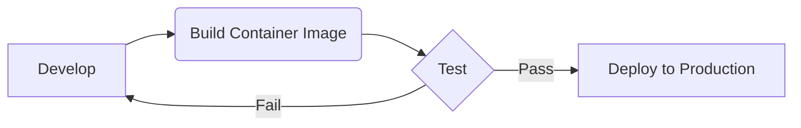
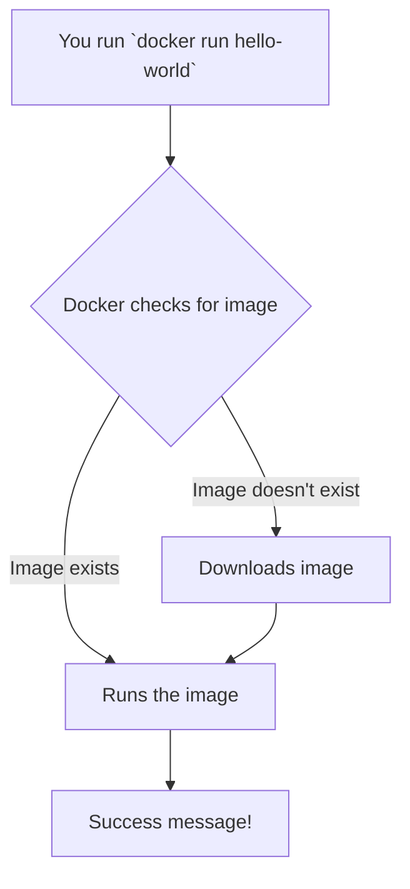
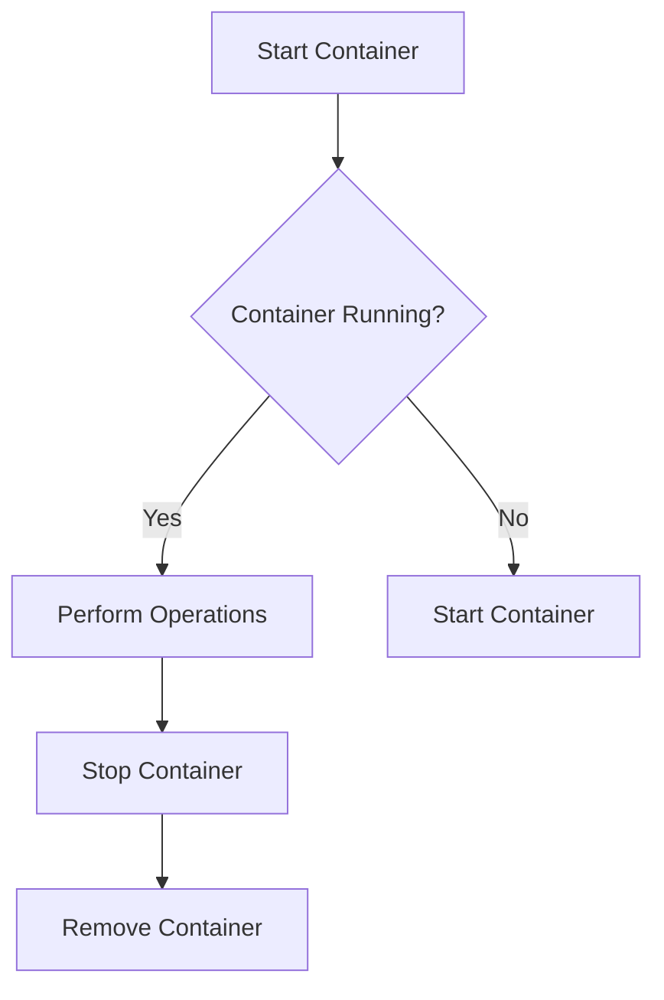

# <span style="color:#e67e22;">What we will learn in this post?</span>
<ul style='list-style-type: none; padding-left: 0;'>
<li><span style='color: #2980b9; font-size: 20px; font-weight: bold;'>👉</span> <span style='color: #2ecc71; font-size: 18px; font-weight: bold;'>What is Containerization?</span></li>
<li><span style='color: #2980b9; font-size: 20px; font-weight: bold;'>👉</span> <span style='color: #2ecc71; font-size: 18px; font-weight: bold;'>Installing and Using Docker</span></li>
<li><span style='color: #2980b9; font-size: 20px; font-weight: bold;'>👉</span> <span style='color: #2ecc71; font-size: 18px; font-weight: bold;'>Writing Dockerfiles</span></li>
<li><span style='color: #2980b9; font-size: 20px; font-weight: bold;'>👉</span> <span style='color: #2ecc71; font-size: 18px; font-weight: bold;'>Managing Containers and Images</span></li>
<li><span style='color: #2980b9; font-size: 20px; font-weight: bold;'>👉</span> <span style='color: #2ecc71; font-size: 18px; font-weight: bold;'>Docker Compose for Multi-Container Applications</span></li>
<li><span style='color: #2980b9; font-size: 20px; font-weight: bold;'>👉</span> <span style='color: #2ecc71; font-size: 18px; font-weight: bold;'>Conclusion!</span></li>
</ul>

# <span style="color:#e67e22">Containerization: Revolutionizing Software Deployment 🚀</span>

Containerization is like packing a perfectly organized suitcase for your application.  Instead of carrying *everything* (like your entire wardrobe and kitchen sink), you only take what's needed for your trip. This "suitcase" is a *container*, and it makes software deployment much easier and faster.

## <span style="color:#2980b9">What are Containers? 🤔</span>

Containers package an application and all its dependencies (libraries, system tools, etc.) into an isolated unit.  Think of it as a lightweight virtual machine, but without the overhead of a full operating system.  Each container shares the host OS kernel, making them incredibly efficient.

### <span style="color:#8e44ad">How it works 📦</span>

A container image is a snapshot of the application and its dependencies.  When you run the image, it creates a container instance.  This instance is completely isolated from other containers and the host system, preventing conflicts and ensuring consistent behavior.

[More Info on Container Images](https://www.docker.com/resources/what-container)

## <span style="color:#2980b9">Advantages of Containerization ✨</span>

*   **Portability:** Run your application anywhere – from your laptop to the cloud – without worrying about compatibility issues.
*   **Scalability:** Easily create many container instances to handle increased traffic and demands.  It’s like having many identical suitcases, each carrying your app.
*   **Consistency:**  Containers ensure your application runs the same way across different environments (development, testing, production). No more "it works on my machine!" issues!
*   **Efficiency:** Lightweight and resource-efficient compared to virtual machines.


## <span style="color:#2980b9">Containerization in DevOps ⚙️</span>

Containerization simplifies DevOps workflows significantly.

### <span style="color:#8e44ad">Simplified Deployment</span>



*   Developers build and test container images locally.
*   The same image is deployed to different stages (testing, staging, production) ensuring consistency.
*   Automated deployment tools, like Kubernetes, orchestrate the entire process seamlessly.

[Learn more about Kubernetes](https://kubernetes.io/)


**In short:** Containerization offers incredible benefits for software development and deployment, making it faster, more reliable, and more efficient.  It's a key component of modern DevOps practices and cloud-native architectures.


# <span style="color:#e67e22">Get Started with Docker: Your First Container 🎉</span>

Docker makes running applications easy! Let's get you set up.

## <span style="color:#2980b9">Installing Docker 🐳</span>

Docker installation varies slightly depending on your operating system.  Here's a quick guide:

### <span style="color:#8e44ad">Windows 🪟</span>
1. Download the installer from the official Docker website: [https://www.docker.com/products/docker-desktop/](https://www.docker.com/products/docker-desktop/)
2. Follow the on-screen instructions.  It's pretty straightforward!
3. After installation, open your command prompt or PowerShell and run `docker --version`. You should see the Docker version printed.

### <span style="color:#8e44ad">macOS 🍎</span>
1.  Download Docker Desktop from [https://www.docker.com/products/docker-desktop/](https://www.docker.com/products/docker-desktop/)
2. Follow the installation instructions.
3. Verify the installation with `docker --version` in your terminal.

### <span style="color:#8e44ad">Linux 🐧</span>
Linux installation varies by distribution. Consult the official Docker documentation for your specific distro: [https://docs.docker.com/engine/install/](https://docs.docker.com/engine/install/)  Generally, it involves using your distribution's package manager (e.g., `apt`, `yum`, `dnf`).  Remember to verify with `docker --version` afterwards.


## <span style="color:#2980b9">Running Your First Container 🚀</span>

Let's run the classic "hello-world" container:

1. Open your terminal or command prompt.
2. Type the command: `docker run hello-world` and press Enter.
3. Docker will download the `hello-world` image and run it. You'll see a success message!

This is what happens:



## <span style="color:#2980b9">Understanding Docker Commands 🔎</span>

*   `**docker run hello-world**`: This command downloads the `hello-world` image (if it's not already present) and runs it in a new container.
*   `**docker ps**`: This lists all currently *running* containers.  You won't see anything after the `hello-world` container finishes (it's very short-lived).
*   `**docker ps -a**`: This lists *all* containers, including those that have stopped.

That's it! You've successfully installed Docker and run your first container.  Explore more commands and images – the Docker world is vast and exciting!  Happy containerizing!  🥳


# <span style="color:#e67e22">Building Docker Images with Dockerfiles 🎉</span>

A Dockerfile is a text file containing instructions on how to build a Docker image.  It's like a recipe for creating a self-contained, runnable environment. Let's explore the key ingredients!

## <span style="color:#2980b9">Essential Dockerfile Instructions</span>

*   **`FROM`**: This is the *first* instruction, specifying the base image (e.g., a pre-built Linux distribution) to start from.  Think of it as your foundation.  Example: `FROM ubuntu:latest`
*   **`RUN`**: Executes commands during the image's *build* process. It's used to install software, update packages, or perform other setup tasks. Example: `RUN apt-get update && apt-get install -y python3`
*   **`COPY`**: Copies files and directories from your local system *into* the image.  Essential for adding your application's code. Example: `COPY . /app`
*   **`CMD`**: Specifies the command to run when the container starts.  This is what your application actually *does*. Example: `CMD ["python3", "app.py"]`

### <span style="color:#8e44ad">Example: A Simple Web App</span>

Let's create a Dockerfile for a basic Python web application:

```dockerfile
FROM python:3.9-slim-buster

WORKDIR /app

COPY requirements.txt .
RUN pip install --no-cache-dir -r requirements.txt

COPY . .

CMD ["python3", "app.py"]
```

This Dockerfile uses a slim Python image, sets a working directory, installs dependencies from `requirements.txt`, copies the application code, and finally runs the application using `app.py`.  Remember to have `app.py` and `requirements.txt` in the same directory as your Dockerfile.

## <span style="color:#2980b9">Building and Running the Image</span>

1.  Save the above code as `Dockerfile`.
2.  Open your terminal and navigate to the directory containing the `Dockerfile`.
3.  Build the image using: `docker build -t my-web-app .`  (The `.` refers to the current directory).
4.  Run the container: `docker run -p 8000:8000 my-web-app` (This maps port 8000 on your host machine to port 8000 in the container).

Now you can access your web app at `http://localhost:8000`!

---

**For more information:**

*   [Docker Documentation](https://docs.docker.com/)


This simple example demonstrates the core concepts.  More complex applications might need more instructions, such as `ENV` for setting environment variables or `EXPOSE` to define exposed ports.  Experiment and explore to master Dockerfile creation! 🚀


# <span style="color:#e67e22">Managing Docker Containers & Images 🐳</span>

Docker simplifies application deployment by packaging them into containers.  Let's explore how to manage these containers and their associated images.


## <span style="color:#2980b9">Listing Containers and Images</span>

To see your running containers, use:

```bash
docker ps
```

This displays *running* containers.  To see *all* containers (including stopped ones), add the `-a` flag: `docker ps -a`.

To list your Docker images, use:

```bash
docker images
```
This shows all the images available on your system.


## <span style="color:#2980b9">Container States 🚦</span>

Containers have several states:

* **Running:** The container is actively executing.
* **Stopped:** The container has been manually stopped.
* **Exited:** The container's process has finished executing (successfully or with an error).


## <span style="color:#2980b9">Starting, Stopping, and Restarting Containers</span>

### <span style="color:#8e44ad">Starting a Container</span>

To start a stopped container (replace `<container_id>` with the actual ID):

```bash
docker start <container_id>
```

### <span style="color:#8e44ad">Stopping a Container</span>

To gracefully stop a running container:

```bash
docker stop <container_id>
```

For forceful stopping use `docker kill <container_id>`.

### <span style="color:#8e44ad">Restarting a Container</span>

To restart a container:

```bash
docker restart <container_id>
```


## <span style="color:#2980b9">Removing Containers and Images 🗑️</span>

To remove a stopped container:

```bash
docker rm <container_id>
```

**Caution:**  Use `docker rm -f <container_id>` to forcefully remove a running container.

To remove an image:

```bash
docker rmi <image_id>
```

Remember to remove dependent images first if needed.


## <span style="color:#2980b9">DevOps Best Practices 🚀</span>

* **Use Docker Compose:** For managing multi-container applications.
* **Automate Builds:** Utilize CI/CD pipelines for automated image building and deployment.
* **Version Control Images:** Store your images in a registry (e.g., Docker Hub).
* **Tag Images:**  Use meaningful tags (e.g., `v1.0`, `latest`).
* **Regular Cleanup:** Regularly remove unused images and containers to save disk space.


[More info on Docker](https://docs.docker.com/)




# <span style="color:#e67e22">Docker Compose:  Making Multi-Container Apps Easy 🐳</span>

Docker Compose simplifies managing applications that need multiple Docker containers.  Instead of juggling individual `docker run` commands, you define everything in a single file, `docker-compose.yml`. Think of it as a recipe for your application!


## <span style="color:#2980b9">Understanding `docker-compose.yml` 📖</span>

This YAML file describes your application's services, networks, and volumes.  Let's break it down:

### <span style="color:#8e44ad">Services ⚙️</span>

Each service represents a container.  You define its image, ports, environment variables, and more.  For example:

```yaml
web:
  image: nginx:latest
  ports:
    - "80:80"
```

This creates a container from the `nginx:latest` image, mapping port 80 on your host to port 80 inside the container.


### <span style="color:#8e44ad">Networks 🔗</span>

Define how containers communicate.  A shared network allows containers to reach each other using their service names.

```yaml
networks:
  my-network:
```


### <span style="color:#8e44ad">Volumes 💾</span>

Persistent storage for your data. This ensures your data survives container restarts.

```yaml
volumes:
  db_data:
```

## <span style="color:#2980b9">Example: Web App with Database 🌐</span>

Let's create a simple web app using `nginx` and a `PostgreSQL` database:

```yaml
version: "3.9"
services:
  web:
    image: nginx:latest
    ports:
      - "80:80"
    volumes:
      - ./html:/usr/share/nginx/html
    networks:
      - my-network
  db:
    image: postgres:13
    ports:
      - "5432:5432"
    environment:
      - POSTGRES_PASSWORD=mysecretpassword
    volumes:
      - db_data:/var/lib/postgresql/data
    networks:
      - my-network
networks:
  my-network:
volumes:
  db_data:
```

**To run this:**

1. Save the above as `docker-compose.yml`.
2. Run `docker-compose up -d`.  The `-d` runs it in detached mode (background).
3. Access your app at `http://localhost`.


## <span style="color:#2980b9">Simplified Workflow ✨</span>

Docker Compose dramatically simplifies the process:

* **Single command to start/stop all containers:** `docker-compose up/down`
* **Easy scaling:**  Easily increase the number of containers for a service.
* **Environment consistency:**  Ensure consistent environments across development, testing and production.


**For more info:** [Docker Compose Documentation](https://docs.docker.com/compose/)


Remember to replace placeholders like passwords with your actual credentials.  Enjoy the simplicity of Docker Compose! 🎉


<h1><span style='color:#e67e22'>Conclusion</span></h1>

So there you have it!  We've covered a lot of ground today, and hopefully, you found it helpful and interesting. 😊  But this isn't the end of the conversation!  We'd love to hear your thoughts, feedback, and any brilliant ideas you might have.  What did you think of [mention a specific point from the blog]?  What other topics would you like us to explore?  Let us know in the comments below! 👇 We're all ears (and eyes!) and excited to hear from you!  🥳


