# <span style="color:#e67e22;">What we will learn in this post?</span>
<ul style='list-style-type: none; padding-left: 0;'>
<li><span style='color: #2980b9; font-size: 20px; font-weight: bold;'>👉</span> <span style='color: #2ecc71; font-size: 18px; font-weight: bold;'>Lazy Loading Modules</span></li>
<li><span style='color: #2980b9; font-size: 20px; font-weight: bold;'>👉</span> <span style='color: #2ecc71; font-size: 18px; font-weight: bold;'>OnPush Change Detection</span></li>
<li><span style='color: #2980b9; font-size: 20px; font-weight: bold;'>👉</span> <span style='color: #2ecc71; font-size: 18px; font-weight: bold;'>Avoiding Unnecessary DOM Updates</span></li>
<li><span style='color: #2980b9; font-size: 20px; font-weight: bold;'>👉</span> <span style='color: #2ecc71; font-size: 18px; font-weight: bold;'>Analyzing Performance</span></li>
<li><span style='color: #2980b9; font-size: 20px; font-weight: bold;'>👉</span> <span style='color: #2ecc71; font-size: 18px; font-weight: bold;'>Conclusion!</span></li>
</ul>

# <span style="color:#e67e22">🚀 Boosting Angular App Speed with Lazy Loading</span>

Lazy loading is like a smart buffet for your Angular application. Instead of loading *everything* at once, it only loads what's needed, when it's needed. This drastically improves initial load time and overall performance. Think of it as only bringing out the dishes you actually order, rather than setting up a whole banquet you might not even touch!

## <span style="color:#2980b9">How Lazy Loading Works ✨</span>

Imagine your app has different features: a product catalog, a user profile, and a contact form.  With lazy loading, these features are each in separate *modules*.  Only when a user navigates to a specific feature (e.g., clicks the "Profile" button), does Angular load the corresponding module.

### <span style="color:#8e44ad">Step-by-Step Implementation</span>

1. **Create Feature Modules:**  Organize your features into separate modules. For example, create `products.module.ts`, `profile.module.ts`, `contact.module.ts`.

2. **Define Routes with `loadChildren`:**  In your main routing module (`app-routing.module.ts`), define routes using `loadChildren`.  This tells Angular to load the module only on demand.

   ```typescript
   const routes: Routes = [
     {
       path: 'products',
       loadChildren: () => import('./products/products.module').then(m => m.ProductsModule)
     },
     // ... other lazy-loaded routes
   ];
   ```

3. **Import and Export:** Make sure your feature modules (`products.module.ts`, etc.) are correctly exported with the `@NgModule` decorator.

4. **Observe the Magic:** Now, when a user navigates to `/products`, only the `products.module.ts` gets loaded, saving precious load time.

## <span style="color:#2980b9">Benefits of Lazy Loading 🏆</span>

*   **Faster Initial Load Time:**  The initial bundle size is significantly smaller, leading to quicker app startup.
*   **Improved Performance:**  Only necessary code is loaded, reducing memory usage and improving overall responsiveness.
*   **Better Code Organization:**  Lazy loading promotes better modularity and maintainability.


## <span style="color:#2980b9">Example: Lazy-Loaded Route</span>

```typescript
// app-routing.module.ts
const routes: Routes = [
  {
    path: 'admin',
    loadChildren: () => import('./admin/admin.module').then(m => m.AdminModule) //Lazy Load
  },
  { path: '', redirectTo: 'admin', pathMatch: 'full' } //Default path
];
```

This code snippet demonstrates how to lazy-load an `admin` module.  The `loadChildren` property specifies the path to the module and the function that asynchronously imports it.

**Learn More:**

* [Angular Routing Documentation](https://angular.io/guide/router)


<br>

**(Diagram would be inserted here if this were a richer, visual medium.  A simple flowchart showing the user navigating, triggering a module load, and the module loading would be appropriate.)**


# <span style="color:#e67e22">🚀 OnPush Change Detection in Angular: A Speed Boost!</span>

Angular's default change detection checks *every* component, *every* time.  This can be slow!  OnPush offers a significant performance improvement.


## <span style="color:#2980b9">Understanding OnPush</span>

OnPush change detection only runs when:

*   The component's input properties change.
*   An event triggers it (like a click inside the component).
*   `markForCheck()` or `detectChanges()` is manually called.


This is achieved by setting `changeDetection: ChangeDetectionStrategy.OnPush` in the component's `@Component` decorator.


### <span style="color:#8e44ad">Example</span>

```typescript
@Component({
  selector: 'my-component',
  template: `...`,
  changeDetection: ChangeDetectionStrategy.OnPush
})
export class MyComponent {
  // ...
}
```


## <span style="color:#2980b9">When to Use OnPush</span>

*   **Read-only components:** Components that primarily display data and don't modify it often benefit the most.
*   **Large components:**  In components with many child components, OnPush helps prevent cascading change detection.
*   **Performance-critical areas:** If parts of your app are slow, OnPush can make a huge difference.


## <span style="color:#2980b9">How it Optimizes Rendering</span>

Imagine a parent component with many children.  With default change detection, changes in *any* child trigger checking *all* children. 😫 OnPush changes this:

```mermaid
graph TD
    A["👨‍👩‍👧 Parent Component"] --> B{"🔄 Change in Child?"};
    B -- "✅ Yes" --> C["🔍 Check Child & Update"];
    B -- "❌ No" --> D["⏭️ Skip Child"];
    C --> E["🖥️ Update DOM"];
    D --> E;

    class A parentStyle;
    class B changeCheckStyle;
    class C checkUpdateStyle;
    class D skipChildStyle;
    class E updateDomStyle;

    classDef parentStyle fill:#90CAF9,stroke:#1E88E5,color:#000000,font-size:14px,stroke-width:2px,rx:10,shadow:3px;
    classDef changeCheckStyle fill:#FFEB3B,stroke:#FBC02D,color:#000000,font-size:14px,stroke-width:2px,rx:10,shadow:3px;
    classDef checkUpdateStyle fill:#A5D6A7,stroke:#388E3C,color:#000000,font-size:14px,stroke-width:2px,rx:10,shadow:3px;
    classDef skipChildStyle fill:#FFCDD2,stroke:#E53935,color:#000000,font-size:14px,stroke-width:2px,rx:10,shadow:3px;
    classDef updateDomStyle fill:#64B5F6,stroke:#1E88E5,color:#000000,font-size:14px,stroke-width:2px,rx:10,shadow:3px;

```



OnPush only checks components when their inputs change, drastically reducing unnecessary checks and DOM updates.  This leads to a much faster app! ✨


## <span style="color:#2980b9">Important Considerations</span>

*   **Immutability:**  OnPush works best with immutable data structures. Modifying existing objects directly might not trigger change detection. Use spread syntax (`...`) to create new objects instead.
*   **Manual triggering:**  You'll sometimes need to use `markForCheck()` to explicitly tell Angular to check the component when needed.

For more detailed information, check out the official Angular documentation: [https://angular.io/guide/ngmodule#change-detection](https://angular.io/guide/ngmodule#change-detection)


# <span style="color:#e67e22">Boosting Angular Performance: Avoiding Unnecessary DOM Updates 🚀</span>

Angular's change detection mechanism can be a performance bottleneck, especially with large lists and complex UIs.  Let's explore techniques to minimize unnecessary DOM manipulations.

## <span style="color:#2980b9">Mastering `trackBy` with `ngFor` 🎯</span>

`ngFor` is fantastic for iterating, but it can be resource-intensive.  Using `trackBy` significantly improves performance by telling Angular *how* to identify changes in an array. Instead of blindly re-rendering every item, Angular only updates what's actually changed.

### <span style="color:#8e44ad">Example: Tracking Unique IDs</span>

```typescript
<ul *ngFor="let item of items; trackBy: trackById">
  <li>{{item.name}}</li>
</ul>

trackById(index: number, item: any): number {
  return item.id;
}
```

Here, `trackById` ensures Angular only updates list items when their `id` changes.  If you only use `*ngFor` without `trackBy`, Angular would needlessly re-render the entire list even if only one item was modified.


## <span style="color:#2980b9">Detaching Change Detection 🔌</span>

For components that don't frequently change, you can *detach* their change detection.  This prevents Angular from constantly checking for updates, improving performance.  Re-attach it only when necessary, for example, using `ChangeDetectorRef`.

### <span style="color:#8e44ad">Example: Detaching an infrequently updated component</span>

```typescript
import { ChangeDetectorRef } from '@angular/core';

constructor(private cdRef: ChangeDetectorRef) {}

someMethodThatChangesData(){
  // ... your logic
  this.cdRef.detectChanges(); //Manually trigger detection when needed.
}

ngOnInit() {
  this.cdRef.detach(); //Detach on initialization
}
```

Remember to re-attach (`this.cdRef.reattach()`) when the component needs updating.


## <span style="color:#2980b9">Optimizing Large Lists and Complex UIs 📊</span>

*   **Virtual Scrolling:** For extremely long lists, consider virtual scrolling libraries like `cdk-virtual-scroll-viewport`.  These only render the visible portion of the list.

*   **OnPush Change Detection:** Employ the `OnPush` change detection strategy in your component classes.  This strategy only triggers change detection when input references change (instead of always).  Remember to use immutable data structures!

*   **Lazy Loading:** Load components and data only when needed.

```mermaid
graph LR
    A["🧩 Component with ngFor & trackBy"] --> B["⚡ Efficient Updates"];
    C["🚫 Component without trackBy"] --> D["🔁 Inefficient Re-renders"];
    E["🛠️ Component with OnPush"] --> F["🚀 Optimized Change Detection"];

    class A trackByStyle;
    class B efficientStyle;
    class C noTrackByStyle;
    class D reRenderStyle;
    class E onPushStyle;
    class F optimizedStyle;

    classDef trackByStyle fill:#90CAF9,stroke:#1E88E5,color:#000000,font-size:14px,stroke-width:2px,rx:10,shadow:3px;
    classDef efficientStyle fill:#A5D6A7,stroke:#388E3C,color:#000000,font-size:14px,stroke-width:2px,rx:10,shadow:3px;
    classDef noTrackByStyle fill:#FFCDD2,stroke:#E53935,color:#000000,font-size:14px,stroke-width:2px,rx:10,shadow:3px;
    classDef reRenderStyle fill:#FFEB3B,stroke:#FBC02D,color:#000000,font-size:14px,stroke-width:2px,rx:10,shadow:3px;
    classDef onPushStyle fill:#CE93D8,stroke:#8E24AA,color:#000000,font-size:14px,stroke-width:2px,rx:10,shadow:3px;
    classDef optimizedStyle fill:#64B5F6,stroke:#1E88E5,color:#000000,font-size:14px,stroke-width:2px,rx:10,shadow:3px;

```




By implementing these strategies, you'll dramatically improve your Angular applications' performance and user experience!  For more detailed information, refer to the official Angular documentation on change detection: [Angular Change Detection](https://angular.io/guide/architecture-components#change-detection) (replace with actual link).


# <span style="color:#e67e22">🚀 Supercharging Your Angular App: Performance Analysis</span>

Analyzing your Angular app's performance is crucial for a smooth user experience.  Let's explore some handy tools!


## <span style="color:#2980b9">🔬 Lighthouse: Your Performance Auditor</span>

Lighthouse, built into Chrome DevTools, is a fantastic tool for auditing your website's performance, accessibility, and SEO.  It provides scores and suggestions for improvement.  Simply open your Angular app in Chrome, open DevTools (usually F12), and navigate to the "Audits" tab.  Run a performance audit – Lighthouse will analyze aspects such as:

*   **First Contentful Paint (FCP):** How quickly the page starts showing content.
*   **Largest Contentful Paint (LCP):** How quickly the largest content element appears.
*   **Cumulative Layout Shift (CLS):** How much the page's layout shifts unexpectedly.
*   **Time to Interactive (TTI):** How quickly the page becomes fully interactive.

<br>

### <span style="color:#8e44ad">Example: Identifying a Slow LCP</span>

If Lighthouse highlights a slow LCP, it might suggest optimizing large images, using lazy loading for images off-screen, or improving server response time.


## <span style="color:#2980b9">🕵️‍♂️ Chrome DevTools Profiling: Deep Dive</span>

For more granular analysis, use Chrome DevTools' profiling tools. These allow you to pinpoint performance bottlenecks in your Angular code:

*   **Performance Profiler:**  Records CPU usage, memory allocation, and rendering events.  Identify functions consuming excessive resources.
*   **Memory Profiler:** Helps find memory leaks and excessive memory consumption.


### <span style="color:#8e44ad">Example:  Identifying a Bottleneck</span>

Imagine the Performance Profiler highlights a specific Angular component's `ngOnInit` method as resource-intensive.  Optimizing this function by reducing its complexity or using efficient data processing techniques can dramatically improve performance.


## <span style="color:#2980b9">💡 Optimization Strategies</span>

*   **Lazy Loading:** Load components only when needed to reduce initial load times.  `Angular's RouterModule` supports lazy loading.
*   **Image Optimization:** Use optimized images (smaller file sizes). Consider using tools like ImageOptim.
*   **Code Splitting:** Split your application into smaller chunks.
*   **OnPush Change Detection:** Use the `OnPush` change detection strategy to reduce unnecessary change detection cycles.

<br>

**Remember**: Regularly profile your app during development to proactively catch performance issues.  A fast and responsive application is key to user satisfaction!


[More on Lighthouse](https://developers.google.com/web/tools/lighthouse)
[More on Chrome DevTools Profiling](https://developers.google.com/web/tools/chrome-devtools/performance)


<h1><span style='color:#e67e22'>Conclusion</span></h1>

And there you have it!  We've covered a lot of ground today, and hopefully, you found this information helpful and interesting. 😊  But the conversation doesn't end here!  We'd love to hear your thoughts, feedback, and any suggestions you might have.  What did you think of [mention a specific point from the blog]?  What other topics would you like us to explore?  Let us know in the comments section below! 👇  We can't wait to chat with you! 🎉


