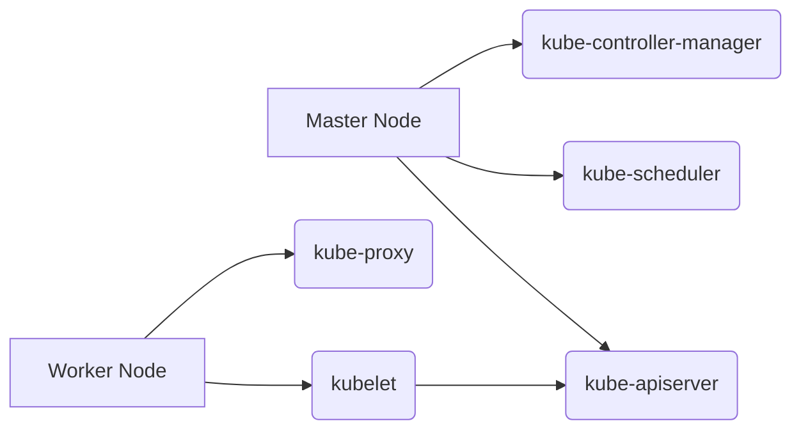
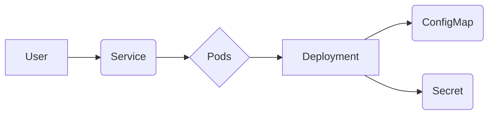

# <span style="color:#e67e22;">What we will learn in this post?</span>
<ul style='list-style-type: none; padding-left: 0;'>
<li><span style='color: #2980b9; font-size: 20px; font-weight: bold;'>👉</span> <span style='color: #2ecc71; font-size: 18px; font-weight: bold;'>Introduction to Kubernetes (K8s)</span></li>
<li><span style='color: #2980b9; font-size: 20px; font-weight: bold;'>👉</span> <span style='color: #2ecc71; font-size: 18px; font-weight: bold;'>Core Concepts: Pods, Deployments, Services, ConfigMaps, Secrets</span></li>
<li><span style='color: #2980b9; font-size: 20px; font-weight: bold;'>👉</span> <span style='color: #2ecc71; font-size: 18px; font-weight: bold;'>Writing YAML Files for Kubernetes</span></li>
<li><span style='color: #2980b9; font-size: 20px; font-weight: bold;'>👉</span> <span style='color: #2ecc71; font-size: 18px; font-weight: bold;'>Setting Up a Local Kubernetes Cluster (e.g., Minikube, KIND)</span></li>
<li><span style='color: #2980b9; font-size: 20px; font-weight: bold;'>👉</span> <span style='color: #2ecc71; font-size: 18px; font-weight: bold;'>Introduction to Helm for Package Management</span></li>
<li><span style='color: #2980b9; font-size: 20px; font-weight: bold;'>👉</span> <span style='color: #2ecc71; font-size: 18px; font-weight: bold;'>Conclusion!</span></li>
</ul>

# <span style="color:#e67e22">Kubernetes (K8s): Your Container Orchestrator 🚢</span>

Kubernetes, often shortened to K8s, is like a **super-powered manager** for your containerized applications.  Think of containers as individual shipping containers holding your apps – K8s is the port authority, efficiently handling everything from loading and unloading (deployment) to scaling up/down (resizing the port) and keeping everything running smoothly.  It's a crucial part of DevOps, streamlining the process of building, testing, and deploying software.

## <span style="color:#2980b9">How K8s Automates Everything ✨</span>

Kubernetes automates many complex tasks:

*   **Deployment:** Easily deploy your apps across multiple servers.
*   **Scaling:** Automatically increase or decrease the number of app instances based on demand.  Need more power? K8s adds more containers. Need less? K8s removes some, saving you money!
*   **Management:**  Handles resource allocation, health checks, and updates without manual intervention.


## <span style="color:#2980b9">Kubernetes Architecture ⚙️</span>

Kubernetes runs on a cluster of machines.  Let's break it down:

### <span style="color:#8e44ad">Master Node (The Brain 🧠)</span>
*   The control plane: manages the entire cluster.  Key components include the `kube-apiserver` (the central control point), the `kube-scheduler` (assigns tasks), and the `kube-controller-manager` (ensures desired states).

### <span style="color:#8e44ad">Worker Nodes (The Doers 💪)</span>
*   Where your containers actually run. Each node has a `kubelet` (agent communicating with the master) and a `kube-proxy` (handles network routing).



## <span style="color:#2980b9">Benefits of Kubernetes 🚀</span>

*   **High Availability:**  K8s automatically restarts failed containers and spreads apps across multiple nodes for resilience.
*   **Scalability:** Easily scale your applications up or down based on demand.
*   **Resource Management:** Optimizes resource utilization across the cluster.
*   **Cloud-Native:**  Works seamlessly with various cloud providers.


Kubernetes simplifies the complexities of managing containerized applications, making it a vital tool for modern DevOps practices. For more information, check out the official Kubernetes documentation: [https://kubernetes.io/](https://kubernetes.io/)


# <span style="color:#e67e22">Kubernetes Core Concepts Explained</span> 🐳

Kubernetes is like a super-powered orchestra conductor for your containerized applications. Let's explore its key players:

## <span style="color:#2980b9">Pods: The Tiny Workers 👷</span>

### <span style="color:#8e44ad">What they are:</span>
Pods are the smallest and simplest units you can deploy in Kubernetes. Think of them as individual containers or a group of closely related containers working together.  A single Pod might run a web server, while another might run a database.  They are ephemeral—meaning they can be created, destroyed, and recreated automatically by Kubernetes.

## <span style="color:#2980b9">Deployments: Managing Application States 📈</span>

### <span style="color:#8e44ad">What they do:</span>
Deployments are the way you manage your application's state.  They ensure your desired number of Pods is always running, handling updates and rollbacks gracefully.  If a Pod crashes, a Deployment automatically creates a replacement.

*   **Desired state:** You tell a Deployment how many Pods you want.
*   **Automatic scaling:** It keeps this number running, adding or removing Pods as needed.
*   **Rollouts & Rollbacks:** Deployments handle updating your application with minimal downtime.

## <span style="color:#2980b9">Services: Making Pods Accessible 🌐</span>

### <span style="color:#8e44ad">Connecting the dots:</span>
Services provide a stable IP address and DNS name for your Pods, even if the Pods themselves are constantly changing. This allows other services or your users to always reach your application.


## <span style="color:#2980b9">ConfigMaps & Secrets: Secure Configuration 🔒</span>

### <span style="color:#8e44ad">Keeping things organized:</span>
*   **ConfigMaps:** Store non-sensitive configuration data, like database connection URLs or API keys.  This keeps your application code separate from its settings.
*   **Secrets:** Store highly sensitive information, like passwords and encryption keys, securely. Kubernetes manages these securely within the cluster.


## <span style="color:#2980b9">Interaction Diagram</span>




**In essence:** Users interact with a Service, which directs traffic to a set of Pods managed by a Deployment.  ConfigMaps and Secrets provide the Pods with configuration and sensitive data.


For more information:

* [Kubernetes Documentation](https://kubernetes.io/docs/)


This simplified explanation helps visualize how these core Kubernetes components work together to efficiently manage containerized applications. Remember, this is just an introduction—Kubernetes is a powerful and complex system with many more features.


# <span style="color:#e67e22">YAML for Kubernetes: Defining Your Clusters</span> 🐳


Kubernetes uses YAML (YAML Ain't Markup Language) files to define the desired state of your cluster resources.  These files describe what you want Kubernetes to *do*, not *how* to do it. Think of them as blueprints for your applications.

## <span style="color:#2980b9">YAML Structure & Syntax</span> 📝


A basic Kubernetes YAML file follows a consistent structure:

* **`apiVersion`**:  Specifies the Kubernetes API version.  *(e.g., `v1`, `apps/v1`) It tells Kubernetes which version of the API to use to interpret your file.*
* **`kind`**:  The type of resource you're defining.  *(e.g., `Pod`, `Deployment`, `Service`)*  This tells Kubernetes what it is you are describing.
* **`metadata`**: Contains identifying information.  *`name` is crucial – it's how you refer to this resource.*  You can also add labels for organization.
* **`spec`**: Describes the *desired state* of the resource.  This section will vary greatly depending on the `kind` of resource.


## <span style="color:#2980b9">Examples: Pods, Deployments, and Services</span> 🚀


### <span style="color:#8e44ad">Simple Pod</span>

```yaml
apiVersion: v1
kind: Pod
metadata:
  name: my-pod
spec:
  containers:
  - name: my-container
    image: nginx:latest
```

This creates a single Pod running a Nginx container.


### <span style="color:#8e44ad">Deployment</span>

```yaml
apiVersion: apps/v1
kind: Deployment
metadata:
  name: my-deployment
spec:
  replicas: 3
  selector:
    matchLabels:
      app: my-app
  template:
    metadata:
      labels:
        app: my-app
    spec:
      containers:
      - name: my-container
        image: nginx:latest
```

This creates *three* replicas of the Nginx container, managed by a Deployment.  If one fails, Kubernetes automatically creates a replacement.


### <span style="color:#8e44ad">Service</span>

```yaml
apiVersion: v1
kind: Service
metadata:
  name: my-service
spec:
  selector:
    app: my-app
  type: LoadBalancer # or NodePort, ClusterIP
  ports:
  - port: 80
    targetPort: 80
```

This creates a Service that exposes the three Nginx containers from the `my-deployment` (above) externally.  `type: LoadBalancer` requests an external IP address from your cloud provider.


## <span style="color:#2980b9">Applying YAML files</span> kubectl


You apply these YAML files to your Kubernetes cluster using the `kubectl` command:

```bash
kubectl apply -f my-pod.yaml
```


Remember to replace `my-pod.yaml` with the actual filename.  You can find more detailed information and examples in the [official Kubernetes documentation](https://kubernetes.io/docs/concepts/overview/working-with-objects/kubernetes-objects/).


[Mermaid Diagram showing the relationship between Pod, Deployment, and Service](https://mermaid-js.github.io/mermaid-live-editor/)  *(Example diagram would be too complex for this response, but the link provides a tool to create one)*


# <span style="color:#e67e22">Setting up a Local Kubernetes Cluster 🚀</span>

Local Kubernetes clusters are fantastic for development and testing!  Let's explore Minikube and KIND, two popular choices.

## <span style="color:#2980b9">Minikube: The Easy Way 🏡</span>

Minikube is super simple to install and use. It runs a single-node Kubernetes cluster inside a virtual machine on your computer.

### <span style="color:#8e44ad">Installation and Setup</span>

*   **Download:** Grab the latest Minikube installer from [Minikube's official website](https://minikube.sigs.k8s.io/docs/start/).
*   **Install:** Follow the platform-specific instructions (e.g., `curl -LO https://storage.googleapis.com/minikube/releases/latest/minikube-linux-amd64 && chmod +x minikube-linux-amd64 && sudo mv minikube-linux-amd64 /usr/local/bin/minikube` for Linux).
*   **Start:**  Just run `minikube start`.  It'll download and configure everything for you!

### <span style="color:#8e44ad">Managing Your Cluster</span>

*   `minikube status`: Check the cluster's status.
*   `minikube stop`: Stop the cluster.
*   `minikube delete`:  Completely remove the cluster.

## <span style="color:#2980b9">KIND: Kubernetes IN Docker 🐳</span>

KIND runs a Kubernetes cluster *inside* Docker containers. This is great for precise control and testing different Kubernetes versions.

### <span style="color:#8e44ad">Installation and Setup</span>

*   **Prerequisites:** Ensure Docker is installed and running.
*   **Install KIND:**  Follow the instructions on the [KIND GitHub repository](https://github.com/kubernetes-sigs/kind). It usually involves a simple `curl` command to download and install the binary.
*   **Create a cluster:** `kind create cluster` creates your cluster.  You can customize it with additional options.

### <span style="color:#8e44ad">Managing Your Cluster</span>

*   `kind get clusters`: List your KIND clusters.
*   `kind delete cluster`: Delete a cluster.

## <span style="color:#2980b9">Choosing Between Minikube and KIND 🤔</span>


| Feature        | Minikube                               | KIND                                     |
|----------------|-------------------------------------------|------------------------------------------|
| Ease of use    | Easier, beginner-friendly                 | Requires Docker, slightly steeper learning curve |
| Resource usage | More resource intensive (virtual machine) | Less resource intensive (containers)      |
| Isolation      | Good isolation from host                  | Excellent isolation from host             |
| Customization  | Limited                                   | More customizable                        |


Both are excellent for local development.  *Minikube* is perfect for quick starts, while *KIND* provides more control and mirrors a production environment more closely.  Use the tool that best suits your needs and experience level.


---

**[Note:]** Remember to consult the official documentation for the most up-to-date instructions and options.


# <span style="color:#e67e22">Helm: Your Kubernetes App Manager 🚢</span>

Kubernetes is powerful, but deploying apps can be complex.  That's where Helm comes in!  Helm is like *the app store for Kubernetes*. It simplifies deploying and managing applications on your Kubernetes cluster.  Think of it as a package manager, making your life much easier.

## <span style="color:#2980b9">Helm Charts: Packaging Your Apps 📦</span>

Helm uses *charts* to package applications. A chart is a collection of files that describe your application's resources (deployments, services, etc.).  It's like a blueprint or recipe for your Kubernetes app.  This makes it easy to share and distribute applications.

### <span style="color:#8e44ad">Chart Structure: The Key Ingredients</span>

A Helm chart typically has these parts:

* **`templates/`**:  Contains YAML files that define Kubernetes resources. These are *templates*, meaning they're filled with values during installation.
* **`values.yaml`**:  This file holds *configuration values* that customize your app.  You can change things like the number of replicas or database connection details without modifying the templates directly.
* **`Chart.yaml`**:  This file describes your chart (name, version, description, etc.).
* **`requirements.yaml`**: (Optional) Lists any *dependencies* your chart needs (other charts it relies on).


## <span style="color:#2980b9">Installing a Helm Chart: A Quick Example ✨</span>

Let's say you want to install a simple Nginx web server using Helm:

1. **Add the Helm repo:** `helm repo add stable https://charts.helm.sh/stable`
2. **Update the repo:** `helm repo update`
3. **Install the chart:** `helm install my-nginx stable/nginx`

This will deploy an Nginx deployment and service to your cluster.  You can customize it by passing values, for example:  `helm install my-nginx stable/nginx --set replicaCount=2` will deploy two Nginx replicas.


## <span style="color:#2980b9">Visual Representation of Helm Chart Structure</span>

```mermaid
graph LR
    A[Chart.yaml] --> B(templates);
    A --> C(values.yaml);
    A --> D{requirements.yaml(Optional)};
    B --> E[Deployment.yaml];
    B --> F[Service.yaml];
    B --> G[Other YAML Files];
```


Want to learn more? Check out these helpful resources:

* [Helm Documentation](https://helm.sh/docs/)
* [Kubernetes Documentation](https://kubernetes.io/docs/)


By using Helm, you can efficiently manage even the most complex Kubernetes deployments, making it a valuable tool for any Kubernetes user. 🎉


<h1><span style='color:#e67e22'>Conclusion</span></h1>

So there you have it!  We've covered a lot of ground today, and hopefully, you found it helpful and insightful. 😊  We're always striving to improve, and your thoughts are incredibly valuable to us.  What did you think?  Did we miss anything?  Let us know in the comments below! 👇 We'd love to hear your feedback, suggestions, or even just a quick hello! 👋  Let's keep the conversation going! 🎉


