# <span style="color:#e67e22;">What we will learn in this post?</span>

<ul style='list-style-type: none; padding-left: 0;'>
<li><span style='color: #2980b9; font-size: 20px; font-weight: bold;'>👉</span> <span style='color: #2ecc71; font-size: 18px; font-weight: bold;'>Date Class in Java</span></li>
<li><span style='color: #2980b9; font-size: 20px; font-weight: bold;'>👉</span> <span style='color: #2ecc71; font-size: 18px; font-weight: bold;'>Methods of the Date Class</span></li>
<li><span style='color: #2980b9; font-size: 20px; font-weight: bold;'>👉</span> <span style='color: #2ecc71; font-size: 18px; font-weight: bold;'>Java Current Date and Time</span></li>
<li><span style='color: #2980b9; font-size: 20px; font-weight: bold;'>👉</span> <span style='color: #2ecc71; font-size: 18px; font-weight: bold;'>Compare Dates in Java</span></li>
<li><span style='color: #2980b9; font-size: 20px; font-weight: bold;'>👉</span> <span style='color: #2ecc71; font-size: 18px; font-weight: bold;'>Conclusion</span></li>
</ul>

# <span style="color:#e67e22">Java's `Date` Class: Handling Dates and Times 📅</span>

The `java.util.Date` class is used to represent a specific point in time. While functional, it's now largely superseded by the more robust `java.time` package (introduced in Java 8). However, understanding `Date` is still helpful for legacy code.

## <span style="color:#2980b9">Constructors and Initialization 👶</span>

The `Date` class has several constructors:

- A no-argument constructor: `Date()`, creating a `Date` object representing the current time.
- A constructor taking milliseconds since the epoch (January 1, 1970, 00:00:00 GMT): `Date(long milliseconds)`.

### <span style="color:#8e44ad">Example</span>

```java
Date currentDate = new Date(); //Current date and time
Date specificDate = new Date(1678886400000L); //Example date in milliseconds
```

## <span style="color:#2980b9">Key Methods 🛠️</span>

`Date` offers methods to get different aspects of the date and time:

- `getTime()`: Returns milliseconds since the epoch (a _long_).
- `getYear()`, `getMonth()`, `getDate()`, `getHours()`, etc.: Return individual date and time components. _Note_: These methods are deprecated in favor of the `Calendar` class and the `java.time` package.

## <span style="color:#2980b9">Why `java.time` is Preferred ✨</span>

The `java.time` package provides classes like `LocalDate`, `LocalTime`, and `LocalDateTime`, offering better clarity, thread safety, and immutability compared to the older `Date` class. It's highly recommended for new projects.

## <span style="color:#2980b9">Further Reading 📚</span>

- [Oracle's Java Documentation on `java.util.Date`](https://docs.oracle.com/javase/7/docs/api/java/util/Date.html) _(Note: this documents the deprecated class, but provides historical context)_
- [Oracle's Java Documentation on `java.time`](https://docs.oracle.com/javase/8/docs/api/java/time/package-summary.html) _(Recommended for modern date/time handling)_

Remember to always favor the `java.time` package for new Java projects. The `Date` class is primarily relevant for understanding older codebases.

# <span style="color:#e67e22">Exploring the Date Class: Your Guide to Time Manipulation 🕰️</span>

The `Date` class (the exact implementation varies depending on the programming language, e.g., Java's `java.util.Date`, Python's `datetime.date`) provides various methods to work with dates. Let's explore some common ones:

## <span style="color:#2980b9">Key Methods and Functionality ✨</span>

- **`getYear()`/`getFullYear()`:** Returns the year. `getYear()` might return a value relative to 1900 (check your language's documentation!), while `getFullYear()` gives the full year (e.g., 2024).

- **`getMonth()`:** Returns the month (usually 0-indexed, meaning January is 0, February is 1, etc.).

- **`getDate()`:** Returns the day of the month (1-31).

- **`getDay()`:** Returns the day of the week (0 for Sunday, 1 for Monday, etc.).

- **`setDate(day)`:** Sets the day of the month.

- **`setMonth(month)`:** Sets the month (remember 0-indexing!).

- **`setFullYear(year)`:** Sets the year.

### <span style="color:#8e44ad">Example (Conceptual):</span>

Let's say you have a `Date` object representing October 26th, 2024.

```python
#Illustrative Example (Python)
from datetime import date
my_date = date(2024, 10, 26)
print(my_date.year) # Output: 2024
print(my_date.month) # Output: 10 (October)
print(my_date.day)  # Output: 26

new_date = my_date.replace(day=27) #Changing the day
print(new_date) #Output: 2024-10-27
```

These methods allow for easy date manipulation—calculating differences, formatting for display, and more. Remember to consult your programming language's documentation for specifics.

[More information on date/time handling in Python](https://docs.python.org/3/library/datetime.html)

**Note:** The exact methods and their behavior might differ slightly depending on the specific `Date` class implementation used in your programming language. Always refer to the official documentation for accurate information.

# <span style="color:#e67e22">Getting the Current Date and Time in Java 📅⏰</span>

Java provides robust tools for handling dates and times. Let's explore how to get and format the current date and time.

## <span style="color:#2980b9">Key Classes and Methods</span>

The primary classes are `java.time.LocalDateTime` and `java.time.format.DateTimeFormatter`.

### <span style="color:#8e44ad">Getting the Current Date and Time</span>

To get the current date and time, use:

```java
LocalDateTime now = LocalDateTime.now();
System.out.println(now); //Outputs the current date and time
```

This gives you a `LocalDateTime` object representing the current moment.

### <span style="color:#8e44ad">Formatting the Date and Time</span>

`DateTimeFormatter` allows customizing output. For example:

```java
DateTimeFormatter formatter = DateTimeFormatter.ofPattern("yyyy-MM-dd HH:mm:ss");
String formattedDateTime = now.format(formatter);
System.out.println(formattedDateTime); //Outputs formatted date and time
```

This code snippet uses the pattern "yyyy-MM-dd HH:mm:ss" to format the date and time. You can create many different formats using this pattern. For more details on available patterns, refer to [Oracle's documentation](https://docs.oracle.com/javase/8/docs/api/java/time/format/DateTimeFormatter.html).

```mermaid
graph TD
    A["⏰ Get Current Time using LocalDateTime.now()"] --> B{"🛠️ Format using DateTimeFormatter"};
    B -- "📅 yyyy-MM-dd HH:mm:ss" --> C["📝 Formatted DateTime String"];
    B -- "🎨 Other Patterns" --> D["📝 Different Formatted DateTime String"];
    C --> E["📤 Output"];
    D --> E;

    class A timeStyle;
    class B formatStyle;
    class C formattedStyle;
    class D differentFormattedStyle;
    class E outputStyle;

    classDef timeStyle fill:#ff6f61,stroke:#c43e3e,color:#ffffff,font-size:14px,stroke-width:2px,rx:10,shadow:4px;
    classDef formatStyle fill:#6b5b95,stroke:#4a3f6b,color:#ffffff,font-size:14px,stroke-width:2px,rx:10,shadow:4px;
    classDef formattedStyle fill:#feb236,stroke:#d99120,color:#ffffff,font-size:14px,stroke-width:2px,rx:10,shadow:4px;
    classDef differentFormattedStyle fill:#007acc,stroke:#005f99,color:#ffffff,font-size:14px,stroke-width:2px,rx:10,shadow:4px;
    classDef outputStyle fill:#44bfc8,stroke:#2d8f99,color:#ffffff,font-size:14px,stroke-width:2px,rx:10,shadow:4px;

```

## <span style="color:#2980b9">Example Flowchart</span>



- **_Note:_** The `java.util.Date` class is _deprecated_. Use the `java.time` package for better functionality and clarity.

Remember to include the necessary imports at the beginning of your Java file: `import java.time.*;` and `import java.time.format.*;`

This approach offers a clean and efficient way to handle date and time in your Java applications. Remember to explore the documentation for more advanced formatting options and features!

# <span style="color:#e67e22">Comparing Dates in Java 📅</span>

Java offers several ways to compare dates. Let's explore the most common and effective approaches.

## <span style="color:#2980b9">Using `compareTo()` 🤝</span>

The `compareTo()` method, available for `java.util.Date` and `java.time.LocalDate` (preferred for modern Java), directly compares dates. It returns:

- `0`: If dates are equal.
- `> 0`: If the first date is _after_ the second.
- `< 0`: If the first date is _before_ the second.

```java
LocalDate date1 = LocalDate.of(2024, 3, 15);
LocalDate date2 = LocalDate.of(2023, 12, 25);

int comparisonResult = date1.compareTo(date2); // comparisonResult will be > 0
```

### <span style="color:#8e44ad">Example using `java.time` (Recommended)</span>

This approach leverages the newer `java.time` API, which offers better readability and functionality. Avoid using the outdated `java.util.Date` unless you're working with legacy code.

## <span style="color:#2980b9">Using `isAfter()` and `isBefore()` 🤔</span>

The `java.time` API provides these intuitive methods for simpler comparisons. They return `true` or `false` based on the comparison.

```java
boolean isLater = date1.isAfter(date2); // true if date1 is after date2
boolean isEarlier = date1.isBefore(date2); // true if date1 is before date2
```

### <span style="color:#8e44ad">Boolean Clarity ✨</span>

These methods offer a more readable and less error-prone way to check date order.

## <span style="color:#2980b9">Handling Time Zones 🌎</span>

For comparisons involving different time zones, ensure you're working with dates in a consistent time zone. The `java.time` API's `ZonedDateTime` class handles this effectively.

Remember to always handle potential `NullPointerExceptions` if your dates might be null. Consider adding null checks before comparisons.

**For further reading:**

- [Java `java.time` API documentation](https://docs.oracle.com/javase/8/docs/api/java/time/package-summary.html)

**Note:** This explanation focuses on simple date comparisons. More complex scenarios might require additional formatting or manipulation of date/time components.

<h1><span style='color:#e67e22'>Conclusion 🎉</span></h1>

We're always looking to improve, and your feedback is incredibly valuable! So, please don't hesitate to share your thoughts, comments, suggestions, or even just a quick hello 👋 in the comments section below. We'd love to hear from you! 👇
