# <span style="color:#e67e22;">What we will learn in this post?</span>

<ul style='list-style-type: none; padding-left: 0;'>
<li><span style='color: #2980b9; font-size: 20px; font-weight: bold;'>👉</span> <span style='color: #2ecc71; font-size: 18px; font-weight: bold;'>Custom Directives</span></li>
<li><span style='color: #2980b9; font-size: 20px; font-weight: bold;'>👉</span> <span style='color: #2ecc71; font-size: 18px; font-weight: bold;'>Dynamic Component Loading</span></li>
<li><span style='color: #2980b9; font-size: 20px; font-weight: bold;'>👉</span> <span style='color: #2ecc71; font-size: 18px; font-weight: bold;'>Angular Elements</span></li>
<li><span style='color: #2980b9; font-size: 20px; font-weight: bold;'>👉</span> <span style='color: #2ecc71; font-size: 18px; font-weight: bold;'>Internationalization (i18n)</span></li>
<li><span style='color: #2980b9; font-size: 20px; font-weight: bold;'>👉</span> <span style='color: #2ecc71; font-size: 18px; font-weight: bold;'>Conclusion!</span></li>
</ul>

# <span style="color:#e67e22">Creating Custom Directives in Angular ✨</span>

Angular directives let you extend HTML with custom behavior. They're like mini-programs that add extra functionality to your elements. There are two main types:

## <span style="color:#2980b9">Structural Directives 🏗️</span>

These directives change the DOM structure. Think of `*ngIf`—it adds or removes elements based on a condition. Let's build a custom one:

### <span style="color:#8e44ad">Example: `appUnless` Directive</span>

This directive will work opposite to `*ngIf`. If the condition is true, the element is hidden; otherwise, it's shown.

```typescript
import { Directive, Input, TemplateRef, ViewContainerRef } from "@angular/core"

@Directive({
  selector: "[appUnless]",
})
export class UnlessDirective {
  constructor(
    private templateRef: TemplateRef<any>,
    private viewContainer: ViewContainerRef,
  ) {}

  @Input() set appUnless(condition: boolean) {
    if (!condition) {
      this.viewContainer.createEmbeddedView(this.templateRef)
    } else {
      this.viewContainer.clear()
    }
  }
}
```

You'd use it like this in your template: `<p *appUnless="condition">This shows if condition is false</p>`

## <span style="color:#2980b9">Attribute Directives 🎨</span>

These directives change the appearance or behavior of an element without altering the DOM structure. `ngClass` is an example. Let's make a custom tooltip:

### <span style="color:#8e44ad">Example: `appTooltip` Directive</span>

This adds a tooltip to an element when you hover over it.

```typescript
import { Directive, ElementRef, HostListener, Input } from "@angular/core"

@Directive({
  selector: "[appTooltip]",
})
export class TooltipDirective {
  @Input() appTooltip: string

  constructor(private el: ElementRef) {}

  @HostListener("mouseenter") onMouseEnter() {
    // Add tooltip logic here (e.g., create a new element)
    // ...
  }

  @HostListener("mouseleave") onMouseLeave() {
    // Remove tooltip logic here
    // ...
  }
}
```

You'd use it like: `<button appTooltip="Click me!">Click</button>`

**Key Differences Summarized:**

| Feature | Structural Directive   | Attribute Directive                  |
| ------- | ---------------------- | ------------------------------------ |
| Purpose | Modifies DOM structure | Modifies element appearance/behavior |
| Syntax  | `*directiveName`       | `[directiveName]="value"`            |
| Example | `*ngIf`, `*ngFor`      | `ngClass`, `ngStyle`                 |

For more detailed information and advanced techniques, explore the official Angular documentation: [https://angular.io/guide/directives](https://angular.io/guide/directives)

Remember to import your custom directives into your component's module! Happy coding! 😊

# <span style="color:#e67e22">Dynamic Component Loading in Angular ✨</span>

Angular offers powerful ways to load components on the fly, enhancing user experience and application flexibility. We'll explore using `ComponentFactoryResolver` and `ViewContainerRef`.

## <span style="color:#2980b9">Why Dynamic Loading? 🤔</span>

Imagine a user interface where you need to add new sections based on user interaction, like adding new form fields or widgets. Instead of pre-rendering everything, dynamic loading keeps the initial load time fast and only renders what's needed. This is particularly useful for:

- **User-driven customizations:** Adding or removing widgets based on user selections.
- **Conditional rendering:** Displaying different components based on user roles or data.
- **Plugin architecture:** Loading external components at runtime.

## <span style="color:#2980b9">The Process: `ComponentFactoryResolver` & `ViewContainerRef` ⚙️</span>

### <span style="color:#8e44ad">Step 1: Injecting the Necessities</span>

First, we inject `ComponentFactoryResolver` and `ViewContainerRef` into our component. `ViewContainerRef` gives us a place to insert the component, and `ComponentFactoryResolver` creates the component instance.

```typescript
import {
  Component,
  ViewContainerRef,
  ComponentFactoryResolver,
} from "@angular/core"

@Component({
  selector: "app-dynamic-host",
  template: `<div #container></div>`, //container for dynamic component
})
export class DynamicHostComponent {
  constructor(
    private resolver: ComponentFactoryResolver,
    private container: ViewContainerRef,
  ) {}

  //method to add a component to the container
}
```

### <span style="color:#8e44ad">Step 2: Loading the Component</span>

We use `resolveComponentFactory` to get the factory for our dynamic component, then `createComponent` to create and insert the component into the `ViewContainerRef`.

```typescript
loadComponent(component: any) {
  const factory = this.resolver.resolveComponentFactory(component);
  const ref = this.container.createComponent(factory);
}

```

### <span style="color:#8e44ad">Example Use Case: Adding Form Fields</span>

Let's say a user clicks a button to add a new text field. Our component would call `loadComponent` with the text field component, dynamically adding it to the UI.

```mermaid
graph TD
    A["🖱️ User Clicks Button"] --> B{"⚙️ loadComponent() called"};
    B --> C["🏭 ComponentFactoryResolver gets factory"];
    C --> D["📌 ViewContainerRef creates component"];
    D --> E["🆕 New Text Field Added to UI"];

    class A clickStyle;
    class B methodCallStyle;
    class C factoryStyle;
    class D creationStyle;
    class E uiUpdateStyle;

    classDef clickStyle fill:#ff6f61,stroke:#c43e3e,color:#ffffff,font-size:14px,stroke-width:2px,rx:10,shadow:4px;
    classDef methodCallStyle fill:#6b5b95,stroke:#4a3f6b,color:#ffffff,font-size:14px,stroke-width:2px,rx:10,shadow:4px;
    classDef factoryStyle fill:#feb236,stroke:#d99120,color:#ffffff,font-size:14px,stroke-width:2px,rx:10,shadow:4px;
    classDef creationStyle fill:#007acc,stroke:#005f99,color:#ffffff,font-size:14px,stroke-width:2px,rx:10,shadow:4px;
    classDef uiUpdateStyle fill:#44bfc8,stroke:#2d8f99,color:#ffffff,font-size:14px,stroke-width:2px,rx:10,shadow:4px;

```



## <span style="color:#2980b9">Further Exploration 🚀</span>

For more detailed information and advanced techniques, check out the official Angular documentation: [Angular ComponentFactoryResolver](https://angular.io/api/core/ComponentFactoryResolver) and [Angular ViewContainerRef](https://angular.io/api/core/ViewContainerRef). Remember to handle component destruction properly using `destroy()` to avoid memory leaks!

This approach provides a flexible and efficient way to manage dynamic content in your Angular applications, enhancing user experience and application scalability. Remember to handle potential errors and edge cases in a production environment.

# <span style="color:#e67e22">Angular Elements: Sharing Angular Components with the World 🌎</span>

Angular Elements is a powerful feature that lets you package your Angular components as web components. This means you can use those components in _any_ web project—even ones not built with Angular! This boosts reusability and reduces code duplication. 🎉

## <span style="color:#2980b9">Creating Angular Elements</span>

To create an Angular Element, you essentially "wrap" your Angular component. This involves using the `createCustomElement` function from `@angular/elements`.

### <span style="color:#8e44ad">Step-by-Step Guide</span>

1. **Import necessary modules:** Import `createCustomElement` from `@angular/elements`.
2. **Create the element:** Use `createCustomElement` with your component as input.
3. **Register the custom element:** Use `customElements.define` to register your element with a name.

```javascript
import { createCustomElement } from "@angular/elements"
import { MyComponent } from "./my.component"

const element = createCustomElement(MyComponent, { injector: this.injector })
customElements.define("my-element", element)
```

## <span style="color:#2980b9">Example: A Reusable Button</span>

Let's say we have a simple Angular button component:

```typescript
// my.component.ts
@Component({
  selector: "app-my-button",
  template: `<button>Click Me!</button>`,
})
export class MyComponent {}
```

After following the steps above, we can use `<my-element>` in any HTML file, even outside an Angular project!

```html
<!DOCTYPE html>
<html>
  <head>
    <title>My Non-Angular Project</title>
    <script src="my-element.js"></script>
  </head>
  <body>
    <my-element></my-element>
  </body>
</html>
```

`my-element.js` would contain the bundled Angular Element.

## <span style="color:#2980b9">Benefits of Using Angular Elements</span>

- **Reusability:** Share components across projects.
- **Improved efficiency:** Avoid rewriting code.
- **Modern web standards:** Leverage web components.

## <span style="color:#2980b9">Further Resources</span>

- [Official Angular documentation on Angular Elements](https://angular.io/guide/elements)

Remember to adjust the paths and build process according to your project setup. Using Angular Elements can significantly improve your development workflow by promoting code reuse and improving overall maintainability! Enjoy the power of reusable components! 🚀

# <span style="color:#e67e22">🌍 Internationalizing Your Angular E-commerce Site</span>

Making your Angular app speak different languages is easier than you think! Angular's built-in i18n (internationalization) tools make it a breeze. Let's see how to translate your e-commerce site.

## <span style="color:#2980b9">Setting up i18n</span>

First, you need to extract translatable text from your templates. Angular's CLI helps with this:

```bash
ng xi18n --output-path locale/messages.xlf
```

This command creates an XLIFF (XML Localization Interchange File Format) file (`messages.xlf`) containing your app's text.

### <span style="color:#8e44ad">Creating Translation Files</span>

Next, you'll create separate translation files for each language (e.g., `messages.fr.xlf` for French, `messages.es.xlf` for Spanish). You can use tools like XLIFF editors or online services to translate your text in these files.

## <span style="color:#2980b9">Using Translations in Your App</span>

You'll need to load the appropriate translation file based on the user's locale. This is typically done using Angular's `LOCALE_ID` token.

```typescript
import { LOCALE_ID, NgModule } from "@angular/core"
import { registerLocaleData } from "@angular/common"
import localeFr from "@angular/common/locales/fr" //Example for French
//...other imports

registerLocaleData(localeFr, "fr")

@NgModule({
  providers: [{ provide: LOCALE_ID, useValue: "fr" }], //Change 'fr' to your desired locale
  //...
})
export class AppModule {}
```

You then use the `i18n` attribute in your templates to mark text for translation:

```html
<h1><span i18n="@@greeting">Hello!</span></h1>
<!-- Marks "Hello!" for translation -->
<p i18n="@@addToCart">Add to Cart</p>
```

The `@@` indicates a placeholder. Your translation files will then replace these placeholders with the correct translations.

## <span style="color:#2980b9">Handling Different Locales</span>

Angular's `LOCALE_ID` provides the necessary information for date/number formatting and other locale-specific settings. For example:

```typescript
{{ myDate | date:'longDate' }}  <!-- Uses locale-specific date format -->
{{ myPrice | currency:'EUR':'symbol':'1.2-2' }}  <!-- Locale-specific currency formatting -->
```

Remember to include the necessary locale data files (e.g., `localeFr` for French) from `@angular/common/locales`.

**Example E-commerce Translation:**

- **English:** "Add to Cart" becomes `<p i18n="@@addToCart">Add to Cart</p>`
- **Spanish:** "Añadir al Carrito" (in `messages.es.xlf`, `@@addToCart` translates to "Añadir al Carrito")

**For more info:** [Angular i18n documentation](https://angular.io/guide/i18n)

This workflow ensures your e-commerce app is ready for a global audience! 🎉

<h1><span style='color:#e67e22'>Conclusion</span></h1>

So there you have it! We've covered a lot of ground today, and hopefully, you found it helpful and insightful. 😊 We're always striving to improve, and your thoughts are incredibly valuable to us. So, what did you think? What could we have done better? What other topics would you like to see us cover? Let us know in the comments below! 👇 We'd love to hear from you! Let's keep the conversation going! 🎉
