# <span style="color:#e67e22;">What we will learn in this post?</span>

<ul style='list-style-type: none; padding-left: 0;'>
<li><span style='color: #2980b9; font-size: 20px; font-weight: bold;'>👉</span> <span style='color: #2ecc71; font-size: 18px; font-weight: bold;'>Introduction to Java JDBC</span></li>
<li><span style='color: #2980b9; font-size: 20px; font-weight: bold;'>👉</span> <span style='color: #2ecc71; font-size: 18px; font-weight: bold;'>JDBC Driver</span></li>
<li><span style='color: #2980b9; font-size: 20px; font-weight: bold;'>👉</span> <span style='color: #2ecc71; font-size: 18px; font-weight: bold;'>JDBC Connection</span></li>
<li><span style='color: #2980b9; font-size: 20px; font-weight: bold;'>👉</span> <span style='color: #2ecc71; font-size: 18px; font-weight: bold;'>Types of Statements in JDBC</span></li>
<li><span style='color: #2980b9; font-size: 20px; font-weight: bold;'>👉</span> <span style='color: #2ecc71; font-size: 18px; font-weight: bold;'>JDBC Tutorial</span></li>
<li><span style='color: #2980b9; font-size: 20px; font-weight: bold;'>👉</span> <span style='color: #2ecc71; font-size: 18px; font-weight: bold;'>Conclusion!</span></li>
</ul>

# <span style="color:#e67e22">Java Database Connectivity (JDBC) 🤝</span>

JDBC is like a bridge connecting your Java programs to databases like MySQL, PostgreSQL, or Oracle. It lets your Java code talk to these databases, so you can store, retrieve, and update information easily. Think of it as a universal translator!

## <span style="color:#2980b9">How JDBC Works ✨</span>

JDBC provides a set of _interfaces_ and _classes_ that define how Java interacts with databases. It doesn't directly interact with specific databases; instead, it uses _database drivers_. These drivers act as the translators, converting Java requests into a language the specific database understands.

### <span style="color:#8e44ad">Key Steps Involved</span>

- **Loading the Driver:** `Class.forName("com.mysql.cj.jdbc.Driver");` (Example for MySQL)
- **Establishing Connection:** Creating a connection object using a connection URL, username, and password.
- **Creating Statement:** Preparing SQL queries.
- **Executing Query:** Sending the query to the database.
- **Processing Results:** Handling the data returned from the database.
- **Closing Connection:** Releasing resources.

```mermaid
graph LR
    A["☕ Java Application"] --> B["🔗 JDBC API"];
    B --> C{"🛠️ Database Driver"};
    C --> D["🗄️ Database"];

    class A javaStyle;
    class B jdbcStyle;
    class C driverStyle;
    class D dbStyle;

    classDef javaStyle fill:#ff6f61,stroke:#c43e3e,color:#ffffff,font-size:14px,stroke-width:2px,rx:10,shadow:4px;
    classDef jdbcStyle fill:#6b5b95,stroke:#4a3f6b,color:#ffffff,font-size:14px,stroke-width:2px,rx:10,shadow:4px;
    classDef driverStyle fill:#feb236,stroke:#d99120,color:#ffffff,font-size:14px,stroke-width:2px,rx:10,shadow:4px;
    classDef dbStyle fill:#007acc,stroke:#005f99,color:#ffffff,font-size:14px,stroke-width:2px,rx:10,shadow:4px;

```



## <span style="color:#2980b9">Importance of JDBC 💪</span>

- **Data Persistence:** Stores data reliably for later retrieval.
- **Data Management:** Easily handles large amounts of structured data.
- **Platform Independence:** Write once, run anywhere – your code is database-agnostic (mostly!).

**In short:** JDBC is essential for building robust, data-driven Java applications. It simplifies database interactions, making your life easier!

For more information:

- [Oracle's JDBC Documentation](https://docs.oracle.com/javase/tutorial/jdbc/)

# <span style="color:#e67e22">JDBC Driver Types 🤝</span>

JDBC (Java Database Connectivity) drivers act as bridges between your Java application and a database. There are four main types:

## <span style="color:#2980b9">Type 1: JDBC-ODBC Bridge 🌉</span>

- This is the simplest type. It uses ODBC (Open Database Connectivity) as an intermediary.
- _Characteristics:_ Slow, platform-dependent (needs ODBC drivers installed), less secure.
- _Use Cases:_ Primarily for legacy systems or quick prototyping. Avoid for production.

## <span style="color:#2980b9">Type 2: Native-API (Partly Java) 💻</span>

- Uses a native library specific to the database.
- _Characteristics:_ Faster than Type 1, but still platform-dependent because of the native library.
- _Use Cases:_ Similar to Type 1, but offers improved performance where platform dependency is acceptable.

## <span style="color:#2980b9">Type 3: Net-Protocol (All Java) 🌐</span>

- Uses a middleware server for database interaction.
- _Characteristics:_ Platform-independent, good for client-server architectures.
- _Use Cases:_ Applications needing database access from various platforms, offering centralized database management.

## <span style="color:#2980b9">Type 4: Pure Java ☕</span>

- Directly communicates with the database using only Java code.
- _Characteristics:_ Fastest, most portable, generally preferred for most applications.
- _Use Cases:_ Modern applications requiring high performance and platform independence. This is the **recommended** type.

### <span style="color:#8e44ad">Summary Table</span>

| Type | Description              | Platform Dependency | Performance | Recommended? |
| ---- | ------------------------ | ------------------- | ----------- | ------------ |
| 1    | JDBC-ODBC Bridge         | High                | Low         | No           |
| 2    | Native-API (Partly Java) | Medium              | Medium      | No           |
| 3    | Net-Protocol (All Java)  | Low                 | Medium      | Sometimes    |
| 4    | Pure Java                | Low                 | High        | Yes          |

**For more info:** Check out the official [Oracle JDBC documentation](https://docs.oracle.com/javase/tutorial/jdbc/basics/index.html). Remember to choose the right driver based on your needs and context! 👍

# <span style="color:#e67e22">Connecting to Your Database with JDBC 🤝</span>

JDBC (Java Database Connectivity) lets your Java programs talk to databases. Here's how to set up that connection:

## <span style="color:#2980b9">Step-by-Step Guide 🚀</span>

### <span style="color:#8e44ad">1. Add the JDBC Driver 📦</span>

First, you need the correct JDBC driver for your database (MySQL, PostgreSQL, etc.). Download it and add the JAR file to your project's classpath. For example, in Maven, you'd add a dependency to your `pom.xml`.

### <span style="color:#8e44ad">2. Establish the Connection 🔗</span>

Use this code snippet (replace placeholders with your credentials):

```java
import java.sql.*;

public class DatabaseConnection {
    public static void main(String[] args) {
        try {
            //Load the driver dynamically
            Class.forName("com.mysql.cj.jdbc.Driver"); // Replace with your driver

            String url = "jdbc:mysql://localhost:3306/mydatabase"; // your DB URL
            String user = "your_username";
            String password = "your_password";

            Connection connection = DriverManager.getConnection(url, user, password);
            System.out.println("Connected!");
            connection.close();
        } catch (SQLException | ClassNotFoundException e) {
            e.printStackTrace();
        }
    }
}

```

_Remember to replace placeholders with your actual database details!_

### <span style="color:#8e44ad">3. Important Configurations ⚙️</span>

- **Database URL:** This specifies the database location (e.g., `jdbc:mysql://localhost:3306/mydatabase`).
- **Username & Password:** Your database login credentials.
- **JDBC Driver:** The correct driver JAR file for your database system. Finding the right one is key!

## <span style="color:#2980b9">Troubleshooting 🛠️</span>

- **ClassNotFoundException:** Means the driver isn't found in your classpath. Double-check the JAR file.
- **SQLException:** Could be due to incorrect credentials, wrong URL, or database issues.

This simple guide will help you connect to your database. For further information, refer to the [JDBC documentation](https://docs.oracle.com/javase/tutorial/jdbc/basics/index.html) and your database's specific JDBC driver documentation. Remember to handle exceptions properly in a real-world application!

# <span style="color:#e67e22">JDBC Statement Types Explained 📝</span>

JDBC offers three main statement types for interacting with databases:

## <span style="color:#2980b9">Statement 🗣️</span>

- A simple statement for executing static SQL queries. Use this when your SQL query doesn't change.
- **Example:** `Statement stmt = connection.createStatement();`
- _Less efficient for repeated queries with varying parameters._

## <span style="color:#2980b9">PreparedStatement ✍️</span>

- Pre-compiles SQL queries, improving performance, especially for repeated executions with different data. Uses placeholders (`?`) for parameters.
- **Example:** `PreparedStatement pstmt = connection.prepareStatement("SELECT * FROM users WHERE id = ?");`
- _Best for queries run multiple times with varying inputs._ Helps prevent SQL injection vulnerabilities.

## <span style="color:#2980b9">CallableStatement 📞</span>

- Used to execute stored procedures in the database. Allows interaction with database functions.
- **Example:** `CallableStatement cstmt = connection.prepareCall("{call getUserName(?)}");`
- _Ideal for complex database interactions utilizing stored procedures._

### <span style="color:#8e44ad">When to Use Which?</span>

- Use `Statement` for simple, one-time queries.
- Use `PreparedStatement` for parameterized queries executed repeatedly.
- Use `CallableStatement` for interacting with stored procedures.

```mermaid
graph TD
    A["🔍 Simple Query"] --> B["📜 Statement"];
    C["🎯 Parameterized Query"] --> D["📝 PreparedStatement"];
    E["⚙️ Stored Procedure"] --> F["📞 CallableStatement"];

    class A simpleQueryStyle;
    class B statementStyle;
    class C paramQueryStyle;
    class D preparedStmtStyle;
    class E storedProcStyle;
    class F callableStmtStyle;

    classDef simpleQueryStyle fill:#ff6f61,stroke:#c43e3e,color:#ffffff,font-size:14px,stroke-width:2px,rx:10,shadow:4px;
    classDef statementStyle fill:#6b5b95,stroke:#4a3f6b,color:#ffffff,font-size:14px,stroke-width:2px,rx:10,shadow:4px;
    classDef paramQueryStyle fill:#feb236,stroke:#d99120,color:#ffffff,font-size:14px,stroke-width:2px,rx:10,shadow:4px;
    classDef preparedStmtStyle fill:#007acc,stroke:#005f99,color:#ffffff,font-size:14px,stroke-width:2px,rx:10,shadow:4px;
    classDef storedProcStyle fill:#77dd77,stroke:#55aa55,color:#ffffff,font-size:14px,stroke-width:2px,rx:10,shadow:4px;
    classDef callableStmtStyle fill:#ffcc5c,stroke:#d9a33c,color:#ffffff,font-size:14px,stroke-width:2px,rx:10,shadow:4px;

```



For further reading and detailed examples, refer to the official [JDBC documentation](https://docs.oracle.com/javase/tutorial/jdbc/basics/index.html). Remember to handle exceptions appropriately in your code! 👍

# <span style="color:#e67e22">JDBC: A Quick Start Guide 🗄️</span>

JDBC (Java Database Connectivity) lets your Java programs talk to databases. Here's a simplified guide:

## <span style="color:#2980b9">Connecting to the Database 🔗</span>

First, you need a JDBC driver (like MySQL Connector/J). Add it to your project's classpath. Then, connect:

```java
Connection conn = DriverManager.getConnection("jdbc:mysql://localhost:3306/mydatabase", "user", "password");
```

Replace placeholders with your database details.

### <span style="color:#8e44ad">Error Handling</span> ⚠️

_Always_ wrap connection attempts in a `try-catch` block to handle potential exceptions like `SQLException`.

## <span style="color:#2980b9">Executing Queries 🔎</span>

Use `Statement` or `PreparedStatement` for queries:

```java
Statement stmt = conn.createStatement();
ResultSet rs = stmt.executeQuery("SELECT * FROM users");
```

`PreparedStatement` is better for preventing SQL injection vulnerabilities.

## <span style="color:#2980b9">Handling Results 📊</span>

Fetch data from the `ResultSet`:

```java
while (rs.next()) {
  String name = rs.getString("name");
  System.out.println("Name: " + name);
}
```

Remember to close your `ResultSet`, `Statement`, and `Connection` when finished to release resources.

## <span style="color:#2980b9">Closing Resources 🧹</span>

It is vital to close your resources in a `finally` block to prevent resource leaks:

```java
finally {
  if (rs != null) rs.close();
  if (stmt != null) stmt.close();
  if (conn != null) conn.close();
}
```

This ensures your application gracefully releases database connections.

**Resources:**

- [Oracle JDBC Documentation](https://docs.oracle.com/javase/tutorial/jdbc/)

**Note:** This is a simplified example. Error handling and more advanced features (transactions, etc.) are crucial in real-world applications. Remember to consult the documentation for your specific database driver.

<h1><span style='color:#e67e22'>Conclusion</span></h1>

So there you have it! We hope you enjoyed this post. 😊 We're always looking to improve, so we'd love to hear your thoughts! What did you think? Any questions or suggestions? 🤔 Let us know in the comments below – we can't wait to read them! 👇 Your feedback helps us create even better content. Thanks for reading! 🎉
