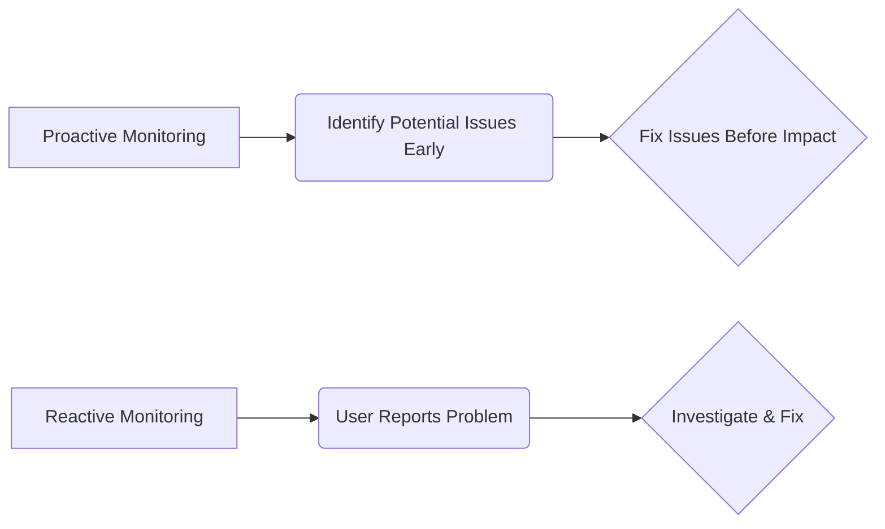
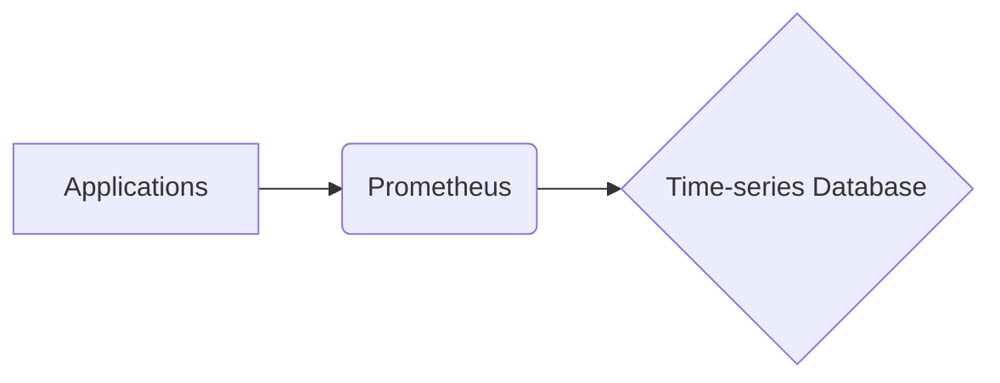
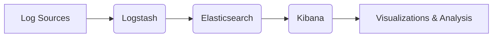
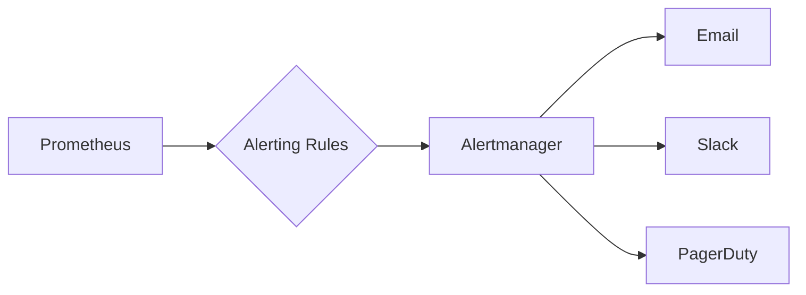

# <span style="color:#e67e22;">What we will learn in this post?</span>
<ul style='list-style-type: none; padding-left: 0;'>
<li><span style='color: #2980b9; font-size: 20px; font-weight: bold;'>👉</span> <span style='color: #2ecc71; font-size: 18px; font-weight: bold;'>Importance of Monitoring: Proactive vs Reactive</span></li>
<li><span style='color: #2980b9; font-size: 20px; font-weight: bold;'>👉</span> <span style='color: #2ecc71; font-size: 18px; font-weight: bold;'>Metrics, Logs, and Tracing Overview</span></li>
<li><span style='color: #2980b9; font-size: 20px; font-weight: bold;'>👉</span> <span style='color: #2ecc71; font-size: 18px; font-weight: bold;'>Prometheus and Grafana (Metrics and Dashboards)</span></li>
<li><span style='color: #2980b9; font-size: 20px; font-weight: bold;'>👉</span> <span style='color: #2ecc71; font-size: 18px; font-weight: bold;'>ELK Stack (Elasticsearch, Logstash, Kibana)</span></li>
<li><span style='color: #2980b9; font-size: 20px; font-weight: bold;'>👉</span> <span style='color: #2ecc71; font-size: 18px; font-weight: bold;'>Setting Up Alerts with Prometheus Alertmanager</span></li>
<li><span style='color: #2980b9; font-size: 20px; font-weight: bold;'>👉</span> <span style='color: #2ecc71; font-size: 18px; font-weight: bold;'>Conclusion!</span></li>
</ul>

# <span style="color:#e67e22">Monitoring in DevOps:  A Proactive Approach 📈</span>

Monitoring is super important in DevOps!  It's like having a health check for your application.  Knowing what's going on lets you keep everything running smoothly and happily.  But there are two main types: proactive and reactive.


## <span style="color:#2980b9">Proactive vs. Reactive Monitoring 🤔</span>

* **Proactive Monitoring:** This is like being a detective – you're *preventing* problems before they happen. You're constantly watching for signs of trouble, like slow response times or high CPU usage. This allows you to fix things *before* users even notice anything is wrong.  Think of it as a regular health checkup for your app!

* **Reactive Monitoring:** This is putting out fires. You only notice a problem when users start complaining or the app crashes. It's damage control.  While important, it's less ideal than proactive monitoring.


### <span style="color:#8e44ad">Examples of Proactive Monitoring Strategies</span>

* **Log Monitoring:** Regularly checking application logs for errors or warnings.  Think of these as clues that something might be going wrong.
* **Metrics Monitoring:** Tracking key performance indicators (KPIs) like CPU usage, memory consumption, and request latency.  This gives you a bird's-eye view of your app's health.
* **Synthetic Monitoring:**  Simulating user actions to test your application's responsiveness from different locations.  This helps you understand how *real users* experience your app.


## <span style="color:#2980b9">Visualizing the Process 📊</span>




### <span style="color:#8e44ad">Key Takeaways</span>

* **Proactive monitoring is key:** It saves you time, money, and keeps users happy!
* **Combine both strategies:** While proactive is best, reactive monitoring provides a safety net.
* **Tools are your friends:** Use monitoring tools like *Datadog*, *Prometheus*, or *Grafana* to help you stay on top of things.


**Learn more:**

* [Datadog](https://www.datadoghq.com/)
* [Prometheus](https://prometheus.io/)
* [Grafana](https://grafana.com/)


By focusing on proactive monitoring and using the right tools, your DevOps team can ensure your applications are always running smoothly and efficiently! ✨


# <span style="color:#e67e22">Understanding Metrics, Logs, and Tracing for Application Monitoring</span> 📈

Monitoring your applications is crucial for keeping them healthy and performing well.  Think of it like a doctor checking your health – you need different tools to get a complete picture.  Metrics, logs, and tracing are three essential tools.

## <span style="color:#2980b9">Metrics: The System's Vital Signs</span> 🌡️

Metrics are numerical measurements of your system's performance. They provide a snapshot of how things are doing *right now*.  Examples include:

*   CPU usage: `cpu_usage` = 75%
*   Memory usage: `memory_usage` = 2GB
*   Request latency: `latency` = 200ms

These numbers tell you if things are running smoothly or if there are bottlenecks.  You can set up *alerts* to notify you when important metrics go above or below certain thresholds.


## <span style="color:#2980b9">Logs: The Detailed Story</span> 📖

Logs record events that happen within your application.  They offer detailed insights into *what happened*.  Each log entry typically includes a timestamp, severity level (e.g., INFO, WARNING, ERROR), and a message describing the event.  For example:

*   `[INFO] 2023-10-27 10:00:00 User logged in successfully.`
*   `[ERROR] 2023-10-27 10:05:00 Database connection failed.`

Logs are essential for debugging – they help you understand why something went wrong.


## <span style="color:#2980b9">Tracing: Following the Request Journey</span> 🗺️

Tracing follows individual requests as they travel through your system. It shows you *how* a request is processed and how long each step takes. This is extremely helpful for complex, distributed systems.

### <span style="color:#8e44ad">Example Trace</span>

```mermaid
graph LR
    A[Client Request] --> B{API Gateway};
    B --> C[Service A];
    C --> D[Database];
    D --> C;
    C --> B;
    B --> E[Client Response];
    subgraph "Timings"
        B -. 50ms -. C;
        C -. 100ms -. D;
        D -. 50ms -. C;
        C -. 50ms -. B;
        B -. 50ms -. E;
    end
```

Tracing helps identify performance bottlenecks and pinpoint the source of slowdowns.


## <span style="color:#2980b9">Why They Matter</span> 🤔

*   **Debugging:** Logs pinpoint errors; tracing helps understand the *path* to the error.
*   **Optimization:** Metrics show performance bottlenecks; tracing helps locate their source.
*   **Health Monitoring:**  Metrics and logs provide a real-time health check.

Using metrics, logs, and tracing together provides a holistic view of your application's performance and health.  This combined approach helps you to proactively identify and resolve issues, resulting in more reliable and efficient systems.


[Learn more about monitoring](https://www.datadoghq.com/what-is-monitoring/)
[Learn more about logging](https://www.elastic.co/what-is/elk-stack)
[Learn more about tracing](https://www.jaegertracing.io/)


# <span style="color:#e67e22">Prometheus & Grafana: Your DevOps Monitoring Dream Team ✨</span>

DevOps relies heavily on monitoring application performance.  That's where Prometheus and Grafana come in – a powerful duo for collecting and visualizing your metrics!

## <span style="color:#2980b9">Prometheus: The Data Collector 🤖</span>

Prometheus is an open-source **monitoring system** that scrapes metrics from your applications. Think of it as a diligent data collector. It automatically discovers and pulls data at regular intervals. This data is stored as *time-series data*, meaning each data point is tagged with a timestamp.

### <span style="color:#8e44ad">How it Works</span>

Prometheus uses a *pull* model. It periodically contacts your applications (via HTTP) to fetch their metrics exposed using the `prometheus_client` library.  



*   **Easy setup:**  Prometheus is relatively easy to configure and get running.
*   **Flexible:**  Supports a wide variety of data sources.


## <span style="color:#2980b9">Grafana: The Visualization Wizard 📊</span>

Grafana is an open-source **visualization and analytics platform**. It takes the raw data from Prometheus and transforms it into beautiful, insightful dashboards. It lets you create custom charts, graphs, and tables – allowing you to easily monitor your application's health.


### <span style="color:#8e44ad">Dashboarding Delight</span>

Grafana connects to Prometheus to fetch the data and you can create dashboards showing:

*   CPU usage
*   Memory consumption
*   Request latency
*   Error rates


## <span style="color:#2980b9">Example: Monitoring a Simple App</span>

Let's say you have a simple web app. You can instrument it with Prometheus client libraries to expose metrics like request count and latency.  Grafana can then display these metrics in real-time on a dashboard.

### <span style="color:#8e44ad">Setting up Alerts 🚨</span>

Grafana allows you to set up alerts based on specific thresholds.  For example, if your request latency exceeds 500ms, Grafana can send you an email notification or trigger an alert in your communication platform.


**To get started:**

*   [Prometheus Documentation](https://prometheus.io/docs/introduction/overview/)
*   [Grafana Documentation](https://grafana.com/docs/)


This powerful combination of Prometheus and Grafana provides a robust and scalable solution for monitoring your applications.  Remember, early and proactive monitoring is key to keeping your DevOps environment running smoothly!


# <span style="color:#e67e22">ELK Stack: Your Log Management Superhero Team 🦸</span>


The ELK Stack (Elasticsearch, Logstash, Kibana) is your go-to solution for centralized log management and analysis. Think of it as a superhero team, each member with a unique superpower:


## <span style="color:#2980b9">Elasticsearch: The Data Storage Wizard 🧙‍♂️</span>

Elasticsearch is the powerful database at the heart of the ELK stack. It's like a super-organized library for your logs.  It indexes (organizes) your log data, making it incredibly fast to search and analyze.  It stores data in *JSON* format, making it flexible and easy to work with.


### <span style="color:#8e44ad">How it Works:</span>
*   Elasticsearch receives data from Logstash.
*   It breaks down the data into smaller, searchable pieces called *indexes*.
*   It efficiently stores and retrieves data using a technology called *inverted indexing*.

## <span style="color:#2980b9">Logstash: The Data Collector 🚛</span>

Logstash is the data collector – it gathers logs from various sources like servers, applications, and cloud services. Think of it as a tireless delivery driver bringing all the data to Elasticsearch.


### <span style="color:#8e44ad">Its Superpowers:</span>
*   Collects logs from diverse sources (e.g., syslog, web servers, databases).
*   Processes and transforms logs using *filters* (e.g., removing irrelevant information, enriching data).
*   Sends processed data to Elasticsearch.


## <span style="color:#2980b9">Kibana: The Visualization Guru 📊</span>

Kibana is the beautiful user interface (UI) that lets you explore and visualize your log data.  Think of it as a dashboard showing you what's happening in your system, giving you insightful visualizations.


### <span style="color:#8e44ad">Key Features:</span>
*   Interactive dashboards for monitoring system health.
*   Powerful search capabilities to pinpoint specific events.
*   Visualization tools (graphs, charts) to identify trends and patterns.


## <span style="color:#2980b9">A Simple ELK Setup ⚙️</span>

A basic setup involves installing Elasticsearch, Logstash, and Kibana (often using Docker for easy management).  Logstash configuration files define where to collect logs and how to process them. Kibana provides pre-built dashboards or allows you to create custom ones.





## <span style="color:#2980b9">DevOps and Troubleshooting ✨</span>

In DevOps, the ELK stack is crucial for centralized log management.  If a server crashes, you can quickly search logs in Kibana to identify the cause.  Real-time monitoring dashboards provide insights into system performance, enabling proactive troubleshooting and improved application stability.


**Resources:**

*   [Elasticsearch Official Website](https://www.elastic.co/elasticsearch)
*   [Logstash Official Website](https://www.elastic.co/logstash)
*   [Kibana Official Website](https://www.elastic.co/kibana)

By using the ELK stack, you can easily manage, analyze and visualize your logs, improving your operational efficiency and troubleshooting capabilities drastically.


# <span style="color:#e67e22">Setting up Prometheus Alerts with Alertmanager 🚨</span>

This guide shows you how to set up alerts for your Prometheus monitoring system using Alertmanager.  We'll cover configuring Prometheus to trigger alerts and using Alertmanager to send notifications.

## <span style="color:#2980b9">Creating Prometheus Alert Rules 📈</span>

Prometheus uses *alerting rules* defined in YAML files to trigger alerts based on metric thresholds.  Let's look at an example for high CPU usage:


```yaml
groups:
- name: cpu_high
  rules:
  - alert: HighCPU
    expr: node_cpu_seconds_total{mode="idle"} < 0.2
    for: 5m
    labels:
      severity: critical
    annotations:
      summary: "High CPU usage on {{ $labels.instance }}"
      description: "CPU usage on instance {{ $labels.instance }} is below 20% for the past 5 minutes. Check the system."
```

This rule triggers an alert (`HighCPU`) if the idle CPU time is less than 20% for 5 minutes.  The `annotations` provide context for the alert.


### <span style="color:#8e44ad">Key Concepts Explained</span>

* **`expr`**: The PromQL query defining the condition.
* **`for`**: The duration the condition must hold before triggering.
* **`labels`**:  Metadata added to the alert.
* **`annotations`**:  Descriptive text for notifications.


## <span style="color:#2980b9">Configuring Alertmanager Notifications 📢</span>

Alertmanager receives alerts from Prometheus and routes them to notification channels. You configure it via a YAML configuration file.  Here's how to set up email notifications:

```yaml
route:
  group_by: ['alertname']
  group_wait: 30s
  group_interval: 5m
  repeat_interval: 12h
  receivers: ['email']

receivers:
- name: 'email'
  email_configs:
  - to: 'your_email@example.com'
```

This configures Alertmanager to send emails for alerts.  Replace `'your_email@example.com'` with your email address. You can similarly configure Slack, PagerDuty, etc., by adding respective receiver configurations.  See [Alertmanager documentation](https://prometheus.io/docs/alertmanager/) for more details on receivers.

## <span style="color:#2980b9">Alerting Scenarios & Best Practices 👍</span>

* **High CPU Usage**:  (Example above) Monitor `node_cpu_seconds_total`.
* **Application Downtime**: Monitor HTTP request latency or success rate using a custom metric.
* **Disk Space Low**: Monitor disk usage.


**Diagram:**



Remember to tailor alert thresholds and notification settings to your specific needs and infrastructure.  For more advanced features, consult the official [Prometheus](https://prometheus.io/) and [Alertmanager](https://prometheus.io/docs/alertmanager/) documentation.


<h1><span style='color:#e67e22'>Conclusion</span></h1>

And there you have it!  We hope you found this informative and helpful 😊.  We're always looking to improve, so we'd love to hear your thoughts!  Did we miss anything?  Do you have any burning questions 🔥 or brilliant suggestions💡?  Let us know in the comments section below – we can't wait to hear from you! 👇


