# <span style="color:#e67e22;">What we will learn in this post?</span>
<ul style='list-style-type: none; padding-left: 0;'>
<li><span style='color: #2980b9; font-size: 20px; font-weight: bold;'>👉</span> <span style='color: #2ecc71; font-size: 18px; font-weight: bold;'>Introduction to Reflection API</span></li>
<li><span style='color: #2980b9; font-size: 20px; font-weight: bold;'>👉</span> <span style='color: #2ecc71; font-size: 18px; font-weight: bold;'>Java IO Tutorial</span></li>
<li><span style='color: #2980b9; font-size: 20px; font-weight: bold;'>👉</span> <span style='color: #2ecc71; font-size: 18px; font-weight: bold;'>JavaFX Tutorial</span></li>
<li><span style='color: #2980b9; font-size: 20px; font-weight: bold;'>👉</span> <span style='color: #2ecc71; font-size: 18px; font-weight: bold;'>Java RMI</span></li>
<li><span style='color: #2980b9; font-size: 20px; font-weight: bold;'>👉</span> <span style='color: #2ecc71; font-size: 18px; font-weight: bold;'>How to Run Java RMI Application?</span></li>
<li><span style='color: #2980b9; font-size: 20px; font-weight: bold;'>👉</span> <span style='color: #2ecc71; font-size: 18px; font-weight: bold;'>Java 17 New Features</span></li>
<li><span style='color: #2980b9; font-size: 20px; font-weight: bold;'>👉</span> <span style='color: #2ecc71; font-size: 18px; font-weight: bold;'>Conclusion!</span></li>
</ul>

# <span style="color:#e67e22">Java Reflection: A Runtime Spyglass 🔎</span>

Java's Reflection API is like a powerful magnifying glass 🔬, letting you examine the inner workings of your Java classes *at runtime*.  Instead of knowing everything about a class at compile time, Reflection allows you to inspect its fields, methods, and constructors dynamically.


## <span style="color:#2980b9">Inspecting Classes at Runtime</span>

Think of it this way:  you have a `Car` class.  At compile time, the compiler knows about its `color` and `speed` fields. But with Reflection, you could discover these (and potentially others) *during the program's execution*, even if you didn't know about them beforehand. This is achieved through classes like `Class`, `Method`, and `Field`.

### <span style="color:#8e44ad">How it Works</span>

You use the `Class.forName()` method to get a `Class` object representing a class. Then, you can use methods like `getDeclaredFields()` to get its fields, `getDeclaredMethods()` for its methods, and so on.  You can even invoke methods dynamically using `Method.invoke()`.

```java
Class<?> carClass = Class.forName("Car"); // Get the Car class
Field colorField = carClass.getDeclaredField("color"); // Get the color field
// ...access and modify the field...
```


## <span style="color:#2980b9">Practical Applications ✨</span>

* **Testing frameworks:**  Tools like JUnit use Reflection to automatically discover and run test methods.
* **ORM (Object-Relational Mapping):**  Frameworks like Hibernate leverage Reflection to map Java objects to database tables.
* **Dependency Injection:** Frameworks like Spring use Reflection to inject dependencies into objects.
* **Serialization/Deserialization:** Reflection aids in converting objects to and from various formats (JSON, XML).

```mermaid
graph LR
    A["💻 Your Program"] -->|🔍 Loads| B{"📚 Class.forName('MyClass')"};
    B -->|📦 Creates| C["🛠️ Class Object"];
    C -->|📌 Gets| D["📜 getDeclaredFields()"];
    C -->|🔍 Finds| E["🔧 getDeclaredMethods()"];
    C -->|🏗️ Retrieves| F["🚀 getConstructors()"];
    D -->|📂 Returns| G["📑 Field Objects"];
    E -->|⚙️ Returns| H["🛠️ Method Objects"];
    F -->|🛠️ Returns| I["🏗️ Constructor Objects"];

    style A fill:#1e40af,stroke:#1e3a8a,color:#ffffff
    style B fill:#16a34a,stroke:#166534,color:#ffffff
    style C fill:#f59e0b,stroke:#b45309,color:#ffffff
    style D fill:#db2777,stroke:#9d174d,color:#ffffff
    style E fill:#9333ea,stroke:#6b21a8,color:#ffffff
    style F fill:#0ea5e9,stroke:#075985,color:#ffffff
    style G fill:#f87171,stroke:#b91c1c,color:#ffffff
    style H fill:#34d399,stroke:#059669,color:#ffffff
    style I fill:#facc15,stroke:#b45309,color:#ffffff

```


## <span style="color:#2980b9">Diagram</span>



**Note:**  While powerful, Reflection can have performance implications and should be used judiciously.  Overuse can also break encapsulation and lead to fragile code.

For more in-depth information, explore the official Java documentation: [https://docs.oracle.com/javase/tutorial/reflect/](https://docs.oracle.com/javase/tutorial/reflect/)


# <span style="color:#e67e22">Java IO: A Friendly Introduction 📖</span>

Java IO provides ways to handle input and output operations, like reading from files or writing to the console. Let's explore the basics!

## <span style="color:#2980b9">Key Players 🎭</span>

* **Streams:**  Think of streams as pipes for data.  `InputStream` reads data, `OutputStream` writes it.  These are *interfaces*, providing a common way to handle various data sources.
* **Readers & Writers:**  `Reader` and `Writer` handle character-based input/output, often used with text files.  They build upon streams.
* **Files:** The `File` class helps manage files and directories, letting you check existence, create, delete, etc.


## <span style="color:#2980b9">Reading a File 📄</span>

```java
import java.io.*;

public class ReadFile {
    public static void main(String[] args) {
        try (BufferedReader reader = new BufferedReader(new FileReader("myFile.txt"))) {
            String line;
            while ((line = reader.readLine()) != null) {
                System.out.println(line);
            }
        } catch (IOException e) {
            e.printStackTrace();
        }
    }
}
```

This reads `myFile.txt` line by line.  `try-with-resources` automatically closes the reader.


## <span style="color:#2980b9">Writing to a File ✍️</span>

```java
import java.io.*;

public class WriteFile {
  public static void main(String[] args) {
    try (BufferedWriter writer = new BufferedWriter(new FileWriter("myFile.txt"))) {
      writer.write("Hello, Java IO!");
    } catch (IOException e) {
      e.printStackTrace();
    }
  }
}
```

This writes "Hello, Java IO!" to `myFile.txt`.  Again, `try-with-resources` handles cleanup.

### <span style="color:#8e44ad">Further Exploration 🚀</span>

* **More on streams:**  Explore different stream types like `FileInputStream`, `FileOutputStream`, `ByteArrayInputStream`, etc.
* **Object Serialization:** For saving complex objects, look into `ObjectOutputStream` and `ObjectInputStream`.


For more detailed information, refer to the official Java documentation: [https://docs.oracle.com/javase/tutorial/essential/io/](https://docs.oracle.com/javase/tutorial/essential/io/)


# <span style="color:#e67e22">JavaFX: Building Beautiful Java UIs ✨</span>

JavaFX is a powerful framework for creating modern and visually appealing user interfaces (UIs) in Java applications.  It's easier to use than its predecessor, Swing, offering a simpler and more intuitive approach to UI development.

## <span style="color:#2980b9">Key Features 🤩</span>

* **Modern Look & Feel:** JavaFX provides built-in support for creating sleek and stylish UIs that align with modern design principles.
* **FXML and Scene Builder:**  Use FXML (Extensible Markup Language) to define your UI structure declaratively, visually designing it with Scene Builder (a drag-and-drop tool). This makes UI design much faster and easier.
* **Rich Controls:**  A wide variety of pre-built controls (buttons, text fields, tables, charts, etc.) are available, saving you development time.
* **Multimedia Support:** Easily incorporate images, audio, and video into your applications.
* **CSS Styling:**  Style your UI elements using Cascading Style Sheets (CSS) for a consistent and visually appealing look.


### <span style="color:#8e44ad">Simple Example: A "Hello, World!" Application 🌍</span>

```java
import javafx.application.Application;
import javafx.scene.Scene;
import javafx.scene.control.Label;
import javafx.stage.Stage;

public class HelloWorld extends Application {
    @Override
    public void start(Stage primaryStage) {
        Label label = new Label("Hello, World!");
        Scene scene = new Scene(label, 300, 200);
        primaryStage.setScene(scene);
        primaryStage.setTitle("My First JavaFX App");
        primaryStage.show();
    }

    public static void main(String[] args) {
        launch(args);
    }
}
```

This code creates a simple window displaying "Hello, World!".  To run this, you'll need to have JavaFX set up in your project.  *(See resources below for setup instructions)*

## <span style="color:#2980b9">Resources 📚</span>

* [OpenJFX](https://openjfx.io/): The official website for OpenJFX.
* [JavaFX Scene Builder](https://gluonhq.com/products/scene-builder/): Download and learn to use the visual layout tool.


Remember to add the necessary JavaFX libraries to your project!  Enjoy building amazing UIs with JavaFX! 🎉


# <span style="color:#e67e22">Java RMI: Calling Methods Across JVMs 🤝</span>

Java Remote Method Invocation (RMI) is a powerful mechanism that lets Java objects in different Java Virtual Machines (JVMs) talk to each other.  Imagine you have two programs, each running in its own JVM, and you want one to use a function from the other. That's where RMI comes in! ✨

## <span style="color:#2980b9">How it Works</span>

RMI uses a *client-server* model.  The client program makes a method call as if it were calling a local object.  RMI handles the behind-the-scenes magic of sending the request across the network to the server, executing the method on the server-side object, and returning the results back to the client.

### <span style="color:#8e44ad">Key Components</span>

*   **Remote Interface:** Defines the methods that can be called remotely.  This interface extends `java.rmi.Remote`.
*   **Remote Implementation:**  The actual implementation of the remote interface.
*   **RMI Registry:** A naming service that helps clients find the remote objects.

```mermaid
graph LR
    A["💻 Client JVM"] -->|📡 Lookup| B["📜 RMI Registry"];
    B -->|🔗 Connects| C["🖥️ Server JVM"];
    C -->|🔄 Responds| B;
    B -->|📨 Returns| A;

    subgraph "🔄 Method Call"
        A -->|📞 Calls| D{"⚙️ Method Call"};
        D -->|📡 Sent| C;
        C -->|📤 Response| D;
        D -->|📬 Returns| A;
    end

    style A fill:#1e40af,stroke:#1e3a8a,color:#ffffff
    style B fill:#16a34a,stroke:#166534,color:#ffffff
    style C fill:#f59e0b,stroke:#b45309,color:#ffffff
    style D fill:#db2777,stroke:#9d174d,color:#ffffff

```




## <span style="color:#2980b9">Significance in Distributed Computing</span>

RMI is crucial for building distributed applications.  It allows you to:

*   **Share resources:** Access data or services from different machines.
*   **Improve scalability:** Distribute workload across multiple JVMs.
*   **Build modular systems:**  Create independent modules that interact remotely.

**In short,** RMI simplifies the development of complex distributed systems by making remote method invocation feel almost like local method calls.


For more information, check out: [Oracle's RMI documentation](https://docs.oracle.com/javase/8/docs/technotes/guides/rmi/)


Remember, RMI requires careful consideration of network security and performance.  Using appropriate techniques to secure your remote objects and optimize network communication is key for robust distributed applications!


# <span style="color:#e67e22">Running a Java RMI Application 🤝</span>

This guide helps you run a simple Java RMI (Remote Method Invocation) application.  RMI lets Java objects communicate across networks.

## <span style="color:#2980b9">Setting up the Server ⚙️</span>

1. **Create the Server:** Write a Java class implementing the remote interface.  This class will contain the methods to be called remotely.  *Remember to implement `java.rmi.Remote` and declare exceptions.*

2. **Register the Server:**  Use `Naming.rebind()` to register your server object with the RMI registry. This makes the object accessible to clients.  The registry needs to be running beforehand (see next section).


### <span style="color:#8e44ad">Example Server Code Snippet</span>
```java
Naming.rebind("//localhost/MyRemoteObject", myRemoteObject);
```

## <span style="color:#2980b9">Starting the RMI Registry 🔔</span>

Open a separate terminal and run: `rmiregistry`

This command starts the registry, listening for remote requests on port 1099 (default).

## <span style="color:#2980b9">Creating and Running the Client 💻</span>

1. **Create the Client:**  Write a Java class that looks up the remote object using `Naming.lookup()` and then calls its methods.

2. **Compile and Run:** Compile both server and client code.  Start the server first, then run the client.

### <span style="color:#8e44ad">Example Client Code Snippet</span>
```java
MyRemoteInterface obj = (MyRemoteInterface) Naming.lookup("//localhost/MyRemoteObject");
int result = obj.remoteMethod(5);
```

## <span style="color:#2980b9">Diagram 📊</span>


**Note:**  Remember to set the classpath correctly to include necessary JARs.  For more detailed information and advanced concepts, refer to the official [Oracle Java RMI documentation](https://docs.oracle.com/javase/8/docs/technotes/guides/rmi/index.html).  This is a simplified example; real-world applications often involve more complex configurations and security considerations.


# <span style="color:#e67e22">Java 17: Exciting New Features 🎉</span>

Java 17, released in September 2021, brought several significant improvements. Let's explore some key highlights:

## <span style="color:#2980b9">Enhanced Performance 🚀</span>

*   **Improved garbage collection:**  Java 17 refines the garbage collector, leading to better performance and reduced memory consumption. This means faster applications and less resource usage.  This is a _big_ win for developers!
*   **Sealed classes:**  This feature (introduced in Java 15, enhanced in 17)  allows you to restrict which classes can extend or implement a given class or interface. This improves code maintainability and readability. Think of it as better control over your class hierarchy!

## <span style="color:#2980b9">Enhanced Security 🛡️</span>

*   **Deprecation of the Applet API:**  Applets, the old way of embedding Java in websites, are officially deprecated.  This boosts security.   While sad for some nostalgic devs, it’s a necessary move for modern web development.

## <span style="color:#2980b9">Syntax Improvements ✍️</span>

*  No major syntax changes were directly introduced in Java 17.  However, the ongoing evolution of features like sealed classes improves code clarity and helps maintainability.


## <span style="color:#2980b9">New Features in Libraries 🧰</span>

No major new libraries were introduced in Java 17 itself, but existing libraries benefit from performance improvements and enhanced functionalities that improve the developer experience.


### <span style="color:#8e44ad">Example: Using Sealed Classes</span>

```java
sealed interface Shape permits Circle, Square, Rectangle {
    double getArea();
}
```

This code snippet shows how to define a sealed interface, limiting what can implement it. This feature makes code more predictable and easier to maintain.


For more detailed information, check out the official Java documentation: [https://openjdk.java.net/projects/jdk/17/](https://openjdk.java.net/projects/jdk/17/)


This release focuses on incremental improvements over previous versions, making Java even more robust, secure, and performant.  Enjoy coding!


<h1><span style='color:#e67e22'>Conclusion</span></h1>

And there you have it!  We hope you enjoyed this post 😊. We're always looking to improve, so we'd love to hear your thoughts!  What did you think?  Any questions or suggestions? Let us know in the comments below 👇.  Your feedback helps us create even better content for you!  Thanks for reading! 🤗


