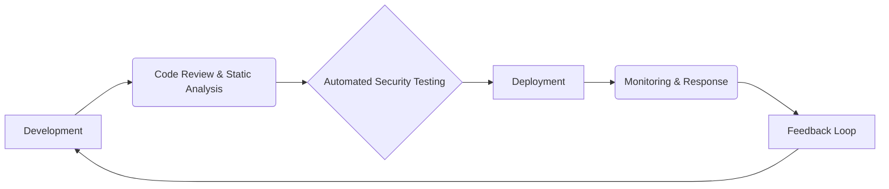
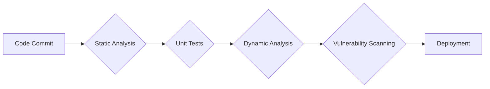
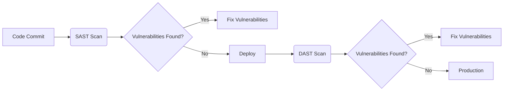
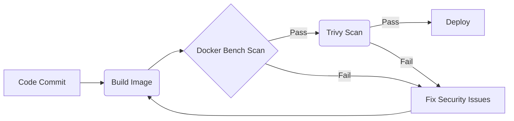
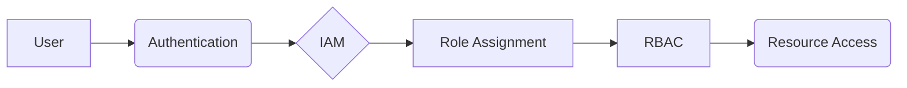

# What we will learn in this post?
<ul style='list-style-type: none; padding-left: 0;'>
<li>👉 Introduction to DevSecOps</li>
<li>👉 Integrating Security into the DevOps Lifecycle</li>
<li>👉 Static and Dynamic Application Security Testing (SAST/DAST)</li>
<li>👉 Container Security with Docker Bench and Trivy</li>
<li>👉 IAM and Access Management with Role-Based Access Control (RBAC)</li>
<li>👉 Conclusion!</li>
</ul>

# DevSecOps: Baking Security into Your Software 🎂

DevSecOps is all about building security into every step of software development, from the very beginning (left) to the end (right).  It's not a separate team or process; it's a *culture* shift where everyone—developers, security experts, and operations teams—shares the responsibility for security.  Think of it as baking security *into* the cake, not just adding sprinkles on top later!

## Shifting Security Left: A Cultural Change ⬅️

Traditional software development often treated security as an afterthought.  DevSecOps changes this by integrating security practices throughout the entire DevOps lifecycle:

### How it Works

*   **Early Integration:** Security checks and testing happen at *every* stage, not just at the end.  This means finding and fixing problems much earlier, saving time and money.
*   **Automation:**  Security tools are automated to scan code for vulnerabilities, making the process faster and more efficient.  Think automatic code analysis and security testing as part of your CI/CD pipeline.
*   **Shared Responsibility:** Developers, security teams, and operations work together as a single unit, sharing knowledge and responsibility for security.

## Benefits of DevSecOps 🎉

*   **Improved Risk Management:** Proactive identification and mitigation of vulnerabilities reduce the risk of security breaches.
*   **Faster Identification of Vulnerabilities:** Early detection means quicker fixes, saving time and resources.
*   **Secure Application Delivery:**  You deliver software that is inherently more secure and reliable.
*   **Reduced Costs:** Fixing bugs early is *way* cheaper than fixing them after release.

## DevSecOps Workflow (Simplified) ⚙️

## Learn More! 📚

For more in-depth information on DevSecOps, check out these resources:

*   [OWASP](https://owasp.org/) –  Open Web Application Security Project
*   [SANS Institute](https://www.sans.org/) –  Leading provider of security training and certifications

By embracing DevSecOps, you're not just building software—you're building *secure* software, efficiently and effectively.  It's a win-win for everyone!

# Securing Your DevOps Lifecycle 🛡️

Integrating security into your DevOps process, often called DevSecOps, is crucial for building secure and reliable applications.  It's not an add-on; it's a fundamental part of the entire lifecycle.

## Shifting Left: Early Security Integration ➡️

The key is to "shift left"—incorporate security checks early in the development process.  This prevents costly fixes later on.

### Automated Security Testing in CI/CD

Imagine a pipeline where each step includes security checks:

*   **Static Analysis:**  Tools automatically analyze code *before* it runs, identifying potential security flaws.  [Find more info here](https://owasp.org/www-project-top-ten/)
*   **Dynamic Analysis:** Tools test running applications to find vulnerabilities in real-time.
*   **Dependency Scanning:** This crucial step checks for known vulnerabilities in external libraries your application uses. (Think of it like a security checkup for the building blocks of your app).  [Learn more here](https://snyk.io/)
*   **Vulnerability Scanning:**  Automated tools scan your code and deployed applications for known security weaknesses.

## Access Control and Other Security Practices

*   **Access Control:**  Restrict access to your code, servers, and data based on the principle of least privilege.  Only give users the access they absolutely need.
*   **Security Testing:**  Regular penetration testing and security audits are crucial, even with automation. This simulates real-world attacks to find weaknesses.
*   **Secret Management:** Store sensitive information like API keys and passwords securely using dedicated tools, and *never* hardcode them directly into your code.

## Automation is Key ⚙️

Automating security processes saves time and reduces human error.  Automated testing and scanning ensure consistent security checks at every stage of development and deployment.  This makes your process more efficient and improves overall security.  Remember, security is everyone's responsibility!

# SAST vs. DAST: Keeping Your Apps Secure 💪

Application security is crucial, and SAST and DAST are two important approaches. Let's break them down!

## Static Application Security Testing (SAST) 🔎

SAST tools analyze your application's source code *without* actually running it. Think of it like a grammar check for your code, looking for potential security weaknesses before they become problems.

### How it Works
* SAST examines the code for known vulnerabilities like SQL injection, cross-site scripting (XSS), and buffer overflows.
* It works on the code itself, identifying flaws in the logic and structure.

### Example Tools
* SonarQube
* Checkmarx
* Coverity

## Dynamic Application Security Testing (DAST) 💥

DAST tools test your *running* application by simulating real-world attacks. Imagine a hacker trying to break into your app – that's what DAST does, but safely and ethically.

### How it Works
* DAST sends requests to your application (like a user would) to see how it responds.
* It checks for vulnerabilities like exposed sensitive data, insecure authentication, and misconfigurations.

### Example Tools
* OWASP ZAP
* Burp Suite
* Acunetix

## Integrating into DevOps ⚙️

Both SAST and DAST can be integrated into your DevOps pipeline using CI/CD tools. This helps automate security checks and identify vulnerabilities early.

*   **SAST:** Integrated into the build stage.  If vulnerabilities are found, the build fails, prompting developers to fix the issues before proceeding.
*   **DAST:** Integrated into the testing or pre-production stage to scan a deployed version. This catches vulnerabilities that SAST might miss.

By combining SAST and DAST, you gain a comprehensive view of your application's security posture, building more secure and reliable software.

**Resources:**

* [OWASP](https://owasp.org/) -  A great resource for web application security information.
* [SonarQube](https://www.sonarqube.org/) - Learn more about SAST.
* [OWASP ZAP](https://owasp.org/www-project-zap/) -  Learn more about DAST.

Remember: Security is an ongoing process, not a one-time fix!  Regularly use both SAST and DAST to keep your applications safe.

# Container Security in DevOps 🚀

DevOps thrives on speed and automation, but security shouldn't be an afterthought!  Securing your containerized applications is crucial.  Tools like Docker Bench and Trivy help achieve this.

## Docker Bench: Your Host and Container Security Guard 💪

Docker Bench is a security scanner that checks your Docker daemon's configuration and the host system's setup for best practices. Think of it as a checklist for a secure Docker environment. It identifies potential vulnerabilities and misconfigurations that could be exploited.

### How Docker Bench Works

Docker Bench performs a series of tests, examining things like:

*   **Docker daemon settings:** Are they properly configured to minimize attack surface?
*   **Host system settings:** Are there any OS-level vulnerabilities that could affect Docker?
*   **Security features:** Are important security features enabled (like AppArmor or SELinux)?

It outputs a report detailing areas needing improvement, guiding you to strengthen your security posture.

## Trivy: Vulnerability Scanner for Container Images 🔎

Trivy scans your container images for known vulnerabilities in the underlying packages and libraries.  It's like a detective, searching for weaknesses before they're exploited.

### How Trivy Works

Trivy analyzes the image layers, identifying vulnerable packages and their severity levels (e.g., critical, high, medium, low).  It uses a vast database of known vulnerabilities to perform this check.

## Integrating into the DevOps Pipeline ⚙️

Both tools can seamlessly integrate into your CI/CD pipeline:

*   **Build Stage:** Build your Docker image.
*   **Docker Bench Scan:** Run Docker Bench, failing the pipeline if issues are found.
*   **Trivy Scan:** Run Trivy, failing the pipeline if vulnerabilities are detected above a certain severity.
*   **Deploy:** If both scans pass, deploy your secure container image.

By integrating these tools, you proactively address security concerns, ensuring only secure images make it to production.

**Resources:**

*   [Docker Bench](https://github.com/docker/docker-bench-security)
*   [Trivy](https://aquasecurity.github.io/trivy/)

Remember, security is an ongoing process, not a one-time task.  Regularly scanning and updating your images is vital to maintain a secure containerized environment.

# IAM & RBAC: Your DevOps Security Superheroes 🦸‍♀️🦸‍♂️

DevOps thrives on speed and agility, but security shouldn't be sacrificed.  That's where Identity and Access Management (IAM) and Role-Based Access Control (RBAC) step in!  They're like security guards for your cloud infrastructure, ensuring only authorized individuals access sensitive resources.

## IAM: Managing User Access 🔑

IAM is all about who can do what. It's the foundation of secure access control. It manages:

*   **User Identities:**  Tracking who your users are.  Think usernames, passwords, and multi-factor authentication (MFA).
*   **Permissions:** Defining what each user or group is *allowed* to do (e.g., read, write, delete).
*   **Authentication:** Verifying user identities before granting access.

IAM ensures only authenticated individuals can interact with your systems.  Think of it as the bouncer at the club, only letting in those with proper IDs.

### IAM in Action:  Example

Imagine a developer needs access to a specific code repository. IAM would authenticate the developer, verify their credentials, and then grant them the necessary permissions to view, edit, and commit code, but *not* access production databases.

## RBAC: Fine-grained Control with Roles 🎯

RBAC takes IAM a step further. Instead of assigning permissions individually, it groups permissions into *roles*. This streamlines management and allows for *fine-grained control*.

*   **Roles define permissions:**  A "developer" role might include read/write access to code repos and build systems, but *not* access to production environments.
*   **Users assigned to roles:** Developers are assigned the "developer" role, automatically inheriting the defined permissions.
*   **Simplified management:** Changing permissions only requires updating the role, not each individual user.

### RBAC in Kubernetes ☸️

In Kubernetes, RBAC is crucial. It allows you to control access to pods, deployments, namespaces, and other resources.  A "read-only" role could access Kubernetes objects but not modify them.  Proper configuration prevents accidental or malicious changes.

## Benefits of Strong IAM & RBAC 💪

*   **Reduced risk of unauthorized access:**  Strict control limits the blast radius of a compromised account.
*   **Improved compliance:** Meets industry standards and regulations (e.g., HIPAA, GDPR).
*   **Simplified management:** Easily manage user permissions and access.
*   **Enhanced auditability:** Track user actions and identify potential security breaches.

Implementing robust IAM and RBAC is an *essential* step toward a secure DevOps environment.

[Learn more about IAM](https://aws.amazon.com/iam/)

[Learn more about RBAC in Kubernetes](https://kubernetes.io/docs/reference/access-authn-authz/rbac/)

<h1>Conclusion</h1>

And there you have it!  We've covered a lot of ground today, and hopefully, you found it helpful and insightful. 😊  But the conversation doesn't have to end here! We'd love to hear your thoughts, feedback, and any brilliant suggestions you might have.  What did you think of [mention a specific point from the blog]?  What other topics would you like us to explore? Let us know in the comments section below! 👇  We're always eager to learn from you and improve.  Let's chat!  💬

