# <span style="color:#e67e22;">What we will learn in this post?</span>
<ul style='list-style-type: none; padding-left: 0;'>
<li><span style='color: #2980b9; font-size: 20px; font-weight: bold;'>👉</span> <span style='color: #2ecc71; font-size: 18px; font-weight: bold;'>Mobile Applications</span></li>
<li><span style='color: #2980b9; font-size: 20px; font-weight: bold;'>👉</span> <span style='color: #2ecc71; font-size: 18px; font-weight: bold;'>Desktop GUI Applications</span></li>
<li><span style='color: #2980b9; font-size: 20px; font-weight: bold;'>👉</span> <span style='color: #2ecc71; font-size: 18px; font-weight: bold;'>Artificial Intelligence</span></li>
<li><span style='color: #2980b9; font-size: 20px; font-weight: bold;'>👉</span> <span style='color: #2ecc71; font-size: 18px; font-weight: bold;'>Scientific Applications</span></li>
<li><span style='color: #2980b9; font-size: 20px; font-weight: bold;'>👉</span> <span style='color: #2ecc71; font-size: 18px; font-weight: bold;'>Cloud Applications</span></li>
<li><span style='color: #2980b9; font-size: 20px; font-weight: bold;'>👉</span> <span style='color: #2ecc71; font-size: 18px; font-weight: bold;'>Embedded Systems</span></li>
<li><span style='color: #2980b9; font-size: 20px; font-weight: bold;'>👉</span> <span style='color: #2ecc71; font-size: 18px; font-weight: bold;'>Gaming Applications</span></li>
<li><span style='color: #2980b9; font-size: 20px; font-weight: bold;'>👉</span> <span style='color: #2ecc71; font-size: 18px; font-weight: bold;'>Conclusion!</span></li>
</ul>

# <span style="color:#e67e22">Java & Android: A Powerful Duo 📱</span>

Java has been a cornerstone of Android app development for many years.  While Kotlin is gaining popularity, Java remains a significant player.  Let's explore its role!

## <span style="color:#2980b9">Android SDK: Your Development Toolkit 🧰</span>

The Android Software Development Kit (SDK) provides the essential tools and APIs (Application Programming Interfaces) needed to build Android apps using Java.  This includes:

*   **Libraries:** Pre-built code modules for common tasks (networking, UI elements, etc.)
*   **Emulators:** Virtual Android devices for testing apps without a physical device.
*   **Debugging Tools:** To identify and fix errors in your code.

### <span style="color:#8e44ad">The Development Process</span>


## <span style="color:#2980b9">Popular Java-Powered Apps ✨</span>

Many successful apps leverage Java's power.  While specific languages aren't always publicly declared, Java has historically been prominent. Examples include (but are not limited to):

*   **_Spotify_**:  Known for its vast music library and streaming capabilities.
*   **_Airbnb_**:  A globally used platform for booking accommodations.
*   **_Netflix_**: A popular streaming service for movies and TV shows. (Note: Netflix's tech stack is diverse and evolving)


These apps demonstrate Java's capability to create robust, scalable, and user-friendly mobile experiences.


For more information on Android development:

*   [Android Developers](https://developer.android.com/)


Remember, while Java plays a vital role, the Android ecosystem is constantly evolving, and developers often use a mix of languages and tools.


# <span style="color:#e67e22">Building Java Desktop Apps: Swing vs. JavaFX 💻</span>

Java offers powerful tools for crafting desktop GUI (Graphical User Interface) applications.  Two prominent choices are Swing and JavaFX.

## <span style="color:#2980b9">Swing: The Veteran 💪</span>

Swing, a mature toolkit, provides a wide range of components for building classic desktop apps.  It's lightweight but can be less visually appealing compared to modern standards.  It uses a heavier weight approach than JavaFX.

### <span style="color:#8e44ad">Swing Pros & Cons</span>

*   **Pros:** Mature, widely supported, readily available in standard Java distributions.
*   **Cons:**  Can look dated, less feature-rich than JavaFX in terms of modern UI elements.

## <span style="color:#2980b9">JavaFX: The Modern Contender ✨</span>

JavaFX, the successor to Swing, boasts a modern look and feel, enhanced features, and support for CSS styling for easier customization. It's more powerful and versatile for contemporary UI design.


### <span style="color:#8e44ad">JavaFX Pros & Cons</span>

*   **Pros:** Modern look and feel, CSS styling, richer features, better for complex UIs.
*   **Cons:**  Steeper learning curve than Swing for some, might require additional setup.


## <span style="color:#2980b9">Notable Java Desktop Apps 🏆</span>

*   **Eclipse IDE:** A popular Integrated Development Environment (IDE) for Java and other languages.  [Eclipse Website](https://www.eclipse.org/)
*   **NetBeans IDE:** Another widely-used IDE with a similar purpose to Eclipse. [NetBeans Website](https://netbeans.apache.org/)
*   **Many internal business applications:**  Numerous companies use Java to create custom internal tools.


**Key Differences Summarized:**

| Feature     | Swing                            | JavaFX                         |
| ----------- | -------------------------------- | ------------------------------ |
| Look & Feel | Classic, sometimes dated         | Modern, stylish                |
| Complexity  | Simpler to learn initially       | Steeper learning curve         |
| Features    | Basic components                 | Richer features, CSS styling   |
| Performance | Generally faster for simple apps | Can be faster for complex apps |


Choosing between Swing and JavaFX depends on your project's needs and your preferences. For simple apps, Swing might suffice. For visually appealing and complex applications, JavaFX shines.  Remember to consider the overall project requirements and your team's expertise.


# <span style="color:#e67e22">Java's Role in Artificial Intelligence 🤖</span>

Java, despite not being the *most* popular language for AI, holds a significant niche due to its maturity, performance, and vast ecosystem.  Its strong typing and object-oriented nature make it suitable for complex AI projects demanding reliability.


## <span style="color:#2980b9">Key Java Libraries and Frameworks for AI</span>

*   **Deeplearning4j:** A powerful distributed deep-learning library providing tools for building neural networks. [Learn More](https://deeplearning4j.org/)
*   **Weka:** A collection of machine learning algorithms for data mining tasks, offering a user-friendly interface. [Learn More](https://www.cs.waikato.ac.nz/ml/weka/)
*   **Java-ML:** A simpler library focused on core machine learning algorithms, ideal for learning and smaller projects.


### <span style="color:#8e44ad">Example Applications</span>

*   **Natural Language Processing (NLP):**  Sentiment analysis of customer reviews using Deeplearning4j.
*   **Recommendation Systems:** Building movie recommendation engines leveraging Weka's collaborative filtering algorithms.
*   **Computer Vision:** Image classification tasks using custom-built neural networks with Deeplearning4j (although Python libraries are more dominant here).

```mermaid
graph TD
    %% Nodes
    A["📊 Data Collection & Preprocessing"] -->|🔍 Selects| B{"⚙️ Choose AI Algorithm"};
    B -- 🔵 Deeplearning4j --> C["🧠 Neural Network Training"];
    B -- 🟢 Weka --> D["📈 Model Building"];
    C -->|⚖️ Evaluates| E["🛠️ Model Evaluation & Tuning"];
    D --> E;
    E -->|🚀 Deploys| F["🌍 Deployment"];

    %% Custom Styling
    classDef preprocessStyle fill:#FF9800,stroke:#E65100,color:#FFFFFF,font-size:14px,stroke-width:2px,rx:12px,shadow:4px;
    classDef algorithmStyle fill:#03A9F4,stroke:#0277BD,color:#FFFFFF,font-size:14px,stroke-width:2px,rx:12px,shadow:4px;
    classDef neuralNetStyle fill:#673AB7,stroke:#311B92,color:#FFFFFF,font-size:14px,stroke-width:2px,rx:12px,shadow:4px;
    classDef modelBuildStyle fill:#4CAF50,stroke:#1B5E20,color:#FFFFFF,font-size:14px,stroke-width:2px,rx:12px,shadow:4px;
    classDef evaluationStyle fill:#FFC107,stroke:#FF6F00,color:#000000,font-size:14px,stroke-width:2px,rx:12px,shadow:4px;
    classDef deploymentStyle fill:#009688,stroke:#004D40,color:#FFFFFF,font-size:14px,stroke-width:2px,rx:12px,shadow:4px;

    %% Apply Stylish Classes
    class A preprocessStyle;
    class B algorithmStyle;
    class C neuralNetStyle;
    class D modelBuildStyle;
    class E evaluationStyle;
    class F deploymentStyle;

```

## <span style="color:#2980b9">A Simple Flowchart: Java AI Project</span>



While Python's ecosystem might be larger for AI, Java remains a viable option, especially for large-scale, robust applications requiring high performance and reliability.  Its mature tooling and strong community make it a valuable asset in specific AI projects.  Remember to choose the right tools based on your project's needs! 😊


# <span style="color:#e67e22">Java in Scientific Computing 🔬</span>

Java's platform independence and mature ecosystem make it a valuable tool for scientific computing and simulations.  Its object-oriented nature facilitates the creation of complex models, while readily available libraries significantly boost performance.

## <span style="color:#2980b9">Key Applications & Libraries 💻</span>

* **Bioinformatics:**  Java powers tools for genomic sequence analysis and protein structure prediction.  Tools like [BioJava](https://biojava.org/) provide essential functionalities.
* **Image Processing:**  Medical imaging and satellite data analysis benefit from Java's capabilities. Libraries like ImageJ (using Java) enable image manipulation and analysis.
* **Scientific Simulations:**  Java's performance, particularly when leveraging libraries like Colt and Apache Commons Math, allows for building sophisticated simulations in areas such as fluid dynamics and weather forecasting.


### <span style="color:#8e44ad">Example: Molecular Dynamics Simulation</span>

Many molecular dynamics simulation packages utilize Java.  These simulations model the movement of atoms and molecules, providing insights into material properties and biological processes.

## <span style="color:#2980b9">Advantages of Using Java ✨</span>

* **Platform Independence:** "Write once, run anywhere" capability is crucial for sharing code and results.
* **Extensive Libraries:** Libraries like `Apache Commons Math` provide numerous mathematical functions.
* **Object-Oriented Programming:**  Facilitates creating complex models with reusable components.

```mermaid
graph TD
    %% Nodes
    A["🔬 Scientific Problem"] -->|📝 Implements| B{"☕ Java Code"};
    B -->|🔢 Computes| C["📊 Numerical Computation"];
    B -->|📈 Plots| D["🎨 Data Visualization"];
    C -->|✅ Outputs| E["📑 Results"];
    D --> E;

    %% Custom Styling
    classDef problemStyle fill:#FF9800,stroke:#E65100,color:#FFFFFF,font-size:14px,stroke-width:2px,rx:12px,shadow:4px;
    classDef codeStyle fill:#03A9F4,stroke:#0277BD,color:#FFFFFF,font-size:14px,stroke-width:2px,rx:12px,shadow:4px;
    classDef computeStyle fill:#673AB7,stroke:#311B92,color:#FFFFFF,font-size:14px,stroke-width:2px,rx:12px,shadow:4px;
    classDef vizStyle fill:#4CAF50,stroke:#1B5E20,color:#FFFFFF,font-size:14px,stroke-width:2px,rx:12px,shadow:4px;
    classDef resultsStyle fill:#009688,stroke:#004D40,color:#FFFFFF,font-size:14px,stroke-width:2px,rx:12px,shadow:4px;

    %% Apply Stylish Classes
    class A problemStyle;
    class B codeStyle;
    class C computeStyle;
    class D vizStyle;
    class E resultsStyle;

```




By leveraging these strengths and libraries, Java empowers scientists and researchers to build efficient and robust solutions for complex scientific challenges.  For more information on Java libraries for scientific computing, explore resources like [JScience](https://jscience.org/).


# <span style="color:#e67e22">Java & Cloud Computing: A Perfect Match ☁️</span>

Java's robust features and vast ecosystem make it ideal for cloud development.  Its platform independence, mature libraries, and strong community support ensure scalability and reliability crucial for cloud applications.

## <span style="color:#2980b9">Popular Java Cloud Applications</span>

*   **Netflix:**  A massive example, using Java extensively for its backend services and microservices architecture.
*   **LinkedIn:** Leverages Java for its user profiles, networking features, and data processing systems.
*   **eBay:**  Relies heavily on Java for its e-commerce platform, managing transactions and user interactions.


### <span style="color:#8e44ad">Spring Cloud's Role</span>

The _Spring Cloud_ framework significantly simplifies building cloud-native applications in Java.  It provides tools for:

*   **Service Discovery:**  Easily locate and connect microservices.
*   **Configuration Management:**  Centralized configuration for consistent deployments.
*   **Circuit Breakers:**  Improve resilience by handling failures gracefully.  `@HystrixCommand` annotation is a great example.
*   **API Gateways:**  Manage requests and routing within a microservices architecture.

[Learn more about Spring Cloud](https://spring.io/projects/spring-cloud)

```mermaid
graph LR
    A["🧑‍💻 Client"] -->|🔗 Requests| B{"🌐 API Gateway"};
    B -->|📡 Routes| C{"🔧 Service A"};
    B -->|📡 Routes| D{"⚙️ Service B"};
    C -->|💾 Reads/Writes| E["🗄️ Database"];
    D -->|📡 Calls| F["🌍 External API"];

    %% Custom Styling
    classDef clientStyle fill:#FF9800,stroke:#E65100,color:#FFFFFF,font-size:14px,stroke-width:2px,rx:12px,shadow:4px;
    classDef gatewayStyle fill:#03A9F4,stroke:#0277BD,color:#FFFFFF,font-size:14px,stroke-width:2px,rx:12px,shadow:4px;
    classDef serviceStyle fill:#4CAF50,stroke:#1B5E20,color:#FFFFFF,font-size:14px,stroke-width:2px,rx:12px,shadow:4px;
    classDef dbStyle fill:#673AB7,stroke:#311B92,color:#FFFFFF,font-size:14px,stroke-width:2px,rx:12px,shadow:4px;
    classDef apiStyle fill:#9C27B0,stroke:#4A148C,color:#FFFFFF,font-size:14px,stroke-width:2px,rx:12px,shadow:4px;

    %% Apply Classes
    class A clientStyle;
    class B gatewayStyle;
    class C,D serviceStyle;
    class E dbStyle;
    class F apiStyle;
E;
```


## <span style="color:#2980b9">Simplified Architecture</span>



This simple diagram shows how Spring Cloud manages requests.  The API Gateway routes traffic to different microservices, which interact with a shared database.


Java's versatility combined with frameworks like Spring Cloud enables developers to build scalable, resilient, and efficient cloud-based applications.  **Its mature ecosystem and large community ensure readily available support and solutions.**


# <span style="color:#e67e22">Java in Embedded Systems ☕</span>

## <span style="color:#2980b9">What's the Deal?</span>

Java, known for its "write once, run anywhere" philosophy, might seem unusual for resource-constrained embedded systems. However, its robustness and large community support make it surprisingly suitable for certain applications.  It's less common than C/C++, but Java's advantages are starting to make a big impact.


### <span style="color:#8e44ad">Advantages of Java in Embedded Systems</span>

* **Simplified Development:** Java's high-level features reduce development time and effort.  This is particularly useful when working with complex systems.
* **Portability:**  Write code once and deploy it across various embedded platforms with minimal modification.
* **Security:** Java's strong security features help protect embedded devices from malicious attacks.
* **Large Community and Resources:**  Extensive documentation and support are readily available.


### <span style="color:#8e44ad">Disadvantages of Java in Embedded Systems</span>

* **Memory Footprint:** Java's runtime environment (JVM) can be resource-intensive, making it less suitable for extremely small devices.
* **Performance Overhead:**  Compared to C/C++, Java can have lower performance in real-time applications.

## <span style="color:#2980b9">Examples of Java in Action</span>

* **Set-top boxes:** Some smart TVs and set-top boxes use Java for their user interfaces and applications.
* **Printers:** Certain high-end printers might employ Java for advanced network functions and management.
* **Industrial Control Systems:**  Java finds a niche in some industrial applications where its robustness and network capabilities are beneficial.  


## <span style="color:#2980b9">Challenges</span>

The primary challenge lies in optimizing Java for resource-constrained environments. This usually involves using a *lightweight JVM* and careful code optimization to minimize memory usage and execution time.  

[Learn more about lightweight JVMs](https://en.wikipedia.org/wiki/Lightweight_Java_Virtual_Machine)


---

**In essence:** Java offers a powerful toolset for embedded systems where its advantages outweigh its limitations. While not the first choice for every embedded application, its use is growing, particularly in applications where development speed, security, and network connectivity are critical.  🚀


# <span style="color:#e67e22">Java in Game Development 🎮</span>

Java, with its platform independence ("write once, run anywhere") and strong community support, has powered many popular games.  While not as dominant as C++ in AAA titles, it shines in smaller, cross-platform games and educational applications.  Think Minecraft's early versions!


## <span style="color:#2980b9">Java's Advantages in Game Dev</span>

* **Cross-Platform Compatibility:**  Write your game once and deploy it on Windows, macOS, Linux, and even Android with minimal changes.
* **Large Community & Resources:**  A huge community means readily available tutorials, libraries, and support.
* **Object-Oriented Programming:**  Java's OOP nature lends itself well to game design, making code organization easier.


### <span style="color:#8e44ad">Key Libraries: LWJGL</span>

The Lightweight Java Game Library (LWJGL) is a crucial library. It provides bindings to OpenGL (for graphics), OpenAL (for sound), and more.  This allows Java developers to access powerful, low-level functionalities for creating visually impressive games.

```java
// Example (Simplified) LWJGL initialization
import org.lwjgl.*; // Import LWJGL library
```

[LWJGL Website](https://www.lwjgl.org/)  (More info on LWJGL)


## <span style="color:#2980b9">Popular Java Games (Examples)</span>

* _Minecraft_ (Early versions) - A legendary example of Java's power in game development.
* _Starcraft_ (Some mods) -  Some community-made mods have leveraged Java.
* Numerous indie and educational games.


**Note:**  While Java is suitable for many game types, it might not be the optimal choice for high-performance, graphically intensive AAA games where C++ often reigns supreme.  However, for many other game projects, Java provides a strong and accessible platform.


<h1><span style='color:#e67e22'>Conclusion</span></h1>

And there you have it!  We hope you found this post helpful and insightful 😊.  We're always looking to improve, so your thoughts matter!  Share your comments, feedback, or any suggestions you have below 👇.  Let's keep the conversation going!  We can't wait to hear from you!  🥳


