# What we will learn in this post?

<ul style='list-style-type: none; padding-left: 0;'>
<li>👉 Site Reliability Engineering (SRE) and Its Principles</li>
<li>👉 Error Budgets and SLIs, SLOs, SLAs</li>
<li>👉 Designing and Deploying Microservices</li>
<li>👉 API Gateways and Service Mesh (Istio, Linkerd)</li>
<li>👉 Advanced CI/CD Techniques: Multi-Stage Pipelines and Templates</li>
<li>👉 Conclusion!</li>
</ul>

# Site Reliability Engineering (SRE): Keeping Your Software Running Smoothly ⚙️

Site Reliability Engineering (SRE) is like a superhero for software systems. It's a discipline that combines software engineering principles with operations to build _highly reliable_, _scalable_, and _efficient_ software. Think of it as a bridge between developers and operations teams. Instead of just reacting to problems, SRE aims to _prevent_ them.

## Core Principles of SRE 🚀

SRE relies on several key principles:

- **Automation is King 👑:** Automating repetitive tasks (like deployments and monitoring) frees up engineers to focus on more complex challenges. This is crucial for efficiency and reduces human error.
- **Data-Driven Decisions 📊:** SRE uses Service Level Indicators (SLIs) – measurable metrics like uptime and latency – to track performance. Service Level Objectives (SLOs) define acceptable performance targets based on SLIs.
- **Balancing Speed and Stability ⚖️:** SRE strives to deliver features quickly while maintaining system stability. This requires careful planning, testing, and a strong understanding of trade-offs.
- **Error Budgets ⚠️:** Teams are given an "error budget"—a percentage of downtime allowed within a given period. Exceeding this budget triggers a focus on improving reliability.

### Automating Operations

Automating tasks is key. It reduces human error and improves speed and efficiency.

```mermaid
graph LR
    A["🛠️ Manual Task"] --> B{"⚙️ Automation"};
    B -- ✅ Success --> C["🚀 Improved Efficiency"];
    B -- ❌ Failure --> D["🔍 Debugging"];
    D --> B;

    %% Custom Styles
    classDef taskStyle fill:#FF6F61,stroke:#B71C1C,color:#FFFFFF,font-size:14px,stroke-width:2px,rx:12px,shadow:5px;
    classDef decisionStyle fill:#FFD54F,stroke:#FF6F00,color:#000000,font-size:14px,stroke-width:2px,rx:12px,shadow:5px;
    classDef successStyle fill:#81C784,stroke:#388E3C,color:#000000,font-size:14px,stroke-width:2px,rx:12px,shadow:5px;
    classDef errorStyle fill:#64B5F6,stroke:#1E88E5,color:#000000,font-size:14px,stroke-width:2px,rx:12px,shadow:5px;

    %% Apply Classes
    class A taskStyle;
    class B decisionStyle;
    class C successStyle;
    class D errorStyle;

```

## SRE & DevOps Synergy 🤝

SRE works hand-in-hand with DevOps. By integrating SRE practices, DevOps teams can:

- **Improve uptime and performance:** Proactive monitoring and automation help identify and resolve issues before they impact users.
- **Increase developer productivity:** Automation and streamlined processes allow developers to focus on building features, not firefighting.
- **Enhance collaboration:** SRE fosters a culture of shared responsibility between development and operations.

## Measuring Reliability with SLIs and SLOs

SLIs are metrics that measure the reliability of your system (e.g., _latency_, _error rate_, _uptime_). SLOs are targets for these metrics (e.g., "99.9% uptime"). Tracking these helps you understand system performance and identify areas for improvement.

**Example:** An SLI could be the average response time of an API. The corresponding SLO might be that the average response time should be under 200ms 99.9% of the time.

For more information, explore these resources:

- [Google SRE Book](https://landing.google.com/sre/sre-book/): The definitive guide to SRE.
- [The Site Reliability Workbook](https://landing.google.com/sre/workbook/): A practical guide with exercises.

By embracing the principles of SRE, organizations can build robust, scalable, and reliable systems that consistently meet user expectations. It's all about building a system that can handle _whatever_ is thrown at it.

# Error Budgets: Balancing Innovation and Stability 📈

In Site Reliability Engineering (SRE), error budgets help teams manage the delicate balance between _innovation_ and _stability_. Think of it like this: you have a certain amount of "allowed" errors before your service becomes unreliable. This is defined by your Service Level Objectives (SLOs).

## Understanding the Key Players 🤝

- **SLIs (Service Level Indicators):** These are _measurable_ aspects of your service's performance. Examples include uptime, latency, and error rate. Think of them as the _data points_ that tell you how your service is doing.

- **SLOs (Service Level Objectives):** These are the _targets_ you set for your SLIs. For example, "99.9% uptime" is an SLO. They define acceptable performance levels.

- **SLAs (Service Level Agreements):** These are _formal contracts_ with users or internal teams that define the expected service level. SLOs often inform SLAs.

- **Error Budget:** This is the _remaining percentage_ of allowed errors after subtracting the acceptable error rate from 100%. It's your "wiggle room" for innovation.

### Example:

Let's say your SLO for uptime is 99.9%. This means you have a 0.1% error budget (100% - 99.9% = 0.1%). If you consistently stay below this 0.1% error rate, you have "error budget" to spend on new features without jeopardizing reliability.

## Using Error Budgets for Decision-Making 🤔

- **Feature Development:** If your error budget is healthy (lots of wiggle room!), you can confidently invest in new features.
- **Reliability Improvements:** If you're close to exhausting your error budget, it's a signal to prioritize reliability improvements before adding more features. This helps prevent service disruptions.

```mermaid
graph LR
    A["📊 SLIs (Data)"] --> B["🎯 SLOs (Targets)"];
    B --> C{"⚖️ Error Budget"};
    C -- 🔄 Balanced --> D["🚀 Feature Development"];
    C -- ⚠️ Depleted --> E["🛠️ Reliability Improvements"];

    %% Custom Styles
    classDef dataStyle fill:#FF6F61,stroke:#B71C1C,color:#FFFFFF,font-size:14px,stroke-width:2px,rx:12px,shadow:5px;
    classDef targetStyle fill:#FFD54F,stroke:#FF6F00,color:#000000,font-size:14px,stroke-width:2px,rx:12px,shadow:5px;
    classDef decisionStyle fill:#81C784,stroke:#388E3C,color:#000000,font-size:14px,stroke-width:2px,rx:12px,shadow:5px;
    classDef featureStyle fill:#64B5F6,stroke:#1E88E5,color:#000000,font-size:14px,stroke-width:2px,rx:12px,shadow:5px;
    classDef reliabilityStyle fill:#AB47BC,stroke:#6A1B9A,color:#FFFFFF,font-size:14px,stroke-width:2px,rx:12px,shadow:5px;

    %% Apply Classes
    class A dataStyle;
    class B targetStyle;
    class C decisionStyle;
    class D featureStyle;
    class E reliabilityStyle;

```

## Visual Representation 📊

This shows how SLIs feed into SLOs, which then determine your error budget, guiding your decision between feature development and reliability work.

By using error budgets, teams make _data-driven decisions_, promoting both innovation and stability. It’s all about _finding the right balance!_

[Learn More about SRE](https://landing.google.com/sre/)

# Microservices in a DevOps World 🌎

Microservices are a way to build software by breaking it down into small, independent services. Think of them as LEGO bricks—each does one specific thing, and you can combine them to create something much bigger. This approach works perfectly within a DevOps environment focused on automation and continuous delivery.

## Benefits of Microservices ✨

- **Scalability:** Easily scale individual services based on demand. Need more users handling image processing? Just scale _that_ service!
- **Flexibility:** Update and deploy individual services without affecting the entire application. This allows for faster iteration and innovation.
- **Improved Fault Isolation:** If one service fails, the others continue to function, minimizing downtime.

## Challenges of Microservices 🚧

- **Service Communication:** Managing communication between many services can be complex. Consider using message queues (e.g., RabbitMQ, Kafka) or APIs (REST, gRPC).
- **Data Consistency:** Maintaining data consistency across multiple databases requires careful planning and coordination. Strategies like Sagas or eventual consistency patterns can help.
- **Deployment Complexities:** Deploying and managing many services requires automation and orchestration tools.

## Deployment Strategies 🚀

### Containerization 🐳

Containers (Docker) package services and their dependencies, ensuring consistency across environments.

### Orchestration ⚙️

Tools like Kubernetes automate deployment, scaling, and management of containerized services.

## Tools and Technologies 🧰

- **Containerization:** Docker, containerd
- **Orchestration:** Kubernetes, Docker Swarm
- **Service Mesh:** Istio, Linkerd (for managing service-to-service communication)
- **Monitoring:** Prometheus, Grafana, Jaeger (for tracing requests across services)

```mermaid
graph TD
    A["👨‍💻 Developer Commits Code"] --> B{"⚙️ CI/CD Pipeline"};
    B --> C["🛠️ Build Container Image"];
    C --> D["📦 Push to Container Registry"];
    D --> E["🚀 Kubernetes Deploys Service"];
    E --> F["🟢 Service Running"];
    F --> G["📈 Monitoring & Logging"];

    %% Custom Styles
    classDef devStyle fill:#4DB6AC,stroke:#00695C,color:#000000,font-size:14px,stroke-width:3px,rx:15px,shadow:4px;
    classDef pipelineStyle fill:#FFB74D,stroke:#EF6C00,color:#000000,font-size:14px,stroke-width:3px,rx:15px,shadow:4px;
    classDef buildStyle fill:#7986CB,stroke:#303F9F,color:#FFFFFF,font-size:14px,stroke-width:3px,rx:15px,shadow:4px;
    classDef registryStyle fill:#BA68C8,stroke:#6A1B9A,color:#FFFFFF,font-size:14px,stroke-width:3px,rx:15px,shadow:4px;
    classDef deployStyle fill:#F06292,stroke:#880E4F,color:#FFFFFF,font-size:14px,stroke-width:3px,rx:15px,shadow:4px;
    classDef runningStyle fill:#AED581,stroke:#33691E,color:#000000,font-size:14px,stroke-width:3px,rx:15px,shadow:4px;
    classDef monitorStyle fill:#FFD54F,stroke:#FF6F00,color:#000000,font-size:14px,stroke-width:3px,rx:15px,shadow:4px;

    %% Apply Classes
    class A devStyle;
    class B pipelineStyle;
    class C buildStyle;
    class D registryStyle;
    class E deployStyle;
    class F runningStyle;
    class G monitorStyle;

```

## Example Deployment Flowchart

Adopting microservices requires careful planning and the right tools. However, the benefits in terms of scalability, flexibility, and resilience often outweigh the challenges, especially in a DevOps environment that embraces automation and continuous improvement.

**Resources:**

- [Kubernetes](https://kubernetes.io/)
- [Docker](https://www.docker.com/)

Remember, this is a simplified overview. Each aspect deserves deeper exploration based on your specific needs.

# Managing Microservices with API Gateways & Service Meshes 🌎

Microservices architecture offers scalability and flexibility, but managing them can be complex. API gateways and service meshes are crucial tools that simplify this process.

## API Gateways: The Front Door 🚪

Think of an API gateway as the single entry point for all client requests to your microservices. It acts like a smart receptionist, directing traffic and handling various tasks before requests reach their destination.

### Key Functions:

- **Routing:** The gateway directs requests to the appropriate microservice.
- **Authentication & Authorization:** It verifies client identity and permissions.
- **Rate Limiting:** Prevents overload by controlling the number of requests.
- **Transformation:** It can modify requests before forwarding them.

```mermaid
graph LR
    A["🧑‍💻 Client"] --> B{"🌐 API Gateway"};
    B --> C["⚙️ Service A"];
    B --> D["🔧 Service B"];
    B --> E["💾 Service C"];

    %% Custom Styles
    classDef clientStyle fill:#4DD0E1,stroke:#006064,color:#000000,font-size:14px,stroke-width:3px,rx:15px,shadow:4px;
    classDef gatewayStyle fill:#FFB74D,stroke:#E65100,color:#000000,font-size:14px,stroke-width:3px,rx:15px,shadow:4px;
    classDef serviceStyle fill:#81C784,stroke:#1B5E20,color:#000000,font-size:14px,stroke-width:3px,rx:15px,shadow:4px;

    %% Apply Classes
    class A clientStyle;
    class B gatewayStyle;
    class C,D,E serviceStyle;

```

[Learn more about API Gateways](https://www.nginx.com/resources/glossary/api-gateway/)

## Service Meshes: Internal Traffic Control 🚦

Service meshes like _Istio_ and _Linkerd_ manage communication _between_ your microservices. They sit beside your services, providing advanced features.

### Key Benefits:

- **Observability:** Monitor requests, latency, and errors for improved debugging.
- **Traffic Management:** Control the flow of traffic, enabling features like A/B testing and canary deployments.
- **Security:** Enforce security policies and encrypt communication between services.

```mermaid
graph LR
    subgraph Microservices
        A["🛠️ Service A"] --> B("🛡️ Istio/Linkerd");
        C["⚙️ Service B"] --> B;
        D["🔍 Service C"] --> B;
    end
    B --> E["📊 Monitoring/Tracing"];

    %% Custom Styles
    classDef serviceStyle fill:#64B5F6,stroke:#1976D2,color:#000000,font-size:14px,stroke-width:3px,rx:15px,shadow:4px;
    classDef meshStyle fill:#FFB74D,stroke:#E65100,color:#000000,font-size:14px,stroke-width:3px,rx:15px,shadow:4px;
    classDef monitorStyle fill:#81C784,stroke:#1B5E20,color:#000000,font-size:14px,stroke-width:3px,rx:15px,shadow:4px;

    %% Apply Classes
    class A,C,D serviceStyle;
    class B meshStyle;
    class E monitorStyle;

```

[Explore Istio](https://istio.io/) [Discover Linkerd](https://linkerd.io/)

## Simplifying Microservice Management 💪

By using API gateways and service meshes together, you gain:

- **Improved Security:** Centralized authentication and authorization.
- **Enhanced Scalability:** Handle increasing traffic without impacting individual services.
- **Better Observability:** Gain insights into the health and performance of your entire system.
- **Simplified Deployment:** Easier to manage and deploy new services.

In short, these tools are essential for building robust and manageable microservices architectures. They take the complexity out of inter-service communication, allowing developers to focus on building great applications.

# Supercharging your CI/CD with Advanced Techniques 🚀

Modern CI/CD goes beyond simple build-and-deploy. Let's explore some powerful techniques to make your workflows smoother and more efficient!

## Multi-Stage Pipelines: Divide and Conquer 🛠️

Imagine building a house. You wouldn't do everything at once, right? Multi-stage pipelines work the same way for software. Instead of one long process, we break down our delivery into separate stages:

- **Build:** Compile code, run linters.
- **Test:** Unit tests, integration tests, UI tests.
- **Deploy:** Push to staging, then production.

These stages can run _sequentially_ (one after another) or _in parallel_ (simultaneously), drastically speeding up the process.

```mermaid
graph LR
    A["🔨 Build"] --> B("🧪 Test");
    A --> C("🚀 Deploy");
    B --> D{"✅ Success?"};
    C --> D;
    D -- "👍 Yes" --> E("🎯 Done");
    D -- "👎 No" --> F("❌ Fail");

    %% Custom Styles
    classDef buildStyle fill:#FFD700,stroke:#B8860B,color:#000000,font-size:14px,stroke-width:3px,rx:15px,shadow:5px;
    classDef testStyle fill:#FF69B4,stroke:#C71585,color:#FFFFFF,font-size:14px,stroke-width:3px,rx:15px,shadow:5px;
    classDef deployStyle fill:#40E0D0,stroke:#008080,color:#000000,font-size:14px,stroke-width:3px,rx:15px,shadow:5px;
    classDef decisionStyle fill:#FF6347,stroke:#B22222,color:#FFFFFF,font-size:14px,stroke-width:3px,rx:15px,shadow:5px;
    classDef resultStyle fill:#32CD32,stroke:#006400,color:#000000,font-size:14px,stroke-width:3px,rx:15px,shadow:5px;
    classDef failStyle fill:#8B0000,stroke:#FFDAB9,color:#FFFFFF,font-size:14px,stroke-width:3px,rx:15px,shadow:5px;

    %% Apply Classes
    class A buildStyle;
    class B testStyle;
    class C deployStyle;
    class D decisionStyle;
    class E resultStyle;
    class F failStyle;

```

### Parallelism Example

By running tests and deployment concurrently, we save a lot of time!

## Pipeline Templates: Reusable Magic ✨

Creating pipelines can be repetitive. Templates solve this! Think of them as pre-built blueprints. You define a common structure once, and then reuse it for different projects or environments, just changing a few specifics.

- **Consistency:** Ensures all pipelines follow the same best practices.
- **Efficiency:** Saves time and reduces errors.
- **Maintainability:** Easier to update and manage.

### Example: A Deployment Template

Imagine a template for deploying to various environments (staging, production). You'd just specify the environment in your project's configuration, and the template handles the rest!

## Benefits Summarized 👍

- **Faster Feedback Loops:** Quicker identification and resolution of issues.
- **Increased Reliability:** Automated processes reduce human error.
- **Improved Collaboration:** Better communication and coordination among teams.
- **Scalability:** Easily handle growing complexity and project needs.

**Learn More:**

- [Jenkins Pipelines](https://www.jenkins.io/doc/book/pipeline/)
- [GitHub Actions](https://docs.github.com/en/actions)
- [GitLab CI/CD](https://docs.gitlab.com/ee/ci/index.html)

By using multi-stage pipelines and templates, you unlock the true power of CI/CD, creating a more efficient, reliable, and enjoyable DevOps workflow. Happy automating! 🎉

<h1>Conclusion</h1>

So there you have it! We hope you enjoyed this read and found it helpful 😊. We're always looking to improve, so we'd love to hear your thoughts! What did you think? What would you like to see more of? Let us know in the comments below 👇 – your feedback is super valuable to us and helps us create even better content in the future. We can't wait to chat with you! 🤗
