# <span style="color:#e67e22;">What we will learn in this post?</span>

<ul style='list-style-type: none; padding-left: 0;'>
<li><span style='color: #2980b9; font-size: 20px; font-weight: bold;'>👉</span> <span style='color: #2ecc71; font-size: 18px; font-weight: bold;'>Introduction to Micro-Frontends</span></li>
<li><span style='color: #2980b9; font-size: 20px; font-weight: bold;'>👉</span> <span style='color: #2ecc71; font-size: 18px; font-weight: bold;'>Implementing Micro-Frontends in Angular</span></li>
<li><span style='color: #2980b9; font-size: 20px; font-weight: bold;'>👉</span> <span style='color: #2ecc71; font-size: 18px; font-weight: bold;'>Communication Between Micro-Frontends</span></li>
<li><span style='color: #2980b9; font-size: 20px; font-weight: bold;'>👉</span> <span style='color: #2ecc71; font-size: 18px; font-weight: bold;'>Challenges and Best Practices</span></li>
<li><span style='color: #2980b9; font-size: 20px; font-weight: bold;'>👉</span> <span style='color: #2ecc71; font-size: 18px; font-weight: bold;'>Conclusion!</span></li>
</ul>

# <span style="color:#e67e22">Micro-frontends: Building Better Enterprise Apps 🏢</span>

Imagine building a giant LEGO castle. Instead of one massive, complex structure, you build smaller, independent sections (towers, walls, etc.) that you can assemble together. That’s essentially what micro-frontends are for software!

## <span style="color:#2980b9">What are Micro-frontends? 🤔</span>

Micro-frontends are an architectural approach where a single web application is broken down into smaller, independent "frontend" units. Each unit can be developed, tested, and deployed independently, similar to microservices on the backend. Think of them as independent LEGO bricks that combine to make up the complete application.

### <span style="color:#8e44ad">Advantages of Micro-frontends ✨</span>

- **Independent Deployment:** Deploy updates to one section without affecting others. This reduces risks and speeds up release cycles. 🚀
- **Modular Development:** Smaller, manageable codebases make development easier and faster. Teams can work independently without stepping on each other's toes. 🤝
- **Technology Diversity:** Use different JavaScript frameworks (React, Angular, Vue) in different micro-frontends based on team expertise and project needs. 🌈
- **Scalability:** Easily scale individual components based on usage and demand. 💪
- **Maintainability:** Easier to understand, debug, and maintain smaller codebases. 🛠️

## <span style="color:#2980b9">Independent Development & Deployment ⚙️</span>

With micro-frontends, teams can work in parallel. One team might be responsible for the `product catalog` micro-frontend, another for the `shopping cart`. They can use different technologies and deploy updates without affecting other parts of the app.

```mermaid
graph LR
    A["📦 Team A: Product Catalog"] --> B("🚀 Deployment");
    C["🛒 Team B: Shopping Cart"] --> B;
    D["👤 Team C: User Accounts"] --> B;
    B --> E["💡 Integrated Application"];

    %% Custom Styles
    classDef teamStyle fill:#FFD700,stroke:#B8860B,color:#000000,font-size:14px,stroke-width:3px,rx:15px,shadow:5px;
    classDef deployStyle fill:#40E0D0,stroke:#008080,color:#000000,font-size:14px,stroke-width:3px,rx:15px,shadow:5px;
    classDef appStyle fill:#32CD32,stroke:#006400,color:#000000,font-size:14px,stroke-width:3px,rx:15px,shadow:5px;

    %% Apply Classes
    class A,C,D teamStyle;
    class B deployStyle;
    class E appStyle;
```



## <span style="color:#2980b9">Real-World Example: A Large E-commerce Platform 🛍️</span>

A major online retailer could split its website into micro-frontends:

- _Product Catalog_: Displays products with filtering and search.
- _Shopping Cart_: Manages items added to the cart.
- _Checkout_: Handles payment processing.
- _User Account_: Manages user profiles and orders.

Each of these could be built and deployed separately, allowing for faster iteration and improved team autonomy.

## <span style="color:#2980b9">Resources for Further Learning 📚</span>

- [Micro Frontends - Martin Fowler](https://martinfowler.com/articles/micro-frontends.html) _(A great starting point!)_

Micro-frontends offer a powerful way to build complex enterprise applications effectively. By fostering independent development and deployment, they significantly improve team collaboration, reduce risks, and ultimately lead to better software. Remember the LEGO analogy – small, manageable pieces combining to create something amazing!

# <span style="color:#e67e22">Building Micro-frontends with Angular: A Step-by-Step Guide</span> 🛠️

This guide explains how to build micro-frontends with Angular using either Webpack Module Federation or Single SPA.

## <span style="color:#2980b9">Option 1: Webpack Module Federation 🤝</span>

Webpack Module Federation lets Angular micro-frontends share modules (components, services).

### <span style="color:#8e44ad">Step 1: Project Setup</span>

- Create multiple Angular projects (e.g., `shell`, `mfe1`, `mfe2`).
- Install `webpack5` and `@angular-architects/module-federation` in each project.

### <span style="color:#8e44ad">Step 2: Configure `webpack.config.js`</span>

In the _shell_ project (main app), configure the _remotes_ to load the other micro-frontends. In each _mfe_, define the _exposes_ for modules to share:

```javascript
// shell webpack.config.js (excerpt)
remotes: {
  'mfe1': 'mfe1@http://localhost:4201/remoteEntry.js',
  'mfe2': 'mfe2@http://localhost:4202/remoteEntry.js',
},
// mfe1 webpack.config.js (excerpt)
exposes: {
  './Module': './projects/mfe1/src/app/module.ts',
},
```

### <span style="color:#8e44ad">Step 3: Import and Use Shared Modules</span>

In the _shell_, import components from the exposed modules:

```typescript
import { MyComponent } from "mfe1/Module"
```

## <span style="color:#2980b9">Option 2: Single SPA 🕹️</span>

Single SPA orchestrates multiple independently deployed Angular apps. It's simpler for less complex sharing needs.

### <span style="color:#8e44ad">Step 1: Project Setup</span>

Similar to Webpack Module Federation, create multiple Angular projects. Install `single-spa` and its Angular helper library in each.

### <span style="color:#8e44ad">Step 2: Configure Single SPA</span>

Create a Single SPA configuration file (`single-spa.config.js`). Register each micro-frontend, defining its lifecycle functions:

```javascript
import { registerApplication, start } from "single-spa"

registerApplication({
  name: "@mfe1",
  app: () => SystemJS.import("@mfe1/main"),
  activeWhen: ["/mfe1"],
})

start()
```

### <span style="color:#8e44ad">Step 3: Adapt Angular Apps</span>

Modify each Angular app to use Single SPA's lifecycle functions (bootstrap, mount, unmount).

## <span style="color:#2980b9">Choosing the Right Approach 🤔</span>

- **Webpack Module Federation:** Ideal for complex sharing of modules and optimized code loading. Steeper learning curve.
- **Single SPA:** Simpler for basic integration and less code sharing.

Remember to consult the official documentation for more details:

- [Webpack Module Federation](https://webpack.js.org/concepts/module-federation/)
- [Single SPA](https://single-spa.js.org/)

This simplified guide provides a starting point. Real-world applications may require more sophisticated configurations and considerations.

# <span style="color:#e67e22">Micro-Frontend Communication Strategies 🤝</span>

Building a complex Angular application using micro-frontends requires careful planning for communication between these independent units. Let's explore some effective strategies:

## <span style="color:#2980b9">Shared Services 📦</span>

This approach involves creating a shared library containing services accessible to all micro-frontends. This is ideal for common functionalities like authentication or data access.

### <span style="color:#8e44ad">Example</span>

Imagine a `UserService` providing user information. Each micro-frontend can inject this service, ensuring consistent data across the application.

- **Pros:** Simple to implement, efficient for shared data.
- **Cons:** Tight coupling; changes in the shared service affect all micro-frontends.

## <span style="color:#2980b9">Global State Management (NgRx) 🌍</span>

NgRx provides a robust state management solution using observable streams. All micro-frontends subscribe to relevant parts of the global state, reacting to changes.

### <span style="color:#8e44ad">Example</span>

A shopping cart might be managed globally using NgRx. The product details micro-frontend updates the cart state, and the checkout micro-frontend subscribes to display cart contents.

- **Pros:** Decouples micro-frontends, easy state tracking and updates, improved testability.
- **Cons:** Adds complexity, requires careful planning to avoid performance bottlenecks. Learn more: [NgRx Documentation](https://ngrx.io/guide/store)

## <span style="color:#2980b9">Message Passing (Custom Events/Message Broker) ✉️</span>

This strategy uses events or a message broker (like Kafka or RabbitMQ) for communication. Micro-frontends publish events, and other interested micro-frontends subscribe.

### <span style="color:#8e44ad">Example (Custom Events)</span>

A micro-frontend handling user login publishes a `'userLoggedIn'` event, containing user details. The profile micro-frontend listens for this event and updates the UI.

- **Pros:** Loose coupling, highly scalable, suitable for asynchronous communication.
- **Cons:** Can become complex to manage many event types, potentially leading to inconsistencies if not handled carefully.

**Choosing the Right Strategy:**

The optimal approach depends on the application's architecture and communication needs. Often a hybrid approach—combining shared services for core functionalities and message passing for more specific interactions—provides the best balance between simplicity and flexibility.

```mermaid
graph LR
    A["💻 Micro-frontend 1"] --> B("🛎 Shared Service");
    C["📱 Micro-frontend 2"] --> B;
    B --> D["🌐 Global State (NgRx)"];
    E["🖥 Micro-frontend 3"] --> D;
    F["📊 Micro-frontend 4"] -- "📡 Custom Event" --> G["📈 Micro-frontend 5"];

    %% Custom Styles
    classDef frontendStyle fill:#FFD700,stroke:#B8860B,color:#000000,font-size:14px,stroke-width:3px,rx:15px,shadow:5px;
    classDef serviceStyle fill:#40E0D0,stroke:#008080,color:#000000,font-size:14px,stroke-width:3px,rx:15px,shadow:5px;
    classDef stateStyle fill:#32CD32,stroke:#006400,color:#000000,font-size:14px,stroke-width:3px,rx:15px,shadow:5px;
    classDef eventStyle fill:#FF69B4,stroke:#C71585,color:#FFFFFF,font-size:14px,stroke-width:3px,rx:15px,shadow:5px;

    %% Apply Classes
    class A,C,E,F frontendStyle;
    class B serviceStyle;
    class D stateStyle;
    class G eventStyle;

```



This diagram illustrates the different communication paths between micro-frontends. Remember to carefully consider the trade-offs of each approach to ensure a maintainable and scalable architecture.

# <span style="color:#e67e22">Tackling Micro-frontend Challenges with Angular 🛠️</span>

Micro-frontends offer many benefits, but implementing them with Angular presents unique hurdles. Let's explore some common challenges and best practices.

## <span style="color:#2980b9">Managing Shared Dependencies 🔗</span>

### <span style="color:#8e44ad">The Problem</span>

Different teams working on separate Angular micro-frontends might use different versions of the same library (e.g., `@angular/material`). This can lead to conflicts and inconsistencies.

### <span style="color:#8e44ad">Best Practices</span>

- **Mono-repository:** Consider using a mono-repo to manage shared code and enforce consistent versions. This helps in better dependency management and code sharing.
- **Versioning:** Employ semantic versioning (`major.minor.patch`) for shared libraries to clearly communicate changes and prevent breaking changes.
- **Module Federation:** Leverage Angular's Module Federation to dynamically load remote modules at runtime, reducing the initial bundle size. This avoids loading all shared libraries upfront.

[Learn more about Module Federation](https://angular.io/guide/module-federation)

## <span style="color:#2980b9">Performance Optimization 🚀</span>

### <span style="color:#8e44ad">The Problem</span>

Multiple micro-frontends might slow down the overall application load time. Lazy loading is crucial but not sufficient.

### <span style="color:#8e44ad">Best Practices</span>

- **Code Splitting:** Utilize Angular's built-in code-splitting capabilities to break down your application into smaller, independently loadable chunks.
- **Lazy Loading:** Employ lazy loading to only load micro-frontends when needed.
- **Caching:** Implement robust browser caching strategies to reduce redundant downloads.
- **Performance Monitoring:** Utilize tools like Google Lighthouse or Chrome DevTools' Performance panel to monitor and optimize your micro-frontend's performance.

## <span style="color:#2980b9">Maintaining Consistency 🎨</span>

### <span style="color:#8e44ad">The Problem</span>

Maintaining a consistent UI/UX across multiple micro-frontends developed by different teams can be challenging.

### <span style="color:#8e44ad">Best Practices</span>

- **Shared Component Library:** Create and maintain a shared component library to ensure consistent UI elements and design patterns.
- **Style Guide & Design System:** Establish a comprehensive style guide and design system that all teams adhere to.
- **Storybook:** Use Storybook for showcasing and documenting components, promoting reuse and consistency.

## <span style="color:#2980b9">Container App 📦</span>

A container app serves as the central hub, orchestrating the loading and rendering of various micro-frontends. This simplifies routing and communication between them.

```mermaid
graph LR
    A["🖥 Container App"] --> B["💻 Micro-frontend 1"];
    A --> C["📱 Micro-frontend 2"];
    A --> D["📊 Micro-frontend 3"];

    %% Custom Styles
    classDef containerStyle fill:#ADD8E6,stroke:#00008B,color:#000000,font-size:14px,stroke-width:3px,rx:15px,shadow:5px;
    classDef frontendStyle fill:#FFD700,stroke:#B8860B,color:#000000,font-size:14px,stroke-width:3px,rx:15px,shadow:5px;

    %% Apply Classes
    class A containerStyle;
    class B,C,D frontendStyle;

```



By addressing these challenges proactively with the suggested best practices, you can successfully implement efficient and maintainable Angular micro-frontends. Remember to _always prioritize communication and collaboration_ between teams!

<h1><span style='color:#e67e22'>Conclusion</span></h1>

And there you have it! We've covered a lot of ground today, and hopefully, you found this information helpful and insightful. 😊 But the conversation doesn't end here! We'd love to hear your thoughts, feedback, and any suggestions you might have. What did you think of [mention a key topic or element from the blog]? Did we miss anything? Let us know in the comments section below! 👇 We're excited to hear from you! 🎉
