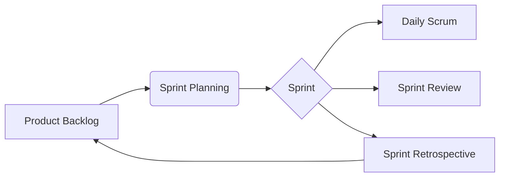
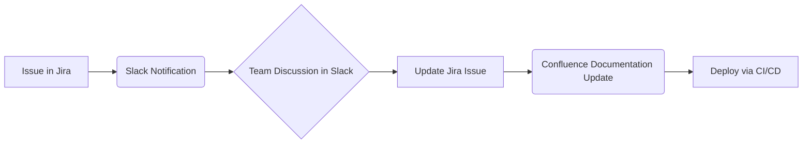
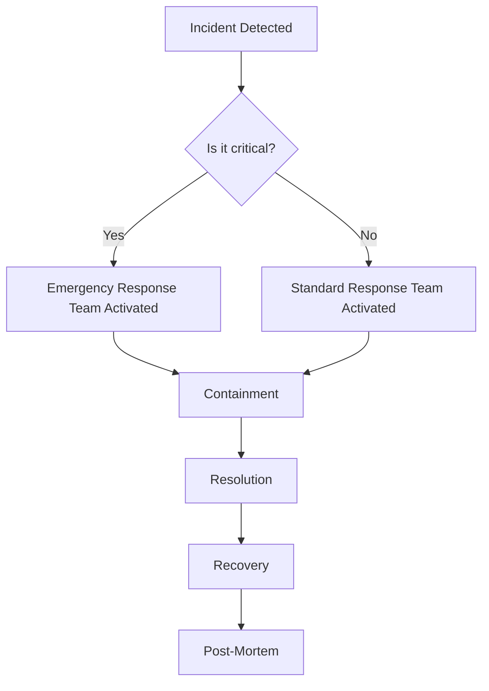
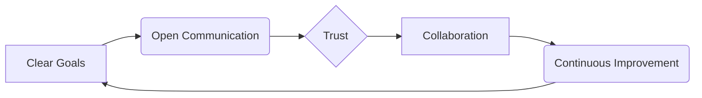

# What we will learn in this post?
<ul style='list-style-type: none; padding-left: 0;'>
<li>👉 Agile Methodology and Scrum Framework</li>
<li>👉 Bridging Development and Operations</li>
<li>👉 Collaboration Tools (Slack, Jira, Confluence)</li>
<li>👉 Incident and Change Management in Teams</li>
<li>👉 Team Dynamics and Communication</li>
<li>👉 Conclusion!</li>
</ul>

# Agile Methodology: Building Software Better 🚀

Agile is a way of building software that focuses on *flexibility* and *collaboration*.  Instead of planning everything upfront, Agile uses short cycles called *iterations* to deliver working software frequently.  This allows teams to adapt to changing requirements easily.  This iterative process directly supports *continuous delivery*, meaning software is consistently released in small, manageable chunks.

## Scrum: An Agile Framework 🛠️

Scrum is a popular Agile framework.  It uses specific roles, events, and artifacts to manage the development process:

### Roles ✨

*   **Product Owner:** Defines *what* to build, prioritizing features in the Product Backlog.
*   **Scrum Master:** Guides the team, removes impediments, and ensures Scrum is followed.
*   **Development Team:** Builds the software.

### Events 📅

*   **Sprint:** A short time-boxed iteration (usually 2-4 weeks) to build a set of features.
*   **Daily Standups:** Short daily meetings to discuss progress and identify roadblocks.
*   **Sprint Review:** A meeting at the end of the sprint to demonstrate the working software.

### Artifacts 📄

*   **Product Backlog:** A prioritized list of all features for the product.
*   **Sprint Backlog:**  The subset of the Product Backlog chosen for the current sprint.

## Scrum & DevOps: A Powerful Combination 💪

Scrum's iterative nature and emphasis on collaboration make it a great fit for DevOps teams.  The frequent releases fostered by Scrum align perfectly with DevOps's goal of continuous delivery and deployment. This allows teams to be more responsive to changing customer needs and market demands.  By delivering incremental value frequently, feedback loops are shortened, leading to quicker adaptation and higher quality software.

**For more info:**

* [Agile Manifesto](https://agilemanifesto.org/)
* [Scrum Guide](https://scrumguides.org/)

By embracing Agile principles and using frameworks like Scrum, development teams can build software faster, better, and more efficiently, adapting to change with ease.

# DevOps: Bridging the Dev & Ops Gap 🤝

In the world of software development, DevOps is all about bringing development (Dev) and operations (Ops) teams closer.  Why? Because when these teams work together smoothly, amazing things happen! 🚀

## Faster Delivery & Higher Quality ✨

Traditionally, Dev and Ops worked in silos.  This led to slow releases, frequent errors, and *lots* of frustration.  DevOps changes this by fostering collaboration.  

### How Collaboration Helps

* **Shared Goals:**  When both teams understand the overall project aims, they work more efficiently.  Everyone's on the same page! 📄
* **Automated Testing:** Automating tests ensures higher quality code *before* it even reaches Ops.  This prevents bugs and reduces headaches down the line. 🤖
* **CI/CD Pipelines:** Continuous Integration/Continuous Deployment (CI/CD) automates the process of building, testing, and deploying software. Think of it as a well-oiled machine! ⚙️

## Improved Communication & Culture 🗣️

Effective communication is *key*.  Regular meetings, shared tools, and open communication channels help prevent misunderstandings.

### Fostering a Collaborative Culture

* **Shared Responsibility:**  Dev and Ops share responsibility for the entire software lifecycle.  This fosters a sense of teamwork and ownership. 🫂
* **Open Communication:** Encourage open dialogue and feedback.  Regular check-ins and retrospectives help identify issues early on. 💬
* **Trust & Respect:**  Building trust and respect between teams is essential for successful collaboration.  Celebrate successes together! 🎉

**For more info:**

* [DevOps Institute](https://www.devopsinstitute.com/)
* [Atlassian DevOps](https://www.atlassian.com/devops)

By embracing these practices and fostering a collaborative culture, organizations can significantly improve their software delivery processes, resulting in faster releases, higher quality software, and happier teams! 😊

# Collaboration Tools in DevOps: Teamwork Makes the Dream Work! 🤝

DevOps thrives on collaboration.  Imagine a well-oiled machine, with everyone working together seamlessly.  That's where collaboration tools come in!  They're essential for effective communication, progress tracking, and knowledge sharing.

## The Power Trio: Slack, Jira, and Confluence

Let's look at three popular tools and how they fit into a DevOps workflow:

### Slack: Real-time Communication 🚀

Slack is like a digital water cooler—a place for quick chats, file sharing, and instant updates.  In DevOps, teams use Slack to:

*   **Report incidents:**  `@channel` urgent issues to ensure quick response times.
*   **Coordinate deployments:**  Announce deployments and share progress in dedicated channels.
*   **Ask quick questions:**  Get instant answers from colleagues without lengthy email chains.

### Jira: Issue & Project Tracking 🎯

Jira is your project manager. It helps track tasks, bugs, and features throughout the software development lifecycle.  In DevOps, Jira facilitates:

*   **Issue tracking:**  Log bugs, feature requests, and improvement ideas, assigning them to specific team members.
*   **Sprint management:**  Organize work into sprints, track progress towards goals, and visualize the workflow.
*   **Reporting:**  Gain insights into project health, identify bottlenecks, and improve efficiency.

### Confluence: Knowledge Sharing 📚

Confluence is your central knowledge base.  It allows teams to create and share documentation, guides, and best practices.  In DevOps, it's crucial for:

*   **Onboarding new team members:**  Provide centralized access to all essential information.
*   **Maintaining runbooks and documentation:**  Keep critical operational information up-to-date.
*   **Facilitating knowledge transfer:**  Capture and share the collective expertise within the team.

## Integrating for Enhanced DevOps

These tools work best together!  Imagine this flow:

By integrating them, you get:

*   **Improved Transparency:** Everyone can see the progress of projects and issues.
*   **Increased Accountability:**  Clear assignments and progress tracking keep everyone on track.
*   **Better Collaboration:**  Seamless communication and shared knowledge improve teamwork.

**Example:** A bug is reported in Jira, triggering a Slack notification. The team discusses the issue, updates the Jira ticket, and documents the solution in Confluence. This whole process improves collaboration and enhances transparency.

**Resources:**

*   [Slack](https://slack.com)
*   [Jira](https://www.atlassian.com/software/jira)
*   [Confluence](https://www.atlassian.com/software/confluence)

By leveraging these tools effectively, your DevOps team can achieve greater efficiency, improved communication, and overall project success.  Happy collaborating! 🎉

# DevOps: Keeping Things Running Smoothly ⚙️

In DevOps, smooth operations are key!  That's where *incident* and *change management* come in.  They're like the emergency responders and the careful planners of our digital world.

## Incident Management:  Quick Response to Problems 🚨

When things go wrong (like a website crash!), *incident management* steps in. Its goal? Get things back to normal *fast* and learn from the experience.

### How it works:
* **Quick Detection:**  Monitoring tools alert teams to problems.
* **Rapid Response:**  A dedicated team springs into action, following pre-defined procedures.
* **Containment:**  Stopping the bleeding – limiting the impact of the issue.
* **Resolution:**  Fixing the root problem.
* **Recovery:**  Getting systems back online.
* **Communication:** Keeping stakeholders informed.

Think of it as a well-oiled machine, reacting quickly and efficiently to unexpected issues.

## Change Management:  Planned Improvements 🛠️

*Change management* is all about making improvements *safely*. It's about planning, testing, and rolling out new features or updates without causing chaos.

### The Change Management Process:
* **Planning:**  Carefully outlining the changes, potential impacts, and rollback plan.
* **Testing:**  Thorough testing in various environments to catch bugs before they reach users.
* **Implementation:**  Rolling out the change in a controlled manner, often starting small.
* **Monitoring:**  Keeping a close eye on the system after the change to detect any unforeseen problems.

This ensures that new features and updates are deployed smoothly and securely.

## Best Practices ✨

* **Clear Communication:** Use tools like Slack or Microsoft Teams for rapid updates.
* **Root Cause Analysis (RCA):**  Don't just fix the problem; understand *why* it happened to prevent future occurrences.  [Learn more about RCA](https://www.itgovernance.co.uk/blog/root-cause-analysis)
* **Post-Mortem Reviews:**  After an incident, discuss what went well, what went wrong, and how to improve. This is *crucial* for learning and improvement.
* **Automation:** Automate repetitive tasks to speed up incident response and change deployment.

**Example Flowchart (Incident Management):**

By following these principles, DevOps teams can ensure systems are stable, reliable, and ever-improving.  A win-win! 🚀

# DevOps Teamwork: Making it Work 🤝

DevOps thrives on teamwork!  A smooth-running DevOps team isn't just about individual skills; it's about how everyone works *together*.  Effective communication, trust, and collaboration are key to success.

## Communication is King 👑

Clear and open communication is crucial.  Think regular stand-ups, shared documentation (like using a `wiki` or `Confluence`), and efficient tools like Slack or Microsoft Teams.  Everyone needs to be on the same page about goals and progress.  

### Challenges and Solutions

* **Problem:** Silos – Developers and Ops working separately.
* **Solution:** Cross-functional teams and shared responsibility.

* **Problem:**  Lack of transparency – unclear project status.
* **Solution:**  Regular updates and visual dashboards.

## Trust and Collaboration: The Foundation 💪

Trust enables faster decision-making and problem-solving.  When team members trust each other, they're more likely to:

* Share ideas openly.
* Provide constructive feedback.
* Support each other when things get tough.

## Overcoming Challenges 🚧

* **Conflicting Priorities:** Establish clear, shared goals using techniques like OKRs (Objectives and Key Results).
* **Personality Clashes:**  Promote a culture of respect and empathy.  Encourage conflict resolution training.
* **Technical Debt:** Address technical debt proactively; don't let it snowball.

## Continuous Improvement 🔄

Regular retrospectives are essential for identifying areas needing improvement.  Analyze what worked well and what didn't, and adapt your processes accordingly.  Embrace a growth mindset – always look for ways to refine your workflows and enhance collaboration.

**Further Reading:**

* [DevOps Handbook](https://itrevolution.com/the-devops-handbook/)
* [The Phoenix Project](https://itrevolution.com/the-phoenix-project/)

<h1>Conclusion</h1>

So there you have it!  We hope you found this insightful and helpful. 😊 We’re always looking to improve, so we’d love to hear your thoughts!  What did you think of this post?  Any suggestions for future topics?  Let us know in the comments below 👇 We can't wait to chat with you!  🥳

