# <span style="color:#e67e22;">What we will learn in this post?</span>

<ul style='list-style-type: none; padding-left: 0;'>
<li><span style='color: #2980b9; font-size: 20px; font-weight: bold;'>👉</span> <span style='color: #2ecc71; font-size: 18px; font-weight: bold;'>Building a Full CI/CD Pipeline for a Web Application</span></li>
<li><span style='color: #2980b9; font-size: 20px; font-weight: bold;'>👉</span> <span style='color: #2ecc71; font-size: 18px; font-weight: bold;'>Setting Up and Managing a Kubernetes Cluster</span></li>
<li><span style='color: #2980b9; font-size: 20px; font-weight: bold;'>👉</span> <span style='color: #2ecc71; font-size: 18px; font-weight: bold;'>Creating an Automated Monitoring and Alerting System</span></li>
<li><span style='color: #2980b9; font-size: 20px; font-weight: bold;'>👉</span> <span style='color: #2ecc71; font-size: 18px; font-weight: bold;'>Overview of Popular DevOps Certifications (AWS, CKA, Terraform, Docker)</span></li>
<li><span style='color: #2980b9; font-size: 20px; font-weight: bold;'>👉</span> <span style='color: #2ecc71; font-size: 18px; font-weight: bold;'>Certification Preparation and Resources</span></li>
<li><span style='color: #2980b9; font-size: 20px; font-weight: bold;'>👉</span> <span style='color: #2ecc71; font-size: 18px; font-weight: bold;'>Conclusion!</span></li>
</ul>

# <span style="color:#e67e22">Building Your CI/CD Pipeline ⚙️</span>

This guide walks you through creating a CI/CD pipeline for your web application. We'll use a simple example, but the principles apply broadly.

## <span style="color:#2980b9">Setting Up Your Environment ☁️</span>

We'll use GitLab CI for this example (but Jenkins or CircleCI work similarly). You'll need:

- A Git repository (GitHub, GitLab, Bitbucket).
- A GitLab account (or equivalent).
- A project with your web application code.

### <span style="color:#8e44ad">Version Control with Git</span>

Use Git to manage your code. Commit frequently! This is crucial for tracking changes and reverting if needed. [Learn more about Git](https://git-scm.com/doc).

## <span style="color:#2980b9">Automating the Process 🚀</span>

GitLab CI uses a `.gitlab-ci.yml` file to define the pipeline stages. Here's a basic example:

```yaml
stages:
  - build
  - test
  - deploy

build:
  stage: build
  script:
    - npm install
    - npm run build

test:
  stage: test
  script:
    - npm test

deploy_staging:
  stage: deploy
  script:
    - aws s3 sync ./build s3://my-staging-bucket

deploy_production:
  stage: deploy
  script:
    - aws s3 sync ./build s3://my-production-bucket
```

This configures three stages: _build_, _test_, and _deploy_. The `deploy` stage has two jobs, one for staging and one for production, using `aws s3 sync` (you'd adapt this to your deployment method).

## <span style="color:#2980b9">Ensuring Code Quality 🧪</span>

- **Unit Tests:** Write unit tests to ensure individual components work correctly. Use a testing framework (Jest, Mocha, pytest).
- **Linters:** Use linters (ESLint, Stylelint) to enforce coding standards and catch potential issues early.
- **Code Reviews:** Integrate code reviews into your workflow to catch bugs and improve code quality.

## <span style="color:#2980b9">Continuous Delivery and Deployment 🚢</span>

The pipeline automates the process:

1. **Commit:** Push code changes to your Git repository.
2. **Build:** GitLab CI automatically triggers the build job.
3. **Test:** Unit and integration tests are run.
4. **Deploy:** If tests pass, the application is deployed to staging. After manual approval, it's deployed to production.

```mermaid
graph TD
    A["💻 Commit Code"] --> B{"🛠️ Build"};
    B --> C{"🧪 Test"};
    C -- ✅ Pass --> D["🚀 Deploy to Staging"];
    D --> E{"✅ Approve?"};
    E -- ✔️ Yes --> F["🎯 Deploy to Production"];
    E -- ❌ No --> D;

    %% Custom Styles
    classDef commitStyle fill:#FFD700,stroke:#B8860B,color:#000000,font-size:14px,stroke-width:3px,rx:15px,shadow:5px;
    classDef buildStyle fill:#40E0D0,stroke:#008080,color:#000000,font-size:14px,stroke-width:3px,rx:15px,shadow:5px;
    classDef testStyle fill:#FF69B4,stroke:#C71585,color:#FFFFFF,font-size:14px,stroke-width:3px,rx:15px,shadow:5px;
    classDef deployStyle fill:#32CD32,stroke:#006400,color:#000000,font-size:14px,stroke-width:3px,rx:15px,shadow:5px;
    classDef approveStyle fill:#87CEFA,stroke:#00008B,color:#000000,font-size:14px,stroke-width:3px,rx:15px,shadow:5px;

    %% Apply Classes
    class A commitStyle;
    class B buildStyle;
    class C testStyle;
    class D deployStyle;
    class E approveStyle;
    class F deployStyle;

```



Remember to replace placeholders like `s3://my-staging-bucket` with your actual deployment targets. This is a simplified example; your pipeline may need more complex stages and configurations depending on your application's needs. Enjoy automating your workflow! 🎉

# <span style="color:#e67e22">Setting Up and Managing Your Kubernetes Cluster 🚀</span>

Kubernetes can seem daunting, but let's break it down! You can set up a cluster using various tools:

## <span style="color:#2980b9">Local Setup with Minikube or KIND 🏡</span>

For learning and testing, _Minikube_ and _KIND_ (Kubernetes IN Docker) are excellent choices. They create single-node clusters on your laptop.

### <span style="color:#8e44ad">Minikube Installation</span>

- Download and install Minikube from [https://minikube.sigs.k8s.io/docs/start/](https://minikube.sigs.k8s.io/docs/start/).
- Start the cluster: `minikube start`
- Check the status: `minikube status`

### <span style="color:#8e44ad">KIND Installation</span>

- Follow the instructions on the KIND GitHub repository: [https://github.com/kubernetes-sigs/kind](https://github.com/kubernetes-sigs/kind). It usually involves using Docker.
- Create a cluster: `kind create cluster`

## <span style="color:#2980b9">Cloud-Based Kubernetes: EKS/GKE ☁️</span>

For production, cloud providers offer managed Kubernetes services like AWS EKS and Google Kubernetes Engine (GKE). They handle much of the infrastructure management for you. Setting up involves creating a cluster through their respective consoles or CLIs.

## <span style="color:#2980b9">Ongoing Management 🛠️</span>

Managing a Kubernetes cluster is an ongoing process:

- **Scaling:** Easily add or remove nodes to handle fluctuating workloads. Use Horizontal Pod Autoscalers (`hpa`) to automatically adjust the number of pods based on resource utilization.
- **Monitoring:** Tools like Prometheus and Grafana provide crucial insights into cluster health and application performance.
- **High Availability:** Ensure your control plane and worker nodes are highly available to prevent single points of failure. Use multiple availability zones and robust networking.

## <span style="color:#2980b9">Automation with Tools ✨</span>

Tools like:

- **Helm:** Package manager for Kubernetes applications. Simplify deployment and management.
- **kubectl:** The Kubernetes command-line tool, essential for interacting with your cluster.
- **CI/CD pipelines (e.g., Jenkins, GitLab CI):** Automate building, testing, and deploying applications to your cluster.

```mermaid
graph TD
    A["📱 Develop App"] --> B{"🧪 Test Locally"};
    B -- ✅ Pass --> C["🐳 Build Docker Image"];
    C --> D["📦 Push to Registry"];
    D --> E["☸️ Deploy to Kubernetes using Helm"];
    E --> F["📊 Monitor with Prometheus & Grafana"];

    %% Custom Styles
    classDef developStyle fill:#FFD700,stroke:#B8860B,color:#000000,font-size:14px,stroke-width:3px,rx:15px,shadow:5px;
    classDef testStyle fill:#40E0D0,stroke:#008080,color:#000000,font-size:14px,stroke-width:3px,rx:15px,shadow:5px;
    classDef buildStyle fill:#FF69B4,stroke:#C71585,color:#FFFFFF,font-size:14px,stroke-width:3px,rx:15px,shadow:5px;
    classDef pushStyle fill:#32CD32,stroke:#006400,color:#000000,font-size:14px,stroke-width:3px,rx:15px,shadow:5px;
    classDef deployStyle fill:#87CEFA,stroke:#00008B,color:#000000,font-size:14px,stroke-width:3px,rx:15px,shadow:5px;
    classDef monitorStyle fill:#40E0D0,stroke:#008080,color:#000000,font-size:14px,stroke-width:3px,rx:15px,shadow:5px;

    %% Apply Classes
    class A developStyle;
    class B testStyle;
    class C buildStyle;
    class D pushStyle;
    class E deployStyle;
    class F monitorStyle;

```



Remember, mastering Kubernetes takes time and practice! Start small, explore the available tools, and gradually increase the complexity of your deployments. Happy Kubernetes-ing! 🎉

# <span style="color:#e67e22">Automating DevOps Monitoring & Alerting 🤖</span>

Building a robust monitoring and alerting system is crucial for a smooth-running DevOps pipeline. It allows you to proactively identify and address issues _before_ they affect your users. Real-time monitoring of application performance, infrastructure health, and user experience is key!

## <span style="color:#2980b9">Why Real-time Monitoring Matters 🤔</span>

- **Application Performance:** Track response times, error rates, and resource usage (CPU, memory) to catch slowdowns or crashes.
- **Infrastructure Health:** Monitor server uptime, disk space, network connectivity—prevent outages before they happen.
- **User Experience:** Observe metrics like website load times and error rates to understand the user's perspective. Happy users = happy business!

## <span style="color:#2980b9">Introducing Your Dream Team ✨</span>

We'll use a powerful trio of tools:

- **Prometheus:** Collects metrics from your applications and infrastructure. Think of it as your data collector. [Prometheus Docs](https://prometheus.io/docs/introduction/overview/)
- **Grafana:** Visualizes the metrics collected by Prometheus. Create beautiful dashboards to easily understand your system's health. [Grafana Docs](https://grafana.com/docs/)
- **Alertmanager:** Receives alerts from Prometheus and notifies you (via email, Slack, etc.) when something goes wrong. Your early warning system! [Alertmanager Docs](https://prometheus.io/docs/alerting/latest/alertmanager/)

### <span style="color:#8e44ad">Example: Detecting High CPU Usage</span>

Let's say we want an alert if a server's CPU usage exceeds 80%.

1. **Prometheus:** Configure a rule to scrape CPU usage metrics.
2. **Alertmanager:** Set up an alert that triggers when the CPU usage exceeds `80%` for more than 5 minutes.
3. **Notification:** Alertmanager sends an email or Slack message to the DevOps team.

```mermaid
graph LR
    A["📊 Prometheus"] --> B("🖥️ CPU Metrics");
    B --> C["🚨 Alertmanager"];
    C --> D{"📧 Email/Slack"};

    %% Custom Styles
    classDef prometheusStyle fill:#FFD700,stroke:#B8860B,color:#000000,font-size:14px,stroke-width:3px,rx:15px,shadow:5px;
    classDef cpuMetricsStyle fill:#40E0D0,stroke:#008080,color:#000000,font-size:14px,stroke-width:3px,rx:15px,shadow:5px;
    classDef alertmanagerStyle fill:#FF69B4,stroke:#C71585,color:#FFFFFF,font-size:14px,stroke-width:3px,rx:15px,shadow:5px;
    classDef emailSlackStyle fill:#32CD32,stroke:#006400,color:#000000,font-size:14px,stroke-width:3px,rx:15px,shadow:5px;

    %% Apply Classes
    class A prometheusStyle;
    class B cpuMetricsStyle;
    class C alertmanagerStyle;
    class D emailSlackStyle;

```



## <span style="color:#2980b9">Putting it all Together ⚙️</span>

- **Instrumentation:** Add monitoring code to your applications to expose relevant metrics.
- **Configuration:** Configure Prometheus to scrape your metrics, Alertmanager to define rules and send alerts, and Grafana to build informative dashboards.
- **Testing:** Test your alerting system regularly to ensure it works as expected.

By implementing a robust automated monitoring and alerting system, you gain valuable insights into your DevOps pipeline's health, improving reliability and user satisfaction. Remember, _prevention is better than cure_!

# <span style="color:#e67e22">Popular DevOps Certifications: Boost Your Career 🚀</span>

DevOps certifications demonstrate your expertise and can significantly boost your career. Here's a look at some popular ones:

## <span style="color:#2980b9">AWS Certified DevOps Engineer ☁️</span>

### <span style="color:#8e44ad">Focus Areas:</span>

- Managing AWS services for deployment and operations.
- Automating tasks using tools like CloudFormation and AWS CLI.
- Implementing monitoring and logging.

### <span style="color:#8e44ad">Skills Tested:</span>

- Proficiency in AWS services (EC2, S3, RDS, etc.).
- Automation scripting (e.g., Python, Bash).
- Understanding of DevOps principles and best practices.

## <span style="color:#2980b9">Certified Kubernetes Administrator (CKA) ☸️</span>

### <span style="color:#8e44ad">Focus Areas:</span>

- Kubernetes cluster management.
- Deploying and managing applications on Kubernetes.
- Troubleshooting and monitoring Kubernetes.

### <span style="color:#8e44ad">Skills Tested:</span>

- Deep understanding of Kubernetes concepts (pods, deployments, services).
- Hands-on experience with `kubectl`.
- Strong troubleshooting skills.

## <span style="color:#2980b9">Terraform Associate 🌎</span>

### <span style="color:#8e44ad">Focus Areas:</span>

- Infrastructure as Code (IaC) using Terraform.
- Managing infrastructure across multiple cloud providers.
- Version control for infrastructure.

### <span style="color:#8e44ad">Skills Tested:</span>

- Terraform configuration language (`*.tf` files).
- State management.
- Working with providers (AWS, Azure, GCP).

## <span style="color:#2980b9">Docker Certified Associate 🐳</span>

### <span style="color:#8e44ad">Focus Areas:</span>

- Building and running Docker containers.
- Managing Docker images and registries.
- Orchestration with Docker Swarm (basic understanding).

### <span style="color:#8e44ad">Skills Tested:</span>

- Docker commands and concepts.
- Image building and optimization.
- Container networking and security.

**Benefits of Certification:**

- _Increased earning potential_
- _Improved job prospects_
- _Validation of skills_
- _Enhanced credibility_

These certifications demonstrate your _practical skills_ and knowledge in crucial DevOps tools and practices, making you a highly desirable candidate in the job market. For more information, you can explore the official websites of each certification provider.

# <span style="color:#e67e22">Ace Your DevOps Certification! 🚀</span>

DevOps certifications can significantly boost your career. But how do you prepare effectively? Let's break it down!

## <span style="color:#2980b9">Study Strategies & Resources 📚</span>

### <span style="color:#8e44ad">Structured Learning</span>

- **Online Courses:** Platforms like Udemy, Coursera, A Cloud Guru offer excellent DevOps courses covering various tools (e.g., Docker, Kubernetes, AWS, Azure). Look for courses aligned with your chosen certification.
- **Study Guides:** Official certification guides provide a structured learning path. Supplement with unofficial guides for different perspectives. _(Example: Search for "[Certification Name] Study Guide" on Amazon)_
- **Practice Exams:** Regular practice exams are crucial. They simulate the real exam environment and pinpoint weak areas. _(Websites like Whizlabs and MeasureUp offer practice tests)_

### <span style="color:#8e44ad">Hands-on Practice is Key! 💪</span>

Theory alone won't cut it. You _must_ get hands-on with tools like:

- `docker`, `kubectl`, `terraform`, `ansible`, `jenkins`
- Cloud platforms: AWS, Azure, GCP.

Set up a home lab (even a small virtual one) to experiment and build real-world projects. This experience is invaluable.

## <span style="color:#2980b9">Organizing Your Study Schedule 📅</span>

- **Create a Realistic Schedule:** Break down the material into manageable chunks. Don't try to cram everything at once!
- **Track Your Progress:** Use a spreadsheet or app to monitor your learning, marking completed sections and scheduling practice exams.
- **Consistent Effort:** Short, regular study sessions are more effective than marathon cram sessions.

## <span style="color:#2980b9">Community & Support 🤝</span>

Joining study groups or online forums (like Reddit's r/devops) provides:

- Peer Support: Discuss challenging topics, share resources, and stay motivated.
- Diverse Perspectives: Learn from others' experiences and gain new insights.
- Additional Resources: Discover hidden gems and helpful tools.

```mermaid
graph TD
    A["🚀 Start"] --> B{"🎓 Choose Certification"};
    B --> C["📚 Find Resources"];
    C --> D{"📝 Create Study Plan"};
    D --> E["💡 Study"];
    E --> F{"📝 Practice Exams"};
    F --> G{"🔍 Review Weak Areas"};
    G --> H{"🌐 Join Community"};
    H --> I["🔁 Repeat E-G until ready"];
    I --> J["📝 Take Exam"];
    J --> K{"✅ Pass?"};
    K -- ✔️ Yes --> L["🎉 Celebrate!"];
    K -- ❌ No --> E;

    %% Custom Styles
    classDef startStyle fill:#FFD700,stroke:#B8860B,color:#000000,font-size:14px,stroke-width:3px,rx:15px,shadow:5px;
    classDef chooseStyle fill:#40E0D0,stroke:#008080,color:#000000,font-size:14px,stroke-width:3px,rx:15px,shadow:5px;
    classDef findResourcesStyle fill:#FF69B4,stroke:#C71585,color:#FFFFFF,font-size:14px,stroke-width:3px,rx:15px,shadow:5px;
    classDef createPlanStyle fill:#32CD32,stroke:#006400,color:#000000,font-size:14px,stroke-width:3px,rx:15px,shadow:5px;
    classDef studyStyle fill:#87CEFA,stroke:#00008B,color:#000000,font-size:14px,stroke-width:3px,rx:15px,shadow:5px;
    classDef practiceStyle fill:#40E0D0,stroke:#008080,color:#000000,font-size:14px,stroke-width:3px,rx:15px,shadow:5px;
    classDef reviewStyle fill:#FF69B4,stroke:#C71585,color:#FFFFFF,font-size:14px,stroke-width:3px,rx:15px,shadow:5px;
    classDef communityStyle fill:#32CD32,stroke:#006400,color:#000000,font-size:14px,stroke-width:3px,rx:15px,shadow:5px;
    classDef repeatStyle fill:#FFD700,stroke:#B8860B,color:#000000,font-size:14px,stroke-width:3px,rx:15px,shadow:5px;
    classDef examStyle fill:#40E0D0,stroke:#008080,color:#000000,font-size:14px,stroke-width:3px,rx:15px,shadow:5px;
    classDef passStyle fill:#FF69B4,stroke:#C71585,color:#FFFFFF,font-size:14px,stroke-width:3px,rx:15px,shadow:5px;
    classDef celebrateStyle fill:#32CD32,stroke:#006400,color:#000000,font-size:14px,stroke-width:3px,rx:15px,shadow:5px;

    %% Apply Classes
    class A startStyle;
    class B chooseStyle;
    class C findResourcesStyle;
    class D createPlanStyle;
    class E studyStyle;
    class F practiceStyle;
    class G reviewStyle;
    class H communityStyle;
    class I repeatStyle;
    class J examStyle;
    class K passStyle;
    class L celebrateStyle;

```

## <span style="color:#2980b9">Study Progress Tracking Flowchart 📈</span>



Remember, consistency and hands-on practice are your best friends! Good luck! 👍

<h1><span style='color:#e67e22'>Conclusion</span></h1>

So there you have it! We've covered a lot of ground today, and hopefully, you found this helpful and informative. 😊 But the conversation doesn't end here! We'd love to hear your thoughts, feedback, and any brilliant suggestions you might have. What did you think of [mention a key point or topic]? What other topics would you like us to explore? Let us know in the comments section below! 👇 We can't wait to hear from you! 🎉
