# <span style="color:#e67e22;">What we will learn in this post?</span>

<ul style='list-style-type: none; padding-left: 0;'>
<li><span style='color: #2980b9; font-size: 20px; font-weight: bold;'>👉</span> <span style='color: #2ecc71; font-size: 18px; font-weight: bold;'>Top 5 DevOps Interview Questions and Answers</span></li>
<li><span style='color: #2980b9; font-size: 20px; font-weight: bold;'>👉</span> <span style='color: #2ecc71; font-size: 18px; font-weight: bold;'>Simple DevOps Assignment: Setting Up a Basic CI Pipeline</span></li>
<li><span style='color: #2980b9; font-size: 20px; font-weight: bold;'>👉</span> <span style='color: #2ecc71; font-size: 18px; font-weight: bold;'>Intermediate DevOps Assignment: Implementing a Deployment Pipeline</span></li>
<li><span style='color: #2980b9; font-size: 20px; font-weight: bold;'>👉</span> <span style='color: #2ecc71; font-size: 18px; font-weight: bold;'>Advanced DevOps Assignment: Infrastructure as Code with Terraform</span></li>
<li><span style='color: #2980b9; font-size: 20px; font-weight: bold;'>👉</span> <span style='color: #2ecc71; font-size: 18px; font-weight: bold;'>DevOps Project Idea: Building a Full CI/CD Pipeline for a Web Application</span></li>
<li><span style='color: #2980b9; font-size: 20px; font-weight: bold;'>👉</span> <span style='color: #2ecc71; font-size: 18px; font-weight: bold;'>Project Idea: Kubernetes-based Microservices Architecture</span></li>
<li><span style='color: #2980b9; font-size: 20px; font-weight: bold;'>👉</span> <span style='color: #2ecc71; font-size: 18px; font-weight: bold;'>Project Idea: Setting Up Monitoring and Logging with Prometheus and ELK Stack</span></li>
<li><span style='color: #2980b9; font-size: 20px; font-weight: bold;'>👉</span> <span style='color: #2ecc71; font-size: 18px; font-weight: bold;'>DevOps Interview Question: How Do You Handle Rollback in a CI/CD Pipeline?</span></li>
<li><span style='color: #2980b9; font-size: 20px; font-weight: bold;'>👉</span> <span style='color: #2ecc71; font-size: 18px; font-weight: bold;'>DevOps Interview Question: What Is the Difference Between Docker and Kubernetes?</span></li>
<li><span style='color: #2980b9; font-size: 20px; font-weight: bold;'>👉</span> <span style='color: #2ecc71; font-size: 18px; font-weight: bold;'>Conclusion!</span></li>
</ul>

# <span style="color:#e67e22">5 DevOps Interview Questions & Answers</span>

This guide prepares you for common DevOps interview questions. Remember to tailor your answers to your experience!

## <span style="color:#2980b9">1. What is the role of a DevOps engineer? 🤔</span>

A DevOps engineer bridges the gap between development and operations teams. They automate processes, improve collaboration, and ensure fast and reliable software delivery. This involves using tools for CI/CD, infrastructure as code (IaC), monitoring, and security. Essentially, they help build and deploy better software, faster.

## <span style="color:#2980b9">2. Explain CI/CD ⚙️</span>

_Continuous Integration (CI)_ is automating the process of building, testing, and merging code changes. This catches integration issues early. _Continuous Deployment (CD)_ automates the release of software to production. Together, CI/CD accelerates development cycles and reduces manual errors. Think of it like an assembly line for software!

```mermaid
graph LR
    A["💻 Developer Commits Code"] --> B{"🛠️ Build & Test"};
    B -- "✅ Success" --> C["🚀 Deploy to Staging"];
    C -- "✅ Success" --> D["🎯 Deploy to Production"];
    B -- "❌ Failure" --> E["📢 Notify Team"];

    %% Custom Styles
    classDef commitStyle fill:#FFD700,stroke:#B8860B,color:#000000,font-size:14px,stroke-width:3px,rx:15px,shadow:5px;
    classDef buildStyle fill:#FF69B4,stroke:#C71585,color:#FFFFFF,font-size:14px,stroke-width:3px,rx:15px,shadow:5px;
    classDef deployStyle fill:#40E0D0,stroke:#008080,color:#000000,font-size:14px,stroke-width:3px,rx:15px,shadow:5px;
    classDef notifyStyle fill:#8B0000,stroke:#FFDAB9,color:#FFFFFF,font-size:14px,stroke-width:3px,rx:15px,shadow:5px;

    %% Apply Classes
    class A commitStyle;
    class B buildStyle;
    class C deployStyle;
    class D deployStyle;
    class E notifyStyle;

```



[Learn More about CI/CD](https://www.atlassian.com/continuous-delivery)

## <span style="color:#2980b9">3. Handling Rollbacks in CI/CD ⏪</span>

Rollback strategies are crucial. Before deploying, ensure proper version control (e.g., Git) and automated testing. For rollbacks, use features like:

- **Blue/Green deployments:** Deploy to a separate environment (blue), switch traffic once verified, then revert to the previous (green).
- **Canary releases:** Gradually roll out to a subset of users, monitoring for issues before full deployment.
- **Automated rollback scripts:** Pre-written scripts triggered by monitoring alerts.

Always have a plan B!

## <span style="color:#2980b9">4. Docker vs. Kubernetes 🐳 vs. ☸️</span>

- **Docker:** Packages applications and their dependencies into containers, ensuring consistency across environments. Think of it as a standardized shipping container for your software.

- **Kubernetes:** Orchestrates and manages containers at scale. It automates deployment, scaling, and management of containerized applications across multiple hosts. It's like a sophisticated port authority managing all the Docker containers.

## <span style="color:#2980b9">5. Ensuring DevOps Pipeline Security 🔒</span>

Security is paramount. Implement these measures:

- **Secure coding practices:** Follow best practices to prevent vulnerabilities.
- **Image scanning:** Regularly scan container images for vulnerabilities.
- **Secrets management:** Use tools to securely store and manage sensitive information (passwords, API keys).
- **Access control:** Implement strict access controls to limit who can interact with the pipeline.
- **Regular security audits:** Conduct periodic security assessments.

**Interview Tips:**

- **Be honest:** Don't pretend to know something you don't.
- **Show enthusiasm:** DevOps is a dynamic field, show your passion!
- **Relate answers to your experience:** Use examples from past projects to illustrate your points.
- **Ask questions:** It shows engagement and interest.

Good luck with your interview! 😊

# <span style="color:#e67e22">Building Your First CI Pipeline 🎉</span>

This assignment guides you through setting up a basic Continuous Integration (CI) pipeline using either Jenkins or GitLab CI. The goal is to automate code compilation, testing, and artifact generation. Let's get started!

## <span style="color:#2980b9">Choosing Your CI Tool ⚙️</span>

This assignment supports both Jenkins and GitLab CI. Choose the one you prefer or have access to.

- **Jenkins:** [Jenkins Documentation](https://www.jenkins.io/doc/)
- **GitLab CI:** [GitLab CI Documentation](https://docs.gitlab.com/ee/ci/)

## <span style="color:#2980b9">Setting up the Environment 💻</span>

1. **Install your chosen CI tool:** Follow the installation instructions for Jenkins or GitLab CI based on your operating system.
2. **Create a Git repository:** Host your project code on GitHub, GitLab, or Bitbucket.
3. **Create a simple Java project:** A `HelloWorld` program will suffice. Include a simple unit test.

### <span style="color:#8e44ad">Example Java Project (HelloWorld.java)</span>

```java
public class HelloWorld {
    public static void main(String[] args) {
        System.out.println("Hello, CI!");
    }
}
```

## <span style="color:#2980b9">Configuring the CI Pipeline 🛠️</span>

### <span style="color:#8e44ad">Jenkins (Jenkinsfile)</span>

Create a `Jenkinsfile` in your project's root directory:

```groovy
pipeline {
    agent any
    stages {
        stage('Build') {
            steps {
                sh 'mvn compile'
            }
        }
        stage('Test') {
            steps {
                sh 'mvn test'
            }
        }
        stage('Deploy') {
            steps {
                sh 'mvn package' // Generates a .jar file
            }
        }
    }
}
```

### <span style="color:#8e44ad">GitLab CI (.gitlab-ci.yml)</span>

Create a `.gitlab-ci.yml` file in your project's root directory:

```yaml
stages:
  - build
  - test
  - deploy

build:
  stage: build
  script:
    - mvn compile

test:
  stage: test
  script:
    - mvn test

deploy:
  stage: deploy
  script:
    - mvn package
  artifacts:
    paths:
      - target/*.jar
```

## <span style="color:#2980b9">Testing Your Pipeline 🚀</span>

1. Commit your code and push it to your Git repository.
2. Your CI pipeline should automatically trigger.
3. Monitor the pipeline's execution and check the build artifacts.

```mermaid
graph TD
    A["📤 Push Code"] --> B{"🛠️ Build"};
    B --> C["🧪 Test"];
    C --> D{"✅ Success?"};
    D -- "👍 Yes" --> E["📦 Package Artifact"];
    D -- "👎 No" --> F["❌ Fail"];
    E --> G["🏁 Pipeline Complete"];

    %% Custom Styles
    classDef pushStyle fill:#FFD700,stroke:#B8860B,color:#000000,font-size:14px,stroke-width:3px,rx:15px,shadow:5px;
    classDef buildStyle fill:#FF69B4,stroke:#C71585,color:#FFFFFF,font-size:14px,stroke-width:3px,rx:15px,shadow:5px;
    classDef testStyle fill:#40E0D0,stroke:#008080,color:#000000,font-size:14px,stroke-width:3px,rx:15px,shadow:5px;
    classDef decisionStyle fill:#FF6347,stroke:#B22222,color:#FFFFFF,font-size:14px,stroke-width:3px,rx:15px,shadow:5px;
    classDef packageStyle fill:#32CD32,stroke:#006400,color:#000000,font-size:14px,stroke-width:3px,rx:15px,shadow:5px;
    classDef failStyle fill:#8B0000,stroke:#FFDAB9,color:#FFFFFF,font-size:14px,stroke-width:3px,rx:15px,shadow:5px;
    classDef completeStyle fill:#87CEFA,stroke:#00008B,color:#000000,font-size:14px,stroke-width:3px,rx:15px,shadow:5px;

    %% Apply Classes
    class A pushStyle;
    class B buildStyle;
    class C testStyle;
    class D decisionStyle;
    class E packageStyle;
    class F failStyle;
    class G completeStyle;

```

## <span style="color:#2980b9">Flowchart of the CI Pipeline</span>



This assignment provides a basic foundation. Explore more advanced features like code analysis, deployment to servers, and integration with other tools. Remember to consult the documentation for your chosen CI tool for further details and options. Good luck! 👍

# <span style="color:#e67e22">Continuous Delivery Pipeline Assignment 🎉</span>

This assignment challenges you to build a Continuous Delivery (CD) pipeline for a simple Node.js web application, deploying it to AWS using GitLab CI/CD. Let's get started!

## <span style="color:#2980b9">Project Setup ⚙️</span>

1. **Create a Node.js App:** Build a basic web app (e.g., using Express.js). Include simple tests (e.g., using Jest).
2. **AWS Account:** Ensure you have an active AWS account with appropriate permissions. You'll need an EC2 instance or an S3 bucket for deployment.
3. **GitLab Repository:** Create a new GitLab repository and push your Node.js application code.

## <span style="color:#2980b9">Pipeline Implementation 🚀</span>

Your GitLab CI/CD pipeline should automate these stages:

### <span style="color:#8e44ad">Stage 1: Build 🧱</span>

- Install dependencies (`npm install`).
- Build the application (`npm run build`).

### <span style="color:#8e44ad">Stage 2: Test 🧪</span>

- Run your tests (`npm test`). The pipeline should fail if tests don't pass.

### <span style="color:#8e44ad">Stage 3: Package 📦</span>

- Create a distributable package (e.g., a zip archive) of your built application.

### <span style="color:#8e44ad">Stage 4: Deploy to Staging ➡️</span>

- Deploy your package to an AWS EC2 instance or S3 bucket (choose one). For EC2, you will need to configure SSH access and use a deployment script. For S3, use the AWS CLI to upload the package.

**Example `.gitlab-ci.yml` snippet (using EC2):**

```yaml
stages:
  - build
  - test
  - deploy

build:
  stage: build
  script:
    - npm install
    - npm run build

test:
  stage: test
  script:
    - npm test

deploy:
  stage: deploy
  script:
    - ssh user@ec2-instance "mkdir -p /var/www/myapp && scp ./build/* user@ec2-instance:/var/www/myapp"
```

**Remember to replace placeholders like `user@ec2-instance` with your actual credentials!**

```mermaid
graph LR
    A["📤 Push to GitLab"] --> B{"🛠️ Build"};
    B --> C{"🧪 Test"};
    C -- "✅ Pass" --> D["📦 Package"];
    C -- "❌ Fail" --> E["🛑 Stop"];
    D --> F["🚀 Deploy to Staging"];

    %% Custom Styles
    classDef pushStyle fill:#FFD700,stroke:#B8860B,color:#000000,font-size:14px,stroke-width:3px,rx:15px,shadow:5px;
    classDef buildStyle fill:#FF69B4,stroke:#C71585,color:#FFFFFF,font-size:14px,stroke-width:3px,rx:15px,shadow:5px;
    classDef testStyle fill:#40E0D0,stroke:#008080,color:#000000,font-size:14px,stroke-width:3px,rx:15px,shadow:5px;
    classDef decisionStyle fill:#FF6347,stroke:#B22222,color:#FFFFFF,font-size:14px,stroke-width:3px,rx:15px,shadow:5px;
    classDef packageStyle fill:#32CD32,stroke:#006400,color:#000000,font-size:14px,stroke-width:3px,rx:15px,shadow:5px;
    classDef failStyle fill:#8B0000,stroke:#FFDAB9,color:#FFFFFF,font-size:14px,stroke-width:3px,rx:15px,shadow:5px;
    classDef deployStyle fill:#87CEFA,stroke:#00008B,color:#000000,font-size:14px,stroke-width:3px,rx:15px,shadow:5px;

    %% Apply Classes
    class A pushStyle;
    class B buildStyle;
    class C testStyle;
    class D packageStyle;
    class E failStyle;
    class F deployStyle;

```

## <span style="color:#2980b9">Diagram 🗺️</span>



## <span style="color:#2980b9">Resources & Further Reading 📚</span>

- [GitLab CI/CD Documentation](https://docs.gitlab.com/ee/ci/)
- [AWS EC2 Documentation](https://aws.amazon.com/ec2/)
- [AWS S3 Documentation](https://aws.amazon.com/s3/)
- [Node.js & Express.js](https://expressjs.com/)

This assignment encourages you to explore various aspects of CD pipelines and learn how to integrate them with cloud services. Good luck and have fun! 👍

# <span style="color:#e67e22">AWS Infrastructure as Code with Terraform: Advanced Assignment</span> ☁️

This assignment challenges you to build a simple AWS infrastructure using Terraform. You'll create an EC2 instance, an S3 bucket, and a security group, learning key IaC principles along the way.

## <span style="color:#2980b9">Setting up your Environment</span> 🛠️

- **Install Terraform:** Download and install Terraform from [https://www.terraform.io/downloads.html](https://www.terraform.io/downloads.html).
- **Configure AWS Credentials:** Ensure your AWS credentials are configured. You can use the AWS CLI or environment variables. Learn more at [https://docs.aws.amazon.com/cli/latest/userguide/cli-configure-files.html](https://docs.aws.amazon.com/cli/latest/userguide/cli-configure-files.html).

## <span style="color:#2980b9">Terraform Configuration (main.tf)</span> 💻

Create a file named `main.tf` with the following configuration. Remember to replace placeholders like `your-bucket-name` with your desired values.

```terraform
terraform {
  required_providers {
    aws = {
      source  = "hashicorp/aws"
      version = "~> 4.0"
    }
  }
}

provider "aws" {
  region = "us-west-2" #Change to your desired region
}

resource "aws_s3_bucket" "example" {
  bucket = "your-bucket-name"
}

resource "aws_security_group" "allow_ssh" {
  name        = "allow_ssh"
  description = "Allow SSH inbound traffic"

  ingress {
    from_port   = 22
    to_port     = 22
    protocol    = "tcp"
    cidr_blocks = ["0.0.0.0/0"] #Restrict this in a production environment!
  }

  egress {
    from_port   = 0
    to_port     = 0
    protocol    = "-1"
    cidr_blocks = ["0.0.0.0/0"]
  }
}

resource "aws_instance" "example" {
  ami           = "ami-0c55b31ad2299a701" # Replace with a suitable AMI for your region
  instance_type = "t2.micro"

  tags = {
    Name = "ExampleEC2Instance"
  }

  security_groups = [aws_security_group.allow_ssh.id]
}
```

### <span style="color:#8e44ad">Explanation:</span>

This code defines an S3 bucket, a security group allowing SSH access, and an EC2 instance using that security group. Remember to replace placeholder values with your own!

## <span style="color:#2980b9">Provisioning and Managing Infrastructure</span> ✨

1. **Initialize:** `terraform init`
2. **Plan:** `terraform plan` (Review the changes before applying)
3. **Apply:** `terraform apply` (This creates your resources)
4. **Destroy:** `terraform destroy` (Use this carefully to remove your resources when finished)

```mermaid
graph LR
    A["📜 Terraform Code"] --> B["☁️ AWS Provider"];
    B --> C["🗄️ S3 Bucket"];
    B --> D["🔐 Security Group"];
    B --> E["🖥️ EC2 Instance"];

    %% Custom Styles
    classDef terraformStyle fill:#8A2BE2,stroke:#4B0082,color:#FFFFFF,font-size:14px,stroke-width:3px,rx:15px,shadow:5px;
    classDef providerStyle fill:#FFA500,stroke:#FF8C00,color:#000000,font-size:14px,stroke-width:3px,rx:15px,shadow:5px;
    classDef storageStyle fill:#00CED1,stroke:#008B8B,color:#000000,font-size:14px,stroke-width:3px,rx:15px,shadow:5px;
    classDef securityStyle fill:#DC143C,stroke:#8B0000,color:#FFFFFF,font-size:14px,stroke-width:3px,rx:15px,shadow:5px;
    classDef computeStyle fill:#32CD32,stroke:#006400,color:#000000,font-size:14px,stroke-width:3px,rx:15px,shadow:5px;

    %% Apply Classes
    class A terraformStyle;
    class B providerStyle;
    class C storageStyle;
    class D securityStyle;
    class E computeStyle;

```

## <span style="color:#2980b9">Diagram</span> 📊



This assignment encourages you to explore Terraform's capabilities and AWS services. Remember to always follow best practices for security and cost optimization! Good luck! 👍

# <span style="color:#e67e22">Build Your Own CI/CD Pipeline ⚙️</span>

This project guides you through creating a complete CI/CD pipeline for a simple web application. You'll learn valuable DevOps skills and gain hands-on experience with popular tools!

## <span style="color:#2980b9">The Web Application 🌐</span>

We'll build a basic web app with:

- **Front-end:** HTML, CSS, and JavaScript. Think a simple to-do list or a basic weather app.
- **Back-end:** Node.js with Express.js _or_ Python with Flask. This will handle data storage (maybe using a simple in-memory database for simplicity).

## <span style="color:#2980b9">The CI/CD Pipeline ➡️</span>

The pipeline will automate these steps:

### <span style="color:#8e44ad">1. Code Versioning with Git 🗂️</span>

- Use Git for version control. [Learn Git](https://git-scm.com/doc)
- Push your code to a GitLab repository.

### <span style="color:#8e44ad">2. Automated Builds 📦</span>

- Use GitLab CI/CD to automatically build your front-end and back-end code upon every push.
- You'll learn to define `.gitlab-ci.yml` for build automation.

### <span style="color:#8e44ad">3. Unit Testing 🧪</span>

- Write unit tests for both the front-end (using Jest or similar) and back-end (using Jest or pytest).
- Integrate test execution into your GitLab CI/CD pipeline.

### <span style="color:#8e44ad">4. Security Scanning 🛡️</span>

- Incorporate security scanning tools (like Snyk or SonarQube) into your pipeline to identify vulnerabilities.
- Learn about integrating these tools with GitLab CI/CD.

### <span style="color:#8e44ad">5. Containerization with Docker 🐳</span>

- Create Dockerfiles for your front-end and back-end to package them into Docker containers.
- Push your Docker images to a registry like Docker Hub or a private registry.

### <span style="color:#8e44ad">6. Deployment to AWS ☁️</span>

- Deploy your Docker containers to AWS (e.g., using ECS, EKS, or even a simple EC2 instance). Learn about AWS basics!
- Automate deployment using GitLab CI/CD.

### <span style="color:#8e44ad">7. Monitoring with Prometheus 📊</span>

- Set up Prometheus to monitor your application's performance and health.
- Learn about Prometheus's query language and dashboards.

```mermaid
graph TD
    A["📤 Push Code to GitLab"] --> B{"🛠️ Build"};
    B --> C["🧪 Unit Tests"];
    C --> D["🔍 Security Scan"];
    D --> E["🐳 Docker Build"];
    E --> F["📦 Push to Docker Registry"];
    F --> G["🚀 Deploy to AWS"];
    G --> H["📊 Prometheus Monitoring"];

    %% Custom Styles
    classDef pushStyle fill:#FFD700,stroke:#B8860B,color:#000000,font-size:14px,stroke-width:3px,rx:15px,shadow:5px;
    classDef buildStyle fill:#FF69B4,stroke:#C71585,color:#FFFFFF,font-size:14px,stroke-width:3px,rx:15px,shadow:5px;
    classDef testStyle fill:#40E0D0,stroke:#008080,color:#000000,font-size:14px,stroke-width:3px,rx:15px,shadow:5px;
    classDef securityStyle fill:#DC143C,stroke:#8B0000,color:#FFFFFF,font-size:14px,stroke-width:3px,rx:15px,shadow:5px;
    classDef dockerStyle fill:#1E90FF,stroke:#00008B,color:#FFFFFF,font-size:14px,stroke-width:3px,rx:15px,shadow:5px;
    classDef registryStyle fill:#FF8C00,stroke:#D2691E,color:#000000,font-size:14px,stroke-width:3px,rx:15px,shadow:5px;
    classDef deployStyle fill:#32CD32,stroke:#006400,color:#000000,font-size:14px,stroke-width:3px,rx:15px,shadow:5px;
    classDef monitorStyle fill:#8A2BE2,stroke:#4B0082,color:#FFFFFF,font-size:14px,stroke-width:3px,rx:15px,shadow:5px;

    %% Apply Classes
    class A pushStyle;
    class B buildStyle;
    class C testStyle;
    class D securityStyle;
    class E dockerStyle;
    class F registryStyle;
    class G deployStyle;
    class H monitorStyle;

```

## <span style="color:#2980b9">Pipeline Flowchart</span>



This project will solidify your understanding of DevOps principles and provide a valuable addition to your portfolio. Good luck and have fun building! 🚀

# <span style="color:#e67e22">Microservices with Kubernetes: A Fun Project 🎉</span>

Let's build a simple e-commerce app using microservices and Kubernetes! This project will teach you practical skills in cloud-native development.

## <span style="color:#2980b9">Project Overview: E-commerce App 🛍️</span>

Our app will have three microservices:

- **Product Catalog:** Manages product information.
- **Order Service:** Handles order placement and tracking.
- **User Service:** Manages user accounts and authentication.

Each service will be a separate Docker container, deployed and managed by Kubernetes. We'll use ConfigMaps for configuration and Secrets for sensitive data (like database passwords).

```mermaid
graph LR
    A["📦 Product Catalog"] --> B["🛒 Order Service"];
    C["👤 User Service"] --> B;
    B --> D["🗄️ Database"];
    A --> D;
    C --> D;

    %% Custom Styles
    classDef catalogStyle fill:#FFD700,stroke:#B8860B,color:#000000,font-size:14px,stroke-width:3px,rx:15px,shadow:5px;
    classDef orderStyle fill:#FF69B4,stroke:#C71585,color:#FFFFFF,font-size:14px,stroke-width:3px,rx:15px,shadow:5px;
    classDef userStyle fill:#40E0D0,stroke:#008080,color:#000000,font-size:14px,stroke-width:3px,rx:15px,shadow:5px;
    classDef databaseStyle fill:#8A2BE2,stroke:#4B0082,color:#FFFFFF,font-size:14px,stroke-width:3px,rx:15px,shadow:5px;

    %% Apply Classes
    class A catalogStyle;
    class B orderStyle;
    class C userStyle;
    class D databaseStyle;

```

### <span style="color:#8e44ad">Architecture Diagram</span>



## <span style="color:#2980b9">Setting up on AWS (or GCP) ☁️</span>

1. **Create a Kubernetes Cluster:** Use Amazon Elastic Kubernetes Service (EKS) on AWS or Google Kubernetes Engine (GKE) on GCP. [Learn more about EKS](https://aws.amazon.com/eks/) [Learn more about GKE](https://cloud.google.com/kubernetes-engine)
2. **Dockerize Services:** Create `Dockerfile`s for each microservice.
3. **Kubernetes Manifests:** Write `Deployment` YAML files for each service, specifying container images, replicas, etc. Create `Service` YAML files for network access. Utilize `ConfigMaps` and `Secrets` for configuration and sensitive data. _Example:_

    ```yaml
    apiVersion: apps/v1
    kind: Deployment
    metadata:
      name: product-catalog
    spec:
      # ...
    ```

4. **CI/CD Pipeline (using Github Actions or similar):**
    - Push code to a Git repository.
    - Use a CI/CD tool to build Docker images, push them to a container registry (like ECR or GCR), and apply Kubernetes manifests to your cluster.

## <span style="color:#2980b9">Technology Stack 🛠️</span>

- **Kubernetes:** For container orchestration.
- **Docker:** For containerization.
- **Git:** For version control.
- **CI/CD Tool:** (e.g., GitHub Actions, GitLab CI, Jenkins).
- **Programming Language:** Choose your favorite (e.g., Python, Node.js, Go).

This project will provide valuable experience with Kubernetes, microservices, and CI/CD pipelines – essential skills for modern cloud-native development! Remember to consult the official documentation for Kubernetes and your chosen cloud provider for detailed instructions. Good luck and have fun! 🚀

# <span style="color:#e67e22">Monitoring & Logging Your Web App with Prometheus, Grafana & ELK 📈</span>

This project guides you through setting up comprehensive monitoring and logging for your web application using popular DevOps tools. We'll use Prometheus and Grafana for metrics and the ELK stack (Elasticsearch, Logstash, Kibana) for logs. This will improve your application's reliability and help you swiftly identify and resolve issues.

## <span style="color:#2980b9">Setting up Prometheus & Grafana 📊</span>

This section focuses on collecting and visualizing application metrics.

### <span style="color:#8e44ad">Step 1: Instrument Your Application</span>

First, you need to add code to your application to expose metrics. Popular libraries like `prometheus-client` (Python, Node.js, Go, etc.) provide easy integration. These libraries expose metrics like request latency, error rates, and resource usage.

### <span style="color:#8e44ad">Step 2: Prometheus Configuration</span>

Configure Prometheus to scrape these metrics from your application. This involves defining the target URLs in your `prometheus.yml` file.

```yaml
scrape_configs:
  - job_name: "my_web_app"
    static_configs:
      - targets: ["localhost:9100"] # Replace with your app's metrics port
```

### <span style="color:#8e44ad">Step 3: Grafana Dashboard</span>

Connect Grafana to your Prometheus instance. Create a dashboard to visualize the collected metrics using graphs, charts, and tables. This allows easy monitoring of key performance indicators (KPIs).

[Grafana Documentation](https://grafana.com/docs/)

## <span style="color:#2980b9">Setting up the ELK Stack 🔎</span>

This section covers log collection and analysis.

### <span style="color:#8e44ad">Step 1: Logstash Configuration</span>

Configure Logstash to collect logs from your application (e.g., from files, syslog, or a dedicated logging library). You'll define input and output plugins to specify the source and destination (Elasticsearch) of your logs.

### <span style="color:#8e44ad">Step 2: Elasticsearch Indexing</span>

Elasticsearch will store the logs indexed for efficient searching and querying.

### <span style="color:#8e44ad">Step 3: Kibana Visualization</span>

Use Kibana to create dashboards for log analysis. You can search, filter, and visualize logs to identify patterns, errors, and other valuable insights. Kibana provides powerful visualizations to understand your application's behavior.

[Elastic Stack Documentation](https://www.elastic.co/guide/index.html)

```mermaid
graph LR
    A["📱 Application"] --> B["📊 Prometheus"];
    B --> C["📈 Grafana"];
    A --> D["📜 Logstash"];
    D --> E["🗃️ Elasticsearch"];
    E --> F["📉 Kibana"];

    %% Custom Styles
    classDef appStyle fill:#FFD700,stroke:#B8860B,color:#000000,font-size:14px,stroke-width:3px,rx:15px,shadow:5px;
    classDef promStyle fill:#32CD32,stroke:#006400,color:#000000,font-size:14px,stroke-width:3px,rx:15px,shadow:5px;
    classDef grafanaStyle fill:#1E90FF,stroke:#00008B,color:#FFFFFF,font-size:14px,stroke-width:3px,rx:15px,shadow:5px;
    classDef logstashStyle fill:#FF6347,stroke:#B22222,color:#FFFFFF,font-size:14px,stroke-width:3px,rx:15px,shadow:5px;
    classDef esStyle fill:#8A2BE2,stroke:#4B0082,color:#FFFFFF,font-size:14px,stroke-width:3px,rx:15px,shadow:5px;
    classDef kibanaStyle fill:#FF4500,stroke:#FF6347,color:#FFFFFF,font-size:14px,stroke-width:3px,rx:15px,shadow:5px;

    %% Apply Classes
    class A appStyle;
    class B promStyle;
    class C grafanaStyle;
    class D logstashStyle;
    class E esStyle;
    class F kibanaStyle;

```

## <span style="color:#2980b9">Putting it all together 🧩</span>



This diagram shows how the components interact. Your application sends both metrics (to Prometheus) and logs (to Logstash). Grafana visualizes the metrics, and Kibana analyzes the logs. This combined approach offers a holistic view of your application's health and performance.

This project empowers you to build robust monitoring and logging into your DevOps pipeline, leading to improved application reliability and faster issue resolution. Remember to consult the documentation for each tool for detailed instructions. Good luck! 👍

# <span style="color:#e67e22">Rollback Strategies in CI/CD Pipelines 🔄</span>

Deployments can go wrong! Here's how to handle rollbacks smoothly:

## <span style="color:#2980b9">Rollback Methods</span>

Different deployment strategies offer different rollback approaches:

### <span style="color:#8e44ad">Blue-Green Deployment</span>

- **How it works:** Maintain two identical environments (blue and green). Deploy to the inactive (e.g., green) environment. If successful, switch traffic; otherwise, revert to blue.
- **Rollback:** Simply switch traffic back to the blue environment. _Fast and easy!_

### <span style="color:#8e44ad">Canary Releases</span>

- **How it works:** Gradually roll out the new version to a small subset of users. Monitor performance.
- **Rollback:** If issues arise, stop the rollout and revert to the previous version.

### <span style="color:#8e44ad">Feature Flags</span>

- **How it works:** Deploy the new version with features disabled using feature flags. Enable features only after thorough testing.
- **Rollback:** Disable the feature flag, effectively reverting the change without redeployment.

## <span style="color:#2980b9">Git's Role & Automation</span>

- **Git:** Version control (Git) is crucial! Each deployment should have a unique tag, allowing easy access to previous versions.
- **Automation:** Automate rollbacks using CI/CD tools like Jenkins, GitLab CI, or CircleCI. A failed deployment should trigger a pre-defined rollback script.

## <span style="color:#2980b9">Minimizing Downtime & Preventing Issues</span>

- **Thorough Testing:** Comprehensive testing (unit, integration, end-to-end) before deployment is essential.
- **Monitoring:** Implement robust monitoring and alerting to detect problems early.
- **Rollback Practice:** Regularly practice rollback procedures to ensure they work efficiently.

**Diagram (Blue-Green Deployment):**

```mermaid
graph LR
    A["🚀 Deploy to Green"] --> B{"✅ Successful?"};
    B -- "👍 Yes" --> C["🔄 Switch Traffic"];
    B -- "👎 No" --> D["⏪ Rollback to Blue"];
    C --> E["🌱 Production on Green"];
    D --> F["🔵 Production on Blue"];

    %% Custom Styles
    classDef deployStyle fill:#32CD32,stroke:#006400,color:#000000,font-size:14px,stroke-width:3px,rx:15px,shadow:5px;
    classDef successStyle fill:#FFD700,stroke:#B8860B,color:#000000,font-size:14px,stroke-width:3px,rx:15px,shadow:5px;
    classDef trafficStyle fill:#FF69B4,stroke:#C71585,color:#FFFFFF,font-size:14px,stroke-width:3px,rx:15px,shadow:5px;
    classDef rollbackStyle fill:#DC143C,stroke:#8B0000,color:#FFFFFF,font-size:14px,stroke-width:3px,rx:15px,shadow:5px;
    classDef productionGreenStyle fill:#98FB98,stroke:#006400,color:#000000,font-size:14px,stroke-width:3px,rx:15px,shadow:5px;
    classDef productionBlueStyle fill:#1E90FF,stroke:#00008B,color:#FFFFFF,font-size:14px,stroke-width:3px,rx:15px,shadow:5px;

    %% Apply Classes
    class A deployStyle;
    class B successStyle;
    class C trafficStyle;
    class D rollbackStyle;
    class E productionGreenStyle;
    class F productionBlueStyle;

```



For more information on CI/CD best practices, check out these resources:

- [Jenkins](https://www.jenkins.io/)
- [GitLab CI](https://docs.gitlab.com/ee/ci/)
- [CircleCI](https://circleci.com/)

Remember, a well-planned rollback strategy is essential for maintaining a stable production environment. 🚀

# <span style="color:#e67e22">Docker vs. Kubernetes: A Simple Explanation 🐳 vs. ☸️</span>

Let's explore the difference between Docker and Kubernetes using a friendly and straightforward approach.

## <span style="color:#2980b9">Docker: Your Application's Package 📦</span>

Docker is like a _containerization tool_. Think of it as a smart packaging system for your applications. It bundles your code, libraries, and dependencies into a single unit called a _container_. This ensures your application runs consistently across different environments (your laptop, a server, the cloud).

### <span style="color:#8e44ad">How Docker Works</span>

Imagine a pizza 🍕. The ingredients are your code and dependencies. Docker is the box that holds all the ingredients together, ensuring they don't mix or get messy during transportation. You can then easily ship the pizza (your application) anywhere.

- **Creates containers:** Packages applications into isolated, portable containers.
- **Ensures consistency:** Guarantees consistent behavior regardless of the environment.
- **Lightweight:** Containers share the host OS kernel, making them more efficient than virtual machines.

## <span style="color:#2980b9">Kubernetes: The Container Orchestra 🎼</span>

Kubernetes (often shortened to _k8s_) is a _container orchestration platform_. It's like a conductor leading an orchestra of containers. It automates the deployment, scaling, and management of Docker containers. Instead of managing containers manually, Kubernetes handles the complexity for you.

### <span style="color:#8e44ad">What Kubernetes Does</span>

Kubernetes handles scaling your application, distributing it across multiple machines, and making sure that your application is always available. If a container fails, Kubernetes automatically creates a new one.

- **Manages containers:** Automates deployment, scaling, and management of containers.
- **Handles failures:** Ensures high availability by automatically restarting failed containers.
- **Scales applications:** Adjusts the number of containers based on demand.

## <span style="color:#2980b9">When to Use Which?</span>

- **Docker alone:** Ideal for simpler applications running on a single machine or for development purposes. Think of a small website or a simple microservice.
- **Docker + Kubernetes:** The best option for complex applications requiring scalability, high availability, and automated management. This is necessary for large-scale applications or those that need to handle a large volume of requests.

## <span style="color:#2980b9">Example Use Cases</span>

- **Docker:** Developing a small Python web application for local testing.
- **Docker + Kubernetes:** Deploying a large e-commerce platform to handle thousands of concurrent users across multiple servers.

[Learn More about Docker](https://www.docker.com/)

[Learn More about Kubernetes](https://kubernetes.io/)

```mermaid
graph LR
    A["💻 Your Application"] --> B["🐳 Docker Container"];
    B --> C{"🖥️ Single Machine?"};
    C -- "👍 Yes" --> D["⚙️ Run Docker Alone"];
    C -- "👎 No" --> E["🌐 Kubernetes Cluster"];
    E --> F["📦 Deploy & Manage Containers"];

    %% Custom Styles
    classDef appStyle fill:#FFD700,stroke:#B8860B,color:#000000,font-size:14px,stroke-width:3px,rx:15px,shadow:5px;
    classDef dockerStyle fill:#32CD32,stroke:#006400,color:#000000,font-size:14px,stroke-width:3px,rx:15px,shadow:5px;
    classDef machineStyle fill:#FF69B4,stroke:#C71585,color:#FFFFFF,font-size:14px,stroke-width:3px,rx:15px,shadow:5px;
    classDef k8sStyle fill:#1E90FF,stroke:#00008B,color:#FFFFFF,font-size:14px,stroke-width:3px,rx:15px,shadow:5px;
    classDef manageStyle fill:#FF6347,stroke:#B22222,color:#FFFFFF,font-size:14px,stroke-width:3px,rx:15px,shadow:5px;

    %% Apply Classes
    class A appStyle;
    class B dockerStyle;
    class C machineStyle;
    class D machineStyle;
    class E k8sStyle;
    class F manageStyle;

```



<h1><span style='color:#e67e22'>Conclusion</span></h1>

And there you have it! We've covered a lot of ground today, and hopefully, you found this information helpful and insightful. 😊 But the conversation doesn't end here! We'd love to hear your thoughts, feedback, and any suggestions you might have. What did you think of [mention a specific point from the blog]? What other topics would you like to see us cover? Let us know in the comments below! 👇 We're excited to hear from you! 🤗
