# <span style="color:#e67e22;">What we will learn in this post?</span>
<ul style='list-style-type: none; padding-left: 0;'>
<li><span style='color: #2980b9; font-size: 20px; font-weight: bold;'>👉</span> <span style='color: #2ecc71; font-size: 18px; font-weight: bold;'>Introduction to C++</span></li>
<li><span style='color: #2980b9; font-size: 20px; font-weight: bold;'>👉</span> <span style='color: #2ecc71; font-size: 18px; font-weight: bold;'>Features of C++</span></li>
<li><span style='color: #2980b9; font-size: 20px; font-weight: bold;'>👉</span> <span style='color: #2ecc71; font-size: 18px; font-weight: bold;'>History of C++</span></li>
<li><span style='color: #2980b9; font-size: 20px; font-weight: bold;'>👉</span> <span style='color: #2ecc71; font-size: 18px; font-weight: bold;'>Interesting Facts about C++</span></li>
<li><span style='color: #2980b9; font-size: 20px; font-weight: bold;'>👉</span> <span style='color: #2ecc71; font-size: 18px; font-weight: bold;'>Setting up C++ Development Environment</span></li>
<li><span style='color: #2980b9; font-size: 20px; font-weight: bold;'>👉</span> <span style='color: #2ecc71; font-size: 18px; font-weight: bold;'>Similarities and Differences between C++ and C</span></li>
<li><span style='color: #2980b9; font-size: 20px; font-weight: bold;'>👉</span> <span style='color: #2ecc71; font-size: 18px; font-weight: bold;'>Conclusion!</span></li>
</ul>

# <span style="color:#e67e22">Meet C++: A Powerful Programming Language ✨</span>

C++ is a versatile programming language known for its performance and control.  It's like a Swiss Army knife for programmers – powerful and adaptable to many tasks!  Its purpose is to create efficient and high-performance applications, from simple programs to complex systems.

## <span style="color:#2980b9">Key Features 💪</span>

* **Object-Oriented Programming (OOP):**  C++ supports OOP principles like *encapsulation*, *inheritance*, and *polymorphism*, making code more organized and reusable.  Think of it like building with pre-fabricated blocks!  For example, a `Car` class could inherit properties from a `Vehicle` class.

* **Memory Management:** C++ gives you fine-grained control over memory, allowing for optimization but requiring careful management to avoid errors.  `new` and `delete` keywords are used for dynamic memory allocation.

* **Compiled Language:** C++ code is compiled directly into machine instructions, making it very fast.  This is unlike interpreted languages which are executed line by line.


### <span style="color:#8e44ad">Example Snippet</span>

```c++
#include <iostream>

int main() {
  std::cout << "Hello, C++ world!" << std::endl; //Simple output
  return 0;
}
```

## <span style="color:#2980b9">Areas of Application 🌐</span>

* **Game Development:** Many popular games use C++ for its speed and efficiency.
* **Operating Systems:**  Windows, macOS, and Linux all have significant portions written in C++.
* **High-Performance Computing:**  C++ is used in scientific simulations and data analysis where speed is critical.
* **Embedded Systems:**  C++ powers devices like smartphones and appliances.


## <span style="color:#2980b9">Learn More! 🚀</span>

* [LearnCpp.com](https://www.learncpp.com/) - A great resource for beginners.
* [cppreference.com](https://en.cppreference.com/w/) -  Comprehensive C++ reference.


This is just a brief introduction; C++ is a vast and powerful language with much to explore!


# <span style="color:#e67e22">Key Features of C++ ✨</span>

C++ is a powerful language with many features. Let's explore some key ones:

## <span style="color:#2980b9">Object-Oriented Programming (OOP) 🧱</span>

OOP is a programming style where we organize code around *objects* rather than just functions and data.  An object combines data (attributes) and functions (methods) that operate on that data.

### <span style="color:#8e44ad">Example:</span>

```c++
class Dog {
public:
  string name;
  void bark() { cout << "Woof!" << endl; }
};

int main() {
  Dog myDog;
  myDog.name = "Buddy";
  myDog.bark(); // Output: Woof!
}
```


## <span style="color:#2980b9">Encapsulation 🔒</span>

This hides internal details of an object, protecting data integrity.  We use `public`, `private`, and `protected` access specifiers.

### <span style="color:#8e44ad">Example:</span>

```c++
class Dog {
private:
  int age; // Only accessible within the Dog class
public:
  void setAge(int a) { age = a; }
  int getAge() { return age; }
};
```


## <span style="color:#2980b9">Inheritance 👪</span>

This allows creating new classes (derived classes) based on existing ones (base classes), inheriting their attributes and methods.  This promotes code reuse.

### <span style="color:#8e44ad">Example:</span>

```c++
class Animal { public: void eat() {} };
class Dog : public Animal { public: void bark() {} };
```

## <span style="color:#2980b9">Polymorphism 🎭</span>

This lets objects of different classes respond to the same method call in their own specific way.

### <span style="color:#8e44ad">Example:</span>  (Requires virtual functions – a more advanced concept)


For more in-depth explanations and examples, you can explore resources like:

* [LearnCpp.com](https://www.learncpp.com/)
* [cppreference.com](https://en.cppreference.com/w/)


This is a simplified overview. C++ offers much more, including templates, exception handling, and standard template library (STL) functionalities.


# <span style="color:#e67e22">The C++ Story: From "C with Classes" to Modern Marvel 🚀</span>

## <span style="color:#2980b9">Bjarne's Brainchild 🧠</span>

C++'s journey began in the early 1980s with Bjarne Stroustrup at Bell Labs.  He wanted a language that combined the power of C with the elegance of Simula's object-oriented features.  His initial creation, "C with Classes," gradually evolved into what we know as C++.  It wasn't a sudden invention, but a continuous refinement driven by real-world programming challenges.

### <span style="color:#8e44ad">Early Years and Key Milestones</span>

* **1985:** The first commercial release of C++! 🎉
* **1998:** The standardization by ISO/IEC. This provided a solid, universally accepted definition of the language. 📜


## <span style="color:#2980b9">Evolution Through the Versions 🔄</span>

C++ hasn't stood still.  Several significant versions shaped its capabilities:

* **C++98/C++03:**  Standardization brought stability, but also some limitations.
* **C++11 (aka C++0x):** A *massive* update!  It introduced features like lambda expressions (`[capture](parameters) { body; }`), smart pointers (`std::unique_ptr`, `std::shared_ptr`), and much improved threading support.  This version was a turning point, modernizing the language significantly.
* **C++14:**  A smaller but still important update with mostly refinements and minor additions. 
* **C++17:** More features for concurrency, improved metaprogramming capabilities, and enhanced standard library functionalities.
* **C++20:** Concepts (allowing better template control), modules (improving compilation times), coroutines (for asynchronous programming) were introduced.  🚀


## <span style="color:#2980b9">The Impact and Future ✨</span>

C++ remains a dominant force in game development, high-performance computing, and systems programming. Its evolution shows a commitment to balancing power with programmer convenience.  Future standards continue to refine C++, aiming for even better performance, safety, and expressiveness.


[Learn More about C++ Standards](https://isocpp.org/std/the-standard)

```mermaid
graph LR
    A["📚 C with Classes"] --> B{"🖥️ C++98/03"};
    B --> C["📅 C++11"];
    C --> D["📅 C++14"];
    D --> E["📅 C++17"];
    E --> F["📅 C++20"];
    F --> G["🔮 Future Standards"];

    %% Custom Styles
    classDef cStyle fill:#FFD700,stroke:#B8860B,color:#000000,font-size:14px,stroke-width:3px,rx:15px,shadow:5px;
    classDef cpp98Style fill:#FF6347,stroke:#B22222,color:#FFFFFF,font-size:14px,stroke-width:3px,rx:15px,shadow:5px;
    classDef cpp11Style fill:#32CD32,stroke:#006400,color:#000000,font-size:14px,stroke-width:3px,rx:15px,shadow:5px;
    classDef cpp14Style fill:#1E90FF,stroke:#00008B,color:#FFFFFF,font-size:14px,stroke-width:3px,rx:15px,shadow:5px;
    classDef cpp17Style fill:#8A2BE2,stroke:#4B0082,color:#FFFFFF,font-size:14px,stroke-width:3px,rx:15px,shadow:5px;
    classDef cpp20Style fill:#FF4500,stroke:#FF6347,color:#FFFFFF,font-size:14px,stroke-width:3px,rx:15px,shadow:5px;
    classDef futureStyle fill:#DA70D6,stroke:#8B008B,color:#FFFFFF,font-size:14px,stroke-width:3px,rx:15px,shadow:5px;

    %% Apply Classes
    class A cStyle;
    class B cpp98Style;
    class C cpp11Style;
    class D cpp14Style;
    class E cpp17Style;
    class F cpp20Style;
    class G futureStyle;

```





# <span style="color:#e67e22">Intriguing C++ Facts 💡</span>

## <span style="color:#2980b9">A Powerful Language 💪</span>

C++ is a *high-performance* language, meaning it's super fast!  This makes it perfect for demanding applications.  It's also _versatile_, used everywhere from games to operating systems.

### <span style="color:#8e44ad">Where's C++ Used?</span>

*   **Gaming:** Many AAA titles use C++ for its speed and control over hardware.  Think *Unreal Engine*!
*   **Operating Systems:**  The core of Windows, macOS, and Linux all leverage C++ for their efficiency.
*   **High-Frequency Trading:**  Speed is critical here – C++ delivers.


## <span style="color:#2980b9">C++'s Awesome Features ✨</span>

*   **Object-Oriented Programming (OOP):**  Helps structure code efficiently.
*   **Low-Level Access:**  Allows direct hardware manipulation for ultimate control.
*   **Extensive Libraries:**  Provides ready-made tools for various tasks.

C++ remains incredibly relevant.  To learn more, check out these resources: [cppreference.com](https://en.cppreference.com/w/) and [isocpp.org](https://isocpp.org/).

```mermaid
graph LR
    A["🎮 Gaming"] --> B["💻 C++"];
    C["🖥️ Operating Systems"] --> B;
    D["📈 High-Frequency Trading"] --> B;

    %% Custom Styles
    classDef gamingStyle fill:#FFD700,stroke:#B8860B,color:#000000,font-size:14px,stroke-width:3px,rx:15px,shadow:5px;
    classDef osStyle fill:#32CD32,stroke:#006400,color:#000000,font-size:14px,stroke-width:3px,rx:15px,shadow:5px;
    classDef hftStyle fill:#FF6347,stroke:#B22222,color:#FFFFFF,font-size:14px,stroke-width:3px,rx:15px,shadow:5px;
    classDef cppStyle fill:#1E90FF,stroke:#00008B,color:#FFFFFF,font-size:14px,stroke-width:3px,rx:15px,shadow:5px;

    %% Apply Classes
    class A gamingStyle;
    class B cppStyle;
    class C osStyle;
    class D hftStyle;

```





# <span style="color:#e67e22">Setting up your C++ Development Environment 🛠️</span>

This guide helps you set up a C++ environment on Windows, macOS, and Linux.

## <span style="color:#2980b9">Windows 💻</span>

### <span style="color:#8e44ad">Install a Compiler</span>
* Download and install **MinGW** or **Visual Studio with C++ support**.  [MinGW](https://www.mingw-w64.org/)  [Visual Studio](https://visualstudio.microsoft.com/)

### <span style="color:#8e44ad">Configure Your IDE</span>
* Use a code editor like **VS Code** or **Notepad++** plus the compiler.


## <span style="color:#2980b9">macOS 🍎</span>

### <span style="color:#8e44ad">Install Xcode</span>
* Download and install **Xcode** from the Mac App Store. It includes the Clang compiler.

### <span style="color:#8e44ad">Set up your IDE</span>
* Xcode is a complete IDE.  Alternatively, use VS Code with the Clang compiler.


## <span style="color:#2980b9">Linux 🐧</span>

### <span style="color:#8e44ad">Install a Compiler</span>
* Use your distribution's package manager:
    * _Debian/Ubuntu:_  `sudo apt-get install g++ build-essential`
    * _Fedora/CentOS/RHEL:_ `sudo yum install gcc-c++`


### <span style="color:#8e44ad">Choose your IDE</span>
* Popular options include **VS Code**, **CLion**, or **Code::Blocks**.


## <span style="color:#2980b9">Common Steps Across Platforms</span>

* **Create a "Hello, World!" program:**  This verifies your setup.  Example: `#include <iostream> int main() { std::cout << "Hello, World!\n"; return 0; }`
* **Compile and run:** Use your compiler's command-line tools or your IDE's build functionality.


This is a basic guide.  More detailed instructions can be found online for each platform and IDE. Remember to consult the documentation for your chosen tools!


# <span style="color:#e67e22">C++ vs C: A Friendly Comparison 🤗</span>

Both C and C++ are powerful programming languages, but they have distinct strengths.  Think of C as a sturdy foundation, while C++ builds a skyscraper on top!

## <span style="color:#2980b9">Similarities 🤝</span>

*   Both are compiled languages, meaning code is translated into machine instructions before running.
*   They share a similar syntax and many core functionalities like loops (`for`, `while`), conditional statements (`if`, `else`), and basic data types (`int`, `float`, `char`).
*   Both have powerful pointers, allowing direct memory manipulation (though this can be dangerous if misused!).

### <span style="color:#8e44ad">Example: Basic Code Structure</span>

```c++
// C++
#include <iostream>
int main() {
  std::cout << "Hello from C++!" << std::endl;
  return 0;
}
```

```c
// C
#include <stdio.h>
int main() {
  printf("Hello from C!\n");
  return 0;
}
```


## <span style="color:#2980b9">Differences 💥</span>

C++ extends C by adding:

*   **Object-Oriented Programming (OOP):**  Classes, objects, inheritance, and polymorphism are core C++ features absent in C.
*   **Standard Template Library (STL):**  C++ provides pre-built data structures (vectors, maps) and algorithms, enhancing development speed.
*   **Exception Handling:** C++'s `try-catch` blocks manage runtime errors gracefully.  C relies on error codes.


## <span style="color:#2980b9">Complementarity ✨</span>

C++ often uses C code for low-level tasks (like interacting directly with hardware).  C++'s higher-level features manage the complexity, while C handles performance-critical parts.


### <span style="color:#8e44ad">Example: C++ using C function</span>

```c++
// C++ code calling a C function
extern "C" int myCFunction(int a, int b); // Declare the C function

int main() {
  int result = myCFunction(5, 3); // Call the C function
  return 0;
}
```

**(Note:  `myCFunction` would be defined separately in a `.c` file and compiled separately.)**


[More info on C: https://www.cprogramming.com/](https://www.cprogramming.com/)

[More info on C++: https://isocpp.org/](https://isocpp.org/)


This synergy makes them a powerful combination for diverse programming needs, from embedded systems to large-scale applications!


<h1><span style='color:#e67e22'>Conclusion</span></h1>

So there you have it!  We've covered a lot of ground today, and hopefully, you found it helpful and interesting. 😊  We're always striving to improve, and your thoughts are super valuable to us!  Let us know what you think – did we miss anything? What did you find most useful?  Any suggestions for future posts?  Leave your comments, feedback, and brilliant ideas below! 👇 We'd love to hear from you! 🤗


