# <span style="color:#e67e22;">What we will learn in this post?</span>

<ul style='list-style-type: none; padding-left: 0;'>
<li><span style='color: #2980b9; font-size: 20px; font-weight: bold;'>👉</span> <span style='color: #2ecc71; font-size: 18px; font-weight: bold;'>What is Kernel?</span></li>
<li><span style='color: #2980b9; font-size: 20px; font-weight: bold;'>👉</span> <span style='color: #2ecc71; font-size: 18px; font-weight: bold;'>What is Shell?</span></li>
<li><span style='color: #2980b9; font-size: 20px; font-weight: bold;'>👉</span> <span style='color: #2ecc71; font-size: 18px; font-weight: bold;'>Command Line Shell</span></li>
<li><span style='color: #2980b9; font-size: 20px; font-weight: bold;'>👉</span> <span style='color: #2ecc71; font-size: 18px; font-weight: bold;'>Graphical Shells</span></li>
<li><span style='color: #2980b9; font-size: 20px; font-weight: bold;'>👉</span> <span style='color: #2ecc71; font-size: 18px; font-weight: bold;'>What is a Terminal?</span></li>
<li><span style='color: #2980b9; font-size: 20px; font-weight: bold;'>👉</span> <span style='color: #2ecc71; font-size: 18px; font-weight: bold;'>Shell Scripting Overview</span></li>
<li><span style='color: #2980b9; font-size: 20px; font-weight: bold;'>👉</span> <span style='color: #2ecc71; font-size: 18px; font-weight: bold;'>Conclusion!</span></li>
</ul>

# <span style="color:#e67e22">The Kernel: Your OS's Heart ❤️</span>

The kernel is the core of your operating system (OS), acting as a bridge between your hardware and the applications you use. Think of it as the central manager, allocating resources and ensuring everything runs smoothly.

## <span style="color:#2980b9">Kernel's Role ⚙️</span>

- **Resource Management:** It manages your computer's memory, CPU, and storage.
- **Process Management:** It handles running multiple programs simultaneously.
- **Hardware Interaction:** It directly interacts with your computer's hardware (e.g., keyboard, screen, disk drive).
- **Security:** It enforces security policies, preventing unauthorized access.

## <span style="color:#2980b9">Kernel Types 💻</span>

### <span style="color:#8e44ad">Monolithic Kernel</span>

A _monolithic kernel_ has all its services in one large block of code. This is _efficient_ but can be less _stable_. (e.g., _Linux_)

### <span style="color:#8e44ad">Microkernel</span>

A _microkernel_ is small, containing only essential services. Other services run as separate processes, improving stability but potentially reducing performance. (e.g., _Minix_)

### <span style="color:#8e44ad">Hybrid Kernel</span>

_Hybrid kernels_ combine features of both monolithic and microkernels, aiming for a balance of performance and stability. (e.g., _MacOS_)

```mermaid
graph LR
    A["🖥️ User Application"] --> B["🛠️ Kernel"];
    B --> C["💾 Hardware"];
    B --> D["📂 File System"];
    B --> E["🧠 Memory Management"];

    %% Custom Styles
    classDef appStyle fill:#FFD700,stroke:#B8860B,color:#000000,font-size:14px,stroke-width:3px,rx:15px,shadow:5px;
    classDef kernelStyle fill:#1E90FF,stroke:#00008B,color:#FFFFFF,font-size:14px,stroke-width:3px,rx:15px,shadow:5px;
    classDef hardwareStyle fill:#32CD32,stroke:#006400,color:#000000,font-size:14px,stroke-width:3px,rx:15px,shadow:5px;
    classDef fsStyle fill:#FF6347,stroke:#B22222,color:#FFFFFF,font-size:14px,stroke-width:3px,rx:15px,shadow:5px;
    classDef memStyle fill:#8A2BE2,stroke:#4B0082,color:#FFFFFF,font-size:14px,stroke-width:3px,rx:15px,shadow:5px;

    %% Apply Classes
    class A appStyle;
    class B kernelStyle;
    class C hardwareStyle;
    class D fsStyle;
    class E memStyle;

```

## <span style="color:#2980b9">Interaction Diagram</span>



**For more info:** [https://en.wikipedia.org/wiki/Kernel\_(operating_system)](<https://en.wikipedia.org/wiki/Kernel_(operating_system)>)

# <span style="color:#e67e22">The Shell: Your Command Center 🐚</span>

The shell is like the operating system's translator. It lets you, the user, communicate with the _kernel_—the core of your OS—using text commands. Think of it as a middleman: you type instructions, the shell interprets them, and the kernel executes them.

## <span style="color:#2980b9">Shell's Role</span>

- **User Interface:** It provides a text-based interface for interacting with the system.
- **Command Interpreter:** It takes your commands (like `ls` to list files or `cd` to change directories) and translates them into actions the kernel understands.
- **Automation:** It allows you to create scripts for automating tasks.

## <span style="color:#2980b9">Types of Shells</span>

There are many shells, each with its own features:

### <span style="color:#8e44ad">Bash (Bourne Again Shell)</span>

The most common shell on Linux and macOS. `bash` is powerful and highly customizable.

### <span style="color:#8e44ad">Zsh (Z Shell)</span>

A more modern shell known for its plugins and themes, offering a more interactive experience.

### <span style="color:#8e44ad">Fish (Friendly Interactive Shell)</span>

User-friendly with auto-suggestions and syntax highlighting, great for beginners.

```mermaid
graph LR
    A["👤 User"] --> B["💻 Shell"];
    B --> C["🛠️ Kernel"];
    C --> B;
    B --> A;

    subgraph "🔄 System Interaction"
        B;
        C;
    end

    %% Custom Styles
    classDef userStyle fill:#FFD700,stroke:#B8860B,color:#000000,font-size:14px,stroke-width:3px,rx:15px,shadow:5px;
    classDef shellStyle fill:#1E90FF,stroke:#00008B,color:#FFFFFF,font-size:14px,stroke-width:3px,rx:15px,shadow:5px;
    classDef kernelStyle fill:#32CD32,stroke:#006400,color:#000000,font-size:14px,stroke-width:3px,rx:15px,shadow:5px;

    %% Apply Classes
    class A userStyle;
    class B shellStyle;
    class C kernelStyle;

```

## <span style="color:#2980b9">Shell-Kernel Interaction 🔄</span>



This diagram shows how the user interacts with the shell, which then interacts with the kernel to perform actions.

For more information, check out:

- [Bash Guide](https://tldp.org/LDP/Bash-Beginners-Guide/html/)
- [Zsh Homepage](https://www.zsh.org/)
- [Fish Shell Homepage](https://fishshell.com/)

Remember, the shell is your gateway to powerful OS control! 👍

# <span style="color:#e67e22">Command-Line Shells: Your Text-Based Terminal 💻</span>

A command-line shell (or terminal) is a text-based interface for interacting with your computer. Think of it as a translator between you and your computer's operating system. You type commands, and the shell executes them.

## <span style="color:#2980b9">How it Works ⚙️</span>

You type commands (like `ls` to list files or `cd` to change directories) and press Enter. The shell interprets the command and tells the operating system what to do. The results are displayed in the terminal window.

### <span style="color:#8e44ad">Example: Listing Files</span>

Typing `ls -l` in a shell like Bash will show a detailed list of files and directories.

## <span style="color:#2980b9">Advantages over GUIs ✨</span>

- **Speed and Efficiency:** Many tasks are _much faster_ using commands.
- **Automation:** You can create _scripts_ to automate repetitive tasks.
- **Remote Access:** Easily manage servers and other computers remotely.
- **Power User Control:** Provides _finer-grained control_ over your system.

## <span style="color:#2980b9">Popular Shells 🐚</span>

- **Bash:** The _most common_ shell on Linux and macOS.
- **Zsh:** A powerful shell known for its _customizability_.
- **Fish:** A user-friendly shell with _auto-suggestions_ and improved usability.

**Learn More:**

- [Bash Guide](https://tldp.org/LDP/Bash-Beginners-Guide/html/)
- [Zsh Guide](https://www.zsh.org/)
- [Fish Shell](https://fishshell.com/)

This simplified explanation shows how command-line shells are powerful tools for interacting with your computer. While GUIs are user-friendly, shells offer speed, control, and automation capabilities.

# <span style="color:#e67e22">Graphical Shells: Your Computer's Friendly Face ✨</span>

Graphical shells are the visual interfaces you interact with on your computer. They let you use your mouse and keyboard to easily manage files, run programs, and control your operating system, instead of typing commands. Think of it as the _pretty_ layer that makes using a computer less intimidating!

## <span style="color:#2980b9">Their Important Role 💻</span>

Modern operating systems rely on graphical shells to make them user-friendly. They translate complex commands into simple actions like clicking icons. Without them, you'd be stuck typing code all day!

### <span style="color:#8e44ad">Popular Examples</span>

- **GNOME:** A popular, clean, and easy-to-use shell found on many Linux distributions.
- **KDE Plasma:** Another powerful and customizable desktop environment for Linux, known for its flexibility.
- **Windows Explorer:** The file manager and graphical shell built into Microsoft Windows. It lets you explore your files and folders.

```mermaid
graph TD
    A["👤 User"] --> B["🖥️ Graphical Shell"];
    B --> C{"🛠️ Operating System"};
    C --> D["💾 Hardware"];

    %% Custom Styles
    classDef userStyle fill:#FFD700,stroke:#B8860B,color:#000000,font-size:14px,stroke-width:3px,rx:15px,shadow:5px;
    classDef shellStyle fill:#1E90FF,stroke:#00008B,color:#FFFFFF,font-size:14px,stroke-width:3px,rx:15px,shadow:5px;
    classDef osStyle fill:#FF6347,stroke:#B22222,color:#FFFFFF,font-size:14px,stroke-width:3px,rx:15px,shadow:5px;
    classDef hardwareStyle fill:#32CD32,stroke:#006400,color:#000000,font-size:14px,stroke-width:3px,rx:15px,shadow:5px;

    %% Apply Classes
    class A userStyle;
    class B shellStyle;
    class C osStyle;
    class D hardwareStyle;

```

## <span style="color:#2980b9">A Simple Diagram</span>



This shows how the graphical shell acts as a bridge between you and the computer's inner workings.

**In short,** graphical shells are essential for making computers accessible and enjoyable to use. They've transformed how we interact with technology!

[Learn more about GNOME](https://www.gnome.org/)  
[Learn more about KDE](https://kde.org/)

# <span style="color:#e67e22">The Terminal: Your Command Center 💻</span>

## <span style="color:#2980b9">From Physical to Virtual</span>

Imagine a typewriter connected directly to your computer. That's essentially what a _physical_ terminal was! It allowed direct interaction with the computer's operating system.

Over time, these bulky machines evolved. Modern _terminals_ are _emulators_, software programs mimicking the look and function of the old physical terminals. Think of it as a virtual typewriter on your screen!

### <span style="color:#8e44ad">The Evolution in a Nutshell</span>

- **Physical Terminals:** Direct hardware connection, bulky.
- **Emulators:** Software-based, flexible, accessible on any device.

## <span style="color:#2980b9">Shells and Commands</span>

The terminal lets you communicate with your computer using a _shell_. Think of the shell as a translator. You type _commands_ (like `ls` to list files or `cd` to change directories) into the terminal, and the shell translates these into instructions the computer understands.

```mermaid
graph LR
    A["⌨️ You type a command"] --> B{"💻 Shell"};
    B --> C["⚙️ Computer executes the command"];
    C --> D["📜 Result displayed on terminal"];

    %% Custom Styles
    classDef inputStyle fill:#FFD700,stroke:#B8860B,color:#000000,font-size:14px,stroke-width:3px,rx:15px,shadow:5px;
    classDef shellStyle fill:#1E90FF,stroke:#00008B,color:#FFFFFF,font-size:14px,stroke-width:3px,rx:15px,shadow:5px;
    classDef executionStyle fill:#FF4500,stroke:#8B0000,color:#FFFFFF,font-size:14px,stroke-width:3px,rx:15px,shadow:5px;
    classDef outputStyle fill:#32CD32,stroke:#006400,color:#000000,font-size:14px,stroke-width:3px,rx:15px,shadow:5px;

    %% Apply Classes
    class A inputStyle;
    class B shellStyle;
    class C executionStyle;
    class D outputStyle;

```

### <span style="color:#8e44ad">A Simple Command Flow</span>



This allows you to automate tasks, manage files, and much more efficiently.

**In short,** the terminal, although seemingly old-fashioned, is a powerful tool that remains essential for interacting with computers at a deeper level. For more advanced information, check out resources like [Linux Documentation Project](https://www.linuxfoundation.org/resources/linux-documentation-project/) and [Wikipedia's entry on terminal emulators](https://en.wikipedia.org/wiki/Terminal_emulator).

# <span style="color:#e67e22">Shell Scripting: Automating Your Tasks ✨</span>

Shell scripting lets you automate repetitive computer tasks. Think of it as giving your computer a to-do list! It uses commands your operating system already understands, stringing them together to create powerful mini-programs.

## <span style="color:#2980b9">Why Use Shell Scripts? 🤔</span>

- **Automation:** Avoid doing the same thing repeatedly.
- **Efficiency:** Save time and effort.
- **Customization:** Tailor your computer environment to your needs.

## <span style="color:#2980b9">Where is it Used? 🌍</span>

Shell scripts are everywhere:

- System administration (managing servers)
- Data processing (analyzing large datasets)
- Web development (automating deployments)
- Software development (building and testing software)

## <span style="color:#2980b9">Simple Examples 💡</span>

### <span style="color:#8e44ad">Hello World!</span>

```bash
#!/bin/bash
echo "Hello, world!"
```

This script simply prints "Hello, world!" to your terminal. To run it, save it as (e.g.,) `hello.sh`, make it executable (`chmod +x hello.sh`), and then run it with `./hello.sh`.

### <span style="color:#8e44ad">Listing Files</span>

```bash
#!/bin/bash
ls -l /tmp
```

This lists files in the `/tmp` directory with details.

For more info: [Learn more about Shell Scripting](https://www.gnu.org/software/bash/manual/bash.html)

---

**Note:** The `#!/bin/bash` line tells the system which program to use to run the script. Remember to adjust file permissions after creating your scripts.

<h1><span style='color:#e67e22'>Conclusion</span></h1>

And there you have it! I hope you found this helpful 😊. Let me know your thoughts – what did you think of this? Any questions or suggestions? I'd love to hear from you in the comments below 👇
