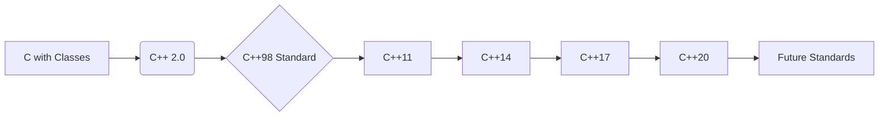

# <span style="color:#e67e22;">What we will learn in this post?</span>
<ul style='list-style-type: none; padding-left: 0;'>
<li><span style='color: #2980b9; font-size: 20px; font-weight: bold;'>👉</span> <span style='color: #2ecc71; font-size: 18px; font-weight: bold;'>Introduction to C++</span></li>
<li><span style='color: #2980b9; font-size: 20px; font-weight: bold;'>👉</span> <span style='color: #2ecc71; font-size: 18px; font-weight: bold;'>Features of C++</span></li>
<li><span style='color: #2980b9; font-size: 20px; font-weight: bold;'>👉</span> <span style='color: #2ecc71; font-size: 18px; font-weight: bold;'>History of C++</span></li>
<li><span style='color: #2980b9; font-size: 20px; font-weight: bold;'>👉</span> <span style='color: #2ecc71; font-size: 18px; font-weight: bold;'>Interesting Facts about C++</span></li>
<li><span style='color: #2980b9; font-size: 20px; font-weight: bold;'>👉</span> <span style='color: #2ecc71; font-size: 18px; font-weight: bold;'>Setting up C++ Development Environment</span></li>
<li><span style='color: #2980b9; font-size: 20px; font-weight: bold;'>👉</span> <span style='color: #2ecc71; font-size: 18px; font-weight: bold;'>Similarities and Differences between C++ and C</span></li>
<li><span style='color: #2980b9; font-size: 20px; font-weight: bold;'>👉</span> <span style='color: #2ecc71; font-size: 18px; font-weight: bold;'>Conclusion!</span></li>
</ul>

# <span style="color:#e67e22">Introducing C++: A Powerful Programming Language 💻</span>

C++ is a versatile programming language known for its performance and control.  It's like a powerful toolbox, letting you build almost anything, from simple programs to complex operating systems.  Think of it as a step up from simpler languages like Python, offering more direct control over the computer's hardware.


## <span style="color:#2980b9">Key Features ✨</span>

* **Object-Oriented Programming (OOP):**  C++ supports OOP principles like *encapsulation*, *inheritance*, and *polymorphism*, making code more organized and reusable.  Imagine building with pre-fabricated parts instead of starting from scratch each time!

* **Performance:** C++ is compiled, meaning it translates directly into machine code for fast execution. This is crucial for applications needing speed, like games or high-frequency trading systems.  `int x = 10;` is a simple example of a C++ statement.

* **Memory Management:**  C++ gives you fine-grained control over memory, allowing for optimization but requiring careful handling to avoid errors.


### <span style="color:#8e44ad">Example:  A Simple "Hello, World!"</span>

```cpp
#include <iostream>

int main() {
  std::cout << "Hello, World!" << std::endl;
  return 0;
}
```

## <span style="color:#2980b9">Areas of Application 🚀</span>

* **Game Development:** Many popular games use C++ for its performance and control over hardware.
* **Operating Systems:**  Operating systems like Windows, macOS, and Linux have significant components written in C++.
* **High-Performance Computing:** C++ is ideal for applications requiring immense processing power, such as scientific simulations.
* **Embedded Systems:** C++ is used in embedded systems which are small computer systems that are part of larger devices.


## <span style="color:#2980b9">Learn More 📚</span>

For more in-depth information, check out these resources:

* [LearnCpp.com](https://www.learncpp.com/)  A great website for beginners.
* [cppreference.com](https://en.cppreference.com/w/) A comprehensive C++ reference.


Remember, C++ has a steeper learning curve than some other languages, but mastering it unlocks powerful capabilities.  Good luck! 👍


# <span style="color:#e67e22">Key Features of C++</span> 

C++ is a powerful language with several key features making it versatile. Let's explore some of them!

## <span style="color:#2980b9">Object-Oriented Programming (OOP) 📦</span>

OOP is a programming style where we organize code around "objects" that contain data (variables) and functions (methods) to work with that data.  This makes code more modular and reusable.

### <span style="color:#8e44ad">Example:</span>
```c++
class Dog {
public:
  void bark() { std::cout << "Woof!\n"; }
};

int main() {
  Dog myDog;
  myDog.bark(); // Calling the bark method
  return 0;
}
```

## <span style="color:#2980b9">Encapsulation 🔒</span>

Encapsulation bundles data and methods that operate on that data within a class, hiding internal details and controlling access.  This protects data integrity.

### <span style="color:#8e44ad">Example:</span>
```c++
class BankAccount {
private:
  double balance; // Hidden data
public:
  void deposit(double amount) { balance += amount; }
};
```

## <span style="color:#2980b9">Inheritance 👪</span>

Inheritance lets you create new classes (derived classes) based on existing classes (base classes), inheriting their properties and behaviors.  This promotes code reuse.

### <span style="color:#8e44ad">Example:</span>
```c++
class Animal { public: void eat() {/*...*/} };
class Dog : public Animal { public: void bark() {/*...*/} };
```

## <span style="color:#2980b9">Polymorphism 🎭</span>

Polymorphism allows objects of different classes to be treated as objects of a common type. This enables flexibility and extensibility.


### <span style="color:#8e44ad">Example:</span>  (Requires virtual functions, a more advanced concept)

*A simplified illustration – requires understanding of virtual functions.*

```c++
class Animal { public: virtual void sound() = 0; }; //Pure Virtual Function
class Dog : public Animal { public: void sound() {std::cout << "Woof!\n"; } };
class Cat : public Animal { public: void sound() {std::cout << "Meow!\n"; } };
```

For more in-depth understanding, consider these resources:

* [LearnCpp.com](https://www.learncpp.com/)  - A great website for learning C++
* [CppReference](https://en.cppreference.com/w/) -  Comprehensive C++ reference


This overview provides a basic understanding of C++'s core OOP features.  Each concept deserves further study to master its nuances.


# <span style="color:#e67e22">C++: A Journey Through Time 🚀</span>

C++'s story begins with Bjarne Stroustrup at Bell Labs in the early 1980s.  He wanted a language that combined the power of C with the elegance of Simula's object-oriented features.  This led to "C with Classes," which eventually evolved into C++.

## <span style="color:#2980b9">Early Years & Key Milestones 👶</span>

*   **1983:**  The name "C++" is adopted.  (It's "++" because it's an increment to C!)
*   **1985:** The first edition of *The C++ Programming Language* is published—a bible for early adopters.
*   **1989:** C++ 2.0 introduces significant improvements.


### <span style="color:#8e44ad">The Rise of Standardization</span>

The lack of a formal standard hindered C++'s widespread adoption.  This changed with:

*   **1998:**  The ISO/IEC 14882:1998 standard (C++98) is released, solidifying the language's structure and ensuring portability.  This was a *game changer*.

## <span style="color:#2980b9">Modern C++ & Beyond ✨</span>

Subsequent standards brought major enhancements:

*   **2011 (C++11):**  Introduced features like lambdas, `auto` type deduction, smart pointers (making memory management safer!), and much more, making C++ more modern and expressive.
*   **2014 (C++14):** Refined C++11, improving usability and adding helpful features.
*   **2017 (C++17):** Focused on even greater improvements to the standard template library (STL), making it more powerful and easier to use.
*   **2020 (C++20):** Introduced *modules* (for better code organization), *concepts* (for more robust templates), and *coroutines* (for asynchronous programming).
*   **Beyond 2020:** C++ continues to evolve, addressing new programming paradigms and hardware architectures.

[Learn More about C++ Standards](https://isocpp.org/std/the-standard)


## <span style="color:#2980b9">Simplified Evolution Flowchart</span>



C++ has come a long way!  From its humble beginnings to its current position as a powerhouse language used in diverse fields, its journey highlights the power of continuous improvement and adaptation.  🎉


# <span style="color:#e67e22">Intriguing C++ Facts 💡</span>

## <span style="color:#2980b9">Powerhouse Performance 💪</span>

C++ is a *powerful* and *versatile* programming language known for its speed and efficiency.  Its close-to-hardware nature makes it ideal for performance-critical applications.  Think of it as a *sports car* among programming languages!

### <span style="color:#8e44ad">Real-World Applications 🚀</span>

*   **Gaming:**  Many popular games, like *Call of Duty* and *World of Warcraft*, rely heavily on C++ for their graphics and engine.
*   **Operating Systems:**  Parts of Windows, macOS, and Linux are written in C++.
*   **Finance:**  High-frequency trading systems often use C++ for its speed and reliability.


## <span style="color:#2980b9">A Bit of History 📜</span>

C++ is an extension of C, designed by Bjarne Stroustrup in the 1970s.  It's been constantly evolving, adapting to modern programming needs.  Its longevity is a testament to its robust design.


## <span style="color:#2980b9">Why C++? 🤔</span>

*   **Control:** Offers fine-grained control over system resources.
*   **Performance:**  Exceptional speed and efficiency.
*   **Libraries:**  Vast libraries support a wide range of tasks.


[Learn more about C++ here!](https://www.cplusplus.com/) 


# <span style="color:#e67e22">Setting up your C++ Development Environment 🛠️</span>

This guide helps you set up a C++ environment on Windows, macOS, and Linux.

## <span style="color:#2980b9">Windows 💻</span>

### <span style="color:#8e44ad">Install a Compiler</span>
* Download and install **MinGW** ([https://www.mingw-w64.org/](https://www.mingw-w64.org/)).  This provides the `g++` compiler.
* _Alternatively_, use Visual Studio ([https://visualstudio.microsoft.com/](https://visualstudio.microsoft.com/)), which includes a powerful IDE and compiler.


## <span style="color:#2980b9">macOS 🍎</span>

### <span style="color:#8e44ad">Install Xcode</span>
* Install Xcode from the Mac App Store.  It includes the Clang compiler.  This also provides a full IDE.


## <span style="color:#2980b9">Linux 🐧</span>

### <span style="color:#8e44ad">Use your Package Manager</span>
* Most Linux distributions use a package manager. For example, on Debian/Ubuntu: `sudo apt-get update && sudo apt-get install build-essential` installs `g++` and other essential tools.  Fedora/CentOS/RHEL users should use `sudo dnf install gcc-c++`.


## <span style="color:#2980b9">Verify your Installation 🎉</span>

After installation, open your terminal and type `g++ --version` (or `clang++ --version`).  You should see the compiler version displayed.  If not, double check your installation steps.

```mermaid
graph TD
    A[Choose OS] --> B{Windows?};
    B -- Yes --> C[Install MinGW or Visual Studio];
    B -- No --> D{macOS?};
    D -- Yes --> E[Install Xcode];
    D -- No --> F[Install using Package Manager (e.g., apt, dnf)];
    C --> G[Verify Installation];
    E --> G;
    F --> G;
    G --> H[Start Coding!];
```

Remember to consult the documentation for your chosen compiler and IDE for more detailed instructions.  Happy coding! 😊


# <span style="color:#e67e22">C++ vs. C: A Friendly Comparison 🤝</span>

C and C++ are like siblings – similar but with key differences.  C is like the *older, reliable* brother, while C++ is the *younger, more sophisticated* sibling.


## <span style="color:#2980b9">Similarities ✨</span>

Both languages share a lot of basic syntax and many core functionalities.  They both:

*   Compile to machine code, resulting in fast execution.
*   Allow manual memory management (though C++ offers RAII).
*   Support procedural programming (functions).
*   Provide access to low-level hardware features.


### <span style="color:#8e44ad">Example: Basic Structure</span>

```c++
#include <iostream> // C++
// #include <stdio.h> // C

int main() {
  printf("Hello from C/C++!\n"); // Both support this
  return 0;
}
```


## <span style="color:#2980b9">Differences 💥</span>

C++ extends C by adding:

*   **Object-Oriented Programming (OOP):** Classes, inheritance, polymorphism.  C is strictly procedural.
*   **Namespaces:**  Organize code, avoiding naming collisions. C lacks namespaces.
*   **Standard Template Library (STL):** Provides ready-made data structures (vectors, maps). C needs manual implementation.
*   **Exception Handling:** Enables better error management. C relies on error codes.


### <span style="color:#8e44ad">Example: Classes in C++</span>

```c++
class Dog {
public:
  void bark() { std::cout << "Woof!\n"; }
};

int main() {
  Dog myDog;
  myDog.bark();
  return 0;
}
```


## <span style="color:#2980b9">Complementary Nature 🤝</span>

C++ leverages C's efficiency, allowing you to use C code within C++ projects.  This is useful for performance-critical sections.  You might use C for low-level operations and C++ for higher-level, object-oriented design within the same project.


[Learn more about C](https://www.geeksforgeeks.org/c-programming-language/)

[Learn more about C++](https://www.geeksforgeeks.org/cpp/)


This synergistic approach combines the best features of both languages! 🚀


<h1><span style='color:#e67e22'>Conclusion</span></h1>

So there you have it!  We've covered a lot of ground today, and hopefully, you found it helpful and insightful. 😊  But the conversation doesn't end here! We'd love to hear your thoughts, feedback, and any suggestions you might have.  What did you think of [mention a specific topic or point from the blog]?  What other topics would you like to see us cover?  Let us know in the comments below! 👇 We're excited to hear from you! 🎉


