# <span style="color:#e67e22;">What we will learn in this post?</span>
<ul style='list-style-type: none; padding-left: 0;'>
<li><span style='color: #2980b9; font-size: 20px; font-weight: bold;'>👉</span> <span style='color: #2ecc71; font-size: 18px; font-weight: bold;'>What is Shell Scripting?</span></li>
<li><span style='color: #2980b9; font-size: 20px; font-weight: bold;'>👉</span> <span style='color: #2ecc71; font-size: 18px; font-weight: bold;'>Writing and Executing a Basic Shell Script</span></li>
<li><span style='color: #2980b9; font-size: 20px; font-weight: bold;'>👉</span> <span style='color: #2ecc71; font-size: 18px; font-weight: bold;'>Different Shell Types in Linux</span></li>
<li><span style='color: #2980b9; font-size: 20px; font-weight: bold;'>👉</span> <span style='color: #2ecc71; font-size: 18px; font-weight: bold;'>Shell Scripting Best Practices</span></li>
<li><span style='color: #2980b9; font-size: 20px; font-weight: bold;'>👉</span> <span style='color: #2ecc71; font-size: 18px; font-weight: bold;'>Conclusion!</span></li>
</ul>

# <span style="color:#e67e22">Shell Scripting: Your Automator Friend 🤖</span>

Shell scripting is like giving your computer a set of instructions written in a language it understands.  It lets you automate repetitive tasks, saving you time and effort. Think of it as creating mini-programs to control your operating system.

## <span style="color:#2980b9">Advantages ✨</span>

* **Automation:**  Automate file backups, system maintenance, and more!  No more clicking endlessly.
* **Efficiency:**  Do multiple tasks at once, boosting your productivity.
* **Customization:** Tailor scripts to your specific needs.
* **Easy to learn (relatively):**  Numerous tutorials are available online.


## <span style="color:#2980b9">Common Uses 💻</span>

Shell scripts are used everywhere:

* **System Administration:** Managing users, services, and files.
* **Web Development:** Automating deployments and testing.
* **Data Processing:**  Cleaning and manipulating data.


### <span style="color:#8e44ad">Example: Automating File Backup</span>

This simple script backs up a folder:

```bash
#!/bin/bash
cp -r /path/to/source /path/to/backup
echo "Backup complete!"
```

This script uses `cp -r` to recursively copy the source folder to the backup location, and then prints a confirmation message.

```mermaid
graph TD
    A["🚀 Start"] --> B{"🛠 Task 1?"};
    B -- "✅ Yes" --> C["📌 Do Task 1"];
    B -- "❌ No" --> D["⏭ Skip Task 1"];
    C --> E{"🛠 Task 2?"};
    D --> E;
    E -- "✅ Yes" --> F["📌 Do Task 2"];
    E -- "❌ No" --> G["⏭ Skip Task 2"];
    F --> H["🏁 End"];
    G --> H;

    %% Custom Styles
    classDef startStyle fill:#FFD700,stroke:#B8860B,color:#000000,font-size:14px,stroke-width:3px,rx:15px,shadow:5px;
    classDef decisionStyle fill:#32CD32,stroke:#006400,color:#000000,font-size:14px,stroke-width:3px,rx:15px,shadow:5px;
    classDef taskStyle fill:#1E90FF,stroke:#00008B,color:#FFFFFF,font-size:14px,stroke-width:3px,rx:15px,shadow:5px;
    classDef skipStyle fill:#FF69B4,stroke:#C71585,color:#FFFFFF,font-size:14px,stroke-width:3px,rx:15px,shadow:5px;
    classDef endStyle fill:#FF6347,stroke:#B22222,color:#FFFFFF,font-size:14px,stroke-width:3px,rx:15px,shadow:5px;

    %% Apply Classes
    class A startStyle;
    class B decisionStyle;
    class E decisionStyle;
    class C taskStyle;
    class F taskStyle;
    class D skipStyle;
    class G skipStyle;
    class H endStyle;

```


## <span style="color:#2980b9">How Scripts Automate Tasks ⚙️</span>



This flowchart shows how a script can conditionally execute tasks.


For more information:

* [Linux Shell Scripting Tutorial](https://www.linuxshellscripting.com/)


Remember, practice makes perfect! Start with small scripts and gradually increase complexity.  Happy scripting! 🎉


# <span style="color:#e67e22">Let's Create a Shell Script!</span> 🎉

## <span style="color:#2980b9">Step 1: The Shebang 📜</span>

Every script starts with a *shebang* line: `#!/bin/bash`.  This tells the system which interpreter (here, Bash) to use to run your script.

### <span style="color:#8e44ad">Example:</span>

```bash
#!/bin/bash
echo "Hello, world!"
```

## <span style="color:#2980b9">Step 2: Adding Functionality 💪</span>

Let's make it slightly more useful:

```bash
#!/bin/bash
name="Alice"
echo "Hello, $name!"
```

This script greets a user by name.  `$name` accesses the variable's value.


## <span style="color:#2980b9">Step 3: Execution Permissions 🔑</span>

To run, we need execution permissions. Use this command in your terminal:

```bash
chmod +x my_script.sh
```

Replace `my_script.sh` with your filename.


## <span style="color:#2980b9">Step 4: Running the Script 🚀</span>

Now you can run it from the terminal:

```bash
./my_script.sh
```

This will print "Hello, Alice!".

---

**Key Points:**

*   The shebang (`#!`) is crucial.
*   `chmod +x` grants execution permission.
*   `./`  is important before the filename to run it in the current directory.

---

[Learn more about shell scripting](https://www.linuxfoundation.org/blog/introduction-to-shell-scripting/)


# <span style="color:#e67e22">Shell Showdown: Bash vs. Zsh vs. Fish vs. KornShell 🐚</span>

## <span style="color:#2980b9">Key Differences & Examples</span>

Let's compare popular shells!  They all let you interact with your computer's operating system, but have different features.

### <span style="color:#8e44ad">Bash (Bourne Again Shell)</span> 
*   The *default* on many Linux systems.  
*   Powerful, but can have a steeper learning curve.
*   Example: `ls -l` (lists files in detail).

### <span style="color:#8e44ad">Zsh (Z Shell)</span> 
*   Highly *configurable* and extensible with plugins (Oh My Zsh!).
*   Often preferred for its enhanced autocompletion and theming.
*   Example:  `alias la='ls -la'` (creates a custom alias).

### <span style="color:#8e44ad">Fish (Friendly Interactive Shell)</span> 
*   *User-friendly*, with auto-suggestions and syntax highlighting.
*   Great for beginners due to its intuitive design.
*   Example: Fish's `set -gx myvar "hello"` is more readable.

### <span style="color:#8e44ad">KornShell (ksh)</span> 
*   *Powerful* and known for its scripting capabilities.
*   Often used in enterprise environments.  It's less user-friendly for beginners.
*   Example:  Similar commands to bash, but with some enhanced features.


## <span style="color:#2980b9">Choosing Your Shell</span>

*   **Beginners:** Fish is a great starting point.
*   **Power users:** Zsh with Oh My Zsh offers extensive customization.
*   **Scripting:** Bash or ksh are solid choices.


[More info on shells](https://www.example.com/shells)  (Replace with actual relevant links)


# <span style="color:#e67e22">Shell Scripting Best Practices ✨</span>

## <span style="color:#2980b9">Write Clearly & Efficiently</span>

* **Use Meaningful Names:**  Instead of `script.sh`, use `backup_database.sh`.
* **Add Comments:** Explain *why* you're doing something, not just *what*.  `# Backup the database to /backup`
* **Error Handling:** Check for failures!  `if [ $? -ne 0 ]; then echo "Error!"; exit 1; fi` (Good) vs.  `rm -rf /` (Bad! 😱)
* **Modularize:** Break large scripts into smaller, reusable functions.


### <span style="color:#8e44ad">Example: Good vs. Bad</span>

**Good:**

```bash
function backup_db {
  # Backs up the database
  mysqldump ... > backup.sql
}
backup_db
```

**Bad:**

```bash
mysqldump ... > backup.sql #no comments, no error handling
```


## <span style="color:#2980b9">Readability Matters 📖</span>

* **Indentation:**  Use consistent spacing to improve readability.
* **Shebang:** Always start with `#!/bin/bash` to specify the interpreter.


## <span style="color:#2980b9">Maintainability 💪</span>

* **Version Control (Git):** Track changes and collaborate effectively.  [Learn Git](https://git-scm.com/)
* **Keep it Simple:** Avoid overly complex one-liners.


This guide provides a starting point.  Explore more advanced techniques like using arrays and loops for further efficiency. Remember to always test your scripts thoroughly!

<h1><span style='color:#e67e22'>Conclusion</span></h1>

Well, that's all for now folks!  Hope this was helpful. 👍  What did you think?  Any questions or suggestions?  Drop them in the comments below!  I'll be checking them regularly! 😊


