# What we will learn in this post?

<ul style='list-style-type: none; padding-left: 0;'>
<li>👉 Essential Linux Shell Commands</li>
<li>👉 File and Directory Management Commands</li>
<li>👉 Process Management Commands</li>
<li>👉 File Permissions and Ownership</li>
<li>👉 Redirection and Piping in Linux</li>
<li>👉 Conclusion!</li>
</ul>

# Essential Linux Shell Commands ✨

These commands are the building blocks of navigating and managing files in Linux.

## Navigation & Listing 🗺️

- **`pwd` (Print Working Directory):** Shows your current location. `pwd`
- **`cd` (Change Directory):** Moves you to a different directory. `cd /home/user` changes to the `/home/user` directory.
- **`ls` (List):** Shows files and directories in the current location. `ls -l` (long listing) shows detailed information.

## File Manipulation 🗂️

- **`cp` (Copy):** Copies files or directories. `cp file1.txt file2.txt` copies `file1.txt` to `file2.txt`.
- **`mv` (Move/Rename):** Moves or renames files/directories. `mv file1.txt newfile.txt` renames `file1.txt`.
- **`rm` (Remove):** Deletes files or directories. _Use with caution!_ `rm file.txt` deletes `file.txt`. `rm -r directory` recursively deletes a directory (and its contents).
- **`mkdir` (Make Directory):** Creates a new directory. `mkdir new_directory` creates the `new_directory`.

```mermaid
graph TD
    A["📂 Create Directory"] --> B{"📋 Copy File?"};
    B --> C["✏️ Rename File"];
    C --> D{"📄 List Files?"};
    D --> E["🗑 Remove File"];

    %% Custom Styles
    classDef actionStyle fill:#1E90FF,stroke:#00008B,color:#FFFFFF,font-size:14px,stroke-width:3px,rx:15px,shadow:5px;
    classDef decisionStyle fill:#FFD700,stroke:#B8860B,color:#000000,font-size:14px,stroke-width:3px,rx:15px,shadow:5px;
    classDef dangerStyle fill:#FF6347,stroke:#B22222,color:#FFFFFF,font-size:14px,stroke-width:3px,rx:15px,shadow:5px;

    %% Apply Classes
    class A actionStyle;
    class C actionStyle;
    class E dangerStyle;
    class B decisionStyle;
    class D decisionStyle;

```

### Example: File Management Workflow

For more in-depth information, explore these resources:

- [Linux Documentation Project](https://www.kernel.org/doc/html/latest/)
- [The Linux Command Line](https://linuxcommand.org/)

Remember to always be careful when using `rm`, especially with the `-r` flag, as deleted data is typically unrecoverable. Practice these commands in a safe environment (like a virtual machine) to avoid accidental data loss.

# File & Directory Management in Linux 📁

## Creating and Deleting

- **Creating Files:** `touch my_file.txt` creates an empty file named `my_file.txt`. `touch` is like giving a file a name.
- **Creating Directories:** `mkdir my_directory` creates a new folder named `my_directory`. `mkdir -p dir1/dir2` creates nested directories.
- **Deleting Files:** `rm my_file.txt` deletes `my_file.txt`. Use `rm -r my_directory` to remove a directory and its contents (**be careful!**).

## Finding and Viewing

- **`find`:** Locates files based on criteria. `find . -name "*.txt"` finds all `.txt` files in the current directory and below.
- **`locate`:** A faster, but less accurate, way to find files based on name (uses a database). `locate my_file.txt`.
- **`tree`:** Displays the directory structure in a tree-like format. `tree .` shows the current directory's structure.

## Other Useful Commands

- `cp source destination`: Copies files or directories. `cp my_file.txt backup.txt`
- `mv source destination`: Moves or renames files/directories. `mv my_file.txt new_file.txt`
- `rm -rf my_directory`: Recursively deletes a directory and its contents (use with extreme caution!).

```mermaid
graph TD
    A["📄 Create file: `touch file.txt`"] --> B{"🔍 File exists?"};
    B -- "✅ Yes" --> C["✏️ Modify file"];
    B -- "❌ No" --> C;
    C --> D["🗑 Delete file: `rm file.txt`"];

    %% Custom Styles
    classDef createStyle fill:#1E90FF,stroke:#00008B,color:#FFFFFF,font-size:14px,stroke-width:3px,rx:15px,shadow:5px;
    classDef decisionStyle fill:#FFD700,stroke:#B8860B,color:#000000,font-size:14px,stroke-width:3px,rx:15px,shadow:5px;
    classDef actionStyle fill:#32CD32,stroke:#006400,color:#FFFFFF,font-size:14px,stroke-width:3px,rx:15px,shadow:5px;
    classDef dangerStyle fill:#FF6347,stroke:#B22222,color:#FFFFFF,font-size:14px,stroke-width:3px,rx:15px,shadow:5px;

    %% Apply Classes
    class A createStyle;
    class B decisionStyle;
    class C actionStyle;
    class D dangerStyle;

```

### Example: File Operations

For more information, check out the [Linux Documentation Project](https://www.kernel.org/doc/html/latest/). Remember to always back up your data before performing potentially destructive actions like using `rm -rf`!

# Linux Process Management: Your Handy Toolkit 🛠️

## Monitoring Processes 👀

- `ps`: Shows running processes. `ps aux` displays a detailed list.
- `top`: Displays dynamic, real-time process information, constantly updated. Use `top` to see CPU and memory usage.
- `htop`: An interactive, improved version of `top` with a user-friendly interface.

## Managing Processes 🕹️

- `kill`: Terminates processes. `kill <PID>` sends a termination signal; `kill -9 <PID>` forces termination (use cautiously!).
- `jobs`: Lists background jobs. Useful for managing processes started with `&`.

## Examples ✨

- List all processes: `ps aux`
- Kill process with ID 1234: `kill 1234`
- Forcefully kill process with ID 5678: `kill -9 5678` (Use with care!)
- List background jobs: `jobs`

### Further Exploration 🚀

For more in-depth information, explore the `man` pages (e.g., `man ps`, `man kill`). Many online resources also offer comprehensive guides.

**Note:** Always be careful when using `kill -9`, as it can lead to data loss if not used appropriately. Try a gentler `kill` first.

# File Permissions & Ownership 🧑‍💻

Every file has an _owner_, a _group_, and _permissions_ controlling who can access it (read, write, execute).

## Understanding Permissions 🔑

Permissions are represented by three sets of three characters (e.g., `rwxr-xr-x`). Each set applies to the _owner_, _group_, and _others_ respectively. `r`=read, `w`=write, `x`=execute. `-` means no permission.

### Example: `rwxr-xr-x`

- **Owner:** Read, write, and execute.
- **Group:** Read and execute.
- **Others:** Read and execute.

## Modifying Permissions with `chmod` ⚙️

`chmod` changes permissions. You can use _octal_ (e.g., `chmod 755 file.txt`) or _symbolic_ (e.g., `chmod u+x file.txt` adds execute permission for the _user_) modes.

- `u` = user, `g` = group, `o` = others, `a` = all
- `+` = add, `-` = remove, `=` = set

## Modifying Ownership with `chown` & `chgrp` 👤👥

`chown` changes the _owner_, and `chgrp` changes the _group_. For example:

- `chown john:users file.txt` changes the owner to "john" and the group to "users".
- `chgrp developers file.txt` changes the group to "developers".

For more info: [chmod man page](https://man7.org/linux/man-pages/man1/chmod.1.html), [chown man page](https://man7.org/linux/man-pages/man1/chown.1.html)

# Mastering Command-Line Power: Redirection & Pipes ⚡️

## Input/Output Redirection: Changing the Flow 🔄

Imagine your commands as tiny workers. Redirection lets you control where they get their input from and send their output to.

### Redirection Symbols:

- `>`: Sends output to a _new_ file. `ls -l > file_list.txt` creates `file_list.txt` containing the `ls -l` output.
- `>>`: Appends output to an _existing_ file. `date >> file_list.txt` adds the current date to the file.
- `<`: Takes input from a file. `wc -w < my_document.txt` counts words in `my_document.txt`.

## Pipes: Connecting Commands 🔗

Pipes let you chain commands together, passing a command's output as the input to the next. Think of it as an assembly line!

Example: `ls -l | grep "txt"` first lists files (`ls -l`), then filters for only those containing "txt" (`grep "txt"`).

### Pipe Symbol:

- `|`: The pipe symbol connects commands.

```mermaid
graph LR
    A["📂 List files: `ls -l`"] --> B{"🔗 Pipe `|`"};
    B --> C["🔍 Filter: `grep 'txt'`"];

    %% Custom Styles
    classDef commandStyle fill:#1E90FF,stroke:#00008B,color:#FFFFFF,font-size:14px,stroke-width:3px,rx:15px,shadow:5px;
    classDef pipeStyle fill:#FFD700,stroke:#B8860B,color:#000000,font-size:14px,stroke-width:3px,rx:15px,shadow:5px;
    classDef filterStyle fill:#32CD32,stroke:#006400,color:#FFFFFF,font-size:14px,stroke-width:3px,rx:15px,shadow:5px;

    %% Apply Classes
    class A commandStyle;
    class B pipeStyle;
    class C filterStyle;

```

This shows `ls -l`'s output feeding into `grep "txt"`.

For more information:

- [Linux Command Line Tutorial](https://linuxcommand.org/) (General Linux commands and redirection/piping)

By mastering redirection and pipes, you can streamline your workflow and boost your command-line efficiency! 🎉

<h1>Conclusion</h1>

And that's a wrap! We hope you enjoyed this post. 😊 We'd love to hear your thoughts – what did you think? Any questions or suggestions? Let us know in the comments below! 👇
