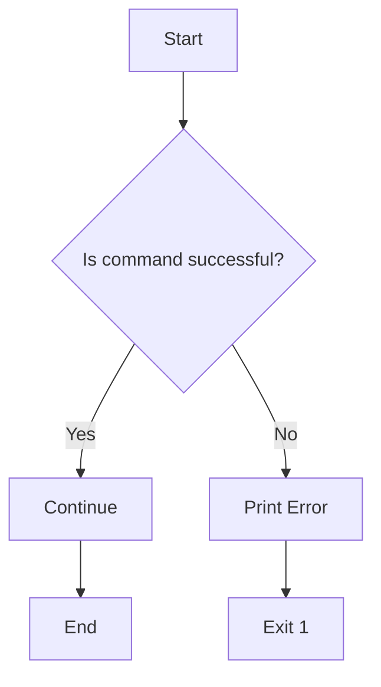

# <span style="color:#e67e22;">What we will learn in this post?</span>
<ul style='list-style-type: none; padding-left: 0;'>
<li><span style='color: #2980b9; font-size: 20px; font-weight: bold;'>👉</span> <span style='color: #2ecc71; font-size: 18px; font-weight: bold;'>Introduction to Functions in Shell</span></li>
<li><span style='color: #2980b9; font-size: 20px; font-weight: bold;'>👉</span> <span style='color: #2ecc71; font-size: 18px; font-weight: bold;'>Function Arguments and Return Values</span></li>
<li><span style='color: #2980b9; font-size: 20px; font-weight: bold;'>👉</span> <span style='color: #2ecc71; font-size: 18px; font-weight: bold;'>Modularizing Scripts with Functions</span></li>
<li><span style='color: #2980b9; font-size: 20px; font-weight: bold;'>👉</span> <span style='color: #2ecc71; font-size: 18px; font-weight: bold;'>Using External Scripts as Functions</span></li>
<li><span style='color: #2980b9; font-size: 20px; font-weight: bold;'>👉</span> <span style='color: #2ecc71; font-size: 18px; font-weight: bold;'>Best Practices for Writing Functions in Shell</span></li>
<li><span style='color: #2980b9; font-size: 20px; font-weight: bold;'>👉</span> <span style='color: #2ecc71; font-size: 18px; font-weight: bold;'>Conclusion!</span></li>
</ul>

# <span style="color:#e67e22">Shell Scripting Functions: Reusable Code Blocks 🎉</span>

Shell script functions are like mini-programs within your larger script.  They help you organize code and avoid repetition. Think of them as reusable tools!

## <span style="color:#2980b9">Why Use Functions? 🤔</span>

* **Reusability:** Write a task once, use it many times.  No more copy-pasting!
* **Readability:** Makes your script easier to understand and maintain.  Smaller, focused chunks of code.
* **Maintainability:**  Change the function once, and the change applies everywhere it's used.

## <span style="color:#2980b9">Defining and Calling Functions 🛠️</span>

### <span style="color:#8e44ad">Defining a Function</span>

Functions are defined using this structure:

```bash
function_name() {
  # Your code here
}
```

**Example:**

```bash
greet() {
  echo "Hello, $1!"  # $1 accesses the first argument
}
```


### <span style="color:#8e44ad">Calling a Function</span>

To use (call) a function, simply write its name:

```bash
greet "World"  # Output: Hello, World!
```

## <span style="color:#2980b9">Example Script ✨</span>

```bash
#!/bin/bash

greet() {
  echo "Hello, $1!"
}

greet "Alice"
greet "Bob"
```

This script defines the `greet` function and calls it twice with different names.


For more in-depth information, check out these resources:

* [Advanced Bash-Scripting Guide](https://tldp.org/LDP/abs/html/)


Remember, functions are your friends in writing cleaner, more efficient shell scripts! 🚀


# <span style="color:#e67e22">Passing Arguments & Returning Values in Shell Functions 🎉</span>

## <span style="color:#2980b9">Passing Arguments</span>

Shell functions receive arguments just like regular commands.  Arguments are separated by spaces.

```bash
my_function() {
  echo "Argument 1: $1"
  echo "Argument 2: $2"
}

my_function "Hello" "World" 
```

### <span style="color:#8e44ad">Example</span>

In this example, `"Hello"` is `$1` and `"World"` is `$2` within the function.


## <span style="color:#2980b9">Returning Values</span>

There are two main ways to return values:

*   **`return`:**  Used for returning *numeric* exit codes (0 for success, non-zero for error).  _Not ideal for complex data._

*   **`echo`:**  Prints the value to standard output.  More flexible for strings and numbers.  You then need to capture this output using command substitution (`$(...)`).


### <span style="color:#8e44ad">Numeric Return (using `return`) </span>

```bash
add() {
  result=$(( $1 + $2 ))
  return $result
}

add 5 3
echo $?  # $? holds the return value (8 in this case)
```

### <span style="color:#8e44ad">String Return (using `echo`) </span>

```bash
greet() {
  echo "Hello, $1!"
}

greeting=$(greet "Alice")
echo "$greeting" # Outputs: Hello, Alice!
```

**Remember**:  `return` is for signaling success/failure; `echo` is for returning actual data.  Choose the method appropriate for your needs.

[Learn more about shell scripting](https://www.gnu.org/software/bash/manual/bash.html)


# <span style="color:#e67e22">Functions: Building Blocks for Better Scripts 🧱</span>

## <span style="color:#2980b9">Why Use Functions?</span>

Imagine building with LEGOs.  Instead of one giant, messy pile, you use smaller blocks (functions!) to create a complex structure.  Functions do the same for scripts! They break down large tasks into smaller, manageable pieces. This makes your code:

* **Easier to read and understand:**  Functions give names to specific tasks (`calculate_total`, `display_results`).
* **Easier to debug:**  If a problem occurs, you can easily pinpoint the faulty function.
* **Reusable:** You can use the same function multiple times within your script or in other scripts.


## <span style="color:#2980b9">Example: Calculating Grades 👨‍🏫</span>

Let's say you need a script to calculate student grades. Instead of writing all the calculation logic in one big block, you'd use functions:

```python
def calculate_average(scores):
  """Calculates the average of a list of scores."""
  return sum(scores) / len(scores)

def determine_grade(average):
  """Determines the letter grade based on the average score."""
  # ...grading logic...
  return grade

# Main script using the functions
scores = [85, 92, 78]
average = calculate_average(scores)
grade = determine_grade(average)
print(f"Average: {average}, Grade: {grade}")
```

### <span style="color:#8e44ad">Benefits Illustrated</span>

*   `calculate_average` handles averaging, while `determine_grade` handles grade assignment.
*   Both are reusable for different sets of scores.
*   The main part of the script is clear and concise.


This modular approach makes large scripts far easier to manage and maintain! ✨

For more information on Python functions, you can check out [Python's official documentation](https://docs.python.org/3/tutorial/controlflow.html#defining-functions).


# <span style="color:#e67e22">Reusing Code with `source` (or `.`)</span> 💡

## <span style="color:#2980b9">What is `source`?</span>

The `source` command (or its synonym, the `.` command) in bash scripting lets you run the contents of another script file *within* your current script. This is perfect for reusing functions or variables across multiple scripts.  Think of it as *including* another file's contents.

### <span style="color:#8e44ad">Example: Modular Scripts</span>

Let's say you have `my_functions.sh` containing:

```bash
my_function() {
  echo "Hello from my function!"
}
```

Your main script (`main.sh`) can then use `source` like this:

```bash
source my_functions.sh
my_function  #Call the function from the external file
```

This makes `my_function` available to `main.sh`.


## <span style="color:#2980b9">Benefits of Modular Design</span>

*   **Reusability:** Write a function once, use it many times.
*   **Organization:** Keep your code tidy and easy to manage.
*   **Maintainability:**  Easier to update and debug individual function files.


## <span style="color:#2980b9">Flowchart</span>

```mermaid
graph LR
A[main.sh] --> B{source my_functions.sh};
B --> C[my_function() is available];
C --> D[main.sh continues execution];
```

**Remember**:  Always place your external script files in a location accessible by your shell (or specify the full path).  For more information, consult the Bash manual page: [man bash](https://man7.org/linux/man-pages/man1/bash.1.html) (search for "source").


# <span style="color:#e67e22">Shell Function Best Practices ✨</span>

## <span style="color:#2980b9">Naming & Comments ✍️</span>

Use descriptive names (e.g., `process_files`, not `pf`).  Add comments explaining *what* the function does, not *how*.

```bash
# Function to process log files
process_files() {
  # ...function body...
}
```

## <span style="color:#2980b9">Error Handling ⚠️</span>

Check for errors using `$?` (exit status).  Exit with non-zero status on failure.

```bash
if ! command; then
  echo "Error: command failed" >&2  # Send error to stderr
  exit 1
fi
```


## <span style="color:#2980b9">Scope & Variables 📦</span>

Use `local` variables to avoid unintended side effects.

```bash
my_function() {
  local my_var="hello"
  echo "$my_var"
}
```

### <span style="color:#8e44ad">Example Flowchart</span>



* **Tip:** Keep functions short and focused on a single task.
* **Resource:**  [Advanced Bash-Scripting Guide](https://tldp.org/LDP/abs/html/) (for deeper dive)

Remember:  Clean code is easier to maintain and debug! 👍


Here are a few options for a blog post conclusion, all under 150 words and using the specified formatting:


**Option 1:**

<h1><span style='color:#e67e22'>Conclusion</span></h1>

And there you have it!  I hope you enjoyed this post.  What are your thoughts?  Share your comments, feedback, and suggestions below! 👇 Let's chat! 😊


**Option 2:**

<h1><span style='color:#e67e22'>Conclusion</span></h1>

So, that's a wrap!  I'd love to hear what you think.  Any questions or brilliant ideas?  Don't be shy – the comments section is waiting!  🥳  Let the discussion begin!


**Option 3:**

<h1><span style='color:#e67e22'>Conclusion</span></h1>

Wrapping things up!  This topic really got me thinking, and I'd love to hear your perspectives.  Drop your comments, feedback, or even just a quick hello below! 👋  Looking forward to reading your thoughts!


**Option 4:**

<h1><span style='color:#e67e22'>Conclusion</span></h1>

We've reached the end!  I hope this was helpful.  Let me know what you think in the comments – your feedback is super valuable!  🤩  Thanks for reading!


