# <span style="color:#e67e22;">What we will learn in this post?</span>

<ul style='list-style-type: none; padding-left: 0;'>
<li><span style='color: #2980b9; font-size: 20px; font-weight: bold;'>👉</span> <span style='color: #2ecc71; font-size: 18px; font-weight: bold;'>Reading User Input in Shell</span></li>
<li><span style='color: #2980b9; font-size: 20px; font-weight: bold;'>👉</span> <span style='color: #2ecc71; font-size: 18px; font-weight: bold;'>Standard Input, Output, and Error in Shell</span></li>
<li><span style='color: #2980b9; font-size: 20px; font-weight: bold;'>👉</span> <span style='color: #2ecc71; font-size: 18px; font-weight: bold;'>Working with Command-Line Arguments</span></li>
<li><span style='color: #2980b9; font-size: 20px; font-weight: bold;'>👉</span> <span style='color: #2ecc71; font-size: 18px; font-weight: bold;'>Handling Output in Shell Scripts</span></li>
<li><span style='color: #2980b9; font-size: 20px; font-weight: bold;'>👉</span> <span style='color: #2ecc71; font-size: 18px; font-weight: bold;'>File Input and Output Operations</span></li>
<li><span style='color: #2980b9; font-size: 20px; font-weight: bold;'>👉</span> <span style='color: #2ecc71; font-size: 18px; font-weight: bold;'>Conclusion!</span></li>
</ul>

# <span style="color:#e67e22">Reading User Input with `read`</span> 🗣️

## <span style="color:#2980b9">Understanding the `read` Command</span>

The `read` command is your friend when building interactive shell scripts. It pauses your script, waits for the user to type something, and stores that input into a variable.

### <span style="color:#8e44ad">Basic Usage</span>

```bash
read name
echo "Hello, $name!"
```

This simple script prompts the user to type something and then prints a greeting using the input.

## <span style="color:#2980b9">Input Validation</span> 🛡️

Let's make it smarter! We can check if the user entered something valid:

```bash
read -p "Enter your age: " age
if [[ "$age" =~ ^[0-9]+$ ]]; then
  echo "You are $age years old."
else
  echo "Invalid input. Please enter a number."
fi
```

This uses a regular expression (`^[0-9]+$`) to ensure the input is only numbers.

```mermaid
graph TD
    A["🚀 Start"] --> B{"⌨️ Read User Input"};
    B -- "✅ Valid Input" --> C["🔄 Process Input"];
    B -- "❌ Invalid Input" --> D["⚠️ Error Message"];
    C --> E["🏁 End"];
    D --> B;

    %% Custom Styles
    classDef startStyle fill:#FFD700,stroke:#B8860B,color:#000000,font-size:14px,stroke-width:3px,rx:15px,shadow:5px;
    classDef decisionStyle fill:#1E90FF,stroke:#00008B,color:#FFFFFF,font-size:14px,stroke-width:3px,rx:15px,shadow:5px;
    classDef processStyle fill:#32CD32,stroke:#006400,color:#FFFFFF,font-size:14px,stroke-width:3px,rx:15px,shadow:5px;
    classDef errorStyle fill:#FF6347,stroke:#B22222,color:#FFFFFF,font-size:14px,stroke-width:3px,rx:15px,shadow:5px;
    classDef endStyle fill:#20B2AA,stroke:#008B8B,color:#FFFFFF,font-size:14px,stroke-width:3px,rx:15px,shadow:5px;

    %% Apply Classes
    class A startStyle;
    class B decisionStyle;
    class C processStyle;
    class D errorStyle;
    class E endStyle;

```

## <span style="color:#2980b9">Flowchart</span>



**Key Points:**

- `read` stores input in a variable.
- Use `-p` for a prompt message.
- Combine `read` with conditional statements (`if`, `while`) for validation.

For more information on Bash scripting and regular expressions, check out:

- [Bash scripting tutorial](https://www.tldp.org/LDP/Bash-Beginners-Guide/html/)
- [Regular expressions tutorial](https://www.regular-expressions.info/)

Remember to always test your scripts thoroughly! 😊

# <span style="color:#e67e22">Standard Input/Output/Error Streams</span> 🎉

Programs communicate using three streams:

## <span style="color:#2980b9">Standard Input (stdin)</span> ➡️

- `stdin` is where a program receives data. Think of it as the program's "inbox". By default, it's your keyboard.

## <span style="color:#2980b9">Standard Output (stdout)</span> ➡️

- `stdout` is where a program sends its normal output. It's the program's "reply". By default, it's your terminal screen.

## <span style="color:#2980b9">Standard Error (stderr)</span> ⚠️

- `stderr` is for error messages and diagnostics. It's like a separate "error report". Also displayed on your terminal by default.

## <span style="color:#2980b9">Redirection</span> 🔄

We can change where these streams go using _redirection_:

### <span style="color:#8e44ad">Output Redirection</span>

- `>`: Overwrites a file. `command > output.txt` sends `stdout` to `output.txt`.
- `>>`: Appends to a file. `command >> output.txt` adds `stdout` to `output.txt`.

### <span style="color:#8e44ad">Error Redirection</span>

- `2>`: Redirects `stderr`. `command 2> error.txt` sends `stderr` to `error.txt`.
- `2>>`: Appends `stderr`.
- `&>`: Redirects both `stdout` and `stderr` to the same place. `command &> output.txt` sends both to `output.txt`.

**Example:**

```bash
ls nonexistantfile 2> error.log  # sends error about missing file to error.log
myprogram > output.txt 2>&1 #send both stdout and stderr to output.txt
```

For more info: [Learn more about I/O redirection](https://www.gnu.org/software/bash/manual/html_node/Redirections.html) (GNU Bash manual)

# <span style="color:#e67e22">Handling Command-Line Arguments in Shell Scripting</span> 🎉

## <span style="color:#2980b9">Understanding the Special Variables</span>

Shell scripts access command-line arguments using special variables:

- `$1`, `$2`, `$3`... represent the first, second, third arguments, and so on.
- `$@` holds all arguments as separate words.
- `$#` gives the total number of arguments.

### <span style="color:#8e44ad">Example: Simple Argument Processing</span>

```bash
#!/bin/bash
echo "First argument: $1"
echo "Second argument: $2"
echo "Total arguments: $# "
```

This script prints the first two arguments and the total number of arguments.

## <span style="color:#2980b9">Using `shift` for Dynamic Processing</span>

The `shift` command removes the first argument and shifts the remaining arguments to the left. This enables processing arguments dynamically.

### <span style="color:#8e44ad">Example: Iterating Through Arguments</span>

```bash
#!/bin/bash
while [ $# -gt 0 ]; do
  echo "Processing argument: $1"
  shift
done
```

This script iterates through all arguments, printing each one.

## <span style="color:#2980b9">Example using `$@`</span>

```bash
#!/bin/bash
echo "All arguments: $@"
```

This script prints all arguments as a single line. Note the difference in output between `$@` and `$*`.

**Remember**: Always check for the correct number of arguments using `$#` to avoid errors.

For more information:

- [Bash Guide](https://tldp.org/LDP/abs/html/)

[Further exploration of advanced shell scripting techniques is encouraged. This will greatly enhance your skills!]

# <span style="color:#e67e22">Formatting Output in Shell Scripts</span> 💻

## <span style="color:#2980b9">Using `echo`, `printf`, and `tput`</span>

We can jazz up our shell script output using these three commands!

### <span style="color:#8e44ad">`echo` for basic output</span>

`echo` is simple for printing text: `echo "Hello, world!"`

### <span style="color:#8e44ad">`printf` for formatted output</span>

`printf` offers more control. For example, `printf "%s is %d years old\n", "Alice", 30` prints "Alice is 30 years old". `\n` adds a newline.

### <span style="color:#8e44ad">`tput` for terminal manipulation</span>

`tput` lets us control the terminal's appearance. For color, we can use codes like `tput setaf 1` (red) and `tput sgr0` (reset). Example: `tput setaf 1; echo "Error!"; tput sgr0`

## <span style="color:#2980b9">Example: Color-coded output</span>

```bash
tput setaf 2; echo "This is green!"; tput sgr0
tput setaf 1; echo "This is red!"; tput sgr0
```

Remember to check your terminal's color codes!

Learn more: [Tput man page](https://man7.org/linux/man-pages/man1/tput.1.html) [Printf format codes](https://www.geeksforgeeks.org/printf-in-c/)

This is a _basic_ overview. Explore further for advanced formatting techniques! ✨

# <span style="color:#e67e22">Shell Scripting File I/O 💾</span>

## <span style="color:#2980b9">Writing to Files ✍️</span>

To write to a file, use the `>` (overwrite) or `>>` (append) redirection operators with `echo`.

- `echo "Hello, world!" > myfile.txt` overwrites `myfile.txt` with "Hello, world!".
- `echo "More text!" >> myfile.txt` appends "More text!" to `myfile.txt`.

### <span style="color:#8e44ad">Logging Example</span>

```bash
echo "$(date) - Application started" >> app.log
```

## <span style="color:#2980b9">Reading from Files 👓</span>

Use `cat` to display file contents:

- `cat myfile.txt` displays the content of `myfile.txt` on the terminal.

### <span style="color:#8e44ad">Configuration File Example</span>

```bash
config_value=$(cat config.txt)
echo "The config value is: $config_value"
```

(Assumes `config.txt` contains a single value).

## <span style="color:#2980b9">Appending Content ➕</span>

The `>>` operator is perfect for adding log entries or updating configuration files without erasing existing data. For example, adding a new user to a user list file.

[More info on shell scripting](https://www.gnu.org/software/bash/manual/bash.html)

```mermaid
graph TD
    A["📝 echo 'text' > file.txt"] --> B{"⚠️ Overwrites file.txt"};
    C["✍️ echo 'more text' >> file.txt"] --> D{"➕ Appends to file.txt"};
    E["📖 cat file.txt"] --> F{"👀 Displays file contents"};

    %% Custom Styles
    classDef commandStyle fill:#FFD700,stroke:#B8860B,color:#000000,font-size:14px,stroke-width:3px,rx:15px,shadow:5px;
    classDef warningStyle fill:#FF6347,stroke:#B22222,color:#FFFFFF,font-size:14px,stroke-width:3px,rx:15px,shadow:5px;
    classDef appendStyle fill:#32CD32,stroke:#006400,color:#FFFFFF,font-size:14px,stroke-width:3px,rx:15px,shadow:5px;
    classDef displayStyle fill:#1E90FF,stroke:#00008B,color:#FFFFFF,font-size:14px,stroke-width:3px,rx:15px,shadow:5px;

    %% Apply Classes
    class A commandStyle;
    class B warningStyle;
    class C commandStyle;
    class D appendStyle;
    class E commandStyle;
    class F displayStyle;

```



<h1><span style='color:#e67e22'>Conclusion</span></h1>

Hope this helped! This was fun to write, and I hope it was fun to read! What do _you_ want to read next? Drop your ideas below! ✍️💡
