# <span style="color:#e67e22;">What we will learn in this post?</span>

<ul style='list-style-type: none; padding-left: 0;'>
<li><span style='color: #2980b9; font-size: 20px; font-weight: bold;'>👉</span> <span style='color: #2ecc71; font-size: 18px; font-weight: bold;'>Introduction to Command-Line Arguments in Shell</span></li>
<li><span style='color: #2980b9; font-size: 20px; font-weight: bold;'>👉</span> <span style='color: #2ecc71; font-size: 18px; font-weight: bold;'>Processing Multiple Arguments in Shell Scripts</span></li>
<li><span style='color: #2980b9; font-size: 20px; font-weight: bold;'>👉</span> <span style='color: #2ecc71; font-size: 18px; font-weight: bold;'>Using Getopts for Command-Line Options</span></li>
<li><span style='color: #2980b9; font-size: 20px; font-weight: bold;'>👉</span> <span style='color: #2ecc71; font-size: 18px; font-weight: bold;'>Handling Optional and Default Arguments</span></li>
<li><span style='color: #2980b9; font-size: 20px; font-weight: bold;'>👉</span> <span style='color: #2ecc71; font-size: 18px; font-weight: bold;'>Error Handling for Command-Line Arguments</span></li>
<li><span style='color: #2980b9; font-size: 20px; font-weight: bold;'>👉</span> <span style='color: #2ecc71; font-size: 18px; font-weight: bold;'>Conclusion!</span></li>
</ul>

# <span style="color:#e67e22">Command-Line Arguments in Shell Scripting 🤝</span>

Shell scripts can accept input from the command line, making them flexible and reusable. This input arrives as _command-line arguments_.

## <span style="color:#2980b9">Positional Parameters ✨</span>

These arguments are accessed within the script using special variables:

- `$1`: The first argument.
- `$2`: The second argument. And so on...
- `$#`: The _total_ number of arguments.
- `$@`: All arguments, individually quoted (useful for handling arguments with spaces).

### <span style="color:#8e44ad">Example: A Simple Greeter 👋</span>

```bash
#!/bin/bash
echo "Hello, $1! You provided $# arguments."
```

If you run this as `./my_script.sh Alice`, the output will be: `Hello, Alice! You provided 1 arguments.`

## <span style="color:#2980b9">Handling Arguments Effectively 💡</span>

- **Error Handling:** Always check if the required arguments are provided using `$#`. If not, print a helpful message and exit.
- **Quoting:** Use quotes around arguments containing spaces or special characters to prevent unexpected behavior.

```bash
#!/bin/bash
if [ $# -eq 0 ]; then
  echo "Usage: $0 <name> <message>"  # $0 is the script name itself
  exit 1
fi
name="$1"
message="$2"
echo "Hello, $name!  $message"
```

This improved script checks for arguments and handles them more robustly.

For more advanced argument parsing, consider using tools like `getopt`.

[More info on Bash Scripting](https://www.gnu.org/software/bash/manual/bash.html)

# <span style="color:#e67e22">Dynamic Command-Line Argument Processing 🎉</span>

Processing many command-line arguments efficiently is crucial. Let's explore using loops and `shift` in shell scripting (Bash example).

## <span style="color:#2980b9">The `shift` Command ➡️</span>

The `shift` command is your friend! It removes the first argument from the argument list (`$@`), effectively shifting all remaining arguments one position to the left.

### <span style="color:#8e44ad">Example: Simple Loop</span>

```bash
while [[ $# -gt 0 ]]; do
  echo "Argument: $1"
  shift
done
```

This loop continues as long as there are arguments (`$# > 0`). Each iteration, it prints the first argument (`$1`) and then uses `shift` to remove it.

## <span style="color:#2980b9">Handling Specific Arguments 🔎</span>

Often, you need to handle arguments based on flags or keywords. You can use `case` statements or conditional checks within the loop.

### <span style="color:#8e44ad">Example with Flags</span>

```bash
while [[ $# -gt 0 ]]; do
  case "$1" in
    -f) file="$2"; shift;; #Handles -f flag
    -o) output="$2"; shift;; #Handles -o flag
    *) echo "Unknown option: $1";; #Handles unknown flags
  esac
  shift
done
```

This example processes `-f` and `-o` flags. Remember to handle potential errors, like missing arguments after a flag.

- **Key takeaway:** `shift` simplifies argument processing by systematically removing processed arguments.
- **Remember:** Always validate user input to prevent errors and ensure your script behaves correctly with diverse inputs.

For more detailed information on shell scripting and argument processing, you might find these resources helpful:

- [Bash Manual](https://www.gnu.org/software/bash/manual/bash.html)
- [Advanced Bash-Scripting Guide](https://tldp.org/LDP/abs/html/)

# <span style="color:#e67e22">Getopts: Your Command-Line Option Parser ⚙️</span>

## <span style="color:#2980b9">Introducing `getopts`</span>

Tired of messy command-line argument handling in your shell scripts? `getopts` is your friend! This built-in shell command neatly parses options passed to your script, making your code cleaner and easier to understand. It's especially helpful when dealing with multiple flags.

### <span style="color:#8e44ad">Simple Example</span>

Let's create a script that uses `-h` (help), `-v` (verbose), and `-o` (output file):

```bash
#!/bin/bash

while getopts ":hvo:" opt; do
  case $opt in
    h)
      echo "Usage: $0 [-h] [-v] [-o output_file]"
      exit 0
      ;;
    v)
      verbose=1
      ;;
    o)
      outfile="$OPTARG"
      ;;
    \?)
      echo "Invalid option: -$OPTARG" >&2
      exit 1
      ;;
    :)
      echo "Option -$OPTARG requires an argument." >&2
      exit 1
      ;;
  esac
done

if [[ -n "$verbose" ]]; then
  echo "Verbose mode enabled."
fi

if [[ -n "$outfile" ]]; then
  echo "Outputting to: $outfile"
fi

echo "Main script logic here..."
```

This script elegantly handles options and their arguments.

## <span style="color:#2980b9">How it Works</span>

- The `while` loop iterates through options.
- `getopts ":hvo:"` specifies allowed options (`h`, `v`, `o`). `:` after `o` indicates it needs an argument.
- The `case` statement handles each option.
- `$OPTARG` contains the argument for options needing one.
- Error handling is included for invalid options and missing arguments.

For more information, explore the [getopts man page](https://man7.org/linux/man-pages/man1/getopts.1.html). Happy scripting! 🎉

# <span style="color:#e67e22">Handling Optional Arguments in Shell Scripts ✨</span>

## <span style="color:#2980b9">Setting Defaults and Handling Arguments</span>

Shell scripts often benefit from optional arguments. Let's see how to manage them gracefully:

### <span style="color:#8e44ad">Using Default Values</span>

We can assign default values within the script. If the user doesn't supply an argument, the default kicks in.

```bash
#!/bin/bash
name="${1:-World}" # Default to "World" if $1 is empty
echo "Hello, $name!"
```

- If you run `./script.sh`, it outputs "Hello, World!".
- `./script.sh Alice` outputs "Hello, Alice!".

### <span style="color:#8e44ad">Checking for Argument Existence</span>

We can explicitly check if an argument exists:

```bash
#!/bin/bash
if [ -n "$1" ]; then
  echo "Argument provided: $1"
else
  echo "No argument provided."
fi
```

## <span style="color:#2980b9">Example Flowchart</span>



```mermaid
graph TD
    A["🖥️ User runs script"] --> B{"📌 Argument provided?"};
    B -- "✅ Yes" --> C["📥 Use argument"];
    B -- "❌ No" --> D["⚙️ Use default value"];
    C --> E["🔄 Process"];
    D --> E;
    E --> F["📤 Output"];

    %% Custom Styles
    classDef startStyle fill:#1E90FF,stroke:#00008B,color:#FFFFFF,font-size:14px,stroke-width:3px,rx:15px,shadow:5px;
    classDef conditionStyle fill:#32CD32,stroke:#006400,color:#FFFFFF,font-size:14px,stroke-width:3px,rx:15px,shadow:5px;
    classDef processStyle fill:#FF69B4,stroke:#C71585,color:#FFFFFF,font-size:14px,stroke-width:3px,rx:15px,shadow:5px;
    classDef outputStyle fill:#FF6347,stroke:#B22222,color:#FFFFFF,font-size:14px,stroke-width:3px,rx:15px,shadow:5px;

    %% Apply Classes
    class A startStyle;
    class B conditionStyle;
    class C,D processStyle;
    class E processStyle;
    class F outputStyle;

```

For more in-depth information on shell scripting and argument parsing, refer to these resources:

- [Advanced Bash-Scripting Guide](https://tldp.org/LDP/abs/html/)
- [Bash Reference Manual](https://www.gnu.org/software/bash/manual/bash.html)

Remember to always _validate_ user input to prevent errors and security vulnerabilities! Using `case` statements or other robust methods is highly recommended for complex scenarios.

# <span style="color:#e67e22">Validating Command-Line Arguments 📝</span>

## <span style="color:#2980b9">Checking for Missing or Incorrect Parameters 🤔</span>

Many scripts need input from the command line. Let's ensure we handle this gracefully!

### <span style="color:#8e44ad">Methods for Validation 💪</span>

- **`argparse` (Python):** This library simplifies argument parsing and validation. It automatically handles help messages and error reporting. See [Python `argparse` docs](https://docs.python.org/3/library/argparse.html) for details.
- **Manual Checks:** For simpler scripts, you can directly check the number and type of arguments using `len(sys.argv)` and type conversions.

### <span style="color:#8e44ad">Example (Python with `argparse`) 🐍</span>

```python
import argparse
import sys

parser = argparse.ArgumentParser(description='My script.')
parser.add_argument("filename", help="Input filename")
args = parser.parse_args()

if not args.filename:
    print("Error: Filename is missing! ❌")
    sys.exit(1) #Exit code 1 indicates an error.

#...rest of your script...
```

### <span style="color:#8e44ad">Error Handling and Exit Codes 🚦</span>

- Use informative error messages. For instance: `"Error: Invalid input type for --count.  Must be an integer."`
- Use appropriate exit codes:
  - `0`: Success 🎉
  - `1`: Generic error ⚠️
  - Other codes for specific error types.

```mermaid
graph TD
    A["📜 Get Command-Line Arguments"] --> B{"🔍 Are all required arguments present?"};
    B -- "✅ Yes" --> C["🧑‍💻 Validate Argument Types"];
    B -- "❌ No" --> D["⚠️ Print Error Message"];
    C --> E{"✅ Are all arguments valid?"};
    E -- "✅ Yes" --> F["🚀 Execute Script"];
    E -- "❌ No" --> D;
    D --> G["❌ Exit with error code"];
    F --> H["✔️ Exit with success code (0)"];

    %% Custom Styles
    classDef startStyle fill:#1E90FF,stroke:#00008B,color:#FFFFFF,font-size:14px,stroke-width:3px,rx:15px,shadow:5px;
    classDef conditionStyle fill:#32CD32,stroke:#006400,color:#FFFFFF,font-size:14px,stroke-width:3px,rx:15px,shadow:5px;
    classDef validationStyle fill:#FFD700,stroke:#B8860B,color:#000000,font-size:14px,stroke-width:3px,rx:15px,shadow:5px;
    classDef errorStyle fill:#FF6347,stroke:#B22222,color:#FFFFFF,font-size:14px,stroke-width:3px,rx:15px,shadow:5px;
    classDef successStyle fill:#98FB98,stroke:#006400,color:#000000,font-size:14px,stroke-width:3px,rx:15px,shadow:5px;

    %% Apply Classes Separately
    class A startStyle;
    class B conditionStyle;
    class C validationStyle;
    class D errorStyle;
    class E conditionStyle;
    class F successStyle;
    class G errorStyle;
    class H successStyle;

```

## <span style="color:#2980b9">Flowchart for Argument Validation ➡️</span>



Remember to always handle potential errors gracefully to make your scripts robust and user-friendly! 👍

<h1><span style='color:#e67e22'>Conclusion</span></h1>

All good things must come to an end… but let's keep the discussion going! What did you find most helpful? What would you like to see more of? Drop a comment below! ⬇️❤️
