# <span style="color:#e67e22;">What we will learn in this post?</span>

<ul style='list-style-type: none; padding-left: 0;'>
<li><span style='color: #2980b9; font-size: 20px; font-weight: bold;'>👉</span> <span style='color: #2ecc71; font-size: 18px; font-weight: bold;'>C++ Functions</span></li>
<li><span style='color: #2980b9; font-size: 20px; font-weight: bold;'>👉</span> <span style='color: #2ecc71; font-size: 18px; font-weight: bold;'>C++ return</span></li>
<li><span style='color: #2980b9; font-size: 20px; font-weight: bold;'>👉</span> <span style='color: #2ecc71; font-size: 18px; font-weight: bold;'>C++ Parameter Passing Techniques</span></li>
<li><span style='color: #2980b9; font-size: 20px; font-weight: bold;'>👉</span> <span style='color: #2ecc71; font-size: 18px; font-weight: bold;'>Difference between Call by Value and Call by Reference</span></li>
<li><span style='color: #2980b9; font-size: 20px; font-weight: bold;'>👉</span> <span style='color: #2ecc71; font-size: 18px; font-weight: bold;'>C++ Default Arguments</span></li>
<li><span style='color: #2980b9; font-size: 20px; font-weight: bold;'>👉</span> <span style='color: #2ecc71; font-size: 18px; font-weight: bold;'>C++ Recursion</span></li>
<li><span style='color: #2980b9; font-size: 20px; font-weight: bold;'>👉</span> <span style='color: #2ecc71; font-size: 18px; font-weight: bold;'>C++ Inline Functions</span></li>
<li><span style='color: #2980b9; font-size: 20px; font-weight: bold;'>👉</span> <span style='color: #2ecc71; font-size: 18px; font-weight: bold;'>C++ Lambda Expression</span></li>
<li><span style='color: #2980b9; font-size: 20px; font-weight: bold;'>👉</span> <span style='color: #2ecc71; font-size: 18px; font-weight: bold;'>Conclusion!</span></li>
</ul>

# <span style="color:#e67e22">Understanding Functions in C++ 👨‍💻</span>

Functions are like mini-programs within your larger C++ program. They're super important for keeping your code organized and reusable! Think of them as helpful tools you can call upon whenever needed.

## <span style="color:#2980b9">Why Use Functions? 🤔</span>

- **Organization:** Functions break down a large program into smaller, manageable chunks. This makes your code much easier to read, understand, and debug. It's like tidying up a messy room – much better, right?
- **Reusability:** Once you've written a function, you can use it multiple times in your program without rewriting the same code again and again. This saves time and effort, and reduces errors. It's like having a handy tool you can use over and over.

### <span style="color:#8e44ad">A Simple Example ✨</span>

Let's say you need to calculate the area of a rectangle several times in your program. Instead of writing the calculation repeatedly, you could create a function:

```c++
int calculateArea(int length, int width) {
  return length * width;
}
```

This `calculateArea` function takes the length and width as _input_ and returns the calculated _area_ as _output_. You can then call it whenever you need to calculate an area:

```c++
int area = calculateArea(5, 10); // area will be 50
```

## <span style="color:#2980b9">Benefits Summarized 🚀</span>

- **Improved Readability:** Easier to understand complex code.
- **Reduced Errors:** Less code to write means fewer chances for mistakes.
- **Easier Maintenance:** Changes are easier to implement and track.
- **Code Reusability:** Write once, use many times!

```mermaid
graph TD
    A["🖥️ Main Program"] --> B{"📞 Call Function"};
    B --> C["⚙️ Function Execution"];
    C --> D["🔄 Return Value"];
    D --> A;

    %% Custom Styles
    classDef mainStyle fill:#1E90FF,stroke:#00008B,color:#FFFFFF,font-size:14px,stroke-width:3px,rx:15px,shadow:5px;
    classDef callStyle fill:#32CD32,stroke:#006400,color:#FFFFFF,font-size:14px,stroke-width:3px,rx:15px,shadow:5px;
    classDef executionStyle fill:#FFD700,stroke:#B8860B,color:#000000,font-size:14px,stroke-width:3px,rx:15px,shadow:5px;
    classDef returnStyle fill:#98FB98,stroke:#006400,color:#000000,font-size:14px,stroke-width:3px,rx:15px,shadow:5px;

    %% Apply Classes Separately
    class A mainStyle;
    class B callStyle;
    class C executionStyle;
    class D returnStyle;

```

## <span style="color:#2980b9">Flowchart of a Function Call ➡️</span>



For more in-depth information on functions in C++, you can check out these resources:

- [LearnCpp.com](https://www.learncpp.com/): A great resource for learning C++.
- [cplusplus.com](https://www.cplusplus.com/): The official C++ reference site.

Remember, functions are your friends! They'll make your C++ programming journey much smoother and more efficient. 😊

# <span style="color:#e67e22">Understanding the `return` Statement in C++ 🎁</span>

The `return` statement is your function's way of giving back a result after it finishes its work. Think of it like a function's polite "Here's your answer!"

## <span style="color:#2980b9">Syntax and Usage ✨</span>

The basic syntax is simple: `return value;`

- `value` is the data your function is sending back. This could be a number, text, or even a more complex data structure.

### <span style="color:#8e44ad">Examples 💡</span>

Let's look at a few examples:

```c++
// Function returning an integer
int add(int a, int b) {
  return a + b;
}

// Function returning a string
std::string greet(std::string name) {
  return "Hello, " + name + "!";
}

int main() {
  int sum = add(5, 3); // sum will be 8
  std::string message = greet("Alice"); // message will be "Hello, Alice!"
  return 0; //Indicates successful program execution
}
```

In the `add` function, we return the sum of `a` and `b`. In `greet`, we return a personalized greeting. The `main` function also uses `return 0;` to signal successful completion to the operating system.

## <span style="color:#2980b9">Return Types 🎯</span>

The type of value returned (like `int`, `string`, `float` etc.) must match the function's declared return type. For example, if a function is declared as `int myFunction()`, it _must_ return an integer value. If it doesn't return anything, use `void`.

```mermaid
graph TD
    A["📞 Function Call"] --> B{"🛠️ Function Body"};
    B --> C["📊 Process Data"];
    C --> D{"🔄 Return Value?"};
    D -- Yes --> E["📤 Return Value"];
    D -- No --> F["🚫 End of Function (void)"];
    E --> G["✅ Function Call Ends"];
    F --> G;

    %% Custom Styles
    classDef callStyle fill:#1E90FF,stroke:#00008B,color:#FFFFFF,font-size:14px,stroke-width:3px,rx:15px,shadow:5px;
    classDef bodyStyle fill:#FFD700,stroke:#B8860B,color:#000000,font-size:14px,stroke-width:3px,rx:15px,shadow:5px;
    classDef processStyle fill:#32CD32,stroke:#006400,color:#000000,font-size:14px,stroke-width:3px,rx:15px,shadow:5px;
    classDef decisionStyle fill:#FF69B4,stroke:#C71585,color:#FFFFFF,font-size:14px,stroke-width:3px,rx:15px,shadow:5px;
    classDef returnStyle fill:#98FB98,stroke:#006400,color:#000000,font-size:14px,stroke-width:3px,rx:15px,shadow:5px;
    classDef voidStyle fill:#DC143C,stroke:#8B0000,color:#FFFFFF,font-size:14px,stroke-width:3px,rx:15px,shadow:5px;
    classDef endStyle fill:#8A2BE2,stroke:#4B0082,color:#FFFFFF,font-size:14px,stroke-width:3px,rx:15px,shadow:5px;

    %% Apply Classes Separately
    class A callStyle;
    class B bodyStyle;
    class C processStyle;
    class D decisionStyle;
    class E returnStyle;
    class F voidStyle;
    class G endStyle;

```



For more detailed information and advanced usage, consider checking out these resources:

- [C++ Documentation on Return Statements](https://www.cplusplus.com/doc/tutorial/functions/) (Example link - replace with a suitable authoritative resource)

Remember, `return` is crucial for getting results back from your C++ functions! Using it correctly makes your code cleaner and easier to understand. 👍

# <span style="color:#e67e22">C++ Parameter Passing Techniques 🤝</span>

C++ offers several ways to pass parameters to functions. Let's explore the most common:

## <span style="color:#2980b9">Call by Value 📦</span>

### <span style="color:#8e44ad">How it Works</span>

In call by value, a _copy_ of the argument's value is passed to the function. Changes made to the parameter _inside_ the function don't affect the original variable.

```c++
void changeValue(int x) { x = 10; }

int main() {
  int num = 5;
  changeValue(num); // num remains 5
  //std::cout << num; // Output: 5
}
```

## <span style="color:#2980b9">Call by Reference 📌</span>

### <span style="color:#8e44ad">How it Works</span>

Call by reference passes the _memory address_ of the argument. Any changes within the function directly modify the original variable. This is denoted by an ampersand (`&`) before the parameter.

```c++
void changeValue(int &x) { x = 10; }

int main() {
  int num = 5;
  changeValue(num); // num becomes 10
  //std::cout << num; // Output: 10
}
```

### <span style="color:#8e44ad">Example: Swapping Values</span>

Swapping two numbers is easily done using call by reference:

```c++
void swap(int &a, int &b) {
  int temp = a;
  a = b;
  b = temp;
}
```

- **Key Differences:** Call by value is safer (prevents accidental modification), while call by reference is more efficient for large data structures and modifying original variables.

---

**Further Reading:** For a deeper dive, explore resources on C++ function parameters and memory management. [A good starting point could be a C++ tutorial on a site like cppreference.com](https://en.cppreference.com/w/) (replace with a relevant link if you find a particularly useful one). Remember to search for "C++ call by value" and "C++ call by reference" for more examples and explanations! 😊

# <span style="color:#e67e22">Call by Value vs. Call by Reference in C++ 🤝</span>

## <span style="color:#2980b9">Call by Value 📦</span>

### <span style="color:#8e44ad">Understanding Call by Value</span>

In call by value, a _copy_ of the argument's value is passed to the function. Changes made to the parameter _inside_ the function do _not_ affect the original variable. Think of it like giving someone a photocopy – they can write on the copy, but the original remains unchanged.

```c++
#include <iostream>

void changeValue(int x) {
  x = 10;
}

int main() {
  int num = 5;
  changeValue(num);
  std::cout << num; // Output: 5 (original value unchanged)
  return 0;
}
```

## <span style="color:#2980b9">Call by Reference 📌</span>

### <span style="color:#8e44ad">Understanding Call by Reference</span>

Call by reference passes the _memory address_ of the argument to the function. Any modifications to the parameter _directly_ affect the original variable. It's like giving someone the original document – any changes they make are permanent. We use the `&` symbol to indicate a reference parameter.

```c++
#include <iostream>

void changeValue(int &x) { // Note the &
  x = 10;
}

int main() {
  int num = 5;
  changeValue(num);
  std::cout << num; // Output: 10 (original value changed)
  return 0;
}
```

### <span style="color:#8e44ad">Key Differences Summarized</span>

| Feature        | Call by Value                             | Call by Reference                    |
| -------------- | ----------------------------------------- | ------------------------------------ |
| **Mechanism**  | Copies the value                          | Passes the memory address            |
| **Changes**    | Original variable unchanged               | Original variable modified           |
| **Efficiency** | Less efficient (copying overhead)         | More efficient (no copying)          |
| **Use Cases**  | When you don't want to alter the original | When you need to modify the original |

**Note:** For more detailed information and advanced techniques, explore resources on C++ function arguments and pointers. [Learn more about Pointers](https://www.cplusplus.com/doc/tutorial/pointers/) [Learn more about References](https://www.learncpp.com/cpp-tutorial/7-4-references/)

# <span style="color:#e67e22">Default Arguments in C++ ✨</span>

Default arguments in C++ let you assign _default values_ to function parameters. If a caller doesn't provide a value for that parameter, the default value is used. This makes your functions more flexible and easier to use.

## <span style="color:#2980b9">How They Work 🤔</span>

You specify default arguments directly in the function's declaration:

```cpp
void greet(string name = "Guest") { // "Guest" is the default
  cout << "Hello, " << name << "!" << endl;
}
```

Here, `name` has a default value of "Guest". You can call `greet()` in two ways:

- `greet();` // Uses the default "Guest"
- `greet("Alice");` // Uses "Alice"

### <span style="color:#8e44ad">Example Scenario 💡</span>

Let's say you're making a function to calculate the area of a rectangle:

```cpp
double rectArea(double length, double width = 1.0) {
  return length * width;
}
```

- `rectArea(5.0, 2.0);` // Area of a 5x2 rectangle
- `rectArea(5.0);` // Area of a 5x1 rectangle (width defaults to 1.0)

## <span style="color:#2980b9">Important Points 📌</span>

- Default arguments must be placed at the _end_ of the parameter list. You can't have a parameter with a default value followed by one without.
- Default values are evaluated only _once_ at compile time.

---

**More Info:** For a deeper dive, check out these resources:

- [LearnCpp.com](https://www.learncpp.com/cpp-tutorial/default-arguments/) (Excellent tutorial on C++ features)
- [cplusplus.com](https://www.cplusplus.com/doc/tutorial/functions/) (Comprehensive C++ tutorial)

---

# <span style="color:#e67e22">Recursion in C++: A Friendly Guide 😄</span>

## <span style="color:#2980b9">Understanding Recursion</span>

Recursion is a powerful programming technique where a function calls _itself_ within its own definition. Imagine a set of Russian nesting dolls 🪆—each doll contains a smaller version of itself. Recursion works similarly: a problem is broken down into smaller, self-similar subproblems until a simple base case is reached, stopping the chain of calls.

### <span style="color:#8e44ad">Example: Factorial</span>

Calculating the factorial of a number (e.g., 5! = 5*4*3*2*1) is a classic recursion example:

```c++
int factorial(int n) {
  if (n == 0) { // Base case: 0! = 1
    return 1;
  } else {
    return n * factorial(n - 1); // Recursive step
  }
}
```

The function `factorial` calls itself with a smaller input (`n-1`) until it reaches the base case (`n == 0`).

```mermaid
graph TD
    A["🧮 factorial(5)"] --> B{"❓ n == 0?"};
    B -- No --> C["🔢 5 × factorial(4)"];
    C --> D["🧮 factorial(4)"];
    D --> E{"❓ n == 0?"};
    E -- No --> F["🔢 4 × factorial(3)"];
    F --> G["🧮 factorial(3)"];
    G --> H{"❓ n == 0?"};
    H -- No --> I["🔢 3 × factorial(2)"];
    I --> J["🧮 factorial(2)"];
    J --> K{"❓ n == 0?"};
    K -- No --> L["🔢 2 × factorial(1)"];
    L --> M["🧮 factorial(1)"];
    M --> N{"❓ n == 0?"};
    N -- No --> O["🔢 1 × factorial(0)"];
    O --> P["🧮 factorial(0)"];
    P -- Yes --> Q["✅ Return 1"];
    Q --> R["🔄 Returning Values..."];
    R --> S["🎯 Final Return: 120"];

    %% Custom Styles
    classDef funcCall fill:#1E90FF,stroke:#00008B,color:#FFFFFF,font-size:14px,stroke-width:3px,rx:15px,shadow:5px;
    classDef decision fill:#FF69B4,stroke:#C71585,color:#FFFFFF,font-size:14px,stroke-width:3px,rx:15px,shadow:5px;
    classDef multiply fill:#FFD700,stroke:#B8860B,color:#000000,font-size:14px,stroke-width:3px,rx:15px,shadow:5px;
    classDef baseCase fill:#32CD32,stroke:#006400,color:#000000,font-size:14px,stroke-width:3px,rx:15px,shadow:5px;
    classDef returnStyle fill:#8A2BE2,stroke:#4B0082,color:#FFFFFF,font-size:14px,stroke-width:3px,rx:15px,shadow:5px;

    %% Apply Classes Separately
    class A,D,G,J,M,P funcCall;
    class B,E,H,K,N decision;
    class C,F,I,L,O multiply;
    class Q baseCase;
    class R,S returnStyle;


```

## <span style="color:#2980b9">Implementation and Flowchart</span>



This flowchart visually represents the recursive calls until the base case is hit.

## <span style="color:#2980b9">Advantages & Pitfalls ⚠️</span>

- **Advantages:** Elegant solutions for problems with self-similar structures (e.g., tree traversal). Can lead to more concise and readable code.
- **Pitfalls:** _Stack overflow_ if the base case is not defined correctly or the recursion goes too deep. Can be less efficient than iterative approaches for some problems.

**Note:** Always ensure a well-defined base case to prevent infinite recursion!

[More on Recursion](https://www.geeksforgeeks.org/recursion/)

# <span style="color:#e67e22">Inline Functions in C++: A Speedy Solution 🚀</span>

Inline functions are a powerful tool in C++ that can significantly boost your program's performance. Think of them as a way to tell the compiler: _"Hey, instead of making a function call, just paste this code directly where it's used!"_

## <span style="color:#2980b9">What's the Big Deal? 🤔</span>

Regular function calls involve a bit of overhead: the program has to jump to the function's code, process arguments, execute the function, and then return. This takes time, especially if the function is tiny and called frequently.

Inline functions reduce this overhead by eliminating the function call. The compiler replaces the function call with the function's code itself at the point of invocation. This makes your code run faster!

### <span style="color:#8e44ad">When to Use Inline Functions</span>

- **Small functions:** Inline functions are most effective for small, simple functions. Large, complex functions won't benefit much.
- **Frequently called functions:** If a function is called many times, the performance gains from inlining can be substantial.

## <span style="color:#2980b9">Example Time! ⏱️</span>

```c++
inline int add(int a, int b) { // Declared as inline
  return a + b;
}

int main() {
  int sum = add(5, 3); // Compiler replaces this with "return 5 + 3;"
  return 0;
}
```

In this example, `add()` is declared as `inline`. The compiler might decide to replace the call to `add()` directly with the addition operation, saving the function call overhead. _Note:_ The compiler has the final say; it might not inline a function even if it's declared as `inline`.

## <span style="color:#2980b9">Benefits & Considerations ✨</span>

- **Performance Improvement:** Faster execution, especially for small, frequently used functions.
- **Code Size:** Can potentially increase code size if the compiler inlines a function multiple times.

**Important Note:** Don't overuse inline functions. Overuse can lead to larger code size without significant performance gains.

---

[Learn More about Inline Functions](https://www.geeksforgeeks.org/inline-functions-cpp/)

# <span style="color:#e67e22">Lambda Expressions in C++: A Friendly Introduction ✨</span>

Lambda expressions in C++ are a fantastic way to create anonymous (unnamed) functions on the fly. Think of them as little, inline functions that you define right where you need them, simplifying your code significantly.

## <span style="color:#2980b9">Syntax & Structure 📝</span>

A basic lambda expression follows this structure:

`[capture list](parameter list) -> return type { function body }`

- **`[capture list]`**: Specifies what variables from the surrounding scope the lambda can access (e.g., `[]` for nothing, `[=]` for all by value, `[&]` for all by reference).
- **`(parameter list)`**: Just like a regular function's parameters.
- **`-> return type`**: Specifies the return type (optional; compiler often infers it).
- **`{ function body }`**: The code the lambda executes.

### <span style="color:#8e44ad">Example: Simple Lambda</span>

```c++
auto add = [](int a, int b) { return a + b; };
int sum = add(5, 3); // sum will be 8
```

This creates a lambda that adds two integers. `auto` lets the compiler deduce the type.

## <span style="color:#2980b9">Simplifying Function Creation 🚀</span>

Lambda expressions are especially useful for short, one-off functions. Instead of writing a separate, named function, you define the functionality directly where it's needed—making your code more concise and readable.

### <span style="color:#8e44ad">Example: Using Lambda with `std::for_each`</span>

```c++
#include <vector>
#include <algorithm>

std::vector<int> numbers = {1, 2, 3, 4, 5};
std::for_each(numbers.begin(), numbers.end(), [](int n){ std::cout << n * 2 << " "; }); //Output: 2 4 6 8 10
```

Here, a lambda doubles each number in the vector, directly within the `std::for_each` call.

- **Benefits:** Less code clutter, improved readability, better organization.

For more detailed information and advanced techniques, refer to these resources:

- [cppreference.com](https://en.cppreference.com/w/cpp/language/lambda) (Comprehensive C++ reference)

This simple guide hopefully clarifies how convenient and powerful lambda expressions are in modern C++! 😊

<h1><span style='color:#e67e22'>Conclusion</span></h1>

And there you have it! We've covered a lot of ground today, and hopefully, you found it helpful and interesting. 😊 But the conversation doesn't have to end here! We'd love to hear your thoughts, feedback, and any brilliant ideas you might have. What did you think of [mention a specific point from the blog]? What other topics would you like us to explore? Let us know in the comments section below! 👇 We're excited to hear from you! 🎉
