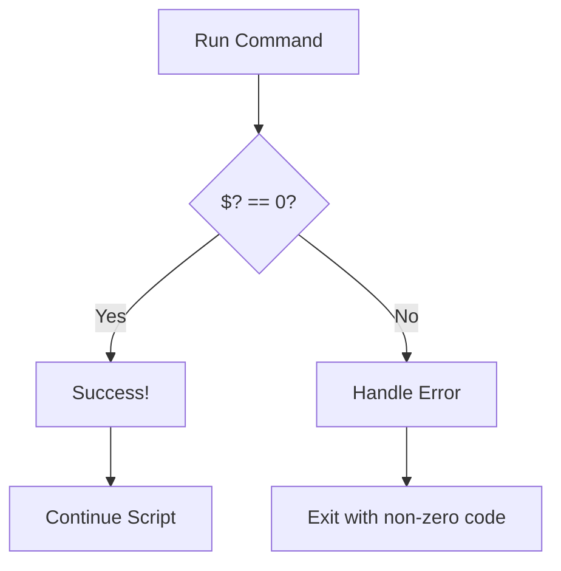
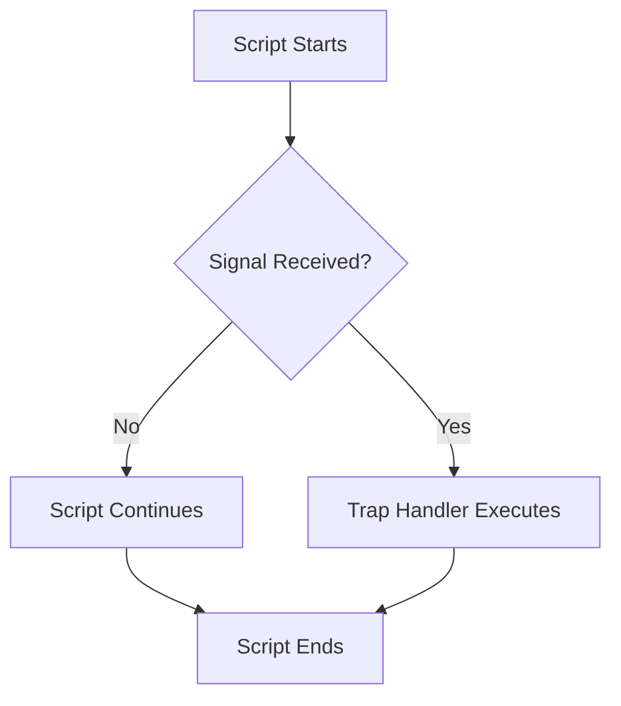
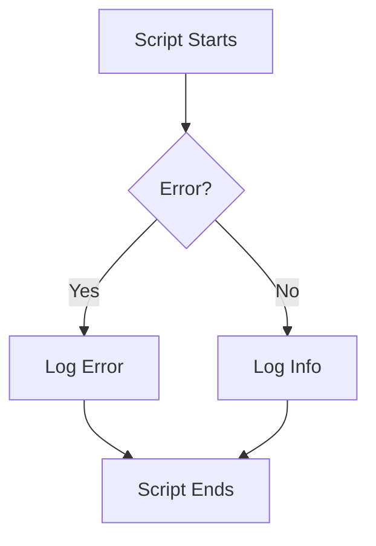

# <span style="color:#e67e22;">What we will learn in this post?</span>
<ul style='list-style-type: none; padding-left: 0;'>
<li><span style='color: #2980b9; font-size: 20px; font-weight: bold;'>👉</span> <span style='color: #2ecc71; font-size: 18px; font-weight: bold;'>Introduction to Error Handling in Shell Scripts</span></li>
<li><span style='color: #2980b9; font-size: 20px; font-weight: bold;'>👉</span> <span style='color: #2ecc71; font-size: 18px; font-weight: bold;'>Using Exit Status and Error Codes</span></li>
<li><span style='color: #2980b9; font-size: 20px; font-weight: bold;'>👉</span> <span style='color: #2ecc71; font-size: 18px; font-weight: bold;'>Handling Errors with Trap Command</span></li>
<li><span style='color: #2980b9; font-size: 20px; font-weight: bold;'>👉</span> <span style='color: #2ecc71; font-size: 18px; font-weight: bold;'>Debugging Shell Scripts with set Options</span></li>
<li><span style='color: #2980b9; font-size: 20px; font-weight: bold;'>👉</span> <span style='color: #2ecc71; font-size: 18px; font-weight: bold;'>Logging and Error Messages in Shell</span></li>
<li><span style='color: #2980b9; font-size: 20px; font-weight: bold;'>👉</span> <span style='color: #2ecc71; font-size: 18px; font-weight: bold;'>Conclusion!</span></li>
</ul>

# <span style="color:#e67e22">Error Handling in Shell Scripts ⚠️</span>

## <span style="color:#2980b9">Why Handle Errors? 🤔</span>

Shell scripts often run multiple commands.  Without error handling, a single failing command can halt the entire script, leaving you unsure what went wrong.  Robust error handling prevents this, ensuring your script is reliable and informative.

### <span style="color:#8e44ad">Using Exit Codes</span>

Every command returns an *exit code*, stored in the special variable `$?`.  A code of `0` signifies success; any other value indicates failure. We can check this to take action.


## <span style="color:#2980b9">Example: Checking for File Existence</span>

```bash
if [ ! -f "/path/to/my/file.txt" ]; then
  echo "Error: File not found!" >&2  # Send error to stderr
  exit 1                           # Indicate failure
fi
```

This checks if `/path/to/my/file.txt` exists. If not, it prints an error message to standard error (`>&2`) and exits with code `1`.


## <span style="color:#2980b9">Example:  Handling `grep` Failure</span>

```bash
grep "pattern" myfile.txt
if [ $? -ne 0 ]; then
  echo "Error: Pattern not found!" >&2
  exit 1
fi
```

This checks if `grep` found the pattern.  A non-zero exit code means the pattern wasn't found.


## <span style="color:#2980b9">Flowchart ➡️</span>




* **Tip:** Always test your script thoroughly!


For more information:

* [Advanced Bash Scripting Guide](https://tldp.org/LDP/abs/)


Remember, error handling makes your scripts more robust and easier to debug! 👍


# <span style="color:#e67e22">Understanding Exit Status Codes in Shell Scripts</span> 💫

Shell commands return *exit status codes*, which are numbers indicating success (0) or failure (non-zero).  This lets you control script flow.

## <span style="color:#2980b9">Using Exit Codes for Control</span> 🚦

The `exit` command lets you set the exit status.  For example:

```bash
if [ some_condition ]; then
  echo "Condition met!"
  exit 0  # Success
else
  echo "Condition not met!"
  exit 1  # Failure
fi
```

## <span style="color:#2980b9">&& and || Operators</span> ⛓️

*   `&&`:  Runs the second command *only if* the first succeeds (exit code 0).
*   `||`: Runs the second command *only if* the first fails (non-zero exit code).

### <span style="color:#8e44ad">Examples</span>

```bash
command1 && command2  # command2 runs only if command1 succeeds
command3 || command4  # command4 runs only if command3 fails
```

This allows for elegant error handling and conditional execution within your shell scripts.


```mermaid
graph TD
    A[command1] -->|Success (0)| B(command2);
    A -->|Failure (non-0)| C[End];
    D[command3] -->|Success (0)| E[End];
    D -->|Failure (non-0)| F(command4);
```

For more information, check out these resources:

* [Bash Guide](https://tldp.org/LDP/Bash-Beginners-Guide/html/)
* [Advanced Bash-Scripting Guide](https://tldp.org/LDP/abs/html/)


Remember,  a well-structured script carefully utilizes exit codes to ensure robustness and reliability.


# <span style="color:#e67e22">Handling Errors Gracefully with `trap` 💥</span>

Shell scripts can sometimes crash unexpectedly.  The `trap` command is your friend for cleaning up after such events!  It lets you specify commands to run when certain *signals* occur. Think of signals as interruptions – like when you press Ctrl+C (SIGINT) to stop a program.

## <span style="color:#2980b9">Trapping Signals ⚠️</span>

### <span style="color:#8e44ad">SIGINT (Ctrl+C)</span>

Let's say you have a script downloading files. If interrupted, you'd want it to save progress or delete temporary files.  `trap` helps:

```bash
trap "echo 'Cleaning up...' ; rm -f temp_file.txt; exit" INT
# ... your download script ...
```

This code runs `"echo 'Cleaning up...' ; rm -f temp_file.txt; exit"` when `SIGINT` (signal number 2, represented by `INT`) is received.


### <span style="color:#8e44ad">SIGTERM (Termination)</span>

`SIGTERM` is a more polite way to stop a process.  You might use it like this:

```bash
trap "echo 'Shutting down gracefully...'; exit 0" TERM
# ... your long-running script ...
```

This example gracefully exits, providing a clean shutdown message.


## <span style="color:#2980b9">Example Flowchart</span>



* **Key takeaway:**  Use `trap` to define actions for handling unexpected events, ensuring data integrity and preventing resource leaks.

For more detailed information on signals and the `trap` command, check out the  [Bash manual](https://www.gnu.org/software/bash/manual/bash.html).


# <span style="color:#e67e22">Bash Debugging with `set -x`, `set -e`, and `set -u` 🐞</span>

## <span style="color:#2980b9">Understanding the Options</span>

Let's make debugging your Bash scripts easier!  These three options are your best friends:

*   `set -x`:  Prints each command *before* it's executed.  Think of it as a command echo.  This helps trace the script's execution flow.
*   `set -e`:  Stops script execution immediately if *any* command fails (exits with a non-zero status). This helps catch errors early.
*   `set -u`:  Treats unset variables as errors. Prevents unexpected behavior from using uninitialized variables.


## <span style="color:#2980b9">Example in Action</span>

```bash
#!/bin/bash
set -x  # Turn on tracing
set -e  # Stop on error
set -u  # Treat unset variables as errors

MY_VAR="Hello"
echo "$MY_VAR"
#UNSET_VAR #This will cause an error because of set -u
echo "$UNSET_VAR"  
```

Running this script with `set -x` will show you each command before it runs. `set -e` will stop the script at the line with `UNSET_VAR`. `set -u` makes sure the script doesn't silently proceed with an undefined variable.

### <span style="color:#8e44ad">Enabling Debugging</span>

Simply add `set -x`, `set -e`, and `set -u` at the beginning of your script.  To disable them, use `set +x`, `set +e`, `set +u`.

## <span style="color:#2980b9">Debugging Flowchart 📈</span>

```mermaid
graph TD
    A[Start Script] --> B{set -x, -e, -u?};
    B -- Yes --> C[Execute command, print command];
    C -- Success --> D[Next command];
    C -- Failure --> E[Stop Script (set -e)];
    B -- No --> F[Execute command];
    F -- Success --> D;
    F -- Failure --> G[Continue execution];
    D --> H[End Script];
    G --> H;
```

Remember to remove or comment out these lines once debugging is complete!  For more information, check out the Bash manual: [Bash Manual](https://www.gnu.org/software/bash/manual/bash.html)


# <span style="color:#e67e22">Shell Script Logging:  A Friendly Guide 📝</span>

Logging is super important for debugging and monitoring your shell scripts! Here's how to do it effectively using `logger`, `echo`, and file redirection.

## <span style="color:#2980b9">Methods for Logging</span>

### <span style="color:#8e44ad">Using `logger`</span>

The `logger` command sends messages to the system log.  It's great for system-level events.

```bash
logger -t "MyScript" "Starting script execution"
```

### <span style="color:#8e44ad">Using `echo` and Redirection</span>

For simpler logs, redirect `echo` output to a file:

```bash
echo "$(date) - INFO: Script started" >> my_script.log
```

### <span style="color:#8e44ad">Structured Logging with `echo`</span>

For better readability, use a consistent format:

```bash
echo "$(date +"%Y-%m-%d %H:%M:%S") - ERROR: File not found: $filename" >> error.log
```


## <span style="color:#2980b9">Log Management</span>

*   **Regular cleanup:**  Old log files can eat up disk space. Use tools like `logrotate` for automated management.
*   **Log analysis:** Tools like `grep`, `awk`, and `sed` can help you search and filter log entries.

Remember to consider security and permissions when creating and managing your log files.

---

**Further Resources:**

*   [Logrotate man page](https://man7.org/linux/man-pages/man8/logrotate.8.html)
*   [Bash Guide](https://tldp.org/LDP/Bash-Beginners-Guide/html/)


**Example Flowchart (Mermaid):**




Here are a few options for your blog's conclusion, all under 150 words and using the requested formatting:


**Option 1:**

<h1><span style='color:#e67e22'>Conclusion</span></h1>

So there you have it!  I hope you enjoyed this post.  What are your thoughts?  Let me know in the comments below! 👇  I'd love to hear your feedback and any suggestions you might have. 😊


**Option 2:**

<h1><span style='color:#e67e22'>Conclusion</span></h1>

And that's a wrap! 🎉  Thanks for reading.  Don't be shy – share your opinions, questions, or brilliant ideas in the comments section!  Let's chat! 💬


**Option 3:**

<h1><span style='color:#e67e22'>Conclusion</span></h1>

We've reached the end of our journey together!  I really appreciate you taking the time to read this.  Now it's your turn!  Leave a comment – I'm eager to see what you think! 👍


**Option 4:**

<h1><span style='color:#e67e22'>Conclusion</span></h1>

Well, that's all for now folks!  I hope this was helpful.  Your feedback is super valuable to me, so please drop a comment below!  Let's keep the conversation going!  🥳


