# <span style="color:#e67e22;">What we will learn in this post?</span>

<ul style='list-style-type: none; padding-left: 0;'>
<li><span style='color: #2980b9; font-size: 20px; font-weight: bold;'>👉</span> <span style='color: #2ecc71; font-size: 18px; font-weight: bold;'>C++ Pointers and References</span></li>
<li><span style='color: #2980b9; font-size: 20px; font-weight: bold;'>👉</span> <span style='color: #2ecc71; font-size: 18px; font-weight: bold;'>C++ Pointers</span></li>
<li><span style='color: #2980b9; font-size: 20px; font-weight: bold;'>👉</span> <span style='color: #2ecc71; font-size: 18px; font-weight: bold;'>C++ Pointer Arithmetic</span></li>
<li><span style='color: #2980b9; font-size: 20px; font-weight: bold;'>👉</span> <span style='color: #2ecc71; font-size: 18px; font-weight: bold;'>Dangling, Void, Null, and Wild Pointers</span></li>
<li><span style='color: #2980b9; font-size: 20px; font-weight: bold;'>👉</span> <span style='color: #2ecc71; font-size: 18px; font-weight: bold;'>Applications of Pointers</span></li>
<li><span style='color: #2980b9; font-size: 20px; font-weight: bold;'>👉</span> <span style='color: #2ecc71; font-size: 18px; font-weight: bold;'>C++ nullptr</span></li>
<li><span style='color: #2980b9; font-size: 20px; font-weight: bold;'>👉</span> <span style='color: #2ecc71; font-size: 18px; font-weight: bold;'>C++ References</span></li>
<li><span style='color: #2980b9; font-size: 20px; font-weight: bold;'>👉</span> <span style='color: #2ecc71; font-size: 18px; font-weight: bold;'>Can references refer to an invalid location in C++?</span></li>
<li><span style='color: #2980b9; font-size: 20px; font-weight: bold;'>👉</span> <span style='color: #2ecc71; font-size: 18px; font-weight: bold;'>Difference Between Pointers and References in C++</span></li>
<li><span style='color: #2980b9; font-size: 20px; font-weight: bold;'>👉</span> <span style='color: #2ecc71; font-size: 18px; font-weight: bold;'>Passing by pointer Vs Passing by Reference in C++</span></li>
<li><span style='color: #2980b9; font-size: 20px; font-weight: bold;'>👉</span> <span style='color: #2ecc71; font-size: 18px; font-weight: bold;'>When do we pass arguments by reference or pointer?</span></li>
<li><span style='color: #2980b9; font-size: 20px; font-weight: bold;'>👉</span> <span style='color: #2ecc71; font-size: 18px; font-weight: bold;'>Conclusion!</span></li>
</ul>

# <span style="color:#e67e22">Pointers and References in C++ ✨</span>

Pointers and references are powerful tools in C++ that let you manipulate memory directly. Think of them as _indirect ways_ to access variables.

## <span style="color:#2980b9">Pointers: Memory Addresses 📍</span>

A pointer is a variable that holds the _memory address_ of another variable. We declare them using an asterisk (`*`).

```c++
int num = 10;
int *ptr = &num; // ptr now holds the address of num
```

- `&num` gives the memory address of `num`.
- `*ptr` accesses the _value_ at the address stored in `ptr`.

### <span style="color:#8e44ad">Pointer Arithmetic ➕➖</span>

You can perform arithmetic on pointers (adding/subtracting) to move through memory, useful for working with arrays. However, be cautious—incorrect pointer arithmetic can lead to crashes!

## <span style="color:#2980b9">References: Aliases 🔗</span>

A reference is an _alias_ for an existing variable. You declare them using an ampersand (`&`).

```c++
int num = 10;
int &ref = num; // ref is now another name for num
```

Changes made through `ref` directly affect `num` and vice-versa. Once initialized, a reference cannot be changed to refer to a different variable.

## <span style="color:#2980b9">Memory Management 💾</span>

- **Pointers:** Require manual memory management (using `new` and `delete`) to allocate and deallocate memory. Forgetting `delete` leads to memory leaks.
- **References:** Automatically managed by the compiler. No manual memory allocation/deallocation is needed.

Pointers offer more flexibility but demand careful handling. References are simpler and safer, but less flexible. Choose wisely based on your needs!

---

**Resources:**

- [Pointers in C++](https://www.cplusplus.com/doc/tutorial/pointers/)
- [References in C++](https://www.cplusplus.com/doc/tutorial/references/)

---

**Diagram (Conceptual):**

```mermaid
graph LR
    A["🔢 Variable num (value: 10)"] --> B["📍 Memory Address: 0x1234"];
    C["🛑 Pointer ptr"] --> B;
    D["🔗 Reference ref"] --> A;

    %% Custom Styles
    classDef variableStyle fill:#1E90FF,stroke:#00008B,color:#FFFFFF,font-size:14px,stroke-width:3px,rx:15px,shadow:5px;
    classDef addressStyle fill:#FFD700,stroke:#B8860B,color:#000000,font-size:14px,stroke-width:3px,rx:15px,shadow:5px;
    classDef pointerStyle fill:#FF4500,stroke:#8B0000,color:#FFFFFF,font-size:14px,stroke-width:3px,rx:15px,shadow:5px;
    classDef referenceStyle fill:#32CD32,stroke:#006400,color:#000000,font-size:14px,stroke-width:3px,rx:15px,shadow:5px;

    %% Apply Classes Separately
    class A variableStyle;
    class B addressStyle;
    class C pointerStyle;
    class D referenceStyle;

```



# <span style="color:#e67e22">Understanding Pointers in C++ 🚀</span>

Pointers are like treasure maps in C++! Instead of holding a value directly, they hold the _memory address_ where a value is stored. Think of it like having a map showing where the treasure (your data) is buried.

## <span style="color:#2980b9">Declaring Pointers 🗺️</span>

To declare a pointer, you use an asterisk `*` before the variable name. The type before the asterisk specifies the data type the pointer will point to.

```c++
int *ptr; // ptr is a pointer to an integer
double *dptr; // dptr is a pointer to a double
```

### <span style="color:#8e44ad">Initializing Pointers 👶</span>

Pointers need to be initialized before use to prevent errors (undefined behavior). You can initialize them to `nullptr` (meaning they point to nothing) or to the address of a variable using the address-of operator `&`.

```c++
int num = 10;
int *ptr = &num; // ptr now points to the memory location of num
```

## <span style="color:#2980b9">Using Pointers ✨</span>

You access the value a pointer points to using the dereference operator `*`.

```c++
int value = *ptr; // value now holds the value of num (10)
*ptr = 20;       // Changes the value of num to 20
```

## <span style="color:#2980b9">Example Scenario 💡</span>

Let's say you want to swap two numbers. Using pointers makes it efficient:

```c++
void swap(int *a, int *b) {
  int temp = *a;
  *a = *b;
  *b = temp;
}
```

- `a` and `b` are pointers to integers.
- The function modifies the original values directly through the pointers.

**Remember:** Pointers are powerful but require careful handling. Misuse can lead to crashes or unexpected behavior. Always initialize and check your pointers!

[More on Pointers](https://www.geeksforgeeks.org/pointers-in-c/)

# <span style="color:#e67e22">Pointer Arithmetic in C++ ✨</span>

Pointers in C++ hold memory addresses. Pointer arithmetic lets you easily move between memory locations. Think of it like navigating a street using addresses; instead of houses, we have memory locations.

## <span style="color:#2980b9">Incrementing and Decrementing Pointers ⬆️⬇️</span>

### <span style="color:#8e44ad">Incrementing (++):</span>

Incrementing a pointer moves it to the _next_ memory location of the _pointed-to data type_.

```c++
int numbers[] = {10, 20, 30};
int *ptr = numbers; // ptr points to numbers[0]

ptr++; // ptr now points to numbers[1]
```

- `ptr` initially points to `numbers[0]`.
- `ptr++` adds the size of an `int` to the address stored in `ptr`.

### <span style="color:#8e44ad">Decrementing (--):</span>

Decrementing a pointer moves it to the _previous_ memory location of the _pointed-to data type_.

```c++
int numbers[] = {10, 20, 30};
int *ptr = &numbers[2]; // ptr points to numbers[2]

ptr--; // ptr now points to numbers[1]
```

- `ptr` initially points to `numbers[2]`.
- `ptr--` subtracts the size of an `int` from the address stored in `ptr`.

## <span style="color:#2980b9">Example: Adding and Subtracting Integers to Pointers</span>

You can add or subtract integers to pointers, but remember it's scaled by the size of the data type.

```c++
int *ptr = numbers;
ptr += 2; // ptr now points to numbers[2] (equivalent to ptr = ptr + 2)
```

**Important Note:** Always be cautious! Going beyond the allocated memory for an array can lead to _undefined behavior_ and crashes.

For more in-depth information:

- [Pointers in C++](https://www.cplusplus.com/doc/tutorial/pointers/)

Remember to always compile and run your code to see the effects of pointer arithmetic in action! Good luck! 👍

# <span style="color:#e67e22">Understanding Different Types of Pointers in C++ 📌</span>

Pointers are like addresses in memory that hold the location of data. However, they can sometimes be problematic. Let's explore some pointer types:

## <span style="color:#2980b9">Null Pointers 🚫</span>

A null pointer intentionally points to nothing. It's like an empty address. This is generally safe and often used to indicate that a pointer doesn't currently refer to any valid memory location.

- **Example:** `int* ptr = nullptr;`

## <span style="color:#2980b9">Void Pointers ✨</span>

A `void` pointer can hold the address of _any_ data type. Think of it as a generic pointer. However, you can't directly dereference a `void` pointer (access the data it points to) without casting it to a specific type first.

- **Example:** `void* ptr;`

## <span style="color:#2980b9">Dangling Pointers ☠️</span>

A dangling pointer points to memory that has been deallocated (freed). It's like having an address that no longer exists. Accessing a dangling pointer leads to unpredictable behavior, often crashes.

- **Example:** A pointer to a variable that goes out of scope or a dynamically allocated memory block that is `delete`d.

## <span style="color:#2980b9">Wild Pointers 😈</span>

A wild pointer is an uninitialized pointer. It points to a random memory location. Dereferencing a wild pointer is extremely dangerous, potentially corrupting data or crashing your program.

- **Example:** `int* ptr;  // ptr is uninitialized and points to some random place in memory.`

### <span style="color:#8e44ad">Potential Issues and Best Practices</span>

- **Always initialize pointers:** Assign a value (like `nullptr`) when you declare a pointer.
- **Avoid dangling pointers:** Carefully manage memory allocation and deallocation using `new/delete` or smart pointers.
- **Be cautious with `void` pointers:** Cast them to the correct type before dereferencing.
- **Never dereference a wild pointer or a dangling pointer!**

**For more in-depth information:**

- [Effective C++](https://isocpp.org/std/the-standard) (Scott Meyers) - This book dives deep into various aspects of C++, including effective pointer usage.
- [C++ documentation](https://en.cppreference.com/w/cpp) - this will provide you with up-to-date documentation on C++ features.

This information will help you understand and prevent common pointer-related errors in your C++ programs. Remember to be mindful of these pointer types and always follow safe coding practices!

# <span style="color:#e67e22">Pointers in C++: A Friendly Guide 🚀</span>

Pointers are like treasure maps in C++! They hold the _memory address_ of a variable, letting you access and manipulate data indirectly. Let's explore their uses:

## <span style="color:#2980b9">Dynamic Memory Allocation 💾</span>

Pointers are essential for creating variables _on the fly_ using `new` and `delete`.

### <span style="color:#8e44ad">Example: Creating an integer dynamically</span>

```c++
int *dynamicInt = new int; // Allocate memory for an integer
*dynamicInt = 10;         // Assign a value (dereferencing using *)
delete dynamicInt;        // Release the memory
```

This creates an integer, stores 10 in it, and then properly cleans up. Failing to use `delete` leads to _memory leaks_!

## <span style="color:#2980b9">Data Structure Manipulation ⛓️</span>

Pointers are the backbone of many data structures like linked lists and trees.

### <span style="color:#8e44ad">Linked List Node</span>

```c++
struct Node {
  int data;
  Node *next; // Pointer to the next node
};
```

Each node points to the next, creating a chain. This allows efficient insertion and deletion without shifting elements around.

## <span style="color:#2980b9">Function Arguments ✨</span>

Pointers enable functions to modify data _outside_ their scope.

### <span style="color:#8e44ad">Example: Swapping values</span>

```c++
void swap(int *a, int *b) {
  int temp = *a;
  *a = *b;
  *b = temp;
}
```

This function directly modifies the values at the provided memory addresses.

---

**Resources:**

- [LearnCpp.com](https://www.learncpp.com/) (Great tutorial site)
- [cppreference.com](https://en.cppreference.com/w/) (Comprehensive reference)

Remember to handle pointers carefully to avoid errors like segmentation faults or memory leaks! Happy coding! 😊

# <span style="color:#e67e22">Introducing `nullptr` in C++ ✨</span>

In C++, pointers are variables that hold memory addresses. Sometimes, a pointer doesn't point to anything. Before C++11, we used `NULL` to represent this "null" pointer. However, `NULL` had some drawbacks. Enter `nullptr`! 🎉

## <span style="color:#2980b9">Why `nullptr` is Better than `NULL`</span>

`nullptr` is a _keyword_ specifically designed for representing null pointers. This offers several advantages:

- **Type safety:** `nullptr` has its own type, which prevents accidental conversions to integers (a common source of errors with `NULL`). It’s a much cleaner way of handling empty pointers.
- **Improved readability:** `nullptr` clearly indicates your intention—to represent a null pointer—making your code easier to understand.
- **Reduced ambiguity:** `NULL` could be defined as 0, which might clash with integer values, leading to confusing situations.

### <span style="color:#8e44ad">Example: Initialization and Comparison</span>

```c++
int* myPtr = nullptr; // Initialize to null

if (myPtr == nullptr) { // Comparison is type-safe
  std::cout << "Pointer is null!" << std::endl;
}
```

## <span style="color:#2980b9">Visualizing the Difference</span>



```mermaid
graph LR
    A["❌ NULL (potentially 0)"] --> B["⚠️ Ambiguity / Type Issues"];
    C["✅ nullptr (dedicated type)"] --> D["🔒 Type-Safe / Clear"];

    %% Custom Styles
    classDef nullStyle fill:#FF6347,stroke:#8B0000,color:#FFFFFF,font-size:14px,stroke-width:3px,rx:15px,shadow:5px;
    classDef issueStyle fill:#FFD700,stroke:#B8860B,color:#000000,font-size:14px,stroke-width:3px,rx:15px,shadow:5px;
    classDef nullptrStyle fill:#32CD32,stroke:#006400,color:#000000,font-size:14px,stroke-width:3px,rx:15px,shadow:5px;
    classDef safeStyle fill:#1E90FF,stroke:#00008B,color:#FFFFFF,font-size:14px,stroke-width:3px,rx:15px,shadow:5px;

    %% Apply Classes Separately
    class A nullStyle;
    class B issueStyle;
    class C nullptrStyle;
    class D safeStyle;

```

**Key takeaways:**

- Use `nullptr` for initializing and comparing pointers to null in modern C++.
- It's type-safe, improves readability, and eliminates potential ambiguities compared to `NULL`.

For more information:

- [cplusplus.com](https://www.cplusplus.com/doc/tutorial/pointers/) (General pointer info)
- [en.cppreference.com](https://en.cppreference.com/w/cpp/language/nullptr) (`nullptr` specific details)

Remember to always choose `nullptr` over `NULL` in your C++ code for better type safety and clarity. Happy coding! 😊

# <span style="color:#e67e22">Understanding References and Pointers in C++ 🤔</span>

## <span style="color:#2980b9">References ✨</span>

References in C++ are _aliases_ for existing variables. Think of them as another name for the same memory location. Once a reference is initialized to a variable, it cannot be changed to refer to a different variable.

### <span style="color:#8e44ad">Example:</span>

```c++
int num = 10;
int& ref = num; // ref is a reference to num

ref = 20; // Modifies num as well!
std::cout << num; // Output: 20
```

- Key Point: A reference must be initialized when it's declared.

## <span style="color:#2980b9">Pointers 🎯</span>

Pointers, on the other hand, are _variables that store memory addresses_. They can be reassigned to point to different memory locations.

### <span style="color:#8e44ad">Example:</span>

```c++
int num = 10;
int* ptr = &num; // ptr stores the address of num

*ptr = 20; // Modifies num through ptr
std::cout << num; // Output: 20

int anotherNum = 30;
ptr = &anotherNum; // ptr now points to anotherNum
```

- Key Point: Pointers require the dereference operator (`*`) to access the value they point to. They can be `nullptr`.

## <span style="color:#2980b9">Key Differences 📌</span>

| Feature        | Reference                                 | Pointer                                  |
| -------------- | ----------------------------------------- | ---------------------------------------- |
| Initialization | Must be initialized at declaration        | Can be initialized later or be nullptr   |
| Reassignment   | Cannot be reassigned after initialization | Can be reassigned to different addresses |
| Syntax         | `&` (ampersand)                           | `*` (asterisk)                           |
| Usage          | Often used as function parameters         | More general-purpose memory management   |

For more in-depth information, you can check these resources:

- [cppreference.com](https://en.cppreference.com/w/) (General C++ reference)

Remember, references provide a cleaner and more concise way to work with aliases, while pointers offer greater flexibility in memory manipulation. Choose the appropriate tool for the job!

# <span style="color:#e67e22">Dangerous References: Can They Point to Nowhere in C++?</span> ⚠️

Yes, unfortunately, references in C++ can point to invalid memory locations, leading to crashes or unpredictable behavior. This is a significant source of bugs.

## <span style="color:#2980b9">Understanding the Problem</span> 🤔

A reference is like a _nickname_ for an existing variable. It _must_ be initialized when declared and cannot be changed to point to something else later. But what if the original variable goes out of scope or is deleted?

### <span style="color:#8e44ad">Example of a Dangling Reference</span> 💥

```c++
int* createInt(){
  int x = 10;
  return &x; // Returning a pointer to a local variable that goes out of scope.
}

int main() {
    int* ptr = createInt();
    int& ref = *ptr; // A reference to invalid memory!
    std::cout << ref << std::endl; //undefined behaviour.
    return 0;
}
```

In this example, `x` is destroyed when `createInt()` finishes. `ptr` now points to deallocated memory. The reference `ref` is equally invalid. Accessing `ref` results in _undefined behavior_.

## <span style="color:#2980b9">How to Avoid Problems</span> 🛡️

- **Careful memory management:** Avoid returning references or pointers to local variables from functions.
- **Smart pointers:** Use `std::unique_ptr`, `std::shared_ptr`, or `std::weak_ptr` to manage memory automatically and prevent dangling pointers.
- **Exception safety:** Ensure that your code handles exceptions correctly to prevent memory leaks and dangling references.

Remember, always double-check your code for potential dangling references. A simple oversight can lead to significant problems!

[More information on smart pointers](https://en.cppreference.com/w/cpp/memory) 📖

# <span style="color:#e67e22">Pointers vs. References in C++ 📌</span>

Pointers and references are both ways to work with memory addresses in C++, but they have key differences. Let's explore!

## <span style="color:#2980b9">Pointers 🚀</span>

### <span style="color:#8e44ad">Syntax and Memory</span>

- Pointers are declared using an asterisk (`*`). Example: `int* ptr;` declares a pointer `ptr` that can hold the address of an integer.
- Pointers can be `NULL` (pointing to nothing), changed after initialization, and require manual memory management (using `new` and `delete`).

### <span style="color:#8e44ad">Use Cases</span>

- Dynamic memory allocation.
- Passing data to functions efficiently (avoiding copying large objects).
- Implementing data structures like linked lists.

## <span style="color:#2980b9">References 🔗</span>

### <span style="color:#8e44ad">Syntax and Memory</span>

- References are declared using an ampersand (`&`). Example: `int& ref = num;` declares `ref` as a reference to the integer `num`.
- References _must_ be initialized when declared and cannot be `NULL` or changed to refer to another variable later. They automatically manage memory alongside the variable they refer to.

### <span style="color:#8e44ad">Use Cases</span>

- Passing data to functions to avoid copying (similar to pointers but safer).
- Creating aliases for existing variables.

## <span style="color:#2980b9">Key Differences Summarized 📝</span>

| Feature        | Pointer                           | Reference                              |
| -------------- | --------------------------------- | -------------------------------------- |
| Declaration    | `int* ptr;`                       | `int& ref = num;`                      |
| Initialization | Can be NULL, can be changed later | Must be initialized, cannot be changed |
| Memory Mgmt    | Manual (`new`, `delete`)          | Automatic                              |
| Null Value     | Allowed                           | Not Allowed                            |

[Learn More about Pointers](https://www.geeksforgeeks.org/pointers-in-c/)
[Learn More about References](https://www.geeksforgeeks.org/references-in-cpp/)

Remember, using references often leads to cleaner, less error-prone code than using pointers, especially for beginners. However, pointers provide more flexibility when you need it. Choose the tool that best suits your needs! ✨

# <span style="color:#e67e22">Pointers vs. References in C++ 📌</span>

Both pointers and references allow you to indirectly access and modify variables in C++, but they differ in how they do it. Let's explore!

## <span style="color:#2980b9">Passing by Pointer ➡️</span>

### <span style="color:#8e44ad">What it is</span>

A pointer is a variable that holds the _memory address_ of another variable. You pass a pointer by providing its address using the `&` operator.

_Example:_

```c++
void modifyValue(int *ptr) {
  *ptr = 10; // Modifies the original variable
}

int main() {
  int x = 5;
  modifyValue(&x); // Pass the address of x
  // x is now 10
  return 0;
}
```

### <span style="color:#8e44ad">When to use it</span>

Use pointers when:

- You need to modify the original variable within a function.
- You want to work with arrays or dynamically allocated memory.
- You need to handle the possibility of a null pointer (no address).

## <span style="color:#2980b9">Passing by Reference 🔗</span>

### <span style="color:#8e44ad">What it is</span>

A reference is an _alias_ for an existing variable. You pass a reference simply by using the variable's name.

_Example:_

```c++
void modifyValue(int &ref) {
  ref = 10; // Modifies the original variable
}

int main() {
  int x = 5;
  modifyValue(x); // Pass x by reference
  // x is now 10
  return 0;
}
```

### <span style="color:#8e44ad">When to use it</span>

Use references when:

- You need to modify the original variable within a function (like pointers, but more concise).
- You want to avoid the possibility of a null value (unlike pointers).

## <span style="color:#2980b9">Key Differences Summarized 📝</span>

| Feature        | Pointer                                    | Reference                        |
| -------------- | ------------------------------------------ | -------------------------------- |
| Declaration    | `int *ptr;`                                | `int &ref;`                      |
| Initialization | `ptr = &x;`                                | `ref = x;`                       |
| Null Possible  | Yes                                        | No                               |
| Syntax         | More complex, requires dereferencing (`*`) | Simpler, no dereferencing needed |

**In short:** References are generally preferred when you want to modify a variable within a function without the complexities of pointers and the risk of null pointer errors. Pointers offer more flexibility, especially when dealing with memory management. Choose the method that best suits your needs and coding style!

For more in-depth information:

- [Pointers in C++](https://www.geeksforgeeks.org/pointers-in-c-and-cpp/)
- [References in C++](https://www.geeksforgeeks.org/references-in-cpp/)

# <span style="color:#e67e22">Pass by Reference vs. Pointer in C++ 🤔</span>

Choosing between passing arguments by reference (`&`) or pointer (`*`) in C++ depends on your specific needs. Both allow modification of the original variable, but they differ subtly.

## <span style="color:#2980b9">When to Use References ✨</span>

References are generally preferred for simplicity and readability when you need to modify the original variable. They automatically dereference (you don't need to use `*`), making the code cleaner.

### <span style="color:#8e44ad">Example: Swapping Values</span>

```c++
void swap(int &a, int &b) {
  int temp = a;
  a = b;
  b = temp;
}
```

Here, `&a` and `&b` directly refer to the original variables, making the swap operation straightforward. No need for pointer arithmetic!

## <span style="color:#2980b9">When to Use Pointers 🎯</span>

Pointers offer more control and flexibility, especially when dealing with potentially null values or when you need to manipulate memory addresses directly. They are useful for dynamic memory allocation and returning multiple values from a function.

### <span style="color:#8e44ad">Example: Dynamic Memory Allocation</span>

```c++
void allocateArray(int **arr, int size) {
  *arr = new int[size]; // Allocate memory using pointer
}
```

Here, `int **arr` allows the function to create new memory and assign it to the caller’s pointer variable `arr`. Trying this with a simple reference would not work.

## <span style="color:#2980b9">Key Differences Summarized 📝</span>

- **References:** Cannot be null, simpler syntax, implicitly dereferenced. Use when modification is needed and null values aren't a concern.
- **Pointers:** Can be null, more complex syntax (requires explicit dereferencing with `*`), more control over memory management. Use when dealing with null values or dynamic memory allocation.

**Choosing wisely between references and pointers enhances code readability, safety and efficiency.** Remember to carefully consider null pointer checks when using pointers to prevent crashes. For more advanced information, check out resources on C++ memory management and pointers: [https://www.learncpp.com/](https://www.learncpp.com/) (example resource; many great resources exist online!)

<h1><span style='color:#e67e22'>Conclusion</span></h1>

So there you have it! We've covered a lot of ground today, and hopefully, you found this information helpful and insightful. 😊 But the conversation doesn't end here! We'd love to hear your thoughts, feedback, and any suggestions you might have. What did you think of [mention a specific point from the blog]? What other topics would you like us to explore? Let us know in the comments section below! 👇 We're always looking for ways to improve and your input is invaluable. Let's keep the conversation going! 💬
