# <span style="color:#e67e22;">What we will learn in this post?</span>

<ul style='list-style-type: none; padding-left: 0;'>
<li><span style='color: #2980b9; font-size: 20px; font-weight: bold;'>👉</span> <span style='color: #2ecc71; font-size: 18px; font-weight: bold;'>C++ Arrays</span></li>
<li><span style='color: #2980b9; font-size: 20px; font-weight: bold;'>👉</span> <span style='color: #2ecc71; font-size: 18px; font-weight: bold;'>C++ Multidimensional Arrays</span></li>
<li><span style='color: #2980b9; font-size: 20px; font-weight: bold;'>👉</span> <span style='color: #2ecc71; font-size: 18px; font-weight: bold;'>C++ Pointer to an Array</span></li>
<li><span style='color: #2980b9; font-size: 20px; font-weight: bold;'>👉</span> <span style='color: #2ecc71; font-size: 18px; font-weight: bold;'>Size of Array parameter</span></li>
<li><span style='color: #2980b9; font-size: 20px; font-weight: bold;'>👉</span> <span style='color: #2ecc71; font-size: 18px; font-weight: bold;'>Passing Arrays to Functions in C++</span></li>
<li><span style='color: #2980b9; font-size: 20px; font-weight: bold;'>👉</span> <span style='color: #2ecc71; font-size: 18px; font-weight: bold;'>What is Array Decay in C++? How can it be prevented?</span></li>
<li><span style='color: #2980b9; font-size: 20px; font-weight: bold;'>👉</span> <span style='color: #2ecc71; font-size: 18px; font-weight: bold;'>Conclusion!</span></li>
</ul>

# <span style="color:#e67e22">Understanding Arrays in C++ 🧮</span>

Arrays are like organized containers in C++ that hold multiple values of the _same_ data type. Think of them as a row of labeled boxes, each box holding a single item. You can access each item using its position (index) in the row.

## <span style="color:#2980b9">Array Structure 📦</span>

An array is a contiguous block of memory. This means all the elements are stored next to each other in memory. This makes accessing elements very fast.

### <span style="color:#8e44ad">Declaring and Initializing</span>

To create an array, you specify the data type and the number of elements:

```c++
int numbers[5]; // Declares an array named 'numbers' that can hold 5 integers.
```

You can initialize it at the same time:

```c++
int scores[3] = {85, 92, 78}; // Initializes an array with 3 integer values.
```

## <span style="color:#2980b9">Accessing Array Elements 🔎</span>

Each element is accessed using its _index_, which starts at 0. So, the first element is at index 0, the second at index 1, and so on.

```c++
int firstScore = scores[0]; // Accesses the first element (85)
```

## <span style="color:#2980b9">Example: Storing Student Grades 🧑‍🎓</span>

Let's say you want to store the grades of 5 students:

```c++
int grades[5] = {70, 80, 90, 65, 85};
```

You can then access and process each grade individually using their indices.

### <span style="color:#8e44ad">Important Note:</span> Array sizes are fixed at the time of declaration. You cannot easily change the size of an array after it's created

**For further learning:**

- [LearnCpp.com Arrays](https://www.learncpp.com/cpp-tutorial/arrays/) (Excellent resource for C++ beginners)
- [GeeksforGeeks Arrays](https://www.geeksforgeeks.org/arrays-in-cpp/) (More advanced topics on arrays)

Remember, arrays are fundamental in programming! Understanding them is key to working with more complex data structures later on. 😊

# <span style="color:#e67e22">Multidimensional Arrays in C++ 🧮</span>

## <span style="color:#2980b9">Beyond One Dimension</span>

Regular arrays in C++ store data in a single line (one dimension). Think of it like a single row of houses. Multidimensional arrays, however, are like a grid or a city block – they allow you to organize data in multiple dimensions (rows and columns, or even more!). This makes them perfect for representing things like tables, matrices, or images.

### <span style="color:#8e44ad">Extending the Concept</span>

Imagine you want to store the scores of 5 students across 3 tests. A single array wouldn't work efficiently. A 2D array is the solution! It’s essentially an array of arrays.

```c++
int scores[5][3] = {
  {85, 92, 78}, // Student 1's scores
  {70, 80, 95}, // Student 2's scores
  {90, 88, 92}, // Student 3's scores
  {75, 85, 80}, // Student 4's scores
  {65, 72, 90}  // Student 5's scores
};
```

Accessing elements is straightforward: `scores[2][1]` would give you student 3's score on test 2 (88).

## <span style="color:#2980b9">Example: A Simple Matrix</span>

Let's say you need to represent a 3x3 matrix:

```c++
int matrix[3][3] = {
    {1, 2, 3},
    {4, 5, 6},
    {7, 8, 9}
};
```

You can easily access and manipulate individual elements within the matrix.

## <span style="color:#2980b9">Advantages & Disadvantages</span>

- **Advantages:** Excellent for representing tabular data, easy to understand for simple structures.
- **Disadvantages:** Can be less flexible than other data structures (like vectors) for dynamic resizing and more complex data organization. Memory management needs to be handled carefully.

[Learn more about arrays in C++](https://www.geeksforgeeks.org/arrays-in-cpp/) 📚

**Note:** For more complex scenarios or dynamic sizing needs, consider using `std::vector` which offers more flexibility.

# <span style="color:#e67e22">Pointers and Arrays: A Friendly Guide 🤝</span>

In C++, arrays and pointers are closely related. A pointer is essentially a variable that holds the memory address of another variable. When you use a pointer with an array, the pointer points to the beginning (first element) of the array.

## <span style="color:#2980b9">Syntax and Examples ✨</span>

Let's explore the syntax with an example:

```c++
int numbers[] = {10, 20, 30, 40, 50};  // An array of integers
int *ptr = numbers; // ptr now points to the first element (numbers[0])

cout << *ptr; // Outputs 10 (dereferencing the pointer)
cout << *(ptr + 1); // Outputs 20 (accessing the second element)
cout << ptr[2]; // Outputs 30 (array-like access using the pointer)
```

### <span style="color:#8e44ad">What's happening?</span>

- `numbers` is an array holding 5 integers.
- `ptr` is a pointer to an integer; it's assigned the memory address of `numbers[0]`.
- `*ptr` _dereferences_ the pointer, giving you the _value_ at that address (10).
- `*(ptr + 1)` accesses the _next_ element. It's equivalent to `numbers[1]`.
- `ptr[i]` is equivalent to `*(ptr + i)`.

## <span style="color:#2980b9">Visual Representation 🗺️</span>


This diagram shows how `ptr` points to the start of the `numbers` array.

## <span style="color:#2980b9">Key Points to Remember 🤔</span>

- Pointers provide a flexible way to work with arrays.
- Array name (without brackets) decays to a pointer to its first element.
- Be mindful of pointer arithmetic and memory management to avoid errors.

For more in-depth information and advanced concepts:

- [LearnCpp.com](https://www.learncpp.com/) - Excellent C++ tutorial site
- [Cplusplus.com](https://www.cplusplus.com/) - Comprehensive C++ reference

Remember to always handle pointers carefully to avoid segmentation faults and other memory-related issues! Happy coding! 😊

# <span style="color:#e67e22">Determining Array Size in C++ 📏</span>

C++ doesn't automatically track array sizes when you pass them to functions. This can be tricky! Let's explore how to handle it.

## <span style="color:#2980b9">Passing Arrays to Functions</span>

### <span style="color:#8e44ad">Method 1: Passing Size Explicitly</span>

The best practice is to explicitly pass the array's size as a separate parameter.

```c++
void myFunction(int arr[], int size) {
  // size is now known within the function
  for (int i = 0; i < size; i++) {
      //Do something with arr[i]
  }
}
```

This method ensures you always know how many elements are in the array.

### <span style="color:#8e44ad">Method 2: Using `std::array` or `std::vector`</span>

For better size management, use `std::array` (fixed size) or `std::vector` (dynamic size) from the `<array>` and `<vector>` headers respectively. These containers _do_ track their size.

```c++
#include <array>
#include <vector>

void myFunction(std::array<int, 5> arr) { //Size is known
    for(int i =0; i < arr.size(); ++i)
    {
        //Do something with arr[i]
    }
}

void myFunction(std::vector<int> arr) { //Size is known
    for(int i =0; i < arr.size(); ++i)
    {
        //Do something with arr[i]
    }
}
```

## <span style="color:#2980b9">Key Points to Remember 🤔</span>

- **No implicit size:** When passing a raw array (e.g., `int arr[]`), the array _decays_ into a pointer, losing its size information.
- **Always pass size:** Always include a separate `size` parameter with raw arrays.
- **`std::array`/`std::vector`:** Prefer standard containers for automatic size tracking and safer memory management.

**Example Flowchart:**

```mermaid
graph TD
    A["📤 Pass array & size"] --> B{"🛠 Function"};
    C["🔁 Use size for loop"] --> D["⚙️ Process array"];
    B --> C;
    E["📦 Use std::array / vector"] --> F["✅ Size is tracked automatically"];

    %% Custom Styles
    classDef startStyle fill:#32CD32,stroke:#006400,color:#FFFFFF,font-size:14px,stroke-width:3px,rx:15px,shadow:5px;
    classDef funcStyle fill:#4682B4,stroke:#1E3A5F,color:#FFFFFF,font-size:14px,stroke-width:3px,rx:15px,shadow:5px;
    classDef loopStyle fill:#FFD700,stroke:#B8860B,color:#000000,font-size:14px,stroke-width:3px,rx:15px,shadow:5px;
    classDef processStyle fill:#FF8C00,stroke:#8B4500,color:#FFFFFF,font-size:14px,stroke-width:3px,rx:15px,shadow:5px;
    classDef containerStyle fill:#DC143C,stroke:#8B0000,color:#FFFFFF,font-size:14px,stroke-width:3px,rx:15px,shadow:5px;
    classDef trackStyle fill:#9400D3,stroke:#4B0082,color:#FFFFFF,font-size:14px,stroke-width:3px,rx:15px,shadow:5px;

    %% Apply Classes
    class A startStyle;
    class B funcStyle;
    class C loopStyle;
    class D processStyle;
    class E containerStyle;
    class F trackStyle;

```



For more in-depth information, explore these resources:

- [cppreference.com](https://en.cppreference.com/w/cpp) (Excellent C++ reference)
- [Your favorite C++ tutorial](https://www.google.com/search?q=c%2B%2B+tutorial) (Search for a beginner-friendly tutorial)

Remember to choose the method that best fits your needs, prioritizing clarity and safety! 👍

# <span style="color:#e67e22">Passing Arrays to C++ Functions 🤝</span>

In C++, you can pass arrays to functions in a few ways. Let's explore the common methods:

## <span style="color:#2980b9">Passing by Pointer ⭐</span>

This is the most common and efficient way. You pass the _address_ of the array's first element. Changes made inside the function _affect_ the original array.

```c++
void modifyArray(int *arr, int size) {
  arr[0] = 100; // Modifies the original array
}

int main() {
  int myArray[] = {1, 2, 3};
  modifyArray(myArray, 3);  // Passing the array's address
  return 0;
}
```

### <span style="color:#8e44ad">Implications</span>

- _Efficient_: Only the memory address is passed.
- _Modifies Original_: Changes within the function are reflected outside.

## <span style="color:#2980b9">Passing by Reference 📌</span>

Using a reference is similar to pointers, but with a cleaner syntax.

```c++
void modifyArrayRef(int (&arr)[3]) { //Note the size declaration is necessary
  arr[0] = 200;
}

int main() {
  int myArray[] = {1, 2, 3};
  modifyArrayRef(myArray);
  return 0;
}
```

### <span style="color:#8e44ad">Implications</span>

- _Clean Syntax_: Easier to read and write than pointer methods.
- _Modifies Original_: Just like pointers, it modifies the original array. Note that the array size needs to be specified in the function definition.

## <span style="color:#2980b9">Passing by Value (Generally Avoid) 🚫</span>

This copies the entire array, which is inefficient for large arrays. It also means changes inside the function don't affect the original. It is usually avoided for large arrays.

**Key Differences Summarized:**

| Method       | Syntax                                               | Efficiency | Modifies Original? |
| ------------ | ---------------------------------------------------- | ---------- | ------------------ |
| Pointer      | `void func(int *arr)`                                | High       | Yes                |
| Reference    | `void func(int (&arr)[size])`                        | High       | Yes                |
| Value (Copy) | `void func(int arr[])` or `void func(int arr[size])` | Low        | No                 |

For more detailed information, check out these resources (links would go here if this were a webpage). Remember to choose the method that best suits your needs, prioritizing efficiency and code clarity!

# <span style="color:#e67e22">Array Decay in C++ 🤔</span>

## <span style="color:#2980b9">Understanding Array Decay</span>

In C++, when you pass an array to a function _without_ explicitly specifying its size, it "decays" into a pointer to its first element. This means the function receives only the address of the array's beginning, not the array's size or its data as a whole.

### <span style="color:#8e44ad">Effects on Function Parameters</span>

This decay can lead to problems. Consider:

```c++
void myFunc(int arr[]) { // arr decays to int*
  //  You lose track of the array's size here!
}

int main() {
  int myArray[5] = {1,2,3,4,5};
  myFunc(myArray); // Array decays here!
  return 0;
}
```

The function `myFunc` has no way of knowing how many elements are in `myArray`.

## <span style="color:#2980b9">Preventing Array Decay 🛡️</span>

We can prevent decay using these strategies:

- **Passing the size explicitly:**

```c++
void myFunc(int arr[], int size) {
  for (int i = 0; i < size; ++i) {
    // ... use arr[i] ...
  }
}
```

- **Using `std::array` or `std::vector`:** These standard template library containers store size information along with the elements. This eliminates the need to pass the size separately.

```c++
#include <array>
void myFunc(const std::array<int, 5>& arr) {
    //Access elements using arr[i]
}
```

- **Using pointers and sizes (for dynamic arrays):** If you're using dynamically allocated arrays (via `new`), remember to explicitly pass the size.

```mermaid
graph LR
    A["📦 Array myArray"] --> B["📍 int* pointer"];
    B --> C{"🛠 Function myFunc"};
    C --> D["⚠️ Loss of size information"];

    %% Custom Styles
    classDef arrayStyle fill:#32CD32,stroke:#006400,color:#FFFFFF,font-size:14px,stroke-width:3px,rx:15px,shadow:5px;
    classDef pointerStyle fill:#4682B4,stroke:#1E3A5F,color:#FFFFFF,font-size:14px,stroke-width:3px,rx:15px,shadow:5px;
    classDef functionStyle fill:#FFD700,stroke:#B8860B,color:#000000,font-size:14px,stroke-width:3px,rx:15px,shadow:5px;
    classDef warningStyle fill:#FF0000,stroke:#8B0000,color:#FFFFFF,font-size:14px,stroke-width:3px,rx:15px,shadow:5px;

    %% Apply Classes
    class A arrayStyle;
    class B pointerStyle;
    class C functionStyle;
    class D warningStyle;

```

## <span style="color:#2980b9"> Visual Representation 📊</span>



For more detailed information and advanced techniques, consult: [https://en.cppreference.com/w/cpp/language/array](https://en.cppreference.com/w/cpp/language/array) (CPP Reference) and your favorite C++ textbook. Remember to always handle array sizes carefully to avoid unexpected behavior! 😊

<h1><span style='color:#e67e22'>Conclusion</span></h1>

So there you have it! We've covered a lot of ground today, and hopefully, you found this information helpful and interesting 😊. We're always striving to improve, and your feedback is incredibly valuable to us. So, what are your thoughts? Let us know in the comments below 👇 – we'd love to hear your opinions, suggestions, or even just a quick hello 👋! Let's keep the conversation going! 🎉
