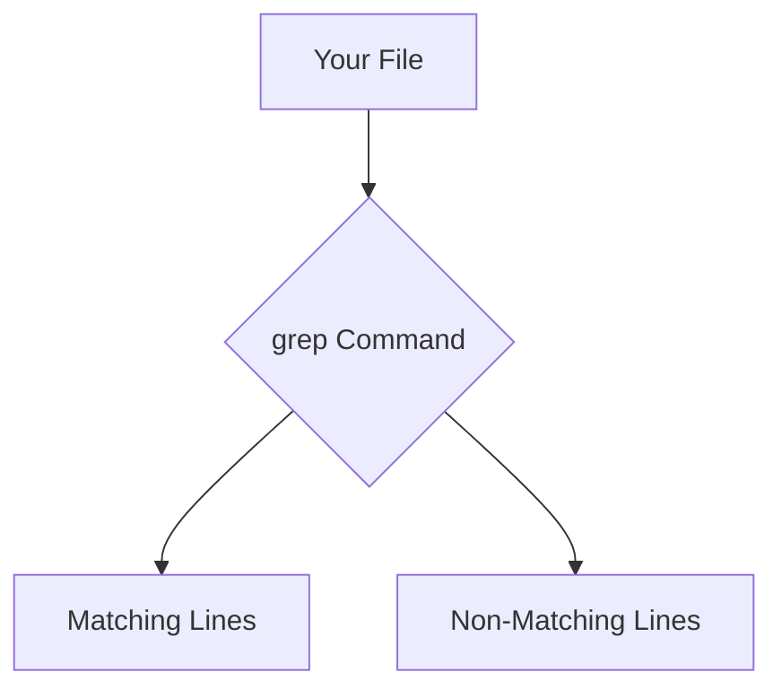
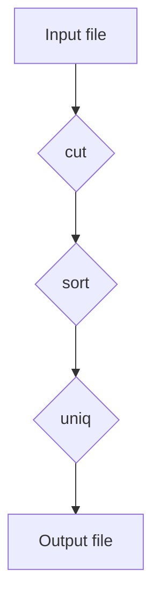

# <span style="color:#e67e22;">What we will learn in this post?</span>
<ul style='list-style-type: none; padding-left: 0;'>
<li><span style='color: #2980b9; font-size: 20px; font-weight: bold;'>👉</span> <span style='color: #2ecc71; font-size: 18px; font-weight: bold;'>File Searching with Find Command</span></li>
<li><span style='color: #2980b9; font-size: 20px; font-weight: bold;'>👉</span> <span style='color: #2ecc71; font-size: 18px; font-weight: bold;'>Pattern Matching with Grep</span></li>
<li><span style='color: #2980b9; font-size: 20px; font-weight: bold;'>👉</span> <span style='color: #2ecc71; font-size: 18px; font-weight: bold;'>Text Processing with Sed</span></li>
<li><span style='color: #2980b9; font-size: 20px; font-weight: bold;'>👉</span> <span style='color: #2ecc71; font-size: 18px; font-weight: bold;'>Data Extraction and Formatting with Awk</span></li>
<li><span style='color: #2980b9; font-size: 20px; font-weight: bold;'>👉</span> <span style='color: #2ecc71; font-size: 18px; font-weight: bold;'>Working with Cut, Sort, and Uniq</span></li>
<li><span style='color: #2980b9; font-size: 20px; font-weight: bold;'>👉</span> <span style='color: #2ecc71; font-size: 18px; font-weight: bold;'>Merging and Comparing Files with Diff and Patch</span></li>
<li><span style='color: #2980b9; font-size: 20px; font-weight: bold;'>👉</span> <span style='color: #2ecc71; font-size: 18px; font-weight: bold;'>Conclusion!</span></li>
</ul>

# <span style="color:#e67e22">Finding Files with `find` 🔎</span>

The `find` command is your best friend for locating files and directories on Linux/macOS.  It's incredibly powerful and flexible!

## <span style="color:#2980b9">Searching by Name and Type</span>

To find files named `myfile.txt`:

```bash
find . -name "myfile.txt"
```

The `.` means "start searching in the current directory".  To find all `.pdf` files recursively:

```bash
find . -name "*.pdf"
```

### <span style="color:#8e44ad">Finding Directories</span>

To find all directories:

```bash
find . -type d
```

## <span style="color:#2980b9">Searching by Size and Time</span>

Find files larger than 10MB:

```bash
find . -size +10M
```

Find files modified in the last 7 days:

```bash
find . -mtime -7
```

## <span style="color:#2980b9">Deleting Files Safely ⚠️</span>

*Never* delete files directly with `find` without double-checking!  First, *always* test with a dry run:

```bash
find . -name "*.tmp" -print  # Lists files
```

Then, if you're sure, add `-delete`:

```bash
find . -name "*.tmp" -delete # DELETES files
```

**Caution:**  `-delete` is powerful and irreversible! Use with extreme care.


[Learn more about `find`](https://www.gnu.org/software/findutils/manual/find.html)


```mermaid
graph TD
    A[Start] --> B{Specify Search Criteria};
    B --> C[Find Command Execution];
    C --> D{Results Displayed};
    D --> E[Delete (Optional)];
    E --> F[End];
```


# <span style="color:#e67e22">Using `grep` for Text Filtering 🔎</span>

`grep` is a powerful command-line tool for searching text within files.  It's like a super-powered "find" function!

## <span style="color:#2980b9">Basic Usage and Options ✨</span>

To search for the word "example" in a file named `myfile.txt`, you'd use:  `grep example myfile.txt`

*   **Case-insensitive search:** Use the `-i` flag: `grep -i example myfile.txt`  This finds "Example," "EXAMPLE," etc. too.
*   **Recursive search:** Use the `-r` flag to search through all files and subdirectories within a directory: `grep -r example mydirectory/`

### <span style="color:#8e44ad">Regular Expressions (Regex) 🤯</span>

`grep` supports powerful *regular expressions* for complex pattern matching. For example, to find lines containing numbers: `grep '[0-9]' myfile.txt`

## <span style="color:#2980b9">Example: Finding Specific Emails ✉️</span>

Let's say you want to find all email addresses in a file.  A basic regex could be: `grep -E '[a-zA-Z0-9._%+-]+@[a-zA-Z0-9.-]+\.[a-zA-Z]{2,}' myfile.txt`

This uses `-E` for extended regex and a pattern matching typical email formats.  **Be aware**, this isn't perfect and might miss some unusual email addresses.

For more advanced regex, check out this resource: [Regular Expression Tutorial](https://www.regular-expressions.info/)




This simple flowchart illustrates how `grep` filters lines based on your search criteria.


# <span style="color:#e67e22">Sed: Your Friendly Text Editor</span> ✏️

Sed (stream editor) is a powerful command-line tool for manipulating text.  It's perfect for tasks like modifying config files or bulk-replacing text.

## <span style="color:#2980b9">Text Substitution 🔄</span>

Sed's core function is substitution.  The basic syntax is `sed 's/pattern/replacement/' file`.

*   `s/`: indicates substitution.
*   `pattern`:  the text to find (e.g., `old_value`).
*   `replacement`: the text to replace it with (e.g., `new_value`).

**Example:** To change "apple" to "orange" in `my_file.txt`:

```bash
sed 's/apple/orange/g' my_file.txt
```
The `g` flag ensures *all* occurrences are replaced.

## <span style="color:#2980b9">Deletion 🗑️</span>

To delete lines matching a pattern, use the `d` command:

```bash
sed '/pattern/d' file
```

**Example:** Remove lines containing "error" from `log.txt`:

```bash
sed '/error/d' log.txt
```


## <span style="color:#2980b9">Pattern Matching 🔎</span>

Sed uses regular expressions for powerful pattern matching.  For example, `sed '/^#.*$/d'` removes all comment lines (starting with `#`).


### <span style="color:#8e44ad">Further Resources</span>

*   [GNU sed manual](https://www.gnu.org/software/sed/manual/sed.html)


Remember to always **back up your files** before using `sed` for any modifications, especially with crucial configuration files!


# <span style="color:#e67e22">Awk: Your Friendly Text Processor 🤝</span>

Awk is a powerful command-line tool for manipulating text data, especially useful for structured files like CSV (Comma Separated Values). Think of it as a mini-programming language designed for text processing.  Let's explore its capabilities!


## <span style="color:#2980b9">Selecting Columns ✨</span>

Let's say you have a CSV file named `data.csv` with columns "Name", "Age", and "City".  To extract only the name and age, you'd use:

```bash
awk -F, '{print $1, $2}' data.csv 
```

`-F,` sets the field separator to a comma.  `$1` represents the first column (Name), and `$2` the second (Age).


### <span style="color:#8e44ad">Example</span>

If `data.csv` contains:

```
Alice,30,New York
Bob,25,London
```

The command above outputs:

```
Alice 30
Bob 25
```


## <span style="color:#2980b9">Calculations & Filtering 🧮</span>

Awk can perform calculations directly on the data. For example, to add 5 to each age:

```bash
awk -F, '{print $1, $2+5}' data.csv
```

You can also filter rows based on conditions.  To show only people over 28:

```bash
awk -F, '$2 > 28 {print $0}' data.csv
```

`$0` represents the entire line.


## <span style="color:#2980b9">Further Exploration 🚀</span>

*   **Conditional statements:** Use `if` and `else` for more complex filtering.
*   **Built-in functions:** Awk offers many functions like `length`, `substr`, etc.
*   **Custom variables:** Define your own variables for more flexibility.


For more in-depth information and advanced techniques, refer to:

*   [GNU Awk User's Guide](https://www.gnu.org/software/gawk/manual/gawk.html)


Remember, practice makes perfect! Experiment with different commands and data to master Awk's capabilities.


# <span style="color:#e67e22">Text Processing with `cut`, `sort`, and `uniq` ✨</span>

These three command-line tools are incredibly useful for efficiently manipulating text data. Let's explore them!

## <span style="color:#2980b9">Extracting Fields with `cut` ✂️</span>

`cut` is your go-to for extracting sections from each line of a text file.  Imagine a file with comma-separated values (CSV):

```
Name,Age,City
Alice,30,New York
Bob,25,London
```

To get just the names (first field):

```bash
cut -d ',' -f 1 input.csv 
```

`-d ','` sets the delimiter to a comma, and `-f 1` selects the first field.


## <span style="color:#2980b9">Sorting Text with `sort` ⬆️⬇️</span>

`sort` arranges lines alphabetically or numerically.  For example, sorting the `input.csv` file by age:

```bash
cut -d ',' -f 2 input.csv | sort -n
```

`-n` specifies numerical sorting.


### <span style="color:#8e44ad">Reverse sorting:</span> 
Use the `-r` flag for reverse order (descending).


## <span style="color:#2980b9">Removing Duplicates with `uniq` 🧹</span>

`uniq` removes consecutive duplicate lines.  It's crucial that your data is *pre-sorted* for `uniq` to work correctly:

```bash
sort input.csv | uniq
```

This will remove any duplicate lines in the file.


**Example Workflow:**



For more detailed information:

* [Cut man page](https://man7.org/linux/man-pages/man1/cut.1.html)
* [Sort man page](https://man7.org/linux/man-pages/man1/sort.1.html)
* [Uniq man page](https://man7.org/linux/man-pages/man1/uniq.1.html)


Remember to always *back up your data* before using these powerful tools!


# <span style="color:#e67e22">Diff & Patch: Your File Comparison & Update Buddies 🤝</span>

## <span style="color:#2980b9">Understanding `diff`</span>

`diff` compares two files (or directories) and shows you the *differences* between them. Think of it as a detailed "spot the difference" game for your code!  The output is a *patch file*, containing instructions on how to transform one file into the other.

```bash
diff file1.txt file2.txt > my_patch.patch
```

### <span style="color:#8e44ad">Example:</span>

Let's say `file1.txt` has "Hello" and `file2.txt` has "Hello World".  `diff` would generate a patch showing the addition of " World".


## <span style="color:#2980b9">Applying Patches with `patch`</span>

`patch` uses the information in a patch file to *update* a file. It's like applying the solution from the "spot the difference" game.

```bash
patch file1.txt my_patch.patch
```

This would change `file1.txt` to contain "Hello World".


## <span style="color:#2980b9">Version Control & Change Tracking ✨</span>

`diff` and `patch` are fundamental in version control systems (like Git). They track changes between versions, allowing you to revert to older versions or merge updates from different branches.

*   **Create a patch:** Show changes between two file versions.
*   **Apply a patch:** Update a file based on the changes in the patch.


[Learn more about `diff`](https://www.gnu.org/software/diffutils/manual/diffutils.html)  [Learn more about `patch`](https://www.gnu.org/software/patch/manual/html_node/index.html)

```mermaid
graph LR
A[File 1] --> B{diff};
B --> C[Patch File];
C --> D{patch};
D --> E[File 1 (updated)];
```


Here are a few options for your blog conclusion, all under 150 words:


**Option 1:**

<h1><span style='color:#e67e22'>Conclusion</span></h1>

And that's a wrap! 🎉  I hope you enjoyed this post.  What are your thoughts?  Let me know in the comments below! 👇 I'd love to hear your feedback and ideas.  Let's chat! 😊


**Option 2:**

<h1><span style='color:#e67e22'>Conclusion</span></h1>

So there you have it!  I'm excited to hear what you think.  Share your comments, questions, or even disagreements – I'm all ears! 👂  Let's keep the conversation going!  ⬇️


**Option 3:**

<h1><span style='color:#e67e22'>Conclusion</span></h1>

We've reached the end of our journey together! 🚀  Don't forget to leave a comment below – your input is super valuable!  👍  What did you learn? What questions do you still have?  I can't wait to read them!


**Option 4:**

<h1><span style='color:#e67e22'>Conclusion</span></h1>

Thanks for reading!  I hope this was helpful.  Before you go,  share your thoughts and suggestions!  Your feedback helps me improve.  Let's connect in the comments!  💬


