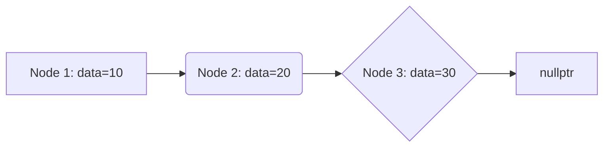

# <span style="color:#e67e22;">What we will learn in this post?</span>
<ul style='list-style-type: none; padding-left: 0;'>
<li><span style='color: #2980b9; font-size: 20px; font-weight: bold;'>👉</span> <span style='color: #2ecc71; font-size: 18px; font-weight: bold;'>C++ Structures, Unions, and Enumerations</span></li>
<li><span style='color: #2980b9; font-size: 20px; font-weight: bold;'>👉</span> <span style='color: #2ecc71; font-size: 18px; font-weight: bold;'>C++ Structures</span></li>
<li><span style='color: #2980b9; font-size: 20px; font-weight: bold;'>👉</span> <span style='color: #2ecc71; font-size: 18px; font-weight: bold;'>C++ Pointer to Structure</span></li>
<li><span style='color: #2980b9; font-size: 20px; font-weight: bold;'>👉</span> <span style='color: #2ecc71; font-size: 18px; font-weight: bold;'>C++ Self-Referential Structures</span></li>
<li><span style='color: #2980b9; font-size: 20px; font-weight: bold;'>👉</span> <span style='color: #2ecc71; font-size: 18px; font-weight: bold;'>Difference Between C Structures and C++ Structures</span></li>
<li><span style='color: #2980b9; font-size: 20px; font-weight: bold;'>👉</span> <span style='color: #2ecc71; font-size: 18px; font-weight: bold;'>C++ Unions</span></li>
<li><span style='color: #2980b9; font-size: 20px; font-weight: bold;'>👉</span> <span style='color: #2ecc71; font-size: 18px; font-weight: bold;'>C++ Bit Fields</span></li>
<li><span style='color: #2980b9; font-size: 20px; font-weight: bold;'>👉</span> <span style='color: #2ecc71; font-size: 18px; font-weight: bold;'>C++ Enumeration</span></li>
<li><span style='color: #2980b9; font-size: 20px; font-weight: bold;'>👉</span> <span style='color: #2ecc71; font-size: 18px; font-weight: bold;'>C++ typedef</span></li>
<li><span style='color: #2980b9; font-size: 20px; font-weight: bold;'>👉</span> <span style='color: #2ecc71; font-size: 18px; font-weight: bold;'>Array of Structures vs Array within a Structure in C/C++</span></li>
<li><span style='color: #2980b9; font-size: 20px; font-weight: bold;'>👉</span> <span style='color: #2ecc71; font-size: 18px; font-weight: bold;'>Conclusion!</span></li>
</ul>

# <span style="color:#e67e22">C++ Data Organization: Structures, Unions, and Enumerations 🏠</span>

C++ offers several ways to group related data together, making your code cleaner and easier to understand. Let's explore three key tools: structures, unions, and enumerations.


## <span style="color:#2980b9">Structures 📦</span>

Structures, declared using the `struct` keyword, are like custom containers. They group together variables of *different* data types under a single name. Think of it like a file folder holding various documents.

```c++
struct Person {
  std::string name;
  int age;
  float height;
};
```

This creates a `Person` structure that can hold a name (string), age (integer), and height (float).  You can then create instances of this structure:  `Person p1;`


### <span style="color:#8e44ad">Example:</span>

*   You could use a `struct` to represent a point on a graph (`x` and `y` coordinates), a book (title, author, ISBN), or a product in an inventory (name, price, quantity).


## <span style="color:#2980b9">Unions 🤝</span>

Unions, declared using the `union` keyword, also group variables, but *only one member can hold a value at any given time*. They share the same memory location.  Think of it as a single drawer that can hold either a pen or a pencil, but not both simultaneously.

```c++
union Data {
  int i;
  float f;
  char str[20];
};
```


### <span style="color:#8e44ad">Caution:</span>

*   Use unions sparingly, as they can be tricky to manage. Misuse can lead to unexpected behavior and data corruption.


## <span style="color:#2980b9">Enumerations 🔢</span>

Enumerations (`enum`) define a set of named integer constants. They improve code readability by replacing magic numbers with meaningful names.

```c++
enum class Color { Red, Green, Blue };
```

This creates an `enum class` named `Color` with three named constants: `Red`, `Green`, and `Blue`.  These constants are implicitly assigned integer values (usually starting from 0).


### <span style="color:#8e44ad">Benefits:</span>

*   Improved readability:  `Color::Red` is clearer than `0`.
*   Type safety:  prevents accidental assignment of incorrect values.


For more in-depth information, refer to these resources:

* [CppReference - Structures](https://en.cppreference.com/w/cpp/language/struct)
* [CppReference - Unions](https://en.cppreference.com/w/cpp/language/union)
* [CppReference - Enumerations](https://en.cppreference.com/w/cpp/language/enum)


Remember, choosing the right tool—structure, union, or enumeration—depends on how you need to organize your data.  Structures are the most common and versatile choice for grouping related data.  Unions are specialized and require careful consideration, while enumerations significantly enhance code clarity and maintainability.


# <span style="color:#e67e22">Structures in C++: Grouping Data 🏠</span>

## <span style="color:#2980b9">What are Structures? 🤔</span>

Structures in C++ are like custom-made boxes 📦 where you can group together different types of data under a single name.  Think of it as organizing related information—for example, details about a person (name, age, address).  This makes your code cleaner and easier to manage.


### <span style="color:#8e44ad">Defining a Structure</span>

You define a structure using the `struct` keyword, followed by the structure's name, and then the data members within curly braces `{}`.

```c++
struct Person {
  std::string name;
  int age;
  std::string address;
};
```

## <span style="color:#2980b9">Using Structures ✨</span>

After defining a structure, you can create *variables* of that structure type.  This is like creating instances of your custom box.

```c++
int main() {
  Person person1; // Create a variable of type Person
  person1.name = "Alice";
  person1.age = 30;
  person1.address = "123 Main St"; 
  return 0;
}
```

You access the individual data members using the dot operator (`.`).


## <span style="color:#2980b9">Example:  A Simple Book 📚</span>

```c++
struct Book {
  std::string title;
  std::string author;
  int pages;
};

int main() {
  Book myBook;
  myBook.title = "The Lord of the Rings";
  myBook.author = "J.R.R. Tolkien";
  myBook.pages = 1178;
  return 0;
}
```

This example shows how to define a `Book` structure and then use it to store information about a specific book.


**For more information:**  [https://www.cplusplus.com/doc/tutorial/structures/](https://www.cplusplus.com/doc/tutorial/structures/)


This is a great starting point!  Experiment with creating your own structures to organize different types of data. Remember that structures are a fundamental building block in C++, allowing you to create more complex and organized programs.


# <span style="color:#e67e22">Pointers to Structures in C++ 🚀</span>

## <span style="color:#2980b9">Understanding the Basics 💡</span>

Structures in C++ group different data types together.  A pointer to a structure is simply a variable that holds the *memory address* of a structure.  This allows for efficient manipulation of structures, especially large ones, by avoiding copying the entire structure.

### <span style="color:#8e44ad">Syntax and Declaration ✨</span>

To declare a pointer to a structure, use the `*` operator before the structure variable name:

```c++
struct MyStruct {
  int data1;
  char data2;
};

MyStruct myVar; // A structure variable
MyStruct *myPtr = &myVar; // A pointer to the structure myVar
```

`&myVar` gets the *memory address* of `myVar`.


## <span style="color:#2980b9">Accessing Members 🎯</span>

You access members of a structure through a pointer using the `->` operator:

```c++
myPtr->data1 = 10;  // Accessing data1 using the pointer
myPtr->data2 = 'A'; // Accessing data2 using the pointer
```

This is equivalent to `(*myPtr).data1 = 10;`, but the `->` operator is more concise and readable.


## <span style="color:#2980b9">Example: Dynamic Memory Allocation 💾</span>

Pointers are crucial for *dynamic memory allocation*.  You can allocate memory for a structure on the heap using `new` and delete it using `delete`:

```c++
MyStruct *dynamicStruct = new MyStruct;
dynamicStruct->data1 = 20;
dynamicStruct->data2 = 'B';
delete dynamicStruct; // Always remember to free allocated memory!
```


## <span style="color:#2980b9">Further Resources 📚</span>

* [C++ Documentation on Pointers](https://www.cplusplus.com/doc/tutorial/pointers/)
* [C++ Structures Tutorial](https://www.learncpp.com/cpp-tutorial/structs/)


Remember to always handle pointers carefully to avoid memory leaks and segmentation faults!  Good luck! 👍


# <span style="color:#e67e22">Self-Referential Structures in C++ 🤝</span>

## <span style="color:#2980b9">Understanding Self-Reference</span>

Self-referential structures in C++ are structures (or classes) that contain a member variable which is a pointer to the structure's own type.  This allows you to create linked data structures, where each element points to the next, forming a chain. Think of it like a train where each carriage points to the next one!

### <span style="color:#8e44ad">Why are they significant?</span>

Self-referential structures are crucial because they enable the creation of dynamic data structures.  Unlike arrays, whose size is fixed at compile time, these structures can grow or shrink as needed during program execution. This flexibility is essential for managing data where the size isn't known beforehand.


## <span style="color:#2980b9">Linked List Example ✨</span>

A simple linked list node might look like this:

```c++
struct Node {
  int data;
  Node* next; // Self-referential pointer
};
```

Each `Node` contains an integer (`data`) and a pointer (`next`) to the *next* `Node` in the list. The last node's `next` pointer will typically be `nullptr`.


### <span style="color:#8e44ad">Visual Representation</span>



This shows a linked list with three nodes.  Node 1 points to Node 2, Node 2 to Node 3, and Node 3's `next` pointer is `nullptr`, signifying the end.


## <span style="color:#2980b9">Other Examples</span>

*   **Doubly Linked Lists:**  Each node points to both the next and the previous node.
*   **Trees:**  Used extensively in databases and algorithms (e.g., binary search trees).
*   **Graphs:**  Represent relationships between data points.


For more information on these structures, you can explore resources like:

* [GeeksforGeeks](https://www.geeksforgeeks.org/data-structures/)  A great place to start learning about data structures and algorithms.
* [LearnCpp.com](https://www.learncpp.com/)  A comprehensive C++ tutorial site.


Remember, understanding self-referential structures is fundamental to mastering many advanced C++ programming concepts! 👍


# <span style="color:#e67e22">C Structures vs. C++ Structures: A Friendly Comparison 🤝</span>

C and C++ both use structures (`struct`) to group different data types together, but they differ significantly in their capabilities. Let's explore the key distinctions:

## <span style="color:#2980b9">Access Control 🔒</span>

### <span style="color:#8e44ad">C Structures</span>

*   In C, structures have *no access control*.  All members are publicly accessible by default.  Think of it like an open box – everything's visible!

### <span style="color:#8e44ad">C++ Structures</span>

*   C++ structures, unlike their C counterparts, *inherit access control from classes*.  By default, members are *public*. However, you can explicitly declare members as `private` or `protected`, controlling their visibility and access. This enhances encapsulation and data protection.  It's like a box with a lock and key!


## <span style="color:#2980b9">Methods (Functions) ⚙️</span>

### <span style="color:#8e44ad">C Structures</span>

*   C structures are purely *data containers*. They don't inherently support methods (functions directly associated with the structure). You'd need separate functions to operate on structure data.

### <span style="color:#8e44ad">C++ Structures</span>

*   C++ structures *can contain methods*.  This allows you to define functions that act directly on the structure's data, leading to cleaner and more organized code. This integrates functions and data more elegantly than in C.


## <span style="color:#2980b9">Summary 📝</span>

| Feature        | C Structure                  | C++ Structure                   |
|----------------|-------------------------------|---------------------------------|
| Access Control | Public (default)             | Public, Private, Protected      |
| Methods        | No, separate functions needed | Yes, can contain member functions |


**In essence:** C++ structures offer significantly enhanced functionality compared to C structures by adding access control and the ability to include methods, improving code organization, data protection, and overall design.


For more detailed information:

*   [Learn more about C structures](https://www.tutorialspoint.com/cprogramming/c_structures.htm)
*   [Dive deeper into C++ structures](https://www.geeksforgeeks.org/structures-in-cpp/)


This friendly guide should help you grasp the essential differences! Remember, understanding these nuances is crucial for writing effective and maintainable C and C++ code.


# <span style="color:#e67e22">Understanding Unions in C++ 🤗</span>

Unions, like structures, are user-defined data types in C++, but they work differently.  Think of a structure as a house with separate rooms for different things (variables). A union, however, is like a single room that can be used for different things *at one time*, but only one thing can occupy that space at a time.

## <span style="color:#2980b9">Unions vs. Structures 🏛️</span>

* **Structures:** Each member has its own storage space.  `struct MyStruct { int x; char y; };`  `x` and `y` occupy separate memory locations.

* **Unions:** All members share the same memory location.  `union MyUnion { int x; char y; };`  Only either `x` or `y` can hold a value at any given moment; writing to `x` overwrites `y` and vice versa.


### <span style="color:#8e44ad">When to Use Unions 🤔</span>

Use unions when you need to store different types of data in the *same* memory location, but only one at a time. This is often used for representing data that has different interpretations depending on context (e.g., a network packet that can contain either an integer or a string).


## <span style="color:#2980b9">Example ✨</span>

```c++
union Data {
  int i;
  float f;
  char str[20];
};

int main() {
  Data d;
  d.i = 10;  // Store an integer
  //d.f = 3.14; //Overwrites integer value stored previously.
  //printf("Integer: %d\n",d.i); //outputs 10
  printf("Integer: %d\n",d.i);
  d.f = 3.14f; // Now store a float
  printf("Float: %f\n", d.f);
  return 0;
}
```

**Important Note:**  Always be mindful of which member you're accessing in a union to avoid unexpected behavior and potential data corruption.  The size of a union is determined by its largest member.

For further reading: [cppreference Union](https://en.cppreference.com/w/cpp/language/union)


# <span style="color:#e67e22">Bit Fields: Tiny Treasures of Memory ✨</span>

## <span style="color:#2980b9">What are Bit Fields? 🤔</span>

Bit fields in C++ are a way to pack data more tightly. Instead of using a whole `int` (usually 4 bytes) for a variable, you can allocate only the *necessary* number of bits.  This is super useful when dealing with lots of small flags or options where memory efficiency is crucial.  Think of it like using tiny boxes instead of large containers for your belongings.

### <span style="color:#8e44ad">Example:  Packing Flags 🚩</span>

Let's say you're designing a game and want to store player attributes:

```c++
struct PlayerAttributes {
  unsigned int isJumping : 1; // 1 bit
  unsigned int isRunning : 1; // 1 bit
  unsigned int hasSword : 1; // 1 bit
  unsigned int health : 8;   // 8 bits (0-255)
};
```

Here, `isJumping`, `isRunning`, and `hasSword` each only need a single bit (0 or 1).  `health` uses 8 bits to represent values from 0 to 255. This struct will use far less memory than using separate `bool` and `int` variables.

## <span style="color:#2980b9">Memory Savings 💰</span>

*   **Reduced memory footprint:**  By packing bits, you use less memory overall, leading to smaller program size and potentially faster access times.
*   **Improved performance:** Less memory usage can improve cache performance.


## <span style="color:#2980b9">When to Use Bit Fields 🤔</span>

Bit fields shine when:

*   You have many small boolean flags.
*   Memory is extremely limited (e.g., embedded systems).
*   You need fine-grained control over memory allocation.


**Caution:** Bit fields can make your code slightly harder to read and maintain.  Use them judiciously!


[More info on Bit Fields](https://en.cppreference.com/w/cpp/language/bit_field)  (Resource Link)


# <span style="color:#e67e22">Enumerations in C++: Making Code Easier to Read 📖</span>

## <span style="color:#2980b9">What are Enumerations? 🤔</span>

Enumerations, or `enums` for short, are a way to give meaningful names to a set of integer constants.  Think of them as creating your own custom types with specific values. This makes your code much clearer and easier to understand.

### <span style="color:#8e44ad">Defining an Enumeration</span>

Here's how you define an enum:

```c++
enum class DayOfWeek { Monday, Tuesday, Wednesday, Thursday, Friday, Saturday, Sunday };
```

This creates a new type called `DayOfWeek`.  `Monday` is implicitly assigned the value 0, `Tuesday` is 1, and so on.  Using `enum class` (scoped enum) is the preferred modern way, as it prevents naming conflicts.

## <span style="color:#2980b9">Why Use Enumerations? 👍</span>

* **Improved Readability:** Instead of using magic numbers like `0` for Monday, you use `DayOfWeek::Monday`, making the code self-documenting.
* **Type Safety:** The compiler enforces that you only use valid values from your enum, preventing errors.
* **Maintainability:** If you need to change the underlying integer values, you only need to modify the enum definition, not every place where it's used.


## <span style="color:#2980b9">Example ✨</span>

```c++
DayOfWeek today = DayOfWeek::Friday;
if (today == DayOfWeek::Saturday || today == DayOfWeek::Sunday) {
    std::cout << "It's the weekend! 🎉";
}
```

This is much more readable than using integer values.

## <span style="color:#2980b9">Further Reading 📚</span>

For more detailed information and advanced features of enums in C++, refer to these resources:

* [cppreference](https://en.cppreference.com/w/cpp/language/enum)  (Comprehensive C++ reference)
* [LearnCpp.com](https://www.learncpp.com/cpp-tutorial/5-6-enumerations/) (Beginner-friendly tutorials)


Remember, using enums improves your code's clarity and maintainability, making it easier for you and others to understand and work with.  Happy coding! 😊


# <span style="color:#e67e22">Understanding `typedef` in C++ 💡</span>

## <span style="color:#2980b9">What is `typedef`?</span>

The `typedef` keyword in C++ is like creating a nickname for an existing data type.  It doesn't create a new type; it just gives an existing type a new, more convenient name. Think of it as an *alias*. This simplifies your code, making it more readable and easier to maintain.

### <span style="color:#8e44ad">Why use `typedef`?</span>

* **Improved Readability:**  Long, complex type names can clutter your code.  `typedef` lets you replace them with shorter, more descriptive names.
* **Code Maintainability:** If you need to change a data type, you only need to modify the `typedef` declaration, not every instance of the original type name in your code.
* **Platform Portability:** You can use `typedef` to abstract away platform-specific types, making your code easier to port to different systems.


## <span style="color:#2980b9">Examples of `typedef` in Action 🚀</span>

Let's see `typedef` in action:

```c++
// Creating an alias for unsigned int
typedef unsigned int uint; 

// Creating an alias for a more complex type
typedef struct {
  int x;
  int y;
} Point;

int main() {
  uint myVar = 10; // Using the alias 'uint'
  Point p = {1,2}; // Using the alias 'Point'
  return 0;
}
```

In this example, `uint` becomes a synonym for `unsigned int`, and `Point` is now a shorthand for the `struct`.


## <span style="color:#2980b9">Benefits Summarized 📝</span>

*   **Cleaner Code:**  Makes code easier to read and understand.
*   **Easier Maintenance:** Simplifies updating type definitions.
*   **Improved Portability:**  Hides platform-specific types.


For more in-depth information and advanced uses of `typedef`, you can refer to these resources:

* [LearnCpp.com](https://www.learncpp.com/cpp-tutorial/typedefs/) - A comprehensive C++ tutorial.
* [cplusplus.com](https://www.cplusplus.com/doc/tutorial/classes/) -  Reference for C++ classes and structures.


Remember, `typedef` is a powerful tool for improving the clarity and maintainability of your C++ code! 👍


# <span style="color:#e67e22">Arrays of Structures vs. Structures with Arrays 🏠</span>

Both approaches involve combining structures and arrays in C/C++, but they organize data differently. Let's explore!

## <span style="color:#2980b9">Arrays of Structures 🗄️</span>

This involves creating an array where each element is a *structure*.  Imagine a list of students, each with a name, ID, and grade.

### <span style="color:#8e44ad">Example</span>

```c++
struct Student {
  string name;
  int id;
  float grade;
};

Student students[100]; // Array of 100 Student structures
```

*   Each element (`students[0]`, `students[1]`, etc.) is a complete `Student` structure.
*   Ideal for managing collections of similar data entities.


## <span style="color:#2980b9">Structures with Arrays 🧱</span>

Here, a structure *contains* an array as a member.  Think of a single student with an array of grades for each course.

### <span style="color:#8e44ad">Example</span>

```c++
struct Student {
  string name;
  int id;
  float grades[5]; // Array of 5 grades within the structure
};

Student student1;
```

*   A single structure holds multiple data points of the *same type* within the array.
*   Best for representing entities with multiple attributes of a similar kind.


## <span style="color:#2980b9">Key Differences 🤔</span>

| Feature          | Arrays of Structures                               | Structures with Arrays                             |
|-----------------|----------------------------------------------------|----------------------------------------------------|
| Data Organization | Multiple structures, each representing an entity    | Single structure with multiple attributes of same type |
| Access           | Access individual structures by index               | Access individual array elements within a structure |
| Use Cases        | Lists of items (students, products, etc.)           | Entities with multiple similar attributes (grades, scores) |


## <span style="color:#2980b9">Choosing the Right Approach 🚀</span>

The best approach depends on how your data is structured.  If you have a collection of similar items, use arrays of structures. If you have an entity with multiple similar attributes, use structures with arrays.  Remember to consider memory efficiency and access patterns!


[Learn more about structures in C++](https://www.cplusplus.com/doc/tutorial/structures/)
[Learn more about arrays in C++](https://www.cplusplus.com/doc/tutorial/arrays/)


<h1><span style='color:#e67e22'>Conclusion</span></h1>

So there you have it!  We've covered a lot of ground today, and hopefully, you found it helpful and interesting. 😊  We're always looking to improve, and your thoughts are super valuable to us!  What did you think of this post?  Anything you'd like to see more of?  Let us know your comments, feedback, or suggestions in the comments section below – we'd love to hear from you! 👇  Let's keep the conversation going! ✨


