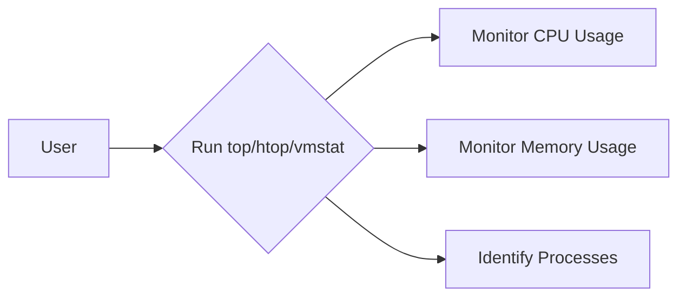

# <span style="color:#e67e22;">What we will learn in this post?</span>
<ul style='list-style-type: none; padding-left: 0;'>
<li><span style='color: #2980b9; font-size: 20px; font-weight: bold;'>👉</span> <span style='color: #2ecc71; font-size: 18px; font-weight: bold;'>Monitoring System Resources with Top, Htop, and Vmstat</span></li>
<li><span style='color: #2980b9; font-size: 20px; font-weight: bold;'>👉</span> <span style='color: #2ecc71; font-size: 18px; font-weight: bold;'>Automating Tasks with Cron Jobs and At Command</span></li>
<li><span style='color: #2980b9; font-size: 20px; font-weight: bold;'>👉</span> <span style='color: #2ecc71; font-size: 18px; font-weight: bold;'>Networking Utilities in Shell</span></li>
<li><span style='color: #2980b9; font-size: 20px; font-weight: bold;'>👉</span> <span style='color: #2ecc71; font-size: 18px; font-weight: bold;'>Shell Script Performance Optimization</span></li>
<li><span style='color: #2980b9; font-size: 20px; font-weight: bold;'>👉</span> <span style='color: #2ecc71; font-size: 18px; font-weight: bold;'>Process Management and Job Control</span></li>
<li><span style='color: #2980b9; font-size: 20px; font-weight: bold;'>👉</span> <span style='color: #2ecc71; font-size: 18px; font-weight: bold;'>Advanced Debugging and Profiling Tools</span></li>
<li><span style='color: #2980b9; font-size: 20px; font-weight: bold;'>👉</span> <span style='color: #2ecc71; font-size: 18px; font-weight: bold;'>Conclusion!</span></li>
</ul>

# <span style="color:#e67e22">Monitoring Your System's Health 💪</span>

Want to keep an eye on your computer's performance?  These commands are your friends!

## <span style="color:#2980b9">Top & htop:  Seeing What's Running 🏃‍♂️</span>

*   `top` shows real-time system processes.  It's like a constantly updating list of everything your computer is doing.  Press `q` to exit.
*   `htop` is a more user-friendly interactive version of `top`, with a colorful display and easier navigation.


### <span style="color:#8e44ad">Example: CPU Usage</span>

In both `top` and `htop`, the CPU usage is typically shown as a percentage for each process and the overall system.  A high percentage might indicate a resource-hungry application.

## <span style="color:#2980b9">vmstat: A Deeper Dive into System Resources 🔍</span>

`vmstat` gives you detailed stats on memory, disk I/O, and more. Use it like this: `vmstat 2 5` (updates every 2 seconds, for 5 iterations).


### <span style="color:#8e44ad">Example: Memory Usage</span>

Look for `swpd` (swap memory usage)—high values suggest your system is running low on RAM.  *High memory usage can slow your system down.*


## <span style="color:#2980b9">Process Management</span>

*   Use `ps aux | grep <process_name>`  to find a specific process (replace `<process_name>` with the process you're looking for).  This helps identify resource hogs.
*   `kill <process_id>` terminates a process (replace `<process_id>` with the process ID from `ps aux`). Use with caution!

[More info on `top`](https://man7.org/linux/man-pages/man1/top.1.html)
[More info on `htop`](https://htop.dev/)
[More info on `vmstat`](https://man7.org/linux/man-pages/man1/vmstat.1.html)





# <span style="color:#e67e22">Scheduling Tasks: `cron` & `at`</span> 📅

## <span style="color:#2980b9">Recurring Tasks with `cron`</span> 🔁

`cron` schedules tasks at specific times.  A *crontab* file defines these.  To edit it, use `crontab -e`. Each line represents a task:

```
* * * * * command  #minute hour day month dayOfWeek
```

*Example:* Run a backup script daily at 3 AM:

```
0 3 * * * /path/to/backup_script.sh
```

### <span style="color:#8e44ad">Automated Backups</span> 💾

To automate backups, create a script (`backup_script.sh`) and add a cron entry as shown above, pointing to the script's location.  *Remember to test your script before scheduling!*


## <span style="color:#2980b9">One-Time Tasks with `at`</span> ⏰

`at` runs commands once at a specific time.  Use `at -f /path/to/script.sh now + 1 day` to run a script in one day.


### <span style="color:#8e44ad">Periodic System Maintenance</span> 🛠️

Use `at` for one-time maintenance like disk cleanup.  Create a script performing the task, then schedule it.

For more details:

* [Crontab tutorial](https://linuxhint.com/crontab/)
* [At command tutorial](https://man7.org/linux/man-pages/man1/at.1.html)


Remember to always test your commands before adding them to your crontab or using `at`.  Incorrect configurations might have unintended consequences!


# <span style="color:#e67e22">Essential Networking Commands</span> 🌎

Let's explore some handy commands for checking your network!

## <span style="color:#2980b9">Checking Connectivity: `ping`</span> 📶

`ping` tests connectivity to a server.  Try it: `ping google.com`.  Successful responses mean you're connected!  See those round-trip times? That's how long it takes for data to travel to and from the server.


## <span style="color:#2980b9">Downloading Files: `curl` & `wget`</span> ⬇️

*   **`curl`:**  A versatile tool. Download a file like this: `curl -O https://www.example.com/file.txt`.  `-O` saves the file with its original name.
*   **`wget`:** Another downloader.  Similar use: `wget https://www.example.com/file.txt`.


### <span style="color:#8e44ad">Example</span>
```bash
curl -O https://www.example.com/my_cool_image.jpg
```

## <span style="color:#2980b9">Analyzing Connections: `netstat`</span> 🔎

`netstat` shows active network connections.  The output can be a bit dense, but it reveals which ports are open and what's communicating.  (Note: `ss` is a more modern alternative, often preferred).


For more info:

*   [Ping](https://en.wikipedia.org/wiki/Ping_(networking_utility))
*   [Curl](https://curl.se/)
*   [Wget](https://www.gnu.org/software/wget/)
*   [Netstat/ss](https://man7.org/linux/man-pages/man1/ss.1.html)


Remember to use these commands responsibly and be mindful of the websites you access. Happy networking! 😄


# <span style="color:#e67e22">Optimizing Your Shell Scripts 🚀</span>

Shell scripts can be slow if not written efficiently. Let's improve them!

## <span style="color:#2980b9">Efficient Loops 🔄</span>

Avoid unnecessary loops.  Use built-in commands like `find` or `xargs` where possible.

* **Unoptimized:**
```bash
for i in $(ls); do echo $i; done
```
* **Optimized:**
```bash
find . -print0 | xargs -0 echo
```
`xargs` is way faster!


## <span style="color:#2980b9">Avoiding Subshells 🚫</span>

Subshells create extra processes.  Use command substitution `$(...)` sparingly.

* **Unoptimized:** `var=$(ls)`
* **Optimized:** Use `find` and `while` loop or  `for i in *` directly.


## <span style="color:#2980b9">Reducing Disk I/O 💾</span>

Minimize file reads and writes.

* **Unoptimized:** Reading a large file line by line in a loop.
* **Optimized:** Use `awk`, `sed`, or `grep` for efficient text processing.


### <span style="color:#8e44ad">Example:  Counting lines</span>

* **Unoptimized:**
```bash
count=0; while IFS= read -r line; do count=$((count+1)); done < large_file.txt; echo $count
```
* **Optimized:**
```bash
wc -l large_file.txt
```
`wc -l` is much faster.


For more info: [Bash Guide](https://tldp.org/LDP/abs/html/)


Remember:  *Profiling* your scripts can pinpoint bottlenecks!  Happy scripting! 🎉


# <span style="color:#e67e22">Managing Linux Background & Foreground Jobs 🧑‍💻</span>

## <span style="color:#2980b9">Backgrounding & Foregrounding Processes</span>

To run a command in the background, add `&` at the end:  `long_running_command &`.  Use `jobs` to list background jobs.  To bring a background job to the foreground, use `fg %job_number` (e.g., `fg %1`). To resume a stopped background job, use `bg %job_number`.


### <span style="color:#8e44ad">Example</span>

Let's say you start a long download: `wget -c https://example.com/largefile.zip &`

Then use `jobs` to see its ID:

```
[1]+  Running                 wget -c https://example.com/largefile.zip &
```

To bring it to the foreground later: `fg %1`

To put it back in the background if you need to do something else: `Ctrl+Z` then `bg %1`


## <span style="color:#2980b9">Killing Processes ☠️</span>

Use `kill %job_number` to terminate a background job. For forceful termination, use `kill -9 %job_number`.


### <span style="color:#8e44ad">Important Note</span>

*Always try `kill %job_number` first.*  `kill -9` should be a last resort as it doesn't allow for clean process termination.


## <span style="color:#2980b9">Workflow Diagram</span>

```mermaid
graph TD
    A[Start Long Command &] --> B{Jobs Running?};
    B -- Yes --> C[List Jobs with jobs];
    B -- No --> D[Continue Work];
    C --> E{Foreground (fg)?};
    E -- Yes --> F[Bring to Foreground];
    E -- No --> G{Background (bg)?};
    G -- Yes --> H[Resume in Background];
    G -- No --> I{Kill (kill)?};
    I -- Yes --> J[Terminate Process];
    F --> D;
    H --> D;
    J --> D;
```


For more detailed information, explore the `man` pages: `man jobs`, `man fg`, `man bg`, `man kill`.


# <span style="color:#e67e22">Boosting Your Shell Script Performance with Advanced Debugging Tools 🚀</span>

Debugging slow shell scripts can be frustrating.  Luckily, powerful tools exist! Let's explore `strace`, `lsof`, and `time`.

## <span style="color:#2980b9">Understanding Your Script's Behavior with `strace` 🕵️‍♂️</span>

`strace` shows *every* system call your script makes.  This reveals bottlenecks.

```bash
strace ./myscript.sh
```

For example, if you see many slow network calls, you know where to optimize.


### <span style="color:#8e44ad">Example: Identifying Slow I/O</span>

If `strace` highlights frequent `read()` or `write()` calls taking significant time, your script might have inefficient file handling.


## <span style="color:#2980b9">Uncovering File Descriptors with `lsof` 📁</span>

`lsof` lists open files.  This is crucial for finding file locks or unintended resource usage.

```bash
lsof -p <PID> 
```

Replace `<PID>` with your script's process ID (get it with `ps aux | grep myscript`).


## <span style="color:#2980b9">Measuring Execution Time with `time` ⏱️</span>

`time` measures script execution time (real, user, and system). This helps spot overall performance issues.

```bash
time ./myscript.sh
```


* **Real time:** Wall-clock time.
* **User time:** CPU time spent in your script.
* **System time:** CPU time spent by the kernel on your script's behalf.

By combining these tools, you can pinpoint slowdowns, optimize I/O, and significantly improve your shell scripts' efficiency.

[More on `strace`](https://man7.org/linux/man-pages/man1/strace.1.html)  [More on `lsof`](https://man7.org/linux/man-pages/man8/lsof.8.html)  [More on `time`](https://man7.org/linux/man-pages/man1/time.1.html)


Here are a few options for your blog conclusion, all under 150 words and using the specified formatting:


**Option 1:**

<h1><span style='color:#e67e22'>Conclusion</span></h1>

And there you have it!  I hope you enjoyed this post.  What are your thoughts? 🤔 Let me know in the comments below!  I'd love to hear your feedback and any suggestions you might have.  Let's chat! 😊


**Option 2:**

<h1><span style='color:#e67e22'>Conclusion</span></h1>

So, that's a wrap! 🎉  Thanks for reading!  Don't be shy – share your opinions, experiences, or even just a quick hello in the comments section! 👇 Your input is super valuable!


**Option 3:**

<h1><span style='color:#e67e22'>Conclusion</span></h1>

We've reached the end of our journey together!  I really appreciate you taking the time to read this.  Now it's your turn!  What did you think?  Leave a comment and let's continue the conversation!  💬


**Option 4:**

<h1><span style='color:#e67e22'>Conclusion</span></h1>

Hope you found this helpful!  I'd love to know what resonated with you – or what you'd like to see more of!  Let's keep the conversation going in the comments – I'm excited to read your thoughts! 👍


