# <span style="color:#e67e22;">What we will learn in this post?</span>

<ul style='list-style-type: none; padding-left: 0;'>
<li><span style='color: #2980b9; font-size: 20px; font-weight: bold;'>👉</span> <span style='color: #2ecc71; font-size: 18px; font-weight: bold;'>C++ Object Oriented Programming (OOPs)</span></li>
<li><span style='color: #2980b9; font-size: 20px; font-weight: bold;'>👉</span> <span style='color: #2ecc71; font-size: 18px; font-weight: bold;'>C++ Classes and Objects</span></li>
<li><span style='color: #2980b9; font-size: 20px; font-weight: bold;'>👉</span> <span style='color: #2ecc71; font-size: 18px; font-weight: bold;'>C++ Access Modifiers</span></li>
<li><span style='color: #2980b9; font-size: 20px; font-weight: bold;'>👉</span> <span style='color: #2ecc71; font-size: 18px; font-weight: bold;'>C++ Friend Class and Function</span></li>
<li><span style='color: #2980b9; font-size: 20px; font-weight: bold;'>👉</span> <span style='color: #2ecc71; font-size: 18px; font-weight: bold;'>C++ Constructors</span></li>
<li><span style='color: #2980b9; font-size: 20px; font-weight: bold;'>👉</span> <span style='color: #2ecc71; font-size: 18px; font-weight: bold;'>C++ Default Constructors</span></li>
<li><span style='color: #2980b9; font-size: 20px; font-weight: bold;'>👉</span> <span style='color: #2ecc71; font-size: 18px; font-weight: bold;'>C++ Copy Constructor</span></li>
<li><span style='color: #2980b9; font-size: 20px; font-weight: bold;'>👉</span> <span style='color: #2ecc71; font-size: 18px; font-weight: bold;'>C++ Destructors</span></li>
<li><span style='color: #2980b9; font-size: 20px; font-weight: bold;'>👉</span> <span style='color: #2ecc71; font-size: 18px; font-weight: bold;'>C++ Private Destructor</span></li>
<li><span style='color: #2980b9; font-size: 20px; font-weight: bold;'>👉</span> <span style='color: #2ecc71; font-size: 18px; font-weight: bold;'>When is the Copy Constructor Called?</span></li>
<li><span style='color: #2980b9; font-size: 20px; font-weight: bold;'>👉</span> <span style='color: #2ecc71; font-size: 18px; font-weight: bold;'>Shallow Copy and Deep Copy in C++</span></li>
<li><span style='color: #2980b9; font-size: 20px; font-weight: bold;'>👉</span> <span style='color: #2ecc71; font-size: 18px; font-weight: bold;'>When Should We Write Our Own Copy Constructor?</span></li>
<li><span style='color: #2980b9; font-size: 20px; font-weight: bold;'>👉</span> <span style='color: #2ecc71; font-size: 18px; font-weight: bold;'>Does the Compiler Create a Default Constructor When We Write Our Own?</span></li>
<li><span style='color: #2980b9; font-size: 20px; font-weight: bold;'>👉</span> <span style='color: #2ecc71; font-size: 18px; font-weight: bold;'>C++ Static Data Members</span></li>
<li><span style='color: #2980b9; font-size: 20px; font-weight: bold;'>👉</span> <span style='color: #2ecc71; font-size: 18px; font-weight: bold;'>C++ Static Member Functions</span></li>
<li><span style='color: #2980b9; font-size: 20px; font-weight: bold;'>👉</span> <span style='color: #2ecc71; font-size: 18px; font-weight: bold;'>C++ this pointer</span></li>
<li><span style='color: #2980b9; font-size: 20px; font-weight: bold;'>👉</span> <span style='color: #2ecc71; font-size: 18px; font-weight: bold;'>C++ Scope Resolution Operator vs this pointer</span></li>
<li><span style='color: #2980b9; font-size: 20px; font-weight: bold;'>👉</span> <span style='color: #2ecc71; font-size: 18px; font-weight: bold;'>C++ Local Class</span></li>
<li><span style='color: #2980b9; font-size: 20px; font-weight: bold;'>👉</span> <span style='color: #2ecc71; font-size: 18px; font-weight: bold;'>C++ Nested Classes</span></li>
<li><span style='color: #2980b9; font-size: 20px; font-weight: bold;'>👉</span> <span style='color: #2ecc71; font-size: 18px; font-weight: bold;'>C++ enum Class</span></li>
<li><span style='color: #2980b9; font-size: 20px; font-weight: bold;'>👉</span> <span style='color: #2ecc71; font-size: 18px; font-weight: bold;'>Difference between Structure and Class in C++</span></li>
<li><span style='color: #2980b9; font-size: 20px; font-weight: bold;'>👉</span> <span style='color: #2ecc71; font-size: 18px; font-weight: bold;'>Why C++ is a partially Object Oriented Language?</span></li>
<li><span style='color: #2980b9; font-size: 20px; font-weight: bold;'>👉</span> <span style='color: #2ecc71; font-size: 18px; font-weight: bold;'>Conclusion!</span></li>
</ul>

# <span style="color:#e67e22">Object-Oriented Programming (OOP) in C++ 🎉</span>

Object-Oriented Programming (OOP) is a way to structure your code around "objects" rather than just functions and data. Think of objects as real-world things like cars or houses, each with its own properties (data) and actions (functions). C++ is a powerful language for OOP, allowing you to build complex and maintainable programs. Let's explore key principles:

## <span style="color:#2980b9">Encapsulation 📦</span>

Encapsulation means bundling data (like a car's color and model) and the methods that operate on that data (like `start()` and `accelerate()`) within a single unit – a _class_. This hides internal details and protects data from accidental modification.

### <span style="color:#8e44ad">Example</span>

```c++
class Car {
private:
  string color; //Data hidden
public:
  void setColor(string c) { color = c; } //Method to modify data
};
```

## <span style="color:#2980b9">Inheritance 👪</span>

Inheritance lets you create new classes (child classes) based on existing ones (parent classes). The child class inherits all the properties and methods of the parent, and can add its own unique features. This promotes code reusability and reduces redundancy.

### <span style="color:#8e44ad">Example</span>

A `SportsCar` class could inherit from a `Car` class, adding features like a `turboBoost()` method.

```mermaid
graph TD
    A["🚗 Car"] --> B["🏎️ SportsCar"];
    A --> C["🚚 Truck"];

    %% Class Definitions
    classDef mainStyle fill:#FFB74D,stroke:#F57C00,color:#000000,font-size:14px,stroke-width:2px,rx:10px,shadow:3px;
    classDef sportStyle fill:#81C784,stroke:#388E3C,color:#000000,font-size:14px,stroke-width:2px,rx:10px,shadow:3px;
    classDef truckStyle fill:#64B5F6,stroke:#1976D2,color:#FFFFFF,font-size:14px,stroke-width:2px,rx:10px,shadow:3px;

    %% Apply Classes
    class A mainStyle;
    class B sportStyle;
    class C truckStyle;
```



## <span style="color:#2980b9">Polymorphism 🎭</span>

Polymorphism allows objects of different classes to be treated as objects of a common type. This means you can use a single interface to interact with objects of various classes, increasing flexibility. For example, different vehicle types (`Car`, `Truck`, `Motorcycle`) can all have a `drive()` method, but the implementation differs for each.

### <span style="color:#8e44ad">Key Benefits of OOP</span>

- **Modularity:** Easier to manage and maintain large codebases.
- **Reusability:** Avoid writing the same code multiple times.
- **Flexibility:** Adapt to changing requirements easily.

For more in-depth information, check out these resources:

- [LearnCpp.com](https://www.learncpp.com/)
- [cplusplus.com](https://www.cplusplus.com/)

Remember, mastering OOP takes practice! Start with small projects and gradually build your understanding. Good luck! 👍

Error: An error occurred while processing your request. Please try again later.

Error: An error occurred while processing your request. Please try again later.

Error: An error occurred while processing your request. Please try again later.

Error: An error occurred while processing your request. Please try again later.

Error: An error occurred while processing your request. Please try again later.

# <span style="color:#e67e22">Understanding C++ Copy Constructor 👯‍♀️</span>

The copy constructor is a special method in C++ that's automatically called in specific situations. It's like a blueprint for creating _exact_ copies of existing objects.

## <span style="color:#2980b9">Purpose ✨</span>

Its primary purpose is to create a new object as a _copy_ of an existing object of the same class. This ensures that data is properly duplicated, preventing unintended modifications to the original object.

### <span style="color:#8e44ad">When is it called?</span>

The copy constructor springs into action in several scenarios:

- **Object initialization:** When you create a new object using an existing object as a source. `MyClass obj2 = obj1;`
- **Passing objects by value:** When you pass an object as an argument to a function.
- **Returning objects by value:** When a function returns an object.

## <span style="color:#2980b9">Example 💡</span>

```c++
class MyClass {
public:
    int data;
    MyClass(int d) : data(d) {}  // Constructor
    MyClass(const MyClass& other) : data(other.data) {} // Copy Constructor
};

int main() {
    MyClass obj1(10);
    MyClass obj2 = obj1; // Copy constructor called here!
    return 0;
}
```

In this example, `obj2 = obj1;` triggers the copy constructor, creating `obj2` as a perfect duplicate of `obj1`.

## <span style="color:#2980b9">Visual Representation 📊</span>


This shows `obj1`'s data being copied to `obj2` via the copy constructor.

## <span style="color:#2980b9">Important Note 🤔</span>

- If you don't explicitly define a copy constructor, the compiler provides a _default_ copy constructor which performs a _member-wise copy_. However, for complex classes with pointers or dynamic memory allocation, you'll _need_ to define your own copy constructor to avoid issues like double deletion.

For more detailed information and advanced techniques, refer to these resources:

- [cppreference](https://en.cppreference.com/w/cpp/language/copy_constructor)
- [LearnCpp.com](https://www.learncpp.com/cpp-tutorial/copy-constructors/)

Remember, understanding the copy constructor is crucial for writing robust and error-free C++ code!

# <span style="color:#e67e22">C++ Destructors: Cleaning Up After Objects 🧹</span>

## <span style="color:#2980b9">What are Destructors?</span>

Destructors are special member functions in C++ that are automatically called when an object goes out of scope or is explicitly deleted. Think of them as the object's cleanup crew! Their main purpose is to release any resources held by the object, preventing memory leaks and other issues.

### <span style="color:#8e44ad">Why Use Destructors?</span>

- **Memory Management:** Destructors free dynamically allocated memory using `delete`. Failing to do this leads to memory leaks.
- **Resource Release:** They close files, release network connections, and perform other cleanup tasks related to the object's functionality.

## <span style="color:#2980b9">How Destructors Work</span>

A destructor has the same name as the class but is prefixed with a tilde (~). For example, if you have a class `MyClass`, the destructor would be `~MyClass()`.

```c++
class MyClass {
public:
    MyClass() { /* Constructor */ }
    ~MyClass() { /* Destructor */  std::cout << "Destructor called!\n"; }
};

int main() {
    MyClass obj; // Constructor called
    // ... obj is used ...
    //obj goes out of scope here, destructor is automatically called.
}
```

**Example Breakdown:**

- When `obj` is created, the constructor initializes it.
- When `obj` goes out of scope (ends its life), the destructor automatically cleans up.

## <span style="color:#2980b9">Example: File Handling</span>

Imagine a class that handles files:

```c++
class FileHandler {
private:
    std::fstream file;
public:
    FileHandler(const std::string& filename) : file(filename) {}
    ~FileHandler() {
        if (file.is_open()) file.close(); //Close the file in the destructor
        std::cout << "File closed!\n";
    }
};
```

This ensures that the file is always closed, even if errors occur.

## <span style="color:#2980b9">More Information 🔗</span>

For a deeper dive into destructors and memory management, check out these resources:

- [cppreference.com](https://en.cppreference.com/w/cpp/language/destructor)
- [LearnCpp.com](https://www.learncpp.com/cpp-tutorial/destructors/)

This simple explanation should make destructors less scary! They are essential for writing robust and reliable C++ code. 😊

# <span style="color:#e67e22">Private Destructors in C++: 🤫 Keeping Secrets</span>

In C++, a private destructor prevents a class's objects from being directly deleted using `delete`. This might seem restrictive, but it's a powerful tool for controlling object lifecycle and enforcing design patterns.

## <span style="color:#2980b9">Why Use a Private Destructor?</span>

Private destructors are primarily used for managing singleton classes or objects with controlled lifetime management. Think of them as guardians of your objects, ensuring they are only destroyed under specific circumstances.

### <span style="color:#8e44ad">Singleton Pattern Example</span>

Imagine a logging system. You only want _one_ logging object available throughout your application. A private destructor, combined with a static instance, ensures this:

```cpp
class Logger {
private:
  Logger() {} // Private constructor
  ~Logger() {} // Private destructor
  static Logger instance; // Static instance
public:
  static Logger& getInstance() { return instance; }
  void log(const std::string& message) { /* ... */ }
};
```

Here's a simple visual representation:


Only `Logger::getInstance()` can access the single instance of the `Logger` class. Trying to directly create or destroy it outside this function will result in a compiler error.

## <span style="color:#2980b9">Other Use Cases</span>

- **Resource Management:** A private destructor might be paired with a dedicated cleanup method, ensuring resources (like files or network connections) are released only when appropriate.
- **Factory Pattern:** Classes that create objects using the factory pattern often use private destructors to prevent external destruction and manage their life cycle efficiently.

**In short:** Private destructors are a subtle but effective way to enhance code safety and enforce good design patterns by tightly controlling object deletion.

**Learn More:** For more detailed information on destructors and design patterns, refer to these resources: [Effective C++](https://effectivecpp.com/) and [More Effective C++](https://www.amazon.com/Effective-C-Scott-Meyers/dp/0321334876) (highly recommended books). 📚

# <span style="color:#e67e22">When the Copy Constructor Steps In 👯‍♀️</span>

The copy constructor is a special constructor in C++ that creates a _new_ object as a copy of an _existing_ object. It's automatically called in several situations:

## <span style="color:#2980b9">Scenario 1: Passing by Value 🎁</span>

When you pass an object to a function _by value_, a copy is made.

```c++
class MyClass {
public:
  MyClass(int x) : data(x) {}
  MyClass(const MyClass& other) : data(other.data) { /* Copy Constructor */ }
  int data;
};

void myFunc(MyClass obj) {  // Copy constructor called here!
  // ...
}

int main() {
  MyClass obj1(10);
  myFunc(obj1);
  return 0;
}
```

### <span style="color:#8e44ad">Explanation:</span>

The `myFunc` call creates a _copy_ of `obj1` using the copy constructor.

## <span style="color:#2980b9">Scenario 2: Returning by Value 📤</span>

Similarly, when a function returns an object _by value_, the copy constructor is used to create a copy of the returned object.

```c++
MyClass myFunc2() {
  MyClass obj(20);
  return obj; // Copy constructor called here!
}
```

### <span style="color:#8e44ad">Explanation:</span>

The `return obj;` statement triggers the copy constructor to create a copy of `obj` before it's returned.

## <span style="color:#2980b9">Scenario 3: Initialization with another object ✨</span>

You can directly initialize one object with another using the copy constructor:

```c++
MyClass obj1(30);
MyClass obj2 = obj1; // Copy constructor called here!
```

### <span style="color:#8e44ad">Explanation:</span>

`obj2` is created as a direct copy of `obj1`.

**In short:** The copy constructor ensures that you're working with independent copies of your objects, avoiding unintended modifications to the original object.

[Learn more about copy constructors here!](https://www.geeksforgeeks.org/copy-constructor-in-cpp/)

# <span style="color:#e67e22">Shallow vs. Deep Copy in C++ 👯‍♀️</span>

## <span style="color:#2980b9">Understanding the Difference</span>

Imagine you have a box (an object) containing other smaller boxes (member objects).

- **Shallow Copy:** A shallow copy creates a _new_ box, but it places _references_ to the _original_ smaller boxes inside. Changing a smaller box in the _original_ box also changes it in the _copied_ box. Think of it like photocopying – you get a copy of the picture of the smaller boxes, not the boxes themselves.

- **Deep Copy:** A deep copy creates a _new_ box _and_ makes entirely _new_ copies of _all_ the smaller boxes inside. Changing a smaller box in the original has _no effect_ on the copied box. This is like making a completely separate, identical set of smaller boxes.

### <span style="color:#8e44ad">Example: Shallow Copy</span>

```c++
#include <iostream>
#include <vector>

struct Data {
  int val;
};

int main() {
  Data d1{10};
  Data d2 = d1; // Shallow copy

  d2.val = 20;
  std::cout << d1.val << " " << d2.val; //Outputs 20 20, demonstrating shallow copying.
  return 0;
}
```

### <span style="color:#8e44ad">Example: Deep Copy (Illustrative)</span>

```c++
#include <iostream>
#include <vector>

struct Data {
    int val;
    Data(int v) : val(v) {} //constructor
};

Data deepCopy(const Data& d) {
    return Data(d.val);
}

int main() {
    Data d1{10};
    Data d2 = deepCopy(d1);

    d2.val = 20;
    std::cout << d1.val << " " << d2.val; //Outputs 10 20, demonstrating deep copying.
    return 0;
}

```

## <span style="color:#2980b9">Implications</span>

- **Shallow copies** are faster but can lead to unexpected behavior if you modify data in either the original or the copy.
- **Deep copies** are slower but safer, ensuring complete independence between the original and the copy.

Choosing between shallow and deep copy depends on your specific needs and how you intend to use the copied object. For complex objects with pointers or dynamically allocated memory, a deep copy is usually necessary to avoid unintended consequences.

[More information on memory management in C++](https://en.cppreference.com/w/cpp/memory)  
[More about copy constructors and assignment operators](https://www.geeksforgeeks.org/copy-constructor-and-assignment-operator-in-cpp/)

# <span style="color:#e67e22">When to Craft a Custom Copy Constructor in C++ 🤔</span>

C++'s default copy constructor works fine for simple classes, but sometimes you need a custom one. This happens when your class manages resources like dynamically allocated memory or file handles. Without a custom copy constructor, you risk double deletion (deleting the same memory twice) or other nasty issues.

## <span style="color:#2980b9">Why Custom Copy Constructors? 🛠️</span>

- **Deep Copying:** The default constructor only performs _shallow copying_, copying the pointers but not the data they point to. For classes with pointers, this can lead to problems. Deep copying creates entirely new copies of the data.
- **Resource Management:** If your class owns resources (files, network connections, etc.), the copy constructor needs to handle these appropriately, usually by creating new instances of those resources instead of simply copying pointers.

### <span style="color:#8e44ad">Example: A Class with Dynamic Memory</span>

Let's say we have a `MyClass` with a dynamically allocated array:

```cpp
class MyClass {
private:
    int* data;
    int size;
public:
    MyClass(int size) : size(size) { data = new int[size]; }
    // ... other methods ...
    MyClass(const MyClass& other) : size(other.size) { // Copy constructor
        data = new int[size];
        for (int i = 0; i < size; ++i) {
            data[i] = other.data[i];
        }
    }
    ~MyClass() { delete[] data; } // Destructor
};
```

This custom copy constructor performs a _deep copy_, creating a new array and copying the contents. The destructor (`~MyClass()`) safely releases the memory. Without it, copying `MyClass` objects would lead to double deletion!

## <span style="color:#2980b9">When NOT to use a custom copy constructor?</span> 🚫

If your class only contains built-in types (like `int`, `float`, `bool`) and doesn't manage external resources, the default copy constructor is usually sufficient.

**Remember**: Always pair your custom copy constructor with a custom assignment operator (`=`) and destructor to maintain consistency and prevent resource leaks! Consider using the `copy-and-swap` idiom for more robust assignment operators.

[More information on copy constructors](https://www.learncpp.com/cpp-tutorial/copy-constructors/)

# <span style="color:#e67e22">Default Constructor and Custom Constructors 🤔</span>

Let's explore how compilers handle default constructors when you define your own.

## <span style="color:#2980b9">The Scoop on Constructors 🏗️</span>

Constructors are special functions in a class that are automatically called when you create an object of that class. They initialize the object's member variables. A _default constructor_ takes no arguments.

### <span style="color:#8e44ad">Scenario 1: No Custom Constructor Defined</span>

If you don't define _any_ constructor in your class, the compiler will automatically generate a default constructor for you. This default constructor does nothing – it doesn't initialize anything.

```java
class MyClass {
  int x;
}
```

### <span style="color:#8e44ad">Scenario 2: Custom Constructor Defined 🎉</span>

When you define _at least one_ constructor (like a parameterized constructor), the compiler _will not_ automatically generate a default constructor for you. You have to explicitly create it if you need one.

```java
class MyClass {
  int x;
  MyClass(int val) { x = val; } //Custom constructor
}
```

In this case, if you try to create an object like `MyClass obj = new MyClass();`, you'll get a compiler error because no default constructor exists. To fix this:

```java
class MyClass {
  int x;
  MyClass(int val) { x = val; }
  MyClass() { x = 0; } // Explicit default constructor
}
```

## <span style="color:#2980b9">Visual Summary 📊</span>



```mermaid
graph LR
    A["🔄 No Custom Constructor"] --> B["✅ Compiler Creates Default Constructor"];
    C["🛠️ At Least One Custom Constructor"] --> D["❌ Compiler Does NOT Create Default Constructor"];

    %% Class Definitions
    classDef noCustomStyle fill:#FFB74D,stroke:#F57C00,color:#000000,font-size:14px,stroke-width:2px,rx:10px,shadow:3px;
    classDef defaultCreatedStyle fill:#81C784,stroke:#388E3C,color:#000000,font-size:14px,stroke-width:2px,rx:10px,shadow:3px;
    classDef customStyle fill:#FF8A80,stroke:#D32F2F,color:#FFFFFF,font-size:14px,stroke-width:2px,rx:10px,shadow:3px;
    classDef noDefaultStyle fill:#64B5F6,stroke:#1976D2,color:#FFFFFF,font-size:14px,stroke-width:2px,rx:10px,shadow:3px;

    %% Apply Classes
    class A noCustomStyle;
    class B defaultCreatedStyle;
    class C customStyle;
    class D noDefaultStyle;
```

**Key Points:**

- The compiler's behavior depends on whether you define any constructors yourself.
- Explicitly define a default constructor if you need one alongside a custom constructor.

This ensures predictable object creation and avoids unexpected behavior. Remember, explicit is better than implicit when it comes to constructors! For further reading on constructors and their nuances in different programming languages, you can refer to the official documentation of your chosen language (like JavaDocs for Java, MSDN for C# etc.).

Error: An error occurred while processing your request. Please try again later.

Error: An error occurred while processing your request. Please try again later.

# <span style="color:#e67e22">Understanding the `this` Pointer in C++ 📌</span>

## <span style="color:#2980b9">What is the `this` Pointer? 🤔</span>

In C++, the `this` pointer is a hidden pointer that's automatically passed to every non-static member function. It points to the _specific_ object that called the function. Think of it as a secret agent's ID card – it tells the function exactly which object it's working with.

### <span style="color:#8e44ad">Why do we need it?</span>

Without `this`, the compiler wouldn't know which instance's data (variables) to access when you use member variables (like `myVariable` within a member function).

## <span style="color:#2980b9">How `this` Works ✨</span>

Imagine you have a `Dog` class with a `name` variable and a `bark()` function. When you call `myDog.bark()`, `this` inside `bark()` points to the memory location of `myDog`. This allows `bark()` to access and modify `myDog`'s `name` or other member variables.

```c++
class Dog {
public:
  string name;
  void bark() {
    cout << "Woof! My name is " << this->name << endl; //this->name accesses the name of the specific dog object
  }
};
```

- `this->name`: Explicitly uses `this` to access the object's `name`. It's often optional; `name` alone often works too, but using `this->` makes the code clearer.

## <span style="color:#2980b9">Example Scenario 🐕</span>


This diagram shows how, when you call `bark()` on `myDog`, the `this` pointer directs the function to the correct dog's data.

## <span style="color:#2980b9">Returning `this` 🔄</span>

You can also return `this` from a member function, enabling method chaining:

```c++
class Dog {
public:
    Dog& setName(string n){ name = n; return *this; }
};
```

This allows you to write code like: `myDog.setName("Buddy").bark();`

[More on C++ Classes and Objects](https://www.geeksforgeeks.org/classes-objects-cpp/)

[More on Pointers in C++](https://www.learncpp.com/cpp-tutorial/6-10-pointers/)

# <span style="color:#e67e22">Scope Resolution Operator (::) vs. `this` Pointer</span> 🔭

## <span style="color:#2980b9">Scope Resolution Operator (::)</span>

The scope resolution operator, `::`, is like a GPS for your code. It tells the compiler exactly where to find a specific variable or function. This is crucial when you have names that are used in multiple places (like in classes and namespaces).

### <span style="color:#8e44ad">Example</span>

```c++
namespace MyNamespace {
  int x = 10;
}

int x = 5;

int main() {
  std::cout << x << std::endl;  // Outputs 5 (global x)
  std::cout << MyNamespace::x << std::endl; // Outputs 10 (namespace x)
  return 0;
}
```

Here, `MyNamespace::x` uses `::` to specify we want the `x` _inside_ `MyNamespace`, not the global `x`.

## <span style="color:#2980b9">`this` Pointer</span> ✨

The `this` pointer is a special pointer available _inside_ a class's member functions. It points to the _specific instance_ of the class the function is being called on. Think of it as a self-referencing pointer.

### <span style="color:#8e44ad">Example</span>

```c++
class MyClass {
public:
  int value;
  void setValue(int val) {
    this->value = val; // 'this' points to the current object
  }
};

int main() {
  MyClass obj;
  obj.setValue(20);
  return 0;
}
```

Without `this`, the compiler wouldn't know which `value` to assign. `this->value` clarifies we mean the `value` belonging to the _current_ `MyClass` object (`obj`).

## <span style="color:#2980b9">Key Differences Summarized</span> 📝

| Feature | Scope Resolution Operator (::)      | `this` Pointer                                             |
| ------- | ----------------------------------- | ---------------------------------------------------------- |
| Purpose | Accessing names in different scopes | Accessing member variables/functions of the current object |
| Context | Namespaces, classes                 | Inside class member functions                              |
| Type    | Operator                            | Pointer                                                    |

For further reading on these important C++ concepts, check out these resources: [cppreference.com](https://en.cppreference.com/) (search for "scope resolution" and "this pointer") and your favorite C++ textbook!

# <span style="color:#e67e22">Local Classes in C++ 🏠</span>

## <span style="color:#2980b9">What are they?</span>

Local classes are classes defined _inside_ a function or a block of code. Think of them as helper classes that are only needed within a specific, limited scope. They're not accessible from outside that function.

### <span style="color:#8e44ad">Characteristics ✨</span>

- **Limited Scope:** Only visible and usable within the function they're defined in.
- **Encapsulation:** Help to encapsulate data and functionality relevant to a specific task.
- **Improved Code Organization:** Can make complex functions more readable and maintainable by breaking down tasks.

## <span style="color:#2980b9">When to Use Them?</span>

Use local classes when you need a small, helper class that's only relevant to a single function. This improves code organization and avoids polluting the global namespace with unnecessary classes.

## <span style="color:#2980b9">Example 💡</span>

```cpp
void myFunction() {
  class LocalHelper { // Local class definition
  public:
    int multiply(int a, int b) { return a * b; }
  };

  LocalHelper helper;
  int result = helper.multiply(5, 3); // Using the local class
  std::cout << result << std::endl; // Output: 15
}
```

In this example, `LocalHelper` is only accessible within `myFunction()`.

## <span style="color:#2980b9">Benefits 👍</span>

- **Namespace cleanliness:** Avoids cluttering the global namespace.
- **Improved readability:** Makes code easier to understand, especially in complex functions.
- **Encapsulation:** Hides implementation details.

---

**For more information:** Search online for "C++ local classes" to find detailed tutorials and documentation. Many C++ textbooks and online resources cover this topic extensively.

# <span style="color:#e67e22">Nested Classes in C++ 🎉</span>

Nested classes, also known as inner classes, are classes defined within another class. They're like having a smaller, specialized class tucked inside a larger one. This is a powerful feature offering improved organization and encapsulation.

## <span style="color:#2980b9">Why Use Nested Classes? 🤔</span>

- **Encapsulation:** Nested classes help keep related code together, preventing naming conflicts and improving code readability. They're especially useful for helper classes or data structures specifically used by the outer class.
- **Organization:** They can structure complex classes by grouping together logically related functionalities. Think of them as modules within a larger module.
- **Access Control:** Nested classes can have fine-grained access control, allowing inner classes to access private members of their enclosing class.

### <span style="color:#8e44ad">Example: Point within a Circle 📍</span>

```cpp
class Circle {
public:
    class Point { // Nested class
    public:
        double x, y;
        Point(double x, double y) : x(x), y(y) {}
    };

    Point center; //Using the nested class
    double radius;
    Circle(double x, double y, double r): center(x,y), radius(r){}
};

int main(){
    Circle c(1.0,2.0,3.0);
    Circle::Point p = c.center; // Accessing Point
}
```

Here, `Point` is a nested class inside `Circle`. It neatly encapsulates the concept of a point and its data, relevant only in the context of the `Circle` class.

## <span style="color:#2980b9">Benefits Summarized ✨</span>

- Improved code organization and readability
- Enhanced encapsulation and data hiding
- Better access control

For more information, check out these resources: [LearnCpp](https://www.learncpp.com/cpp-tutorial/nested-classes/) and [GeeksforGeeks](https://www.geeksforgeeks.org/nested-classes-cpp/). Remember to use nested classes judiciously; overusing them can make your code less readable. Use them strategically to enhance your code's structure and maintainability.

# <span style="color:#e67e22">Enums in C++: Level Up with `enum class` 🎉</span>

C++ offers two ways to define enumerations: traditional `enum` and the more modern `enum class`. Let's see why `enum class` is generally preferred.

## <span style="color:#2980b9">Traditional `enum` vs. `enum class` ⚖️</span>

Traditional enums have some drawbacks: their values implicitly convert to integers, leading to potential errors and less type safety. `enum class`, or _strongly typed enums_, solve these issues.

### <span style="color:#8e44ad">Example: The Problem with Traditional `enum`</span>

```c++
enum Color { RED, GREEN, BLUE };
int x = GREEN; //Implicit conversion - potential for errors!
```

Here, `GREEN` silently converts to an integer (likely 1). This can cause subtle bugs.

### <span style="color:#8e44ad">Example: The `enum class` Solution ✨</span>

```c++
enum class Color { RED, GREEN, BLUE };
Color c = Color::GREEN; // Explicit and type-safe!
int x = c; // This is now an error!
```

`enum class` prevents implicit conversions, making your code safer and easier to understand.

## <span style="color:#2980b9">Benefits of `enum class` 💪</span>

- **Type Safety:** Prevents accidental integer conversions.
- **Scoped Names:** Requires explicit scope resolution (`Color::GREEN`), reducing naming conflicts.
- **Improved Readability:** Makes code clearer and easier to maintain.
- **Better Debugging:** Easier to spot type-related errors during compilation.

## <span style="color:#2980b9">Summary 📝</span>

`enum class` offers significant advantages over traditional `enum` in C++. It enhances type safety, improves code clarity, and reduces potential errors. Always prefer `enum class` for new code!

[More information on Enums in C++](https://en.cppreference.com/w/cpp/language/enum)

# <span style="color:#e67e22">Structures vs. Classes in C++ 🤔</span>

Both structures and classes in C++ are user-defined data types that group together variables of different types. Think of them as custom containers! However, they have key differences.

## <span style="color:#2980b9">Similarities ✨</span>

- Both can contain members (variables) and member functions (methods).
- Both can be used to create objects (instances) of the data type.
- Both support inheritance (classes only by default, structures require explicit declaration).

## <span style="color:#2980b9">Differences 💥</span>

### <span style="color:#8e44ad">Access Modifiers</span>

- **Structures:** Members are _public_ by default. This means you can access them from anywhere.
- **Classes:** Members are _private_ by default. This enhances encapsulation and data hiding – a key aspect of object-oriented programming.

### <span style="color:#8e44ad">Example</span>

```cpp
// Structure
struct Point {
  int x;
  int y;
};

// Class
class Circle {
private:
  int radius;
public:
  void setRadius(int r) { radius = r; }
  int getRadius() { return radius; }
};
```

In the `Point` structure, `x` and `y` are publicly accessible. In the `Circle` class, `radius` is private, accessible only through the provided methods (`setRadius` and `getRadius`).

## <span style="color:#2980b9">Summary 📝</span>

| Feature        | Structure | Class   |
| -------------- | --------- | ------- |
| Default Access | Public    | Private |
| Encapsulation  | Less      | More    |

Choose structures for simple data groupings where data hiding isn't crucial. Prefer classes for more complex designs where encapsulation and object-oriented principles are important.

[More on Structures](https://www.geeksforgeeks.org/structures-in-c/)
[More on Classes](https://www.geeksforgeeks.org/classes-in-c/)

# <span style="color:#e67e22">C++: A Blend of Object-Oriented and Procedural Programming 🍊</span>

C++ isn't purely object-oriented; it's a _hybrid_ language. This means it gracefully combines object-oriented programming (OOP) features with procedural programming styles. This flexibility is a key strength, but it also leads to it being labelled "partially" object-oriented.

## <span style="color:#2980b9">Object-Oriented Aspects ✨</span>

C++ robustly supports OOP principles:

- **Classes and Objects:** You can define _classes_ (blueprints) and create _objects_ (instances) from them.
- **Encapsulation:** Data and methods are bundled together within classes.
- **Inheritance:** Classes can inherit properties from parent classes.
- **Polymorphism:** Objects of different classes can be treated as objects of a common type.

## <span style="color:#2980b9">Procedural Programming Support ⚙️</span>

Despite its OOP capabilities, C++ allows for procedural programming:

- **Functions:** You can write standalone functions outside of classes.
- **Global Variables:** Variables can be declared outside of any class.
- **Sequential Execution:** Code runs in a linear fashion without the strict object-oriented structure.

### <span style="color:#8e44ad">Why the Hybrid Approach?</span>

This hybrid nature gives C++ immense power and flexibility. It's excellent for tasks requiring both low-level control (like system programming) and high-level abstraction (like game development). You can choose the paradigm best suited for a specific part of your project.

## <span style="color:#2980b9">Example: A Simple Illustration</span>

```cpp
#include <iostream>

// Procedural function
void greet(std::string name) {
  std::cout << "Hello, " << name << "!\n";
}

// Class-based approach (OOP)
class Dog {
public:
  void bark() { std::cout << "Woof!\n"; }
};

int main() {
  greet("World"); // Procedural style
  Dog myDog;
  myDog.bark();   // OOP style
  return 0;
}
```

This simple example demonstrates both procedural (the `greet` function) and object-oriented (the `Dog` class) elements within a single program.

[More on C++ OOP](https://www.learncpp.com/cpp-tutorial/introduction-to-object-oriented-programming/)
[More on C++ Procedural Programming](https://www.tutorialspoint.com/cplusplus/cpp_procedural_programming.htm)

Remember, the best approach depends on your specific project needs! 😊

<h1><span style='color:#e67e22'>Conclusion</span></h1>

So there you have it! We hope you found this insightful and enjoyable. 😊 We're always looking to improve, so we'd love to hear your thoughts! What did you think of this post? Any burning questions or suggestions for future topics? 🤔 Let us know in the comments section below – we can't wait to chat with you! 👇
