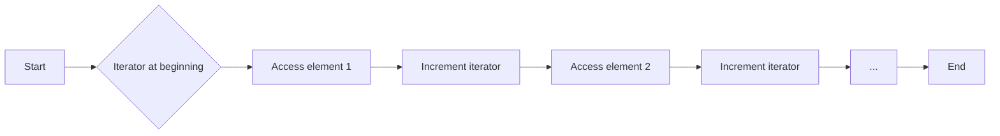

# <span style="color:#e67e22;">What we will learn in this post?</span>
<ul style='list-style-type: none; padding-left: 0;'>
<li><span style='color: #2980b9; font-size: 20px; font-weight: bold;'>👉</span> <span style='color: #2ecc71; font-size: 18px; font-weight: bold;'>Introduction to C++ Iterators</span></li>
<li><span style='color: #2980b9; font-size: 20px; font-weight: bold;'>👉</span> <span style='color: #2ecc71; font-size: 18px; font-weight: bold;'>C++ Input Iterators</span></li>
<li><span style='color: #2980b9; font-size: 20px; font-weight: bold;'>👉</span> <span style='color: #2ecc71; font-size: 18px; font-weight: bold;'>C++ Output Iterators</span></li>
<li><span style='color: #2980b9; font-size: 20px; font-weight: bold;'>👉</span> <span style='color: #2ecc71; font-size: 18px; font-weight: bold;'>C++ Forward Iterators</span></li>
<li><span style='color: #2980b9; font-size: 20px; font-weight: bold;'>👉</span> <span style='color: #2ecc71; font-size: 18px; font-weight: bold;'>C++ Bidirectional Iterators</span></li>
<li><span style='color: #2980b9; font-size: 20px; font-weight: bold;'>👉</span> <span style='color: #2ecc71; font-size: 18px; font-weight: bold;'>C++ Random Access Iterators</span></li>
<li><span style='color: #2980b9; font-size: 20px; font-weight: bold;'>👉</span> <span style='color: #2ecc71; font-size: 18px; font-weight: bold;'>C++ istream_iterator and ostream_iterator</span></li>
<li><span style='color: #2980b9; font-size: 20px; font-weight: bold;'>👉</span> <span style='color: #2ecc71; font-size: 18px; font-weight: bold;'>Difference between C++ Iterators and Pointers</span></li>
<li><span style='color: #2980b9; font-size: 20px; font-weight: bold;'>👉</span> <span style='color: #2ecc71; font-size: 18px; font-weight: bold;'>Conclusion!</span></li>
</ul>

# <span style="color:#e67e22">C++ Iterators: Your Keys to Container Exploration 🔑</span>


## <span style="color:#2980b9">What are Iterators?</span>

Imagine you have a treasure chest (a C++ container like a `vector` or `list`).  Iterators are like special keys that let you access and traverse each treasure (element) inside, one by one, without needing to know the chest's internal structure.  They provide a *uniform* way to access elements across various container types.


### <span style="color:#8e44ad">How They Work</span>

Iterators are objects that point to a specific element within a container. You can use them to:

*   **Move forward:** Access the next element.
*   **Move backward:** (For some iterators) Access the previous element.
*   **Check for the end:** Determine if you've reached the last element.

```c++
#include <iostream>
#include <vector>

int main() {
  std::vector<int> numbers = {1, 2, 3, 4, 5};
  for (auto it = numbers.begin(); it != numbers.end(); ++it) {  //Iterators 'begin' and 'end'
    std::cout << *it << " "; // *it dereferences iterator to get the value
  }
  std::cout << std::endl;
  return 0;
}
```

## <span style="color:#2980b9">Types of Iterators</span>

There are several iterator categories, each with different capabilities:

*   **Input iterators:** Read-only, forward traversal.
*   **Output iterators:** Write-only, forward traversal.
*   **Forward iterators:** Read and write, forward traversal.
*   **Bidirectional iterators:** Read and write, forward and backward traversal.
*   **Random access iterators:** Read and write, direct access to any element (like array indexing).


## <span style="color:#2980b9">Example: Using Iterators with a Vector</span>

```mermaid
graph LR
A[vector<int> numbers] --> B{numbers.begin()};
B --> C[Iterator points to the first element];
C --> D{++it (Increment Iterator)};
D --> E[Iterator points to the next element];
E --> F{Check if it == numbers.end()};
F -- Yes --> G[Loop ends];
F -- No --> D;
```

This diagram shows how an iterator moves through a vector.


**Further Reading:**  For more in-depth information, refer to your preferred C++ documentation or online resources.  A good starting point would be a C++ tutorial site  [like this one](https://www.learncpp.com/cpp-tutorial/introduction-to-iterators/) (replace with a relevant link).  Remember to search for "C++ iterators" for numerous helpful articles and tutorials.


# <span style="color:#e67e22">Input Iterators in C++: A Friendly Guide 😀</span>

## <span style="color:#2980b9">What are Input Iterators? 🤔</span>

Input iterators are a type of iterator in C++ that allows you to traverse a sequence of elements *only once* in the *forward* direction. Think of it like a one-way street for your data!  They're the simplest type of iterator.  You can read the value at the current position, but you can't modify it, go backward, or easily jump around.

### <span style="color:#8e44ad">How they work ✨</span>

Input iterators provide a way to access elements sequentially.  They use the dereference operator (`*`) to get the value and the increment operator (`++`) to move to the next element.  Once you've moved past an element, you can't go back to it!

## <span style="color:#2980b9">Example: Reading from a `std::istream` 📖</span>

```c++
#include <iostream>
#include <iterator>

int main() {
  std::istream_iterator<int> it(std::cin); // Input iterator for reading ints from cin
  std::istream_iterator<int> end;         // End iterator

  while (it != end) {
    std::cout << *it << " ";  // Access the value
    ++it;                     // Move to the next element
  }
  std::cout << std::endl;
  return 0;
}
```

This code reads integers from the standard input (`std::cin`) until the end of the input is reached.  `std::istream_iterator` is a classic example of an input iterator.


## <span style="color:#2980b9">Key Characteristics 🎯</span>

*   **One-way traversal:** Only forward movement is allowed.
*   **Read-only:**  You can only read values; you cannot modify them.
*   **Single pass:** You can traverse the sequence only once.


## <span style="color:#2980b9">Further Reading 📚</span>

For a deeper dive into iterators and their categories, check out the official C++ documentation or a good C++ textbook.  Searching for "C++ iterators" online will yield plenty of helpful resources.


**Note:**  While simple, input iterators are fundamental to understanding more complex iterator types in C++.  Mastering them is a crucial step in writing efficient and elegant C++ code!


# <span style="color:#e67e22">Output Iterators:  A Friendly Introduction 🤝</span>

Imagine a conveyor belt for data.  Output iterators in C++ are like that belt, taking data and sending it *out* somewhere, typically to a container or a file.  Unlike input iterators which read data, output iterators only *write*. They don't allow reading back what's already been written.

## <span style="color:#2980b9">How They Work ✨</span>

Output iterators provide a one-way street for data flow.  You can assign values to them (`*it = value;`), and you can increment them (`++it;`) to move to the next position to write.  However, you can't access the previously written values or decrement.

### <span style="color:#8e44ad">Example: Writing to a `vector`</span>

```c++
#include <iostream>
#include <vector>
#include <algorithm>

int main() {
  std::vector<int> myVec;
  std::back_inserter<std::vector<int>> it = std::back_inserter(myVec); //Creates output iterator for vector

  *it = 10; ++it; //Write 10
  *it = 20; ++it; //Write 20
  *it = 30;       //Write 30

  for (int x : myVec) std::cout << x << " "; // Output: 10 20 30
  std::cout << std::endl;
  return 0;
}
```


## <span style="color:#2980b9">Key Uses 🎯</span>

*   Writing to containers like `vector`, `deque`, etc., using `std::back_inserter`.
*   Sending data to output streams (like files).
*   Used in algorithms like `std::copy` to write data to a destination.

**Important Note:** Output iterators are *single-pass*. You can't go back and modify previous elements.


## <span style="color:#2980b9">Further Exploration 🚀</span>

For more in-depth information, you can refer to:

*   [cppreference.com iterators](https://en.cppreference.com/w/cpp/iterator)  (Comprehensive documentation)


This example showcases the basic concept.  Remember, output iterators are a vital part of C++ for efficiently handling data output, especially when combined with algorithms that process data sequentially.


# <span style="color:#e67e22">Forward Iterators in C++: A Friendly Guide 😊</span>

Forward iterators are a type of iterator in C++ that allow you to traverse a collection of data *one way*, from beginning to end.  Think of it like walking down a one-way street – you can only move forward! 🚶‍♂️

## <span style="color:#2980b9">Key Characteristics ✨</span>

* **Single Pass:** You can only traverse the collection once.  After you've gone past an element, you can't go back to it.
* **Read-only (Usually):** While you can read the value at the current position, you typically *cannot* modify the element using a forward iterator.  Modifying usually needs a different iterator type.
* **Efficiency:**  Forward iterators offer a good balance between functionality and performance. They are more efficient than random-access iterators (which allow jumping to any position), but less efficient than input iterators.


### <span style="color:#8e44ad">Example: Using `std::list`</span>

```c++
#include <iostream>
#include <list>

int main() {
  std::list<int> myList = {1, 2, 3, 4, 5};
  for (auto it = myList.begin(); it != myList.end(); ++it) {
    std::cout << *it << " "; // Accessing element value using dereference operator *
  }
  std::cout << std::endl; // Output: 1 2 3 4 5
  return 0;
}
```

The `std::list`'s iterators are forward iterators.


## <span style="color:#2980b9">Visual Representation 📊</span>



This diagram shows the sequential nature of forward iteration.


**Important Note:**  For more in-depth information and a complete list of iterator categories, refer to the official C++ documentation [here](https://en.cppreference.com/w/cpp/iterator).  Understanding iterators is crucial for efficient and elegant C++ programming! 👍


# <span style="color:#e67e22">Bidirectional Iterators: A Friendly Guide</span> 🚶‍♀️➡️🚶‍♂️

## <span style="color:#2980b9">What are they?</span>

Bidirectional iterators are like super-powered pointers!  They let you traverse a container (like a `std::list` or `std::set`) in *both* directions – forward and backward.  Think of walking a street: you can go forwards and then turn around and go backwards.  Regular iterators can only go one way.


### <span style="color:#8e44ad">Key Features</span>

*   **Forward and Backward Movement:**  The core feature is the ability to use `++` (increment) and `--` (decrement) operators.
*   **Random Access Not Guaranteed:** Unlike random-access iterators (like those for `std::vector`), you can't jump directly to a specific element using arithmetic. You have to step through one by one.

## <span style="color:#2980b9">C++ Usage Example ✨</span>

```c++
#include <iostream>
#include <list>

int main() {
  std::list<int> myList = {1, 2, 3, 4, 5};
  auto it = myList.begin(); // Get a bidirectional iterator

  std::cout << "Forward traversal: ";
  while (it != myList.end()) {
    std::cout << *it << " ";
    ++it; // Move forward
  }
  std::cout << std::endl;

  it--; // Move back one position
  std::cout << "Backward traversal: ";
  while (it != myList.begin()){
    std::cout << *it << " ";
    --it; //Move backward
  }
  std::cout << *it << std::endl;
  return 0;
}
```

This code shows how to traverse a `std::list` in both directions using bidirectional iterators.


## <span style="color:#2980b9">Further Reading 📚</span>

For a deeper dive into iterators and their categories in C++, check out:  [cppreference.com](https://en.cppreference.com/w/cpp/iterator) (search for "Iterator categories").


This provides a basic understanding.  Remember to consult the C++ documentation for a comprehensive explanation!


# <span style="color:#e67e22">Random Access Iterators 🤩</span>

Imagine a book. You can easily jump to any page (element) directly, without reading every page before it.  Random access iterators in C++ work similarly! They let you access any element in a container (like an array or `std::vector`) instantly using pointer arithmetic.

## <span style="color:#2980b9">Advantages 🚀</span>

* **Speed:**  Direct access is incredibly fast, much faster than sequential access (like with iterators that need to traverse the container).  This is crucial for performance-sensitive applications.
* **Flexibility:** You can easily perform operations like jumping forward or backward a certain number of elements, making algorithms more efficient.


### <span style="color:#8e44ad">Example 💡</span>

```c++
#include <iostream>
#include <vector>

int main() {
  std::vector<int> numbers = {10, 20, 30, 40, 50};
  
  // Accessing the 3rd element (index 2) directly
  std::cout << "Third element: " << *(numbers.begin() + 2) << std::endl; // Output: 30

  // Jumping ahead 2 elements from the beginning
  std::cout << "Element 2 positions from the beginning: " << *(numbers.begin() + 2) << std::endl; // Output: 30

  return 0;
}
```

In this example, `numbers.begin()` gives a pointer to the start of the `numbers` vector. Adding `2` to it using pointer arithmetic instantly gets us to the third element.  *Note:*  Not all C++ iterators support this; only *random access* iterators do.


## <span style="color:#2980b9">When to Use Them 🤔</span>

Use random access iterators when:

* You need to access elements by their index frequently.
* Performance is critical.
* Your algorithm benefits from direct element access.

For more in-depth information, consider exploring these resources:

* [cppreference - Iterators](https://en.cppreference.com/w/cpp/iterator)


This is a simplified explanation, but hopefully it gives a good grasp of the concept!  Feel free to ask if you have more questions. 😊


# <span style="color:#e67e22">Introducing `istream_iterator` and `ostream_iterator` ✨</span>

## <span style="color:#2980b9">What are they?</span>

`istream_iterator` and `ostream_iterator` are powerful tools in C++ that act as bridges between input/output streams and standard containers like vectors.  Think of them as adapters that let you easily read data *from* a stream (like a file) into a container, or write data *to* a stream (like the console) from a container.  They make working with streams much cleaner and more efficient!


### <span style="color:#8e44ad">`istream_iterator` (Input)</span>

This iterator reads data from an input stream.  It's perfect for easily loading data from files or other input sources into your program.

```c++
#include <iostream>
#include <iterator>
#include <vector>
#include <fstream>

int main() {
  std::ifstream file("my_data.txt");
  std::vector<int> numbers(std::istream_iterator<int>(file), std::istream_iterator<int>()); 
  //Loads numbers from file into vector
  for (int x : numbers) std::cout << x << " ";
  return 0;
}
```

### <span style="color:#8e44ad">`ostream_iterator` (Output)</span>

This iterator writes data to an output stream.  Great for sending data to the console, a file, or any other output destination.

```c++
#include <iostream>
#include <iterator>
#include <vector>

int main() {
  std::vector<int> nums = {1, 2, 3, 4, 5};
  std::copy(nums.begin(), nums.end(), std::ostream_iterator<int>(std::cout, " "));
  //Prints numbers to console
  return 0;
}
```


## <span style="color:#2980b9">Use Cases 💡</span>

*   **Reading from files:**  Populate vectors or other containers directly from file contents.
*   **Writing to files:**  Easily save data from containers to files.
*   **Processing streams:**  Efficiently handle large datasets streamed from various sources.
*   **Console output:**  Neatly print container contents to the console.


[More info on iterators](https://en.cppreference.com/w/cpp/iterator)

[More info on input/output streams](https://en.cppreference.com/w/cpp/io)

Note: Remember to include `<iostream>`, `<iterator>`, and other necessary headers.  Error handling (e.g., checking if a file opens successfully) is crucial in real-world applications.


# <span style="color:#e67e22">C++ Iterators vs. Pointers: A Friendly Comparison 🤝</span>

Both iterators and pointers in C++ let you traverse data structures, but they have key differences.  Think of pointers as raw memory addresses, while iterators are more *abstract* and *safe*.


## <span style="color:#2980b9">Pointers 📌</span>

*   **Direct Memory Access:** Pointers directly point to a memory location.  This gives you *low-level control*, but also more responsibility.
*   **Example:** `int* ptr = &myVar;`  This declares `ptr` as a pointer to an integer and assigns it the address of `myVar`.
*   **Advantages:**  Speed and fine-grained control.
*   **Disadvantages:**  Error-prone (dangling pointers, memory leaks) and less flexible with different container types.

### <span style="color:#8e44ad">Pointer Arithmetic</span>
You can perform arithmetic operations on pointers (e.g., `ptr++` to move to the next element), but this is only valid for contiguous data.

## <span style="color:#2980b9">Iterators ✨</span>

*   **Abstraction:** Iterators provide a more *generalized* way to access elements in various data structures (arrays, lists, maps etc.) without worrying about the underlying memory layout.
*   **Example:** `std::vector<int>::iterator it = myVector.begin();` This gets an iterator to the beginning of `myVector`.
*   **Advantages:** Safer, more flexible, and work consistently across diverse containers.
*   **Disadvantages:**  Can be slightly less efficient than pointers for simple scenarios.


## <span style="color:#2980b9">Key Differences Summarized 📝</span>

| Feature         | Pointer                               | Iterator                                  |
|-----------------|---------------------------------------|-------------------------------------------|
| **Memory Access** | Direct                                | Abstract                                   |
| **Flexibility**   | Limited to contiguous data           | Works with various container types          |
| **Safety**       | Prone to errors                        | More robust, error handling is built in |
| **Performance**  | Generally faster                      | Slightly slower in some simple cases      |


For more detailed information:

* [cppreference iterators](https://en.cppreference.com/w/cpp/iterator)
* [LearnCpp.com Pointers](https://www.learncpp.com/cpp-tutorial/introduction-to-pointers/)


Remember, iterators are generally preferred for their safety and flexibility, unless performance is absolutely critical and you are working with raw memory.  Choose the tool that best suits your needs! 👍


<h1><span style='color:#e67e22'>Conclusion</span></h1>

So there you have it!  We've covered a lot of ground today, and hopefully, you found it helpful and interesting. 😊  But the conversation doesn't end here!  We'd love to hear your thoughts, questions, and any brilliant ideas you might have.  What did you think of [mention a key topic or element of the blog post]?  What other things would you like to see covered?  Let us know in the comments below! 👇  We're excited to chat with you! 🎉


