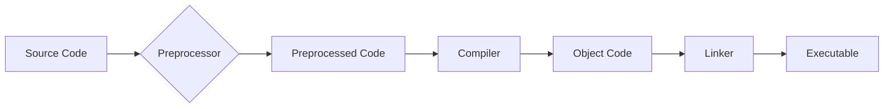
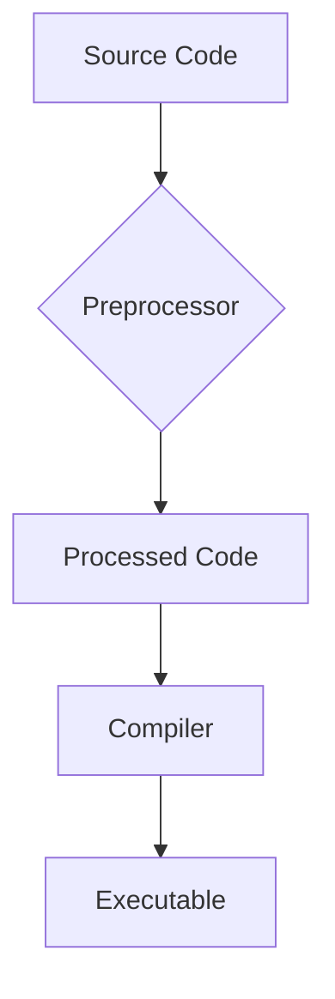
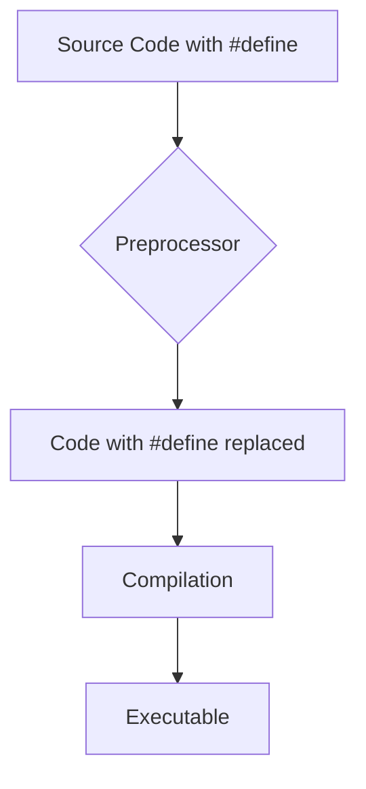

# <span style="color:#e67e22;">What we will learn in this post?</span>
<ul style='list-style-type: none; padding-left: 0;'>
<li><span style='color: #2980b9; font-size: 20px; font-weight: bold;'>👉</span> <span style='color: #2ecc71; font-size: 18px; font-weight: bold;'>C++ Preprocessor</span></li>
<li><span style='color: #2980b9; font-size: 20px; font-weight: bold;'>👉</span> <span style='color: #2ecc71; font-size: 18px; font-weight: bold;'>C++ Preprocessor Directives</span></li>
<li><span style='color: #2980b9; font-size: 20px; font-weight: bold;'>👉</span> <span style='color: #2ecc71; font-size: 18px; font-weight: bold;'>#include Directive</span></li>
<li><span style='color: #2980b9; font-size: 20px; font-weight: bold;'>👉</span> <span style='color: #2ecc71; font-size: 18px; font-weight: bold;'>#define Directive</span></li>
<li><span style='color: #2980b9; font-size: 20px; font-weight: bold;'>👉</span> <span style='color: #2ecc71; font-size: 18px; font-weight: bold;'>Conditional Preprocessors</span></li>
<li><span style='color: #2980b9; font-size: 20px; font-weight: bold;'>👉</span> <span style='color: #2ecc71; font-size: 18px; font-weight: bold;'>Difference between C++ Preprocessor Directives and Function Templates</span></li>
<li><span style='color: #2980b9; font-size: 20px; font-weight: bold;'>👉</span> <span style='color: #2ecc71; font-size: 18px; font-weight: bold;'>Conclusion!</span></li>
</ul>

# <span style="color:#e67e22">Meet the C++ Preprocessor: Your Code's Prep Chef 🧑‍🍳</span>

Before your C++ code even gets compiled into machine-readable instructions, it goes through a crucial step: preprocessing!  Think of the preprocessor as a helpful chef prepping ingredients before the main cook (the compiler) takes over.  It's a separate program that modifies your code *before* the compiler sees it.

## <span style="color:#2980b9">What Does it Do? 🤔</span>

The preprocessor handles several important tasks, making your coding life easier:

* **Macro Replacement:** It replaces simple text patterns (macros) with other text.  For instance, `#define PI 3.14159` replaces all occurrences of `PI` with `3.14159`.
* **File Inclusion:** The `#include` directive inserts the contents of header files (like `<iostream>` for input/output) into your code.  This avoids code repetition and promotes modularity.  Think of it as adding pre-made ingredients to your recipe!
* **Conditional Compilation:**  Using directives like `#ifdef`, `#ifndef`, and `#endif`, you can selectively include or exclude parts of your code based on conditions. This is great for creating different versions of your program (e.g., a debug version and a release version).

### <span style="color:#8e44ad">A Simple Example ✨</span>

```c++
#include <iostream> // Include iostream header

#define MAX 100 // Define a macro

int main() {
  std::cout << "MAX is: " << MAX << std::endl; // Using the macro
  return 0;
}
```

## <span style="color:#2980b9">The Compilation Process Flowchart ➡️</span>



## <span style="color:#2980b9">Key Takeaways 💡</span>

* The preprocessor is a *separate* program that runs *before* the compiler.
* It handles *textual* transformations, making your code more manageable and reusable.
* Mastering the preprocessor is key to writing efficient and maintainable C++ code.


For more information, check out these resources:

* [LearnCpp.com](https://www.learncpp.com/preprocessor/)  (Highly recommended!)
* [cppreference.com](https://en.cppreference.com/w/cpp/preprocessor) (Comprehensive reference)


Remember, the preprocessor is a powerful tool, but use it wisely! Overuse can lead to confusing code.  Happy coding! 😄


# <span style="color:#e67e22">C++ Preprocessor Directives: A Friendly Guide 🧑‍💻</span>

The C++ preprocessor is like a helpful assistant that prepares your code *before* the compiler gets its hands on it.  It handles special instructions called *directives*, all starting with `#`. Let's explore some common ones!

## <span style="color:#2980b9">Common Directives ✨</span>

### <span style="color:#8e44ad">#include</span>

This directive imports code from external files (header files).  Think of it like adding ingredients to your recipe!

*   `#include <iostream>`  imports the input/output stream library.
*   `#include "myheader.h"` imports a custom header file.


### <span style="color:#8e44ad">#define</span>

This creates *macros*: symbolic constants or simple code replacements.  It helps with readability and maintainability.

*   `#define PI 3.14159` defines a constant PI.  Using `PI` later replaces it with 3.14159.
*   `#define SQUARE(x) ((x)*(x))` creates a macro to calculate squares.

### <span style="color:#8e44ad">#ifdef, #ifndef, #else, #endif</span>

These are *conditional compilation* directives. They allow you to include or exclude code blocks based on certain conditions, such as the compiler or platform.

```c++
#ifdef DEBUG
    std::cout << "Debug mode activated!" << std::endl;
#endif
```

This code only prints the debug message if the `DEBUG` macro is defined.


## <span style="color:#2980b9">A Simple Flowchart 📊</span>




**Note:**  Preprocessor directives greatly impact build times and code readability.  Use them judiciously!


For more detailed information, refer to:

* [cppreference](https://en.cppreference.com/w/cpp/preprocessor)
* [LearnCpp](https://www.learncpp.com/cpp-tutorial/preprocessor-directives/)


Remember to always comment your code effectively, especially when using preprocessor directives, to ensure clarity and maintainability! 😊


# <span style="color:#e67e22">Understanding the `#include` Directive in C++</span> 🤝

The `#include` directive is your C++ code's way of getting access to pre-written code libraries.  Think of it like borrowing tools from a well-stocked toolbox!  It saves you time and effort by providing ready-made functions and classes.

## <span style="color:#2980b9">Purpose of `#include`</span> 🧰

Its main job is to *include* the contents of another file into your current source code file.  These files often contain definitions for things like input/output operations, mathematical functions, or specific data structures.

### <span style="color:#8e44ad">How it Works</span> ⚙️

The compiler replaces the `#include` line with the actual contents of the included file *before* compiling your code.  This makes all the functions and classes defined in that file readily available to your program.

## <span style="color:#2980b9">Examples</span> 💡

Here are a couple of examples:

* **Including the standard input/output library:**

```c++
#include <iostream>

int main() {
  std::cout << "Hello, world!" << std::endl;
  return 0;
}
```
This line brings in `iostream`, which gives you access to  `std::cout` (for printing to the console) and `std::endl` (for adding a newline).


* **Including a custom header file:**  Let's say you have a file named `my_functions.h` containing some functions.  You'd include it like this:

```c++
#include "my_functions.h" // Note the double quotes
```
Double quotes tell the compiler to search in the current directory for the file, while angle brackets `< >` indicate that the file is located in the compiler's standard include paths.


## <span style="color:#2980b9">Types of Includes</span> 🤔

* **Standard Libraries:** Use angle brackets `<>` (e.g., `<iostream>`, `<cmath>`, `<string>`). These are part of the standard C++ library.
* **Custom Headers:** Use double quotes `""` (e.g., `"myheader.h"`). These are files you've created yourself.


For more in-depth information, check out these resources:

* [cppreference](https://en.cppreference.com/w/)  A comprehensive C++ reference website.
* [LearnCpp.com](https://www.learncpp.com/) A great tutorial site for learning C++.


Remember, `#include` is a *preprocessor directive*, not a function call, so it doesn't have a return value or execute at runtime. It's handled before the compilation phase begins.


# <span style="color:#e67e22">Understanding the `#define` Directive in C++</span> 🧡

The `#define` directive is a powerful C++ preprocessor directive.  Think of it as a simple "find and replace" tool that happens *before* your code is actually compiled.  It lets you define *constants* and *macros*, making your code more readable and maintainable.


## <span style="color:#2980b9">Defining Constants</span> ⚙️

### <span style="color:#8e44ad">Simple Constant Definition</span>

You can use `#define` to give meaningful names to numeric values:

```c++
#define PI 3.14159
```

This replaces every instance of `PI` in your code with `3.14159` during preprocessing.


### <span style="color:#8e44ad">Example Usage</span>

```c++
#include <iostream>

#define RADIUS 5

int main() {
  double area = PI * RADIUS * RADIUS; // PI is replaced before compilation
  std::cout << "Area: " << area << std::endl;
  return 0;
}
```

## <span style="color:#2980b9">Defining Macros</span> 🛠️

Macros can be more complex, involving expressions or even code blocks:

```c++
#define SQUARE(x) ((x) * (x)) 
```

This macro takes an argument `x` and returns its square.  The extra parentheses are crucial to avoid unexpected behavior with complex expressions.

```c++
int result = SQUARE(5 + 2); //result will be 49, not 17
```


## <span style="color:#2980b9">Important Note:  Debugging and Best Practices</span> 🤔

While useful, `#define` can make debugging harder as the replacements happen before compilation.  Consider using `const` variables or `constexpr` (C++11 and later) for constants whenever possible, as they offer better type safety and debugging support.


**Resources:**

* [Learn more about C++ preprocessor](https://en.cppreference.com/w/cpp/preprocessor)


**Diagram (simplified):**



Remember that using `#define` judiciously is essential for readable and manageable C++ projects.  Overuse can lead to confusion.


# <span style="color:#e67e22">Conditional Preprocessing in C++ 🛠️</span>

Conditional preprocessors in C++ are like smart switches that control which parts of your code get compiled.  They're super useful for creating flexible and adaptable code! Think of them as instructions to your compiler saying, "Only include *this* code if *that* condition is true."

## <span style="color:#2980b9">Why Use Them? 🤔</span>

*   **Debugging:**  Easily include or exclude debugging code based on a defined symbol.
*   **Platform-specific code:** Write code that adapts to different operating systems (Windows, Linux, macOS) without major changes.
*   **Configuration options:**  Customize your program's behavior by compiling different features based on user settings.


### <span style="color:#8e44ad">Example: Debugging Mode 🐞</span>

```c++
#ifdef DEBUG_MODE // Only include if DEBUG_MODE is defined
    std::cout << "Debugging message: Variable x = " << x << std::endl; 
#endif
```

To enable debugging, you'd compile with a flag like `-DDEBUG_MODE` (depending on your compiler).  If you omit this flag, the debugging message is skipped during compilation.


## <span style="color:#2980b9">Common Preprocessor Directives ⚙️</span>

*   `#ifdef <identifier>`: Checks if an identifier is defined.
*   `#ifndef <identifier>`: Checks if an identifier is *not* defined.
*   `#else`: Provides an alternative code block if the previous condition is false.
*   `#endif`: Marks the end of a conditional block.
*   `#define <identifier> <value>`: Defines a preprocessor macro.


### <span style="color:#8e44ad">Example: Platform-Specific Code 💻</span>

```c++
#ifdef _WIN32 // Windows-specific code
    // Windows-specific functions here...
#elif __linux__ // Linux-specific code
    // Linux-specific functions here...
#else
    // Default code (for other systems)
#endif
```

This example shows how to use preprocessor directives to write code that works on multiple operating systems.


For more information, check out these resources:

* [LearnCpp.com](https://www.learncpp.com/cpp-tutorial/preprocessor-directives/) (Great tutorial!)
* [CppReference](https://en.cppreference.com/w/cpp/preprocessor) (Comprehensive reference)


Remember, using conditional preprocessing effectively improves code clarity and maintainability!  Don't overuse it, though—overly complex preprocessor logic can make your code harder to understand.


# <span style="color:#e67e22">Preprocessor Directives vs. Function Templates 🛠️</span>

Let's explore the key differences between C++ preprocessor directives and function templates.  Both impact code generation, but in vastly different ways.

## <span style="color:#2980b9">Preprocessor Directives ⚙️</span>

Preprocessor directives, like `#include` and `#define`, operate *before* the compiler sees your code.  They perform text manipulations.

### <span style="color:#8e44ad">Example: `#define`</span>

```c++
#define PI 3.14159
double circumference(double radius) { return 2 * PI * radius; }
```

Here, `#define` replaces all instances of `PI` with `3.14159`.  This is simple text substitution – *no type checking*.


## <span style="color:#2980b9">Function Templates ✨</span>

Function templates, using `template <typename T>`, generate code for *different types* at compile time. They offer *type safety* and code reusability.

### <span style="color:#8e44ad">Example: Generic Function</span>

```c++
template <typename T>
T max(T a, T b) { return (a > b) ? a : b; }

int main() {
  int x = max(5, 10); // max<int> is generated
  double y = max(3.14, 2.71); // max<double> is generated
}
```

Here, a single template generates `max` functions for `int`, `double`, etc., as needed. This is *code generation*, not text substitution.


## <span style="color:#2980b9">Key Differences Summarized 📝</span>

* **Preprocessor:** Text manipulation; *no* type checking; happens *before* compilation.
* **Templates:** Code generation; *type-safe*; happens *during* compilation.

Preprocessor directives are useful for simple text replacements and conditional compilation. Function templates are powerful tools for generic programming and code reusability.


**Resources:**

* [LearnCpp](https://www.learncpp.com/cpp-tutorial/introduction-to-preprocessor-directives/)
* [C++ Templates Tutorial](https://www.geeksforgeeks.org/templates-cpp/)


Remember to choose the right tool for the job!  Preprocessor directives for simple tasks, and function templates for type-safe, reusable code.


<h1><span style='color:#e67e22'>Conclusion</span></h1>

So there you have it!  We've covered a lot of ground today, and hopefully, you found it helpful and insightful. 😊  But the conversation doesn't end here! We'd love to hear your thoughts, feedback, and any suggestions you might have.  What did you think of the points raised? Did anything surprise you? 🤔  Let's keep the discussion going in the comments below! 👇  Your input is valuable and will help us improve.  We can't wait to read what you have to say! 🎉


