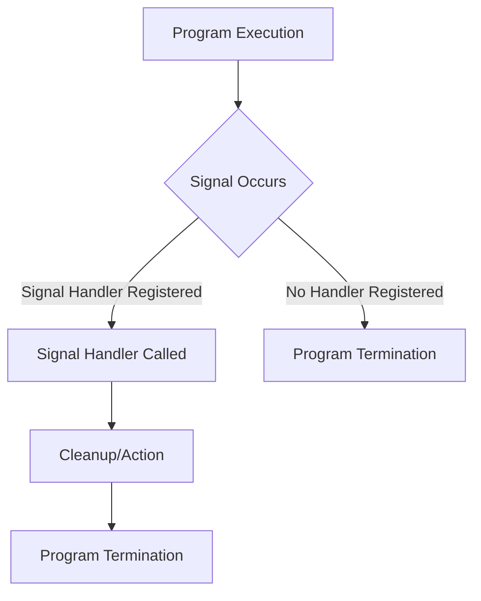

# <span style="color:#e67e22;">What we will learn in this post?</span>
<ul style='list-style-type: none; padding-left: 0;'>
<li><span style='color: #2980b9; font-size: 20px; font-weight: bold;'>👉</span> <span style='color: #2ecc71; font-size: 18px; font-weight: bold;'>C++ Multithreading</span></li>
<li><span style='color: #2980b9; font-size: 20px; font-weight: bold;'>👉</span> <span style='color: #2ecc71; font-size: 18px; font-weight: bold;'>C++ Smart Pointers</span></li>
<li><span style='color: #2980b9; font-size: 20px; font-weight: bold;'>👉</span> <span style='color: #2ecc71; font-size: 18px; font-weight: bold;'>Differences between Different C++ Smart Pointers</span></li>
<li><span style='color: #2980b9; font-size: 20px; font-weight: bold;'>👉</span> <span style='color: #2ecc71; font-size: 18px; font-weight: bold;'>Type of ‘this’ Pointer in C++</span></li>
<li><span style='color: #2980b9; font-size: 20px; font-weight: bold;'>👉</span> <span style='color: #2ecc71; font-size: 18px; font-weight: bold;'>Delete ‘this’ Pointer in C++</span></li>
<li><span style='color: #2980b9; font-size: 20px; font-weight: bold;'>👉</span> <span style='color: #2ecc71; font-size: 18px; font-weight: bold;'>Passing C++ Function as a Parameter</span></li>
<li><span style='color: #2980b9; font-size: 20px; font-weight: bold;'>👉</span> <span style='color: #2ecc71; font-size: 18px; font-weight: bold;'>C++ Signal Handling</span></li>
<li><span style='color: #2980b9; font-size: 20px; font-weight: bold;'>👉</span> <span style='color: #2ecc71; font-size: 18px; font-weight: bold;'>C++ Generics</span></li>
<li><span style='color: #2980b9; font-size: 20px; font-weight: bold;'>👉</span> <span style='color: #2ecc71; font-size: 18px; font-weight: bold;'>Conclusion!</span></li>
</ul>

# <span style="color:#e67e22">C++ Multithreading: Making Your Code Faster ⚡️</span>

Multithreading in C++ lets your program do multiple tasks *at the same time*, like a chef preparing several dishes simultaneously.  This is crucial in modern programming for improving performance, especially on multi-core processors.  Instead of one task finishing before the next starts, threads allow for *concurrent execution*, boosting speed and responsiveness.

## <span style="color:#2980b9">Why Use Multithreading? 🤔</span>

*   **Improved Performance:** Handle multiple tasks concurrently, reducing overall execution time.
*   **Responsiveness:** Keep your application responsive even during long-running operations.
*   **Resource Utilization:** Effectively utilize multi-core processors.


## <span style="color:#2980b9">Implementing Multithreading in C++ 💪</span>

C++ offers several ways to create threads. The `<thread>` library (introduced in C++11) is a user-friendly approach.

### <span style="color:#8e44ad">Example:  A Simple Thread</span>

```cpp
#include <iostream>
#include <thread>

void myThreadFunction() {
  std::cout << "Hello from a thread!\n";
}

int main() {
  std::thread myThread(myThreadFunction);  // Create a thread
  myThread.join(); // Wait for the thread to finish
  return 0;
}
```

This creates a thread that executes `myThreadFunction`. `myThread.join()` ensures the main thread waits for the created thread to complete before exiting.

## <span style="color:#2980b9">Further Exploration 🚀</span>

*   **More complex scenarios:**  Explore thread synchronization mechanisms (mutexes, condition variables) to manage shared resources and avoid data races.
*   **Thread pools:**  Efficiently manage a pool of threads for handling many tasks.

For more in-depth information:

* [cppreference.com](https://en.cppreference.com/w/cpp/thread)


Remember to handle thread synchronization carefully to avoid unexpected behavior!  Happy threading! 😄


# <span style="color:#e67e22">C++ Smart Pointers: Your Memory Management Helpers ✨</span>

Traditional C++ pointers can be tricky!  They require manual memory management, leading to potential memory leaks and dangling pointers.  Smart pointers solve this problem.  They automatically manage memory, making your code safer and easier to read.

## <span style="color:#2980b9">Types of Smart Pointers</span>

There are three main types:

### <span style="color:#8e44ad">`unique_ptr` ☝️</span>

*   Exclusive ownership: Only one `unique_ptr` can point to a given object at a time.  The object is deleted when the `unique_ptr` goes out of scope.
*   Example: `std::unique_ptr<int> ptr(new int(10));`

### <span style="color:#8e44ad">`shared_ptr` 🤝</span>

*   Shared ownership: Multiple `shared_ptr`s can point to the same object. The object is deleted only when the last `shared_ptr` pointing to it is destroyed.  Uses reference counting.
*   Example: `std::shared_ptr<int> ptr(new int(10));`

### <span style="color:#8e44ad">`weak_ptr` 👀</span>

*   Weak reference: Doesn't increase the reference count. Used to check if a shared object still exists without extending its lifetime. Prevents circular dependencies.
*   Example: `std::weak_ptr<int> wptr = ptr;`


## <span style="color:#2980b9">Benefits over Raw Pointers</span>

*   **Automatic Memory Management:**  No more `delete`!
*   **Preventing Memory Leaks:**  Smart pointers automatically free memory when no longer needed.
*   **Safer Code:** Reduces the risk of dangling pointers and other memory-related errors.
*   **Improved Readability:** Makes code easier to understand and maintain.


## <span style="color:#2980b9">Example: Avoiding Memory Leaks</span>

```c++
#include <memory>

int main() {
  // Using smart pointers
  std::unique_ptr<int> smartPtr(new int(5)); 
  // Memory automatically freed when smartPtr goes out of scope

  //Using raw pointers (prone to leaks)
  int* rawPtr = new int(5); //Memory allocated
  // ... some code ...
  //delete rawPtr; //Must manually delete, prone to error if forgotten
  return 0;
}
```

For more detailed information, check out these resources:

* [cppreference - smart pointers](https://en.cppreference.com/w/cpp/memory)


<br>

This simple example demonstrates how smart pointers simplify memory management and enhance code safety.  They are a crucial part of modern C++ programming! 🎉


# <span style="color:#e67e22">C++ Smart Pointers: A Friendly Guide 🤝</span>

C++ smart pointers are like helpful assistants that manage the memory for you, preventing leaks and making your code safer.  Let's explore the main players:

## <span style="color:#2980b9">`unique_ptr` 🥇 (Exclusive Ownership)</span>

*   A `unique_ptr` has *exclusive* ownership of the dynamically allocated object.  Only one `unique_ptr` can point to a given object at a time.  When the `unique_ptr` goes out of scope, the object is automatically deleted.

    ```c++
    std::unique_ptr<int> ptr = std::make_unique<int>(10); //Recommended way to create
    // ...use ptr...
    ```

### <span style="color:#8e44ad">Key Features</span>
*   *Exclusive ownership*: Only one `unique_ptr` can point to a resource at a time.
*   *Automatic deletion*: The resource is deleted when the `unique_ptr` goes out of scope.
*   *Non-copyable*: You cannot copy a `unique_ptr`. You can however move it using `std::move`.


## <span style="color:#2980b9">`shared_ptr` 🤝 (Shared Ownership)</span>

*   Multiple `shared_ptr`s can point to the same object.  A reference counter keeps track of how many `shared_ptr`s are pointing to it. When the count reaches zero, the object is deleted.

    ```c++
    std::shared_ptr<int> ptr1 = std::make_shared<int>(20);
    std::shared_ptr<int> ptr2 = ptr1; // Both ptr1 and ptr2 point to the same object.
    ```

### <span style="color:#8e44ad">Key Features</span>
*   *Shared ownership*: Multiple `shared_ptr`s can point to the same object.
*   *Reference counting*: The object is deleted when the reference count reaches zero.
*   *Circular dependencies*: Beware of circular dependencies, which can lead to memory leaks.


## <span style="color:#2980b9">`weak_ptr` 👀 (Observational Pointer)</span>

*   A `weak_ptr` is a *non-owning* pointer. It observes a `shared_ptr` without increasing the reference count. It's primarily used to break circular dependencies and check if the object still exists.

    ```c++
    std::weak_ptr<int> weakPtr = ptr1; // ptr1 is a shared_ptr
    if (auto lockedPtr = weakPtr.lock()) { //lock() returns shared_ptr if object exists
        // ...use lockedPtr...
    }
    ```

### <span style="color:#8e44ad">Key Features</span>
*   *Non-owning*: Doesn't affect the reference count.
*   *Used to detect existence*:  `lock()` returns a `shared_ptr` if the object still exists; otherwise, it returns a null pointer.
*   *Breaking circular dependencies*: Helps to prevent memory leaks caused by circular dependencies.


**For more information:**  [cppreference.com](https://en.cppreference.com/w/) (Search for "smart pointers")


# <span style="color:#e67e22">Understanding the `this` Pointer in C++ 🤔</span>

## <span style="color:#2980b9">What is the `this` Pointer?</span>

The `this` pointer is a special pointer in C++ that's automatically passed to *every* member function of a class.  It points to the *specific object* that's calling the function. Think of it as a secret ingredient that lets member functions know which object they're working with.  It's of type `ClassName*` (a pointer to the class it belongs to).

### <span style="color:#8e44ad">Why is it Important?</span>

Imagine you have multiple objects of the same class.  Without `this`, member functions wouldn't know which object's data to modify.  `this` acts like a unique identifier for each object.

## <span style="color:#2980b9">Examples of `this` Pointer Usage ✨</span>

Let's illustrate with a simple example:

```cpp
class Dog {
public:
  string name;
  void bark() {
    cout << "Woof! My name is " << this->name << endl; //this-> is optional here.
  }
};

int main() {
  Dog dog1;
  dog1.name = "Buddy";
  dog1.bark(); // "Woof! My name is Buddy"

  Dog dog2;
  dog2.name = "Lucy";
  dog2.bark(); // "Woof! My name is Lucy"
  return 0;
}
```

In the `bark()` function,  `this->name` (or just `name`) refers to the `name` member variable of the *specific* `Dog` object that called `bark()`.  Without `this`, both `dog1` and `dog2` would share the same `name`.

*   **Key Point:**  `this` is implicitly available inside member functions. You don't explicitly declare it.

*   **Another Example (Returning *this*):**  Methods can return `this` for method chaining (fluent interface)

```cpp
class Counter {
public:
  int count = 0;
  Counter* increment() { count++; return this; }
  void display() { cout << "Count: " << count << endl; }
};
```

```cpp
int main(){
  Counter c;
  c.increment()->increment()->display();// Count: 2
}
```

[Learn more about C++ classes](https://www.cplusplus.com/doc/tutorial/classes/)


[More on pointers in C++](https://www.geeksforgeeks.org/pointers-in-c/)


Remember, `this` is a fundamental concept in object-oriented programming in C++. Understanding it will greatly improve your ability to create well-structured and efficient code! 😊


# <span style="color:#e67e22">Deleting the `this` Pointer in C++: Implications and Best Practices ⚠️</span>

Directly deleting the `this` pointer in C++ is generally a **bad idea** and can lead to serious problems.  It's almost always a sign of a deeper design flaw.  The `this` pointer represents the current object's memory address; deleting it prematurely leads to *dangling pointers* and *memory corruption*.

## <span style="color:#2980b9">Why Avoid Deleting `this`?</span>

### <span style="color:#8e44ad">The Dangers of Deletion</span>

*   Deleting `this` within a member function invalidates the object itself.  Any further access to the object (or its members) after deletion results in undefined behavior – likely a crash.
*   It violates the basic principles of object lifetime management, as the destructor is bypassed.

Imagine this scenario:

```cpp
class MyClass {
public:
    void myMethod() {
        delete this; // 🚫 DON'T DO THIS!
    }
};
```

Calling `myMethod()` directly results in disaster!

## <span style="color:#2980b9">Alternative Approaches 👍</span>


Instead of deleting `this`, focus on proper object lifetime management:

*   **Smart Pointers:** Use `std::unique_ptr` or `std::shared_ptr` to automatically manage object lifecycles.  They handle memory deallocation safely.
*   **Factory Methods:**  Create objects through factory methods, which can handle the allocation and deallocation (and potentially the deletion of the object, if required) neatly.
*   **RAII (Resource Acquisition Is Initialization):**  Ensure resources (including memory) are acquired in constructors and released in destructors.  This is a cornerstone of robust C++ programming.

```mermaid
graph TD
    A[Object Creation] --> B{Smart Pointer?};
    B -- Yes --> C[Automatic Deletion];
    B -- No --> D[Manual Deletion (in destructor)];
    C --> E[Safe Memory Management];
    D --> E;
    E --> F[Program Termination];
```

For more information on smart pointers, check out: [Smart Pointers in C++](https://en.cppreference.com/w/cpp/memory)


Remember, deleting `this` directly is rarely (if ever) the correct solution.  Focus on good object-oriented design and memory management practices to avoid these problems altogether.


# <span style="color:#e67e22">Passing Functions as Parameters in C++ 🚀</span>

In C++, you can treat functions like any other data type – you can pass them as arguments to other functions!  This is powerful for creating flexible and reusable code.  Let's explore how.

## <span style="color:#2980b9">The Basics 💡</span>

### <span style="color:#8e44ad">Function Pointers</span>

To pass a function, you need a *function pointer*. Think of it as a variable holding the *address* of a function.  You declare it like this:

```c++
// Declare a function pointer that can point to functions 
// taking an int and returning a double.
double (*funcPtr)(int); 
```

## <span style="color:#2980b9">Example: Using Function Pointers ✨</span>

Let's say we have two functions:

```c++
double square(int x) { return x * x; }
double cube(int x) { return x * x * x; }
```

Now, let's create a function that takes a function pointer as a parameter:

```c++
double applyFunction(double (*f)(int), int x) {
  return f(x); // Call the passed function
}
```

We can use it like this:

```c++
int main() {
  double result1 = applyFunction(square, 5); // result1 will be 25
  double result2 = applyFunction(cube, 5);  // result2 will be 125
  return 0;
}
```

Here, `applyFunction` uses the passed function pointer `f` to perform the calculation.


## <span style="color:#2980b9">Why is this useful? 🤔</span>

* **Code Reusability:**  Avoid writing repetitive code for similar operations.
* **Flexibility:** Easily switch between different functions without modifying core logic.
* **Generic Algorithms:** Create algorithms that work with various function types.


## <span style="color:#2980b9">Further Exploration 📚</span>

* **Function Objects (Functors):**  Consider using functors (classes overloading the `()` operator) for more complex scenarios.  These offer state and can be more intuitive.
* **Standard Template Library (STL) Algorithms:** Many STL algorithms (like `std::transform`) use function pointers or functors extensively.

For deeper dives into function pointers and functors, explore resources like:

* [CppReference](https://en.cppreference.com/w/cpp/language/function_pointer)
* [LearnCpp.com](https://www.learncpp.com/cpp-tutorial/function-pointers/)


This approach makes your C++ code more elegant, flexible, and powerful.  Enjoy experimenting! 🎉


# <span style="color:#e67e22">Signal Handling in C++ 🚦</span>

Signal handling lets your C++ program gracefully respond to events outside its normal flow, like user interrupts (Ctrl+C) or system errors.  It's crucial for building robust applications that don't crash unexpectedly.  Think of it as your program's way of saying, "Hey, something happened! Let me clean up before I exit."


## <span style="color:#2980b9">Why Use Signal Handling? 🤔</span>

* **Graceful Shutdown:** Prevent data loss by handling unexpected interruptions.
* **Error Recovery:**  Attempt to recover from errors instead of immediate crashes.
* **Improved Reliability:** Makes your programs more stable and user-friendly.

### <span style="color:#8e44ad">Example: Handling SIGINT (Ctrl+C)</span>

```c++
#include <iostream>
#include <signal.h>

void signalHandler(int signum) {
  std::cout << "\nCtrl+C pressed! Cleaning up...\n";
  // Add your cleanup code here (e.g., closing files, releasing resources)
  exit(0);
}

int main() {
  signal(SIGINT, signalHandler); // Register the handler for SIGINT
  std::cout << "Press Ctrl+C to interrupt...\n";
  while (true); // Keep the program running until interrupted
  return 0;
}
```

This code registers a function `signalHandler` to be called when `SIGINT` (Ctrl+C) is received.  It prints a message and exits cleanly.


## <span style="color:#2980b9">How it Works ⚙️</span>



**Resources:**

* [More on `signal()` in C++](https://en.cppreference.com/w/cpp/signal) (This link may lead to a C reference but the concepts are largely the same.)


Remember that signal handling can be complex, especially in multithreaded programs.  This introduction provides a basic understanding to get you started.  Always consult thorough documentation for advanced use cases!


# <span style="color:#e67e22">C++ Generics: Writing Code That Works for All!</span> 🎁

C++ generics let you write code that can handle different data types without being rewritten for each one.  Think of it like a reusable cookie cutter – you can use it to make different shapes of cookies (data types)!  We achieve this using *templates*.

## <span style="color:#2980b9">Generic Functions with Templates</span>

### <span style="color:#8e44ad">Example: A Generic `max` Function</span>

Let's create a function that finds the maximum of two values:

```c++
template <typename T> // T is a placeholder for any data type
T max(T a, T b) {
  return (a > b) ? a : b;
}
```

This `max` function works with `int`, `float`, `double`,  or any type that supports the `>` operator!

```c++
int x = max(5, 10);  // Uses int
double y = max(3.14, 2.71); // Uses double
```

## <span style="color:#2980b9">Generic Classes with Templates</span>

### <span style="color:#8e44ad">Example: A Generic `Pair` Class</span>

We can also create generic classes.  Here's a `Pair` class that holds two values of any type:

```c++
template <typename T>
class Pair {
public:
  T first;
  T second;
};
```

You can use it like this:

```c++
Pair<int> p1 = {1, 2}; // Pair of integers
Pair<string> p2 = {"hello", "world"}; // Pair of strings
```


**Key Points:**

*   Templates use the keyword `template <typename T>` (or `template <class T>` which is equivalent).
*   `T` acts as a placeholder for the actual data type.
*   The compiler generates separate code for each data type used.


For more in-depth information, check out these resources:
* [LearnCpp](https://www.learncpp.com/cpp-tutorial/introduction-to-templates/)
* [GeeksForGeeks](https://www.geeksforgeeks.org/templates-cpp/)


This makes your code more flexible and reusable! ✨


<h1><span style='color:#e67e22'>Conclusion</span></h1>

So there you have it!  We've covered a lot of ground today, and hopefully, you found it helpful and insightful. 😊  But the conversation doesn't end here!  We'd love to hear your thoughts, feedback, and any suggestions you might have.  What did you think of [mention a key point or topic from the blog]?  What other topics would you like us to explore? Let us know in the comments below! 👇 We're all ears (and eyes!) and excited to continue the discussion with you.  Let's chat! 💬


