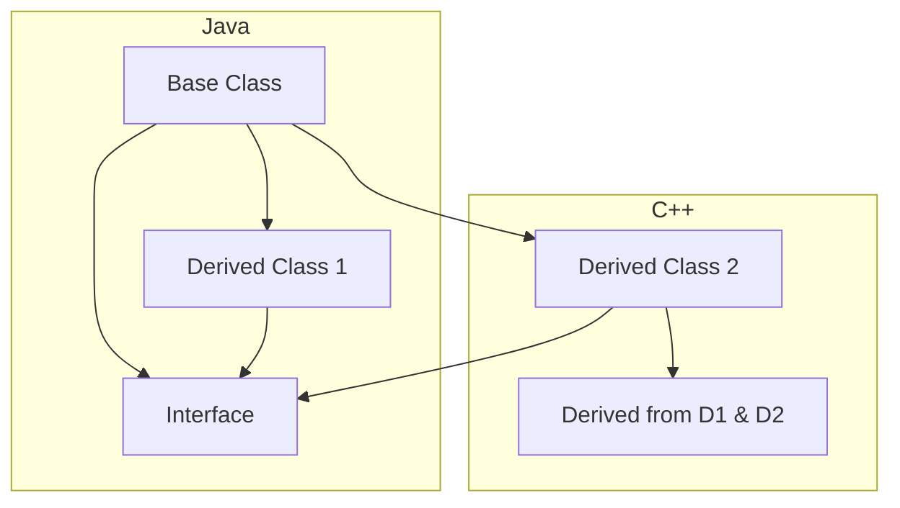
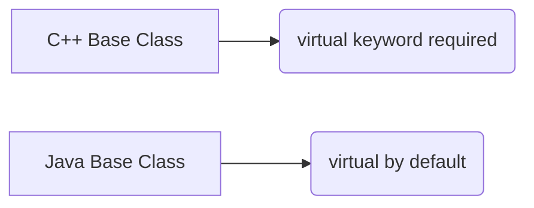
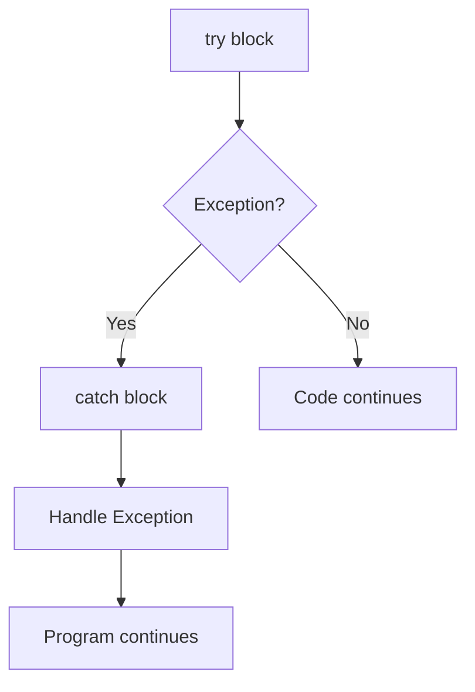

# <span style="color:#e67e22;">What we will learn in this post?</span>
<ul style='list-style-type: none; padding-left: 0;'>
<li><span style='color: #2980b9; font-size: 20px; font-weight: bold;'>👉</span> <span style='color: #2ecc71; font-size: 18px; font-weight: bold;'>Differences and Similarities between C++ and Java</span></li>
<li><span style='color: #2980b9; font-size: 20px; font-weight: bold;'>👉</span> <span style='color: #2ecc71; font-size: 18px; font-weight: bold;'>Inheritance in C++ vs Java</span></li>
<li><span style='color: #2980b9; font-size: 20px; font-weight: bold;'>👉</span> <span style='color: #2ecc71; font-size: 18px; font-weight: bold;'>Static keyword in C++ vs Java</span></li>
<li><span style='color: #2980b9; font-size: 20px; font-weight: bold;'>👉</span> <span style='color: #2ecc71; font-size: 18px; font-weight: bold;'>Default Virtual Behavior in C++ vs Java</span></li>
<li><span style='color: #2980b9; font-size: 20px; font-weight: bold;'>👉</span> <span style='color: #2ecc71; font-size: 18px; font-weight: bold;'>Exception Handling in C++ vs Java</span></li>
<li><span style='color: #2980b9; font-size: 20px; font-weight: bold;'>👉</span> <span style='color: #2ecc71; font-size: 18px; font-weight: bold;'>Foreach loop in C++ vs Java</span></li>
<li><span style='color: #2980b9; font-size: 20px; font-weight: bold;'>👉</span> <span style='color: #2ecc71; font-size: 18px; font-weight: bold;'>Templates in C++ vs Generics in Java</span></li>
<li><span style='color: #2980b9; font-size: 20px; font-weight: bold;'>👉</span> <span style='color: #2ecc71; font-size: 18px; font-weight: bold;'>Floating Point Operations & Associativity in C, C++, and Java</span></li>
<li><span style='color: #2980b9; font-size: 20px; font-weight: bold;'>👉</span> <span style='color: #2ecc71; font-size: 18px; font-weight: bold;'>Conclusion!</span></li>
</ul>

# <span style="color:#e67e22">C++ vs. Java: A Friendly Comparison 🤝</span>

C++ and Java are both powerful programming languages, but they differ significantly in several key areas. Let's explore some core distinctions.

## <span style="color:#2980b9">Syntax and Style ✨</span>

* C++ is more *flexible* and *low-level*, allowing for direct memory manipulation.  Its syntax is often considered more complex due to features like pointers and manual memory management.  Example: `int* ptr = new int;`
* Java prioritizes *simplicity* and *platform independence*. It uses a simpler syntax and features automatic garbage collection, eliminating manual memory management. Example: `int myInt = 10;`


## <span style="color:#2980b9">Memory Management 🧠</span>

### <span style="color:#8e44ad">C++: Manual Control</span>
* C++ requires *explicit memory management*.  You allocate memory using `new` and deallocate using `delete`. This gives you fine-grained control but increases the risk of memory leaks if not handled carefully.

### <span style="color:#8e44ad">Java: Automatic Cleanup</span>
* Java employs *automatic garbage collection*. The Java Virtual Machine (JVM) automatically reclaims memory that's no longer needed, reducing the burden on the programmer and minimizing memory leaks.

## <span style="color:#2980b9">Performance 🚀</span>

* **C++** generally offers *higher performance* due to its direct hardware access and manual memory control. It's frequently used in performance-critical applications like game development and high-frequency trading.
* **Java**, while less performant than C++, benefits from the JVM's optimization capabilities and cross-platform nature. Its performance is usually sufficient for most applications.


## <span style="color:#2980b9">Similarities 🤝</span>

Both languages are object-oriented, supporting concepts like *classes*, *objects*, *inheritance*, and *polymorphism*.  They are widely used and have large, active communities.


For more information:

* [LearnCpp.com](https://www.learncpp.com/)
* [Oracle's Java Tutorials](https://docs.oracle.com/javase/tutorial/)


This comparison simplifies the complexities of both languages.  The "best" choice depends on the specific project requirements.


# <span style="color:#e67e22">Inheritance: C++ vs. Java 🤝</span>

Inheritance lets classes inherit properties and methods from parent classes, promoting code reuse.  But C++ and Java differ in *how* they do this.


## <span style="color:#2980b9">Syntax & Access Modifiers ✨</span>

### <span style="color:#8e44ad">C++</span>

In C++, you use a colon `:` after the derived class name to specify inheritance.  Access specifiers (`public`, `protected`, `private`) control what members are inherited and how.

```cpp
class Animal { // Base class
public:
  void eat() { /* ... */ }
};

class Dog : public Animal { // Derived class inheriting publicly
public:
  void bark() { /* ... */ }
};
```

*   `public` inheritance: inherited members retain their access level.
*   `protected` inheritance: inherited members become `protected`.
*   `private` inheritance: inherited members become `private` in the derived class.


### <span style="color:#8e44ad">Java</span>

Java uses the `extends` keyword.  Access modifiers (`public`, `protected`, `private`) function similarly, but with slightly different default behavior (Java's default is package-private).

```java
class Animal { // Base class
  public void eat() { /* ... */ }
}

class Dog extends Animal { // Derived class
  public void bark() { /* ... */ }
}
```

Java's default access (no explicit keyword) is like C++'s protected in that it's accessible within the package.  `public` and `private` behave consistently across both languages.


## <span style="color:#2980b9">Implementation Differences 🤔</span>

*   **Multiple Inheritance:** C++ supports multiple inheritance (inheriting from multiple classes), while Java only allows single inheritance (one parent class), but it offers interfaces for achieving a similar effect of multiple inheritance.
*   **Virtual Functions:** Both languages support virtual functions (polymorphism), but the syntax slightly varies. C++ uses the `virtual` keyword, Java uses method overriding.


## <span style="color:#2980b9">Visual Summary 📊</span>




For further reading:

*   [C++ Inheritance](https://www.geeksforgeeks.org/inheritance-in-cpp/)
*   [Java Inheritance](https://www.javatpoint.com/inheritance-in-java)


This comparison highlights the core differences.  Both languages implement inheritance effectively, but their approaches cater to slightly different programming paradigms.


# <span style="color:#e67e22">Static Keyword: C++ vs. Java 🤝</span>

The `static` keyword serves different purposes in C++ and Java, though both relate to controlling the lifespan and accessibility of variables and functions. Let's explore!

## <span style="color:#2980b9">C++: Static Members ✨</span>

In C++, `static` primarily denotes *static members* of a class.  These members belong to the class itself, not to individual objects.

### <span style="color:#8e44ad">Example</span>

```c++
class Counter {
public:
  static int count; // Static member variable
  Counter() { count++; }
};

int Counter::count = 0; // Definition outside the class

int main() {
  Counter c1, c2;
  std::cout << Counter::count; // Accessing static member directly
  return 0;
}
```

*   `count` is shared across all `Counter` objects.


## <span style="color:#2980b9">Java: Static Members & Methods ☕</span>

Java's `static` also creates class-level members (variables and methods).  However,  Java emphasizes that static members are *associated with the class*, not *part* of the class's state like in C++.

### <span style="color:#8e44ad">Example</span>

```java
class Counter {
  static int count = 0; // Static member variable
  Counter() { count++; }
  static void displayCount() { //Static method
      System.out.println(count);
  }
}

public class Main {
    public static void main(String[] args) {
        Counter c1 = new Counter();
        Counter c2 = new Counter();
        Counter.displayCount();//calling static method
    }
}
```

*   `count` is again shared, and `displayCount` can be called without creating an object.


## <span style="color:#2980b9">Key Differences 🎯</span>

*   **C++:** Static members can be `private`, `public`, etc.,  allowing finer control over access. Java's static members' visibility is determined by their declaration (public, private, protected, etc.).
*   **Java:** Static blocks are used for initialization. C++ offers no direct equivalent; you typically initialize static members outside the class definition.

This simplified comparison shows the core differences. For more detailed information, consider exploring these resources:

*   [C++ Static Members](https://www.cplusplus.com/doc/tutorial/classes/)
*   [Java Static Members](https://docs.oracle.com/javase/tutorial/java/javaOO/classvars.html)


Remember, the specific use cases and implications of `static` can vary subtly based on the context and language features.  Careful consideration is needed!


# <span style="color:#e67e22">C++ vs. Java: Default Virtual Behavior 💻</span>

Let's explore the differences in default virtual behavior between C++ and Java, focusing on method overriding and polymorphism.

## <span style="color:#2980b9">Method Overriding and Polymorphism</span>

Both languages support polymorphism—using a single interface to represent different underlying forms. However, their default virtual method behavior differs significantly.

### <span style="color:#8e44ad">C++: Explicit Virtual Keywords</span>

In C++, to enable polymorphism (dynamic dispatch), you *must* explicitly declare a method as `virtual` in the base class.  If you don't, it behaves as a simple method, using static dispatch (determined at compile time).

*   **Example:**
    ```c++
    class Base {
    public:
        virtual void myMethod() { /* ... */ } // Virtual method
        void myOtherMethod() {/* ... */} // Non-virtual method
    };
    ```

### <span style="color:#8e44ad">Java: Default Virtual Methods</span>

Java, by default, makes all methods in a class virtual (except for those declared as `static`, `final`, or `private`). This simplifies polymorphism implementation; you don't need explicit keywords.  If you want a method *not* to be overridden, you explicitly declare it as `final`.


*   **Example:**
    ```java
    class Base {
        void myMethod() { /* ... */ } // Virtual by default
        final void myFinalMethod() { /* ... */ } // Cannot be overridden
    }
    ```

## <span style="color:#2980b9">Diagrammatic Comparison</span>



**In essence:** Java prioritizes ease of use in polymorphism, while C++ offers more control and allows for explicit choices about method dispatching.  This leads to different coding styles and potential performance considerations.

**Further Reading:**

* [C++ Virtual Functions](https://www.geeksforgeeks.org/virtual-functions-cpp/)
* [Java Polymorphism](https://www.javatpoint.com/polymorphism-in-java)


This difference is a key aspect to understand when migrating between the two languages or working on projects involving both. Remember to carefully consider the implications of virtual methods and polymorphism in your code, choosing the best approach for your specific needs. 


# <span style="color:#e67e22">Exception Handling: C++ vs. Java 💥</span>

Both C++ and Java offer robust exception handling, but their approaches differ. Let's explore!

## <span style="color:#2980b9">C++ Exceptions ⚙️</span>

C++ uses `try`, `catch`, and `throw` keywords.

### <span style="color:#8e44ad">Syntax & Example</span>

```cpp
try {
  // Code that might throw an exception
  int x = 10/0; 
} catch (const std::exception& e) {
  // Handle the exception
  std::cerr << "Error: " << e.what() << '\n';
}
```

*   **`try` block:** Contains code that might throw exceptions.
*   **`throw` statement:** Explicitly throws an exception object.
*   **`catch` block:** Handles specific exception types.


## <span style="color:#2980b9">Java Exceptions ☕</span>

Java uses a similar structure, but with a richer exception hierarchy.

### <span style="color:#8e44ad">Syntax & Example</span>

```java
try {
  // Code that might throw an exception
  int x = 10/0;
} catch (ArithmeticException e) {
  // Handle the ArithmeticException
  System.err.println("Error: " + e.getMessage());
}
```

*   **Checked vs. Unchecked Exceptions:** Java distinguishes between checked (must be handled or declared) and unchecked exceptions (runtime exceptions).  This enforces more robust error handling.


## <span style="color:#2980b9">Key Differences & Best Practices ✨</span>

*   **Exception Specifiers (C++):**  C++ allows (but is generally discouraged) specifying which exceptions a function might throw using `throw()`. Java doesn't have this feature.
*   **Checked Exceptions (Java):** Java's checked exceptions promote better design by forcing developers to consider potential errors. C++ doesn't have a direct equivalent.

**Best Practices (both languages):**

*   Handle exceptions at the appropriate level. Don't catch exceptions you can't handle effectively.
*   Avoid catching generic exceptions unless absolutely necessary. Be specific!
*   Provide informative error messages.
*   Use custom exception classes to represent application-specific errors.
*   Consider using logging frameworks to record exceptions.

[More on C++ exceptions](https://en.cppreference.com/w/cpp/language/try_catch)

[More on Java exceptions](https://docs.oracle.com/javase/tutorial/essential/exceptions/)





# <span style="color:#e67e22">Foreach Loops in C++ and Java: A Friendly Guide 🎉</span>

Foreach loops, also known as enhanced *for* loops, are a convenient way to iterate over elements in arrays or collections without manually managing indices. Let's explore their usage in C++ and Java.


## <span style="color:#2980b9">C++'s Range-based For Loop</span>

### <span style="color:#8e44ad">Syntax and Usage</span>

C++ uses a range-based `for` loop for iterating through containers.  Its syntax is straightforward:

```c++
std::vector<int> numbers = {1, 2, 3, 4, 5};
for (int number : numbers) {
  std::cout << number << " "; //Outputs: 1 2 3 4 5
}
```

Here, `number` takes on the value of each element in `numbers` successively.  This eliminates the need for `numbers.size()` and index manipulation.


## <span style="color:#2980b9">Java's Enhanced For Loop</span>

### <span style="color:#8e44ad">Syntax and Usage</span>

Java's enhanced `for` loop provides similar functionality.

```java
int[] numbers = {1, 2, 3, 4, 5};
for (int number : numbers) {
  System.out.print(number + " "); //Outputs: 1 2 3 4 5
}
```

Similar to C++, `number` iterates through each element in the `numbers` array.  It's concise and readable.


**Key Differences:**

* C++'s range-based `for` loop works with various standard library containers (vectors, arrays, etc.).
* Java's enhanced `for` loop is applicable to arrays and collections implementing the `Iterable` interface.


**More Info:**

* [C++ range-based for loop](https://en.cppreference.com/w/cpp/language/range-for)
* [Java enhanced for loop](https://docs.oracle.com/javase/tutorial/java/nutsandbolts/for.html)


Remember to choose the loop best suited to your needs and the data structures you're using.  Both offer cleaner and more readable code compared to traditional `for` loops when iterating over collections. 👍


# <span style="color:#e67e22">C++ Templates vs. Java Generics 💻</span>

Both C++ templates and Java generics achieve code reuse by writing code that can work with various data types, but they differ significantly in *how* they do it.

## <span style="color:#2980b9">Type Safety 🛡️</span>

*   **C++ Templates:**  Templates are resolved at *compile time*.  The compiler generates separate code for each type used with the template.  This leads to *excellent* type safety because errors are caught during compilation.  However, it can result in code bloat if many types are used.

*   **Java Generics:** Generics are resolved at *runtime*. The compiler uses type erasure, essentially treating generic types as `Object` at runtime. This provides type safety during compilation, but runtime type checking relies on the programmer's vigilance.  Less code bloat compared to C++.

## <span style="color:#2980b9">Usage Examples ✨</span>

### <span style="color:#8e44ad">C++ Template Example</span>

```cpp
template <typename T>
T max(T a, T b) {
  return (a > b) ? a : b;
}
```

This `max` function works for `int`, `float`, `double`, etc.

### <span style="color:#8e44ad">Java Generics Example</span>

```java
public class Box<T> {
    private T value;
    // ... methods ...
}
```

This `Box` class can hold any type `T`.


## <span style="color:#2980b9">Key Differences Summarized 📝</span>

| Feature        | C++ Templates                     | Java Generics                       |
|----------------|------------------------------------|--------------------------------------|
| Resolution     | Compile time                       | Runtime (with type erasure)          |
| Type Safety    | Excellent, compile-time checking | Good, compile-time, runtime reliance |
| Code Bloat     | Potentially high                   | Relatively low                        |


For more information:

*   [C++ Templates](https://www.geeksforgeeks.org/templates-cpp/)
*   [Java Generics](https://docs.oracle.com/javase/tutorial/java/generics/index.html)


Remember, choosing between templates and generics depends on your project's needs and priorities!  Both are powerful tools for writing reusable and efficient code.


# <span style="color:#e67e22">Floating-Point Operations: A Friendly Comparison 🧮</span>

Floating-point numbers (like `3.14`) represent real numbers in computers, but they have limitations.  One key issue is *associativity*: the order of operations matters.

## <span style="color:#2980b9">Associativity Differences 🤔</span>

Because of how floating-point numbers are stored and processed, the results of calculations can vary slightly based on the order they are performed. This is particularly noticeable in C, C++, and Java.

### <span style="color:#8e44ad">Example: Adding Three Numbers</span>

Let's consider adding three numbers: `a`, `b`, and `c`.

* **Mathematically:** `(a + b) + c` should always equal `a + (b + c)`.
* **In reality:** Due to rounding errors in floating-point arithmetic, `(a + b) + c` might differ slightly from `a + (b + c)` in C, C++, and Java.


```c++
#include <iostream>
int main() {
  double a = 0.1;
  double b = 0.2;
  double c = 0.3;
  std::cout << "(a + b) + c = " << (a + b) + c << std::endl; // Might slightly differ
  std::cout << "a + (b + c) = " << a + (b + c) << std::endl; // from this
  return 0;
}
```

This subtle difference might seem insignificant, but in complex calculations, accumulated errors can lead to substantial inaccuracies.

## <span style="color:#2980b9">Mitigation Strategies 🛡️</span>

* **Careful Algorithm Design:** Choose algorithms less sensitive to order of operations.
* **Higher Precision:** Use `double` instead of `float` for potentially increased accuracy.
* **Libraries:** Some libraries offer higher-precision arithmetic, but with a performance trade-off.


**Key Takeaway:**  While mathematically associative, floating-point arithmetic in C, C++, and Java is not *strictly* associative due to inherent limitations. Always be aware of potential rounding errors, especially in lengthy computations.


[Learn more about floating-point numbers](https://floating-point-gui.de/)


<h1><span style='color:#e67e22'>Conclusion</span></h1>

And there you have it!  We've covered a lot of ground today, and hopefully, you found it helpful and interesting. 😊  But the conversation doesn't end here!  We'd love to hear your thoughts, feedback, and any brilliant ideas you might have.  What did you think of [mention a key topic or aspect of the blog post]?  What other topics would you like us to explore?  Let us know in the comments below! 👇 We're all ears (and eyes!) and can't wait to read what you have to say.  Let's keep the conversation going!  💬


