# <span style="color:#e67e22;">What we will learn in this post?</span>
<ul style='list-style-type: none; padding-left: 0;'>
<li><span style='color: #2980b9; font-size: 20px; font-weight: bold;'>👉</span> <span style='color: #2ecc71; font-size: 18px; font-weight: bold;'>Competitive Programming – A Complete Guide</span></li>
<li><span style='color: #2980b9; font-size: 20px; font-weight: bold;'>👉</span> <span style='color: #2ecc71; font-size: 18px; font-weight: bold;'>C++ Tricks for Competitive Programming</span></li>
<li><span style='color: #2980b9; font-size: 20px; font-weight: bold;'>👉</span> <span style='color: #2ecc71; font-size: 18px; font-weight: bold;'>Writing C/C++ code efficiently in Competitive Programming</span></li>
<li><span style='color: #2980b9; font-size: 20px; font-weight: bold;'>👉</span> <span style='color: #2ecc71; font-size: 18px; font-weight: bold;'>Why C++ is Best for Competitive Programming?</span></li>
<li><span style='color: #2980b9; font-size: 20px; font-weight: bold;'>👉</span> <span style='color: #2ecc71; font-size: 18px; font-weight: bold;'>Generating Test Cases in C++</span></li>
<li><span style='color: #2980b9; font-size: 20px; font-weight: bold;'>👉</span> <span style='color: #2ecc71; font-size: 18px; font-weight: bold;'>Fast I/O for Competitive Programming in C++</span></li>
<li><span style='color: #2980b9; font-size: 20px; font-weight: bold;'>👉</span> <span style='color: #2ecc71; font-size: 18px; font-weight: bold;'>Setting up Sublime Text for C++ Competitive Programming Environment</span></li>
<li><span style='color: #2980b9; font-size: 20px; font-weight: bold;'>👉</span> <span style='color: #2ecc71; font-size: 18px; font-weight: bold;'>Setting up VS Code for C++ Competitive Programming Environment</span></li>
<li><span style='color: #2980b9; font-size: 20px; font-weight: bold;'>👉</span> <span style='color: #2ecc71; font-size: 18px; font-weight: bold;'>Which C++ libraries are useful for competitive programming?</span></li>
<li><span style='color: #2980b9; font-size: 20px; font-weight: bold;'>👉</span> <span style='color: #2ecc71; font-size: 18px; font-weight: bold;'>Common mistakes to be avoided in Competitive Programming in C++</span></li>
<li><span style='color: #2980b9; font-size: 20px; font-weight: bold;'>👉</span> <span style='color: #2ecc71; font-size: 18px; font-weight: bold;'>Conclusion!</span></li>
</ul>

# <span style="color:#e67e22">Ace Competitive Programming in C++ 🚀</span>

## <span style="color:#2980b9">Getting Started 🏁</span>

Competitive programming is about solving coding challenges efficiently.  C++ is a popular choice due to its speed and rich Standard Template Library (STL).  Start with the basics:

* **Data Structures:**  Arrays, vectors, linked lists, stacks, queues, maps, sets ([Learn more](https://www.geeksforgeeks.org/data-structures/)).
* **Algorithms:** Sorting (e.g., `std::sort`), searching, graph traversal (BFS, DFS), dynamic programming ([Learn more](https://www.geeksforgeeks.org/fundamentals-of-algorithms/)).


### <span style="color:#8e44ad">Essential C++ Knowledge 💡</span>

Master STL containers and algorithms.  Understand time and space complexity (Big O notation).  Practice writing clean, efficient code.


## <span style="color:#2980b9">Strategies & Tips 🤔</span>

* **Practice Regularly:** Consistent effort is key. Solve problems on platforms like Codeforces, LeetCode, and HackerRank.
* **Understand Problem Statements:** Read carefully and break down complex problems into smaller parts.
* **Debug Effectively:** Use a debugger and print statements to track your code's execution.
* **Learn from Others:** Analyze solutions from experienced programmers.

```mermaid
graph TD
    A[Understand Problem] --> B{Can you solve it?};
    B -- Yes --> C[Implement & Test];
    B -- No --> D[Find similar problems/techniques];
    D --> E[Learn & try again];
    C --> F[Submit];
    F -- Accepted --> G[Next Problem! 🎉];
    F -- Wrong Answer --> E;
```


### <span style="color:#8e44ad">Problem Solving Approach 🧠</span>




## <span style="color:#2980b9">Resources 📚</span>

* **CP-Algorithms:**  [https://cp-algorithms.com/](https://cp-algorithms.com/)  (A treasure trove of algorithmic knowledge!)
* **LeetCode:** [https://leetcode.com/](https://leetcode.com/) (Great for practice and interview prep)


Remember, *consistency and perseverance* are crucial!  Good luck, and happy coding! 😄


# <span style="color:#e67e22">C++ Tricks for Competitive Programming 🚀</span>

## <span style="color:#2980b9">Faster I/O 💨</span>

Competitive programming often involves handling large inputs.  Standard C++ I/O can be slow.  Use the following for speed improvements:

```cpp
ios_base::sync_with_stdio(false);
cin.tie(NULL);
```

This disables synchronization between C++ streams and the C standard I/O, significantly boosting input/output speed.


## <span style="color:#2980b9">Data Structures & Algorithms ✨</span>

*   **`std::vector`:**  A dynamic array, incredibly versatile.  Use it over raw arrays whenever possible.
*   **`std::map`/`std::unordered_map`:** For key-value pairs. `unordered_map` offers faster average-case lookup but uses more memory.
*   **`std::set`/`std::unordered_set`:** For unique elements.  `unordered_set` provides faster average-case operations.


### <span style="color:#8e44ad">Example: Using `std::vector`</span>

```cpp
#include <vector>
std::vector<int> myVec = {1, 2, 3, 4, 5}; //Easy initialization
```


## <span style="color:#2980b9">Bit Manipulation ⚙️</span>

Bit manipulation can optimize solutions. For example, checking if a number is even:

```cpp
bool isEven(int n) { return !(n & 1); } //Check the least significant bit
```

This is much faster than using the modulo operator (`%`).


## <span style="color:#2980b9">Helpful Resources 📚</span>

*   [CP-Algorithms](https://cp-algorithms.com/):  A comprehensive resource for algorithms and data structures.
*   [LeetCode](https://leetcode.com/): Practice problems to hone your skills.


Remember, practice is key!  These tricks will only take you so far. Consistent effort and problem-solving experience will make you a successful competitive programmer.  Good luck! 👍


# <span style="color:#e67e22">Efficient C/C++ for Competitive Programming 🚀</span>

Competitive programming demands speed! Here's how to write efficient C/C++ code:


## <span style="color:#2980b9">Data Structures & Algorithms 🧠</span>

Choose the right data structures!  A well-chosen `std::vector` can be far faster than manually managing arrays.  Similarly, understanding algorithmic complexity (Big O notation) is crucial.  Avoid brute-force solutions when possible.

### <span style="color:#8e44ad">Example: Sorting</span>

Instead of a slow custom sort, use `std::sort` which is highly optimized:

```c++
std::vector<int> nums = {5, 2, 8, 1, 9};
std::sort(nums.begin(), nums.end()); // Efficiently sorts nums
```


## <span style="color:#2980b9">Input/Output Optimization ⚡</span>

Reading input directly from `cin` can be slow. Using `scanf` or even better, custom input functions for large datasets can significantly improve speed. Similarly, `printf` might be faster than `cout` in many cases.


### <span style="color:#8e44ad">Example: Faster Input</span>

```c++
int main() {
  int n;
  scanf("%d", &n); // Faster than cin >> n;
  // ... your code ...
  return 0;
}
```

## <span style="color:#2980b9">Memory Management 💾</span>

Avoid unnecessary memory allocations and deallocations. Use `std::vector`'s dynamic resizing capabilities effectively.  Pre-allocate memory if you know the size beforehand. Minimize the use of `new` and `delete` to avoid memory leaks and fragmentation.


*   **Tip:**  Understand your compiler's optimizations!
*   **Tip:**  Profile your code to find bottlenecks.


For more information:

*   [CP-Algorithms](https://cp-algorithms.com/)
*   [GeeksforGeeks](https://www.geeksforgeeks.org/)

Remember, practice is key!  The more you code, the better you'll get at writing efficient and optimized solutions. Good luck! 👍


# <span style="color:#e67e22">Why C++ Reigns in Competitive Programming 🏆</span>

C++ is a top choice for competitive programming due to its powerful features and speed.  Let's explore why!


## <span style="color:#2980b9">Blazing Fast Speed 🚀</span>

C++ is known for its performance.  It compiles to highly optimized machine code, resulting in extremely fast execution—crucial when dealing with tight time limits in coding competitions. This speed advantage can be the difference between success and failure.

### <span style="color:#8e44ad">Low-Level Control ⚙️</span>

C++ offers *direct memory manipulation*, allowing fine-grained control over memory allocation and usage. This helps optimize resource utilization, leading to faster code, especially beneficial in memory-intensive problems.


## <span style="color:#2980b9">Rich Standard Template Library (STL) 📚</span>

The STL provides a vast collection of pre-built data structures (like `vector`, `map`, `set`) and algorithms (`sort`, `find`). This dramatically reduces coding time, letting you focus on problem-solving rather than reinventing the wheel.

### <span style="color:#8e44ad">Example: Sorting</span>

Instead of writing your own sorting function, you can simply use `std::sort(myVector.begin(), myVector.end());` –  *clean and efficient!*


## <span style="color:#2980b9">Powerful Features 💪</span>

*   **Pointers:** Offer fine-tuned memory control.
*   **Templates:** Enable writing generic, reusable code.
*   **Custom Data Structures:**  Allows tailoring solutions to specific problems.


## <span style="color:#2980b9">Visual Representation of C++ Advantages</span>


**In short:** C++'s blend of speed, control, and readily available tools makes it an excellent choice for competitive programmers seeking optimal performance and efficiency.


[Learn more about C++](https://www.cplusplus.com/)


# <span style="color:#e67e22">Generating Test Cases for C++ Competitive Programming 🤩</span>

Creating good test cases is crucial for solving competitive programming problems correctly.  Let's explore some techniques!


## <span style="color:#2980b9">Basic Test Case Generation 💡</span>

* **Boundary Cases:** Test the *edges* of your input range.  For example, if the input is an integer `n` where `1 ≤ n ≤ 100`, test `n = 1`, `n = 100`, `n = 0`, and `n = 101`.

* **Small Cases:** Start with tiny inputs (`n = 1, 2, 3`) for easy debugging.  These make it easier to manually check your code's output.

* **Large Cases:**  Test with inputs near the upper limits (`n = 99, 100`) to catch performance issues or edge cases related to large numbers.


### <span style="color:#8e44ad">Example: Finding the maximum element</span>

Let's say you're writing a function to find the maximum element in an array.  You might test with:

* `int arr[] = {1, 2, 3};`
* `int arr[] = {100, 50, 200};`  (larger numbers)
* `int arr[] = {100};` (single element)
* `int arr[] = {};` (empty array - *handle this gracefully*)


## <span style="color:#2980b9">Advanced Techniques 💪</span>

* **Random Test Cases:** Use a random number generator (`<random>`) to produce a large number of varied test cases automatically.  This helps catch unexpected behavior.

* **Edge Case Generation:**  Deliberately create inputs designed to break your code – inputs with repeated values, special characters (if applicable), or values that might cause integer overflow.

* **Stress Testing:**  Compare your solution to a known correct (but potentially slower) algorithm using many random inputs. This can reveal subtle bugs that might not be caught by simpler methods.


For more advanced techniques and strategies, consider exploring resources like [CP-Algorithms](https://cp-algorithms.com/).  Remember to always document your test cases well!


# <span style="color:#e67e22">⚡️ Speeding Up I/O in C++ for Competitive Programming</span>

Competitive programming often demands blazing-fast I/O.  Standard input/output (`cin`/`cout`) can be slow, especially with large datasets.  Let's explore faster alternatives!

## <span style="color:#2980b9">Faster I/O Methods 🚀</span>

### <span style="color:#8e44ad">Using `scanf` and `printf`</span>

These C-style functions are generally faster than their C++ counterparts.

```c++
#include <cstdio> //For scanf and printf

int main() {
  int n;
  scanf("%d", &n); //Faster than cin >> n;
  printf("%d\n", n * 2); //Faster than cout << n * 2 << endl;
  return 0;
}
```

### <span style="color:#8e44ad">Input/Output Buffering with `ios_base::sync_with_stdio(false);`</span>

This line disables synchronization between C++ streams and the C standard I/O streams, significantly boosting `cin`/`cout` performance.

```c++
#include <iostream>

int main() {
  std::ios_base::sync_with_stdio(false); //Crucial line!
  std::cin.tie(NULL); //Unties cin and cout
  int n;
  std::cin >> n;
  std::cout << n * 2 << '\n'; //Using '\n' is slightly faster than endl
  return 0;
}
```


## <span style="color:#2980b9">Performance Comparison 📊</span>

Generally, `scanf`/`printf` are fastest, followed by optimized `cin`/`cout`, and then standard `cin`/`cout`.  The difference is most noticeable with large input sizes.  The exact performance depends on your compiler, system, and input data.


## <span style="color:#2980b9">  Choosing the Right Method 🤔</span>

* **For maximum speed:** Prioritize `scanf` and `printf`.
* **For readability & C++ style:** Use `ios_base::sync_with_stdio(false);` and `cin.tie(NULL);` with `cin`/`cout`.


Remember, optimizing I/O is just one aspect of competitive programming. Efficient algorithms and data structures are crucial for overall performance.  For more in-depth information, consider exploring online resources on competitive programming optimization techniques.


# <span style="color:#e67e22">Setting up Sublime Text for Competitive Programming (C++) 🚀</span>

Let's get your Sublime Text ready for coding competitions!  This guide will help you set it up for C++ development.

## <span style="color:#2980b9">Install Necessary Packages 📦</span>

First, you'll need a few packages to make your life easier:

*   **Package Control:**  This is essential for managing other packages.  Instructions for installation can be found [here](https://packagecontrol.io/installation).
*   **SublimeLinter:** Helps catch errors as you type.
*   **SublimeLinter-cppcheck:** Provides C++-specific linting.
*   **C++ Code Snippets:**  Provides handy code snippets to speed up your workflow.


### <span style="color:#8e44ad">Installing Packages</span>
1. Open Sublime Text's command palette (Ctrl+Shift+P or Cmd+Shift+P).
2. Type "Install Package" and select it.
3. Search for and install each of the packages listed above.


## <span style="color:#2980b9">Configure Your Build System 💪</span>

Sublime Text needs a way to compile and run your C++ code. Create a new build system:

1. Go to *Tools > Build System > New Build System*.
2. Paste the following code (adjust the `g++` path if needed):

```json
{
    "cmd": ["g++", "${file}", "-o", "${file_base_name}"],
    "shell": true,
    "working_dir": "${file_path}",
    "selector": "source.c++"
}
```
3. Save the file as `C++.sublime-build`.


## <span style="color:#2980b9">Run Your Code! 🏃‍♀️</span>

Now you can write your C++ code, save it, and press `Ctrl+B` (or `Cmd+B`) to compile and run!


## <span style="color:#2980b9">Bonus Tip ✨</span>

Customize your settings (Preferences > Settings) for things like syntax highlighting and themes. Experiment and find what works best for you!


Enjoy coding!  Happy competing! 🎉


# <span style="color:#e67e22">VS Code Setup for C++ Competitive Programming 🚀</span>

Let's get you ready to code!  This guide helps set up VS Code for C++ competitive programming.

## <span style="color:#2980b9">Install Essential Extensions ⚙️</span>

Install these extensions from the VS Code marketplace:

*   **C/C++:**  Provides IntelliSense (code completion), debugging, and more.
*   **CMake Tools:**  Helps manage your C++ projects (optional, but recommended).

### <span style="color:#8e44ad">Extension Installation</span>
1. Open VS Code's Extensions view (Ctrl+Shift+X).
2. Search and install the extensions listed above.


## <span style="color:#2980b9">Configure the C++ Compiler 🛠️</span>

You'll need a C++ compiler (like g++).  Ensure it's installed and added to your system's `PATH` environment variable.  _Instructions vary based on your operating system._

*   **Windows:** Use MinGW or Visual Studio Build Tools.
*   **Linux/macOS:**  `g++` is usually already installed.


## <span style="color:#2980b9">Create a Sample Project ✨</span>

1. Create a folder for your project.
2. Create a `main.cpp` file with simple C++ code (e.g., `#include <iostream>; int main() { std::cout << "Hello, world!" << std::endl; return 0; }`).
3. Open the folder in VS Code.

## <span style="color:#2980b9">Compile and Run 🚀</span>


You can compile and run your code using the integrated terminal or tasks. Using tasks is recommended for better organization. Explore the CMake tools extension to simplify this process.

**Example using g++ in the terminal:**

```bash
g++ main.cpp -o main
./main
```

For more advanced configurations (like debugging), refer to the [VS Code C++ documentation](https://code.visualstudio.com/docs/languages/cpp).  Happy coding! 🎉


# <span style="color:#e67e22">Useful C++ Libraries for Competitive Programming 🎉</span>

Competitive programming often benefits from optimized libraries. Here are some popular choices:

## <span style="color:#2980b9">Standard Template Library (STL) 📚</span>

The STL is your *best friend*. It's included in standard C++ and provides:

### <span style="color:#8e44ad">Containers:</span>
*   `vector`: Dynamic arrays (like Python lists).  Great for storing data!
*   `set`:  Sorted unique elements. Useful for tasks needing sorted data.
*   `map`: Key-value pairs (like Python dictionaries). Perfect for fast lookups.
*   `deque`: Double-ended queue.  Efficient additions/removals at both ends.


## <span style="color:#2980b9">Boost ⚡</span>

Boost offers advanced algorithms and data structures not found in the STL.  *Very powerful but requires more learning.*

### <span style="color:#8e44ad">Useful Boost Components:</span>
*   `Graph Library`:  For graph algorithms (shortest paths, etc.).
*   `Multiprecision Arithmetic`: For handling very large numbers.


## <span style="color:#2980b9">Other Libraries 👀</span>

Depending on the problem, specialized libraries may be helpful.  Consider looking into libraries for things like:

*   **Geometry:** For computational geometry problems.
*   **Number Theory:** For problems involving prime numbers, modular arithmetic, etc.


Remember, understanding the STL well is crucial before diving into other libraries.  Mastering basic data structures and algorithms is key to success in competitive programming!


**Resources:**

*   [cppreference](https://en.cppreference.com/w/) (STL documentation)
*   [Boost](https://www.boost.org/) (Boost library website)


**Example Flowchart (using Mermaid):**


# <span style="color:#e67e22">Common C++ Competitive Programming Mistakes & How to Avoid Them 🤔</span>

## <span style="color:#2980b9">Silly Syntax Errors 🐞</span>

### <span style="color:#8e44ad">Missing Semicolons ;</span>

*   **Problem:** Forgetting semicolons at the end of statements is a *very* common mistake.  
*   **Solution:**  Develop the habit of adding semicolons religiously after each statement.  Use a good IDE with auto-formatting to catch these.

### <span style="color:#8e44ad">Incorrect Variable Types 🔢</span>

*   **Problem:** Using `int` when you need `long long` (for larger numbers) leads to unexpected results.
*   **Solution:** Choose data types carefully based on the problem's constraints.  Always double-check if your data types can handle the potential maximum values.


## <span style="color:#2980b9">Algorithmic & Logic Errors 🧠</span>

### <span style="color:#8e44ad">Off-by-One Errors 📏</span>

*   **Problem:** Incorrect loop bounds (e.g., `for(int i=0; i<=n; i++)` instead of `for(int i=0; i<n; i++)`).
*   **Solution:** Carefully analyze loop conditions. Test with boundary cases (n=0, n=1).

### <span style="color:#8e44ad">Incorrect Algorithm Selection 🔀</span>

*   **Problem:** Choosing an inefficient algorithm for a large input.
*   **Solution:** Understand the time and space complexity of different algorithms.  Learn about Big O notation. [Learn more about Big O Notation](https://www.bigocheatsheet.com/)


## <span style="color:#2980b9">Debugging Tips 🛠️</span>

*   **Use a debugger:** Step through your code line by line to identify the source of errors.
*   **Print statements:** Strategically place `cout` statements to track variable values at different stages.
*   **Test Cases:** Create comprehensive test cases including edge cases and boundary conditions.


Remember to **read the problem statement carefully**!  Many mistakes stem from misunderstanding the problem's requirements. Good luck! ✨


<h1><span style='color:#e67e22'>Conclusion</span></h1>

So there you have it!  We've covered a lot of ground today, and hopefully, you found it helpful and insightful. 😊  We're always striving to improve, and your thoughts are incredibly valuable to us.  What did you think?  Did we miss anything?  Let us know in the comments below – we’d love to hear your feedback, suggestions, and even just your general thoughts! 👇  Let's keep the conversation going! 🎉


