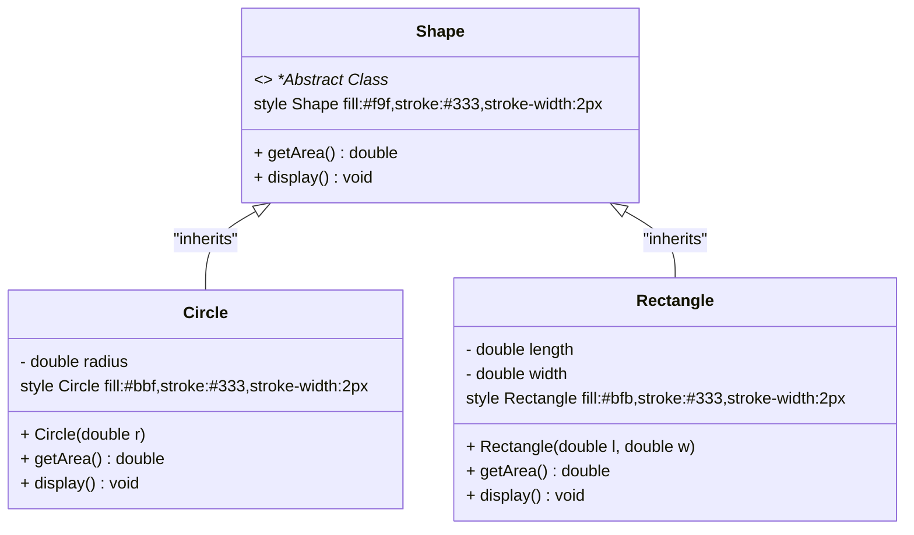

# <span style="color:#e67e22;">What will you learn in this post?</span>
<ul style='list-style-type: none; padding-left: 0;'>
<li><span style='color: #2980b9; font-size: 20px; font-weight: bold;'>👉</span> <span style='color: #2ecc71; font-size: 18px; font-weight: bold;'>C++ Encapsulation</span></li>
<li><span style='color: #2980b9; font-size: 20px; font-weight: bold;'>👉</span> <span style='color: #2ecc71; font-size: 18px; font-weight: bold;'>C++ Abstraction</span></li>
<li><span style='color: #2980b9; font-size: 20px; font-weight: bold;'>👉</span> <span style='color: #2ecc71; font-size: 18px; font-weight: bold;'>Difference between Abstraction and Encapsulation in C++</span></li>
<li><span style='color: #2980b9; font-size: 20px; font-weight: bold;'>👉</span> <span style='color: #2ecc71; font-size: 18px; font-weight: bold;'>Conclusion</span></li>
</ul>

# <span style="color:#e67e22">Encapsulation in C++: Protecting Your Data 🛡️</span>

Encapsulation is a fundamental concept in object-oriented programming (OOP). It bundles data (variables) and methods (functions) that operate on that data within a single unit – a class. This protects the data from accidental or unintended access or modification.

## <span style="color:#2980b9">Data Hiding: The Secret Keeper 🤫</span>

### <span style="color:#8e44ad">Why is it important?</span>

The main goal of encapsulation is *data hiding*. By restricting direct access to internal data members, we ensure data integrity and avoid unexpected changes. This is achieved using *access specifiers* like `private`, `protected`, and `public`.

```cpp
class Dog {
private:
  std::string name;  // Only accessible within the class
  int age;           // Only accessible within the class
public:
  void setName(const std::string& newName) { name = newName; }
  std::string getName() const { return name; }
  // ... other methods ...
};
```

In this example, `name` and `age` are `private`, meaning only methods *within* the `Dog` class can directly access them. Public methods like `setName` and `getName` provide controlled access to the data.

## <span style="color:#2980b9">Benefits of Encapsulation ✨</span>

* **Increased Security:** Prevents unauthorized access.
* **Code Maintainability:** Changes to internal implementation don't affect other parts of the code.
* **Modularity:** Makes code easier to understand and reuse.
* **Data Integrity:** Ensures data consistency.

Learn more: [Encapsulation in C++](https://www.geeksforgeeks.org/encapsulation-in-cpp/)

[Mermaid Flowchart would go here, illustrating the interaction between public methods and private members of a class.]

# <span style="color:#e67e22">Abstraction in C++: Simplifying the Complex ✨</span>

Abstraction in C++ hides complex details and shows only essential information. This simplifies large projects significantly.

## <span style="color:#2980b9">Example: Abstracting a Shape</span>

```cpp
#include <iostream>
#include <cmath>

class Shape {
public:
  virtual double getArea() const = 0; // Pure virtual function
  virtual void display() const = 0;  // Pure virtual function
};

class Circle : public Shape {
private:
  double radius;

public:
  Circle(double r) : radius(r) {}

  double getArea() const override {
    return M_PI * radius * radius;
  }

  void display() const override {
    std::cout << "Circle with radius: " << radius << ", Area: " << getArea() << "\n";
  }
};

class Rectangle : public Shape {
private:
  double length, width;

public:
  Rectangle(double l, double w) : length(l), width(w) {}

  double getArea() const override {
    return length * width;
  }

  void display() const override {
    std::cout << "Rectangle with length: " << length << ", width: " << width << ", Area: " << getArea() << "\n";
  }
};

int main() {
  Shape* shapes[2];
  shapes[0] = new Circle(5.0);
  shapes[1] = new Rectangle(4.0, 6.0);

  for (int i = 0; i < 2; ++i) {
    shapes[i]->display();
    delete shapes[i];
  }

  return 0;
}
```

**Expected Output:**
```
Circle with radius: 5, Area: 78.5398
Rectangle with length: 4, width: 6, Area: 24
```

### <span style="color:#8e44ad">Mermaid Diagram: Abstraction Hierarchy</span>



This diagram illustrates the inheritance hierarchy, where `Shape` is an abstract base class, and `Circle` and `Rectangle` are concrete derived classes.

---

# <span style="color:#e67e22">Abstraction vs. Encapsulation in C++ ☕</span>

Abstraction and encapsulation are crucial concepts in OOP, often confused but distinct. Let's clarify with examples!

## <span style="color:#2980b9">Abstraction: Showing Only Essentials ✨</span>

Abstraction simplifies complex systems by hiding unnecessary details and showing only essential information. Think of a car: you interact with the steering wheel, gas pedal, and brakes, not the internal combustion engine's workings.

### <span style="color:#8e44ad">Example:</span>

```cpp
class Car {
public:
  void drive(); // Shows only the essential "drive" function
private:
  int engineRPM; // Hidden implementation detail
};
```

Here, `drive()` is the abstracted interface; the user doesn't need to know *how* the car drives, just that they can.

## <span style="color:#2980b9">Encapsulation: Bundling Data and Methods 📦</span>

Encapsulation protects data by bundling it with the methods (functions) that operate on it. This prevents accidental or unauthorized modification.

### <span style="color:#8e44ad">Example:</span>

```cpp
class Dog {
private:
  std::string name; // Data
  int age;          // Data
public:
  void setName(const std::string& newName) { name = newName; } // Method to set data
  std::string getName() const { return name; }                // Method to access data
};
```

`name` and `age` are protected; access is controlled through `setName()` and `getName()`.

**Key Differences Summarized:**

* **Abstraction** focuses on *what* an object does, hiding *how* it does it.  
* **Encapsulation** focuses on *protecting* the data within an object and controlling access to it.  

They often work together; abstraction often uses encapsulation to hide implementation details.

Learn more:  
* [LearnCpp.com on Abstraction](https://www.learncpp.com/cpp-tutorial/91-abstract-classes/)  
* [GeeksforGeeks on Encapsulation](https://www.geeksforgeeks.org/encapsulation-in-cpp/)

# <span style="color:#e67e22">Conclusion</span>

By combining encapsulation and abstraction, you can create robust, maintainable, and scalable C++ applications. Encapsulation protects your data, while abstraction simplifies complex systems. Together, they form the backbone of object-oriented programming. 😊 Let us know your thoughts in the comments section below. Your feedback is valuable to us! ✨


