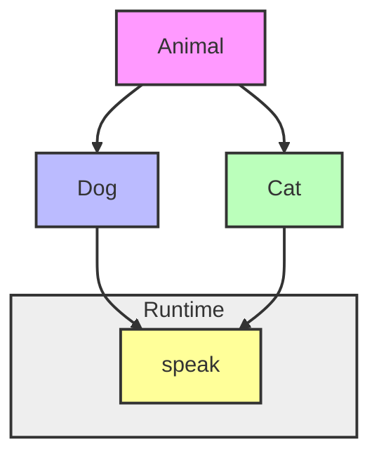
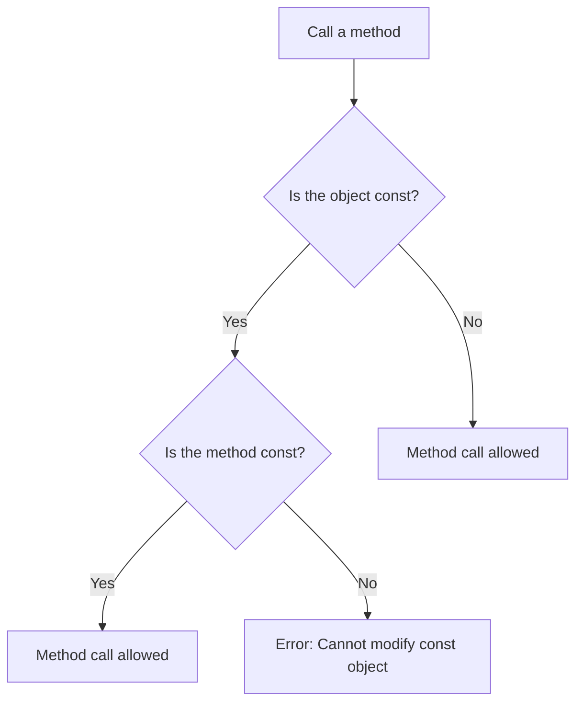
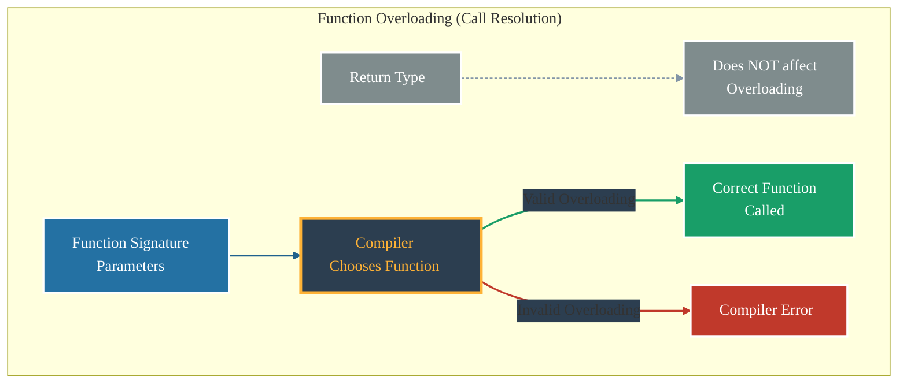

# <span style="color:#e67e22;">What will you learn in this post?</span>

<ul style='list-style-type: none; padding-left: 0;'>
<li><span style='color: #2980b9; font-size: 20px; font-weight: bold;'>👉</span> <span style='color: #2ecc71; font-size: 18px; font-weight: bold;'>C++ Polymorphism</span></li>
<li><span style='color: #2980b9; font-size: 20px; font-weight: bold;'>👉</span> <span style='color: #2ecc71; font-size: 18px; font-weight: bold;'>C++ Function Overriding</span></li>
<li><span style='color: #2980b9; font-size: 20px; font-weight: bold;'>👉</span> <span style='color: #2ecc71; font-size: 18px; font-weight: bold;'>C++ Virtual Functions and Runtime Polymorphism</span></li>
<li><span style='color: #2980b9; font-size: 20px; font-weight: bold;'>👉</span> <span style='color: #2ecc71; font-size: 18px; font-weight: bold;'>Difference between Compile-time and Run-time Polymorphism in C++</span></li>
<li><span style='color: #2980b9; font-size: 20px; font-weight: bold;'>👉</span> <span style='color: #2ecc71; font-size: 18px; font-weight: bold;'>Difference between Inheritance and Polymorphism in C++</span></li>
<li><span style='color: #2980b9; font-size: 20px; font-weight: bold;'>👉</span> <span style='color: #2ecc71; font-size: 18px; font-weight: bold;'>C++ Function Overloading</span></li>
<li><span style='color: #2980b9; font-size: 20px; font-weight: bold;'>👉</span> <span style='color: #2ecc71; font-size: 18px; font-weight: bold;'>C++ Constructor Overloading</span></li>
<li><span style='color: #2980b9; font-size: 20px; font-weight: bold;'>👉</span> <span style='color: #2ecc71; font-size: 18px; font-weight: bold;'>C++ Functions that Cannot be Overloaded</span></li>
<li><span style='color: #2980b9; font-size: 20px; font-weight: bold;'>👉</span> <span style='color: #2ecc71; font-size: 18px; font-weight: bold;'>C++ Function Overloading and const Keyword</span></li>
<li><span style='color: #2980b9; font-size: 20px; font-weight: bold;'>👉</span> <span style='color: #2ecc71; font-size: 18px; font-weight: bold;'>C++ Function Overloading and Return Type</span></li>
<li><span style='color: #2980b9; font-size: 20px; font-weight: bold;'>👉</span> <span style='color: #2ecc71; font-size: 18px; font-weight: bold;'>C++ Function Overloading and float Data Type</span></li>
<li><span style='color: #2980b9; font-size: 20px; font-weight: bold;'>👉</span> <span style='color: #2ecc71; font-size: 18px; font-weight: bold;'>C++ Function Overloading and Default Arguments</span></li>
<li><span style='color: #2980b9; font-size: 20px; font-weight: bold;'>👉</span> <span style='color: #2ecc71; font-size: 18px; font-weight: bold;'>Can main() be overloaded?</span></li>
<li><span style='color: #2980b9; font-size: 20px; font-weight: bold;'>👉</span> <span style='color: #2ecc71; font-size: 18px; font-weight: bold;'>C++ Function Overloading Vs Function Overriding</span></li>
<li><span style='color: #2980b9; font-size: 20px; font-weight: bold;'>👉</span> <span style='color: #2ecc71; font-size: 18px; font-weight: bold;'>Advantages and Disadvantages of C++ Function Overloading</span></li>
<li><span style='color: #2980b9; font-size: 20px; font-weight: bold;'>👉</span> <span style='color: #2ecc71; font-size: 18px; font-weight: bold;'>C++ Operator Overloading</span></li>
<li><span style='color: #2980b9; font-size: 20px; font-weight: bold;'>👉</span> <span style='color: #2ecc71; font-size: 18px; font-weight: bold;'>Types of C++ Operator Overloading</span></li>
<li><span style='color: #2980b9; font-size: 20px; font-weight: bold;'>👉</span> <span style='color: #2ecc71; font-size: 18px; font-weight: bold;'>C++ Functors</span></li>
<li><span style='color: #2980b9; font-size: 20px; font-weight: bold;'>👉</span> <span style='color: #2ecc71; font-size: 18px; font-weight: bold;'>C++ Operators that Cannot be Overloaded</span></li>
<li><span style='color: #2980b9; font-size: 20px; font-weight: bold;'>👉</span> <span style='color: #2ecc71; font-size: 18px; font-weight: bold;'>Conclusion!</span></li>
</ul>

# <span style="color:#e67e22">Polymorphism in C++: Many Forms, One Name 🎉</span>

Polymorphism, meaning "many forms," is a powerful feature in C++ that lets you treat objects of different classes in a uniform way. Think of it like having a toolbox where different tools (classes) can perform the same basic action (like `draw()`), but each in its own unique way. This simplifies your code and makes it more flexible.

## <span style="color:#2980b9">Types of Polymorphism</span>

There are two main types:

### <span style="color:#8e44ad">Compile-Time Polymorphism (Static Polymorphism)</span>

This is achieved through function overloading and operator overloading. The compiler decides which function to call based on the arguments provided.

#### Example: Function Overloading

```cpp
#include <iostream>
int add(int a, int b) { return a + b; }
double add(double a, double b) { return a + b; }

int main() {
    std::cout << add(5, 3) << std::endl;   // Calls int version
    std::cout << add(2.5, 1.5) << std::endl; // Calls double version
    return 0;
}
```

**Output:**

```
8
4
```

---

### <span style="color:#8e44ad">Runtime Polymorphism (Dynamic Polymorphism)</span>

This is achieved using _virtual functions_ and inheritance. The actual function called is determined _at runtime_, based on the object's type.

#### Example: Virtual Functions

```cpp
#include <iostream>
class Animal {
public:
    virtual void makeSound() { std::cout << "Generic animal sound\n"; }
};

class Dog : public Animal {
public:
    void makeSound() override { std::cout << "Woof!\n"; }
};

class Cat : public Animal {
public:
    void makeSound() override { std::cout << "Meow!\n"; }
};

int main() {
    Animal* animal1 = new Dog();
    Animal* animal2 = new Cat();

    animal1->makeSound(); // Output: Woof!
    animal2->makeSound(); // Output: Meow!

    delete animal1;
    delete animal2;
    return 0;
}
```

**Output:**

```
Woof!
Meow!
```

---

## <span style="color:#2980b9">Significance of Polymorphism ✨</span>

- **Code Reusability:** Write generic code that works with many different classes.
- **Extensibility:** Easily add new classes without modifying existing code.
- **Maintainability:** Makes your code cleaner, easier to understand, and maintain.

Learn more: [Polymorphism in C++](https://www.cplusplus.com/doc/tutorial/polymorphism/)

---

# <span style="color:#e67e22">Virtual Functions: The Key to Runtime Polymorphism 🪄</span>

## <span style="color:#2980b9">Understanding Virtual Functions</span>

In C++, _virtual functions_ are member functions declared with the `virtual` keyword. They're the magic behind _runtime polymorphism_, allowing you to call the correct function based on the _actual_ object type, not just the declared type. This is especially handy when dealing with inheritance.

#### Example: Virtual Functions in Action

```cpp
#include <iostream>
class Animal {
public:
    virtual void makeSound() { std::cout << "Generic animal sound\n"; }
};

class Dog : public Animal {
public:
    void makeSound() override { std::cout << "Woof!\n"; }
};

class Cat : public Animal {
public:
    void makeSound() override { std::cout << "Meow!\n"; }
};

void playSound(Animal* animal) {
    animal->makeSound(); // Calls the appropriate makeSound() based on the object type
}

int main() {
    Dog dog;
    Cat cat;

    playSound(&dog); // Output: Woof!
    playSound(&cat); // Output: Meow!

    return 0;
}
```

**Output:**

```
Woof!
Meow!
```

---

## <span style="color:#2980b9">Benefits of Virtual Functions</span>

- **Dynamic Behavior:** Allows runtime decision-making for function calls.
- **Extensibility:** Easily add new derived classes without changing existing code.
- **Simplifies Code:** Avoids complex `if-else` chains for handling different object types.

---

# <span style="color:#e67e22">Compile-Time vs. Run-Time Polymorphism in C++ 💻</span>

C++ offers two main types of polymorphism: compile-time and run-time. Let's explore their differences!

## <span style="color:#2980b9">Compile-Time Polymorphism (Static Polymorphism) ⚙️</span>

Compile-time polymorphism, also known as _static polymorphism_, is resolved during compilation. It primarily uses **function overloading** and **operator overloading**.

### <span style="color:#8e44ad">Function Overloading</span>

This allows multiple functions with the same name but different parameters. The compiler chooses the correct function based on the arguments passed.

```c++
int add(int a, int b) { return a + b; }
double add(double a, double b) { return a + b; }
```

## <span style="color:#2980b9">Run-Time Polymorphism (Dynamic Polymorphism) 🏃‍♂️</span>

Run-time polymorphism, or _dynamic polymorphism_, is resolved during program execution. It's achieved using **virtual functions** and **inheritance**.

### <span style="color:#8e44ad">Virtual Functions & Inheritance</span>

A virtual function is declared using the `virtual` keyword. The correct function to call is determined at runtime based on the object's type.

```c++
class Animal {
public:
  virtual void speak() { std::cout << "Generic animal sound\n"; }
};

class Dog : public Animal {
public:
  void speak() override { std::cout << "Woof!\n"; }
};
```

Here, `speak()` is a virtual function. Calling `speak()` on a `Dog` object will execute the `Dog`'s version, demonstrating runtime binding.

**Key Differences Summarized:**

| Feature    | Compile-Time Polymorphism     | Run-Time Polymorphism |
| ---------- | ----------------------------- | --------------------- |
| Resolution | Compile time                  | Run time              |
| Mechanism  | Function/Operator Overloading | Virtual Functions     |
| Binding    | Early Binding                 | Late Binding          |

[More on Polymorphism](https://www.geeksforgeeks.org/polymorphism-in-cpp/)

**Diagram illustrating run-time polymorphism:**



# <span style="color:#e67e22">Inheritance & Polymorphism in C++: A Friendly Guide</span> 🧑‍🏫

## <span style="color:#2980b9">Inheritance: Building upon Existing Code 🧱</span>

Inheritance lets you create new classes (child classes) based on existing ones (parent classes). The child class inherits all the _public_ and _protected_ members (variables and functions) of the parent. This promotes code reuse and establishes a "is-a" relationship.

### <span style="color:#8e44ad">Example:</span>

```cpp
class Animal { //Parent Class
public:
  void eat() { std::cout << "Animal eating\n"; }
};

class Dog : public Animal { //Child Class inheriting from Animal
public:
  void bark() { std::cout << "Woof!\n"; }
};

int main() {
  Dog myDog;
  myDog.eat();  // Inherited from Animal
  myDog.bark();
}
```

Here, `Dog` inherits `eat()` from `Animal`.

## <span style="color:#2980b9">Polymorphism: Many Forms ✨</span>

Polymorphism allows objects of different classes to be treated as objects of a common type. This is often achieved through _virtual functions_. It enables flexibility and extensibility.

### <span style="color:#8e44ad">Example:</span>

```cpp
class Animal {
public:
  virtual void makeSound() { std::cout << "Generic animal sound\n"; } //Virtual function
};

class Dog : public Animal {
public:
  void makeSound() override { std::cout << "Woof!\n"; }
};

class Cat : public Animal {
public:
  void makeSound() override { std::cout << "Meow!\n"; }
};

int main() {
  Animal* animalPtr = new Dog();
  animalPtr->makeSound(); // Output: Woof! (Polymorphic behavior)

  animalPtr = new Cat();
  animalPtr->makeSound(); // Output: Meow! (Polymorphic behavior)
}
```

Here, `makeSound()` behaves differently depending on the actual object type, demonstrating polymorphism.

### <span style="color:#8e44ad">Key Differences Summarized:</span>

| Feature          | Inheritance                              | Polymorphism                                     |
| ---------------- | ---------------------------------------- | ------------------------------------------------ |
| **Concept**      | Creating new classes from existing ones. | Treating objects of different classes uniformly. |
| **Mechanism**    | `class Child : public Parent {}`         | Virtual functions, function overriding.          |
| **Relationship** | "is-a" relationship                      | "can be treated as" relationship                 |

[Learn More about Inheritance](https://www.geeksforgeeks.org/inheritance-in-cpp/)

[Learn More about Polymorphism](https://www.geeksforgeeks.org/polymorphism-in-cpp/)

# <span style="color:#e67e22">Function Overloading in C++ 🤗</span>

Function overloading lets you have multiple functions with the _same name_ but different _parameters_ in your C++ code. Think of it like having a Swiss Army knife – one tool with many functionalities!

## <span style="color:#2980b9">Why Use Overloading? 🤔</span>

Overloading improves code readability and reduces the need for creating many similarly-named functions. It makes your code cleaner and easier to understand. Instead of `addIntegers()`, `addDoubles()`, `addStrings()`, you can simply have one `add()` function that handles different data types.

### <span style="color:#8e44ad">Example Scenario 💡</span>

Let's say you want to add numbers. You could overload a function like this:

```c++
int add(int a, int b) { return a + b; }
double add(double a, double b) { return a + b; }
```

Now, `add(2, 3)` calls the `int` version, while `add(2.5, 3.7)` calls the `double` version. The compiler figures out which version to use based on the types of arguments you provide.

## <span style="color:#2980b9">Simple Example ✨</span>

```c++
#include <iostream>
#include <string>

int add(int a, int b) { return a + b; }
double add(double a, double b) { return a + b; }
std::string add(std::string a, std::string b) { return a + b; }

int main() {
  std::cout << add(5, 3) << std::endl;   // Calls int version
  std::cout << add(2.5, 1.5) << std::endl; // Calls double version
  std::cout << add("Hello", " World!") << std::endl; // Calls string version
  return 0;
}
```

This shows how you can have a single `add` function that works for integers, doubles, and even strings!

[Learn More about Function Overloading](https://www.geeksforgeeks.org/function-overloading-cpp/)

**Note:** Overloaded functions must differ in either the number of parameters or their data types. They cannot differ only in their return type.

# <span style="color:#e67e22">Constructor Overloading in C++ 🤗</span>

Constructor overloading lets you create multiple constructors for a single class. This allows you to initialize objects in different ways. Think of it like having multiple entrance doors to a building – each leading to the same space but offering different entry points.

## <span style="color:#2980b9">How it Works ✨</span>

C++ distinguishes between constructors based on the number and types of arguments they take. The compiler automatically chooses the appropriate constructor when you create an object, matching the arguments you provide.

### <span style="color:#8e44ad">Example Scenario 💡</span>

Let's say we have a `Dog` class:

```cpp
class Dog {
public:
  Dog(std::string name) : name_(name) {} // Constructor 1
  Dog(std::string name, int age) : name_(name), age_(age) {} // Constructor 2
private:
  std::string name_;
  int age_;
};
```

Here, we have two constructors: one taking only the dog's _name_, and another taking both the _name_ and _age_.

We can create `Dog` objects like this:

- `Dog myDog("Buddy");` // Uses Constructor 1
- `Dog yourDog("Lucy", 3);` // Uses Constructor 2

## <span style="color:#2980b9">Benefits 👍</span>

- **Flexibility:** Initialize objects with varying amounts of information.
- **Readability:** Clearer code by making the initialization process explicit.

## <span style="color:#2980b9">Further Learning 🚀</span>

- [LearnCpp.com on Constructors](https://www.learncpp.com/cpp-tutorial/constructors/) - A great resource for more detailed explanations.

Remember, constructor overloading makes your code more adaptable and easier to understand! Choose the right constructor for your needs based on the available information when creating your objects.

# <span style="color:#e67e22">C++ Functions You Can't Overload 🚫</span>

In C++, function overloading – defining multiple functions with the same name but different parameters – is a powerful feature. However, there are some limitations. Let's explore them!

## <span style="color:#2980b9">Un-Overloadable Functions 🤔</span>

Some functions are intrinsically unique and cannot be overloaded. These include:

- **Operators defined as member functions with the same name and only differing in return type.** You can't have two member functions named `operator+` that only differ in their return type (e.g., `int operator+()` and `double operator+()`). The compiler can't distinguish between them based on return type alone.

- **`main()` function:** You can only have one `main()` function in your program; it's the entry point. Attempting to overload `main()` will result in a compiler error.

### <span style="color:#8e44ad">Example: Return Type Ambiguity ⚠️</span>

```c++
class MyClass {
public:
    // This will cause a compiler error!
    int operator+(MyClass obj){ return 10; }
    double operator+(MyClass obj){ return 10.5; }
};
```

In this case, the compiler can't figure out which version of `operator+` to use.

## <span style="color:#2980b9">Why These Restrictions? 🤔</span>

These restrictions exist to ensure clarity and prevent ambiguity for the compiler. Overloading relies on the compiler being able to differentiate functions based on their parameter lists (number and types). Allowing return type alone to differentiate would create significant complications and unpredictable behavior.

Remember that function overloading is a valuable tool for creating flexible and readable code, but it's important to understand its limitations.

[More information on function overloading](https://www.geeksforgeeks.org/function-overloading-in-cpp/) 🔗

# <span style="color:#e67e22">`const` and Function Overloading: A Friendly Guide 🤝</span>

## <span style="color:#2980b9">Understanding the Interaction</span>

In C++, the `const` keyword indicates that a member function will not modify the object's data. This allows function overloading based on whether a function modifies the object or not. This is especially useful with class methods.

### <span style="color:#8e44ad">Example Scenario</span>

Let's say we have a `Counter` class:

```cpp
class Counter {
public:
  void increment() { count++; }  // Modifies count
  int getCount() const { return count; } // Doesn't modify count
private:
  int count = 0;
};
```

Here, `increment()` and `getCount()` are overloaded. `getCount()` is marked `const`, signifying it won't change the `Counter` object's state. This allows you to call `getCount()` on `const` `Counter` objects.

```cpp
int main() {
  Counter c;
  const Counter cc; // const object

  c.increment();     // Allowed
  c.getCount();      // Allowed
  cc.getCount();     // Allowed - cc is const, but getCount() is const too
  //cc.increment();   // Error!  Trying to modify a const object
  return 0;
}
```

## <span style="color:#2980b9">Benefits of `const` Correctness 💯</span>

- **Improved Code Readability:** Clearly distinguishes functions that modify the object from those that don't.
- **Enhanced Safety:** Prevents accidental modification of data in `const` objects.
- **Facilitates Optimization:** Compilers can perform better optimizations knowing a function won't change the object's state.

## <span style="color:#2980b9">Flowchart ➡️</span>



For more detailed information on `const` correctness and function overloading, explore these resources: [cppreference](https://en.cppreference.com/w/cpp/language/const) and [LearnCpp](https://www.learncpp.com/cpp-tutorial/).

# <span style="color:#e67e22">Return Type and Function Overloading in C++ 🤔</span>

## <span style="color:#2980b9">The Misconception: Return Type Matters!</span>

A common misunderstanding is that C++ allows function overloading based solely on the return type. This is **incorrect**. C++ considers the _parameters_ of a function when determining which overloaded function to call, _not_ the return type.

### <span style="color:#8e44ad">Example Illustrating the Point</span>

```c++
int add(int a, int b) { return a + b; }
double add(int a, int b) { return (double)(a + b); } // This will cause a compiler error!
```

The compiler will complain because both functions have the same parameter list (`int, int`). The difference in return type (`int` vs. `double`) is insufficient for overloading.

## <span style="color:#2980b9">Correct Overloading: Parameter List is Key 🔑</span>

To overload functions, you must change the _number_ or _type_ of the parameters.

```c++
int add(int a, int b) { return a + b; }
double add(double a, double b) { return a + b; }  //This is valid overloading
int add(int a, int b, int c){return a+b+c;} //This is also valid overloading
```

Here, we have valid overloading because the parameter lists differ.

## <span style="color:#2980b9">Visual Summary 📊</span>



- **Key takeaway:** Focus on parameter lists when designing overloaded functions.
- **Remember**: The return type alone cannot differentiate overloaded functions.

For more information, you can refer to a good C++ textbook or online resources like: [cppreference](https://en.cppreference.com/w/cpp/language/function_overloading) (a great reference site!). Remember to practice coding to solidify your understanding! 👍

# <span style="color:#e67e22">Function Overloading with Floats in C++ 🎈</span>

Overloading functions in C++ allows you to have multiple functions with the same name but different parameters. This is particularly useful when dealing with floating-point numbers (floats and doubles). However, there are crucial considerations:

## <span style="color:#2980b9">Precision and Data Type Matching 🎯</span>

### <span style="color:#8e44ad">Careful Matching</span>

C++'s type system is strict. Overloading functions with `float`, `double`, and `long double` requires precise matching of argument types. A call to a function will match the _most specific_ overloaded function.

```c++
double calculateArea(double radius) { /* ... */ }
float calculateArea(float radius) { /* ... */ }
```

Calling `calculateArea(3.14f)` uses the `float` version, while `calculateArea(3.14)` uses the `double` version. Implicit conversions can occur (e.g., `float` to `double`), but it's good practice to be explicit.

## <span style="color:#2980b9">Potential for Ambiguity 🤔</span>

### <span style="color:#8e44ad">Avoiding Confusion</span>

Overloading _too_ many functions with similar floating-point types can lead to ambiguity. The compiler might not be able to choose the right function.

```c++
//Ambiguous!  Which function should be used if I call with a double?
void myFunc(float x) { }
void myFunc(double x) { }
void myFunc(long double x) { }
```

- **Solution:** Carefully design your overloaded functions to minimize the chances of ambiguity. Consider using distinct parameter types where possible to avoid confusion.

## <span style="color:#2980b9">Example: Area Calculation 📐</span>

Here's a clearer example:

```c++
#include <iostream>

double calculateArea(double radius) { return 3.14159 * radius * radius; }
float calculateArea(float radius) { return 3.14f * radius * radius; }

int main() {
    std::cout << "Area (double): " << calculateArea(5.0) << std::endl;  //Uses double version
    std::cout << "Area (float): " << calculateArea(5.0f) << std::endl;   //Uses float version
    return 0;
}
```

This avoids ambiguity.

[More on Function Overloading](https://www.cplusplus.com/doc/tutorial/functions2/)

Remember: Clear, concise code is key! Careful planning prevents nasty surprises during compilation. Happy coding! 😄

# <span style="color:#e67e22">Default Arguments & Function Overloading in C++ 🤔</span>

## <span style="color:#2980b9">Understanding Default Arguments</span>

Default arguments let you provide default values for function parameters. If a caller doesn't supply a value for that parameter, the default is used. This makes functions more flexible.

```cpp
int add(int a, int b = 0) { // b defaults to 0
  return a + b;
}

int main() {
  std::cout << add(5) << std::endl;    // Output: 5 (b uses default 0)
  std::cout << add(5, 3) << std::endl; // Output: 8 (b is explicitly 3)
  return 0;
}
```

### <span style="color:#8e44ad">Potential Pitfalls with Overloading</span>

Combining default arguments with function overloading can cause ambiguity. The compiler might struggle to determine which function to call.

## <span style="color:#2980b9">Ambiguity Example ⚠️</span>

```cpp
int subtract(int a, int b) { return a - b; }
int subtract(int a, int b = 10) { return a - b; } //Problem area!
```

This leads to a compiler error because it's unclear which `subtract` function to use when called with only one argument. The compiler doesn't know if you intend to use the default argument or call the first version with some missing parameter.

## <span style="color:#2980b9">Best Practices 👍</span>

- **Avoid ambiguity:** Don't overload functions where default arguments might create confusion.
- **Clear naming:** Use distinct function names to prevent ambiguity. Consider using different names for variations of the function.
- **Careful parameter order:** Place parameters with defaults _after_ parameters without defaults to enhance readability and avoid ambiguity.

For more in-depth information on function overloading and default arguments in C++, you might want to check out:

- [cppreference](https://en.cppreference.com/w/cpp/language/default_arguments)
- [LearnCpp](https://www.learncpp.com/cpp-tutorial/7-9-default-arguments/)

This avoids the pitfalls that can arise from using default arguments in overloaded functions, ensuring your code remains clean, readable, and easily maintainable.

# <span style="color:#e67e22">Function Overloading in C++: A Balanced View 🤔</span>

Function overloading, a powerful C++ feature, lets you have multiple functions with the _same name_ but different parameters. This enhances code readability and reduces the need for verbose function names.

## <span style="color:#2980b9">Advantages 👍</span>

- **Improved Code Readability:** Instead of `calculateAreaCircle`, `calculateAreaRectangle`, you can have one `calculateArea` function handling both. This makes your code cleaner and easier to understand.
- **Reduced Redundancy:** Overloading prevents writing nearly identical functions with only minor parameter differences. For example:

```c++
int add(int a, int b) { return a + b; }
double add(double a, double b) { return a + b; }
```

- **Flexibility and Extensibility:** Easily add new function signatures without changing existing code.

## <span style="color:#2980b9">Disadvantages 👎</span>

- **Potential for Confusion:** Overloading can lead to ambiguity if the compiler cannot determine which function to call based on the arguments provided. This often results in cryptic compiler errors.
- **Increased Compilation Time:** The compiler needs to do extra work to resolve overloaded function calls, potentially slightly increasing compilation time, although usually negligible.

### <span style="color:#8e44ad">Example of Ambiguity</span>

```c++
void print(int x) { /* ... */ }
void print(double x) { /* ... */ }

print(5); // Which print function is called?  It's clear.
print(5.0); // Also clear. But what about print(5.0f)?
```

The last call could lead to ambiguity depending on implicit type conversions.

---

**In Summary:** Function overloading is a valuable tool when used judiciously. Careful consideration of parameter types and potential ambiguities is key to leveraging its benefits while avoiding its pitfalls. For more information, check out these resources: [link to a good C++ tutorial on function overloading](Insert a relevant link here) [link to cppreference.com's page on function overloading](https://en.cppreference.com/w/cpp/language/function_overloading)

---

**(Note: I couldn't include a Mermaid diagram here because it's not supported by this markdown editor. A flowchart would visually represent the decision-making process of the compiler when choosing the correct overloaded function based on parameters.)**

# <span style="color:#e67e22">Operator Overloading in C++ 🤩</span>

Operator overloading lets you give special meanings to existing operators (like +, -, \*, /) when used with your own custom classes. Instead of adding numbers, you might want to add two objects of your `Vector` class, for example. This makes your code cleaner and more intuitive.

## <span style="color:#2980b9">Why is it Important? 🤔</span>

- **Improved Readability:** Using familiar operators makes code easier to understand. Instead of `myVector.add(anotherVector);`, you can write `myVector + anotherVector;`.
- **Intuitive Design:** It aligns your code with the natural way people think about operations.
- **Code Reusability:** It promotes better code reuse by providing a consistent interface.

### <span style="color:#8e44ad">Example: Adding Vectors ➕</span>

Let's say we have a `Vector` class:

```cpp
class Vector {
public:
  int x, y;
  Vector operator+(const Vector& other) const {
    return {x + other.x, y + other.y};
  }
};
```

Here, we overload the `+` operator. Now, adding two `Vector` objects works naturally:

```cpp
Vector v1 = {1, 2};
Vector v2 = {3, 4};
Vector v3 = v1 + v2; // v3 will be {4, 6}
```

## <span style="color:#2980b9">More Examples & Resources 📚</span>

You can overload many operators: `-`, `*`, `/`, `==`, `!=`, `<<` (for output streams), etc. Be mindful – overloading _too_ many operators can make your code confusing.

- [LearnCpp.com on Operator Overloading](https://www.learncpp.com/cpp-tutorial/introduction-to-operator-overloading/) - A great tutorial for beginners.
- [CppReference on Operator Overloading](https://en.cppreference.com/w/cpp/language/operators) - A comprehensive reference.

Remember to use operator overloading judiciously to enhance readability and maintainability of your code. Avoid overloading in ways that are unexpected or confusing to other programmers.

# <span style="color:#e67e22">Operator Overloading in C++ 🏋️</span>

Operator overloading lets you give special meanings to existing operators (like +, -, \*, /) when used with your own custom data types. It makes your code more intuitive and readable.

## <span style="color:#2980b9">Types of Operator Overloading</span>

C++ allows overloading almost all operators, but some have restrictions. Here are some common ones:

### <span style="color:#8e44ad">Arithmetic Operators (+, -, \*, /, %)</span>

These operators are overloaded to define how your objects interact arithmetically.

_Example:_ Overloading `+` for a `Complex` number class to add two complex numbers.

```cpp
Complex operator+(const Complex& other) const {
  return Complex(real + other.real, imag + other.imag);
}
```

### <span style="color:#8e44ad">Comparison Operators (==, !=, <, >, <=, >=)</span>

These let you define how your objects compare to each other.

_Example:_ Overloading `==` to check if two `Complex` numbers are equal.

```cpp
bool operator==(const Complex& other) const {
  return (real == other.real) && (imag == other.imag);
}
```

### <span style="color:#8e44ad">Assignment Operators (=, +=, -=, \*=, /=, %=)</span>

These handle assigning values or modifying existing values.

### <span style="color:#8e44ad">Input/Output Operators (<<, >>)</span>

These are used for easy input and output of your objects using `cin` and `cout`.

## <span style="color:#2980b9">Purpose and Benefits ✨</span>

- **Improved Readability:** Makes code using custom classes more natural and easier to understand.
- **Code Reusability:** Avoids repetitive code for common operations.
- **Enhanced Expressiveness:** Allows you to write code that closely mirrors the problem domain.

[More information on operator overloading](https://www.cplusplus.com/doc/tutorial/classes2/)

**Important Note:** While powerful, overloading should be used judiciously. Overloading operators in unexpected ways can make code confusing for others. Always prioritize clarity and consistency.

# <span style="color:#e67e22">Functors in C++: The Callable Objects 💫</span>

## <span style="color:#2980b9">What are Functors?</span>

In C++, a functor (also called a function object) is simply a class that _overloads_ the `operator()` (the function call operator). This lets you create objects that behave like functions – you can "call" them using parentheses `()`, just like a regular function. This is super handy for passing custom logic around your code!

### <span style="color:#8e44ad">Characteristics of Functors</span>

- They are _objects_, not just functions.
- They can hold _state_ (member variables) that influences their behavior.
- They offer a way to _encapsulate_ logic.

## <span style="color:#2980b9">Example: A Simple Functor</span>

Let's say we want to add a constant value to numbers. A regular function could do this, but a functor is more flexible:

```cpp
#include <iostream>

class Adder {
public:
  Adder(int x) : val(x) {} // Constructor to initialize the value.

  int operator()(int y) const { //Overloads the operator() to act like a function.
    return y + val;
  }

private:
  int val;
};

int main() {
  Adder add5(5); // Creates an Adder object that adds 5.
  std::cout << add5(10) << std::endl; // Calls the object like a function, outputs 15
  return 0;
}
```

This `Adder` class is a functor. It adds its internal `val` to the input `y`.

## <span style="color:#2980b9">Why Use Functors?</span>

- **Statefulness:** Functors can remember things (like our `val` above), unlike regular functions.
- **Customizable Behavior:** You create functors for specific tasks, making your code cleaner and more organized.
- **Algorithm Flexibility:** They're great for passing customized behavior to algorithms (like sorting).

**For more information:**

- [LearnCpp.com](https://www.learncpp.com/cpp-tutorial/function-objects/)
- [CppReference](https://en.cppreference.com/w/cpp/language/function_object)

This example shows how easily and powerfully you can use functors to extend the functionality of your code! They're a key feature for writing flexible and maintainable C++ programs. 👍

# <span style="color:#e67e22">C++ Operators You Can't Overload 🚫</span>

Some C++ operators are off-limits for overloading. This is to maintain the language's consistency and prevent unexpected behavior. Let's explore those:

## <span style="color:#2980b9">The Un-Overloadables</span>

There are a few operators you just can't change how they work:

### <span style="color:#8e44ad">Member Access Operators</span>

- `.` (dot operator): Used to access members of a class or struct. Overloading it would break the fundamental way we interact with objects. Imagine trying to redefine `myObject.memberVariable`! It wouldn't make sense.

- `.*` (pointer-to-member operator): Similar to the dot operator, but used with pointers to members. Again, changing its core functionality would cause chaos.

### <span style="color:#8e44ad">Scope Resolution Operator</span>

- `::` (scope resolution operator): This links a member to its class. Overloading this would completely mess up namespaces and class hierarchies. For example, you couldn't redefine how `std::cout` works.

### <span style="color:#8e44ad">Conditional Operator</span>

- `?:` (ternary operator): This is for short conditional expressions (e.g., `x > 5 ? 10 : 20`). Overloading it would make conditional logic incredibly unpredictable.

## <span style="color:#2980b9">Why the Restrictions?</span>

These operators are deeply ingrained in the language's structure. Allowing their overloading would create ambiguity and make the code much harder to understand and maintain. It's all about keeping things _predictable_ and _reliable_.

## <span style="color:#2980b9">Example (What _Can_ Be Overloaded):</span>

You _can_ overload operators like `+`, `-`, `*`, `/`, `==`, etc. This allows you to define how these operators behave with your custom classes.

```c++
class MyInt {
public:
  int value;
  MyInt(int val) : value(val) {}
  MyInt operator+(const MyInt& other) const {
    return MyInt(this->value + other.value);
  }
};
```

This example shows overloading the `+` operator for a custom `MyInt` class.

For further reading on operator overloading: [LearnCpp.com Operator Overloading](https://www.learncpp.com/cpp-tutorial/operator-overloading/)

Remember, careful and consistent use of operator overloading improves code readability and reduces the cognitive load on developers. However, using it for the fundamental operators mentioned above would be a recipe for disaster! 💥

<h1><span style='color:#e67e22'>Conclusion</span></h1>

And there you have it! We hope you enjoyed this post and found it helpful 😊. We're always looking to improve, so we'd love to hear your thoughts! What did you think? Any questions? Leave your comments, feedback, or suggestions below 👇. We’re excited to hear from you and continue the conversation! Let's chat! 🤗
