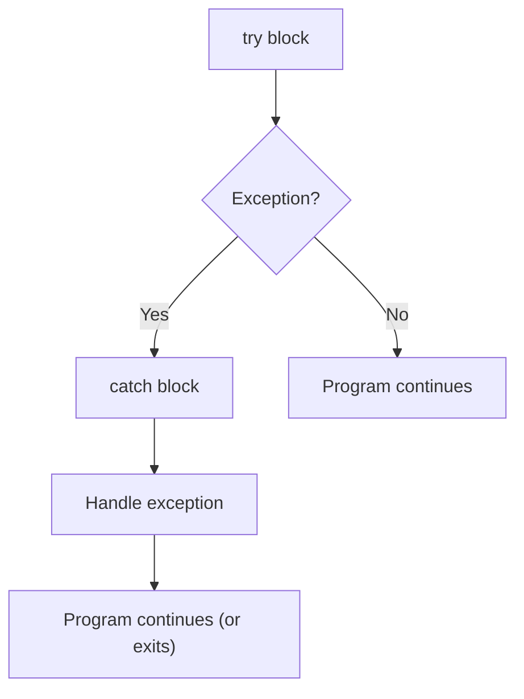

# <span style="color:#e67e22;">What we will learn in this post?</span>

<ul style='list-style-type: none; padding-left: 0;'>
<li><span style='color: #2980b9; font-size: 20px; font-weight: bold;'>👉</span> <span style='color: #2ecc71; font-size: 18px; font-weight: bold;'>C++ Exception Handling</span></li>
<li><span style='color: #2980b9; font-size: 20px; font-weight: bold;'>👉</span> <span style='color: #2ecc71; font-size: 18px; font-weight: bold;'>C++ Exception Handling using Classes</span></li>
<li><span style='color: #2980b9; font-size: 20px; font-weight: bold;'>👉</span> <span style='color: #2ecc71; font-size: 18px; font-weight: bold;'>C++ Stack Unwinding</span></li>
<li><span style='color: #2980b9; font-size: 20px; font-weight: bold;'>👉</span> <span style='color: #2ecc71; font-size: 18px; font-weight: bold;'>C++ User-Defined Exceptions</span></li>
<li><span style='color: #2980b9; font-size: 20px; font-weight: bold;'>👉</span> <span style='color: #2ecc71; font-size: 18px; font-weight: bold;'>Conclusion!</span></li>
</ul>

# <span style="color:#e67e22">Exception Handling in C++: A Friendly Guide 🤗</span>

Exception handling is a crucial mechanism in C++ that helps your programs gracefully handle unexpected events (errors) during execution. Instead of crashing, your program can catch these errors and respond appropriately, preventing data corruption and improving user experience.

## <span style="color:#2980b9">Why is it Important? 🤔</span>

Imagine your program trying to open a file that doesn't exist. Without exception handling, it would likely crash. With exception handling, you can gracefully inform the user of the problem and perhaps offer a way to fix it. This makes your program more _robust_ and _user-friendly_.

## <span style="color:#2980b9">How it Works ⚙️</span>

Exception handling involves three keywords:

- `try`: The code that _might_ throw an exception is placed inside a `try` block.
- `catch`: If an exception occurs in the `try` block, the corresponding `catch` block handles it. You can have multiple `catch` blocks to handle different exception types.
- `throw`: This keyword is used to _signal_ that an exception has occurred.

### <span style="color:#8e44ad">Example Scenario</span>

```c++
#include <iostream>
#include <fstream>

int main() {
  try {
    std::ifstream file("my_file.txt");  // Might throw an exception if file not found
    // ...process the file...
  } catch (const std::ifstream::failure& e) {
    std::cerr << "Error opening file: " << e.what() << std::endl;
  }
  return 0;
}
```

This code attempts to open a file. If it fails (e.g., the file doesn't exist), a `std::ifstream::failure` exception is thrown, and the `catch` block handles it, displaying an error message.

## <span style="color:#2980b9">Flowchart 📊</span>



For more in-depth information, check out these resources:

- [cppreference.com Exception Handling](https://en.cppreference.com/w/cpp/language/exceptions)

Remember, exception handling is your friend! It helps you create more stable and reliable C++ programs. 😉

# <span style="color:#e67e22">Handling Exceptions with C++ Classes 🤝</span>

C++ exception handling makes your code more robust. Instead of relying only on built-in exceptions, creating custom exception classes gives you more control and clarity.

## <span style="color:#2980b9">Creating Custom Exception Classes</span>

Let's build a custom exception for file errors:

```cpp
#include <iostream>
#include <string>

class FileError : public std::exception {
public:
    FileError(const std::string& message) : message_(message) {}
    const char* what() const noexcept override { return message_.c_str(); }
private:
    std::string message_;
};

int main() {
    try {
        // ... some file operation ...
        throw FileError("Couldn't open the file!");
    } catch (const FileError& e) {
        std::cerr << "File Error: " << e.what() << std::endl;
    }
    return 0;
}
```

### <span style="color:#8e44ad">Explanation 💡</span>

- We inherit from `std::exception`.
- The constructor takes an error message.
- `what()` returns the message.

## <span style="color:#2980b9">Another Example: Network Error 🌐</span>

```cpp
class NetworkError : public std::exception {
public:
  NetworkError(const std::string& msg) : message(msg) {}
  const char* what() const noexcept override { return message.c_str(); }
private:
  std::string message;
};
```

This follows the same pattern, creating a specific exception type for network issues. You can tailor the message to provide more specific details.

## <span style="color:#2980b9">Why Use Custom Exceptions? 🤔</span>

- **Improved Error Handling:** Makes catching and handling specific errors easier.
- **Better Code Readability:** Clearer error messages improve debugging.
- **Maintainability:** Easier to extend and modify error handling as your project grows.

**Pro Tip:** Always provide informative error messages in your custom exceptions. This helps significantly during debugging!

**Resources:**

- [CppReference: Exception Handling](https://en.cppreference.com/w/cpp/language/exceptions)

This structured approach lets you effectively manage exceptions, making your C++ code more robust and maintainable. Remember to choose descriptive names for your exceptions to improve readability. Good luck! 🎉

# <span style="color:#e67e22">Stack Unwinding in C++: A Friendly Explanation 🤸‍♀️</span>

Imagine you're building a tower of blocks (the _call stack_). Each block represents a function call. When something goes wrong (an exception occurs), C++ needs to clean up the mess – this is _stack unwinding_.

## <span style="color:#2980b9">What is Stack Unwinding?</span>

Stack unwinding is the process of systematically popping functions off the call stack when an exception is thrown. Think of it as carefully taking apart the block tower, one block at a time. This ensures that resources held by those functions (like memory or files) are properly released.

### <span style="color:#8e44ad">Example Scenario</span>

```c++
void func3() { throw std::runtime_error("Something went wrong!"); }

void func2() { func3(); }

void func1() { func2(); }

int main() {
  try {
    func1();
  } catch (const std::runtime_error& error) {
    std::cerr << "Caught exception: " << error.what() << std::endl;
  }
  return 0;
}
```

When `func3()` throws an exception, the program doesn't just crash. Instead:

1. `func3()`'s stack frame is removed.
2. Control jumps to `func2()`'s `catch` block (if present), or continues unwinding.
3. `func2()`'s stack frame is removed.
4. This continues until a `catch` block handles the exception or the program terminates.

## <span style="color:#2980b9">Why is it Important?</span>

- **Resource Management:** Prevents memory leaks and other resource issues.
- **Error Handling:** Allows for graceful error recovery.
- **Program Stability:** Avoids unexpected crashes.

**Diagram:**

```mermaid
graph TD
    A[main()] --> B(func1());
    B --> C(func2());
    C --> D{func3() throws};
    D --> E[Exception Handling];
    style D fill:#f9f,stroke:#333,stroke-width:2px
```

For more in-depth information, refer to: [cppreference Exception Handling](https://en.cppreference.com/w/cpp/language/exceptions)

Stack unwinding is crucial for writing robust and reliable C++ applications. It allows for controlled error handling, making your programs less prone to crashes and easier to debug. 💖

# <span style="color:#e67e22">Creating Custom Exceptions in C++ 🎉</span>

C++ allows you to create your own exception classes, extending its built-in exception handling mechanism. This is super useful for making your code more readable and maintainable.

## <span style="color:#2980b9">Why Custom Exceptions? 🤔</span>

- **Improved Error Handling:** Instead of generic error codes, custom exceptions provide _meaningful_ error messages specific to your application's logic. This makes debugging much easier.
- **Better Code Organization:** Grouping related errors under custom exception classes improves code structure and readability.
- **Enhanced Maintainability:** Changes to your error handling are localized within your custom exception classes.

## <span style="color:#2980b9">How to Create Them 🛠️</span>

### <span style="color:#8e44ad">Example: `InvalidInputException`</span>

Let's create an exception for invalid user input:

```cpp
#include <exception>
#include <string>

class InvalidInputException : public std::exception {
public:
  InvalidInputException(const std::string& message) : message_(message) {}
  const char* what() const noexcept override { return message_.c_str(); }
private:
  std::string message_;
};

int main() {
  try {
    // ... some code that might throw an exception ...
    throw InvalidInputException("Input value is out of range!");
  } catch (const InvalidInputException& e) {
    std::cerr << "Error: " << e.what() << std::endl;
  }
  return 0;
}
```

This defines `InvalidInputException`, inheriting from `std::exception`. The `what()` method provides the error message. Remember to include `<exception>` and `<string>`.

## <span style="color:#2980b9">Advantages Summarized 🏆</span>

- **Clarity:** Makes error messages much clearer.
- **Maintainability:** Isolates error handling logic.
- **Extensibility:** Easily add new exception types as needed.

For more in-depth information, check out these resources:

- [cppreference.com](https://en.cppreference.com/w/cpp/error) (for comprehensive C++ error handling documentation)

This simple example shows how easy it is to enhance your C++ error handling using custom exceptions! Remember to always strive for clean, maintainable code. ✨

<h1><span style='color:#e67e22'>Conclusion</span></h1>

So there you have it! We've covered a lot of ground today, and hopefully, you found it helpful and informative. 😊 We're always striving to improve, and your thoughts are super valuable to us! What did you think? Anything you'd like to add? Let us know your comments, feedback, or suggestions down below in the comments section – we'd love to hear from you! 👇💬🎉
