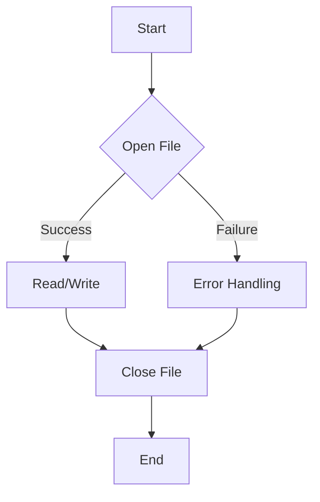

# <span style="color:#e67e22;">What we will learn in this post?</span>

<ul style='list-style-type: none; padding-left: 0;'>
<li><span style='color: #2980b9; font-size: 20px; font-weight: bold;'>👉</span> <span style='color: #2ecc71; font-size: 18px; font-weight: bold;'>C++ Files and Streams</span></li>
<li><span style='color: #2980b9; font-size: 20px; font-weight: bold;'>👉</span> <span style='color: #2ecc71; font-size: 18px; font-weight: bold;'>C++ I/O Redirection</span></li>
<li><span style='color: #2980b9; font-size: 20px; font-weight: bold;'>👉</span> <span style='color: #2ecc71; font-size: 18px; font-weight: bold;'>Conclusion!</span></li>
</ul>

# <span style="color:#e67e22">Files and Streams in C++ 📁</span>

## <span style="color:#2980b9">Understanding Files</span>

Files are containers for storing data persistently on your computer's storage. Think of them like digital drawers where you can keep information. In C++, we use _streams_ to interact with these files.

### <span style="color:#8e44ad">What are Streams?</span>

Streams are sequences of data. They act as intermediaries between your program and the file. There are two main types:

- **Input streams:** Read data _from_ a file (like reading from a book).
- **Output streams:** Write data _to_ a file (like writing in a notebook).

## <span style="color:#2980b9">File Input/Output (I/O) ✍️</span>

To work with files, you'll need the `<fstream>` header. Here's how to do basic file I/O:

```c++
#include <fstream>
#include <iostream>
#include <string>

int main() {
  //Writing to a file
  std::ofstream outfile("my_file.txt");
  outfile << "Hello, file!\n";
  outfile.close();

  //Reading from a file
  std::ifstream infile("my_file.txt");
  std::string line;
  std::getline(infile, line);
  std::cout << line << std::endl; //Outputs "Hello, file!"
  infile.close();
  return 0;
}
```

Remember to always close your files using `.close()` to prevent data loss! Error handling (checking if the file opened successfully) is crucial in real-world applications.

## <span style="color:#2980b9">Further Learning 🚀</span>

For more detailed information and advanced techniques (like handling errors, different file modes, and binary files), check out these resources:

- [CppReference](https://en.cppreference.com/w/cpp/io) - A comprehensive C++ reference.
- [LearnCpp.com](https://www.learncpp.com/) - A great tutorial site for learning C++.

This is a simplified explanation. File handling can get more complex, but this gives you a solid foundation. Happy coding! 😊

# <span style="color:#e67e22">I/O Redirection in C++: A Friendly Guide 😊</span>

C++ lets you change where your program gets its input from and sends its output to, a process called I/O redirection. Instead of the usual keyboard and screen, you can use files!

## <span style="color:#2980b9">Redirecting Input ➡️</span>

### <span style="color:#8e44ad">Reading from a File</span>

To read input from a file, you use an `ifstream` object.

```c++
#include <fstream>
#include <iostream>

int main() {
  std::ifstream inputFile("my_file.txt");
  std::string line;
  while (std::getline(inputFile, line)) {
    std::cout << line << std::endl;
  }
  inputFile.close();
  return 0;
}
```

This code reads each line from `my_file.txt` and prints it to the console. _Remember to handle potential file opening errors!_

## <span style="color:#2980b9">Redirecting Output 📤</span>

### <span style="color:#8e44ad">Writing to a File</span>

For writing to a file, use an `ofstream` object.

```c++
#include <fstream>
#include <iostream>

int main() {
  std::ofstream outputFile("my_output.txt");
  outputFile << "Hello, file!\n";
  outputFile << "This is written to a file.";
  outputFile.close();
  return 0;
}
```

This writes two lines of text to `my_output.txt`. Again, _error handling is crucial_.

## <span style="color:#2980b9">Example Flowchart</span>



**Key Points:**

- Use `ifstream` for input redirection.
- Use `ofstream` for output redirection.
- Always check for file opening errors.
- Remember to close files using `.close()` to free resources.

For more information, check out these resources: [LearnCpp.com](https://www.learncpp.com/) (search for "file I/O") and [cplusplus.com](https://www.cplusplus.com/) (search for "fstream").

<h1><span style='color:#e67e22'>Conclusion</span></h1>

So there you have it! We've covered a lot of ground today, and hopefully, you found it helpful and insightful. 😊 But the conversation doesn't end here! We'd love to hear your thoughts, opinions, and any brilliant ideas you might have. Did we miss anything? Do you have any questions? Let us know in the comments below! 👇 We're excited to hear from you and continue the discussion. Let's chat! 💬
